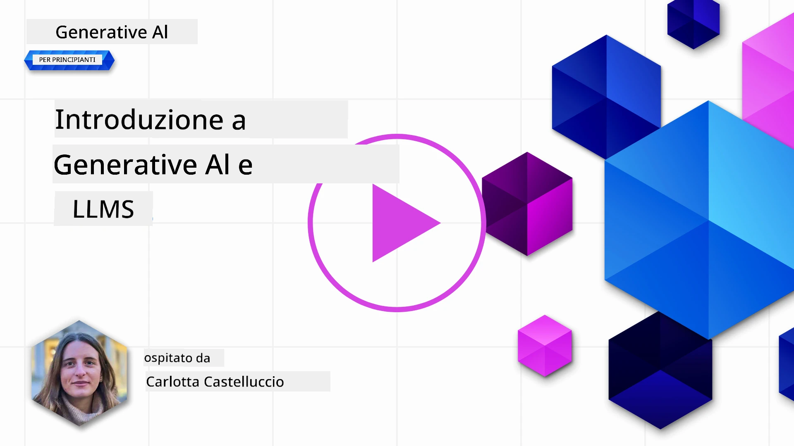
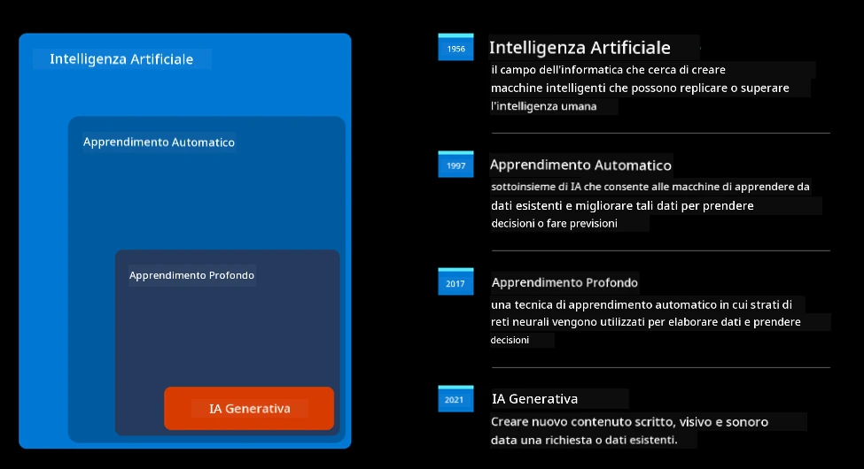
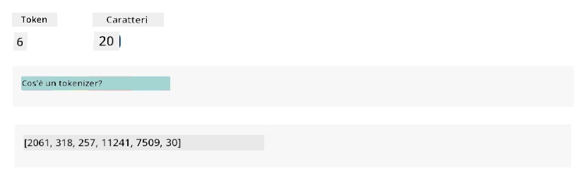
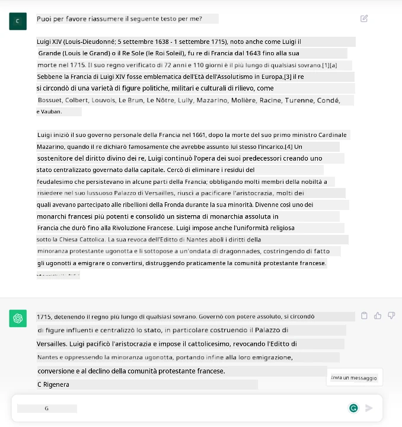
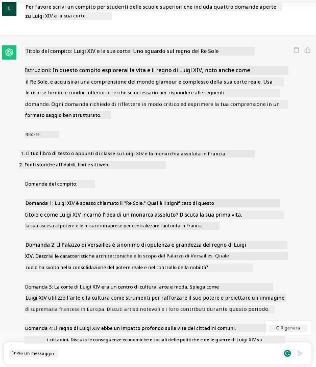
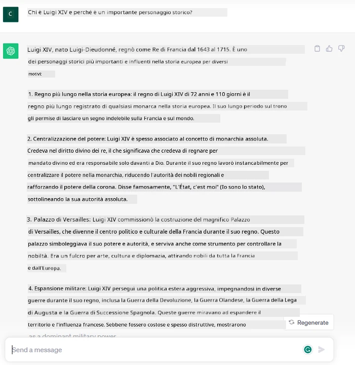
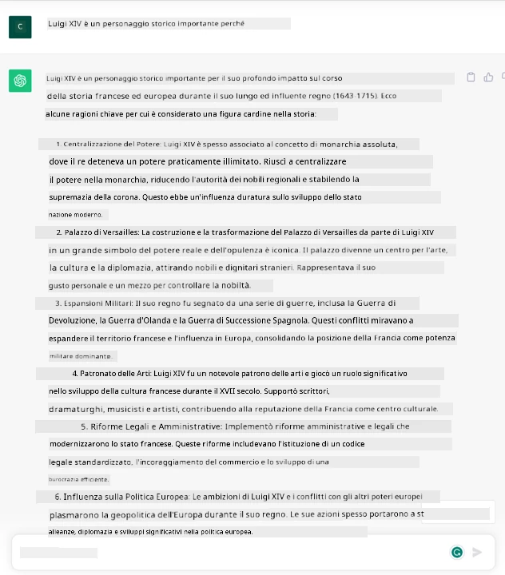
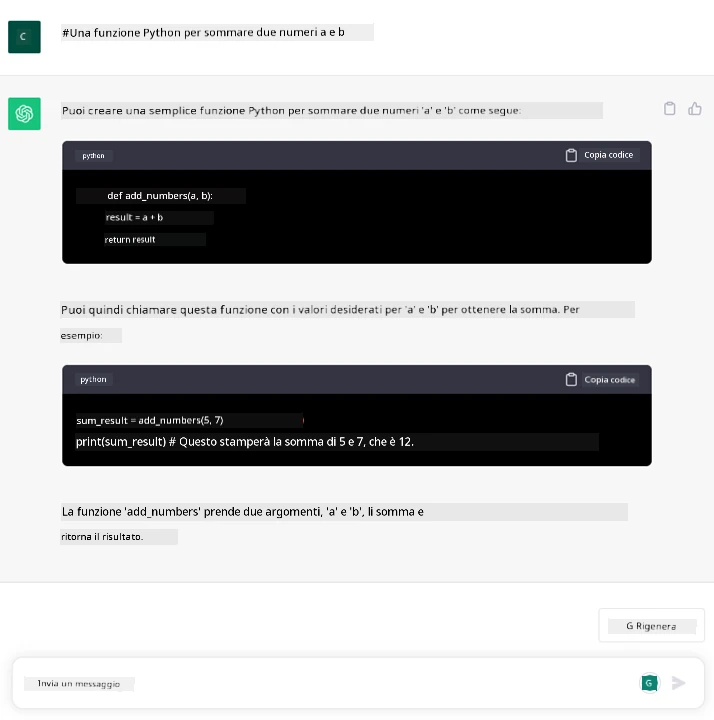

# Introduzione all'Intelligenza Artificiale Generativa e ai Grandi Modelli di Linguaggio

_(Clicca sull'immagine sopra per visualizzare il video di questa lezione)_

L'Intelligenza Artificiale Generativa è un'intelligenza artificiale capace di generare testo, immagini e altri tipi di contenuti. Ciò che la rende una tecnologia fantastica è che democratizza l'IA, chiunque può usarla con solo un prompt testuale, una frase scritta in linguaggio naturale. Non c’è bisogno di imparare un linguaggio come Java o SQL per ottenere qualcosa di utile, tutto ciò che serve è usare la propria lingua, esprimere ciò che si vuole e ne esce una suggestione da un modello di intelligenza artificiale. Le applicazioni e l'impatto sono enormi, puoi scrivere o comprendere rapporti, scrivere applicazioni e molto altro, tutto in pochi secondi.

In questo percorso formativo, esploreremo come la nostra startup sfrutta l'intelligenza artificiale generativa per sbloccare nuovi scenari nel mondo dell'istruzione e come affrontiamo le inevitabili sfide correlate alle implicazioni sociali dell'applicazione e ai limiti tecnologici.

## Introduzione

Questa lezione coprirà:

- Introduzione allo scenario aziendale: la nostra idea e missione di startup.
- L'Intelligenza Artificiale Generativa e come siamo arrivati all'attuale panorama tecnologico.
- Il funzionamento interno di un grande modello di linguaggio.
- Principali capacità e casi d'uso pratici dei Grandi Modelli di Linguaggio.

## Obiettivi di Apprendimento

Al completamento di questa lezione, comprenderai:

- Cos'è l'intelligenza artificiale generativa e come funzionano i Grandi Modelli di Linguaggio.
- Come puoi sfruttare i grandi modelli di linguaggio per diversi casi d'uso, con un focus sugli scenari educativi.

## Scenario: la nostra startup educativa

L'Intelligenza Artificiale Generativa rappresenta l'apice della tecnologia IA, superando i confini di ciò che una volta si pensava impossibile. I modelli di AI generativa hanno varie capacità e applicazioni, ma in questo percorso esploreremo come stiano rivoluzionando l'istruzione tramite una startup fittizia. Ci riferiremo a questa startup come _la nostra startup_. La nostra startup opera nel settore educativo con la missione ambiziosa di

> _migliorare l'accessibilità nell'apprendimento, su scala globale, garantendo un accesso equo all'istruzione e offrendo esperienze di apprendimento personalizzate per ogni studente, secondo le loro esigenze_.

Il nostro team è consapevole che non potremo raggiungere questo obiettivo senza sfruttare uno degli strumenti più potenti dei tempi moderni – i Grandi Modelli di Linguaggio (LLM).

Si prevede che l'Intelligenza Artificiale Generativa rivoluzionerà il modo in cui impariamo e insegniamo oggi, con studenti che hanno a disposizione insegnanti virtuali 24 ore su 24 che forniscono grandi quantità di informazioni ed esempi, e insegnanti che possono utilizzare strumenti innovativi per valutare i loro studenti e fornire feedback.

Per cominciare, definiamo alcuni concetti e terminologie di base che useremo durante tutto il percorso.

## Come siamo arrivati all'Intelligenza Artificiale Generativa?

Nonostante l'eccezionale _hype_ creato ultimamente dall'annuncio dei modelli di intelligenza artificiale generativa, questa tecnologia è in sviluppo da decenni, con i primi sforzi di ricerca che risalgono agli anni ’60. Ora siamo a un punto in cui l'IA ha capacità cognitive umane, come la conversazione, dimostrata ad esempio da [OpenAI ChatGPT](https://openai.com/chatgpt) o [Microsoft Copilot](https://copilot.microsoft.com/?WT.mc_id=academic-105485-koreyst), che usa anch’esso un modello GPT per la sua esperienza conversazionale di ricerca web.

Tornando un po' indietro, i primissimi prototipi di IA erano chatbot scritti a macchina, basati su una base di conoscenza estratta da un gruppo di esperti e rappresentata in un computer. Le risposte nella base di conoscenza venivano attivate da parole chiave presenti nel testo di input.
Tuttavia, divenne presto chiaro che un tale approccio, usando chatbot scritti a macchina, non era scalabile.

### Un approccio statistico all'IA: Machine Learning

Un punto di svolta arrivò negli anni ’90, con l'applicazione di un approccio statistico all'analisi testuale. Questo portò allo sviluppo di nuovi algoritmi – noti come machine learning – capaci di imparare modelli dai dati senza essere programmati esplicitamente. Questo approccio permette alle macchine di simulare la comprensione del linguaggio umano: un modello statistico è addestrato su coppie testo-etichetta, consentendo al modello di classificare testi sconosciuti con un’etichetta predefinita che rappresenta l’intenzione del messaggio.

### Reti neurali e assistenti virtuali moderni

Negli ultimi anni, l'evoluzione tecnologica dell’hardware, capace di gestire quantità maggiori di dati e calcoli più complessi, ha incentivato la ricerca nell'IA, portando allo sviluppo di algoritmi avanzati di machine learning noti come reti neurali o algoritmi di deep learning.

Le reti neurali (in particolare le Reti Neurali Ricorrenti – RNN) hanno migliorato significativamente l'elaborazione del linguaggio naturale, permettendo di rappresentare il significato del testo in modo più significativo, valorizzando il contesto di una parola in una frase.

Questa è la tecnologia che ha alimentato gli assistenti virtuali nati nel primo decennio del nuovo secolo, molto abili nell'interpretare il linguaggio umano, identificare un bisogno e compiere un'azione per soddisfarlo – come rispondere con uno script predefinito o utilizzare un servizio di terze parti.

### AI Generativa oggi

Ecco quindi come siamo arrivati all'IA Generativa attuale, che può essere vista come un sottoinsieme del deep learning.

Dopo decenni di ricerca nel campo dell'IA, una nuova architettura di modello – chiamata _Trasformatore_ – ha superato i limiti delle RNN, potendo gestire sequenze di testo molto più lunghe come input. I Trasformatori si basano sul meccanismo di attenzione, che permette al modello di assegnare pesi diversi agli input ricevuti, “prestando maggiore attenzione” dove si concentra l’informazione più rilevante, indipendentemente dal loro ordine nella sequenza di testo.

La maggior parte dei recenti modelli di IA generativa – noti anche come Grandi Modelli di Linguaggio (LLM), poiché lavorano con input e output testuali – si basa infatti su questa architettura. Ciò che è interessante di questi modelli – addestrati su un’enorme quantità di dati non etichettati provenienti da fonti diverse come libri, articoli e siti web – è che possono essere adattati a una vasta gamma di compiti e generare testo grammaticalmente corretto con un'apparenza di creatività. Quindi, non solo hanno migliorato incredibilmente la capacità di una macchina di “comprendere” un testo in input, ma hanno anche abilitato la capacità di generare una risposta originale in linguaggio umano.

## Come funzionano i grandi modelli di linguaggio?

Nel capitolo successivo esploreremo diversi tipi di modelli di IA generativa, ma per ora diamo un'occhiata a come funzionano i grandi modelli di linguaggio, con un focus sui modelli OpenAI GPT (Generative Pre-trained Transformer).

- **Tokenizer, da testo a numeri**: I Grandi Modelli di Linguaggio ricevono un testo in input e generano un testo in output. Tuttavia, essendo modelli statistici, lavorano molto meglio con i numeri che con sequenze di testo. Per questo ogni input al modello viene processato da un tokenizer, prima di essere utilizzato dal modello principale. Un token è un pezzo di testo – costituito da un numero variabile di caratteri, quindi il compito principale del tokenizer è dividere l’input in un array di token. Poi, ogni token è mappato con un indice token, che è la codifica intera del pezzo di testo originale.

- **Previsione dei token di output**: Dati n token come input (con un massimo n che varia da modello a modello), il modello è in grado di prevedere un token in output. Questo token viene quindi incorporato nell’input della iterazione successiva, in un pattern a finestra in espansione, consentendo un’esperienza utente migliore nell’ottenere una (o più) frase come risposta. Questo spiega perché, se hai mai usato ChatGPT, potresti aver notato che a volte sembra fermarsi nel mezzo di una frase.

- **Processo di selezione, distribuzione di probabilità**: Il token di output è scelto dal modello in base alla sua probabilità di comparire dopo la sequenza di testo corrente. Questo perché il modello prevede una distribuzione di probabilità su tutti i possibili ‘token successivi’, calcolata in base al suo addestramento. Tuttavia, non sempre viene scelto il token con la probabilità più alta dalla distribuzione risultante. Viene aggiunto un grado di casualità a questa scelta, in modo che il modello agisca in modo non deterministico - non otteniamo la stessa identica risposta per lo stesso input. Questo grado di casualità viene aggiunto per simulare il processo del pensiero creativo e può essere regolato utilizzando un parametro del modello chiamato temperatura.

## Come può la nostra startup sfruttare i Grandi Modelli di Linguaggio?

Ora che abbiamo una migliore comprensione del funzionamento interno di un grande modello di linguaggio, vediamo alcuni esempi pratici dei compiti più comuni che possono svolgere piuttosto bene, con uno sguardo al nostro scenario di business.
Abbiamo detto che la principale capacità di un Grande Modello di Linguaggio è _generare un testo da zero, partendo da un input testuale, scritto in linguaggio naturale_.

Ma che tipo di input e output testuale?
L'input di un grande modello di linguaggio è noto come prompt, mentre l'output è noto come completion, termine che si riferisce al meccanismo del modello di generare il token successivo per completare l’input corrente. Approfondiremo cosa sia un prompt e come progettarlo per ottenere il massimo dal nostro modello. Per ora, diciamo solo che un prompt può includere:

- Una **istruzione** che specifica il tipo di output che ci aspettiamo dal modello. Questa istruzione a volte può includere esempi o dati aggiuntivi.

  1. Riepilogo di un articolo, libro, recensioni di prodotti e altro, insieme all'estrazione di informazioni da dati non strutturati.
    
    
  
  2. Ideazione creativa e progettazione di un articolo, un saggio, un compito o altro.
      
     

- Una **domanda**, posta sotto forma di conversazione con un agente.
  
  

- Un pezzo di **testo da completare**, che implicitamente è una richiesta di assistenza nella scrittura.
  
  

- Un pezzo di **codice** insieme alla richiesta di spiegarlo e documentarlo, o un commento che chiede di generare un codice per svolgere un compito specifico.
  
  

Gli esempi sopra sono piuttosto semplici e non intendono essere una dimostrazione esaustiva delle capacità dei Grandi Modelli di Linguaggio. Sono pensati per mostrare il potenziale dell'uso dell'intelligenza artificiale generativa, in particolare ma non solo nei contesti educativi.

Inoltre, l'output di un modello di intelligenza artificiale generativa non è perfetto e a volte la creatività del modello può giocare contro di esso, risultando in un output che è una combinazione di parole che l’utente umano può interpretare come una mistificazione della realtà o può essere offensivo. L'IA Generativa non è intelligente - almeno non nella definizione più ampia di intelligenza, che include ragionamento critico e creativo o intelligenza emotiva; non è deterministica, e non è affidabile, poiché fabbricazioni, come riferimenti errati, contenuti e affermazioni, possono essere combinati con informazioni corrette e presentati in modo persuasivo e sicuro. Nelle lezioni successive tratteremo tutte queste limitazioni e vedremo cosa possiamo fare per mitigarle.

## Compito

Il tuo compito è approfondire [l'intelligenza artificiale generativa](https://en.wikipedia.org/wiki/Generative_artificial_intelligence?WT.mc_id=academic-105485-koreyst) e cercare di identificare un’area in cui aggiungeresti oggi l'intelligenza artificiale generativa dove non è presente. In che modo l’impatto sarebbe diverso dal farlo nel “modo vecchio”, puoi fare qualcosa che prima non potevi, o sei più veloce? Scrivi un riassunto di 300 parole su come sarebbe la tua startup AI dei sogni includendo titoli come "Problema", "Come userei l'IA", "Impatto" e opzionalmente un piano aziendale.

Se hai svolto questo compito, potresti essere anche pronto a candidarti all'incubatore Microsoft, [Microsoft for Startups Founders Hub](https://www.microsoft.com/startups?WT.mc_id=academic-105485-koreyst) offriamo crediti per Azure, OpenAI, mentoring e molto altro, dai un’occhiata!

## Verifica delle conoscenze

Cosa è vero riguardo ai grandi modelli di linguaggio?

1. Si ottiene sempre la stessa risposta esatta ogni volta.
1. Fa le cose perfettamente, ottimo ad aggiungere numeri, produrre codice funzionante ecc.
1. La risposta può variare anche usando lo stesso prompt. È anche ottimo per darti una prima bozza di qualcosa, sia esso testo o codice. Ma devi migliorare i risultati.

A: 3, un LLM è non deterministico, la risposta varia, comunque puoi controllare la sua varianza tramite l'impostazione della temperatura. Non dovresti neanche aspettarti che faccia le cose perfettamente, è qui per fare il lavoro pesante per te, il che spesso significa che ottieni un buon primo tentativo che poi devi migliorare gradualmente.

## Ottimo lavoro! Continua il percorso

Dopo aver completato questa lezione, dai un’occhiata alla nostra [collezione di apprendimento sull'Intelligenza Artificiale Generativa](https://aka.ms/genai-collection?WT.mc_id=academic-105485-koreyst) per continuare a migliorare le tue conoscenze!

Vai alla Lezione 2 dove esploreremo come [esplorare e confrontare diversi tipi di LLM](../02-exploring-and-comparing-different-llms/README.md?WT.mc_id=academic-105485-koreyst)!

---

<!-- CO-OP TRANSLATOR DISCLAIMER START -->
**Disclaimer**:
Questo documento è stato tradotto utilizzando il servizio di traduzione AI [Co-op Translator](https://github.com/Azure/co-op-translator). Sebbene ci impegniamo per garantire la precisione, si prega di notare che le traduzioni automatizzate possono contenere errori o imprecisioni. Il documento originale nella sua lingua nativa deve essere considerato la fonte autorevole. Per informazioni critiche, si raccomanda una traduzione professionale effettuata da un essere umano. Non siamo responsabili per eventuali malintesi o interpretazioni errate derivanti dall’uso di questa traduzione.
<!-- CO-OP TRANSLATOR DISCLAIMER END -->