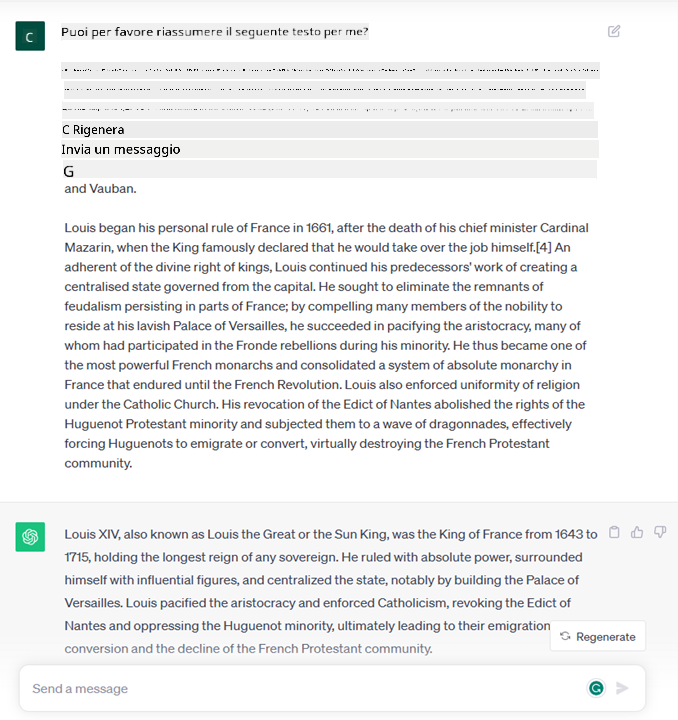
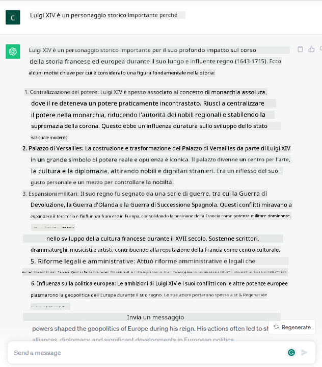

<!--
CO_OP_TRANSLATOR_METADATA:
{
  "original_hash": "f53ba0fa49164f9323043f1c6b11f2b1",
  "translation_date": "2025-07-09T07:51:30+00:00",
  "source_file": "01-introduction-to-genai/README.md",
  "language_code": "it"
}
-->
# Introduzione all’Intelligenza Artificiale Generativa e ai Large Language Models

_(Clicca sull’immagine sopra per vedere il video di questa lezione)_

L’Intelligenza Artificiale Generativa è un’intelligenza artificiale in grado di generare testo, immagini e altri tipi di contenuti. Ciò che la rende una tecnologia straordinaria è che democratizza l’IA: chiunque può usarla con un semplice prompt testuale, una frase scritta in linguaggio naturale. Non è necessario imparare linguaggi come Java o SQL per ottenere risultati significativi, basta usare la propria lingua, esprimere ciò che si desidera e ricevere una proposta da un modello di IA. Le applicazioni e l’impatto sono enormi: puoi scrivere o comprendere report, creare applicazioni e molto altro, tutto in pochi secondi.

In questo percorso formativo esploreremo come la nostra startup sfrutta l’IA generativa per aprire nuovi scenari nel mondo dell’educazione e come affrontiamo le inevitabili sfide legate alle implicazioni sociali della sua applicazione e ai limiti tecnologici.

## Introduzione

Questa lezione tratterà:

- Introduzione allo scenario di business: l’idea e la missione della nostra startup.
- L’IA generativa e come siamo arrivati all’attuale panorama tecnologico.
- Il funzionamento interno di un large language model.
- Le principali capacità e casi d’uso pratici dei Large Language Models.

## Obiettivi di apprendimento

Al termine di questa lezione, comprenderai:

- Cos’è l’IA generativa e come funzionano i Large Language Models.
- Come puoi sfruttare i large language models per diversi casi d’uso, con un focus sugli scenari educativi.

## Scenario: la nostra startup educativa

L’Intelligenza Artificiale Generativa rappresenta l’apice della tecnologia IA, spingendo oltre i limiti di ciò che una volta si riteneva impossibile. I modelli di IA generativa hanno molte capacità e applicazioni, ma in questo percorso esploreremo come stanno rivoluzionando l’educazione attraverso una startup immaginaria. La chiameremo _la nostra startup_. La nostra startup opera nel settore educativo con la missione ambiziosa di

> _migliorare l’accessibilità all’apprendimento su scala globale, garantendo un accesso equo all’istruzione e offrendo esperienze di apprendimento personalizzate a ogni studente, in base alle sue esigenze_.

Il team della nostra startup è consapevole che non potremo raggiungere questo obiettivo senza sfruttare uno degli strumenti più potenti dei tempi moderni – i Large Language Models (LLM).

L’IA generativa è destinata a rivoluzionare il modo in cui oggi impariamo e insegniamo, con studenti che hanno a disposizione insegnanti virtuali 24 ore su 24, capaci di fornire grandi quantità di informazioni ed esempi, e insegnanti che possono utilizzare strumenti innovativi per valutare i propri studenti e fornire feedback.

Per cominciare, definiamo alcuni concetti e termini base che useremo durante tutto il percorso.

## Come siamo arrivati all’Intelligenza Artificiale Generativa?

Nonostante l’enorme _hype_ creato recentemente dall’annuncio dei modelli di IA generativa, questa tecnologia è frutto di decenni di sviluppo, con i primi studi risalenti agli anni ’60. Oggi siamo arrivati a un punto in cui l’IA possiede capacità cognitive umane, come la conversazione, dimostrato ad esempio da [OpenAI ChatGPT](https://openai.com/chatgpt) o [Bing Chat](https://www.microsoft.com/edge/features/bing-chat?WT.mc_id=academic-105485-koreyst), che utilizza un modello GPT per le conversazioni di ricerca web su Bing.

Facendo un passo indietro, i primissimi prototipi di IA erano chatbot a risposta fissa, basati su una base di conoscenza estratta da un gruppo di esperti e rappresentata in un computer. Le risposte nella base di conoscenza venivano attivate da parole chiave presenti nel testo di input. Tuttavia, ben presto si capì che questo approccio, basato su chatbot a risposta fissa, non era scalabile.

### Un approccio statistico all’IA: il Machine Learning

Un punto di svolta arrivò negli anni ’90, con l’applicazione di un approccio statistico all’analisi del testo. Questo portò allo sviluppo di nuovi algoritmi – noti come machine learning – capaci di apprendere schemi dai dati senza essere programmati esplicitamente. Questo approccio permette alle macchine di simulare la comprensione del linguaggio umano: un modello statistico viene addestrato su coppie testo-etichetta, permettendo al modello di classificare testi sconosciuti con un’etichetta predefinita che rappresenta l’intenzione del messaggio.

### Reti neurali e assistenti virtuali moderni

Negli ultimi anni, l’evoluzione tecnologica dell’hardware, capace di gestire quantità maggiori di dati e calcoli più complessi, ha stimolato la ricerca nell’IA, portando allo sviluppo di algoritmi avanzati di machine learning noti come reti neurali o deep learning.

Le reti neurali (in particolare le Recurrent Neural Networks – RNN) hanno migliorato significativamente il processamento del linguaggio naturale, permettendo di rappresentare il significato del testo in modo più efficace, valorizzando il contesto di una parola all’interno di una frase.

Questa è la tecnologia che ha alimentato gli assistenti virtuali nati nel primo decennio del nuovo secolo, molto abili nell’interpretare il linguaggio umano, identificare un bisogno e compiere un’azione per soddisfarlo – come rispondere con uno script predefinito o utilizzare un servizio di terze parti.

### Oggi, l’Intelligenza Artificiale Generativa

Ecco come siamo arrivati all’IA Generativa di oggi, che può essere vista come un sottoinsieme del deep learning.

Dopo decenni di ricerca nel campo dell’IA, una nuova architettura di modello – chiamata _Transformer_ – ha superato i limiti delle RNN, riuscendo a gestire sequenze di testo molto più lunghe in input. I Transformer si basano sul meccanismo di attenzione, che permette al modello di attribuire pesi diversi agli input ricevuti, “prestando più attenzione” dove si concentra l’informazione più rilevante, indipendentemente dall’ordine nella sequenza di testo.

La maggior parte dei recenti modelli di IA generativa – noti anche come Large Language Models (LLM), dato che lavorano con input e output testuali – si basa proprio su questa architettura. Ciò che è interessante di questi modelli – addestrati su enormi quantità di dati non etichettati provenienti da fonti diverse come libri, articoli e siti web – è che possono essere adattati a una vasta gamma di compiti e generare testo grammaticalmente corretto con un’apparente creatività. Quindi, non solo hanno migliorato incredibilmente la capacità di una macchina di “comprendere” un testo in input, ma hanno anche abilitato la capacità di generare una risposta originale in linguaggio umano.

## Come funzionano i large language models?

Nel prossimo capitolo esploreremo diversi tipi di modelli di IA generativa, ma per ora diamo un’occhiata a come funzionano i large language models, con un focus sui modelli OpenAI GPT (Generative Pre-trained Transformer).

- **Tokenizer, da testo a numeri**: I Large Language Models ricevono un testo in input e generano un testo in output. Tuttavia, essendo modelli statistici, lavorano molto meglio con numeri che con sequenze di testo. Per questo ogni input al modello viene elaborato da un tokenizer, prima di essere usato dal modello principale. Un token è un frammento di testo – composto da un numero variabile di caratteri, quindi il compito principale del tokenizer è dividere l’input in un array di token. Poi, ogni token viene associato a un indice token, che è la codifica intera del frammento di testo originale.

- **Predizione dei token di output**: Dati n token in input (con un massimo n che varia da modello a modello), il modello è in grado di predire un token in output. Questo token viene poi incorporato nell’input della successiva iterazione, in un pattern a finestra espandibile, permettendo un’esperienza utente migliore nel ricevere una (o più) frasi come risposta. Questo spiega perché, se hai mai usato ChatGPT, potresti aver notato che a volte sembra fermarsi a metà di una frase.

- **Processo di selezione, distribuzione di probabilità**: Il token di output viene scelto dal modello in base alla sua probabilità di comparire dopo la sequenza di testo corrente. Questo perché il modello predice una distribuzione di probabilità su tutti i possibili “token successivi”, calcolata in base al suo addestramento. Tuttavia, non sempre viene scelto il token con la probabilità più alta dalla distribuzione risultante. Viene aggiunto un grado di casualità a questa scelta, in modo che il modello agisca in modo non deterministico – non otteniamo la stessa risposta esatta per lo stesso input. Questo grado di casualità serve a simulare il processo del pensiero creativo e può essere regolato tramite un parametro del modello chiamato temperature.

## Come può la nostra startup sfruttare i Large Language Models?

Ora che abbiamo una migliore comprensione del funzionamento interno di un large language model, vediamo alcuni esempi pratici dei compiti più comuni che possono svolgere molto bene, con un occhio al nostro scenario di business. Abbiamo detto che la principale capacità di un Large Language Model è _generare un testo da zero, partendo da un input testuale scritto in linguaggio naturale_.

Ma che tipo di input e output testuali?
L’input di un large language model è noto come prompt, mentre l’output è chiamato completion, termine che si riferisce al meccanismo del modello di generare il token successivo per completare l’input corrente. Approfondiremo cosa sia un prompt e come progettarlo per ottenere il massimo dal modello. Per ora, diciamo che un prompt può includere:

- Un’**istruzione** che specifica il tipo di output che ci aspettiamo dal modello. Questa istruzione a volte può includere esempi o dati aggiuntivi.

  1. Sintesi di un articolo, libro, recensioni di prodotti e altro, insieme all’estrazione di insight da dati non strutturati.
    
    
  
  2. Ideazione creativa e progettazione di un articolo, un saggio, un compito o altro.
      
     

- Una **domanda**, posta sotto forma di conversazione con un agente.
  
  

- Un frammento di **testo da completare**, che implicitamente è una richiesta di assistenza nella scrittura.
  
  

- Un frammento di **codice** insieme alla richiesta di spiegarlo e documentarlo, o un commento che chiede di generare un pezzo di codice che svolga un compito specifico.
  
  

Gli esempi sopra sono piuttosto semplici e non intendono essere una dimostrazione esaustiva delle capacità dei Large Language Models. Servono a mostrare il potenziale dell’uso dell’IA generativa, in particolare ma non solo in contesti educativi.

Inoltre, l’output di un modello di IA generativa non è perfetto e a volte la creatività del modello può giocare contro, producendo un risultato che l’utente umano può interpretare come una mistificazione della realtà, o addirittura offensivo. L’IA generativa non è intelligente – almeno non nel senso più ampio di intelligenza, che include ragionamento critico e creativo o intelligenza emotiva; non è deterministica, e non è affidabile, poiché possono essere mescolate informazioni errate, come riferimenti sbagliati, contenuti e affermazioni, presentate in modo persuasivo e sicuro. Nelle lezioni successive affronteremo tutte queste limitazioni e vedremo cosa possiamo fare per mitigarle.

## Compito

Il tuo compito è approfondire la lettura su [generative AI](https://en.wikipedia.org/wiki/Generative_artificial_intelligence?WT.mc_id=academic-105485-koreyst) e provare a individuare un ambito in cui oggi aggiungeresti l’IA generativa dove ancora non è presente. In che modo l’impatto sarebbe diverso rispetto al “metodo tradizionale”? Puoi fare qualcosa che prima non potevi fare, o sei più veloce? Scrivi un riassunto di 300 parole su come sarebbe la tua startup AI ideale, includendo intestazioni come "Problema", "Come userei l’IA", "Impatto" e opzionalmente un piano aziendale.

Se svolgi questo compito, potresti essere pronto a candidarti all’incubatore di Microsoft, [Microsoft for Startups Founders Hub](https://www.microsoft.com/startups?WT.mc_id=academic-105485-koreyst) che offre crediti per Azure, OpenAI, mentoring e molto altro, dai un’occhiata!

## Verifica delle conoscenze

Cosa è vero riguardo ai large language models?

1. Ottieni sempre la stessa risposta esatta.
1. Fanno tutto perfettamente, ottimi nel sommare numeri, produrre codice funzionante ecc.
1. La risposta può variare anche usando lo stesso prompt. Sono anche ottimi per darti una prima bozza di qualcosa, sia testo che codice. Ma devi migliorare i risultati.

Risposta: 3, un LLM è non deterministico, la risposta varia, tuttavia puoi controllare questa variabilità tramite un’impostazione chiamata temperature. Non dovresti aspettarti che facciano tutto perfettamente, sono qui per fare il lavoro pesante per te, il che spesso significa che ottieni un buon primo tentativo che poi devi migliorare gradualmente.

## Ottimo lavoro! Continua il percorso

Dopo aver completato questa lezione, dai un’occhiata alla nostra [collezione di apprendimento sull’Intelligenza Artificiale Generativa](https://aka.ms/genai-collection?WT.mc_id=academic-105485-koreyst) per continuare a migliorare le tue conoscenze sull’IA generativa!
Vai alla Lezione 2 dove vedremo come [esplorare e confrontare diversi tipi di LLM](../02-exploring-and-comparing-different-llms/README.md?WT.mc_id=academic-105485-koreyst)!

**Disclaimer**:  
Questo documento è stato tradotto utilizzando il servizio di traduzione automatica [Co-op Translator](https://github.com/Azure/co-op-translator). Pur impegnandoci per garantire l’accuratezza, si prega di notare che le traduzioni automatiche possono contenere errori o imprecisioni. Il documento originale nella sua lingua nativa deve essere considerato la fonte autorevole. Per informazioni critiche, si raccomanda una traduzione professionale effettuata da un umano. Non ci assumiamo alcuna responsabilità per eventuali malintesi o interpretazioni errate derivanti dall’uso di questa traduzione.