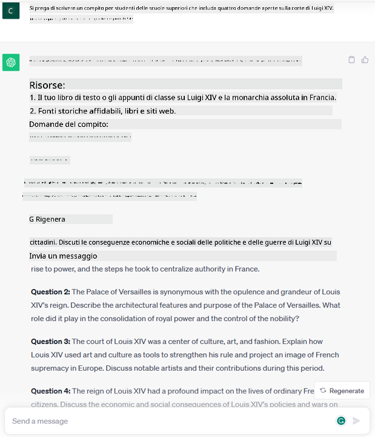
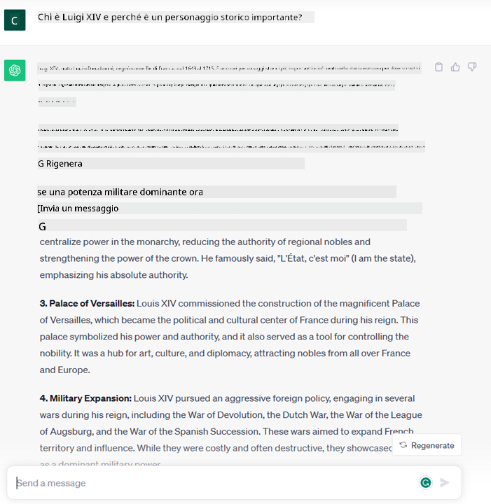
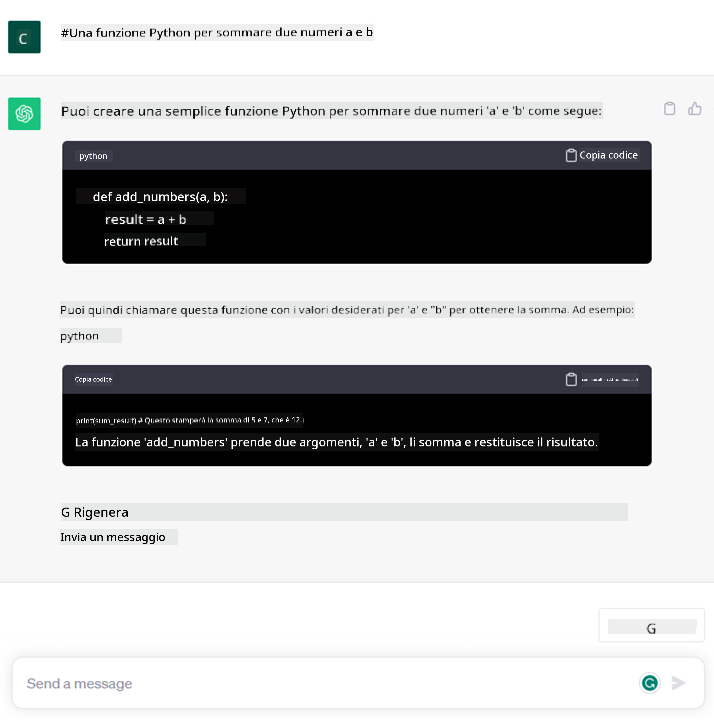

<!--
CO_OP_TRANSLATOR_METADATA:
{
  "original_hash": "bfb7901bdbece1ba3e9f35c400ca33e8",
  "translation_date": "2025-10-17T16:11:48+00:00",
  "source_file": "01-introduction-to-genai/README.md",
  "language_code": "it"
}
-->
# Introduzione all'AI Generativa e ai Modelli Linguistici di Grandi Dimensioni

_(Clicca sull'immagine sopra per vedere il video di questa lezione)_

L'AI generativa è un'intelligenza artificiale capace di generare testo, immagini e altri tipi di contenuti. Ciò che la rende una tecnologia straordinaria è che democratizza l'uso dell'AI: chiunque può utilizzarla con un semplice prompt testuale, una frase scritta in linguaggio naturale. Non è necessario imparare un linguaggio come Java o SQL per ottenere qualcosa di utile; basta usare il proprio linguaggio, esprimere ciò che si desidera e il modello AI fornisce un suggerimento. Le applicazioni e l'impatto di questa tecnologia sono enormi: puoi scrivere o comprendere report, creare applicazioni e molto altro, tutto in pochi secondi.

In questo curriculum, esploreremo come la nostra startup sfrutta l'AI generativa per sbloccare nuovi scenari nel mondo dell'educazione e come affrontiamo le inevitabili sfide legate alle implicazioni sociali della sua applicazione e ai limiti tecnologici.

## Introduzione

Questa lezione coprirà:

- Introduzione allo scenario aziendale: la nostra idea di startup e la nostra missione.
- AI generativa e come siamo arrivati all'attuale panorama tecnologico.
- Funzionamento interno di un modello linguistico di grandi dimensioni.
- Principali capacità e casi d'uso pratici dei Modelli Linguistici di Grandi Dimensioni.

## Obiettivi di apprendimento

Dopo aver completato questa lezione, comprenderai:

- Cos'è l'AI generativa e come funzionano i Modelli Linguistici di Grandi Dimensioni.
- Come puoi sfruttare i modelli linguistici di grandi dimensioni per diversi casi d'uso, con un focus sugli scenari educativi.

## Scenario: la nostra startup educativa

L'Intelligenza Artificiale Generativa rappresenta il culmine della tecnologia AI, spingendo i limiti di ciò che una volta si pensava impossibile. I modelli di AI generativa hanno diverse capacità e applicazioni, ma in questo curriculum esploreremo come stanno rivoluzionando l'educazione attraverso una startup fittizia. Ci riferiremo a questa startup come _la nostra startup_. La nostra startup opera nel settore dell'educazione con l'ambiziosa missione di

> _migliorare l'accessibilità all'apprendimento su scala globale, garantendo un accesso equo all'educazione e fornendo esperienze di apprendimento personalizzate a ogni studente, in base alle sue esigenze_.

Il team della nostra startup è consapevole che non sarà possibile raggiungere questo obiettivo senza sfruttare uno degli strumenti più potenti dei nostri tempi: i Modelli Linguistici di Grandi Dimensioni (LLM).

L'AI generativa è destinata a rivoluzionare il modo in cui impariamo e insegniamo oggi, con studenti che hanno a disposizione insegnanti virtuali 24 ore su 24, capaci di fornire enormi quantità di informazioni ed esempi, e insegnanti che possono sfruttare strumenti innovativi per valutare i loro studenti e fornire feedback.

Per iniziare, definiamo alcuni concetti e termini di base che utilizzeremo nel corso del curriculum.

## Come siamo arrivati all'AI Generativa?

Nonostante l'enorme _hype_ creato recentemente dall'annuncio dei modelli di AI generativa, questa tecnologia è frutto di decenni di lavoro, con i primi sforzi di ricerca risalenti agli anni '60. Siamo ora arrivati a un punto in cui l'AI possiede capacità cognitive umane, come la conversazione, come dimostrato ad esempio da [OpenAI ChatGPT](https://openai.com/chatgpt) o [Bing Chat](https://www.microsoft.com/edge/features/bing-chat?WT.mc_id=academic-105485-koreyst), che utilizza un modello GPT per le conversazioni di ricerca web Bing.

Facendo un passo indietro, i primissimi prototipi di AI consistevano in chatbot scritti a macchina, basati su una base di conoscenza estratta da un gruppo di esperti e rappresentata in un computer. Le risposte nella base di conoscenza venivano attivate da parole chiave presenti nel testo di input. Tuttavia, presto si è capito che un approccio del genere, utilizzando chatbot scritti a macchina, non era scalabile.

### Un approccio statistico all'AI: Machine Learning

Un punto di svolta è arrivato negli anni '90, con l'applicazione di un approccio statistico all'analisi del testo. Questo ha portato allo sviluppo di nuovi algoritmi – noti come machine learning – capaci di apprendere modelli dai dati senza essere esplicitamente programmati. Questo approccio consente alle macchine di simulare la comprensione del linguaggio umano: un modello statistico viene addestrato su coppie testo-etichetta, permettendo al modello di classificare un testo di input sconosciuto con un'etichetta predefinita che rappresenta l'intenzione del messaggio.

### Reti neurali e assistenti virtuali moderni

Negli ultimi anni, l'evoluzione tecnologica dell'hardware, capace di gestire quantità maggiori di dati e calcoli più complessi, ha incoraggiato la ricerca nell'AI, portando allo sviluppo di algoritmi avanzati di machine learning noti come reti neurali o algoritmi di deep learning.

Le reti neurali (e in particolare le Reti Neurali Ricorrenti – RNN) hanno significativamente migliorato l'elaborazione del linguaggio naturale, permettendo di rappresentare il significato del testo in modo più significativo, valorizzando il contesto di una parola in una frase.

Questa è la tecnologia che ha alimentato gli assistenti virtuali nati nel primo decennio del nuovo secolo, molto abili nell'interpretare il linguaggio umano, identificare un bisogno e compiere un'azione per soddisfarlo – come rispondere con uno script predefinito o utilizzare un servizio di terze parti.

### AI Generativa oggi

Ed è così che siamo arrivati all'AI generativa di oggi, che può essere vista come un sottogruppo del deep learning.

Dopo decenni di ricerca nel campo dell'AI, una nuova architettura di modelli – chiamata _Transformer_ – ha superato i limiti delle RNN, essendo in grado di gestire sequenze di testo molto più lunghe come input. I Transformer si basano sul meccanismo di attenzione, che consente al modello di attribuire pesi diversi agli input ricevuti, ‘prestando maggiore attenzione’ alle informazioni più rilevanti, indipendentemente dal loro ordine nella sequenza di testo.

La maggior parte dei recenti modelli di AI generativa – noti anche come Modelli Linguistici di Grandi Dimensioni (LLM), poiché lavorano con input e output testuali – si basa proprio su questa architettura. Ciò che è interessante di questi modelli – addestrati su enormi quantità di dati non etichettati provenienti da fonti diverse come libri, articoli e siti web – è che possono essere adattati a una vasta gamma di compiti e generare testo grammaticalmente corretto con una parvenza di creatività. Quindi, non solo hanno incredibilmente migliorato la capacità di una macchina di ‘comprendere’ un testo di input, ma hanno anche abilitato la capacità di generare una risposta originale in linguaggio umano.

## Come funzionano i modelli linguistici di grandi dimensioni?

Nel prossimo capitolo esploreremo diversi tipi di modelli di AI generativa, ma per ora diamo un'occhiata a come funzionano i modelli linguistici di grandi dimensioni, con un focus sui modelli OpenAI GPT (Generative Pre-trained Transformer).

- **Tokenizer, testo in numeri**: I Modelli Linguistici di Grandi Dimensioni ricevono un testo come input e generano un testo come output. Tuttavia, essendo modelli statistici, funzionano molto meglio con i numeri rispetto alle sequenze di testo. Ecco perché ogni input al modello viene elaborato da un tokenizer, prima di essere utilizzato dal modello principale. Un token è un frammento di testo – composto da un numero variabile di caratteri, quindi il compito principale del tokenizer è suddividere l'input in un array di token. Successivamente, ogni token viene mappato con un indice di token, che è la codifica intera del frammento di testo originale.

- **Predizione dei token di output**: Dati n token come input (con un massimo n che varia da un modello all'altro), il modello è in grado di prevedere un token come output. Questo token viene poi incorporato nell'input della successiva iterazione, in un pattern a finestra espandibile, consentendo una migliore esperienza utente nel ricevere una (o più) frase come risposta. Questo spiega perché, se hai mai provato ChatGPT, potresti aver notato che a volte sembra fermarsi a metà di una frase.

- **Processo di selezione, distribuzione di probabilità**: Il token di output viene scelto dal modello in base alla sua probabilità di occorrenza dopo la sequenza di testo corrente. Questo perché il modello prevede una distribuzione di probabilità su tutti i possibili ‘prossimi token’, calcolata in base al suo addestramento. Tuttavia, non sempre viene scelto il token con la probabilità più alta dalla distribuzione risultante. Viene aggiunto un grado di casualità a questa scelta, in modo che il modello agisca in modo non deterministico - non otteniamo esattamente lo stesso output per lo stesso input. Questo grado di casualità viene aggiunto per simulare il processo di pensiero creativo e può essere regolato utilizzando un parametro del modello chiamato temperatura.

## Come può la nostra startup sfruttare i Modelli Linguistici di Grandi Dimensioni?

Ora che abbiamo una migliore comprensione del funzionamento interno di un modello linguistico di grandi dimensioni, vediamo alcuni esempi pratici dei compiti più comuni che possono svolgere molto bene, con un occhio al nostro scenario aziendale. Abbiamo detto che la principale capacità di un Modello Linguistico di Grandi Dimensioni è _generare un testo da zero, partendo da un input testuale, scritto in linguaggio naturale_.

Ma che tipo di input e output testuali?
L'input di un modello linguistico di grandi dimensioni è noto come prompt, mentre l'output è noto come completion, termine che si riferisce al meccanismo del modello di generare il prossimo token per completare l'input corrente. Approfondiremo cosa sia un prompt e come progettarlo in modo da ottenere il massimo dal nostro modello. Ma per ora, diciamo solo che un prompt può includere:

- Un'**istruzione** che specifica il tipo di output che ci aspettiamo dal modello. Questa istruzione a volte può includere esempi o dati aggiuntivi.

  1. Sintesi di un articolo, libro, recensioni di prodotti e altro, insieme all'estrazione di informazioni da dati non strutturati.
    
    
  
  2. Ideazione creativa e progettazione di un articolo, un saggio, un compito o altro.
      
     

- Una **domanda**, posta sotto forma di conversazione con un agente.
  
  

- Un frammento di **testo da completare**, che implicitamente è una richiesta di assistenza nella scrittura.
  
  

- Un frammento di **codice** insieme alla richiesta di spiegarlo e documentarlo, o un commento che chiede di generare un pezzo di codice che svolga un compito specifico.
  
  

Gli esempi sopra sono piuttosto semplici e non sono pensati per essere una dimostrazione esaustiva delle capacità dei Modelli Linguistici di Grandi Dimensioni. Sono pensati per mostrare il potenziale dell'uso dell'AI generativa, in particolare ma non esclusivamente in contesti educativi.

Inoltre, l'output di un modello di AI generativa non è perfetto e a volte la creatività del modello può giocare contro di esso, risultando in un output che è una combinazione di parole che l'utente umano può interpretare come una mistificazione della realtà, o può essere offensivo. L'AI generativa non è intelligente - almeno nella definizione più completa di intelligenza, che include ragionamento critico e creativo o intelligenza emotiva; non è deterministica, e non è affidabile, poiché fabbricazioni, come riferimenti errati, contenuti e affermazioni, possono essere combinati con informazioni corrette e presentati in modo persuasivo e sicuro. Nelle lezioni successive, affronteremo tutti questi limiti e vedremo cosa possiamo fare per mitigarli.

## Compito

Il tuo compito è leggere di più sull'[AI generativa](https://en.wikipedia.org/wiki/Generative_artificial_intelligence?WT.mc_id=academic-105485-koreyst) e cercare di identificare un'area in cui aggiungeresti l'AI generativa oggi che non la utilizza. In che modo l'impatto sarebbe diverso rispetto al "vecchio metodo", puoi fare qualcosa che prima non potevi fare, o sei più veloce? Scrivi un riassunto di 300 parole su come sarebbe la tua startup AI ideale e includi intestazioni come "Problema", "Come userei l'AI", "Impatto" e opzionalmente un piano aziendale.

Se hai svolto questo compito, potresti persino essere pronto per candidarti all'incubatore di Microsoft, [Microsoft for Startups Founders Hub](https://www.microsoft.com/startups?WT.mc_id=academic-105485-koreyst) dove offriamo crediti per Azure, OpenAI, mentoring e molto altro, dai un'occhiata!

## Verifica delle conoscenze

Cosa è vero sui modelli linguistici di grandi dimensioni?

1. Ottieni la stessa risposta ogni volta.
1. Fa tutto perfettamente, ottimo per sommare numeri, produrre codice funzionante ecc.
1. La risposta può variare nonostante si utilizzi lo stesso prompt. È anche ottimo per darti una prima bozza di qualcosa, che sia testo o codice. Ma devi migliorare i risultati.

A: 3, un LLM è non deterministico, la risposta varia, tuttavia, puoi controllarne la variazione tramite un'impostazione di temperatura. Inoltre, non dovresti aspettarti che faccia tutto perfettamente, è qui per fare il lavoro pesante per te, il che spesso significa che ottieni un buon primo tentativo di qualcosa che devi migliorare gradualmente.

## Ottimo lavoro! Continua il percorso

Dopo aver completato questa lezione, dai un'occhiata alla nostra [collezione di apprendimento sull'AI generativa](https://aka.ms/genai-collection?WT.mc_id=academic-105485-koreyst) per continuare a migliorare la tua conoscenza sull'AI generativa!
Vai alla Lezione 2, dove esamineremo come [esplorare e confrontare diversi tipi di LLM](../02-exploring-and-comparing-different-llms/README.md?WT.mc_id=academic-105485-koreyst)!

---

**Disclaimer**:  
Questo documento è stato tradotto utilizzando il servizio di traduzione AI [Co-op Translator](https://github.com/Azure/co-op-translator). Sebbene ci impegniamo per garantire l'accuratezza, si prega di notare che le traduzioni automatiche possono contenere errori o imprecisioni. Il documento originale nella sua lingua nativa dovrebbe essere considerato la fonte autorevole. Per informazioni critiche, si consiglia una traduzione professionale umana. Non siamo responsabili per eventuali incomprensioni o interpretazioni errate derivanti dall'uso di questa traduzione.