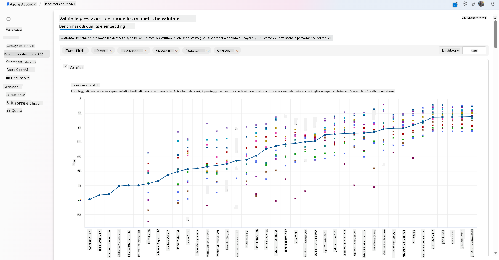
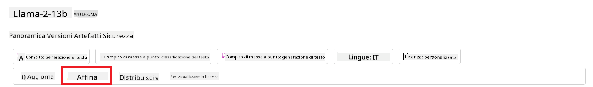
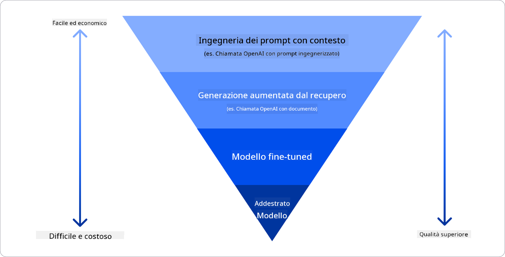

<!--
CO_OP_TRANSLATOR_METADATA:
{
  "original_hash": "e2f686f2eb794941761252ac5e8e090b",
  "translation_date": "2025-05-19T13:57:56+00:00",
  "source_file": "02-exploring-and-comparing-different-llms/README.md",
  "language_code": "it"
}
-->
# Esplorare e confrontare diversi LLM

> _Clicca sull'immagine sopra per vedere il video di questa lezione_

Nella lezione precedente, abbiamo visto come l'Intelligenza Artificiale Generativa stia cambiando il panorama tecnologico, come funzionano i Modelli di Linguaggio di Grandi Dimensioni (LLM) e come un'azienda - come la nostra startup - possa applicarli ai propri casi d'uso e crescere! In questo capitolo, vogliamo confrontare e distinguere diversi tipi di modelli di linguaggio di grandi dimensioni (LLM) per comprenderne i pro e i contro.

Il prossimo passo nel percorso della nostra startup è esplorare il panorama attuale degli LLM e capire quali sono adatti al nostro caso d'uso.

## Introduzione

Questa lezione coprirà:

- Diversi tipi di LLM nel panorama attuale.
- Testare, iterare e confrontare diversi modelli per il tuo caso d'uso in Azure.
- Come distribuire un LLM.

## Obiettivi di apprendimento

Dopo aver completato questa lezione, sarai in grado di:

- Selezionare il modello giusto per il tuo caso d'uso.
- Comprendere come testare, iterare e migliorare le prestazioni del tuo modello.
- Sapere come le aziende distribuiscono i modelli.

## Comprendere i diversi tipi di LLM

Gli LLM possono avere più categorizzazioni basate sulla loro architettura, dati di addestramento e caso d'uso. Comprendere queste differenze aiuterà la nostra startup a selezionare il modello giusto per lo scenario e capire come testare, iterare e migliorare le prestazioni.

Esistono molti tipi diversi di modelli LLM, la tua scelta di modello dipende da cosa intendi usarli, dai tuoi dati, da quanto sei disposto a pagare e altro ancora.

A seconda che tu intenda utilizzare i modelli per testo, audio, video, generazione di immagini e così via, potresti optare per un tipo di modello diverso.

- **Riconoscimento audio e vocale**. Per questo scopo, i modelli tipo Whisper sono una scelta eccellente poiché sono di uso generale e mirati al riconoscimento vocale. È addestrato su audio diversificato e può eseguire il riconoscimento vocale multilingue.

- **Generazione di immagini**. Per la generazione di immagini, DALL-E e Midjourney sono due scelte molto conosciute. DALL-E è offerto da Azure OpenAI.

- **Generazione di testo**. La maggior parte dei modelli è addestrata sulla generazione di testo e hai una grande varietà di scelte da GPT-3.5 a GPT-4. Hanno costi diversi con GPT-4 che è il più costoso.

- **Multi-modalità**. Se stai cercando di gestire più tipi di dati in input e output, potresti voler guardare modelli come gpt-4 turbo con visione o gpt-4o - le ultime versioni dei modelli OpenAI - che sono in grado di combinare l'elaborazione del linguaggio naturale con la comprensione visiva, abilitando interazioni tramite interfacce multi-modali.

Selezionare un modello significa ottenere alcune capacità di base, che potrebbero non essere sufficienti però. Spesso hai dati specifici dell'azienda che devi in qualche modo comunicare all'LLM.

### Modelli di Fondazione contro LLM

Il termine Modello di Fondazione è stato coniato dai ricercatori di Stanford e definito come un modello AI che segue alcuni criteri, come:

- **Sono addestrati utilizzando l'apprendimento non supervisionato o l'apprendimento auto-supervisionato**, il che significa che sono addestrati su dati multi-modali non etichettati e non richiedono annotazioni umane o etichettature di dati per il loro processo di addestramento.
- **Sono modelli molto grandi**, basati su reti neurali molto profonde addestrate su miliardi di parametri.
- **Sono normalmente destinati a servire come 'fondazione' per altri modelli**, il che significa che possono essere utilizzati come punto di partenza per altri modelli da costruire sopra, il che può essere fatto tramite fine-tuning.

Per chiarire ulteriormente questa distinzione, prendiamo ChatGPT come esempio. Per costruire la prima versione di ChatGPT, un modello chiamato GPT-3.5 ha servito come modello di fondazione. Questo significa che OpenAI ha utilizzato alcuni dati specifici del chat per creare una versione sintonizzata di GPT-3.5 specializzata nel performare bene in scenari conversazionali, come chatbot.

### Modelli Open Source contro Proprietari

Un altro modo di categorizzare gli LLM è se sono open source o proprietari.

I modelli open source sono modelli che sono resi disponibili al pubblico e possono essere utilizzati da chiunque. Sono spesso resi disponibili dalla società che li ha creati o dalla comunità di ricerca. Questi modelli possono essere ispezionati, modificati e personalizzati per i vari casi d'uso negli LLM.

I modelli proprietari sono modelli che sono di proprietà di una società e non sono resi disponibili al pubblico. Questi modelli sono spesso ottimizzati per l'uso in produzione.

### Embedding contro Generazione di Immagini contro Generazione di Testo e Codice

Gli LLM possono anche essere categorizzati dall'output che generano.

Gli embedding sono un insieme di modelli che possono convertire il testo in una forma numerica, chiamata embedding, che è una rappresentazione numerica del testo di input. Gli embedding facilitano la comprensione da parte delle macchine delle relazioni tra parole o frasi.

I modelli di generazione di immagini sono modelli che generano immagini. Questi modelli sono spesso utilizzati per l'editing di immagini, la sintesi di immagini e la traduzione di immagini.

I modelli di generazione di testo e codice sono modelli che generano testo o codice. Questi modelli sono spesso utilizzati per la sintesi di testo, la traduzione e la risposta a domande.

### Encoder-Decoder contro Solo Decoder

Per parlare dei diversi tipi di architetture degli LLM, usiamo un'analogia.

Immagina che il tuo manager ti abbia dato un compito per scrivere un quiz per gli studenti. Hai due colleghi; uno si occupa di creare il contenuto e l'altro di rivederlo.

Il creatore di contenuti è come un modello Solo Decoder, può guardare l'argomento e vedere cosa hai già scritto e poi può scrivere un corso basato su quello. Sono molto bravi a scrivere contenuti coinvolgenti e informativi, ma non sono molto bravi a comprendere l'argomento e gli obiettivi di apprendimento. Alcuni esempi di modelli Decoder sono i modelli della famiglia GPT, come GPT-3.

Il revisore è come un modello Solo Encoder, guarda il corso scritto e le risposte, notando la relazione tra loro e comprendendo il contesto, ma non è bravo a generare contenuti. Un esempio di modello Solo Encoder sarebbe BERT.

Immagina che possiamo avere anche qualcuno che potrebbe creare e rivedere il quiz, questo è un modello Encoder-Decoder. Alcuni esempi sarebbero BART e T5.

### Servizio contro Modello

Ora, parliamo della differenza tra un servizio e un modello. Un servizio è un prodotto offerto da un Fornitore di Servizi Cloud, ed è spesso una combinazione di modelli, dati e altri componenti. Un modello è il componente principale di un servizio ed è spesso un modello di fondazione, come un LLM.

I servizi sono spesso ottimizzati per l'uso in produzione e sono spesso più facili da usare rispetto ai modelli, tramite un'interfaccia utente grafica.

I modelli sono solo la Rete Neurale, con i parametri, i pesi e altri elementi. Consentono alle aziende di operare localmente, tuttavia, sarebbe necessario acquistare attrezzature, costruire una struttura per scalare e acquistare una licenza o utilizzare un modello open source.

## Come testare e iterare con diversi modelli per comprendere le prestazioni su Azure

Una volta che il nostro team ha esplorato il panorama attuale degli LLM e ha identificato alcuni buoni candidati per i loro scenari, il passo successivo è testarli sui loro dati e sul loro carico di lavoro. Questo è un processo iterativo, fatto tramite esperimenti e misure.

La maggior parte dei modelli menzionati nei paragrafi precedenti (modelli OpenAI, modelli open source come Llama2 e trasformatori Hugging Face) sono disponibili nel Catalogo dei Modelli in Azure AI Studio.

Azure AI Studio è una Piattaforma Cloud progettata per gli sviluppatori per costruire applicazioni di AI generativa e gestire l'intero ciclo di sviluppo - dalla sperimentazione alla valutazione - combinando tutti i servizi Azure AI in un unico hub con un'interfaccia grafica utile. Il Catalogo dei Modelli in Azure AI Studio consente all'utente di:

- Trovare il Modello di Fondazione di interesse nel catalogo - sia proprietario che open source, filtrando per compito, licenza o nome. Per migliorare la ricerca, i modelli sono organizzati in collezioni, come la collezione Azure OpenAI, la collezione Hugging Face e altro.

- Esaminare la scheda del modello, inclusa una descrizione dettagliata dell'uso previsto e dei dati di addestramento, esempi di codice e risultati di valutazione nella libreria di valutazioni interne.
- Confronta i benchmark tra modelli e dataset disponibili nel settore per valutare quale soddisfa lo scenario aziendale, attraverso il pannello [Model Benchmarks](https://learn.microsoft.com/azure/ai-studio/how-to/model-benchmarks?WT.mc_id=academic-105485-koreyst).

- Affina il modello su dati di addestramento personalizzati per migliorare le prestazioni del modello in un carico di lavoro specifico, sfruttando le capacità di sperimentazione e monitoraggio di Azure AI Studio.

- Distribuisci il modello pre-addestrato originale o la versione affinata a un'inferenza in tempo reale remota - calcolo gestito - o a un endpoint API senza server - [pay-as-you-go](https://learn.microsoft.com/azure/ai-studio/how-to/model-catalog-overview#model-deployment-managed-compute-and-serverless-api-pay-as-you-go?WT.mc_id=academic-105485-koreyst) - per consentire alle applicazioni di utilizzarlo.

> [!NOTE]
> Non tutti i modelli nel catalogo sono attualmente disponibili per l'affinamento e/o la distribuzione pay-as-you-go. Controlla la scheda del modello per i dettagli sulle capacità e limitazioni del modello.

## Migliorare i risultati degli LLM

Abbiamo esplorato con il nostro team di startup diversi tipi di LLM e una piattaforma Cloud (Azure Machine Learning) che ci consente di confrontare diversi modelli, valutarli su dati di test, migliorare le prestazioni e distribuirli su endpoint di inferenza.

Ma quando dovrebbero considerare di affinare un modello piuttosto che usare uno pre-addestrato? Ci sono altri approcci per migliorare le prestazioni del modello su carichi di lavoro specifici?

Ci sono diversi approcci che un'azienda può utilizzare per ottenere i risultati desiderati da un LLM. È possibile selezionare diversi tipi di modelli con diversi gradi di addestramento quando si distribuisce un LLM in produzione, con diversi livelli di complessità, costo e qualità. Ecco alcuni approcci diversi:

- **Ingegneria del prompt con contesto**. L'idea è di fornire abbastanza contesto quando si fa un prompt per garantire di ottenere le risposte necessarie.

- **Generazione aumentata dal recupero, RAG**. I tuoi dati potrebbero esistere in un database o endpoint web, per esempio, per garantire che questi dati, o un loro sottoinsieme, siano inclusi al momento del prompt, puoi recuperare i dati pertinenti e renderli parte del prompt dell'utente.

- **Modello affinato**. Qui, hai addestrato ulteriormente il modello sui tuoi dati, il che ha portato il modello a essere più preciso e reattivo alle tue esigenze, ma potrebbe essere costoso.

Fonte immagine: [Quattro modi in cui le aziende distribuiscono LLM | Fiddler AI Blog](https://www.fiddler.ai/blog/four-ways-that-enterprises-deploy-llms?WT.mc_id=academic-105485-koreyst)

### Ingegneria del Prompt con Contesto

Gli LLM pre-addestrati funzionano molto bene su compiti di linguaggio naturale generalizzati, anche chiamandoli con un breve prompt, come una frase da completare o una domanda – il cosiddetto apprendimento "zero-shot".

Tuttavia, più l'utente può inquadrare la sua richiesta, con una richiesta dettagliata ed esempi – il Contesto – più precisa e vicina alle aspettative dell'utente sarà la risposta. In questo caso, si parla di apprendimento "one-shot" se il prompt include solo un esempio e di "few-shot learning" se include più esempi. L'ingegneria del prompt con contesto è l'approccio più conveniente per iniziare.

### Generazione Aumentata dal Recupero (RAG)

Gli LLM hanno la limitazione di poter utilizzare solo i dati che sono stati utilizzati durante il loro addestramento per generare una risposta. Questo significa che non sanno nulla dei fatti accaduti dopo il loro processo di addestramento e non possono accedere a informazioni non pubbliche (come i dati aziendali). Questo può essere superato attraverso RAG, una tecnica che aumenta il prompt con dati esterni sotto forma di blocchi di documenti, considerando i limiti di lunghezza del prompt. Questo è supportato da strumenti di database vettoriale (come [Azure Vector Search](https://learn.microsoft.com/azure/search/vector-search-overview?WT.mc_id=academic-105485-koreyst)) che recuperano i blocchi utili da varie fonti di dati predefinite e li aggiungono al Contesto del prompt.

Questa tecnica è molto utile quando un'azienda non ha abbastanza dati, tempo o risorse per affinare un LLM, ma desidera comunque migliorare le prestazioni su un carico di lavoro specifico e ridurre i rischi di fabbricazioni, cioè mistificazioni della realtà o contenuti dannosi.

### Modello Affinato

L'affinamento è un processo che sfrutta l'apprendimento trasferito per 'adattare' il modello a un compito a valle o per risolvere un problema specifico. Diversamente dall'apprendimento few-shot e RAG, si traduce in un nuovo modello generato, con pesi e bias aggiornati. Richiede un insieme di esempi di addestramento costituiti da un singolo input (il prompt) e dal suo output associato (il completamento). Questo sarebbe l'approccio preferito se:

- **Uso di modelli affinati**. Un'azienda desidera utilizzare modelli affinati meno capaci (come modelli di embedding) piuttosto che modelli ad alte prestazioni, risultando in una soluzione più conveniente e veloce.

- **Considerazione della latenza**. La latenza è importante per un caso d'uso specifico, quindi non è possibile utilizzare prompt molto lunghi o il numero di esempi da cui il modello dovrebbe imparare non si adatta al limite di lunghezza del prompt.

- **Mantenersi aggiornati**. Un'azienda dispone di molti dati di alta qualità e etichette di verità a terra e delle risorse necessarie per mantenere questi dati aggiornati nel tempo.

### Modello Addestrato

Addestrare un LLM da zero è senza dubbio l'approccio più difficile e complesso da adottare, richiedendo enormi quantità di dati, risorse qualificate e potenza computazionale adeguata. Questa opzione dovrebbe essere considerata solo in uno scenario in cui un'azienda ha un caso d'uso specifico del dominio e una grande quantità di dati centrati sul dominio.

## Verifica delle conoscenze

Quale potrebbe essere un buon approccio per migliorare i risultati di completamento degli LLM?

1. Ingegneria del prompt con contesto
1. RAG
1. Modello affinato

A:3, se hai il tempo e le risorse e dati di alta qualità, l'affinamento è l'opzione migliore per mantenersi aggiornati. Tuttavia, se stai cercando di migliorare le cose e ti manca il tempo, vale la pena considerare prima RAG.

## 🚀 Sfida

Approfondisci su come puoi [usare RAG](https://learn.microsoft.com/azure/search/retrieval-augmented-generation-overview?WT.mc_id=academic-105485-koreyst) per la tua azienda.

## Ottimo lavoro, continua il tuo apprendimento

Dopo aver completato questa lezione, dai un'occhiata alla nostra [collezione di apprendimento sull'AI generativa](https://aka.ms/genai-collection?WT.mc_id=academic-105485-koreyst) per continuare ad aumentare le tue conoscenze sull'AI generativa!

Vai alla Lezione 3 dove vedremo come [costruire con l'AI generativa in modo responsabile](../03-using-generative-ai-responsibly/README.md?WT.mc_id=academic-105485-koreyst)!

**Dichiarazione di non responsabilità**:  
Questo documento è stato tradotto utilizzando il servizio di traduzione AI [Co-op Translator](https://github.com/Azure/co-op-translator). Sebbene ci impegniamo per l'accuratezza, si prega di essere consapevoli che le traduzioni automatiche possono contenere errori o imprecisioni. Il documento originale nella sua lingua madre dovrebbe essere considerato la fonte autorevole. Per informazioni critiche, si raccomanda una traduzione professionale umana. Non siamo responsabili per eventuali malintesi o interpretazioni errate derivanti dall'uso di questa traduzione.