# Esplorare e confrontare diversi LLM

> _Clicca sull'immagine sopra per vedere il video di questa lezione_

Con la lezione precedente, abbiamo visto come l'IA Generativa stia cambiando il panorama tecnologico, come funzionano i Large Language Models (LLM) e come un'azienda - come la nostra startup - possa applicarli ai propri casi d'uso e crescere! In questo capitolo, vogliamo confrontare e mettere a confronto diversi tipi di grandi modelli di linguaggio (LLM) per comprenderne pregi e difetti.

Il passo successivo nel percorso della nostra startup è esplorare l'attuale panorama degli LLM e capire quali siano adatti al nostro caso d'uso.

## Introduzione

Questa lezione coprirà:

- Diversi tipi di LLM nell'attuale panorama.
- Test, iterazione e confronto di diversi modelli per il proprio caso d'uso in Azure.
- Come distribuire un LLM.

## Obiettivi di Apprendimento

Dopo aver completato questa lezione, sarai in grado di:

- Selezionare il modello giusto per il tuo caso d'uso.
- Capire come testare, iterare e migliorare le prestazioni del tuo modello.
- Sapere come le aziende distribuiscono i modelli.

## Comprendere i diversi tipi di LLM

Gli LLM possono avere molteplici categorizzazioni basate sulla loro architettura, dati di addestramento e caso d'uso. Comprendere queste differenze aiuterà la nostra startup a selezionare il modello giusto per lo scenario e a capire come testare, iterare e migliorare le prestazioni.

Esistono molti tipi differenti di modelli LLM, la tua scelta dipende da cosa intendi usarli, dai tuoi dati, da quanto sei disposto a pagare e altro ancora.

A seconda che tu voglia utilizzare i modelli per testo, audio, video, generazione di immagini e così via, potresti optare per un tipo diverso di modello.

- **Audio e riconoscimento vocale**. I modelli in stile Whisper sono ancora modelli di riconoscimento vocale a scopo generale utili, ma le scelte di produzione ora includono anche modelli più recenti di speech-to-text come `gpt-4o-transcribe`, `gpt-4o-mini-transcribe` e varianti di diarizzazione. Valuta la copertura linguistica, la diarizzazione, il supporto in tempo reale, la latenza e il costo per il tuo scenario. Scopri di più nella [documentazione OpenAI speech-to-text](https://platform.openai.com/docs/guides/speech-to-text?WT.mc_id=academic-105485-koreyst).

- **Generazione di immagini**. DALL-E e Midjourney sono opzioni ben conosciute per la generazione di immagini, ma le attuali API di OpenAI per le immagini si concentrano su modelli GPT Image come `gpt-image-2`, mentre Stable Diffusion, Imagen, Flux e altre famiglie di modelli sono anche scelte comuni. Confronta l'aderenza al prompt, il supporto per l'editing, il controllo dello stile, i requisiti di sicurezza e le licenze. Scopri di più nella [guida OpenAI alla generazione di immagini](https://platform.openai.com/docs/guides/images?WT.mc_id=academic-105485-koreyst) e nel Capitolo 9 di questo curriculum.

- **Generazione di testo**. I modelli di testo ora comprendono modelli all'avanguardia, modelli di ragionamento, modelli più piccoli a bassa latenza e modelli a peso aperto. Esempi attuali includono i modelli OpenAI GPT-5.x, i modelli Anthropic Claude 4.x, i modelli Google Gemini 3.x, i modelli Meta Llama 4 e i modelli Mistral. Non scegliere solo in base alla data di rilascio o al prezzo; confronta la qualità del compito, la latenza, la finestra di contesto, l’uso degli strumenti, il comportamento di sicurezza, la disponibilità regionale e il costo totale. Il [catalogo modelli Microsoft Foundry](https://ai.azure.com/catalog?WT.mc_id=academic-105485-koreyst) è un buon posto per confrontare i modelli disponibili su Azure.

- **Multi-modalità**. Molti modelli attuali possono elaborare più del solo testo. Alcuni accettano input di immagini, audio o video; alcuni possono chiamare strumenti; e modelli specializzati possono generare immagini, audio o video. Per esempio, i modelli OpenAI attuali supportano input di testo e immagini, i modelli Gemini possono supportare input di testo, codice, immagini, audio e video a seconda della variante, e Llama 4 Scout e Maverick sono modelli a peso aperto nativamente multimodali. Controlla sempre la scheda modello per le modalità di input e output supportate prima di costruire un flusso di lavoro su di esso.

Selezionare un modello significa ottenere alcune capacità di base, che però potrebbero non essere sufficienti. Spesso hai dati specifici dell'azienda di cui devi in qualche modo informare l'LLM. Ci sono alcune scelte diverse su come affrontare questo aspetto, ne parleremo nelle prossime sezioni.

### Modelli Foundation versus LLM

Il termine Modello Foundation è stato [coniato dai ricercatori di Stanford](https://arxiv.org/abs/2108.07258?WT.mc_id=academic-105485-koreyst) e definito come un modello di IA che segue alcuni criteri, come:

- **Sono addestrati utilizzando apprendimento non supervisionato o auto-supervisionato**, cioè sono addestrati su dati non etichettati multi-modali, e non richiedono annotazioni o etichettature umane per il loro processo di addestramento.
- **Sono modelli molto grandi**, basati su reti neurali molto profonde addestrate su miliardi di parametri.
- **Sono normalmente destinati a servire come 'fondazione' per altri modelli**, il che significa che possono essere usati come punto di partenza per costruire altri modelli sopra, mediante il fine-tuning.

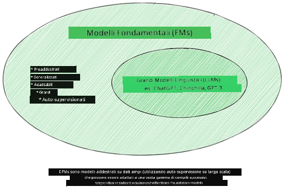

Fonte immagine: [Guida essenziale ai modelli Foundation e ai grandi modelli di linguaggio | di Babar M Bhatti | Medium
](https://thebabar.medium.com/essential-guide-to-foundation-models-and-large-language-models-27dab58f7404)

Per chiarire ulteriormente questa distinzione, prendiamo ChatGPT come esempio storico. Le prime versioni di ChatGPT utilizzavano GPT-3.5 come modello foundation. OpenAI ha poi utilizzato dati specifici per la chat e tecniche di allineamento per creare una versione ottimizzata che performava meglio in scenari conversazionali, come i chatbot. I servizi moderni di IA spesso instradano tra diverse varianti di modelli, quindi il nome del servizio e il nome del modello sottostante non sono sempre la stessa cosa.

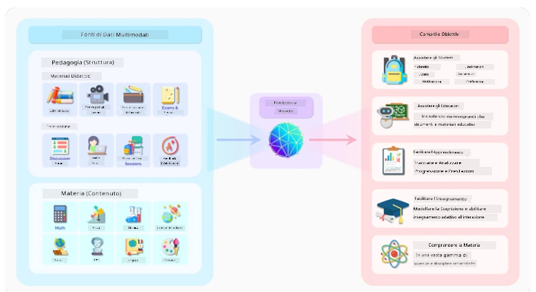

Fonte immagine: [2108.07258.pdf (arxiv.org)](https://arxiv.org/pdf/2108.07258.pdf?WT.mc_id=academic-105485-koreyst)

### Modelli Open-Weight/Open-Source versus Proprietari

Un altro modo per categorizzare gli LLM è se sono open-weight, open-source o proprietari.

I modelli open-source e open-weight rendono disponibili gli artefatti del modello per ispezione, download o personalizzazione, ma le loro licenze differiscono. Alcuni sono pienamente open source, mentre altri sono modelli open-weight con restrizioni d'uso. Possono essere utili quando un'azienda ha bisogno di maggior controllo sulla distribuzione, localizzazione dei dati, costi o personalizzazione. Tuttavia, i team devono ancora esaminare i termini di licenza, i costi di servizio, la manutenzione, gli aggiornamenti di sicurezza e la qualità della valutazione prima di usarli in produzione. Esempi includono [Meta Llama 4](https://ai.meta.com/blog/llama-4-multimodal-intelligence/?WT.mc_id=academic-105485-koreyst), alcuni [modelli Mistral](https://docs.mistral.ai/models/overview?WT.mc_id=academic-105485-koreyst) e molti modelli ospitati su [Hugging Face](https://huggingface.co/models?WT.mc_id=academic-105485-koreyst).

I modelli proprietari sono di proprietà e ospitati da un fornitore. Questi modelli sono spesso ottimizzati per l’uso in produzione gestita e possono offrire forte supporto, sistemi di sicurezza, integrazione di strumenti e scalabilità. Tuttavia, i clienti di solito non possono ispezionare o modificare i pesi del modello e devono esaminare i termini del fornitore per privacy, conservazione, conformità e uso accettabile. Esempi includono [modelli OpenAI](https://platform.openai.com/docs/models?WT.mc_id=academic-105485-koreyst), [Google Gemini](https://deepmind.google/models/gemini/pro/?WT.mc_id=academic-105485-koreyst) e [Anthropic Claude](https://platform.claude.com/docs/en/about-claude/models/overview?WT.mc_id=academic-105485-koreyst).

### Embedding versus generazione di immagini versus generazione di testo e codice

Gli LLM possono anche essere categorizzati in base all'output che generano.

Gli embedding sono un insieme di modelli che possono convertire il testo in una forma numerica, chiamata embedding, che è una rappresentazione numerica del testo di input. Gli embedding facilitano la comprensione da parte delle macchine delle relazioni tra parole o frasi e possono essere utilizzati come input da altri modelli, come modelli di classificazione o modelli di clustering che hanno migliori prestazioni su dati numerici. I modelli di embedding sono spesso usati per transfer learning, dove un modello è costruito per un compito surrogato per il quale c’è abbondanza di dati, e poi i pesi del modello (embedding) sono riutilizzati per altri compiti downstream. Un esempio di questa categoria è [OpenAI embeddings](https://platform.openai.com/docs/models/embeddings?WT.mc_id=academic-105485-koreyst).

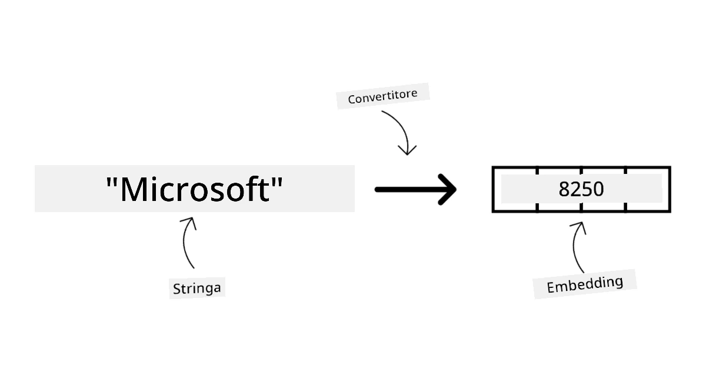

I modelli di generazione di immagini sono modelli che generano immagini. Questi modelli sono spesso usati per il fotoritocco, la sintesi di immagini e la traduzione di immagini. I modelli di generazione di immagini sono spesso addestrati su grandi dataset di immagini, come [LAION-5B](https://laion.ai/blog/laion-5b/?WT.mc_id=academic-105485-koreyst), e possono essere utilizzati per generare nuove immagini o per modificare immagini esistenti con tecniche di inpainting, super-risoluzione e colorazione. Esempi includono i [modelli GPT Image](https://platform.openai.com/docs/guides/images?WT.mc_id=academic-105485-koreyst), i [modelli Stable Diffusion](https://github.com/Stability-AI/StableDiffusion?WT.mc_id=academic-105485-koreyst) e i modelli Imagen.

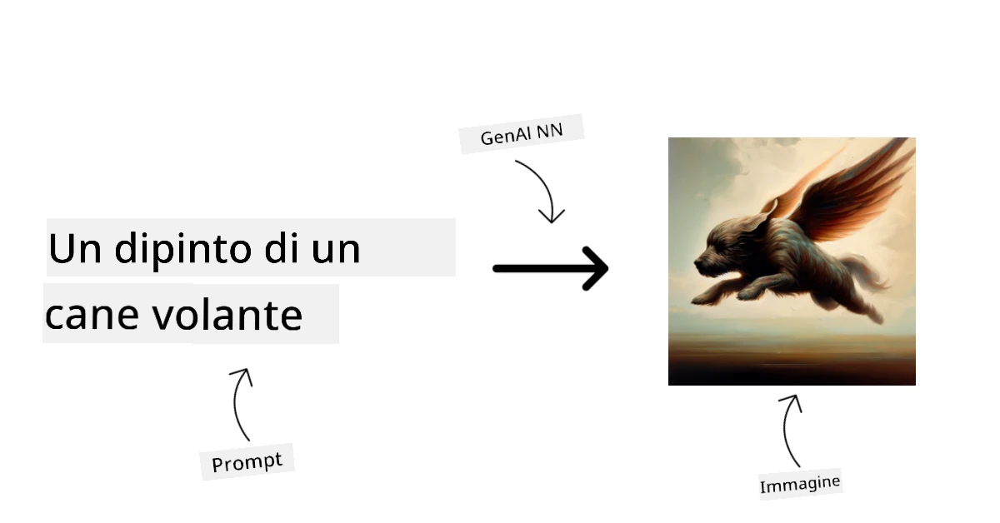

I modelli di generazione di testo e codice sono modelli che generano testo o codice. Questi modelli sono spesso utilizzati per la sintesi di testo, traduzione e risposta a domande. I modelli di generazione di testo sono spesso addestrati su grandi dataset di testo, come [BookCorpus](https://www.cv-foundation.org/openaccess/content_iccv_2015/html/Zhu_Aligning_Books_and_ICCV_2015_paper.html?WT.mc_id=academic-105485-koreyst), e possono essere usati per generare nuovo testo o per rispondere a domande. I modelli di generazione di codice, come [CodeParrot](https://huggingface.co/codeparrot?WT.mc_id=academic-105485-koreyst), sono spesso addestrati su grandi dataset di codice, come GitHub, e possono essere usati per generare nuovo codice o per correggere bug nel codice esistente.

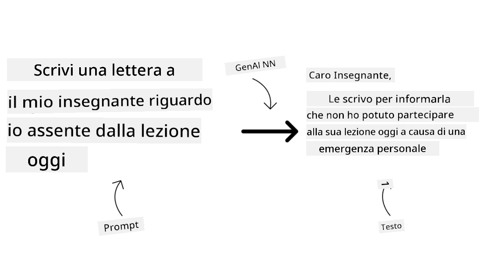

### Encoder-Decoder versus solo Decoder

Per parlare dei diversi tipi di architetture degli LLM, usiamo un'analogia.

Immagina che il tuo manager ti abbia dato il compito di scrivere un quiz per gli studenti. Hai due colleghi; uno si occupa di creare i contenuti e l’altro di rivederli.

Il creatore di contenuti è come un modello solo decoder: può guardare l’argomento, vedere cosa hai già scritto e poi continuare a generare contenuti basandosi su quel contesto. Sono molto bravi a scrivere contenuti coinvolgenti e informativi, ma non sono sempre la scelta migliore quando il compito è solo classificare, recuperare o codificare informazioni. Esempi di famiglie di modelli solo decoder includono GPT e Llama.

Il revisore è come un modello solo encoder, guarda il corso scritto e le risposte, nota la relazione tra di essi e capisce il contesto, ma non è bravo a generare contenuti. Un esempio di modello solo encoder è BERT.

Immagina che possiamo avere anche qualcuno che può creare e rivedere il quiz, questo è un modello Encoder-Decoder. Alcuni esempi sarebbero BART e T5.

### Servizio versus Modello

Ora, parliamo della differenza tra un servizio e un modello. Un servizio è un prodotto offerto da un Cloud Service Provider, ed è spesso una combinazione di modelli, dati e altri componenti. Un modello è il componente centrale di un servizio, ed è spesso un modello foundation, come un LLM.

I servizi sono spesso ottimizzati per l’uso in produzione e sono spesso più facili da usare rispetto ai modelli, tramite un’interfaccia utente grafica. Tuttavia, i servizi non sono sempre disponibili gratuitamente, e possono richiedere un abbonamento o un pagamento per l’uso, in cambio dell’utilizzo delle attrezzature e delle risorse del proprietario del servizio, ottimizzando le spese e scalando facilmente. Un esempio di servizio è [Azure OpenAI Service](https://learn.microsoft.com/azure/ai-services/openai/overview?WT.mc_id=academic-105485-koreyst), che offre un piano tariffario pay-as-you-go, il che significa che gli utenti sono addebitati proporzionalmente all’uso del servizio. Azure OpenAI Service offre inoltre sicurezza di livello aziendale e un framework di IA responsabile sopra alle capacità dei modelli.

I modelli sono gli artefatti della rete neurale: parametri, pesi, architettura, tokenizer e configurazione di supporto. Eseguire un modello localmente o in un ambiente privato richiede hardware adeguato, infrastruttura di servizio, monitoraggio e una licenza open-source/open-weight compatibile o una licenza commerciale. I modelli open-weight come Llama 4 o i modelli Mistral possono essere auto-ospitati, ma richiedono comunque potenza computazionale ed esperienza operativa.

## Come testare e iterare con diversi modelli per comprendere le prestazioni su Azure

Una volta che il nostro team ha esplorato il panorama attuale degli LLM e identificato alcuni buoni candidati per i loro scenari, il passo successivo è testarli sui loro dati e sul loro carico di lavoro. Questo è un processo iterativo, fatto di esperimenti e misurazioni.
La maggior parte dei modelli menzionati nei paragrafi precedenti (modelli OpenAI, modelli open-weight come Llama 4 e Mistral, e modelli Hugging Face) sono disponibili in [Microsoft Foundry Models](https://learn.microsoft.com/azure/foundry/concepts/foundry-models-overview?WT.mc_id=academic-105485-koreyst).

[Microsoft Foundry](https://learn.microsoft.com/azure/foundry/what-is-foundry?WT.mc_id=academic-105485-koreyst), precedentemente Azure AI Studio/Azure AI Foundry, è una piattaforma Azure unificata per costruire app e agenti AI. Aiuta gli sviluppatori a gestire il ciclo di vita dall'esperimento e valutazione fino al deployment, monitoraggio e governance. Il catalogo dei modelli in Microsoft Foundry consente all’utente di:

- Trovare il modello di base di interesse nel catalogo, inclusi modelli venduti da Azure e modelli di partner e fornitori della community. Gli utenti possono filtrare per attività, fornitore, licenza, opzione di deployment o nome.

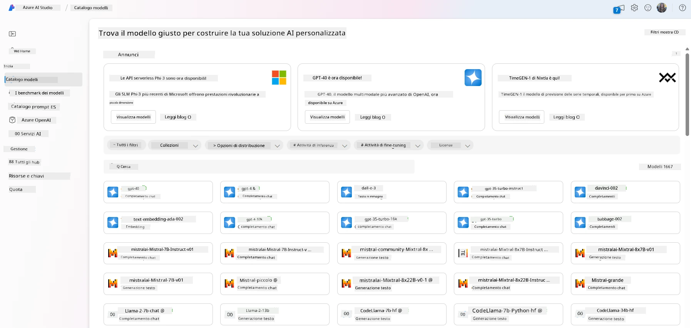

- Consultare la scheda modello, comprendente una descrizione dettagliata dell’uso previsto e dei dati di addestramento, esempi di codice e risultati di valutazioni sulla libreria di valutazioni interne.

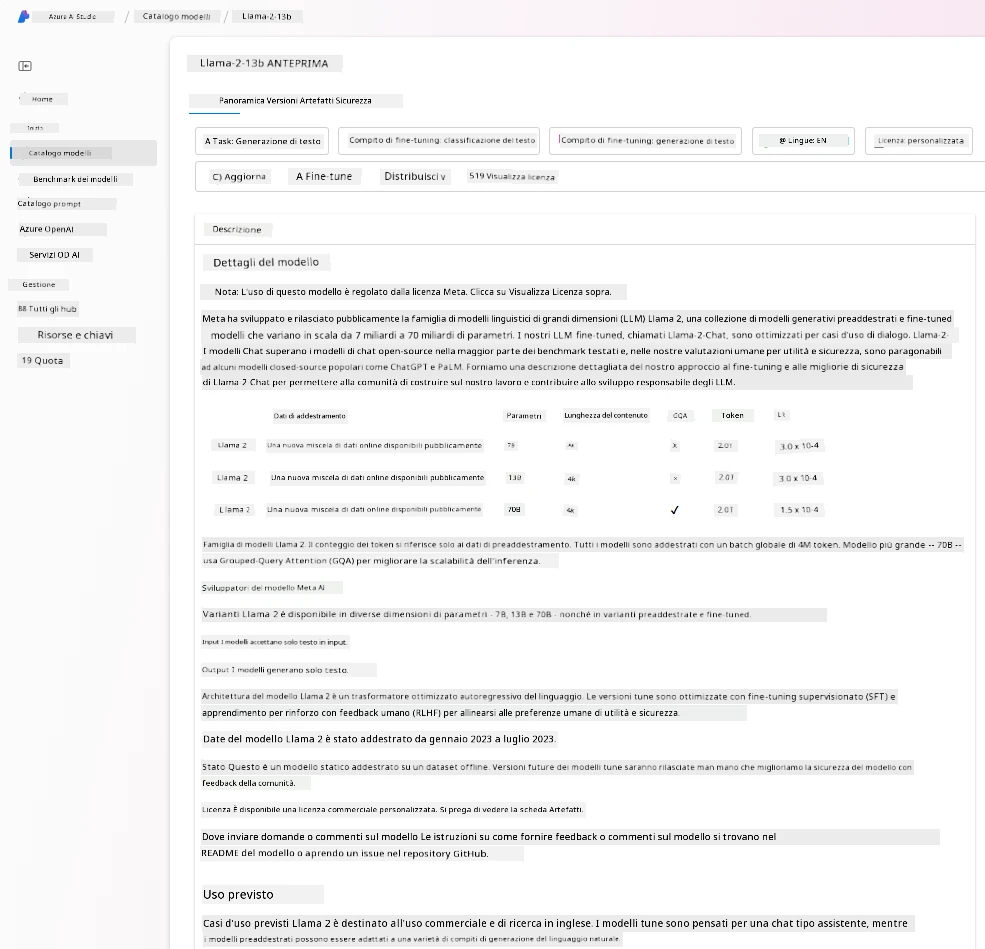

- Confrontare benchmark tra modelli e dataset disponibili nel settore per valutare quale soddisfa lo scenario di business, tramite il pannello [Model Benchmarks](https://learn.microsoft.com/azure/ai-studio/how-to/model-benchmarks?WT.mc_id=academic-105485-koreyst).

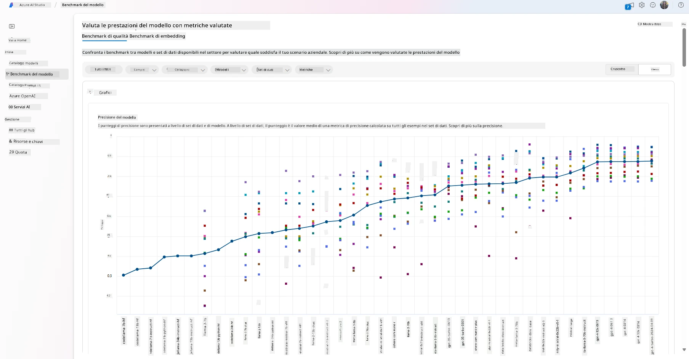

- Affinare modelli supportati su dati di addestramento personalizzati per migliorare le prestazioni del modello in un carico di lavoro specifico, sfruttando le capacità di sperimentazione e tracciamento di Microsoft Foundry.

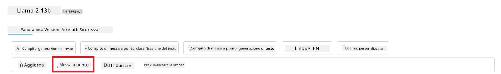

- Distribuire il modello pre-addestrato originale o la versione fine-tuned ad un endpoint di inferenza remoto in tempo reale, usando opzioni di deployment con calcolo gestito o serverless, per consentire alle applicazioni di consumarlo.

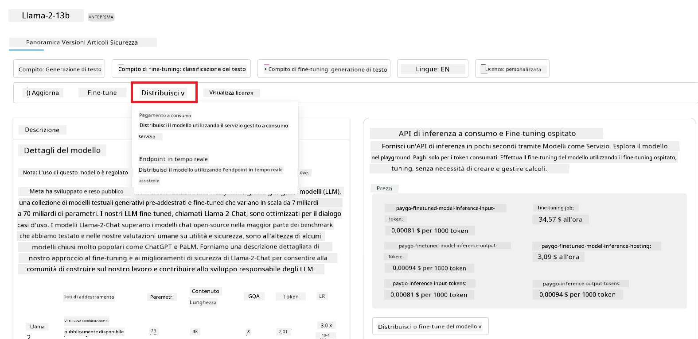

> [!NOTE]
> Non tutti i modelli nel catalogo sono attualmente disponibili per il fine-tuning e/o il deployment pay-as-you-go. Controlla la scheda modello per i dettagli sulle capacità e limitazioni del modello.

## Migliorare i risultati degli LLM

Abbiamo esplorato con il nostro team startup diversi tipi di LLM e una piattaforma cloud (Microsoft Foundry) che ci consente di confrontare diversi modelli, valutarli su dati di test, migliorare le prestazioni e distribuirli su endpoint di inferenza.

Ma quando dovrebbero considerare di fine-tuning un modello invece di usare uno pre-addestrato? Esistono altri approcci per migliorare le prestazioni del modello su carichi di lavoro specifici?

Ci sono diversi approcci che un’azienda può usare per ottenere i risultati di cui ha bisogno da un LLM. È possibile selezionare diversi tipi di modelli con diversi gradi di addestramento quando si distribuisce un LLM in produzione, con differenti livelli di complessità, costo e qualità. Ecco alcuni approcci differenti:

- **Prompt engineering con contesto**. L’idea è fornire abbastanza contesto durante il prompt per assicurarti di ottenere le risposte di cui hai bisogno.

- **Retrieval Augmented Generation, RAG**. I tuoi dati potrebbero esistere ad esempio in un database o endpoint web; per assicurarti che questi dati, o un sottoinsieme di essi, siano inclusi al momento della richiesta (prompt), puoi recuperare i dati rilevanti e farli parte del prompt dell’utente.

- **Modello fine-tuned**. Qui, addestri ulteriormente il modello sui tuoi dati personali il che porta a un modello più preciso e reattivo alle tue necessità, ma potrebbe essere costoso.

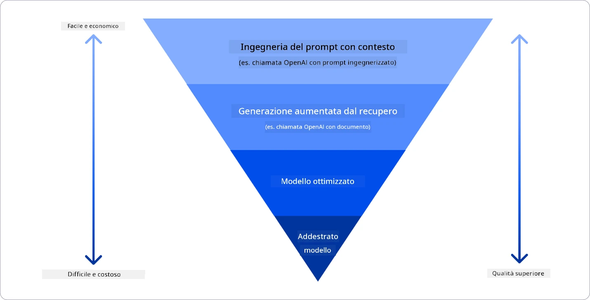

Fonte immagine: [Four Ways that Enterprises Deploy LLMs | Fiddler AI Blog](https://www.fiddler.ai/blog/four-ways-that-enterprises-deploy-llms?WT.mc_id=academic-105485-koreyst)

### Prompt Engineering con Contesto

Gli LLM pre-addestrati funzionano molto bene su attività di linguaggio naturale generalizzate, anche chiamandoli con un prompt breve, come una frase da completare o una domanda – il cosiddetto apprendimento “zero-shot”.

Tuttavia, più l’utente riesce a inquadrare la sua domanda, con una richiesta dettagliata ed esempi – il Contesto – più la risposta sarà accurata e vicina alle aspettative dell’utente. In questo caso parliamo di “one-shot” se il prompt include un solo esempio e di “few shot learning” se include più esempi.
Il prompt engineering con contesto è l’approccio più efficiente in termini di costi per iniziare.

### Retrieval Augmented Generation (RAG)

Gli LLM hanno la limitazione di poter utilizzare solo i dati usati durante il loro addestramento per generare una risposta. Questo significa che non sanno nulla sui fatti accaduti dopo il loro processo di addestramento e non possono accedere a informazioni non pubbliche (come dati aziendali).
Questo può essere superato tramite RAG, una tecnica che arricchisce il prompt con dati esterni sotto forma di frammenti di documenti, considerando i limiti di lunghezza del prompt. Questo è supportato da strumenti di database vettoriale (come [Azure Vector Search](https://learn.microsoft.com/azure/search/vector-search-overview?WT.mc_id=academic-105485-koreyst)) che recuperano i frammenti utili da varie fonti dati predefinite e li aggiungono al Contesto del prompt.

Questa tecnica è molto utile quando un’azienda non ha abbastanza dati, tempo o risorse per il fine-tuning di un LLM, ma vuole comunque migliorare le prestazioni su un carico di lavoro specifico e ridurre il rischio di risposte allucinate, obsolete o non supportate.

### Modello fine-tuned

Il fine-tuning è un processo che sfrutta il transfer learning per ‘adattare’ il modello a un compito downstream o per risolvere un problema specifico. Diversamente dal few-shot learning e dal RAG, genera un nuovo modello con pesi e bias aggiornati. Richiede un set di esempi di addestramento costituiti da un singolo input (il prompt) e il suo output associato (il completamento).
Questo sarebbe l’approccio preferito se:

- **Si usano modelli più piccoli specifici per un compito**. Un’azienda preferirebbe fare il fine-tuning di un modello più piccolo per un compito ristretto piuttosto che richiamare ripetutamente un modello frontier più grande, con una soluzione più economica e rapida.

- **Si considera la latenza**. La latenza è importante per un use-case specifico, quindi non è possibile usare prompt molto lunghi o il numero di esempi che il modello dovrebbe apprendere non si adatta al limite di lunghezza del prompt.

- **Adattare il comportamento stabile**. Un’azienda ha molti esempi di alta qualità e vuole che il modello segua costantemente un modello di compito, formato di output, tono o stile specifico di dominio. Se il problema principale sono fatti freschi o conoscenze private che cambiano spesso, usare RAG invece di affidarsi solo al fine-tuning.

### Modello addestrato

Addestrare un LLM da zero è senza dubbio l’approccio più difficile e complesso da adottare, richiedendo enormi quantità di dati, risorse qualificate e potenza computazionale adeguata. Questa opzione dovrebbe essere considerata solo in uno scenario in cui un’azienda ha un use-case specifico di dominio e una grande quantità di dati centrati sul dominio.

## Verifica delle conoscenze

Quale potrebbe essere un buon approccio per migliorare i risultati del completamento di un LLM?

1. Prompt engineering con contesto
1. RAG
1. Modello fine-tuned

R: Tutti e tre possono aiutare. Inizia con prompt engineering e contesto per miglioramenti rapidi, e usa RAG quando il modello ha bisogno di fatti aggiornati o dati aziendali privati. Scegli il fine-tuning quando hai abbastanza esempi di alta qualità e necessiti che il modello segua costantemente un compito, formato, tono o modello di dominio.

## 🚀 Sfida

Approfondisci come puoi [usare RAG](https://learn.microsoft.com/azure/search/retrieval-augmented-generation-overview?WT.mc_id=academic-105485-koreyst) per la tua azienda.

## Ottimo lavoro, continua il tuo apprendimento

Dopo aver completato questa lezione, dai un’occhiata alla nostra [collezione di apprendimento sull’AI generativa](https://aka.ms/genai-collection?WT.mc_id=academic-105485-koreyst) per continuare a potenziare la tua conoscenza sull’AI Generativa!

Passa alla Lezione 3 dove vedremo come [costruire con l’AI Generativa in modo responsabile](../03-using-generative-ai-responsibly/README.md?WT.mc_id=academic-105485-koreyst)!

---

<!-- CO-OP TRANSLATOR DISCLAIMER START -->
**Disclaimer**:
Questo documento è stato tradotto utilizzando il servizio di traduzione AI [Co-op Translator](https://github.com/Azure/co-op-translator). Sebbene ci impegniamo per garantire la precisione, si prega di notare che le traduzioni automatizzate possono contenere errori o imprecisioni. Il documento originale nella sua lingua nativa deve essere considerato la fonte autorevole. Per informazioni critiche, si raccomanda una traduzione professionale effettuata da un essere umano. Non siamo responsabili per eventuali malintesi o interpretazioni errate derivanti dall’uso di questa traduzione.
<!-- CO-OP TRANSLATOR DISCLAIMER END -->