<!--
CO_OP_TRANSLATOR_METADATA:
{
  "original_hash": "e2f686f2eb794941761252ac5e8e090b",
  "translation_date": "2025-06-25T10:37:15+00:00",
  "source_file": "02-exploring-and-comparing-different-llms/README.md",
  "language_code": "it"
}
-->
# Esplorare e confrontare diversi LLM

[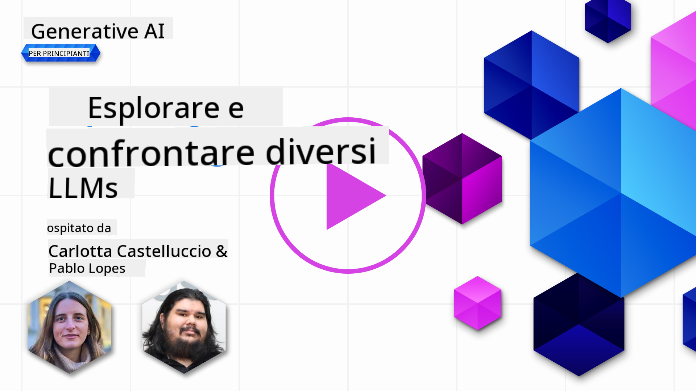](https://aka.ms/gen-ai-lesson2-gh?WT.mc_id=academic-105485-koreyst)

> _Clicca sull'immagine sopra per visualizzare il video di questa lezione_

Nella lezione precedente, abbiamo visto come l'AI Generativa stia cambiando il panorama tecnologico, come funzionano i modelli di linguaggio di grandi dimensioni (LLM) e come un'azienda - come la nostra startup - possa applicarli ai propri casi d'uso e crescere! In questo capitolo, cercheremo di confrontare e analizzare diversi tipi di modelli di linguaggio di grandi dimensioni (LLM) per comprenderne i pro e i contro.

Il prossimo passo nel viaggio della nostra startup è esplorare l'attuale panorama degli LLM e capire quali siano adatti al nostro caso d'uso.

## Introduzione

Questa lezione coprirà:

- I diversi tipi di LLM nel panorama attuale.
- Testare, iterare e confrontare diversi modelli per il tuo caso d'uso su Azure.
- Come distribuire un LLM.

## Obiettivi di apprendimento

Dopo aver completato questa lezione, sarai in grado di:

- Selezionare il modello giusto per il tuo caso d'uso.
- Comprendere come testare, iterare e migliorare le prestazioni del tuo modello.
- Sapere come le aziende distribuiscono i modelli.

## Comprendere i diversi tipi di LLM

Gli LLM possono avere diverse categorizzazioni in base alla loro architettura, dati di addestramento e caso d'uso. Comprendere queste differenze aiuterà la nostra startup a selezionare il modello giusto per lo scenario e capire come testare, iterare e migliorare le prestazioni.

Esistono molti tipi diversi di modelli LLM, la tua scelta dipende da cosa intendi usarli, dai tuoi dati, da quanto sei disposto a pagare e altro ancora.

A seconda se intendi utilizzare i modelli per generazione di testo, audio, video, immagini e così via, potresti optare per un tipo di modello diverso.

- **Riconoscimento audio e vocale**. Per questo scopo, i modelli tipo Whisper sono un'ottima scelta poiché sono ad uso generale e mirati al riconoscimento vocale. È addestrato su audio diversi e può eseguire il riconoscimento vocale multilingue. Scopri di più sui [modelli tipo Whisper qui](https://platform.openai.com/docs/models/whisper?WT.mc_id=academic-105485-koreyst).

- **Generazione di immagini**. Per la generazione di immagini, DALL-E e Midjourney sono due scelte molto conosciute. DALL-E è offerto da Azure OpenAI. [Leggi di più su DALL-E qui](https://platform.openai.com/docs/models/dall-e?WT.mc_id=academic-105485-koreyst) e anche nel Capitolo 9 di questo curriculum.

- **Generazione di testo**. La maggior parte dei modelli è addestrata sulla generazione di testo e hai una vasta gamma di scelte da GPT-3.5 a GPT-4. Hanno costi diversi con GPT-4 che è il più costoso. Vale la pena esplorare il [playground di Azure OpenAI](https://oai.azure.com/portal/playground?WT.mc_id=academic-105485-koreyst) per valutare quali modelli si adattano meglio alle tue esigenze in termini di capacità e costo.

- **Multi-modalità**. Se stai cercando di gestire più tipi di dati in input e output, potresti voler esaminare modelli come [gpt-4 turbo con visione o gpt-4o](https://learn.microsoft.com/azure/ai-services/openai/concepts/models#gpt-4-and-gpt-4-turbo-models?WT.mc_id=academic-105485-koreyst) - le ultime versioni dei modelli OpenAI - che sono in grado di combinare l'elaborazione del linguaggio naturale con la comprensione visiva, consentendo interazioni attraverso interfacce multi-modali.

Selezionare un modello significa ottenere alcune capacità di base, che potrebbero non essere sufficienti tuttavia. Spesso hai dati specifici dell'azienda che in qualche modo devi comunicare all'LLM. Ci sono alcune scelte su come affrontare questo, di più nelle sezioni successive.

### Modelli di Fondazione contro LLM

Il termine Modello di Fondazione è stato [coniato dai ricercatori di Stanford](https://arxiv.org/abs/2108.07258?WT.mc_id=academic-105485-koreyst) e definito come un modello AI che segue alcuni criteri, come:

- **Sono addestrati utilizzando l'apprendimento non supervisionato o auto-supervisionato**, il che significa che sono addestrati su dati multi-modali non etichettati e non richiedono annotazioni umane o etichettature dei dati per il loro processo di addestramento.
- **Sono modelli molto grandi**, basati su reti neurali molto profonde addestrate su miliardi di parametri.
- **Sono normalmente destinati a servire come 'fondazione' per altri modelli**, il che significa che possono essere utilizzati come punto di partenza per costruire altri modelli, cosa che può essere fatta tramite il fine-tuning.

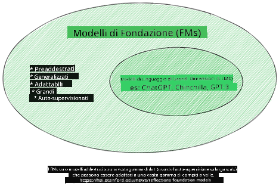

Fonte immagine: [Guida Essenziale ai Modelli di Fondazione e ai Modelli di Linguaggio di Grandi Dimensioni | di Babar M Bhatti | Medium
](https://thebabar.medium.com/essential-guide-to-foundation-models-and-large-language-models-27dab58f7404)

Per chiarire ulteriormente questa distinzione, prendiamo ChatGPT come esempio. Per costruire la prima versione di ChatGPT, un modello chiamato GPT-3.5 ha servito come modello di fondazione. Questo significa che OpenAI ha utilizzato alcuni dati specifici per chat per creare una versione affinata di GPT-3.5 specializzata nel funzionare bene in scenari conversazionali, come i chatbot.

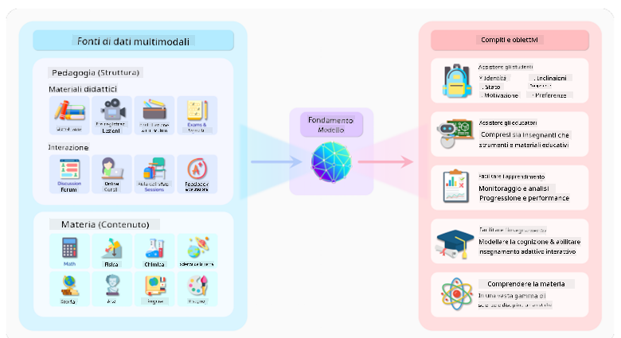

Fonte immagine: [2108.07258.pdf (arxiv.org)](https://arxiv.org/pdf/2108.07258.pdf?WT.mc_id=academic-105485-koreyst)

### Modelli Open Source contro Proprietari

Un altro modo per categorizzare gli LLM è se sono open source o proprietari.

I modelli open-source sono modelli messi a disposizione del pubblico e possono essere utilizzati da chiunque. Spesso sono messi a disposizione dall'azienda che li ha creati o dalla comunità di ricerca. Questi modelli possono essere ispezionati, modificati e personalizzati per i vari casi d'uso negli LLM. Tuttavia, non sono sempre ottimizzati per l'uso in produzione e potrebbero non essere performanti quanto i modelli proprietari. Inoltre, il finanziamento per i modelli open-source può essere limitato e potrebbero non essere mantenuti a lungo termine o aggiornati con le ultime ricerche. Esempi di modelli open source popolari includono [Alpaca](https://crfm.stanford.edu/2023/03/13/alpaca.html?WT.mc_id=academic-105485-koreyst), [Bloom](https://huggingface.co/bigscience/bloom) e [LLaMA](https://llama.meta.com).

I modelli proprietari sono modelli di proprietà di un'azienda e non sono messi a disposizione del pubblico. Questi modelli sono spesso ottimizzati per l'uso in produzione. Tuttavia, non possono essere ispezionati, modificati o personalizzati per diversi casi d'uso. Inoltre, non sono sempre disponibili gratuitamente e possono richiedere un abbonamento o un pagamento per essere utilizzati. Inoltre, gli utenti non hanno controllo sui dati utilizzati per addestrare il modello, il che significa che devono affidarsi al proprietario del modello per garantire l'impegno alla privacy dei dati e all'uso responsabile dell'AI. Esempi di modelli proprietari popolari includono [modelli OpenAI](https://platform.openai.com/docs/models/overview?WT.mc_id=academic-105485-koreyst), [Google Bard](https://sapling.ai/llm/bard?WT.mc_id=academic-105485-koreyst) o [Claude 2](https://www.anthropic.com/index/claude-2?WT.mc_id=academic-105485-koreyst).

### Embedding contro Generazione di Immagini contro Generazione di Testo e Codice

Gli LLM possono anche essere categorizzati in base all'output che generano.

Gli embeddings sono un insieme di modelli che possono convertire il testo in una forma numerica, chiamata embedding, che è una rappresentazione numerica del testo di input. Gli embeddings facilitano la comprensione da parte delle macchine delle relazioni tra parole o frasi e possono essere utilizzati come input da altri modelli, come modelli di classificazione o modelli di clustering che hanno migliori prestazioni sui dati numerici. I modelli di embedding sono spesso utilizzati per il trasferimento dell'apprendimento, dove un modello è costruito per un compito surrogato per cui c'è un'abbondanza di dati, e poi i pesi del modello (embeddings) vengono riutilizzati per altri compiti a valle. Un esempio di questa categoria è [OpenAI embeddings](https://platform.openai.com/docs/models/embeddings?WT.mc_id=academic-105485-koreyst).

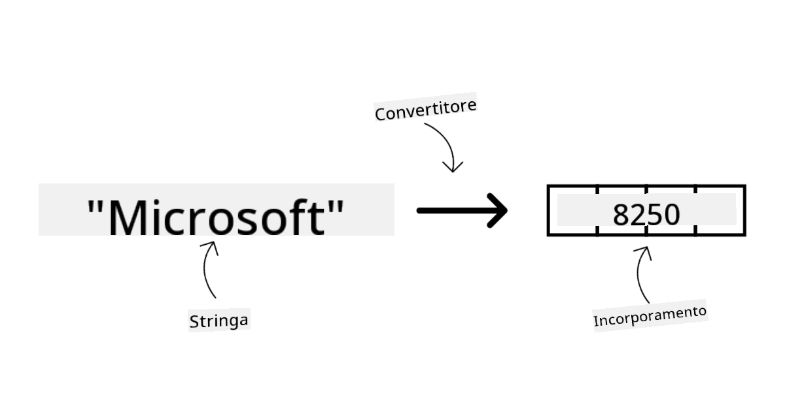

I modelli di generazione di immagini sono modelli che generano immagini. Questi modelli sono spesso utilizzati per l'editing delle immagini, la sintesi delle immagini e la traduzione delle immagini. I modelli di generazione di immagini sono spesso addestrati su grandi set di dati di immagini, come [LAION-5B](https://laion.ai/blog/laion-5b/?WT.mc_id=academic-105485-koreyst), e possono essere utilizzati per generare nuove immagini o per modificare immagini esistenti con tecniche di inpainting, super-risoluzione e colorizzazione. Esempi includono [DALL-E-3](https://openai.com/dall-e-3?WT.mc_id=academic-105485-koreyst) e [modelli di Stable Diffusion](https://github.com/Stability-AI/StableDiffusion?WT.mc_id=academic-105485-koreyst).

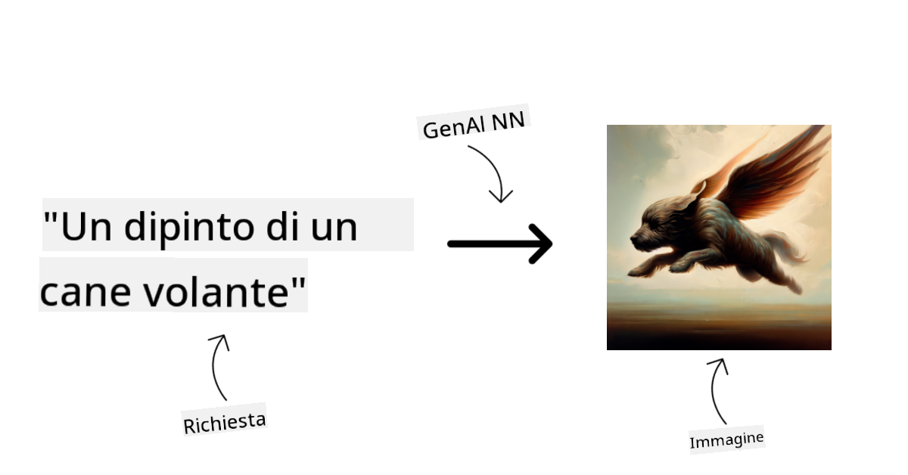

I modelli di generazione di testo e codice sono modelli che generano testo o codice. Questi modelli sono spesso utilizzati per la sintesi del testo, la traduzione e la risposta alle domande. I modelli di generazione di testo sono spesso addestrati su grandi set di dati di testo, come [BookCorpus](https://www.cv-foundation.org/openaccess/content_iccv_2015/html/Zhu_Aligning_Books_and_ICCV_2015_paper.html?WT.mc_id=academic-105485-koreyst), e possono essere utilizzati per generare nuovo testo o per rispondere a domande. I modelli di generazione di codice, come [CodeParrot](https://huggingface.co/codeparrot?WT.mc_id=academic-105485-koreyst), sono spesso addestrati su grandi set di dati di codice, come GitHub, e possono essere utilizzati per generare nuovo codice o per correggere bug nel codice esistente.

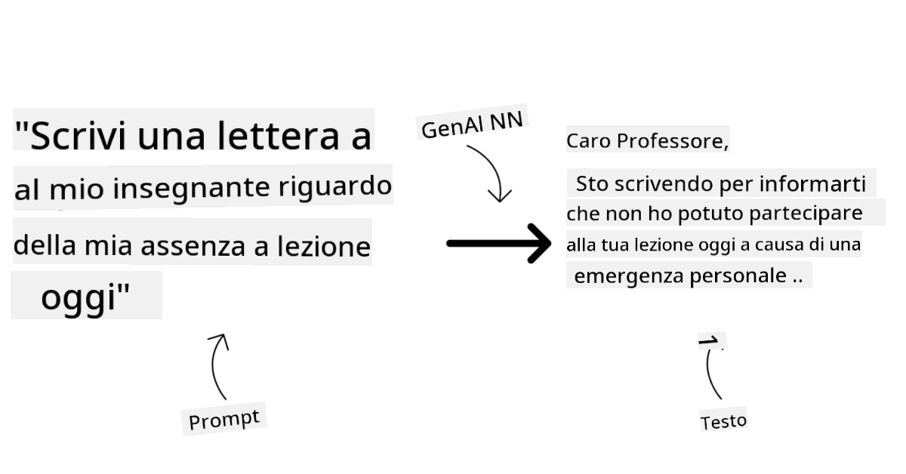

### Encoder-Decoder contro Solo Decoder

Per parlare dei diversi tipi di architetture degli LLM, utilizziamo un'analogia.

Immagina che il tuo manager ti abbia assegnato il compito di scrivere un quiz per gli studenti. Hai due colleghi; uno si occupa di creare il contenuto e l'altro di revisionarlo.

Il creatore di contenuti è come un modello Solo Decoder, può guardare l'argomento e vedere cosa hai già scritto e poi può scrivere un corso basato su quello. Sono molto bravi a scrivere contenuti coinvolgenti e informativi, ma non sono molto bravi a comprendere l'argomento e gli obiettivi di apprendimento. Alcuni esempi di modelli Decoder sono i modelli della famiglia GPT, come GPT-3.

Il revisore è come un modello Solo Encoder, guarda il corso scritto e le risposte, notando la relazione tra loro e comprendendo il contesto, ma non è bravo a generare contenuti. Un esempio di modello Solo Encoder sarebbe BERT.

Immagina che possiamo avere qualcuno che potrebbe anche creare e revisionare il quiz, questo è un modello Encoder-Decoder. Alcuni esempi sarebbero BART e T5.

### Servizio contro Modello

Ora, parliamo della differenza tra un servizio e un modello. Un servizio è un prodotto offerto da un fornitore di servizi cloud ed è spesso una combinazione di modelli, dati e altri componenti. Un modello è il componente centrale di un servizio ed è spesso un modello di fondazione, come un LLM.

I servizi sono spesso ottimizzati per l'uso in produzione e sono spesso più facili da usare rispetto ai modelli, tramite un'interfaccia utente grafica. Tuttavia, i servizi non sono sempre disponibili gratuitamente e possono richiedere un abbonamento o un pagamento per essere utilizzati, in cambio dell'uso delle attrezzature e delle risorse del proprietario del servizio, ottimizzando le spese e scalando facilmente. Un esempio di servizio è [Azure OpenAI Service](https://learn.microsoft.com/azure/ai-services/openai/overview?WT.mc_id=academic-105485-koreyst), che offre un piano tariffario a consumo, il che significa che gli utenti vengono addebitati proporzionalmente a quanto utilizzano il servizio. Inoltre, Azure OpenAI Service offre sicurezza di livello aziendale e un quadro AI responsabile oltre alle capacità dei modelli.

I modelli sono solo la rete neurale, con i parametri, i pesi e altri. Permettono alle aziende di funzionare localmente, tuttavia, sarebbe necessario acquistare attrezzature, costruire una struttura per scalare e acquistare una licenza o utilizzare un modello open-source. Un modello come LLaMA è disponibile per essere utilizzato, richiedendo potenza computazionale per eseguire il modello.

## Come testare e iterare con diversi modelli per comprendere le prestazioni su Azure

Una volta che il nostro team ha esplorato l'attuale panorama degli LLM e identificato alcuni buoni candidati per i loro scenari, il passo successivo è testarli sui loro dati e sul loro carico di lavoro. Questo è un processo iterativo, fatto tramite esperimenti e misure.
La maggior parte dei modelli menzionati nei paragrafi precedenti (modelli OpenAI, modelli open source come Llama2 e trasformatori Hugging Face) sono disponibili nel [Catalogo dei Modelli](https://learn.microsoft.com/azure/ai-studio/how-to/model-catalog-overview?WT.mc_id=academic-105485-koreyst) in [Azure AI Studio](https://ai.azure.com/?WT.mc_id=academic-105485-koreyst).

[Azure AI Studio](https://learn.microsoft.com/azure/ai-studio/what-is-ai-studio?WT.mc_id=academic-105485-koreyst) è una piattaforma cloud progettata per gli sviluppatori per costruire applicazioni AI generative e gestire l'intero ciclo di sviluppo - dalla sperimentazione alla valutazione - combinando tutti i servizi Azure AI in un unico hub con un'interfaccia grafica pratica. Il Catalogo dei Modelli in Azure AI Studio consente all'utente di:

- Trovare il Modello di Fondazione di interesse nel catalogo - sia proprietario che open source, filtrando per compito, licenza o nome. Per migliorare la ricerca, i modelli sono organizzati in collezioni, come la collezione Azure OpenAI, la collezione Hugging Face e altro.

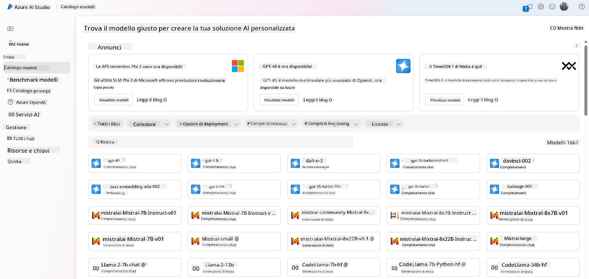

- Esaminare la scheda del modello, inclusa una descrizione dettagliata dell'uso previsto e dei dati di addestramento, esempi di codice e risultati della valutazione sulla libreria di valutazioni interne.

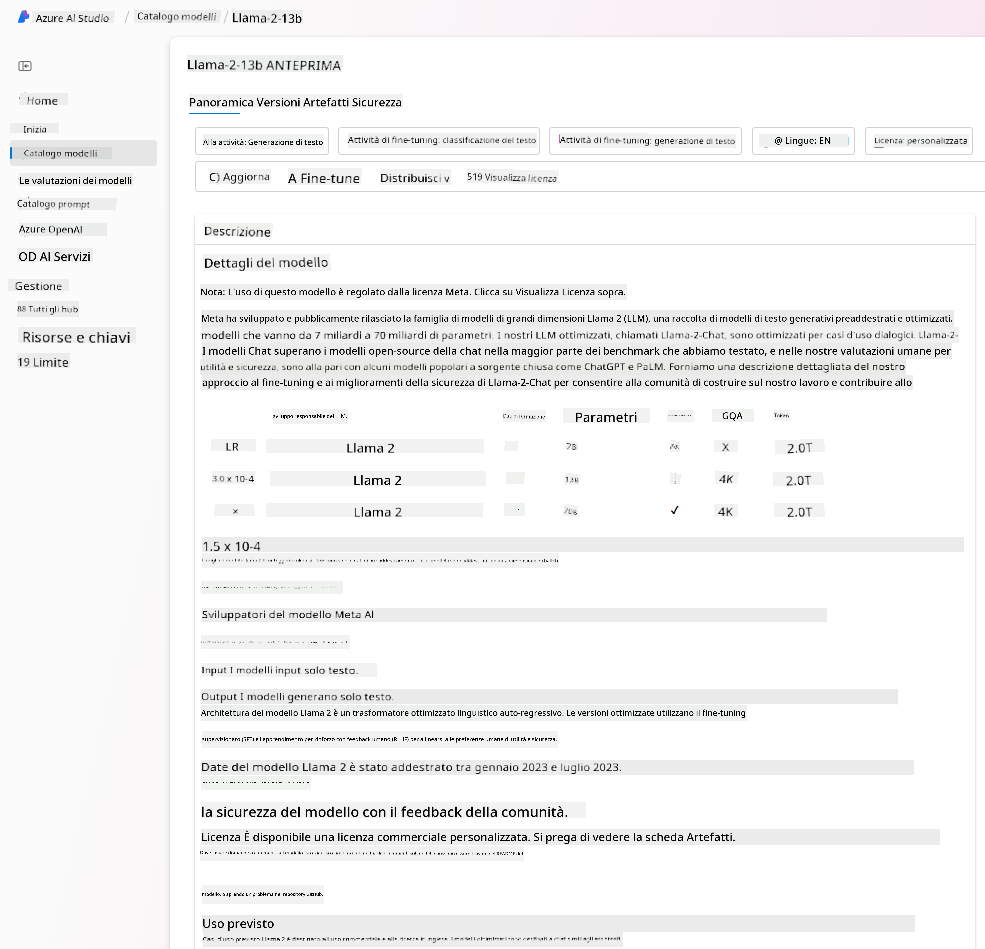
- Confronta i benchmark tra modelli e dataset disponibili nel settore per valutare quale soddisfa lo scenario aziendale, attraverso il pannello [Model Benchmarks](https://learn.microsoft.com/azure/ai-studio/how-to/model-benchmarks?WT.mc_id=academic-105485-koreyst).

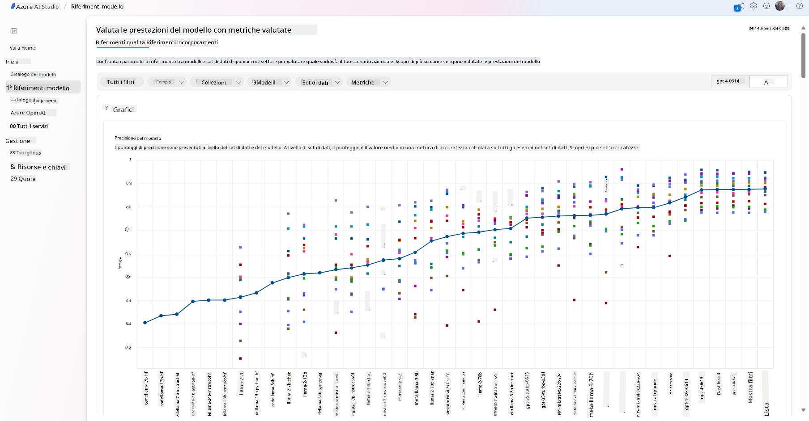

- Affina il modello su dati di addestramento personalizzati per migliorare le prestazioni del modello in un carico di lavoro specifico, sfruttando le capacità di sperimentazione e tracciamento di Azure AI Studio.

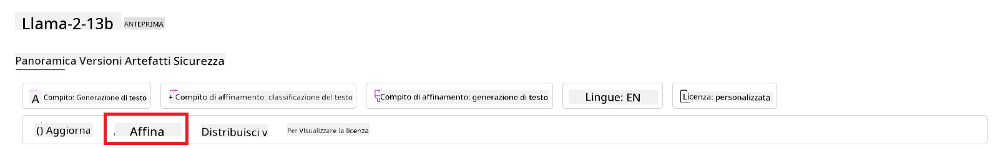

- Distribuisci il modello pre-addestrato originale o la versione affinata a un'inferenza remota in tempo reale - calcolo gestito - o endpoint API senza server - [pay-as-you-go](https://learn.microsoft.com/azure/ai-studio/how-to/model-catalog-overview#model-deployment-managed-compute-and-serverless-api-pay-as-you-go?WT.mc_id=academic-105485-koreyst) - per consentire alle applicazioni di utilizzarlo.

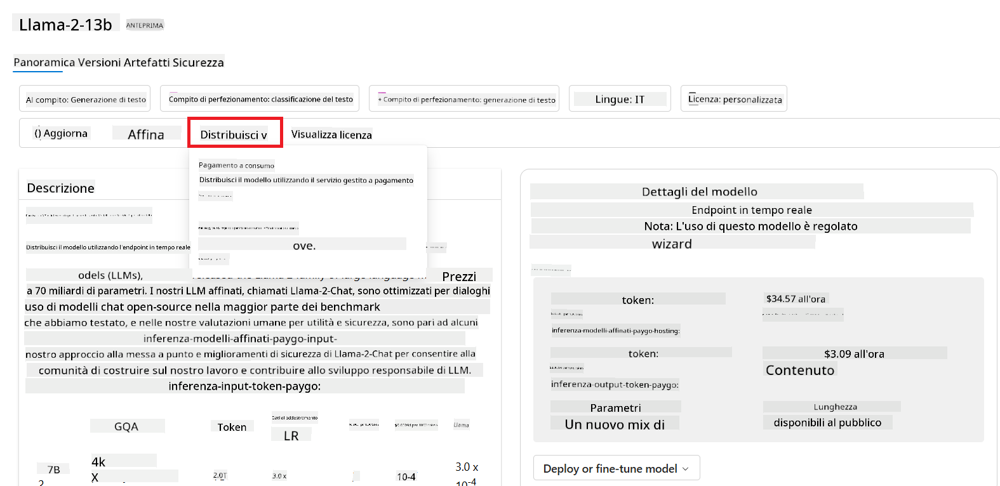

> [!NOTE]
> Non tutti i modelli nel catalogo sono attualmente disponibili per l'affinamento e/o la distribuzione pay-as-you-go. Controlla la scheda del modello per dettagli sulle capacità e limitazioni del modello.

## Migliorare i risultati degli LLM

Abbiamo esplorato con il nostro team di startup diversi tipi di LLM e una piattaforma cloud (Azure Machine Learning) che ci permette di confrontare diversi modelli, valutarli su dati di test, migliorare le prestazioni e distribuirli su endpoint di inferenza.

Ma quando dovrebbero considerare l'affinamento di un modello piuttosto che usare uno pre-addestrato? Ci sono altri approcci per migliorare le prestazioni del modello su carichi di lavoro specifici?

Ci sono diversi approcci che un'azienda può utilizzare per ottenere i risultati desiderati da un LLM. È possibile selezionare diversi tipi di modelli con diversi gradi di addestramento quando si distribuisce un LLM in produzione, con diversi livelli di complessità, costo e qualità. Ecco alcuni approcci diversi:

- **Ingegneria dei prompt con contesto**. L'idea è di fornire abbastanza contesto quando si fornisce un prompt per garantire di ottenere le risposte necessarie.

- **Generazione aumentata dal recupero, RAG**. I tuoi dati potrebbero esistere in un database o in un endpoint web, per esempio, per garantire che questi dati, o un loro sottoinsieme, siano inclusi al momento del prompt, puoi recuperare i dati pertinenti e renderli parte del prompt dell'utente.

- **Modello affinato**. Qui, hai addestrato ulteriormente il modello sui tuoi dati, il che ha portato il modello a essere più preciso e reattivo alle tue esigenze, ma potrebbe essere costoso.

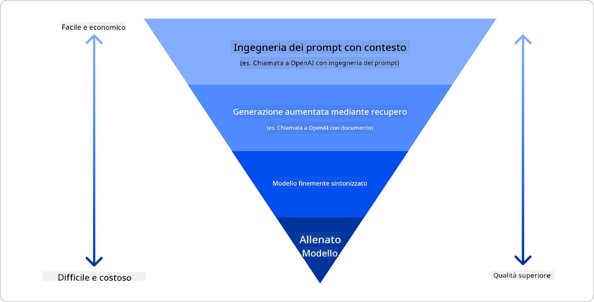

Fonte immagine: [Four Ways that Enterprises Deploy LLMs | Fiddler AI Blog](https://www.fiddler.ai/blog/four-ways-that-enterprises-deploy-llms?WT.mc_id=academic-105485-koreyst)

### Ingegneria dei Prompt con Contesto

Gli LLM pre-addestrati funzionano molto bene su compiti di linguaggio naturale generalizzati, anche richiamandoli con un breve prompt, come una frase da completare o una domanda – il cosiddetto apprendimento "zero-shot".

Tuttavia, più l'utente può inquadrare la sua richiesta, con una richiesta dettagliata ed esempi – il Contesto – più la risposta sarà accurata e vicina alle aspettative dell'utente. In questo caso, parliamo di apprendimento "one-shot" se il prompt include solo un esempio e di "few shot learning" se include più esempi. L'ingegneria dei prompt con contesto è l'approccio più conveniente per iniziare.

### Generazione Aumentata dal Recupero (RAG)

Gli LLM hanno la limitazione di poter utilizzare solo i dati che sono stati usati durante il loro addestramento per generare una risposta. Ciò significa che non sanno nulla dei fatti accaduti dopo il loro processo di addestramento e non possono accedere a informazioni non pubbliche (come i dati aziendali). Questo può essere superato attraverso il RAG, una tecnica che aumenta il prompt con dati esterni sotto forma di blocchi di documenti, considerando i limiti di lunghezza del prompt. Questo è supportato da strumenti di database vettoriali (come [Azure Vector Search](https://learn.microsoft.com/azure/search/vector-search-overview?WT.mc_id=academic-105485-koreyst)) che recuperano i blocchi utili da varie fonti di dati predefinite e li aggiungono al Contesto del prompt.

Questa tecnica è molto utile quando un'azienda non ha abbastanza dati, tempo o risorse per affinare un LLM, ma desidera comunque migliorare le prestazioni su un carico di lavoro specifico e ridurre i rischi di mistificazioni, cioè mistificazioni della realtà o contenuti dannosi.

### Modello affinato

L'affinamento è un processo che sfrutta l'apprendimento trasferito per 'adattare' il modello a un compito a valle o per risolvere un problema specifico. Diversamente dall'apprendimento few-shot e dal RAG, risulta in un nuovo modello generato, con pesi e bias aggiornati. Richiede un insieme di esempi di addestramento composto da un singolo input (il prompt) e il suo output associato (il completamento). Questo sarebbe l'approccio preferito se:

- **Utilizzo di modelli affinati**. Un'azienda desidera utilizzare modelli affinati meno capaci (come i modelli di embedding) piuttosto che modelli ad alte prestazioni, risultando in una soluzione più conveniente e veloce.

- **Considerazione della latenza**. La latenza è importante per un caso d'uso specifico, quindi non è possibile utilizzare prompt molto lunghi o il numero di esempi da cui il modello dovrebbe apprendere non si adatta al limite di lunghezza del prompt.

- **Rimanere aggiornati**. Un'azienda ha molti dati di alta qualità e etichette di verità a terra e le risorse necessarie per mantenere questi dati aggiornati nel tempo.

### Modello addestrato

Addestrare un LLM da zero è senza dubbio l'approccio più difficile e complesso da adottare, richiedendo enormi quantità di dati, risorse qualificate e potenza computazionale adeguata. Questa opzione dovrebbe essere considerata solo in uno scenario in cui un'azienda ha un caso d'uso specifico del dominio e una grande quantità di dati centrati sul dominio.

## Verifica delle conoscenze

Quale potrebbe essere un buon approccio per migliorare i risultati di completamento degli LLM?

1. Ingegneria dei prompt con contesto
1. RAG
1. Modello affinato

A:3, se hai il tempo e le risorse e dati di alta qualità, l'affinamento è l'opzione migliore per rimanere aggiornati. Tuttavia, se stai cercando di migliorare le cose e ti manca il tempo, vale la pena considerare prima il RAG.

## 🚀 Sfida

Approfondisci come puoi [usare il RAG](https://learn.microsoft.com/azure/search/retrieval-augmented-generation-overview?WT.mc_id=academic-105485-koreyst) per la tua azienda.

## Ottimo lavoro, continua a imparare

Dopo aver completato questa lezione, dai un'occhiata alla nostra [collezione di apprendimento sull'IA generativa](https://aka.ms/genai-collection?WT.mc_id=academic-105485-koreyst) per continuare a migliorare le tue conoscenze sull'IA generativa!

Vai alla Lezione 3 dove esamineremo come [costruire con l'IA generativa in modo responsabile](../03-using-generative-ai-responsibly/README.md?WT.mc_id=academic-105485-koreyst)!

**Disclaimer**:  
Questo documento è stato tradotto utilizzando il servizio di traduzione AI [Co-op Translator](https://github.com/Azure/co-op-translator). Sebbene ci impegniamo per l'accuratezza, si prega di essere consapevoli che le traduzioni automatiche possono contenere errori o imprecisioni. Il documento originale nella sua lingua nativa dovrebbe essere considerato la fonte autorevole. Per informazioni critiche, si raccomanda una traduzione professionale umana. Non siamo responsabili per eventuali malintesi o interpretazioni errate derivanti dall'uso di questa traduzione.