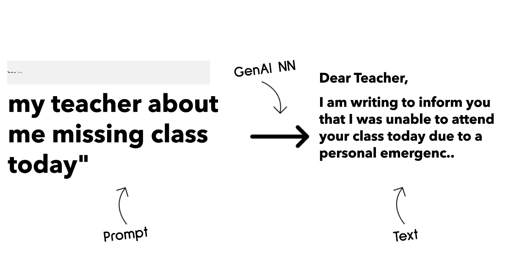
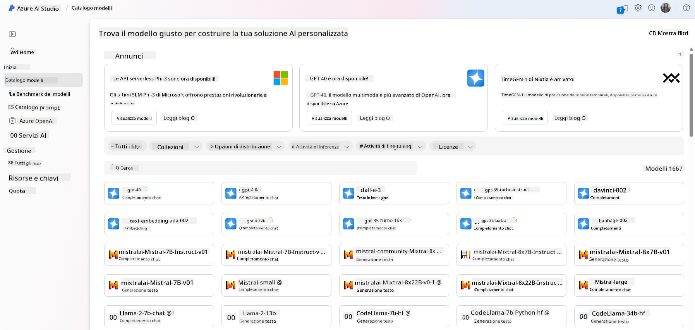
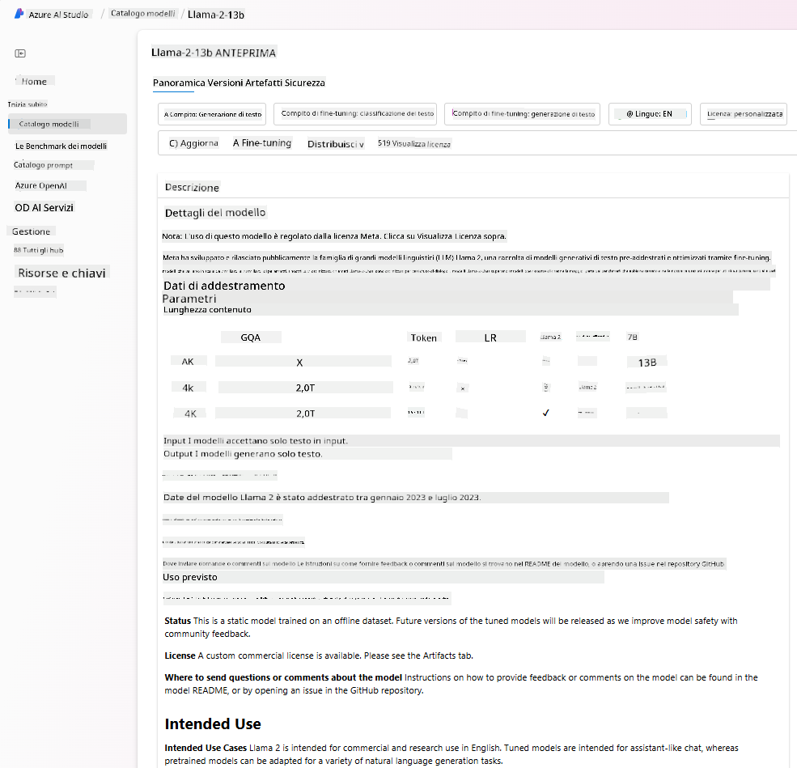
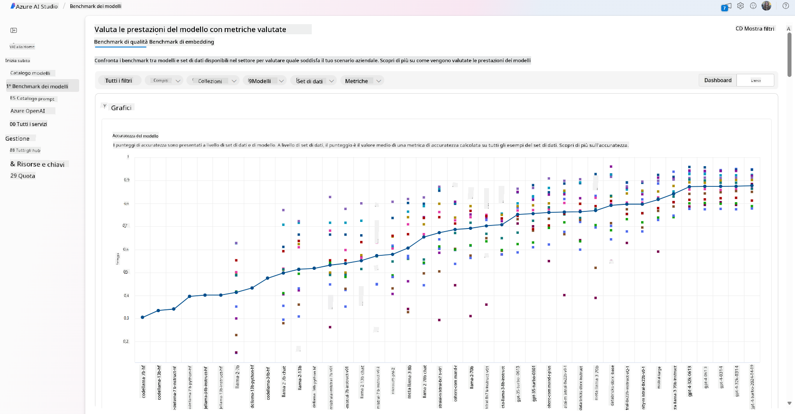
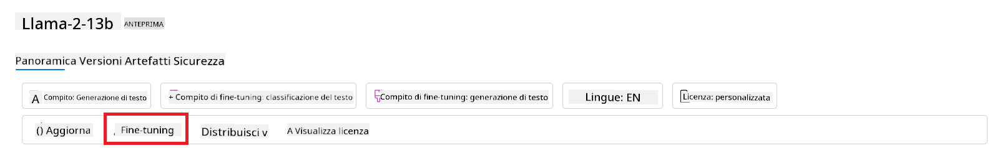

<!--
CO_OP_TRANSLATOR_METADATA:
{
  "original_hash": "6b7629b8ee4d7d874a27213e903d86a7",
  "translation_date": "2025-10-17T16:08:45+00:00",
  "source_file": "02-exploring-and-comparing-different-llms/README.md",
  "language_code": "it"
}
-->
# Esplorare e confrontare diversi LLM

> _Clicca sull'immagine sopra per vedere il video di questa lezione_

Nella lezione precedente, abbiamo visto come l'AI generativa stia cambiando il panorama tecnologico, come funzionano i modelli linguistici di grandi dimensioni (LLM) e come un'azienda - come la nostra startup - possa applicarli ai propri casi d'uso e crescere! In questo capitolo, cercheremo di confrontare e analizzare diversi tipi di modelli linguistici di grandi dimensioni (LLM) per comprenderne vantaggi e svantaggi.

Il prossimo passo nel percorso della nostra startup è esplorare il panorama attuale degli LLM e capire quali siano adatti al nostro caso d'uso.

## Introduzione

Questa lezione coprirà:

- I diversi tipi di LLM nel panorama attuale.
- Testare, iterare e confrontare diversi modelli per il tuo caso d'uso su Azure.
- Come distribuire un LLM.

## Obiettivi di apprendimento

Dopo aver completato questa lezione, sarai in grado di:

- Selezionare il modello giusto per il tuo caso d'uso.
- Comprendere come testare, iterare e migliorare le prestazioni del tuo modello.
- Sapere come le aziende distribuiscono i modelli.

## Comprendere i diversi tipi di LLM

Gli LLM possono essere classificati in base alla loro architettura, ai dati di addestramento e al caso d'uso. Comprendere queste differenze aiuterà la nostra startup a selezionare il modello giusto per lo scenario e a capire come testare, iterare e migliorare le prestazioni.

Esistono molti tipi diversi di modelli LLM, e la scelta del modello dipende da ciò che si intende fare, dai dati disponibili, dal budget e altro ancora.

A seconda che si voglia utilizzare i modelli per generare testo, audio, video, immagini e così via, si potrebbe optare per un tipo di modello diverso.

- **Riconoscimento audio e vocale**. Per questo scopo, i modelli tipo Whisper sono un'ottima scelta, poiché sono generici e mirati al riconoscimento vocale. Sono addestrati su audio diversificato e possono eseguire il riconoscimento vocale multilingue. Scopri di più sui [modelli tipo Whisper qui](https://platform.openai.com/docs/models/whisper?WT.mc_id=academic-105485-koreyst).

- **Generazione di immagini**. Per la generazione di immagini, DALL-E e Midjourney sono due scelte molto conosciute. DALL-E è offerto da Azure OpenAI. [Leggi di più su DALL-E qui](https://platform.openai.com/docs/models/dall-e?WT.mc_id=academic-105485-koreyst) e anche nel Capitolo 9 di questo curriculum.

- **Generazione di testo**. La maggior parte dei modelli è addestrata per la generazione di testo e ci sono molte opzioni disponibili, da GPT-3.5 a GPT-4. Hanno costi diversi, con GPT-4 che è il più costoso. Vale la pena esplorare il [playground di Azure OpenAI](https://oai.azure.com/portal/playground?WT.mc_id=academic-105485-koreyst) per valutare quali modelli si adattano meglio alle tue esigenze in termini di capacità e costo.

- **Multi-modalità**. Se stai cercando di gestire più tipi di dati in input e output, potresti voler esaminare modelli come [gpt-4 turbo con visione o gpt-4o](https://learn.microsoft.com/azure/ai-services/openai/concepts/models#gpt-4-and-gpt-4-turbo-models?WT.mc_id=academic-105485-koreyst) - le ultime versioni dei modelli OpenAI - che sono in grado di combinare l'elaborazione del linguaggio naturale con la comprensione visiva, consentendo interazioni attraverso interfacce multi-modali.

Selezionare un modello significa ottenere alcune capacità di base, che potrebbero non essere sufficienti. Spesso si dispone di dati specifici dell'azienda che è necessario comunicare in qualche modo all'LLM. Ci sono diverse opzioni su come affrontare questo, di cui parleremo nelle sezioni successive.

### Modelli di base versus LLM

Il termine Modello di Base è stato [coniato dai ricercatori di Stanford](https://arxiv.org/abs/2108.07258?WT.mc_id=academic-105485-koreyst) e definito come un modello AI che segue alcuni criteri, come:

- **Sono addestrati utilizzando l'apprendimento non supervisionato o l'apprendimento auto-supervisionato**, il che significa che sono addestrati su dati multi-modali non etichettati e non richiedono annotazioni o etichettature umane per il loro processo di addestramento.
- **Sono modelli molto grandi**, basati su reti neurali molto profonde addestrate su miliardi di parametri.
- **Sono normalmente destinati a servire come 'fondamento' per altri modelli**, il che significa che possono essere utilizzati come punto di partenza per costruire altri modelli, cosa che può essere fatta attraverso il fine-tuning.

Fonte immagine: [Essential Guide to Foundation Models and Large Language Models | di Babar M Bhatti | Medium
](https://thebabar.medium.com/essential-guide-to-foundation-models-and-large-language-models-27dab58f7404)

Per chiarire ulteriormente questa distinzione, prendiamo ChatGPT come esempio. Per costruire la prima versione di ChatGPT, un modello chiamato GPT-3.5 ha servito come modello di base. Ciò significa che OpenAI ha utilizzato alcuni dati specifici per creare una versione ottimizzata di GPT-3.5 specializzata nel funzionare bene in scenari conversazionali, come i chatbot.

Fonte immagine: [2108.07258.pdf (arxiv.org)](https://arxiv.org/pdf/2108.07258.pdf?WT.mc_id=academic-105485-koreyst)

### Modelli open source versus proprietari

Un altro modo per categorizzare gli LLM è se sono open source o proprietari.

I modelli open source sono modelli resi disponibili al pubblico e possono essere utilizzati da chiunque. Spesso sono resi disponibili dalla società che li ha creati o dalla comunità di ricerca. Questi modelli possono essere ispezionati, modificati e personalizzati per i vari casi d'uso degli LLM. Tuttavia, non sono sempre ottimizzati per l'uso in produzione e potrebbero non essere performanti come i modelli proprietari. Inoltre, il finanziamento per i modelli open source può essere limitato e potrebbero non essere mantenuti a lungo termine o aggiornati con le ultime ricerche. Esempi di modelli open source popolari includono [Alpaca](https://crfm.stanford.edu/2023/03/13/alpaca.html?WT.mc_id=academic-105485-koreyst), [Bloom](https://huggingface.co/bigscience/bloom) e [LLaMA](https://llama.meta.com).

I modelli proprietari sono modelli di proprietà di un'azienda e non sono resi disponibili al pubblico. Questi modelli sono spesso ottimizzati per l'uso in produzione. Tuttavia, non possono essere ispezionati, modificati o personalizzati per diversi casi d'uso. Inoltre, non sono sempre disponibili gratuitamente e potrebbero richiedere un abbonamento o un pagamento per essere utilizzati. Gli utenti non hanno controllo sui dati utilizzati per addestrare il modello, il che significa che devono fidarsi del proprietario del modello per garantire l'impegno alla privacy dei dati e all'uso responsabile dell'AI. Esempi di modelli proprietari popolari includono [modelli OpenAI](https://platform.openai.com/docs/models/overview?WT.mc_id=academic-105485-koreyst), [Google Bard](https://sapling.ai/llm/bard?WT.mc_id=academic-105485-koreyst) o [Claude 2](https://www.anthropic.com/index/claude-2?WT.mc_id=academic-105485-koreyst).

### Embedding versus generazione di immagini versus generazione di testo e codice

Gli LLM possono anche essere categorizzati in base al tipo di output che generano.

Gli embeddings sono un insieme di modelli che possono convertire il testo in una forma numerica, chiamata embedding, che è una rappresentazione numerica del testo di input. Gli embeddings facilitano la comprensione da parte delle macchine delle relazioni tra parole o frasi e possono essere utilizzati come input da altri modelli, come modelli di classificazione o modelli di clustering che hanno prestazioni migliori sui dati numerici. I modelli di embedding sono spesso utilizzati per il transfer learning, dove un modello viene costruito per un compito surrogato per il quale c'è abbondanza di dati, e poi i pesi del modello (embeddings) vengono riutilizzati per altri compiti a valle. Un esempio di questa categoria è [OpenAI embeddings](https://platform.openai.com/docs/models/embeddings?WT.mc_id=academic-105485-koreyst).

I modelli di generazione di immagini sono modelli che generano immagini. Questi modelli sono spesso utilizzati per l'editing di immagini, la sintesi di immagini e la traduzione di immagini. I modelli di generazione di immagini sono spesso addestrati su grandi dataset di immagini, come [LAION-5B](https://laion.ai/blog/laion-5b/?WT.mc_id=academic-105485-koreyst), e possono essere utilizzati per generare nuove immagini o per modificare immagini esistenti con tecniche di inpainting, super-risoluzione e colorazione. Esempi includono [DALL-E-3](https://openai.com/dall-e-3?WT.mc_id=academic-105485-koreyst) e [Stable Diffusion models](https://github.com/Stability-AI/StableDiffusion?WT.mc_id=academic-105485-koreyst).

I modelli di generazione di testo e codice sono modelli che generano testo o codice. Questi modelli sono spesso utilizzati per la sintesi di testo, la traduzione e la risposta a domande. I modelli di generazione di testo sono spesso addestrati su grandi dataset di testo, come [BookCorpus](https://www.cv-foundation.org/openaccess/content_iccv_2015/html/Zhu_Aligning_Books_and_ICCV_2015_paper.html?WT.mc_id=academic-105485-koreyst), e possono essere utilizzati per generare nuovo testo o per rispondere a domande. I modelli di generazione di codice, come [CodeParrot](https://huggingface.co/codeparrot?WT.mc_id=academic-105485-koreyst), sono spesso addestrati su grandi dataset di codice, come GitHub, e possono essere utilizzati per generare nuovo codice o per correggere bug nel codice esistente.

### Encoder-Decoder versus Decoder-only

Per parlare dei diversi tipi di architetture degli LLM, usiamo un'analogia.

Immagina che il tuo manager ti abbia assegnato il compito di scrivere un quiz per gli studenti. Hai due colleghi; uno si occupa di creare il contenuto e l'altro di rivederlo.

Il creatore di contenuti è come un modello Decoder-only, può guardare l'argomento e vedere cosa hai già scritto e poi scrivere un corso basato su quello. È molto bravo a scrivere contenuti coinvolgenti e informativi, ma non è molto bravo a comprendere l'argomento e gli obiettivi di apprendimento. Alcuni esempi di modelli Decoder sono i modelli della famiglia GPT, come GPT-3.

Il revisore è come un modello Encoder-only, guarda il corso scritto e le risposte, notando la relazione tra loro e comprendendo il contesto, ma non è bravo a generare contenuti. Un esempio di modello Encoder-only sarebbe BERT.

Immagina che possiamo avere anche qualcuno che potrebbe creare e rivedere il quiz, questo è un modello Encoder-Decoder. Alcuni esempi sarebbero BART e T5.

### Servizio versus Modello

Ora, parliamo della differenza tra un servizio e un modello. Un servizio è un prodotto offerto da un fornitore di servizi cloud ed è spesso una combinazione di modelli, dati e altri componenti. Un modello è il componente principale di un servizio ed è spesso un modello di base, come un LLM.

I servizi sono spesso ottimizzati per l'uso in produzione e sono spesso più facili da usare rispetto ai modelli, tramite un'interfaccia grafica. Tuttavia, i servizi non sono sempre disponibili gratuitamente e potrebbero richiedere un abbonamento o un pagamento per essere utilizzati, in cambio dell'utilizzo delle attrezzature e delle risorse del proprietario del servizio, ottimizzando le spese e scalando facilmente. Un esempio di servizio è [Azure OpenAI Service](https://learn.microsoft.com/azure/ai-services/openai/overview?WT.mc_id=academic-105485-koreyst), che offre un piano tariffario pay-as-you-go, il che significa che gli utenti vengono addebitati proporzionalmente a quanto utilizzano il servizio. Inoltre, Azure OpenAI Service offre sicurezza di livello aziendale e un framework AI responsabile oltre alle capacità dei modelli.

I modelli sono solo la rete neurale, con i parametri, i pesi e altri elementi. Consentono alle aziende di funzionare localmente, tuttavia, sarebbe necessario acquistare attrezzature, costruire una struttura per scalare e acquistare una licenza o utilizzare un modello open source. Un modello come LLaMA è disponibile per essere utilizzato, richiedendo potenza computazionale per eseguire il modello.

## Come testare e iterare con diversi modelli per comprendere le prestazioni su Azure

Una volta che il nostro team ha esplorato il panorama attuale degli LLM e identificato alcuni buoni candidati per i loro scenari, il passo successivo è testarli sui loro dati e sul loro carico di lavoro. Questo è un processo iterativo, fatto attraverso esperimenti e misurazioni.
La maggior parte dei modelli che abbiamo menzionato nei paragrafi precedenti (modelli OpenAI, modelli open source come Llama2 e i transformers di Hugging Face) sono disponibili nel [Catalogo Modelli](https://learn.microsoft.com/azure/ai-studio/how-to/model-catalog-overview?WT.mc_id=academic-105485-koreyst) in [Azure AI Studio](https://ai.azure.com/?WT.mc_id=academic-105485-koreyst).

[Azure AI Studio](https://learn.microsoft.com/azure/ai-studio/what-is-ai-studio?WT.mc_id=academic-105485-koreyst) è una piattaforma cloud progettata per gli sviluppatori per creare applicazioni di intelligenza artificiale generativa e gestire l'intero ciclo di sviluppo - dalla sperimentazione alla valutazione - combinando tutti i servizi Azure AI in un unico hub con un'interfaccia grafica intuitiva. Il Catalogo Modelli in Azure AI Studio consente agli utenti di:

- Trovare il modello di base di interesse nel catalogo - sia proprietario che open source, filtrando per attività, licenza o nome. Per migliorare la ricerca, i modelli sono organizzati in collezioni, come la collezione Azure OpenAI, la collezione Hugging Face e altre.

- Esaminare la scheda del modello, che include una descrizione dettagliata dell'uso previsto e dei dati di addestramento, esempi di codice e risultati di valutazione nella libreria interna di valutazioni.

- Confrontare i benchmark tra modelli e dataset disponibili nel settore per valutare quale soddisfa meglio lo scenario aziendale, attraverso il pannello [Benchmark dei Modelli](https://learn.microsoft.com/azure/ai-studio/how-to/model-benchmarks?WT.mc_id=academic-105485-koreyst).

- Ottimizzare il modello su dati di addestramento personalizzati per migliorare le prestazioni del modello in un carico di lavoro specifico, sfruttando le capacità di sperimentazione e tracciamento di Azure AI Studio.

- Distribuire il modello pre-addestrato originale o la versione ottimizzata per un'inferenza in tempo reale remota - calcolo gestito - o endpoint API serverless - [pay-as-you-go](https://learn.microsoft.com/azure/ai-studio/how-to/model-catalog-overview#model-deployment-managed-compute-and-serverless-api-pay-as-you-go?WT.mc_id=academic-105485-koreyst) - per consentire alle applicazioni di utilizzarlo.

> [!NOTE]
> Non tutti i modelli nel catalogo sono attualmente disponibili per l'ottimizzazione e/o la distribuzione pay-as-you-go. Controlla la scheda del modello per i dettagli sulle capacità e limitazioni del modello.

## Migliorare i risultati degli LLM

Abbiamo esplorato con il nostro team startup diversi tipi di LLM e una piattaforma cloud (Azure Machine Learning) che ci consente di confrontare diversi modelli, valutarli su dati di test, migliorare le prestazioni e distribuirli su endpoint di inferenza.

Ma quando è opportuno considerare l'ottimizzazione di un modello piuttosto che utilizzare uno pre-addestrato? Esistono altri approcci per migliorare le prestazioni del modello su carichi di lavoro specifici?

Ci sono diversi approcci che un'azienda può utilizzare per ottenere i risultati desiderati da un LLM. È possibile selezionare diversi tipi di modelli con diversi gradi di addestramento quando si distribuisce un LLM in produzione, con diversi livelli di complessità, costo e qualità. Ecco alcuni approcci:

- **Ingegneria dei prompt con contesto**. L'idea è fornire abbastanza contesto quando si invia un prompt per garantire di ottenere le risposte necessarie.

- **Generazione con Recupero di Informazioni, RAG**. I tuoi dati potrebbero esistere in un database o endpoint web, ad esempio, per garantire che questi dati, o un sottoinsieme di essi, siano inclusi al momento del prompt, puoi recuperare i dati rilevanti e renderli parte del prompt dell'utente.

- **Modello ottimizzato**. In questo caso, il modello viene ulteriormente addestrato sui propri dati, rendendolo più preciso e reattivo alle esigenze, ma potrebbe essere costoso.

Fonte immagine: [Four Ways that Enterprises Deploy LLMs | Fiddler AI Blog](https://www.fiddler.ai/blog/four-ways-that-enterprises-deploy-llms?WT.mc_id=academic-105485-koreyst)

### Ingegneria dei Prompt con Contesto

Gli LLM pre-addestrati funzionano molto bene su compiti generali di linguaggio naturale, anche con un prompt breve, come una frase da completare o una domanda – il cosiddetto apprendimento "zero-shot".

Tuttavia, più l'utente riesce a strutturare la propria richiesta, con una richiesta dettagliata e esempi – il Contesto – più la risposta sarà accurata e vicina alle aspettative dell'utente. In questo caso, si parla di apprendimento "one-shot" se il prompt include solo un esempio e di "few-shot learning" se include più esempi. L'ingegneria dei prompt con contesto è l'approccio più economico per iniziare.

### Generazione con Recupero di Informazioni (RAG)

Gli LLM hanno la limitazione di poter utilizzare solo i dati che sono stati utilizzati durante il loro addestramento per generare una risposta. Questo significa che non conoscono nulla dei fatti accaduti dopo il processo di addestramento e non possono accedere a informazioni non pubbliche (come i dati aziendali).
Questo limite può essere superato attraverso RAG, una tecnica che arricchisce il prompt con dati esterni sotto forma di frammenti di documenti, considerando i limiti di lunghezza del prompt. Questo è supportato da strumenti di database vettoriali (come [Azure Vector Search](https://learn.microsoft.com/azure/search/vector-search-overview?WT.mc_id=academic-105485-koreyst)) che recuperano i frammenti utili da fonti di dati predefinite e li aggiungono al Contesto del prompt.

Questa tecnica è molto utile quando un'azienda non ha abbastanza dati, tempo o risorse per ottimizzare un LLM, ma desidera comunque migliorare le prestazioni su un carico di lavoro specifico e ridurre i rischi di fabbricazioni, ovvero mistificazioni della realtà o contenuti dannosi.

### Modello Ottimizzato

L'ottimizzazione è un processo che sfrutta l'apprendimento per trasferimento per "adattare" il modello a un compito specifico o per risolvere un problema particolare. Diversamente dall'apprendimento few-shot e dal RAG, genera un nuovo modello con pesi e bias aggiornati. Richiede un set di esempi di addestramento composto da un singolo input (il prompt) e il suo output associato (la completamento).
Questo sarebbe l'approccio preferito se:

- **Utilizzo di modelli ottimizzati**. Un'azienda desidera utilizzare modelli ottimizzati meno capaci (come modelli di embedding) piuttosto che modelli ad alte prestazioni, risultando in una soluzione più economica e veloce.

- **Considerazione della latenza**. La latenza è importante per un caso d'uso specifico, quindi non è possibile utilizzare prompt molto lunghi o il numero di esempi che il modello dovrebbe apprendere non rientra nei limiti di lunghezza del prompt.

- **Aggiornamenti costanti**. Un'azienda dispone di molti dati di alta qualità e etichette di verità di base e delle risorse necessarie per mantenere questi dati aggiornati nel tempo.

### Modello Addestrato

Addestrare un LLM da zero è senza dubbio l'approccio più difficile e complesso da adottare, richiedendo enormi quantità di dati, risorse qualificate e potenza computazionale adeguata. Questa opzione dovrebbe essere considerata solo in uno scenario in cui un'azienda ha un caso d'uso specifico per il settore e una grande quantità di dati centrati sul dominio.

## Verifica delle conoscenze

Quale potrebbe essere un buon approccio per migliorare i risultati di completamento degli LLM?

1. Ingegneria dei prompt con contesto
1. RAG
1. Modello ottimizzato

A:3, se hai tempo, risorse e dati di alta qualità, l'ottimizzazione è l'opzione migliore per rimanere aggiornati. Tuttavia, se stai cercando di migliorare le cose e hai poco tempo, vale la pena considerare prima RAG.

## 🚀 Sfida

Approfondisci come puoi [utilizzare RAG](https://learn.microsoft.com/azure/search/retrieval-augmented-generation-overview?WT.mc_id=academic-105485-koreyst) per la tua azienda.

## Ottimo lavoro, continua a imparare

Dopo aver completato questa lezione, dai un'occhiata alla nostra [collezione di apprendimento sull'AI generativa](https://aka.ms/genai-collection?WT.mc_id=academic-105485-koreyst) per continuare a migliorare le tue conoscenze sull'AI generativa!

Vai alla Lezione 3 dove esamineremo come [costruire con l'AI generativa in modo responsabile](../03-using-generative-ai-responsibly/README.md?WT.mc_id=academic-105485-koreyst)!

---

**Disclaimer**:  
Questo documento è stato tradotto utilizzando il servizio di traduzione AI [Co-op Translator](https://github.com/Azure/co-op-translator). Sebbene ci impegniamo per garantire l'accuratezza, si prega di notare che le traduzioni automatiche possono contenere errori o imprecisioni. Il documento originale nella sua lingua nativa dovrebbe essere considerato la fonte autorevole. Per informazioni critiche, si raccomanda una traduzione professionale umana. Non siamo responsabili per eventuali incomprensioni o interpretazioni errate derivanti dall'uso di questa traduzione.