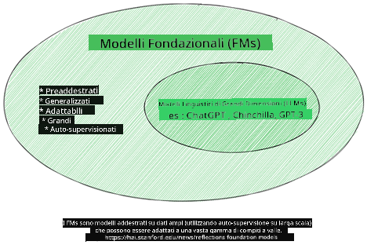
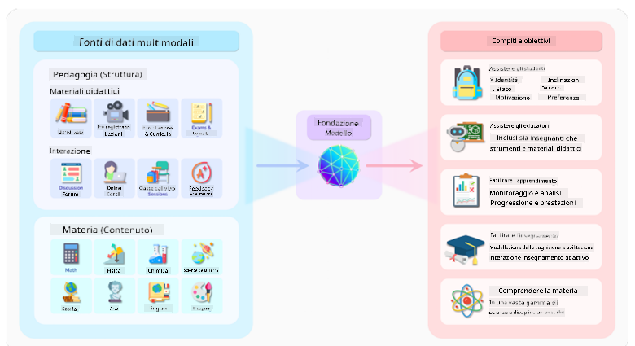
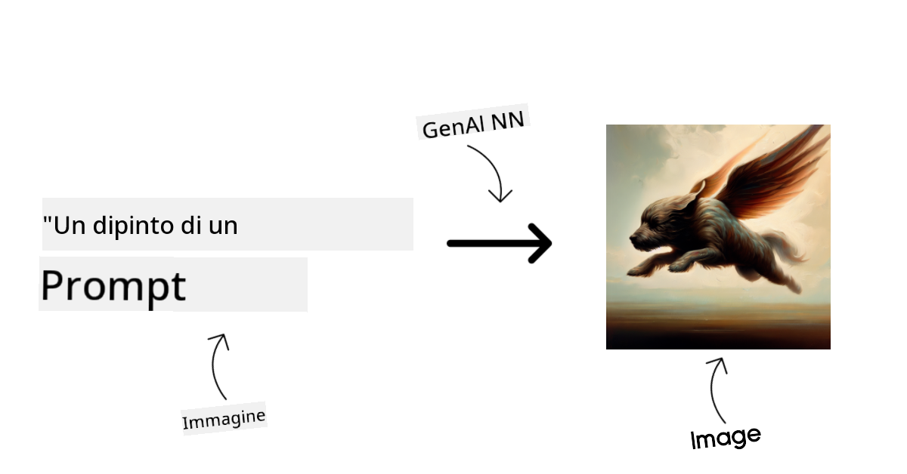
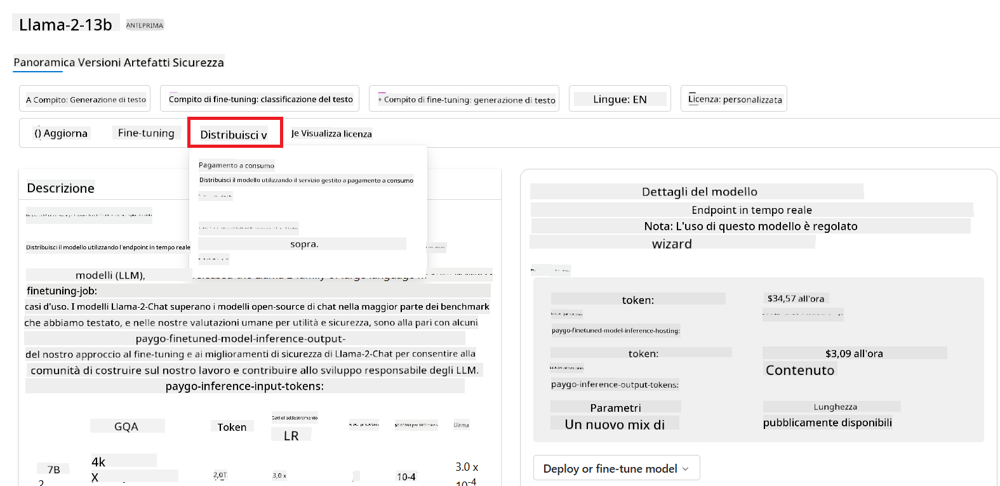
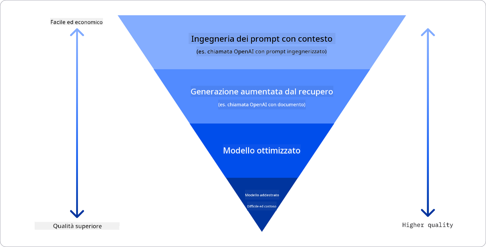

<!--
CO_OP_TRANSLATOR_METADATA:
{
  "original_hash": "e2f686f2eb794941761252ac5e8e090b",
  "translation_date": "2025-07-09T08:23:58+00:00",
  "source_file": "02-exploring-and-comparing-different-llms/README.md",
  "language_code": "it"
}
-->
# Esplorare e confrontare diversi LLM

> _Clicca sull'immagine sopra per vedere il video di questa lezione_

Con la lezione precedente, abbiamo visto come l’Intelligenza Artificiale Generativa stia cambiando il panorama tecnologico, come funzionano i Large Language Models (LLM) e come un’azienda – come la nostra startup – possa applicarli ai propri casi d’uso e crescere! In questo capitolo, ci concentreremo sul confronto tra diversi tipi di modelli di linguaggio di grandi dimensioni (LLM) per comprenderne vantaggi e svantaggi.

Il passo successivo nel percorso della nostra startup è esplorare l’attuale panorama degli LLM e capire quali siano adatti al nostro caso d’uso.

## Introduzione

Questa lezione tratterà:

- I diversi tipi di LLM presenti oggi sul mercato.
- Come testare, iterare e confrontare diversi modelli per il tuo caso d’uso su Azure.
- Come distribuire un LLM.

## Obiettivi di apprendimento

Al termine di questa lezione, sarai in grado di:

- Selezionare il modello giusto per il tuo caso d’uso.
- Capire come testare, iterare e migliorare le prestazioni del tuo modello.
- Conoscere come le aziende distribuiscono i modelli.

## Comprendere i diversi tipi di LLM

Gli LLM possono essere classificati in base alla loro architettura, ai dati di addestramento e al caso d’uso. Comprendere queste differenze aiuterà la nostra startup a scegliere il modello più adatto allo scenario e a capire come testare, iterare e migliorare le prestazioni.

Esistono molti tipi diversi di modelli LLM; la scelta dipende da cosa vuoi farne, dai tuoi dati, da quanto sei disposto a investire e altro ancora.

A seconda che tu voglia utilizzare i modelli per testo, audio, video, generazione di immagini e così via, potresti optare per un tipo di modello diverso.

- **Riconoscimento audio e vocale**. Per questo scopo, i modelli di tipo Whisper sono un’ottima scelta perché sono generalisti e pensati per il riconoscimento vocale. Sono addestrati su audio diversificato e possono eseguire riconoscimento vocale multilingue. Scopri di più sui [modelli di tipo Whisper qui](https://platform.openai.com/docs/models/whisper?WT.mc_id=academic-105485-koreyst).

- **Generazione di immagini**. Per la generazione di immagini, DALL-E e Midjourney sono due scelte molto conosciute. DALL-E è offerto da Azure OpenAI. [Leggi di più su DALL-E qui](https://platform.openai.com/docs/models/dall-e?WT.mc_id=academic-105485-koreyst) e anche nel Capitolo 9 di questo curriculum.

- **Generazione di testo**. La maggior parte dei modelli è addestrata per la generazione di testo e hai una vasta gamma di opzioni, da GPT-3.5 a GPT-4. Hanno costi diversi, con GPT-4 che è il più costoso. Vale la pena esplorare il [playground di Azure OpenAI](https://oai.azure.com/portal/playground?WT.mc_id=academic-105485-koreyst) per valutare quali modelli si adattano meglio alle tue esigenze in termini di capacità e costo.

- **Multi-modalità**. Se vuoi gestire più tipi di dati in input e output, potresti considerare modelli come [gpt-4 turbo con visione o gpt-4o](https://learn.microsoft.com/azure/ai-services/openai/concepts/models#gpt-4-and-gpt-4-turbo-models?WT.mc_id=academic-105485-koreyst) – le ultime versioni dei modelli OpenAI – che combinano l’elaborazione del linguaggio naturale con la comprensione visiva, permettendo interazioni tramite interfacce multi-modali.

Scegliere un modello significa ottenere alcune capacità di base, che però potrebbero non bastare. Spesso si dispone di dati specifici dell’azienda che in qualche modo devono essere comunicati all’LLM. Ci sono diverse opzioni su come affrontare questo aspetto, di cui parleremo nelle sezioni successive.

### Foundation Models vs LLM

Il termine Foundation Model è stato [coniato dai ricercatori di Stanford](https://arxiv.org/abs/2108.07258?WT.mc_id=academic-105485-koreyst) e definito come un modello di AI che rispetta alcuni criteri, come:

- **Sono addestrati usando apprendimento non supervisionato o auto-supervisionato**, cioè su dati multi-modali non etichettati, senza necessità di annotazioni umane per il processo di addestramento.
- **Sono modelli molto grandi**, basati su reti neurali molto profonde addestrate su miliardi di parametri.
- **Sono normalmente pensati per servire come ‘fondamento’ per altri modelli**, cioè possono essere usati come punto di partenza per costruire altri modelli tramite fine-tuning.

Fonte immagine: [Essential Guide to Foundation Models and Large Language Models | by Babar M Bhatti | Medium](https://thebabar.medium.com/essential-guide-to-foundation-models-and-large-language-models-27dab58f7404)

Per chiarire ulteriormente questa distinzione, prendiamo ChatGPT come esempio. Per costruire la prima versione di ChatGPT, un modello chiamato GPT-3.5 ha fatto da foundation model. Questo significa che OpenAI ha usato dati specifici per chat per creare una versione ottimizzata di GPT-3.5 specializzata nel funzionare bene in scenari conversazionali, come i chatbot.

Fonte immagine: [2108.07258.pdf (arxiv.org)](https://arxiv.org/pdf/2108.07258.pdf?WT.mc_id=academic-105485-koreyst)

### Modelli Open Source vs Proprietari

Un altro modo per classificare gli LLM è distinguere tra open source e proprietari.

I modelli open source sono resi disponibili al pubblico e possono essere usati da chiunque. Spesso sono rilasciati dall’azienda che li ha creati o dalla comunità di ricerca. Questi modelli possono essere ispezionati, modificati e personalizzati per vari casi d’uso. Tuttavia, non sempre sono ottimizzati per l’uso in produzione e potrebbero non essere performanti come i modelli proprietari. Inoltre, i finanziamenti per i modelli open source possono essere limitati, potrebbero non essere mantenuti a lungo termine o aggiornati con le ultime ricerche. Esempi di modelli open source popolari includono [Alpaca](https://crfm.stanford.edu/2023/03/13/alpaca.html?WT.mc_id=academic-105485-koreyst), [Bloom](https://huggingface.co/bigscience/bloom) e [LLaMA](https://llama.meta.com).

I modelli proprietari sono di proprietà di un’azienda e non sono resi disponibili al pubblico. Spesso sono ottimizzati per l’uso in produzione. Tuttavia, non possono essere ispezionati, modificati o personalizzati per diversi casi d’uso. Inoltre, non sempre sono gratuiti e possono richiedere un abbonamento o un pagamento per l’uso. Gli utenti non hanno controllo sui dati usati per addestrare il modello, quindi devono affidarsi al proprietario del modello per garantire impegno sulla privacy dei dati e sull’uso responsabile dell’AI. Esempi di modelli proprietari popolari includono i [modelli OpenAI](https://platform.openai.com/docs/models/overview?WT.mc_id=academic-105485-koreyst), [Google Bard](https://sapling.ai/llm/bard?WT.mc_id=academic-105485-koreyst) o [Claude 2](https://www.anthropic.com/index/claude-2?WT.mc_id=academic-105485-koreyst).

### Embedding vs Generazione di immagini vs Generazione di testo e codice

Gli LLM possono anche essere classificati in base al tipo di output che generano.

Gli embedding sono modelli che trasformano il testo in una forma numerica, chiamata embedding, che rappresenta numericamente il testo di input. Gli embedding facilitano la comprensione delle relazioni tra parole o frasi da parte delle macchine e possono essere usati come input da altri modelli, come quelli di classificazione o clustering, che funzionano meglio con dati numerici. I modelli di embedding sono spesso usati per il transfer learning, dove un modello è costruito per un compito surrogato con abbondanza di dati, e poi i pesi del modello (embedding) sono riutilizzati per altri compiti a valle. Un esempio di questa categoria è [OpenAI embeddings](https://platform.openai.com/docs/models/embeddings?WT.mc_id=academic-105485-koreyst).

I modelli di generazione di immagini sono modelli che creano immagini. Sono spesso usati per editing, sintesi e traduzione di immagini. Questi modelli sono addestrati su grandi dataset di immagini, come [LAION-5B](https://laion.ai/blog/laion-5b/?WT.mc_id=academic-105485-koreyst), e possono generare nuove immagini o modificare immagini esistenti con tecniche di inpainting, super-risoluzione e colorazione. Esempi includono [DALL-E-3](https://openai.com/dall-e-3?WT.mc_id=academic-105485-koreyst) e i [modelli Stable Diffusion](https://github.com/Stability-AI/StableDiffusion?WT.mc_id=academic-105485-koreyst).

I modelli di generazione di testo e codice sono modelli che producono testo o codice. Sono spesso usati per riassunti, traduzioni e risposte a domande. I modelli di generazione di testo sono addestrati su grandi dataset di testo, come [BookCorpus](https://www.cv-foundation.org/openaccess/content_iccv_2015/html/Zhu_Aligning_Books_and_ICCV_2015_paper.html?WT.mc_id=academic-105485-koreyst), e possono generare nuovo testo o rispondere a domande. I modelli di generazione di codice, come [CodeParrot](https://huggingface.co/codeparrot?WT.mc_id=academic-105485-koreyst), sono addestrati su grandi dataset di codice, come GitHub, e possono generare nuovo codice o correggere bug in codice esistente.

### Encoder-Decoder vs Decoder-only

Per parlare dei diversi tipi di architetture degli LLM, usiamo un’analogia.

Immagina che il tuo manager ti abbia assegnato il compito di scrivere un quiz per gli studenti. Hai due colleghi: uno si occupa di creare i contenuti e l’altro di revisarli.

Il creatore di contenuti è come un modello Decoder-only, può guardare l’argomento e vedere cosa hai già scritto, poi scrivere un corso basandosi su quello. Sono molto bravi a scrivere contenuti coinvolgenti e informativi, ma non sono molto efficaci nel comprendere l’argomento e gli obiettivi di apprendimento. Alcuni esempi di modelli Decoder sono i modelli della famiglia GPT, come GPT-3.

Il revisore è come un modello Encoder-only, guarda il corso scritto e le risposte, nota le relazioni tra loro e comprende il contesto, ma non è bravo a generare contenuti. Un esempio di modello Encoder-only è BERT.

Immagina che potessimo avere qualcuno che crea e rivede il quiz: questo è un modello Encoder-Decoder. Alcuni esempi sono BART e T5.

### Servizio vs Modello

Ora, parliamo della differenza tra un servizio e un modello. Un servizio è un prodotto offerto da un Cloud Service Provider, spesso una combinazione di modelli, dati e altri componenti. Un modello è il componente centrale di un servizio, spesso un foundation model, come un LLM.

I servizi sono spesso ottimizzati per l’uso in produzione e sono generalmente più facili da usare rispetto ai modelli, grazie a interfacce grafiche. Tuttavia, i servizi non sono sempre gratuiti e possono richiedere un abbonamento o un pagamento, in cambio dell’uso delle risorse e dell’infrastruttura del proprietario del servizio, ottimizzando i costi e facilitando la scalabilità. Un esempio di servizio è [Azure OpenAI Service](https://learn.microsoft.com/azure/ai-services/openai/overview?WT.mc_id=academic-105485-koreyst), che offre un piano pay-as-you-go, cioè gli utenti pagano in base all’effettivo utilizzo. Inoltre, Azure OpenAI Service offre sicurezza di livello enterprise e un framework di AI responsabile oltre alle capacità dei modelli.

I modelli sono solo la rete neurale, con parametri, pesi e altro. Permettono alle aziende di eseguirli localmente, ma richiedono l’acquisto di hardware, la costruzione di un’infrastruttura scalabile e l’acquisto di una licenza o l’uso di un modello open source. Un modello come LLaMA è disponibile per l’uso, ma necessita di potenza computazionale per essere eseguito.

## Come testare e iterare con diversi modelli per capire le prestazioni su Azure

Una volta che il nostro team ha esplorato il panorama attuale degli LLM e individuato alcuni candidati adatti ai loro scenari, il passo successivo è testarli sui propri dati e sul carico di lavoro. Questo è un processo iterativo, fatto di esperimenti e misurazioni.
La maggior parte dei modelli menzionati nei paragrafi precedenti (modelli OpenAI, modelli open source come Llama2 e transformer di Hugging Face) sono disponibili nel [Model Catalog](https://learn.microsoft.com/azure/ai-studio/how-to/model-catalog-overview?WT.mc_id=academic-105485-koreyst) in [Azure AI Studio](https://ai.azure.com/?WT.mc_id=academic-105485-koreyst).

[Azure AI Studio](https://learn.microsoft.com/azure/ai-studio/what-is-ai-studio?WT.mc_id=academic-105485-koreyst) è una piattaforma cloud pensata per gli sviluppatori per creare applicazioni di AI generativa e gestire l’intero ciclo di vita dello sviluppo - dall’esperimento alla valutazione - combinando tutti i servizi Azure AI in un unico hub con un’interfaccia grafica intuitiva. Il Model Catalog in Azure AI Studio permette all’utente di:

- Trovare il Foundation Model di interesse nel catalogo - proprietario o open source - filtrando per task, licenza o nome. Per migliorare la ricerca, i modelli sono organizzati in collezioni, come la collezione Azure OpenAI, la collezione Hugging Face e altre.

- Esaminare la scheda del modello, che include una descrizione dettagliata dell’uso previsto e dei dati di addestramento, esempi di codice e risultati di valutazione nella libreria interna di valutazioni.

- Confrontare benchmark tra modelli e dataset disponibili nel settore per valutare quale risponde meglio allo scenario di business, attraverso il pannello [Model Benchmarks](https://learn.microsoft.com/azure/ai-studio/how-to/model-benchmarks?WT.mc_id=academic-105485-koreyst).

- Effettuare il fine-tuning del modello su dati di addestramento personalizzati per migliorare le prestazioni su un carico di lavoro specifico, sfruttando le capacità di sperimentazione e tracciamento di Azure AI Studio.

- Distribuire il modello pre-addestrato originale o la versione fine-tuned su un endpoint di inferenza in tempo reale remoto - compute gestito - o endpoint API serverless - [pay-as-you-go](https://learn.microsoft.com/azure/ai-studio/how-to/model-catalog-overview#model-deployment-managed-compute-and-serverless-api-pay-as-you-go?WT.mc_id=academic-105485-koreyst) - per permettere alle applicazioni di utilizzarlo.

> [!NOTE]
> Non tutti i modelli nel catalogo sono attualmente disponibili per il fine-tuning e/o la distribuzione pay-as-you-go. Controlla la scheda del modello per dettagli sulle capacità e limitazioni del modello.

## Migliorare i risultati degli LLM

Abbiamo esplorato con il nostro team startup diversi tipi di LLM e una piattaforma cloud (Azure Machine Learning) che ci permette di confrontare modelli diversi, valutarli su dati di test, migliorare le prestazioni e distribuirli su endpoint di inferenza.

Ma quando conviene considerare il fine-tuning di un modello invece di usare uno pre-addestrato? Esistono altri approcci per migliorare le prestazioni del modello su carichi di lavoro specifici?

Ci sono diversi modi in cui un’azienda può ottenere i risultati desiderati da un LLM. È possibile scegliere modelli di diverso tipo con vari livelli di addestramento quando si distribuisce un LLM in produzione, con diversi livelli di complessità, costo e qualità. Ecco alcune opzioni:

- **Prompt engineering con contesto**. L’idea è fornire abbastanza contesto nel prompt per assicurarsi di ottenere le risposte desiderate.

- **Retrieval Augmented Generation, RAG**. I tuoi dati potrebbero esistere in un database o in un endpoint web, per esempio; per includere questi dati, o una loro parte, al momento del prompt, puoi recuperare i dati rilevanti e inserirli nel prompt dell’utente.

- **Modello fine-tuned**. Qui, il modello viene ulteriormente addestrato sui tuoi dati, rendendolo più preciso e reattivo alle tue esigenze, ma potrebbe essere costoso.

Fonte immagine: [Four Ways that Enterprises Deploy LLMs | Fiddler AI Blog](https://www.fiddler.ai/blog/four-ways-that-enterprises-deploy-llms?WT.mc_id=academic-105485-koreyst)

### Prompt Engineering con Contesto

Gli LLM pre-addestrati funzionano molto bene su compiti di linguaggio naturale generalizzati, anche con un prompt breve, come una frase da completare o una domanda – il cosiddetto “zero-shot” learning.

Tuttavia, più l’utente riesce a inquadrare la sua richiesta, con una domanda dettagliata ed esempi – il Contesto – più la risposta sarà accurata e vicina alle aspettative. In questo caso si parla di “one-shot” learning se il prompt include un solo esempio e di “few-shot learning” se ne include più di uno.
Il prompt engineering con contesto è l’approccio più economico per iniziare.

### Retrieval Augmented Generation (RAG)

Gli LLM hanno la limitazione di poter usare solo i dati con cui sono stati addestrati per generare una risposta. Questo significa che non conoscono fatti accaduti dopo il loro addestramento e non possono accedere a informazioni non pubbliche (come dati aziendali).
Questo limite può essere superato con RAG, una tecnica che arricchisce il prompt con dati esterni sotto forma di frammenti di documenti, tenendo conto dei limiti di lunghezza del prompt. Questo è supportato da strumenti di database vettoriali (come [Azure Vector Search](https://learn.microsoft.com/azure/search/vector-search-overview?WT.mc_id=academic-105485-koreyst)) che recuperano i frammenti utili da varie fonti di dati predefinite e li aggiungono al contesto del prompt.

Questa tecnica è molto utile quando un’azienda non ha abbastanza dati, tempo o risorse per fare fine-tuning di un LLM, ma vuole comunque migliorare le prestazioni su un carico di lavoro specifico e ridurre i rischi di invenzioni, cioè distorsioni della realtà o contenuti dannosi.

### Modello fine-tuned

Il fine-tuning è un processo che sfrutta il transfer learning per “adattare” il modello a un compito specifico o per risolvere un problema particolare. Diversamente dal few-shot learning e da RAG, genera un nuovo modello con pesi e bias aggiornati. Richiede un set di esempi di addestramento costituiti da un input singolo (il prompt) e il suo output associato (la completamento).
Questo approccio è preferibile se:

- **Si usano modelli fine-tuned**. Un’azienda preferisce usare modelli fine-tuned meno potenti (come modelli di embedding) invece di modelli ad alte prestazioni, ottenendo una soluzione più economica e veloce.

- **Si considera la latenza**. La latenza è importante per un caso d’uso specifico, quindi non è possibile usare prompt molto lunghi o un numero di esempi che il modello dovrebbe apprendere non rientra nei limiti di lunghezza del prompt.

- **Si vuole rimanere aggiornati**. Un’azienda dispone di molti dati di alta qualità e etichette di verità a terra e delle risorse necessarie per mantenere questi dati aggiornati nel tempo.

### Modello addestrato

Addestrare un LLM da zero è senza dubbio l’approccio più difficile e complesso, che richiede enormi quantità di dati, risorse qualificate e potenza computazionale adeguata. Questa opzione dovrebbe essere considerata solo se un’azienda ha un caso d’uso specifico di dominio e una grande quantità di dati centrati su quel dominio.

## Verifica delle conoscenze

Quale potrebbe essere un buon approccio per migliorare i risultati di completamento di un LLM?

1. Prompt engineering con contesto  
1. RAG  
1. Modello fine-tuned

Risposta: 3, se hai tempo, risorse e dati di alta qualità, il fine-tuning è l’opzione migliore per rimanere aggiornati. Tuttavia, se vuoi migliorare le cose e hai poco tempo, vale la pena considerare prima RAG.

## 🚀 Sfida

Approfondisci come puoi [usare RAG](https://learn.microsoft.com/azure/search/retrieval-augmented-generation-overview?WT.mc_id=academic-105485-koreyst) per la tua azienda.

## Ottimo lavoro, continua a imparare

Dopo aver completato questa lezione, dai un’occhiata alla nostra [collezione Generative AI Learning](https://aka.ms/genai-collection?WT.mc_id=academic-105485-koreyst) per continuare a migliorare le tue conoscenze sull’AI generativa!

Passa alla Lezione 3 dove vedremo come [costruire con Generative AI in modo responsabile](../03-using-generative-ai-responsibly/README.md?WT.mc_id=academic-105485-koreyst)!

**Disclaimer**:  
Questo documento è stato tradotto utilizzando il servizio di traduzione automatica [Co-op Translator](https://github.com/Azure/co-op-translator). Pur impegnandoci per garantire l’accuratezza, si prega di notare che le traduzioni automatiche possono contenere errori o imprecisioni. Il documento originale nella sua lingua nativa deve essere considerato la fonte autorevole. Per informazioni critiche, si raccomanda una traduzione professionale effettuata da un umano. Non ci assumiamo alcuna responsabilità per eventuali malintesi o interpretazioni errate derivanti dall’uso di questa traduzione.