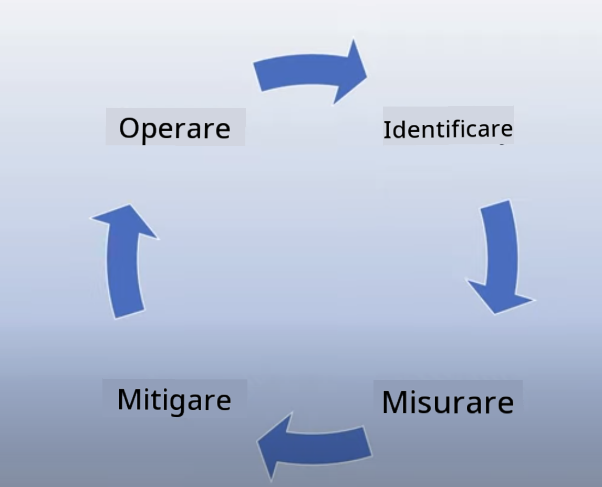

<!--
CO_OP_TRANSLATOR_METADATA:
{
  "original_hash": "7f8f4c11f8c1cb6e1794442dead414ea",
  "translation_date": "2025-07-09T08:54:52+00:00",
  "source_file": "03-using-generative-ai-responsibly/README.md",
  "language_code": "it"
}
-->
# Usare l’AI Generativa in Modo Responsabile

> _Clicca sull’immagine sopra per vedere il video di questa lezione_

È facile rimanere affascinati dall’AI e in particolare dall’AI generativa, ma è importante riflettere su come usarla responsabilmente. Bisogna considerare aspetti come garantire che i risultati siano equi, non dannosi e altro ancora. Questo capitolo ha l’obiettivo di fornirti il contesto necessario, cosa considerare e come adottare misure attive per migliorare il tuo utilizzo dell’AI.

## Introduzione

Questa lezione tratterà:

- Perché dovresti dare priorità all’AI Responsabile quando costruisci applicazioni di AI Generativa.
- I principi fondamentali dell’AI Responsabile e come si collegano all’AI Generativa.
- Come mettere in pratica questi principi di AI Responsabile attraverso strategie e strumenti.

## Obiettivi di Apprendimento

Al termine di questa lezione saprai:

- L’importanza dell’AI Responsabile nella costruzione di applicazioni di AI Generativa.
- Quando pensare e applicare i principi fondamentali dell’AI Responsabile durante lo sviluppo di applicazioni di AI Generativa.
- Quali strumenti e strategie sono a tua disposizione per mettere in pratica il concetto di AI Responsabile.

## Principi di AI Responsabile

L’entusiasmo per l’AI Generativa non è mai stato così alto. Questo entusiasmo ha portato molti nuovi sviluppatori, attenzione e finanziamenti in questo settore. Sebbene ciò sia molto positivo per chiunque voglia costruire prodotti e aziende usando l’AI Generativa, è altrettanto importante procedere con responsabilità.

Durante questo corso, ci concentreremo sulla costruzione della nostra startup e del nostro prodotto educativo sull’AI. Useremo i principi di AI Responsabile: Equità, Inclusività, Affidabilità/Sicurezza, Sicurezza & Privacy, Trasparenza e Responsabilità. Con questi principi esploreremo come si collegano al nostro uso dell’AI Generativa nei nostri prodotti.

## Perché Dovresti Dare Priorità all’AI Responsabile

Quando si costruisce un prodotto, adottare un approccio centrato sull’essere umano, tenendo a mente il miglior interesse dell’utente, porta ai risultati migliori.

La particolarità dell’AI Generativa è la sua capacità di creare risposte utili, informazioni, indicazioni e contenuti per gli utenti. Questo può avvenire senza molti passaggi manuali, portando a risultati molto impressionanti. Senza una pianificazione e strategie adeguate, purtroppo può anche causare risultati dannosi per gli utenti, il prodotto e la società nel suo complesso.

Vediamo alcuni (ma non tutti) di questi potenziali effetti dannosi:

### Allucinazioni

Il termine “allucinazioni” si usa per descrivere quando un LLM produce contenuti che sono completamente insensati o che sappiamo essere fattualmente errati basandoci su altre fonti di informazione.

Prendiamo ad esempio che sviluppiamo una funzionalità per la nostra startup che permette agli studenti di fare domande storiche a un modello. Uno studente chiede: `Chi è stato l’unico sopravvissuto del Titanic?`

Il modello produce una risposta come quella qui sotto:

> _(Fonte: [Flying bisons](https://flyingbisons.com?WT.mc_id=academic-105485-koreyst))_

Questa è una risposta molto sicura e dettagliata. Purtroppo, è sbagliata. Anche con una minima ricerca, si scoprirebbe che ci sono stati più sopravvissuti al disastro del Titanic. Per uno studente che sta iniziando a informarsi su questo argomento, questa risposta può essere abbastanza persuasiva da non essere messa in discussione e trattata come un fatto. Le conseguenze possono portare a rendere il sistema AI inaffidabile e danneggiare la reputazione della nostra startup.

Ad ogni iterazione di un LLM, abbiamo visto miglioramenti nella riduzione delle allucinazioni. Nonostante questo progresso, noi come sviluppatori e utenti dobbiamo comunque rimanere consapevoli di questi limiti.

### Contenuti Dannosi

Abbiamo visto nella sezione precedente quando un LLM produce risposte errate o insensate. Un altro rischio da tenere presente è quando un modello risponde con contenuti dannosi.

I contenuti dannosi possono essere definiti come:

- Fornire istruzioni o incoraggiare l’autolesionismo o il danno a determinati gruppi.
- Contenuti d’odio o denigratori.
- Guidare la pianificazione di attacchi o atti violenti.
- Fornire istruzioni su come trovare contenuti illegali o commettere atti illeciti.
- Mostrare contenuti sessualmente espliciti.

Per la nostra startup, vogliamo assicurarci di avere gli strumenti e le strategie giuste per evitare che questo tipo di contenuti venga visto dagli studenti.

### Mancanza di Equità

L’equità si definisce come “garantire che un sistema AI sia privo di pregiudizi e discriminazioni e che tratti tutti in modo equo e uguale.” Nel mondo dell’AI Generativa, vogliamo assicurarci che visioni escludenti di gruppi emarginati non vengano rafforzate dai risultati prodotti dal modello.

Questi tipi di output non solo sono distruttivi per costruire esperienze positive per i nostri utenti, ma causano anche danni sociali più ampi. Come sviluppatori di applicazioni, dovremmo sempre tenere a mente una base utenti ampia e diversificata quando costruiamo soluzioni con l’AI Generativa.

## Come Usare l’AI Generativa in Modo Responsabile

Ora che abbiamo identificato l’importanza dell’AI Generativa Responsabile, vediamo 4 passaggi che possiamo seguire per costruire le nostre soluzioni AI in modo responsabile:

### Misurare i Potenziali Danni

Nel testing del software, testiamo le azioni previste di un utente su un’applicazione. Allo stesso modo, testare un insieme diversificato di prompt che gli utenti probabilmente useranno è un buon modo per misurare i potenziali danni.

Dato che la nostra startup sta costruendo un prodotto educativo, sarebbe utile preparare una lista di prompt legati all’educazione. Questi potrebbero riguardare una certa materia, fatti storici e prompt sulla vita studentesca.

### Mitigare i Potenziali Danni

È ora di trovare modi per prevenire o limitare i potenziali danni causati dal modello e dalle sue risposte. Possiamo considerare questo su 4 livelli differenti:

- **Modello**. Scegliere il modello giusto per il caso d’uso corretto. Modelli più grandi e complessi come GPT-4 possono comportare un rischio maggiore di contenuti dannosi se applicati a casi d’uso più piccoli e specifici. Usare i dati di addestramento per il fine-tuning riduce anche il rischio di contenuti dannosi.

- **Sistema di Sicurezza**. Un sistema di sicurezza è un insieme di strumenti e configurazioni sulla piattaforma che serve il modello e aiuta a mitigare i danni. Un esempio è il sistema di filtraggio dei contenuti sul servizio Azure OpenAI. I sistemi dovrebbero anche rilevare attacchi di jailbreak e attività indesiderate come richieste da bot.

- **Metaprompt**. I metaprompt e il grounding sono modi per indirizzare o limitare il modello basandosi su certi comportamenti e informazioni. Questo può includere l’uso di input di sistema per definire certi limiti del modello. Inoltre, fornire output più rilevanti rispetto all’ambito o al dominio del sistema.

Può anche significare usare tecniche come Retrieval Augmented Generation (RAG) per far sì che il modello estragga informazioni solo da una selezione di fonti affidabili. C’è una lezione più avanti in questo corso su [come costruire applicazioni di ricerca](../08-building-search-applications/README.md?WT.mc_id=academic-105485-koreyst)

- **Esperienza Utente**. L’ultimo livello è dove l’utente interagisce direttamente con il modello attraverso l’interfaccia della nostra applicazione. In questo modo possiamo progettare l’UI/UX per limitare il tipo di input che l’utente può inviare al modello, così come i testi o le immagini mostrati all’utente. Quando distribuiamo l’applicazione AI, dobbiamo anche essere trasparenti su cosa la nostra applicazione di AI Generativa può e non può fare.

Abbiamo un’intera lezione dedicata a [Progettare l’UX per Applicazioni AI](../12-designing-ux-for-ai-applications/README.md?WT.mc_id=academic-105485-koreyst)

- **Valutare il modello**. Lavorare con gli LLM può essere impegnativo perché non sempre abbiamo il controllo sui dati con cui il modello è stato addestrato. Tuttavia, dovremmo sempre valutare le prestazioni e gli output del modello. È importante misurare l’accuratezza, la somiglianza, la fondatezza e la rilevanza dell’output. Questo aiuta a fornire trasparenza e fiducia a stakeholder e utenti.

### Gestire una Soluzione di AI Generativa Responsabile

Costruire una pratica operativa intorno alle tue applicazioni AI è l’ultimo stadio. Questo include collaborare con altre parti della nostra startup come il reparto Legale e Sicurezza per garantire la conformità a tutte le normative. Prima del lancio, vogliamo anche elaborare piani per la distribuzione, la gestione degli incidenti e il rollback per prevenire danni crescenti ai nostri utenti.

## Strumenti

Anche se sviluppare soluzioni di AI Responsabile può sembrare impegnativo, è un lavoro che vale la pena. Man mano che il campo dell’AI Generativa cresce, matureranno sempre più strumenti per aiutare gli sviluppatori a integrare la responsabilità nei loro flussi di lavoro in modo efficiente. Per esempio, [Azure AI Content Safety](https://learn.microsoft.com/azure/ai-services/content-safety/overview?WT.mc_id=academic-105485-koreyst) può aiutare a rilevare contenuti e immagini dannose tramite una richiesta API.

## Verifica delle Conoscenze

Quali sono alcune cose a cui devi prestare attenzione per garantire un uso responsabile dell’AI?

1. Che la risposta sia corretta.  
1. Uso dannoso, che l’AI non venga usata per scopi criminali.  
1. Assicurarsi che l’AI sia priva di pregiudizi e discriminazioni.

R: 2 e 3 sono corrette. L’AI Responsabile ti aiuta a considerare come mitigare effetti dannosi, pregiudizi e altro.

## 🚀 Sfida

Leggi su [Azure AI Content Safety](https://learn.microsoft.com/azure/ai-services/content-safety/overview?WT.mc_id=academic-105485-koreyst) e valuta cosa puoi adottare per il tuo utilizzo.

## Ottimo Lavoro, Continua a Imparare

Dopo aver completato questa lezione, dai un’occhiata alla nostra [collezione di apprendimento sull’AI Generativa](https://aka.ms/genai-collection?WT.mc_id=academic-105485-koreyst) per continuare a migliorare le tue conoscenze sull’AI Generativa!

Passa alla Lezione 4 dove esploreremo i [Fondamenti di Prompt Engineering](../04-prompt-engineering-fundamentals/README.md?WT.mc_id=academic-105485-koreyst)!

**Disclaimer**:  
Questo documento è stato tradotto utilizzando il servizio di traduzione automatica [Co-op Translator](https://github.com/Azure/co-op-translator). Pur impegnandoci per garantire accuratezza, si prega di notare che le traduzioni automatiche possono contenere errori o imprecisioni. Il documento originale nella sua lingua nativa deve essere considerato la fonte autorevole. Per informazioni critiche, si raccomanda una traduzione professionale effettuata da un umano. Non ci assumiamo alcuna responsabilità per eventuali malintesi o interpretazioni errate derivanti dall’uso di questa traduzione.