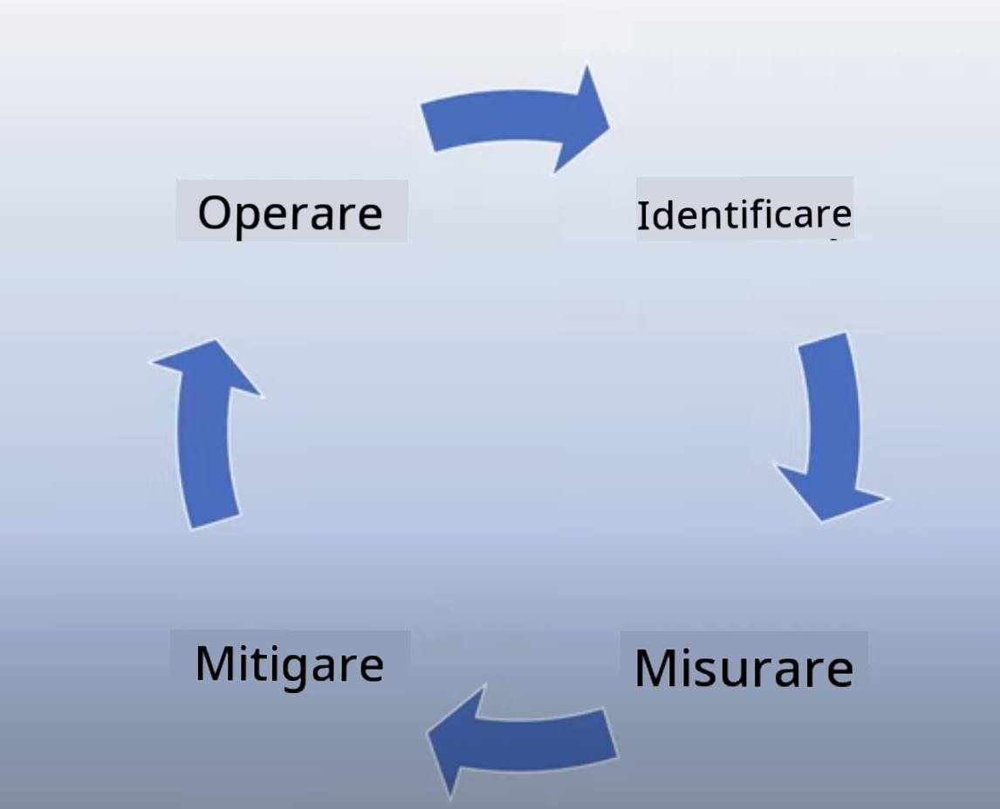
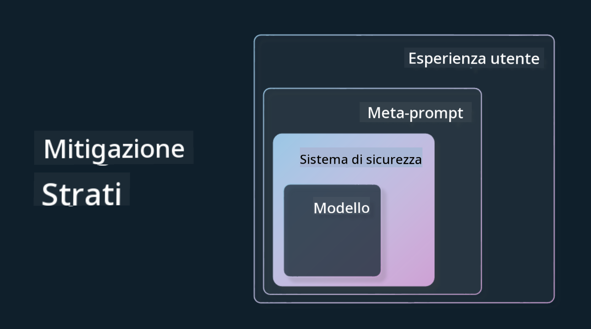

<!--
CO_OP_TRANSLATOR_METADATA:
{
  "original_hash": "13084c6321a2092841b9a081b29497ba",
  "translation_date": "2025-06-25T11:21:37+00:00",
  "source_file": "03-using-generative-ai-responsibly/README.md",
  "language_code": "it"
}
-->
# Uso Responsabile dell'Intelligenza Artificiale Generativa

> _Clicca sull'immagine sopra per vedere il video di questa lezione_

È facile essere affascinati dall'IA e dall'IA generativa in particolare, ma è necessario considerare come utilizzarla responsabilmente. Bisogna prendere in considerazione aspetti come garantire che il risultato sia equo, non dannoso e altro ancora. Questo capitolo mira a fornire il contesto menzionato, cosa considerare e come intraprendere passi attivi per migliorare l'uso dell'IA.

## Introduzione

Questa lezione coprirà:

- Perché dovresti dare priorità all'IA Responsabile quando costruisci applicazioni di IA Generativa.
- Principi fondamentali dell'IA Responsabile e come si relazionano all'IA Generativa.
- Come mettere in pratica questi principi dell'IA Responsabile attraverso strategie e strumenti.

## Obiettivi di Apprendimento

Dopo aver completato questa lezione saprai:

- L'importanza dell'IA Responsabile quando si costruiscono applicazioni di IA Generativa.
- Quando pensare e applicare i principi fondamentali dell'IA Responsabile nella costruzione di applicazioni di IA Generativa.
- Quali strumenti e strategie sono disponibili per mettere in pratica il concetto di IA Responsabile.

## Principi dell'IA Responsabile

L'entusiasmo per l'IA Generativa non è mai stato così alto. Questo entusiasmo ha portato molti nuovi sviluppatori, attenzione e finanziamenti in questo settore. Sebbene ciò sia molto positivo per chiunque voglia costruire prodotti e aziende utilizzando l'IA Generativa, è anche importante procedere responsabilmente.

Durante questo corso, ci concentriamo sulla costruzione della nostra startup e del nostro prodotto educativo basato sull'IA. Utilizzeremo i principi dell'IA Responsabile: Equità, Inclusività, Affidabilità/Sicurezza, Sicurezza e Privacy, Trasparenza e Responsabilità. Con questi principi, esploreremo come si relazionano al nostro uso dell'IA Generativa nei nostri prodotti.

## Perché Dovresti Dare Priorità all'IA Responsabile

Quando si costruisce un prodotto, adottare un approccio centrato sull'uomo mantenendo il miglior interesse dell'utente in mente porta ai migliori risultati.

L'unicità dell'IA Generativa è la sua capacità di creare risposte utili, informazioni, guida e contenuti per gli utenti. Questo può essere fatto senza molti passaggi manuali che possono portare a risultati molto impressionanti. Senza una pianificazione e strategie adeguate, può anche purtroppo portare a risultati dannosi per i tuoi utenti, il tuo prodotto e la società nel suo complesso.

Esaminiamo alcuni (ma non tutti) di questi potenzialmente dannosi risultati:

### Allucinazioni

Le allucinazioni sono un termine usato per descrivere quando un LLM produce contenuti che sono completamente insensati o qualcosa che sappiamo essere fattualmente sbagliato basato su altre fonti di informazione.

Prendiamo ad esempio il caso in cui costruiamo una funzionalità per la nostra startup che consente agli studenti di porre domande storiche a un modello. Uno studente pone la domanda `Who was the sole survivor of Titanic?`

Il modello produce una risposta come quella sotto:

> _(Fonte: [Flying bisons](https://flyingbisons.com?WT.mc_id=academic-105485-koreyst))_

Questa è una risposta molto sicura e dettagliata. Purtroppo, è errata. Anche con una minima quantità di ricerca, si scoprirebbe che ci sono stati più di un sopravvissuto al disastro del Titanic. Per uno studente che sta appena iniziando a ricercare questo argomento, questa risposta può essere abbastanza persuasiva da non essere messa in discussione e trattata come un dato di fatto. Le conseguenze di ciò possono portare il sistema di IA a essere inaffidabile e influenzare negativamente la reputazione della nostra startup.

Con ogni iterazione di un dato LLM, abbiamo visto miglioramenti delle prestazioni nel minimizzare le allucinazioni. Anche con questo miglioramento, noi come costruttori di applicazioni e utenti dobbiamo comunque rimanere consapevoli di queste limitazioni.

### Contenuti Dannosi

Abbiamo coperto nella sezione precedente quando un LLM produce risposte errate o insensate. Un altro rischio di cui dobbiamo essere consapevoli è quando un modello risponde con contenuti dannosi.

I contenuti dannosi possono essere definiti come:

- Fornire istruzioni o incoraggiare autolesionismo o danno a determinati gruppi.
- Contenuti odiosi o denigratori.
- Guidare la pianificazione di qualsiasi tipo di attacco o atti violenti.
- Fornire istruzioni su come trovare contenuti illegali o commettere atti illegali.
- Mostrare contenuti sessualmente espliciti.

Per la nostra startup, vogliamo assicurarci di avere gli strumenti e le strategie giuste in atto per prevenire che questo tipo di contenuti venga visto dagli studenti.

### Mancanza di Equità

L'equità è definita come “garantire che un sistema di IA sia libero da bias e discriminazioni e che tratti tutti in modo equo e uguale.” Nel mondo dell'IA Generativa, vogliamo assicurarci che le visioni del mondo escludenti dei gruppi emarginati non siano rafforzate dall'output del modello.

Questi tipi di output non sono solo distruttivi per costruire esperienze di prodotto positive per i nostri utenti, ma causano anche ulteriori danni sociali. Come costruttori di applicazioni, dovremmo sempre tenere a mente una base di utenti ampia e diversificata quando costruiamo soluzioni con l'IA Generativa.

## Come Usare l'IA Generativa in Modo Responsabile

Ora che abbiamo identificato l'importanza dell'IA Generativa Responsabile, vediamo 4 passi che possiamo intraprendere per costruire le nostre soluzioni di IA in modo responsabile:

### Misurare i Potenziali Danni

Nel testing software, testiamo le azioni previste di un utente su un'applicazione. Allo stesso modo, testare un set diversificato di prompt che gli utenti sono più probabilmente a utilizzare è un buon modo per misurare il potenziale danno.

Poiché la nostra startup sta costruendo un prodotto educativo, sarebbe utile preparare un elenco di prompt relativi all'educazione. Questo potrebbe coprire un certo argomento, fatti storici e prompt sulla vita degli studenti.

### Mitigare i Potenziali Danni

È ora di trovare modi in cui possiamo prevenire o limitare il potenziale danno causato dal modello e dalle sue risposte. Possiamo esaminare questo in 4 diversi livelli:

- **Modello**. Scegliere il modello giusto per il caso d'uso giusto. Modelli più grandi e complessi come GPT-4 possono causare un maggiore rischio di contenuti dannosi quando applicati a casi d'uso più piccoli e specifici. Utilizzare i dati di addestramento per affinare riduce anche il rischio di contenuti dannosi.

- **Sistema di Sicurezza**. Un sistema di sicurezza è un insieme di strumenti e configurazioni sulla piattaforma che serve il modello che aiutano a mitigare i danni. Un esempio di questo è il sistema di filtraggio dei contenuti sul servizio Azure OpenAI. I sistemi dovrebbero anche rilevare attacchi di jailbreak e attività indesiderate come richieste da bot.

- **Metaprompt**. I metaprompt e il grounding sono modi in cui possiamo indirizzare o limitare il modello basato su certi comportamenti e informazioni. Questo potrebbe essere utilizzando input di sistema per definire certi limiti del modello. Inoltre, fornire output più rilevanti per l'ambito o il dominio del sistema.

Può anche essere l'utilizzo di tecniche come la Generazione Augmentata dal Recupero (RAG) per fare in modo che il modello estragga informazioni solo da una selezione di fonti fidate. C'è una lezione più avanti in questo corso per [costruire applicazioni di ricerca](../08-building-search-applications/README.md?WT.mc_id=academic-105485-koreyst)

- **Esperienza Utente**. Il livello finale è dove l'utente interagisce direttamente con il modello attraverso l'interfaccia della nostra applicazione in qualche modo. In questo modo possiamo progettare la UI/UX per limitare l'utente sui tipi di input che possono inviare al modello così come il testo o le immagini visualizzate all'utente. Quando si distribuisce l'applicazione di IA, dobbiamo anche essere trasparenti su cosa la nostra applicazione di IA Generativa può e non può fare.

Abbiamo un'intera lezione dedicata a [Progettare UX per Applicazioni di IA](../12-designing-ux-for-ai-applications/README.md?WT.mc_id=academic-105485-koreyst)

- **Valutare il modello**. Lavorare con gli LLM può essere impegnativo perché non abbiamo sempre controllo sui dati su cui il modello è stato addestrato. Indipendentemente da ciò, dovremmo sempre valutare le prestazioni e gli output del modello. È comunque importante misurare l'accuratezza del modello, la somiglianza, la solidità e la rilevanza dell'output. Questo aiuta a fornire trasparenza e fiducia agli stakeholder e agli utenti.

### Operare una Soluzione di IA Generativa Responsabile

Costruire una pratica operativa intorno alle tue applicazioni di IA è la fase finale. Questo include collaborare con altre parti della nostra startup come il reparto Legale e Sicurezza per garantire che siamo conformi a tutte le politiche regolamentari. Prima del lancio, vogliamo anche costruire piani intorno alla consegna, alla gestione degli incidenti e al rollback per prevenire qualsiasi danno ai nostri utenti durante la crescita.

## Strumenti

Mentre il lavoro di sviluppare soluzioni di IA Responsabile può sembrare molto, è un lavoro che vale la pena. Man mano che l'area dell'IA Generativa cresce, più strumenti per aiutare gli sviluppatori a integrare responsabilmente nel loro flusso di lavoro matureranno. Ad esempio, la [Azure AI Content Safety](https://learn.microsoft.com/azure/ai-services/content-safety/overview?WT.mc_id=academic-105485-koreyst) può aiutare a rilevare contenuti dannosi e immagini tramite una richiesta API.

## Verifica della Conoscenza

Quali sono alcune cose di cui devi preoccuparti per garantire un uso responsabile dell'IA?

1. Che la risposta sia corretta.
1. Uso dannoso, che l'IA non venga utilizzata per scopi criminali.
1. Garantire che l'IA sia libera da bias e discriminazioni.

A: 2 e 3 sono corretti. L'IA Responsabile ti aiuta a considerare come mitigare gli effetti dannosi e i bias e altro ancora.

## 🚀 Sfida

Leggi su [Azure AI Content Safety](https://learn.microsoft.com/azure/ai-services/content-safety/overview?WT.mc_id=academic-105485-koreyst) e vedi cosa puoi adottare per il tuo utilizzo.

## Ottimo Lavoro, Continua il Tuo Apprendimento

Dopo aver completato questa lezione, dai un'occhiata alla nostra [collezione di Apprendimento sull'IA Generativa](https://aka.ms/genai-collection?WT.mc_id=academic-105485-koreyst) per continuare a migliorare la tua conoscenza dell'IA Generativa!

Vai alla Lezione 4 dove esamineremo i [Fondamenti dell'Ingegneria dei Prompt](../04-prompt-engineering-fundamentals/README.md?WT.mc_id=academic-105485-koreyst)!

**Disclaimer**:  
Questo documento è stato tradotto utilizzando il servizio di traduzione AI [Co-op Translator](https://github.com/Azure/co-op-translator). Anche se ci impegniamo per l'accuratezza, si prega di essere consapevoli che le traduzioni automatizzate possono contenere errori o imprecisioni. Il documento originale nella sua lingua nativa dovrebbe essere considerato la fonte autorevole. Per informazioni critiche, si raccomanda una traduzione professionale umana. Non siamo responsabili per eventuali malintesi o interpretazioni errate derivanti dall'uso di questa traduzione.