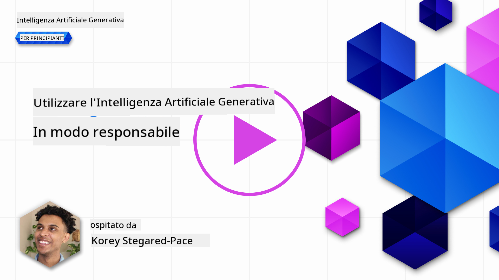
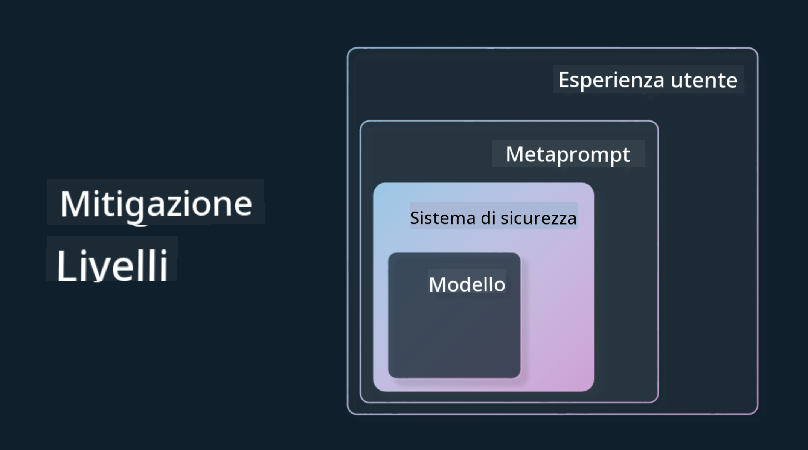

<!--
CO_OP_TRANSLATOR_METADATA:
{
  "original_hash": "4d57fad773cbeb69c5dd62e65c34200d",
  "translation_date": "2025-10-17T16:07:59+00:00",
  "source_file": "03-using-generative-ai-responsibly/README.md",
  "language_code": "it"
}
-->
# Utilizzo Responsabile dell'Intelligenza Artificiale Generativa

> _Clicca sull'immagine sopra per vedere il video di questa lezione_

È facile essere affascinati dall'IA e, in particolare, dall'IA generativa, ma è necessario considerare come utilizzarla in modo responsabile. Bisogna pensare a come garantire che i risultati siano equi, non dannosi e altro ancora. Questo capitolo mira a fornirti il contesto necessario, cosa considerare e come adottare misure attive per migliorare l'uso dell'IA.

## Introduzione

Questa lezione coprirà:

- Perché dovresti dare priorità all'IA Responsabile quando costruisci applicazioni di IA Generativa.
- Principi fondamentali dell'IA Responsabile e come si relazionano all'IA Generativa.
- Come mettere in pratica questi principi attraverso strategie e strumenti.

## Obiettivi di Apprendimento

Dopo aver completato questa lezione saprai:

- L'importanza dell'IA Responsabile nella costruzione di applicazioni di IA Generativa.
- Quando pensare e applicare i principi fondamentali dell'IA Responsabile nella costruzione di applicazioni di IA Generativa.
- Quali strumenti e strategie sono disponibili per mettere in pratica il concetto di IA Responsabile.

## Principi dell'IA Responsabile

L'entusiasmo per l'IA Generativa non è mai stato così alto. Questo entusiasmo ha portato molti nuovi sviluppatori, attenzione e finanziamenti in questo settore. Sebbene ciò sia molto positivo per chiunque voglia costruire prodotti e aziende utilizzando l'IA Generativa, è anche importante procedere in modo responsabile.

Durante questo corso, ci concentreremo sulla costruzione della nostra startup e del nostro prodotto educativo basato sull'IA. Utilizzeremo i principi dell'IA Responsabile: Equità, Inclusività, Affidabilità/Sicurezza, Sicurezza e Privacy, Trasparenza e Responsabilità. Con questi principi, esploreremo come si relazionano al nostro utilizzo dell'IA Generativa nei nostri prodotti.

## Perché Dovresti Dare Priorità all'IA Responsabile

Quando costruisci un prodotto, adottare un approccio centrato sull'essere umano, tenendo a mente il miglior interesse dell'utente, porta ai migliori risultati.

L'unicità dell'IA Generativa sta nel suo potere di creare risposte utili, informazioni, orientamenti e contenuti per gli utenti. Questo può essere fatto senza molti passaggi manuali, il che può portare a risultati molto impressionanti. Senza una pianificazione e strategie adeguate, può anche purtroppo portare a risultati dannosi per i tuoi utenti, il tuo prodotto e la società nel suo complesso.

Esaminiamo alcuni (ma non tutti) di questi potenziali risultati dannosi:

### Allucinazioni

Le allucinazioni sono un termine usato per descrivere quando un LLM produce contenuti che sono completamente insensati o qualcosa che sappiamo essere fattualmente errato basandoci su altre fonti di informazione.

Prendiamo ad esempio la costruzione di una funzione per la nostra startup che consente agli studenti di porre domande storiche a un modello. Uno studente pone la domanda `Chi è stato l'unico sopravvissuto del Titanic?`

Il modello produce una risposta come quella qui sotto:

> _(Fonte: [Flying bisons](https://flyingbisons.com?WT.mc_id=academic-105485-koreyst))_

Questa è una risposta molto sicura e dettagliata. Sfortunatamente, è errata. Anche con una minima quantità di ricerca, si scoprirebbe che ci sono stati più di un sopravvissuto al disastro del Titanic. Per uno studente che sta appena iniziando a ricercare questo argomento, questa risposta può essere abbastanza persuasiva da non essere messa in discussione e trattata come un fatto. Le conseguenze di ciò possono portare il sistema di IA a essere inaffidabile e influire negativamente sulla reputazione della nostra startup.

Con ogni iterazione di un dato LLM, abbiamo visto miglioramenti delle prestazioni nel minimizzare le allucinazioni. Anche con questo miglioramento, noi come costruttori di applicazioni e utenti dobbiamo rimanere consapevoli di queste limitazioni.

### Contenuti Dannosi

Abbiamo trattato nella sezione precedente quando un LLM produce risposte errate o insensate. Un altro rischio di cui dobbiamo essere consapevoli è quando un modello risponde con contenuti dannosi.

I contenuti dannosi possono essere definiti come:

- Fornire istruzioni o incoraggiare l'autolesionismo o il danno a determinati gruppi.
- Contenuti offensivi o denigratori.
- Guidare la pianificazione di qualsiasi tipo di attacco o atti violenti.
- Fornire istruzioni su come trovare contenuti illegali o commettere atti illegali.
- Mostrare contenuti sessualmente espliciti.

Per la nostra startup, vogliamo assicurarci di avere gli strumenti e le strategie giuste per prevenire che questo tipo di contenuti venga visto dagli studenti.

### Mancanza di Equità

L'equità è definita come "garantire che un sistema di IA sia libero da pregiudizi e discriminazioni e che tratti tutti in modo equo e uguale." Nel mondo dell'IA Generativa, vogliamo garantire che le visioni del mondo escludenti nei confronti dei gruppi emarginati non siano rafforzate dai risultati del modello.

Questi tipi di output non solo sono distruttivi per costruire esperienze positive di prodotto per i nostri utenti, ma causano anche ulteriori danni alla società. Come costruttori di applicazioni, dovremmo sempre tenere a mente una base di utenti ampia e diversificata quando costruiamo soluzioni con l'IA Generativa.

## Come Utilizzare l'IA Generativa in Modo Responsabile

Ora che abbiamo identificato l'importanza dell'IA Generativa Responsabile, esaminiamo 4 passaggi che possiamo intraprendere per costruire le nostre soluzioni di IA in modo responsabile:

### Misurare i Potenziali Danni

Nel test del software, testiamo le azioni previste di un utente su un'applicazione. Allo stesso modo, testare un set diversificato di prompt che gli utenti probabilmente utilizzeranno è un buon modo per misurare i potenziali danni.

Poiché la nostra startup sta costruendo un prodotto educativo, sarebbe utile preparare un elenco di prompt relativi all'educazione. Questo potrebbe coprire un certo argomento, fatti storici e prompt sulla vita degli studenti.

### Mitigare i Potenziali Danni

È ora il momento di trovare modi per prevenire o limitare i potenziali danni causati dal modello e dalle sue risposte. Possiamo esaminare questo in 4 diversi livelli:

- **Modello**. Scegliere il modello giusto per il caso d'uso giusto. Modelli più grandi e complessi come GPT-4 possono causare un rischio maggiore di contenuti dannosi quando applicati a casi d'uso più piccoli e specifici. Utilizzare i tuoi dati di addestramento per il fine-tuning riduce anche il rischio di contenuti dannosi.

- **Sistema di Sicurezza**. Un sistema di sicurezza è un insieme di strumenti e configurazioni sulla piattaforma che serve il modello e che aiutano a mitigare i danni. Un esempio di questo è il sistema di filtraggio dei contenuti nel servizio Azure OpenAI. I sistemi dovrebbero anche rilevare attacchi di jailbreak e attività indesiderate come richieste da bot.

- **Metaprompt**. I metaprompt e il grounding sono modi per dirigere o limitare il modello basandosi su certi comportamenti e informazioni. Questo potrebbe essere l'utilizzo di input di sistema per definire certi limiti del modello. Inoltre, fornire output più rilevanti per l'ambito o il dominio del sistema.

Può anche essere l'utilizzo di tecniche come Retrieval Augmented Generation (RAG) per far sì che il modello estragga informazioni solo da una selezione di fonti affidabili. C'è una lezione più avanti in questo corso per [costruire applicazioni di ricerca](../08-building-search-applications/README.md?WT.mc_id=academic-105485-koreyst)

- **Esperienza Utente**. L'ultimo livello è dove l'utente interagisce direttamente con il modello attraverso l'interfaccia della nostra applicazione in qualche modo. In questo modo possiamo progettare l'UI/UX per limitare l'utente sui tipi di input che può inviare al modello così come il testo o le immagini visualizzate all'utente. Quando distribuiamo l'applicazione di IA, dobbiamo anche essere trasparenti su ciò che la nostra applicazione di IA Generativa può e non può fare.

Abbiamo un'intera lezione dedicata a [Progettare UX per Applicazioni di IA](../12-designing-ux-for-ai-applications/README.md?WT.mc_id=academic-105485-koreyst)

- **Valutare il Modello**. Lavorare con gli LLM può essere impegnativo perché non abbiamo sempre il controllo sui dati su cui il modello è stato addestrato. Indipendentemente da ciò, dovremmo sempre valutare le prestazioni e gli output del modello. È comunque importante misurare l'accuratezza, la somiglianza, la fondatezza e la rilevanza dell'output del modello. Questo aiuta a fornire trasparenza e fiducia agli stakeholder e agli utenti.

### Operare una Soluzione di IA Generativa Responsabile

Costruire una pratica operativa attorno alle tue applicazioni di IA è la fase finale. Questo include collaborare con altre parti della nostra startup come il team Legale e Sicurezza per garantire la conformità a tutte le normative. Prima del lancio, vogliamo anche costruire piani attorno alla consegna, alla gestione degli incidenti e al rollback per prevenire qualsiasi danno agli utenti.

## Strumenti

Sebbene il lavoro di sviluppo di soluzioni di IA Responsabile possa sembrare molto, è un lavoro che vale la pena. Man mano che l'area dell'IA Generativa cresce, matureranno più strumenti per aiutare gli sviluppatori a integrare responsabilità nei loro flussi di lavoro in modo efficiente. Ad esempio, [Azure AI Content Safety](https://learn.microsoft.com/azure/ai-services/content-safety/overview?WT.mc_id=academic-105485-koreyst) può aiutare a rilevare contenuti e immagini dannosi tramite una richiesta API.

## Verifica della Conoscenza

Quali sono alcune cose di cui devi occuparti per garantire un uso responsabile dell'IA?

1. Che la risposta sia corretta.
1. Uso dannoso, che l'IA non venga utilizzata per scopi criminali.
1. Garantire che l'IA sia priva di pregiudizi e discriminazioni.

A: 2 e 3 sono corrette. L'IA Responsabile ti aiuta a considerare come mitigare effetti dannosi e pregiudizi e altro.

## 🚀 Sfida

Leggi su [Azure AI Content Safety](https://learn.microsoft.com/azure/ai-services/content-safety/overview?WT.mc_id=academic-105485-koreyst) e scopri cosa puoi adottare per il tuo utilizzo.

## Ottimo Lavoro, Continua a Imparare

Dopo aver completato questa lezione, dai un'occhiata alla nostra [collezione di apprendimento sull'IA Generativa](https://aka.ms/genai-collection?WT.mc_id=academic-105485-koreyst) per continuare a migliorare la tua conoscenza dell'IA Generativa!

Vai alla Lezione 4 dove esamineremo [Fondamenti di Ingegneria dei Prompt](../04-prompt-engineering-fundamentals/README.md?WT.mc_id=academic-105485-koreyst)!

---

**Disclaimer**:  
Questo documento è stato tradotto utilizzando il servizio di traduzione AI [Co-op Translator](https://github.com/Azure/co-op-translator). Sebbene ci impegniamo per garantire l'accuratezza, si prega di notare che le traduzioni automatiche possono contenere errori o imprecisioni. Il documento originale nella sua lingua nativa dovrebbe essere considerato la fonte autorevole. Per informazioni critiche, si consiglia una traduzione professionale umana. Non siamo responsabili per eventuali incomprensioni o interpretazioni errate derivanti dall'uso di questa traduzione.