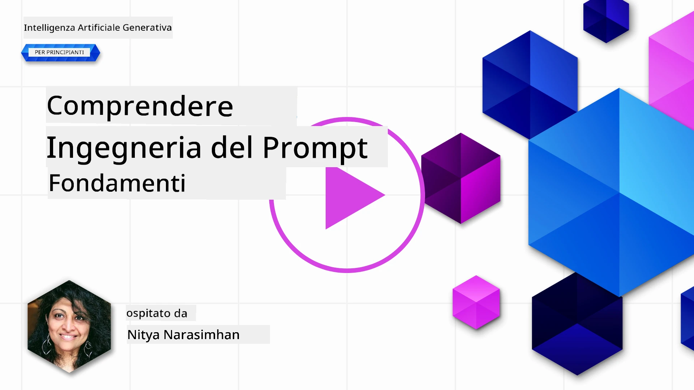
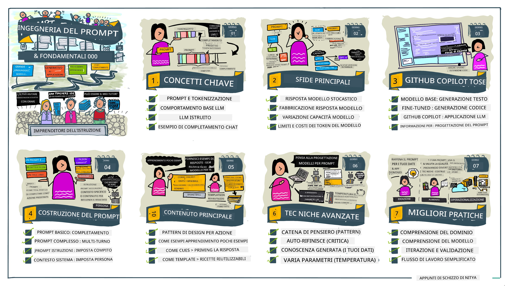
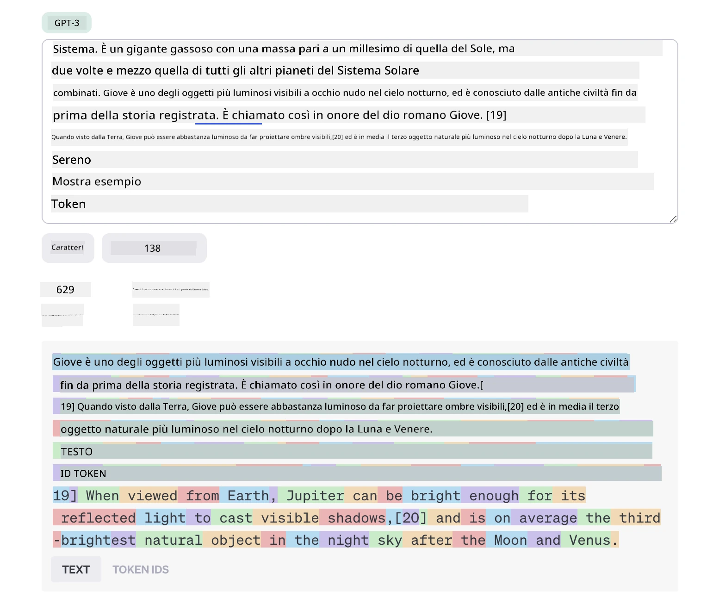
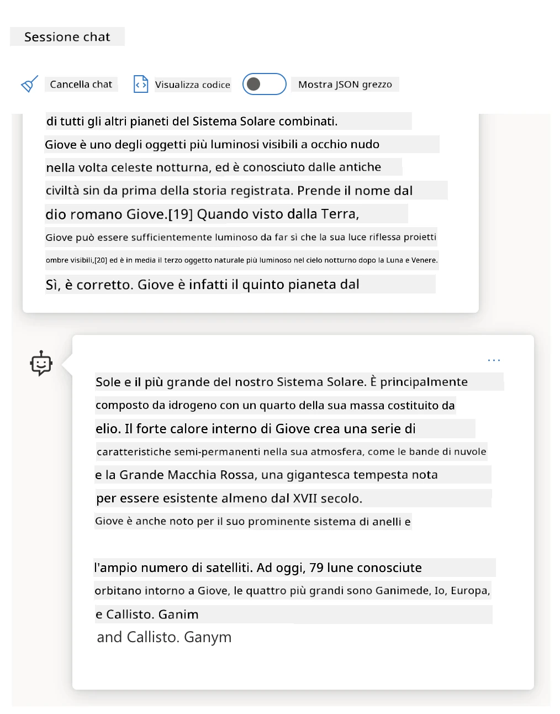
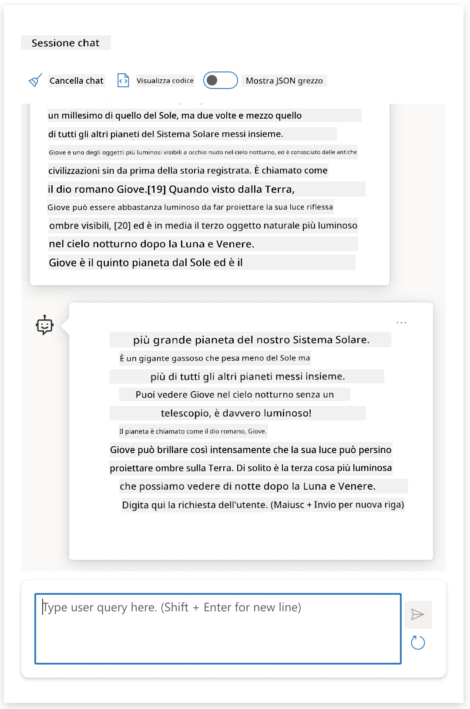
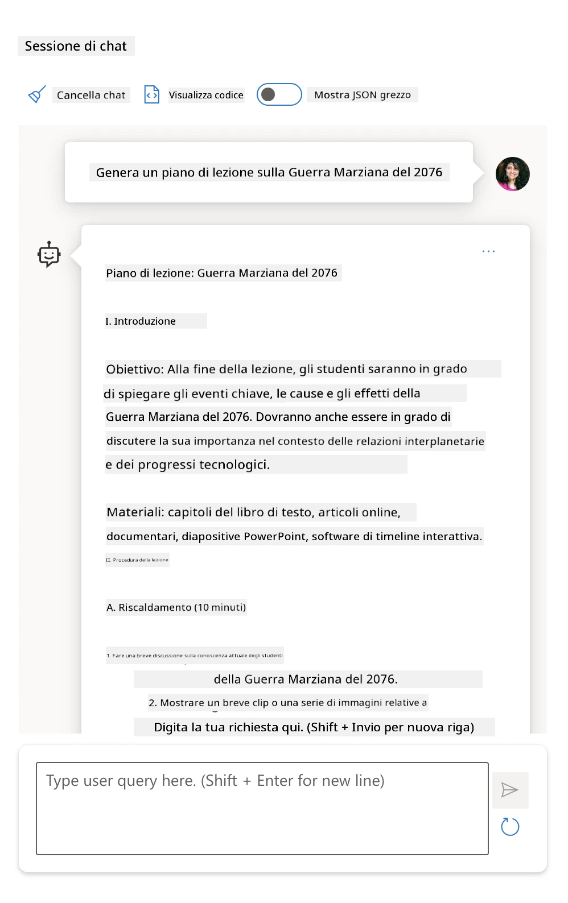
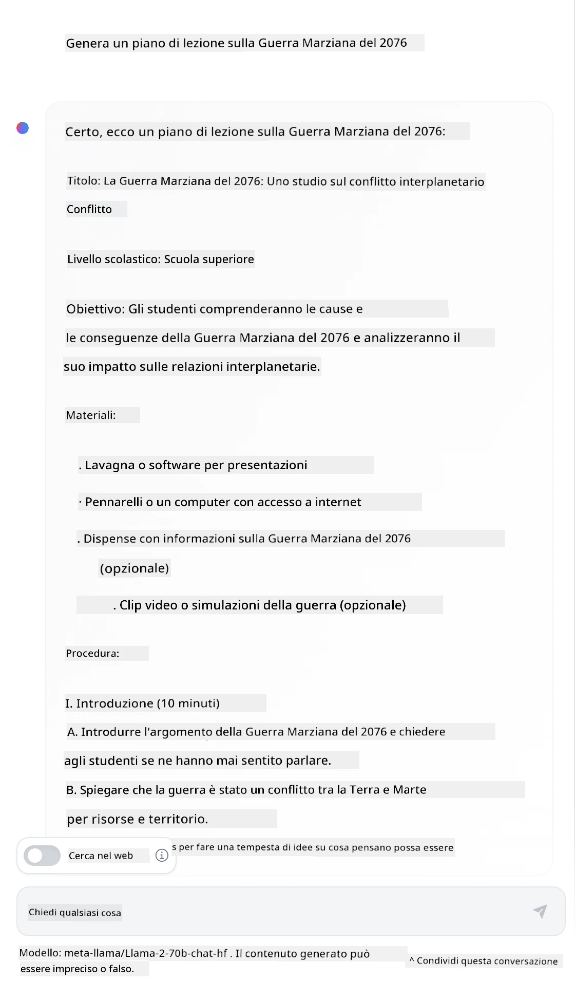

# Fondamenti di Prompt Engineering

[](https://youtu.be/GElCu2kUlRs?si=qrXsBvXnCW12epb8)

## Introduzione
Questo modulo copre concetti e tecniche essenziali per creare prompt efficaci nei modelli di AI generativa. Anche il modo in cui scrivi il tuo prompt a un LLM conta. Un prompt accuratamente realizzato può ottenere una migliore qualità di risposta. Ma cosa significano esattamente termini come _prompt_ e _prompt engineering_? E come posso migliorare l'_input_ del prompt che invio al LLM? Queste sono le domande a cui cercheremo di rispondere in questo capitolo e nel successivo.

_L'AI generativa_ è in grado di creare nuovi contenuti (ad esempio testo, immagini, audio, codice, ecc.) in risposta alle richieste degli utenti. Lo fa utilizzando _Large Language Models_ come la serie GPT di OpenAI ("Generative Pre-trained Transformer") addestrati per usare linguaggio naturale e codice.

Gli utenti ora possono interagire con questi modelli usando paradigmi familiari come la chat, senza necessità di competenze tecniche o formazione. I modelli sono _basati su prompt_ - gli utenti inviano un input testuale (prompt) e ricevono la risposta dell'AI (completion). Possono poi "chattare con l'AI" in modo iterativo, in conversazioni a più turni, raffinando il prompt finché la risposta corrisponde alle loro aspettative.

I "prompt" diventano ora la principale _interfaccia di programmazione_ per le app di AI generativa, dicendo ai modelli cosa fare e influenzando la qualità delle risposte restituite. Il "Prompt Engineering" è un campo di studio in rapida crescita che si concentra sul _design e ottimizzazione_ dei prompt per fornire risposte coerenti e di qualità su larga scala.

## Obiettivi di Apprendimento

In questa lezione, impariamo cos'è il Prompt Engineering, perché è importante e come possiamo progettare prompt più efficaci per un dato modello e obiettivo applicativo. Comprenderemo i concetti fondamentali e le migliori pratiche per il prompt engineering – e scopriremo un ambiente "sandbox" interattivo in Jupyter Notebooks dove poter vedere questi concetti applicati a esempi reali.

Al termine di questa lezione sapremo:

1. Spiegare cos'è il prompt engineering e perché è importante.
2. Descrivere i componenti di un prompt e come vengono usati.
3. Conoscere le migliori pratiche e tecniche per il prompt engineering.
4. Applicare le tecniche apprese a esempi reali, usando un endpoint OpenAI.

## Termini Chiave

Prompt Engineering: La pratica di progettare e affinare input per guidare i modelli AI verso output desiderati.  
Tokenizzazione: Il processo di conversione del testo in unità più piccole, chiamate token, che un modello può comprendere ed elaborare.  
Instruction-Tuned LLMs: Large Language Models (LLM) perfezionati con istruzioni specifiche per migliorare accuratezza e rilevanza delle risposte.

## Sandbox di Apprendimento

Il prompt engineering è attualmente più un’arte che una scienza. Il modo migliore per migliorare la nostra intuizione è _praticare di più_ e adottare un approccio di prova ed errore che combina esperienza nel dominio applicativo con tecniche consigliate e ottimizzazioni specifiche del modello.

Il Jupyter Notebook che accompagna questa lezione fornisce un ambiente _sandbox_ dove puoi provare ciò che impari - durante il percorso o come parte della sfida di codice finale. Per eseguire gli esercizi, ti serviranno:

1. **Una chiave API Azure OpenAI** - l’endpoint del servizio per un LLM distribuito.  
2. **Un runtime Python** - nel quale eseguire il Notebook.  
3. **Variabili d’ambiente locali** - _completa ora i passaggi di [SETUP](./../00-course-setup/02-setup-local.md?WT.mc_id=academic-105485-koreyst) per prepararti_.

Il notebook viene fornito con esercizi _starter_ – ma sei incoraggiato a aggiungere sezioni _Markdown_ (descrizione) e _Codice_ (richieste di prompt) per provare più esempi o idee – e sviluppare la tua intuizione per la progettazione dei prompt.

## Guida Illustrata

Vuoi avere una panoramica di ciò che questa lezione copre prima di entrare nei dettagli? Dai un’occhiata a questa guida illustrata, che ti dà un’impressione degli argomenti principali trattati e dei punti chiave su cui riflettere in ciascuno. La roadmap della lezione ti accompagna dalla comprensione dei concetti e delle sfide fondamentali alla loro soluzione con tecniche di prompt engineering pertinenti e migliori pratiche. Nota che la sezione "Tecniche Avanzate" in questa guida si riferisce ai contenuti del _prossimo_ capitolo di questo curriculum.



## La nostra startup

Ora, parliamo di come _questo argomento_ sia collegato alla missione della nostra startup di [portare l’innovazione AI all’educazione](https://educationblog.microsoft.com/2023/06/collaborating-to-bring-ai-innovation-to-education?WT.mc_id=academic-105485-koreyst). Vogliamo costruire applicazioni AI per l’_apprendimento personalizzato_ – quindi pensiamo a come diversi utenti della nostra applicazione potrebbero "progettare" i prompt:

- **Amministratori** potrebbero chiedere all’AI di _analizzare i dati curriculari per identificare lacune nella copertura_. L’AI può riassumere i risultati o visualizzarli con codice.
- **Insegnanti** potrebbero chiedere all’AI di _generare un piano di lezione per un pubblico e un argomento specifici_. L’AI può costruire un piano personalizzato in un formato specificato.
- **Studenti** potrebbero chiedere all’AI di _fargli da tutor su una materia difficile_. L’AI può ora guidare gli studenti con lezioni, suggerimenti ed esempi adatti al loro livello.

Questi sono solo alcuni esempi. Dai un’occhiata a [Prompts For Education](https://github.com/microsoft/prompts-for-edu/tree/main?WT.mc_id=academic-105485-koreyst) – una libreria open source di prompt curata da esperti dell’educazione – per avere un’idea più ampia delle possibilità! _Prova a eseguire alcuni di questi prompt nel sandbox o usando l’OpenAI Playground per vedere cosa succede!_

<!--
LESSON TEMPLATE:
This unit should cover core concept #1.
Reinforce the concept with examples and references.

CONCEPT #1:
Prompt Engineering.
Define it and explain why it is needed.
-->

## Cos’è il Prompt Engineering?

Abbiamo iniziato questa lezione definendo il **Prompt Engineering** come il processo di _progettazione e ottimizzazione_ degli input testuali (prompt) per fornire risposte coerenti e di qualità (completion) per un dato obiettivo applicativo e modello. Possiamo pensarlo come un processo in 2 fasi:

- _progettare_ il prompt iniziale per un dato modello e obiettivo
- _raffinare_ iterativamente il prompt per migliorare la qualità della risposta

Questo è necessariamente un processo di prova ed errore che richiede intuizione e impegno da parte dell’utente per ottenere risultati ottimali. Ma perché è importante? Per rispondere a questa domanda, dobbiamo prima comprendere tre concetti:

- _Tokenizzazione_ = come il modello "vede" il prompt  
- _Base LLMs_ = come il modello base "elabora" un prompt  
- _Instruction-Tuned LLMs_ = come il modello ora può "vedere i compiti"

### Tokenizzazione

Un LLM vede i prompt come una _sequenza di token_ dove modelli diversi (o versioni di un modello) possono tokenizzare lo stesso prompt in modo differente. Poiché gli LLM sono addestrati su token (e non su testo grezzo), il modo in cui i prompt vengono tokenizzati ha un impatto diretto sulla qualità della risposta generata.

Per farti un’idea di come funziona la tokenizzazione, prova strumenti come [OpenAI Tokenizer](https://platform.openai.com/tokenizer?WT.mc_id=academic-105485-koreyst) mostrato qui sotto. Incolla il tuo prompt – e osserva come viene convertito in token, prestando attenzione a come vengono gestiti gli spazi bianchi e la punteggiatura. Nota che questo esempio mostra un LLM più vecchio (GPT-3) – quindi provare con un modello più recente può produrre risultati diversi.



### Concetto: Modelli Fondamentali

Una volta che un prompt viene tokenizzato, la funzione principale del ["Base LLM"](https://blog.gopenai.com/an-introduction-to-base-and-instruction-tuned-large-language-models-8de102c785a6?WT.mc_id=academic-105485-koreyst) (o modello fondamentale) è predire il token successivo in quella sequenza. Poiché gli LLM sono addestrati su enormi dataset di testo, hanno una buona comprensione delle relazioni statistiche tra i token e possono fare quella previsione con una certa fiducia. Nota che non capiscono il _significato_ delle parole nel prompt o nel token; vedono solo un pattern che possono "completare" con la previsione successiva. Possono continuare a prevedere la sequenza fino a quando non vengono fermati dall’intervento dell’utente o da una condizione predefinita.

Vuoi vedere come funziona il completamento basato su prompt? Inserisci il prompt sopra nell’Azure OpenAI Studio [_Chat Playground_](https://oai.azure.com/playground?WT.mc_id=academic-105485-koreyst) con le impostazioni predefinite. Il sistema è configurato per trattare i prompt come richieste d’informazioni – quindi dovresti vedere un completamento che soddisfa questo contesto.

Ma cosa succede se l’utente vuole qualcosa di specifico che rispetti criteri o obiettivi di compito? È qui che entrano in gioco gli LLM _instruction-tuned_.



### Concetto: Instruction Tuned LLMs

Un [Instruction Tuned LLM](https://blog.gopenai.com/an-introduction-to-base-and-instruction-tuned-large-language-models-8de102c785a6?WT.mc_id=academic-105485-koreyst) parte dal modello fondamentale e lo affina con esempi o coppie input/output (ad esempio "messaggi" a più turni) che possono contenere istruzioni chiare – e la risposta dell’AI cerca di seguire quell’istruzione.

Si usano tecniche come il Reinforcement Learning con Feedback Umano (RLHF) che possono addestrare il modello a _seguire le istruzioni_ e _imparare dal feedback_ così che produca risposte più adatte ad applicazioni pratiche e più rilevanti agli obiettivi dell’utente.

Proviamolo – riprendi il prompt sopra, ma ora cambia il _messaggio di sistema_ per fornire la seguente istruzione come contesto:

> _Riassumi il contenuto fornito per uno studente di seconda elementare. Mantieni il risultato in un paragrafo con 3-5 punti elenco._

Vedi come il risultato ora è tarato per riflettere l’obiettivo e il formato desiderato? Un insegnante può ora usare direttamente questa risposta nelle sue slide per quella classe.



## Perché abbiamo bisogno del Prompt Engineering?

Ora che sappiamo come i prompt sono elaborati dagli LLM, parliamo del _perché_ abbiamo bisogno del prompt engineering. La risposta sta nel fatto che gli LLM attuali presentano varie sfide che rendono più difficile ottenere _completamenti affidabili e coerenti_ senza uno sforzo nella costruzione e ottimizzazione del prompt. Per esempio:

1. **Le risposte del modello sono stocastiche.** Lo _stesso prompt_ probabilmente produrrà risposte differenti con modelli o versioni diverse. E può anche produrre risultati diversi con lo _stesso modello_ in momenti differenti. _Le tecniche di prompt engineering possono aiutarci a minimizzare queste variazioni fornendo migliori paletti di controllo_.

1. **I modelli possono inventare risposte.** I modelli sono pre-addestrati con dataset _ampi ma finiti_, il che significa che manca loro la conoscenza di concetti al di fuori di quel campo. Di conseguenza, possono produrre completamenti inaccurati, immaginari o direttamente contraddittori rispetto a fatti noti. _Le tecniche di prompt engineering aiutano gli utenti a identificare e ridurre queste invenzioni, ad esempio chiedendo all’AI citazioni o ragionamenti_.

1. **Le capacità dei modelli variano.** Modelli più recenti o nuove generazioni avranno capacità più ricche ma anche peculiarità e compromessi unici in termini di costo e complessità. _Il prompt engineering può aiutarci a sviluppare migliori pratiche e flussi di lavoro che astraggono queste differenze e si adattano ai requisiti specifici del modello in modo scalabile e fluido_.

Vediamo questo in azione nell’OpenAI o Azure OpenAI Playground:

- Usa lo stesso prompt con distribuzioni LLM diverse (es. OpenAI, Azure OpenAI, Hugging Face) – hai notato variazioni?  
- Usa lo stesso prompt ripetutamente con la _stessa_ distribuzione LLM (es. Azure OpenAI playground) – come sono cambiate queste variazioni?

### Esempio di Invenzioni

In questo corso, usiamo il termine **"invenzione"** per riferirci al fenomeno in cui gli LLM a volte generano informazioni factualmente errate a causa di limitazioni nel loro addestramento o di altri vincoli. Potresti aver sentito questo fenomeno chiamato _"allucinazioni"_ in articoli popolari o pubblicazioni scientifiche. Tuttavia, raccomandiamo fortemente l’uso del termine _"invenzione"_ per evitare di antropomorfizzare il comportamento attribuendo una caratteristica umana a un risultato prodotto da una macchina. Questo rafforza anche le [linee guida di Responsible AI](https://www.microsoft.com/ai/responsible-ai?WT.mc_id=academic-105485-koreyst) da una prospettiva terminologica, eliminando termini che potrebbero essere considerati offensivi o non inclusivi in alcuni contesti.

Vuoi capire come funzionano le invenzioni? Pensa a un prompt che istruisce l’AI a generare contenuti su un argomento inesistente (per assicurarti che non sia presente nel dataset di addestramento). Per esempio – ho provato questo prompt:

> **Prompt:** genera un piano di lezione sulla Guerra Marziana del 2076.
Una ricerca sul web mi ha mostrato che esistevano racconti di fantasia (ad esempio, serie televisive o libri) sulle guerre marziane - ma nessuno nel 2076. Il buon senso ci dice inoltre che il 2076 è _nel futuro_ e quindi non può essere associato a un evento reale.

Quindi cosa succede quando eseguiamo questo prompt con diversi fornitori di LLM?

> **Risposta 1**: OpenAI Playground (GPT-35)


> **Risposta 2**: Azure OpenAI Playground (GPT-35)



> **Risposta 3**: : Hugging Face Chat Playground (LLama-2)



Come previsto, ogni modello (o versione del modello) produce risposte leggermente diverse grazie al comportamento stocastico e alle variazioni nelle capacità del modello. Ad esempio, un modello si rivolge a un pubblico di ottava elementare mentre un altro assume un utente di scuola superiore. Ma tutti e tre i modelli hanno generato risposte che potrebbero convincere un utente non informato che l'evento fosse reale.

Le tecniche di prompt engineering come il _metaprompting_ e la _configurazione della temperatura_ possono ridurre in certa misura le fabbricazioni del modello. Nuove _architetture_ di prompt engineering incorporano anche nuovi strumenti e tecniche senza soluzione di continuità nel flusso del prompt, per mitigare o ridurre alcuni di questi effetti.

## Caso di Studio: GitHub Copilot

Concludiamo questa sezione tentando di capire come il prompt engineering viene usato in soluzioni del mondo reale, esaminando un caso di studio: [GitHub Copilot](https://github.com/features/copilot?WT.mc_id=academic-105485-koreyst).

GitHub Copilot è il tuo "Programmatore AI in coppia" - trasforma prompt testuali in completamenti di codice ed è integrato nel tuo ambiente di sviluppo (ad esempio, Visual Studio Code) per un'esperienza utente senza interruzioni. Come documentato nella serie di blog qui sotto, la prima versione si basava sul modello OpenAI Codex - con gli ingegneri che hanno rapidamente realizzato la necessità di affinare il modello e sviluppare tecniche migliori di prompt engineering, per migliorare la qualità del codice. A luglio, hanno [presentato un modello AI migliorato che va oltre Codex](https://github.blog/2023-07-28-smarter-more-efficient-coding-github-copilot-goes-beyond-codex-with-improved-ai-model/?WT.mc_id=academic-105485-koreyst) per suggerimenti ancora più rapidi.

Leggi i post in ordine, per seguire il loro percorso di apprendimento.

- **Maggio 2023** | [GitHub Copilot sta migliorando la comprensione del tuo codice](https://github.blog/2023-05-17-how-github-copilot-is-getting-better-at-understanding-your-code/?WT.mc_id=academic-105485-koreyst)
- **Maggio 2023** | [Dentro GitHub: lavorare con gli LLM dietro GitHub Copilot](https://github.blog/2023-05-17-inside-github-working-with-the-llms-behind-github-copilot/?WT.mc_id=academic-105485-koreyst).
- **Giugno 2023** | [Come scrivere prompt migliori per GitHub Copilot](https://github.blog/2023-06-20-how-to-write-better-prompts-for-github-copilot/?WT.mc_id=academic-105485-koreyst).
- **Luglio 2023** | [.. GitHub Copilot va oltre Codex con modello AI migliorato](https://github.blog/2023-07-28-smarter-more-efficient-coding-github-copilot-goes-beyond-codex-with-improved-ai-model/?WT.mc_id=academic-105485-koreyst)
- **Luglio 2023** | [Guida per sviluppatori al prompt engineering e agli LLM](https://github.blog/2023-07-17-prompt-engineering-guide-generative-ai-llms/?WT.mc_id=academic-105485-koreyst)
- **Settembre 2023** | [Come costruire un’app enterprise con LLM: lezioni da GitHub Copilot](https://github.blog/2023-09-06-how-to-build-an-enterprise-llm-application-lessons-from-github-copilot/?WT.mc_id=academic-105485-koreyst)

Puoi anche sfogliare il loro [blog di ingegneria](https://github.blog/category/engineering/?WT.mc_id=academic-105485-koreyst) per altri post come [questo](https://github.blog/2023-09-27-how-i-used-github-copilot-chat-to-build-a-reactjs-gallery-prototype/?WT.mc_id=academic-105485-koreyst) che mostra come questi modelli e tecniche vengano _applicati_ per guidare applicazioni nel mondo reale.

---

<!--
LESSON TEMPLATE:
This unit should cover core concept #2.
Reinforce the concept with examples and references.

CONCEPT #2:
Prompt Design.
Illustrated with examples.
-->

## Costruzione del Prompt

Abbiamo visto perché il prompt engineering è importante - ora capiamo come i prompt sono _costruiti_ così possiamo valutare diverse tecniche per una progettazione del prompt più efficace.

### Prompt Base

Iniziamo con il prompt base: un input testuale inviato al modello senza altro contesto. Ecco un esempio - quando inviamo le prime parole dell’inno nazionale degli Stati Uniti all'[API Completion di OpenAI](https://platform.openai.com/docs/api-reference/completions?WT.mc_id=academic-105485-koreyst), restituisce immediatamente la risposta completata con le righe successive, illustrando il comportamento predittivo di base.

| Prompt (Input)     | Completion (Output)                                                                                                                        |
| :----------------- | :----------------------------------------------------------------------------------------------------------------------------------------- |
| Oh say can you see | Sembra che tu stia iniziando il testo di "The Star-Spangled Banner," l’inno nazionale degli Stati Uniti. Il testo completo è ...           |

### Prompt Complesso

Ora aggiungiamo contesto e istruzioni al prompt base. L'[API Chat Completion](https://learn.microsoft.com/azure/ai-services/openai/how-to/chatgpt?WT.mc_id=academic-105485-koreyst) ci permette di costruire un prompt complesso come una raccolta di _messaggi_ con:

- coppie input/output che riflettono l’input dell’_utente_ e la risposta dell’_assistente_.
- messaggio di sistema che imposta il contesto per il comportamento o la personalità dell’assistente.

La richiesta ora assume la forma sottostante, dove la _tokenizzazione_ cattura efficacemente le informazioni rilevanti dal contesto e dalla conversazione. Cambiare il contesto di sistema può influenzare tanto la qualità dei completamenti quanto gli input utente forniti.

```python
response = openai.chat.completions.create(
    model="gpt-3.5-turbo",
    messages=[
        {"role": "system", "content": "You are a helpful assistant."},
        {"role": "user", "content": "Who won the world series in 2020?"},
        {"role": "assistant", "content": "The Los Angeles Dodgers won the World Series in 2020."},
        {"role": "user", "content": "Where was it played?"}
    ]
)
```

### Prompt Istruttivo

Negli esempi sopra, il prompt utente era una semplice query testuale che può essere interpretata come richiesta di informazioni. Con i prompt _istruttivi_, possiamo usare quel testo per specificare un compito in modo più dettagliato, fornendo una guida migliore all’AI. Ecco un esempio:

| Prompt (Input)                                                                                                                                                                                                                         | Completion (Output)                                                                                                        | Tipo di Istruzione  |
| :------------------------------------------------------------------------------------------------------------------------------------------------------------------------------------------------------------------------------------- | :------------------------------------------------------------------------------------------------------------------------- | :------------------ |
| Write a description of the Civil War                                                                                                                                                                                                   | _ha restituito un semplice paragrafo_                                                                                      | Semplice            |
| Write a description of the Civil War. Provide key dates and events and describe their significance                                                                                                                                     | _ha restituito un paragrafo seguito da una lista di date chiave con descrizioni_                                           | Complesso           |
| Write a description of the Civil War in 1 paragraph. Provide 3 bullet points with key dates and their significance. Provide 3 more bullet points with key historical figures and their contributions. Return the output as a JSON file | _restituisce dettagli più estesi in un box di testo, formattato come JSON che puoi copiare/incollare su un file e validare_ | Complesso. Formattato.|

## Contenuto Primario

Negli esempi sopra, il prompt era ancora abbastanza aperto, lasciando che l’LLM decidesse quale parte del suo dataset pre-addestrato fosse rilevante. Con il pattern di design _contenuto primario_, il testo d’ingresso è diviso in due parti:

- un’istruzione (azione)
- contenuto rilevante (che influenza l’azione)

Ecco un esempio dove l’istruzione è "riassumi questo in 2 frasi".

| Prompt (Input)                                                                                                                                                                                                                                                                                                                                                                                                                                                                                                                                                                                                                                                                                      | Completion (Output)                                                                                                                                                                                                                                                                             |
| :-------------------------------------------------------------------------------------------------------------------------------------------------------------------------------------------------------------------------------------------------------------------------------------------------------------------------------------------------------------------------------------------------------------------------------------------------------------------------------------------------------------------------------------------------------------------------------------------------------------------------------------------------------------------------------------------------- | :---------------------------------------------------------------------------------------------------------------------------------------------------------------------------------------------------------------------------------------------------------------------------------------------- |
| Jupiter è il quinto pianeta dal Sole ed è il più grande del Sistema Solare. È un gigante gassoso con una massa pari a un millesimo di quella del Sole, ma due volte e mezzo quella di tutti gli altri pianeti del Sistema Solare messi insieme. Giove è uno degli oggetti più luminosi visibili a occhio nudo nel cielo notturno, ed è noto alle antiche civiltà sin da prima della storia registrata. È chiamato così in onore del dio romano Giove.[19] Quando visto dalla Terra, Giove può essere abbastanza luminoso da far proiettare ombre visibili,[20] ed è in media il terzo oggetto naturale più luminoso nel cielo notturno dopo la Luna e Venere. <br/> **Riassumi questo in 2 frasi brevi** | Giove, il quinto pianeta dal Sole, è il più grande del Sistema Solare ed è noto per essere uno degli oggetti più luminosi nel cielo notturno. Chiamato come il dio romano Giove, è un gigante gassoso la cui massa è due volte e mezzo quella di tutti gli altri pianeti del Sistema Solare messi insieme. |

Il segmento di contenuto primario può essere usato in vari modi per indirizzare istruzioni più efficaci:

- **Esempi** - invece di dire esplicitamente al modello cosa fare con un’istruzione, dagli esempi di cosa fare e lascia che ne deduca il modello il modello.
- **Cue** - segui l’istruzione con un "segnale" che prepara il completamento, guidando il modello verso risposte più rilevanti.
- **Template** - ricette ripetibili per prompt con segnaposto (variabili) che possono essere personalizzati con dati per casi d’uso specifici.

Esploriamo queste tecniche in azione.

### Uso degli Esempi

Questo è un approccio in cui si usa il contenuto primario per "nutrire il modello" con alcuni esempi del risultato desiderato per una determinata istruzione, lasciando che ne inferisca il modello lo schema. In base al numero di esempi forniti, si parla di zero-shot prompting, one-shot prompting, few-shot prompting e così via.

Il prompt ora consiste di tre componenti:

- una descrizione del compito
- alcuni esempi del risultato desiderato
- l’inizio di un nuovo esempio (che diventa un’istruzione implicita)

| Tipo di apprendimento | Prompt (Input)                                                                                                                                        | Completion (Output)         |
| :-------------------- | :---------------------------------------------------------------------------------------------------------------------------------------------------- | :-------------------------- |
| Zero-shot             | "The Sun is Shining". Traduci in spagnolo                                                                                                          | "El Sol está brillando".    |
| One-shot              | "The Sun is Shining" => ""El Sol está brillando". <br> "It's a Cold and Windy Day" =>                                                                 | "Es un día frío y ventoso". |
| Few-shot              | Il giocatore ha corso le basi => Baseball <br/> Il giocatore ha fatto ace => Tennis <br/> Il giocatore ha fatto un sei => Cricket <br/> Il giocatore ha fatto una schiacciata => | Basket                     |
|                      |                                                                                                                                                       |                             |

Nota come nella zero-shot abbiamo dovuto fornire un’istruzione esplicita ("Traduci in spagnolo"), mentre nell’one-shot l’istruzione viene dedotta dall’esempio. Nel few-shot si vede come aggiungere più esempi consenta modelli di effettuare deduzioni più precise senza ulteriori istruzioni.

### Cue del Prompt

Un’altra tecnica per usare il contenuto primario è fornire _cue_ invece di esempi. In questo caso, diamo al modello un piccolo incoraggiamento nella direzione giusta iniziando con un frammento che riflette il formato di risposta desiderato. Il modello quindi "coglie il segnale" e continua in quella direzione.

| Numero di Cue | Prompt (Input)                                                                                                                                                                                                                                                                                                                                                                                                                                               | Completion (Output)                                                                                                                                                                                                                                                                                       |
| :------------ | :----------------------------------------------------------------------------------------------------------------------------------------------------------------------------------------------------------------------------------------------------------------------------------------------------------------------------------------------------------------------------------------------------------------------------------------------------------- | :-------------------------------------------------------------------------------------------------------------------------------------------------------------------------------------------------------------------------------------------------------------------------------------------------------- |
| 0             | Giove è il quinto pianeta dal Sole ed è il più grande del Sistema Solare. È un gigante gassoso con una massa pari a un millesimo di quella del Sole, ma due volte e mezzo quella di tutti gli altri pianeti del Sistema Solare messi insieme. Giove è uno degli oggetti più luminosi visibili a occhio nudo nel cielo notturno, ed è noto alle antiche civiltà sin da prima della storia registrata. <br/>**Riassumi Questo**                                       | Giove è il pianeta più grande del nostro Sistema Solare ed è il quinto dal Sole. È un gigante gassoso con una massa pari a un millesimo di quella del Sole, ma più pesante di tutti gli altri pianeti messi insieme. Le civiltà antiche conoscevano Giove da molto tempo ed è facilmente visibile nel cielo notturno. |
| 1              | Giove è il quinto pianeta dal Sole e il più grande del Sistema Solare. È un gigante gassoso con una massa pari a un millesimo di quella del Sole, ma due volte e mezzo quella di tutti gli altri pianeti del Sistema Solare messi insieme. Giove è uno degli oggetti più luminosi visibili a occhio nudo nel cielo notturno ed è conosciuto dalle antiche civiltà sin da prima della storia registrata. <br/>**Riassumi questo** <br/> Quello che abbiamo imparato è che Giove | è il quinto pianeta dal Sole e il più grande del Sistema Solare. È un gigante gassoso con una massa pari a un millesimo di quella del Sole, ma due volte e mezzo quella di tutti gli altri pianeti messi insieme. È facilmente visibile a occhio nudo ed è conosciuto sin dall’antichità.                        |
| 2              | Giove è il quinto pianeta dal Sole e il più grande del Sistema Solare. È un gigante gassoso con una massa pari a un millesimo di quella del Sole, ma due volte e mezzo quella di tutti gli altri pianeti del Sistema Solare messi insieme. Giove è uno degli oggetti più luminosi visibili a occhio nudo nel cielo notturno ed è conosciuto dalle antiche civiltà sin da prima della storia registrata. <br/>**Riassumi questo** <br/> Le 3 informazioni principali che abbiamo appreso:         | 1. Giove è il quinto pianeta dal Sole e il più grande del Sistema Solare. <br/> 2. È un gigante gassoso con una massa pari a un millesimo di quella del Sole...<br/> 3. Giove è visibile ad occhio nudo sin dall'antichità ...                                                                       |
|                |                                                                                                                                                                                                                                                                                                                                                                                                                                                              |                                                                                                                                                                                                                                                                                                           |

### Modelli di Prompt

Un modello di prompt è una _ricetta predefinita per un prompt_ che può essere memorizzata e riutilizzata a seconda delle esigenze, per garantire esperienze utente più coerenti su scala. Nella sua forma più semplice, è semplicemente una raccolta di esempi di prompt come [questo di OpenAI](https://platform.openai.com/examples?WT.mc_id=academic-105485-koreyst) che fornisce sia i componenti interattivi del prompt (messaggi utente e sistema) sia il formato della richiesta guidata dall’API - per supportare il riutilizzo.

Nella sua forma più complessa come [questo esempio di LangChain](https://python.langchain.com/docs/concepts/prompt_templates/?WT.mc_id=academic-105485-koreyst) contiene _segnaposto_ che possono essere sostituiti con dati provenienti da diverse fonti (input utente, contesto di sistema, fonti dati esterne ecc.) per generare un prompt dinamicamente. Questo ci permette di creare una libreria di prompt riutilizzabili che possono essere utilizzati per guidare esperienze utente coerenti **programmaticamente** su scala.

Infine, il vero valore dei modelli sta nella capacità di creare e pubblicare _librerie di prompt_ per ambiti applicativi verticali - dove il modello di prompt è ora _ottimizzato_ per riflettere contesti o esempi specifici dell’applicazione che rendono le risposte più pertinenti e accurate per il pubblico utente target. Il repository [Prompts For Edu](https://github.com/microsoft/prompts-for-edu?WT.mc_id=academic-105485-koreyst) è un ottimo esempio di questo approccio, curando una libreria di prompt per il dominio educativo con enfasi su obiettivi chiave come pianificazione delle lezioni, progettazione del curriculum, tutoraggio degli studenti ecc.

## Contenuti di Supporto

Se pensiamo alla costruzione di un prompt come composta da un’istruzione (compito) e un obiettivo (contenuto primario), allora il _contenuto secondario_ è come un contesto aggiuntivo che forniamo per **influenzare in qualche modo l’output**. Potrebbero essere parametri di messa a punto, istruzioni di formattazione, tassonomie tematiche ecc., che possono aiutare il modello a _personalizzare_ la sua risposta per adattarsi agli obiettivi o aspettative dell’utente.

Ad esempio: dato un catalogo corsi con metadati estesi (nome, descrizione, livello, tag metadati, docente ecc.) su tutti i corsi disponibili nel curriculum:

- possiamo definire un’istruzione per "riassumere il catalogo corsi per l’autunno 2023"
- possiamo usare il contenuto primario per fornire alcuni esempi del risultato desiderato
- possiamo usare il contenuto secondario per identificare i 5 tag "top" di interesse.

Ora, il modello può fornire un riassunto nel formato mostrato dagli esempi - ma se un risultato ha più tag, può dare priorità ai 5 tag identificati nel contenuto secondario.

---

<!--
TEMPLATE LEZIONE:
Questa unità dovrebbe coprire il concetto base #1.
Rafforzare il concetto con esempi e riferimenti.

CONCETTO #3:
Tecniche di Prompt Engineering.
Quali sono alcune tecniche di base per il prompt engineering?
Illustralo con qualche esercizio.
-->

## Best Practice nel Prompting

Ora che sappiamo come i prompt possono essere _costruiti_, possiamo iniziare a pensare a come _progettarli_ per riflettere best practice. Possiamo pensare a questo in due parti - avere il giusto _mindset_ e applicare le giuste _tecniche_.

### Mentalità del Prompt Engineering

Il Prompt Engineering è un processo di tentativi ed errori quindi tieni a mente tre fattori guida generali:

1. **La conoscenza del dominio conta.** L’accuratezza e la pertinenza della risposta dipendono dal _dominio_ in cui opera quell’applicazione o utente. Applica la tua intuizione ed esperienza nel dominio per **personalizzare ulteriormente le tecniche**. Per esempio, definisci _personalità specifiche del dominio_ nei tuoi prompt di sistema, oppure usa _modelli specifici del dominio_ nei prompt utente. Fornisci contenuti secondari che riflettano contesti specifici del dominio, oppure usa _indizi ed esempi specifici del dominio_ per guidare il modello verso pattern d’uso noti.

2. **La conoscenza del modello conta.** Sappiamo che i modelli sono per natura stocastici. Ma le implementazioni dei modelli possono variare anche in termini di dataset di addestramento usati (conoscenza pre-addestrata), le capacità che forniscono (es. via API o SDK) e il tipo di contenuti per cui sono ottimizzati (es. codice vs immagini vs testo). Comprendi i punti di forza e limiti del modello che stai usando, e usa quella conoscenza per _prioritizzare i compiti_ o costruire _modelli personalizzati_ ottimizzati per le capacità del modello.

3. **Iterazione e validazione contano.** I modelli evolvono rapidamente, e anche le tecniche di prompt engineering. Come esperto di dominio, potresti avere altri contesti o criteri per la tua specifica applicazione, che potrebbero non applicarsi alla comunità più ampia. Usa strumenti e tecniche di prompt engineering per "dare il via" alla costruzione del prompt, poi itera e valida i risultati usando la tua intuizione e l’esperienza nel dominio. Registra le tue intuizioni e crea una **base di conoscenza** (es. librerie di prompt) che può essere usata come nuovo riferimento da altri, per iterazioni più veloci in futuro.

## Best Practice

Ora vediamo alcune best practice comuni raccomandate da [OpenAI](https://help.openai.com/en/articles/6654000-best-practices-for-prompt-engineering-with-openai-api?WT.mc_id=academic-105485-koreyst) e [Azure OpenAI](https://learn.microsoft.com/azure/ai-services/openai/concepts/prompt-engineering#best-practices?WT.mc_id=academic-105485-koreyst).

| Cosa                              | Perché                                                                                                                                                                                                                                               |
| :-------------------------------- | :------------------------------------------------------------------------------------------------------------------------------------------------------------------------------------------------------------------------------------------------ |
| Valuta i modelli più recenti.       | Le nuove generazioni di modelli probabilmente presentano funzionalità e qualità migliorate - ma potrebbero anche implicare costi maggiori. Valutale per l’impatto, poi prendi decisioni sulla migrazione.                                                                                |
| Separare istruzioni e contesto   | Verifica se il tuo modello/fornitore definisce _delimitatori_ per distinguere istruzioni, contenuto primario e secondario più chiaramente. Questo può aiutare i modelli ad assegnare pesi più accurati ai token.                                                         |
| Sii specifico e chiaro             | Fornisci più dettagli sul contesto desiderato, risultato, lunghezza, formato, stile ecc. Questo migliorerà sia la qualità sia la coerenza delle risposte. Registra le ricette in template riutilizzabili.                                                          |
| Sii descrittivo, usa esempi      | I modelli potrebbero rispondere meglio ad un approccio di "mostra e racconta". Inizia con un approccio `zero-shot` dando un’istruzione (ma senza esempi) poi prova il `few-shot` come affinamento, fornendo alcuni esempi del risultato desiderato. Usa analogie. |
| Usa indizi per avviare il completamento | Spingilo verso un risultato desiderato fornendogli alcune parole o frasi iniziali che può usare come punto di partenza per la risposta.                                                                                                               |
| Raddoppia                       | A volte potresti dover ripetere al modello. Dai istruzioni prima e dopo il contenuto primario, usa un’istruzione e un indizio, ecc. Itera e valida per vedere cosa funziona.                                                         |
| L’ordine conta                     | L’ordine con cui presenti le informazioni al modello può influenzare l’output, anche negli esempi di apprendimento, a causa del bias di recenza. Prova opzioni diverse per vedere cosa funziona meglio.                                                               |
| Dai una “via d’uscita” al modello           | Dai al modello una risposta di _fallback_ che può fornire se per qualche motivo non riesce a completare il compito. Questo può ridurre le probabilità di risposte false o inventate.                                                         |
|                                   |                                                                                                                                                                                                                                                   |

Come con ogni best practice, ricorda che _i tuoi risultati potrebbero variare_ in base al modello, al compito e al dominio. Usa queste indicazioni come punto di partenza, e itera per trovare ciò che funziona meglio per te. Rivaluta costantemente il processo di prompt engineering man mano che nuovi modelli e strumenti diventano disponibili, con un focus sulla scalabilità del processo e sulla qualità della risposta.

<!--
TEMPLATE LEZIONE:
Questa unità dovrebbe fornire una sfida di codice se applicabile

SFIDA:
Linka un Jupyter Notebook con solo i commenti nel codice nelle istruzioni (le sezioni di codice sono vuote).

SOLUZIONE:
Linka una copia di quel Notebook con i prompt compilati ed eseguiti, mostrando cosa potrebbe essere un output di esempio.
-->

## Compito

Congratulazioni! Sei arrivato alla fine della lezione! È tempo di mettere alla prova alcuni di quei concetti e tecniche con esempi reali!

Per il nostro compito useremo un Jupyter Notebook con esercizi che puoi completare in modo interattivo. Puoi anche estendere il Notebook con tue celle Markdown e di codice per esplorare idee e tecniche in autonomia.

### Per iniziare, crea un fork del repository, poi

- (Consigliato) Avvia GitHub Codespaces
- (In alternativa) Clona il repo nel tuo dispositivo locale e usalo con Docker Desktop
- (In alternativa) Apri il Notebook con il tuo ambiente di runtime preferito.

### Successivamente, configura le variabili ambiente

- Copia il file `.env.copy` dalla radice del repo in `.env` e compila i valori `AZURE_OPENAI_API_KEY`, `AZURE_OPENAI_ENDPOINT` e `AZURE_OPENAI_DEPLOYMENT`. Torna alla [sezione Learning Sandbox](../../../04-prompt-engineering-fundamentals) per sapere come fare.

### Quindi, apri il Jupyter Notebook

- Seleziona il kernel di runtime. Se usi l’opzione 1 o 2, semplicemente seleziona il kernel Python 3.10.x predefinito fornito dal container di sviluppo.

Sei pronto per eseguire gli esercizi. Nota che qui non ci sono risposte "giuste o sbagliate" - si tratta di esplorare opzioni per tentativi ed errori e sviluppare intuizione su cosa funziona per un dato modello e dominio applicativo.

_Per questo motivo in questa lezione non ci sono segmenti di Soluzione del Codice. Invece, il Notebook avrà celle Markdown intitolate "La mia soluzione:" che mostrano un output d’esempio a titolo di riferimento._

 <!--
TEMPLATE LEZIONE:
Concludi la sezione con un riepilogo e risorse per l’autoapprendimento.
-->

## Verifica della conoscenza

Quale dei seguenti è un buon prompt seguendo alcune best practice ragionevoli?

1. Mostrami un’immagine di un’auto rossa
2. Mostrami un’immagine di un’auto rossa marca Volvo modello XC90 parcheggiata su una scogliera con il sole al tramonto
3. Mostrami un’immagine di un’auto rossa marca Volvo modello XC90

A: 2, è il miglior prompt perché fornisce dettagli su "cosa" e va nello specifico (non un’auto qualsiasi ma una marca e modello specifici) e descrive anche l’ambiente generale. 3 è il secondo migliore perché contiene comunque molte descrizioni.

## 🚀 Sfida

Prova a sfruttare la tecnica del "cue" con il prompt: Completa la frase "Mostrami un’immagine di un’auto rossa marca Volvo e ". Cosa risponde? Come la miglioreresti?

## Ottimo lavoro! Continua a imparare

Vuoi saperne di più su diversi concetti di Prompt Engineering? Vai alla [pagina di apprendimento continuato](https://aka.ms/genai-collection?WT.mc_id=academic-105485-koreyst) per trovare altre ottime risorse su questo argomento.

Passa alla Lezione 5 dove esamineremo [tecniche avanzate di prompting](../05-advanced-prompts/README.md?WT.mc_id=academic-105485-koreyst)!

---

<!-- CO-OP TRANSLATOR DISCLAIMER START -->
**Disclaimer**:
Questo documento è stato tradotto utilizzando il servizio di traduzione automatica [Co-op Translator](https://github.com/Azure/co-op-translator). Pur impegnandoci per garantire l’accuratezza, si prega di considerare che le traduzioni automatizzate possono contenere errori o inesattezze. Il documento originale nella sua lingua nativa deve essere considerato la fonte autorevole. Per informazioni critiche si raccomanda una traduzione professionale umana. Non ci assumiamo responsabilità per eventuali fraintendimenti o interpretazioni errate derivanti dall’uso di questa traduzione.
<!-- CO-OP TRANSLATOR DISCLAIMER END -->