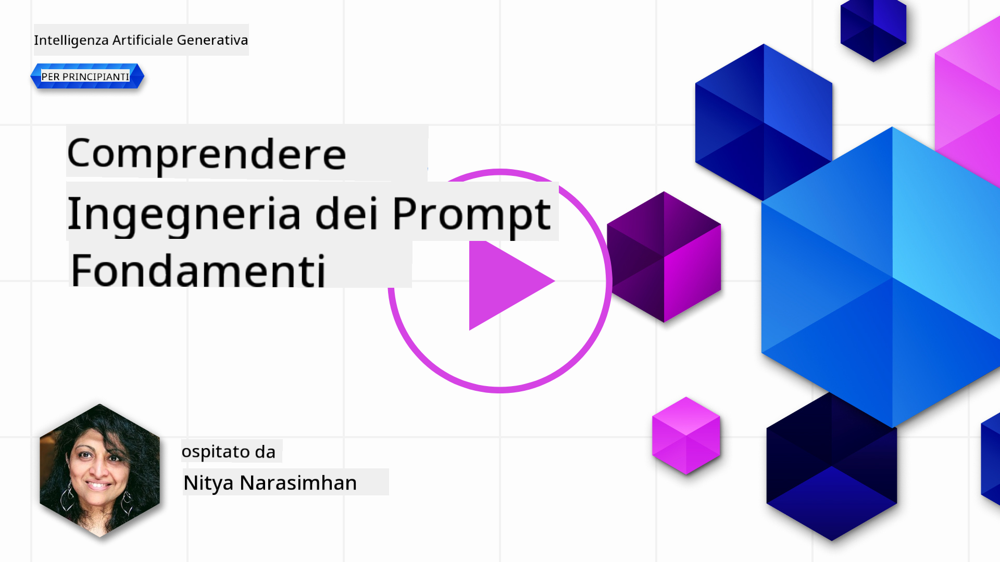
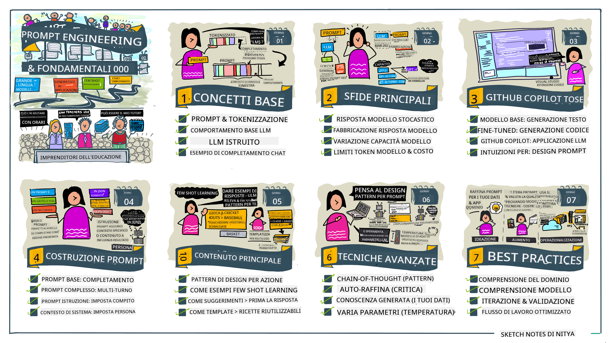
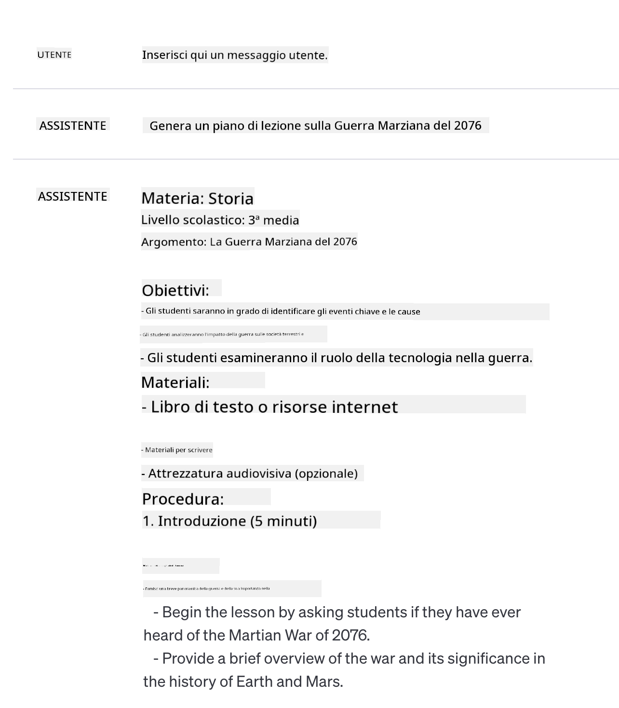

<!--
CO_OP_TRANSLATOR_METADATA:
{
  "original_hash": "dcbaaae026cb50fee071e690685b5843",
  "translation_date": "2025-08-26T16:34:17+00:00",
  "source_file": "04-prompt-engineering-fundamentals/README.md",
  "language_code": "it"
}
-->
# Fondamenti di Prompt Engineering

[](https://aka.ms/gen-ai-lesson4-gh?WT.mc_id=academic-105485-koreyst)

## Introduzione
Questo modulo tratta i concetti e le tecniche fondamentali per creare prompt efficaci nei modelli di AI generativa. Anche il modo in cui scrivi il tuo prompt per un LLM è importante. Un prompt ben costruito può portare a risposte di qualità superiore. Ma cosa significano esattamente termini come _prompt_ e _prompt engineering_? E come posso migliorare l’_input_ che invio al LLM? Queste sono le domande a cui cercheremo di rispondere in questo capitolo e nel prossimo.

L’_AI generativa_ è in grado di creare nuovi contenuti (ad esempio, testo, immagini, audio, codice ecc.) in risposta alle richieste degli utenti. Lo fa utilizzando _Large Language Models_ come la serie GPT ("Generative Pre-trained Transformer") di OpenAI, addestrati per lavorare con linguaggio naturale e codice.

Gli utenti possono ora interagire con questi modelli usando modalità familiari come la chat, senza bisogno di competenze tecniche o formazione specifica. I modelli sono _basati sui prompt_ - gli utenti inviano un input testuale (prompt) e ricevono la risposta dell’AI (completion). Possono poi "dialogare con l’AI" in modo iterativo, in conversazioni a più turni, perfezionando il prompt finché la risposta non soddisfa le loro aspettative.

I "prompt" diventano così la principale _interfaccia di programmazione_ per le applicazioni di AI generativa, indicando ai modelli cosa fare e influenzando la qualità delle risposte ottenute. Il "Prompt Engineering" è un campo di studio in rapida crescita che si concentra sulla _progettazione e ottimizzazione_ dei prompt per ottenere risposte coerenti e di qualità su larga scala.

## Obiettivi di Apprendimento

In questa lezione, scopriremo cos’è il Prompt Engineering, perché è importante e come possiamo creare prompt più efficaci per un determinato modello e obiettivo applicativo. Capiremo i concetti chiave e le migliori pratiche per il prompt engineering - e conosceremo un ambiente "sandbox" interattivo in Jupyter Notebooks dove potremo vedere questi concetti applicati a esempi reali.

Al termine di questa lezione saremo in grado di:

1. Spiegare cos’è il prompt engineering e perché è importante.
2. Descrivere le componenti di un prompt e come vengono utilizzate.
3. Apprendere tecniche e best practice per il prompt engineering.
4. Applicare le tecniche apprese a esempi reali, usando un endpoint OpenAI.

## Termini Chiave

Prompt Engineering: La pratica di progettare e perfezionare gli input per guidare i modelli AI verso la produzione degli output desiderati.
Tokenizzazione: Il processo di suddividere il testo in unità più piccole, chiamate token, che il modello può comprendere ed elaborare.
LLM Ottimizzati per le Istruzioni: Large Language Models (LLM) che sono stati perfezionati con istruzioni specifiche per migliorare la precisione e la pertinenza delle risposte.

## Sandbox di Apprendimento

Il prompt engineering è attualmente più un’arte che una scienza. Il modo migliore per migliorare la nostra intuizione è _esercitarsi di più_ e adottare un approccio di tentativi ed errori che combina competenze nel dominio applicativo con tecniche consigliate e ottimizzazioni specifiche per il modello.

Il Jupyter Notebook che accompagna questa lezione offre un ambiente _sandbox_ dove puoi sperimentare ciò che impari - man mano che procedi o come parte della sfida di codice finale. Per eseguire gli esercizi, ti serviranno:

1. **Una chiave API Azure OpenAI** - l’endpoint del servizio per un LLM distribuito.
2. **Un ambiente Python** - in cui eseguire il Notebook.
3. **Variabili d’ambiente locali** - _completa ora i passaggi di [SETUP](./../00-course-setup/02-setup-local.md?WT.mc_id=academic-105485-koreyst) per prepararti_.

Il notebook include esercizi _di base_ - ma ti invitiamo ad aggiungere le tue sezioni _Markdown_ (descrizione) e _Code_ (richieste prompt) per provare altri esempi o idee - e sviluppare la tua intuizione nella progettazione dei prompt.

## Guida Illustrata

Vuoi avere una panoramica di ciò che copre questa lezione prima di iniziare? Dai un’occhiata a questa guida illustrata, che ti offre una visione dei principali argomenti trattati e dei punti chiave su cui riflettere. La roadmap della lezione ti porta dalla comprensione dei concetti e delle sfide principali fino ad affrontarli con tecniche e best practice di prompt engineering. Nota che la sezione "Tecniche Avanzate" in questa guida si riferisce ai contenuti trattati nel _prossimo_ capitolo di questo corso.



## La Nostra Startup

Ora, vediamo come _questo argomento_ si collega alla nostra missione di startup per [portare l’innovazione AI nell’istruzione](https://educationblog.microsoft.com/2023/06/collaborating-to-bring-ai-innovation-to-education?WT.mc_id=academic-105485-koreyst). Vogliamo creare applicazioni di apprendimento _personalizzato_ basate su AI - quindi pensiamo a come diversi utenti della nostra applicazione potrebbero "progettare" i prompt:

- **Amministratori** potrebbero chiedere all’AI di _analizzare i dati del curriculum per individuare lacune nella copertura_. L’AI può riassumere i risultati o visualizzarli tramite codice.
- **Docenti** potrebbero chiedere all’AI di _generare un piano di lezione per un pubblico e un argomento specifici_. L’AI può creare il piano personalizzato in un formato definito.
- **Studenti** potrebbero chiedere all’AI di _aiutarli in una materia difficile_. L’AI può guidare gli studenti con lezioni, suggerimenti ed esempi su misura per il loro livello.

E questo è solo l’inizio. Dai un’occhiata a [Prompts For Education](https://github.com/microsoft/prompts-for-edu/tree/main?WT.mc_id=academic-105485-koreyst) - una libreria open-source di prompt curata da esperti di istruzione - per avere un’idea più ampia delle possibilità! _Prova a eseguire alcuni di quei prompt nel sandbox o nell’OpenAI Playground per vedere cosa succede!_

<!--
MODELLO DI LEZIONE:
Questa unità dovrebbe coprire il concetto chiave #1.
Rinforza il concetto con esempi e riferimenti.

CONCETTO #1:
Prompt Engineering.
Definirlo e spiegare perché è necessario.
-->

## Cos’è il Prompt Engineering?

Abbiamo iniziato questa lezione definendo il **Prompt Engineering** come il processo di _progettazione e ottimizzazione_ degli input testuali (prompt) per ottenere risposte coerenti e di qualità (completion) in base all’obiettivo applicativo e al modello scelto. Possiamo vederlo come un processo in due fasi:

- _progettare_ il prompt iniziale per un determinato modello e obiettivo
- _perfezionare_ il prompt in modo iterativo per migliorare la qualità della risposta

Si tratta necessariamente di un processo di tentativi ed errori che richiede intuizione ed impegno da parte dell’utente per ottenere risultati ottimali. Ma perché è importante? Per rispondere, dobbiamo prima capire tre concetti:

- _Tokenizzazione_ = come il modello "vede" il prompt
- _Base LLM_ = come il modello di base "elabora" un prompt
- _LLM Ottimizzati per le Istruzioni_ = come il modello ora può vedere "compiti"

### Tokenizzazione

Un LLM vede i prompt come una _sequenza di token_ e diversi modelli (o versioni di un modello) possono suddividere lo stesso prompt in modi diversi. Poiché i LLM sono addestrati sui token (e non sul testo grezzo), il modo in cui i prompt vengono tokenizzati ha un impatto diretto sulla qualità della risposta generata.

Per capire come funziona la tokenizzazione, prova strumenti come il [Tokenizzatore di OpenAI](https://platform.openai.com/tokenizer?WT.mc_id=academic-105485-koreyst) mostrato qui sotto. Incolla il tuo prompt - e osserva come viene convertito in token, prestando attenzione a come vengono gestiti gli spazi e la punteggiatura. Nota che questo esempio mostra un LLM pi√π vecchio (GPT-3) - quindi provando con un modello pi√π recente potresti ottenere risultati diversi.


### Concetto: Modelli di Base

Una volta che un prompt è stato tokenizzato, la funzione principale del ["Base LLM"](https://blog.gopenai.com/an-introduction-to-base-and-instruction-tuned-large-language-models-8de102c785a6?WT.mc_id=academic-105485-koreyst) (o modello di base) è prevedere il token successivo in quella sequenza. Poiché i LLM sono addestrati su enormi dataset testuali, hanno una buona conoscenza delle relazioni statistiche tra i token e possono fare questa previsione con una certa sicurezza. Nota che non comprendono il _significato_ delle parole nel prompt o nel token; vedono solo uno schema che possono "completare" con la loro prossima previsione. Possono continuare a prevedere la sequenza finché non vengono interrotti dall’utente o da una condizione predefinita.

Vuoi vedere come funziona la completion basata su prompt? Inserisci il prompt sopra nell’[_Chat Playground_](https://oai.azure.com/playground?WT.mc_id=academic-105485-koreyst) di Azure OpenAI Studio con le impostazioni predefinite. Il sistema è configurato per trattare i prompt come richieste di informazioni - quindi dovresti vedere una completion che soddisfa questo contesto.

Ma cosa succede se l’utente vuole vedere qualcosa di specifico che rispetti certi criteri o obiettivi? Qui entrano in gioco i LLM _ottimizzati per le istruzioni_.


### Concetto: LLM Ottimizzati per le Istruzioni

Un [LLM Ottimizzato per le Istruzioni](https://blog.gopenai.com/an-introduction-to-base-and-instruction-tuned-large-language-models-8de102c785a6?WT.mc_id=academic-105485-koreyst) parte dal modello di base e lo perfeziona con esempi o coppie input/output (ad esempio, "messaggi" a più turni) che possono contenere istruzioni chiare - e la risposta dell’AI cerca di seguire quell’istruzione.

Questo utilizza tecniche come il Reinforcement Learning con feedback umano (RLHF) che permettono al modello di _seguire le istruzioni_ e _imparare dai feedback_ così da produrre risposte più adatte alle applicazioni pratiche e più pertinenti agli obiettivi dell’utente.

Proviamolo - riprendi il prompt sopra, ma ora cambia il _messaggio di sistema_ fornendo la seguente istruzione come contesto:

> _Riepiloga il contenuto che ti viene fornito per uno studente di seconda elementare. Mantieni il risultato in un paragrafo con 3-5 punti elenco._

Vedi come il risultato ora è adattato all’obiettivo e al formato desiderato? Un docente può ora utilizzare direttamente questa risposta nelle slide per quella lezione.


## Perché serve il Prompt Engineering?

Ora che sappiamo come i prompt vengono elaborati dai LLM, vediamo _perché_ serve il prompt engineering. La risposta sta nel fatto che gli attuali LLM presentano diverse sfide che rendono _difficile ottenere completion affidabili e coerenti_ senza investire nella costruzione e ottimizzazione dei prompt. Ad esempio:

1. **Le risposte dei modelli sono stocastiche.** Lo _stesso prompt_ probabilmente produrrà risposte diverse con modelli o versioni di modello differenti. E può anche produrre risultati diversi con lo _stesso modello_ in momenti diversi. _Le tecniche di prompt engineering possono aiutarci a ridurre queste variazioni fornendo migliori linee guida_.

1. **I modelli possono inventare risposte.** I modelli sono pre-addestrati su _dataset ampi ma finiti_, quindi non conoscono concetti al di fuori di quel perimetro. Di conseguenza, possono generare completion inaccurate, immaginarie o in contraddizione con fatti noti. _Le tecniche di prompt engineering aiutano gli utenti a individuare e mitigare queste invenzioni, ad esempio chiedendo all’AI citazioni o ragionamenti_.

1. **Le capacità dei modelli variano.** I modelli più recenti o le nuove generazioni hanno capacità più avanzate ma anche caratteristiche e compromessi unici in termini di costi e complessità. _Il prompt engineering ci aiuta a sviluppare best practice e workflow che astraggono le differenze e si adattano ai requisiti specifici dei modelli in modo scalabile e fluido_.

Vediamo questo in azione nell’OpenAI o Azure OpenAI Playground:

- Usa lo stesso prompt con diverse distribuzioni LLM (ad esempio, OpenAI, Azure OpenAI, Hugging Face) - hai notato le variazioni?
- Usa lo stesso prompt pi√π volte con la _stessa_ distribuzione LLM (ad esempio, Azure OpenAI playground) - come sono cambiate queste variazioni?

### Esempio di Invenzioni

In questo corso, usiamo il termine **"invenzione"** per indicare il fenomeno in cui i LLM generano talvolta informazioni non corrette a causa di limiti nel loro addestramento o altri vincoli. Potresti aver sentito parlare di questo anche come _"allucinazioni"_ in articoli o pubblicazioni scientifiche. Tuttavia, raccomandiamo di usare il termine _"invenzione"_ per evitare di attribuire un tratto umano a un comportamento generato dalla macchina. Questo rafforza anche le [linee guida per l’AI Responsabile](https://www.microsoft.com/ai/responsible-ai?WT.mc_id=academic-105485-koreyst) dal punto di vista terminologico, eliminando termini che potrebbero essere considerati offensivi o non inclusivi in alcuni contesti.

Vuoi capire come funzionano le invenzioni? Pensa a un prompt che istruisce l’AI a generare contenuti su un argomento inesistente (così da essere sicuro che non sia presente nel dataset di addestramento). Ad esempio - ho provato questo prompt:
> **Prompt:** crea un piano di lezione sulla Guerra Marziana del 2076.

# Piano di lezione: La Guerra Marziana del 2076

## Obiettivi della lezione
- Comprendere le cause principali della Guerra Marziana del 2076
- Analizzare le conseguenze del conflitto sulla società marziana e terrestre
- Esplorare le strategie militari e diplomatiche utilizzate durante la guerra
- Riflettere sulle lezioni apprese e sulle implicazioni per il futuro

## Introduzione
La Guerra Marziana del 2076 è stata uno degli eventi più significativi nella storia delle relazioni tra Marte e la Terra. In questa lezione, esamineremo le origini del conflitto, i suoi sviluppi principali e il suo impatto duraturo.

## Argomenti principali

### 1. Cause della guerra
- Tensioni politiche tra le colonie marziane e i governi terrestri
- Dispute sulle risorse naturali e il controllo delle tecnologie avanzate
- Crescente desiderio di indipendenza da parte dei coloni marziani

### 2. Fasi del conflitto
- Inizio delle ostilità: attacchi coordinati e sabotaggi
- Intervento delle forze terrestri e risposta marziana
- Momenti chiave: la Battaglia del Cratere Olympus, la Rivolta di Valles Marineris

### 3. Conseguenze della guerra
- Perdite umane e danni alle infrastrutture
- Trattato di pace e nuove regole di cooperazione interplanetaria
- Cambiamenti sociali e politici su Marte e sulla Terra

### 4. Strategie e tecnologie
- Utilizzo di droni autonomi e intelligenza artificiale
- Tattiche di guerriglia e difesa delle colonie
- Ruolo della diplomazia e delle mediazioni internazionali

## Attività in classe

- **Discussione di gruppo:** Quali sono state le cause pi√π importanti della guerra? Come avrebbero potuto essere evitate?
- **Analisi di documenti storici:** Esaminare testimonianze e rapporti ufficiali del periodo
- **Simulazione:** Dividere la classe in gruppi per negoziare un trattato di pace tra Marte e la Terra

## Compiti a casa

- Scrivere un saggio sulle conseguenze della Guerra Marziana del 2076 per la società marziana
- Preparare una presentazione sulle innovazioni tecnologiche nate durante il conflitto

## Conclusione
La Guerra Marziana del 2076 ha segnato una svolta nelle relazioni tra i due pianeti. Studiare questo evento ci aiuta a comprendere meglio le dinamiche dei conflitti interplanetari e l'importanza della cooperazione per il futuro dell'umanità.
Una ricerca sul web mi ha mostrato che esistono racconti di fantasia (ad esempio, serie televisive o libri) sulle guerre marziane, ma nessuno ambientato nel 2076. Il buon senso ci dice anche che il 2076 è _nel futuro_ e quindi non può essere associato a un evento reale.

Cosa succede quindi se eseguiamo questo prompt con diversi fornitori di LLM?

> **Risposta 1**: OpenAI Playground (GPT-35)



> **Risposta 2**: Azure OpenAI Playground (GPT-35)


> **Risposta 3**: : Hugging Face Chat Playground (LLama-2)


Come previsto, ogni modello (o versione di modello) produce risposte leggermente diverse grazie al comportamento stocastico e alle differenze di capacità tra i modelli. Ad esempio, un modello si rivolge a un pubblico di terza media mentre un altro si rivolge a studenti delle superiori. Tuttavia, tutti e tre i modelli hanno generato risposte che potrebbero convincere un utente non informato che l’evento fosse reale.

Tecniche di prompt engineering come _metaprompting_ e _configurazione della temperatura_ possono ridurre in parte le allucinazioni del modello. Nuove _architetture_ di prompt engineering integrano anche nuovi strumenti e tecniche nel flusso del prompt, per mitigare o ridurre alcuni di questi effetti.

## Caso di studio: GitHub Copilot

Concludiamo questa sezione dando un’occhiata a come il prompt engineering viene utilizzato in soluzioni reali, analizzando un caso di studio: [GitHub Copilot](https://github.com/features/copilot?WT.mc_id=academic-105485-koreyst).

GitHub Copilot è il tuo "AI Pair Programmer": trasforma i prompt testuali in completamenti di codice ed è integrato nel tuo ambiente di sviluppo (ad esempio, Visual Studio Code) per un’esperienza utente fluida. Come documentato nella serie di blog qui sotto, la prima versione era basata sul modello OpenAI Codex: gli ingegneri si sono presto resi conto della necessità di ottimizzare il modello e sviluppare tecniche di prompt engineering migliori, per migliorare la qualità del codice. A luglio, hanno [presentato un modello AI migliorato che va oltre Codex](https://github.blog/2023-07-28-smarter-more-efficient-coding-github-copilot-goes-beyond-codex-with-improved-ai-model/?WT.mc_id=academic-105485-koreyst) per suggerimenti ancora più rapidi.

Leggi i post in ordine per seguire il loro percorso di apprendimento.

- **Maggio 2023** | [GitHub Copilot sta migliorando nella comprensione del tuo codice](https://github.blog/2023-05-17-how-github-copilot-is-getting-better-at-understanding-your-code/?WT.mc_id=academic-105485-koreyst)
- **Maggio 2023** | [Dentro GitHub: lavorare con gli LLM dietro GitHub Copilot](https://github.blog/2023-05-17-inside-github-working-with-the-llms-behind-github-copilot/?WT.mc_id=academic-105485-koreyst).
- **Giugno 2023** | [Come scrivere prompt migliori per GitHub Copilot](https://github.blog/2023-06-20-how-to-write-better-prompts-for-github-copilot/?WT.mc_id=academic-105485-koreyst).
- **Luglio 2023** | [.. GitHub Copilot va oltre Codex con un modello AI migliorato](https://github.blog/2023-07-28-smarter-more-efficient-coding-github-copilot-goes-beyond-codex-with-improved-ai-model/?WT.mc_id=academic-105485-koreyst)
- **Luglio 2023** | [Guida per sviluppatori al Prompt Engineering e agli LLM](https://github.blog/2023-07-17-prompt-engineering-guide-generative-ai-llms/?WT.mc_id=academic-105485-koreyst)
- **Settembre 2023** | [Come costruire un'app LLM aziendale: lezioni da GitHub Copilot](https://github.blog/2023-09-06-how-to-build-an-enterprise-llm-application-lessons-from-github-copilot/?WT.mc_id=academic-105485-koreyst)

Puoi anche consultare il loro [blog Engineering](https://github.blog/category/engineering/?WT.mc_id=academic-105485-koreyst) per altri post come [questo](https://github.blog/2023-09-27-how-i-used-github-copilot-chat-to-build-a-reactjs-gallery-prototype/?WT.mc_id=academic-105485-koreyst) che mostra come questi modelli e tecniche vengano _applicati_ per realizzare applicazioni nel mondo reale.

---

## Costruzione del Prompt

Abbiamo visto perché il prompt engineering è importante: ora vediamo come i prompt vengono _costruiti_ così da poter valutare diverse tecniche per un design più efficace dei prompt.

### Prompt di base

Partiamo dal prompt di base: un input testuale inviato al modello senza altro contesto. Ecco un esempio: quando inviamo le prime parole dell’inno nazionale degli Stati Uniti all’[API Completion di OpenAI](https://platform.openai.com/docs/api-reference/completions?WT.mc_id=academic-105485-koreyst), questa completa immediatamente la risposta con le righe successive, illustrando il comportamento predittivo di base.

| Prompt (Input)     | Completion (Output)                                                                                                                        |
| :----------------- | :----------------------------------------------------------------------------------------------------------------------------------------- |
| Oh say can you see | Sembra che tu stia iniziando il testo di "The Star-Spangled Banner", l’inno nazionale degli Stati Uniti. Il testo completo è ...           |

### Prompt complesso

Ora aggiungiamo contesto e istruzioni a quel prompt di base. L’[API Chat Completion](https://learn.microsoft.com/azure/ai-services/openai/how-to/chatgpt?WT.mc_id=academic-105485-koreyst) ci permette di costruire un prompt complesso come una raccolta di _messaggi_ con:

- Coppie input/output che riflettono l’input dell’_utente_ e la risposta dell’_assistente_.
- Messaggio di sistema che imposta il contesto per il comportamento o la personalità dell’assistente.

La richiesta ora ha la forma seguente, dove la _tokenizzazione_ cattura efficacemente le informazioni rilevanti dal contesto e dalla conversazione. Ora, cambiare il contesto di sistema può avere un impatto sulla qualità delle risposte tanto quanto gli input forniti dall’utente.

```python
response = openai.chat.completions.create(
    model="gpt-3.5-turbo",
    messages=[
        {"role": "system", "content": "You are a helpful assistant."},
        {"role": "user", "content": "Who won the world series in 2020?"},
        {"role": "assistant", "content": "The Los Angeles Dodgers won the World Series in 2020."},
        {"role": "user", "content": "Where was it played?"}
    ]
)
```

### Prompt di istruzione

Negli esempi sopra, il prompt dell’utente era una semplice richiesta testuale che può essere interpretata come una richiesta di informazioni. Con i prompt di _istruzione_, possiamo usare quel testo per specificare un compito in modo più dettagliato, fornendo una guida migliore all’AI. Ecco un esempio:

| Prompt (Input)                                                                                                                                                                                                                         | Completion (Output)                                                                                                        | Instruction Type    |
| :------------------------------------------------------------------------------------------------------------------------------------------------------------------------------------------------------------------------------------- | :------------------------------------------------------------------------------------------------------------------------- | :------------------ |
| Scrivi una descrizione della Guerra Civile                                                                                                                                                                                             | _ha restituito un semplice paragrafo_                                                                                      | Semplice            |
| Scrivi una descrizione della Guerra Civile. Fornisci le date e gli eventi chiave e descrivine il significato                                                                                                                           | _ha restituito un paragrafo seguito da un elenco di date chiave con descrizioni_                                           | Complesso            |
| Scrivi una descrizione della Guerra Civile in 1 paragrafo. Fornisci 3 punti elenco con le date chiave e il loro significato. Fornisci altri 3 punti elenco con le figure storiche principali e i loro contributi. Restituisci il risultato come file JSON | _restituisce dettagli più estesi in una casella di testo, formattati come JSON che puoi copiare in un file e validare secondo necessità_ | Complesso. Formattato. |

## Contenuto primario

Negli esempi precedenti, il prompt era ancora piuttosto aperto, lasciando decidere all’LLM quale parte del suo dataset pre-addestrato fosse rilevante. Con il pattern di design _primary content_, il testo di input viene diviso in due parti:

- un’istruzione (azione)
- contenuto rilevante (che influenza l’azione)

Ecco un esempio in cui l’istruzione è "riassumi questo in 2 frasi".

| Prompt (Input)                                                                                                                                                                                                                                                                                                                                                                                                                                                                                                                                                                                                                                                                                      | Completion (Output)                                                                                                                                                                                                                                                                             |
| :-------------------------------------------------------------------------------------------------------------------------------------------------------------------------------------------------------------------------------------------------------------------------------------------------------------------------------------------------------------------------------------------------------------------------------------------------------------------------------------------------------------------------------------------------------------------------------------------------------------------------------------------------------------------------------------------------- | :---------------------------------------------------------------------------------------------------------------------------------------------------------------------------------------------------------------------------------------------------------------------------------------------- |
| Giove è il quinto pianeta dal Sole e il più grande del Sistema Solare. È un gigante gassoso con una massa pari a un millesimo di quella del Sole, ma due volte e mezzo quella di tutti gli altri pianeti del Sistema Solare messi insieme. Giove è uno degli oggetti più luminosi visibili a occhio nudo nel cielo notturno, ed è conosciuto dalle civiltà antiche da prima della storia scritta. Prende il nome dal dio romano Giove.[19] Visto dalla Terra, Giove può essere così luminoso che la sua luce riflessa può proiettare ombre visibili,[20] ed è in media il terzo oggetto naturale più luminoso nel cielo notturno dopo la Luna e Venere. <br/> **Riassumi questo in 2 frasi brevi** | Giove, il quinto pianeta dal Sole, è il più grande del Sistema Solare ed è noto per essere uno degli oggetti più luminosi nel cielo notturno. Chiamato come il dio romano Giove, è un gigante gassoso la cui massa è due volte e mezzo quella di tutti gli altri pianeti messi insieme. |

Il segmento di contenuto primario può essere usato in vari modi per rendere le istruzioni più efficaci:

- **Esempi** – invece di dire esplicitamente al modello cosa fare, fornisci esempi di cosa fare e lascia che deduca il pattern.
- **Cues** – segui l’istruzione con un "cue" che avvia il completamento, guidando il modello verso risposte più pertinenti.
- **Template** – sono ‘ricette’ ripetibili per prompt con segnaposto (variabili) che possono essere personalizzati con dati per casi d’uso specifici.

Vediamo questi approcci in azione.

### Uso degli esempi

Questo è un approccio in cui si usa il contenuto primario per "nutrire il modello" con alcuni esempi dell’output desiderato per una determinata istruzione, lasciando che deduca il pattern dell’output desiderato. In base al numero di esempi forniti, si parla di zero-shot prompting, one-shot prompting, few-shot prompting, ecc.

Il prompt ora è composto da tre elementi:

- Una descrizione del compito
- Alcuni esempi dell’output desiderato
- L’inizio di un nuovo esempio (che diventa una descrizione implicita del compito)

| Tipo di apprendimento | Prompt (Input)                                                                                                                                        | Completion (Output)         |
| :-------------------- | :---------------------------------------------------------------------------------------------------------------------------------------------------- | :-------------------------- |
| Zero-shot            | "The Sun is Shining". Traduci in spagnolo                                                                                                             | "El Sol est√° brillando".    |
| One-shot             | "The Sun is Shining" => ""El Sol está brillando". <br> "It's a Cold and Windy Day" =>                                                                 | "Es un día frío y ventoso". |
| Few-shot             | Il giocatore ha corso sulle basi => Baseball <br/> Il giocatore ha fatto un ace => Tennis <br/> Il giocatore ha fatto un sei => Cricket <br/> Il giocatore ha fatto una schiacciata => | Basket                      |
|                      |                                                                                                                                                       |                             |

Nota come abbiamo dovuto fornire un’istruzione esplicita ("Traduci in spagnolo") nello zero-shot prompting, ma questa viene dedotta nell’esempio one-shot. L’esempio few-shot mostra come aggiungendo più esempi il modello riesca a fare deduzioni più accurate senza ulteriori istruzioni.

### Prompt Cues

Un’altra tecnica per usare il contenuto primario è fornire _cue_ invece di esempi. In questo caso, diamo al modello una spinta nella direzione giusta _iniziando_ con uno snippet che riflette il formato di risposta desiderato. Il modello poi "prende il cue" e continua su quella linea.

| Numero di cue | Prompt (Input)                                                                                                                                                                                                                                                                                                                                                                                                                                               | Completion (Output)                                                                                                                                                                                                                                                                                       |
| :------------ | :----------------------------------------------------------------------------------------------------------------------------------------------------------------------------------------------------------------------------------------------------------------------------------------------------------------------------------------------------------------------------------------------------------------------------------------------------------- | :-------------------------------------------------------------------------------------------------------------------------------------------------------------------------------------------------------------------------------------------------------------------------------------------------------- |
| 0             | Giove è il quinto pianeta dal Sole e il più grande del Sistema Solare. È un gigante gassoso con una massa pari a un millesimo di quella del Sole, ma due volte e mezzo quella di tutti gli altri pianeti del Sistema Solare messi insieme. Giove è uno degli oggetti più luminosi visibili a occhio nudo nel cielo notturno, ed è conosciuto dalle civiltà antiche da prima della storia scritta.

**Riepiloga Questo**                                       | Giove è il pianeta più grande del nostro Sistema Solare e il quinto dal Sole. È un gigante gassoso con una massa pari a 1/1000 di quella del Sole, ma è più pesante di tutti gli altri pianeti messi insieme. Le civiltà antiche conoscono Giove da molto tempo, ed è facilmente visibile nel cielo notturno. |
| 1              | Giove è il quinto pianeta dal Sole e il più grande del Sistema Solare. È un gigante gassoso con una massa pari a un millesimo di quella del Sole, ma due volte e mezzo quella di tutti gli altri pianeti del Sistema Solare messi insieme. Giove è uno degli oggetti più luminosi visibili a occhio nudo nel cielo notturno, ed è conosciuto dalle civiltà antiche da prima della storia scritta. <br/>**Riepiloga Questo** <br/> Quello che abbiamo imparato è che Giove | è il quinto pianeta dal Sole e il più grande del Sistema Solare. È un gigante gassoso con una massa pari a un millesimo di quella del Sole, ma due volte e mezzo quella di tutti gli altri pianeti messi insieme. È facilmente visibile a occhio nudo ed è conosciuto fin dall'antichità.                        |
| 2              | Giove è il quinto pianeta dal Sole e il più grande del Sistema Solare. È un gigante gassoso con una massa pari a un millesimo di quella del Sole, ma due volte e mezzo quella di tutti gli altri pianeti del Sistema Solare messi insieme. Giove è uno degli oggetti più luminosi visibili a occhio nudo nel cielo notturno, ed è conosciuto dalle civiltà antiche da prima della storia scritta. <br/>**Riepiloga Questo** <br/> Le 3 principali cose che abbiamo imparato:         | 1. Giove è il quinto pianeta dal Sole e il più grande del Sistema Solare. <br/> 2. È un gigante gassoso con una massa pari a un millesimo di quella del Sole...<br/> 3. Giove è visibile a occhio nudo fin dall'antichità ...                                                                       |
|                |                                                                                                                                                                                                                                                                                                                                                                                                                                                              |                                                                                                                                                                                                                                                                                                           |

### Modelli di Prompt

Un modello di prompt è una _ricetta predefinita per un prompt_ che può essere salvata e riutilizzata quando serve, per offrire esperienze utente più coerenti su larga scala. Nella sua forma più semplice, è semplicemente una raccolta di esempi di prompt come [questo di OpenAI](https://platform.openai.com/examples?WT.mc_id=academic-105485-koreyst) che fornisce sia i componenti interattivi del prompt (messaggi utente e di sistema) sia il formato di richiesta guidato da API - per supportare il riutilizzo.

Nella sua forma pi√π complessa, come [questo esempio di LangChain](https://python.langchain.com/docs/concepts/prompt_templates/?WT.mc_id=academic-105485-koreyst), contiene _segnaposto_ che possono essere sostituiti con dati provenienti da varie fonti (input utente, contesto di sistema, fonti dati esterne ecc.) per generare un prompt in modo dinamico. Questo ci permette di creare una libreria di prompt riutilizzabili che possono essere usati per offrire esperienze utente coerenti **in modo programmato** su larga scala.

Infine, il vero valore dei modelli sta nella possibilità di creare e pubblicare _librerie di prompt_ per domini applicativi verticali - dove il modello di prompt è ora _ottimizzato_ per riflettere il contesto o gli esempi specifici dell'applicazione, rendendo le risposte più pertinenti e accurate per il pubblico di riferimento. Il repository [Prompts For Edu](https://github.com/microsoft/prompts-for-edu?WT.mc_id=academic-105485-koreyst) è un ottimo esempio di questo approccio, curando una libreria di prompt per il settore educativo con enfasi su obiettivi chiave come la pianificazione delle lezioni, la progettazione del curriculum, il tutoraggio degli studenti ecc.

## Contenuti di supporto

Se pensiamo alla costruzione di un prompt come composta da un'istruzione (compito) e un target (contenuto principale), allora il _contenuto secondario_ è come un contesto aggiuntivo che forniamo per **influenzare in qualche modo l'output**. Potrebbe trattarsi di parametri di regolazione, istruzioni di formattazione, tassonomie di argomenti ecc. che possono aiutare il modello a _personalizzare_ la sua risposta per adattarsi agli obiettivi o alle aspettative dell'utente.

Ad esempio: dato un catalogo corsi con ampi metadati (nome, descrizione, livello, tag, docente ecc.) su tutti i corsi disponibili nel curriculum:

- possiamo definire un'istruzione per "riassumere il catalogo corsi per l'autunno 2023"
- possiamo usare il contenuto principale per fornire alcuni esempi dell'output desiderato
- possiamo usare il contenuto secondario per identificare i 5 principali "tag" di interesse.

Ora, il modello può fornire un riassunto nel formato mostrato dagli esempi - ma se un risultato ha più tag, può dare priorità ai 5 tag identificati nel contenuto secondario.

---

<!--
MODELLO DI LEZIONE:
Questa unità dovrebbe coprire il concetto chiave #1.
Rinforza il concetto con esempi e riferimenti.

CONCETTO #3:
Tecniche di Prompt Engineering.
Quali sono alcune tecniche di base per il prompt engineering?
Illustra con alcuni esercizi.
-->

## Best practice per la creazione di prompt

Ora che sappiamo come i prompt possono essere _costruiti_, possiamo iniziare a pensare a come _progettarli_ per riflettere le best practice. Possiamo pensare a questo in due parti: avere il giusto _approccio mentale_ e applicare le giuste _tecniche_.

### Mentalità per il Prompt Engineering

Il Prompt Engineering è un processo di tentativi ed errori, quindi tieni a mente tre fattori guida generali:

1. **La conoscenza del dominio è importante.** L'accuratezza e la pertinenza delle risposte dipendono dal _dominio_ in cui opera quell'applicazione o utente. Usa la tua intuizione e competenza di dominio per **personalizzare ulteriormente le tecniche**. Ad esempio, definisci _personalità specifiche del dominio_ nei tuoi prompt di sistema, oppure usa _modelli specifici del dominio_ nei tuoi prompt utente. Fornisci contenuti secondari che riflettano contesti specifici del dominio, oppure usa _spunti ed esempi specifici del dominio_ per guidare il modello verso schemi d'uso familiari.

2. **La conoscenza del modello è importante.** Sappiamo che i modelli sono per natura stocastici. Ma le implementazioni dei modelli possono anche variare in base al dataset di addestramento utilizzato (conoscenza pre-addestrata), alle capacità offerte (ad esempio, tramite API o SDK) e al tipo di contenuto per cui sono ottimizzati (ad esempio, codice vs. immagini vs. testo). Comprendi i punti di forza e i limiti del modello che stai usando, e usa questa conoscenza per _dare priorità ai compiti_ o costruire _modelli personalizzati_ ottimizzati per le capacità del modello.

3. **Iterazione e validazione sono importanti.** I modelli stanno evolvendo rapidamente, così come le tecniche di prompt engineering. Come esperto di dominio, potresti avere altri contesti o criteri per la _tua_ applicazione specifica, che potrebbero non valere per la comunità più ampia. Usa strumenti e tecniche di prompt engineering per "dare il via" alla costruzione del prompt, poi itera e valida i risultati usando la tua intuizione e competenza di dominio. Registra le tue intuizioni e crea una **base di conoscenza** (ad esempio, librerie di prompt) che possa essere usata come nuovo punto di partenza da altri, per iterazioni più rapide in futuro.

## Best practice

Vediamo ora alcune best practice comuni raccomandate da [OpenAI](https://help.openai.com/en/articles/6654000-best-practices-for-prompt-engineering-with-openai-api?WT.mc_id=academic-105485-koreyst) e dai professionisti di [Azure OpenAI](https://learn.microsoft.com/azure/ai-services/openai/concepts/prompt-engineering#best-practices?WT.mc_id=academic-105485-koreyst).

| Cosa                              | Perché                                                                                                                                                                                                                                               |
| :-------------------------------- | :------------------------------------------------------------------------------------------------------------------------------------------------------------------------------------------------------------------------------------------------ |
| Valuta i modelli più recenti.       | Le nuove generazioni di modelli probabilmente avranno funzionalità e qualità migliorate - ma potrebbero anche avere costi maggiori. Valutali per l'impatto, poi prendi decisioni di migrazione.                                                                                |
| Separa istruzioni e contesto   | Verifica se il tuo modello/fornitore definisce _delimitatori_ per distinguere meglio istruzioni, contenuto principale e secondario. Questo può aiutare i modelli ad assegnare i pesi ai token in modo più accurato.                                                         |
| Sii specifico e chiaro             | Fornisci più dettagli su contesto desiderato, risultato, lunghezza, formato, stile ecc. Questo migliorerà sia la qualità che la coerenza delle risposte. Cattura le ricette in modelli riutilizzabili.                                                          |
| Sii descrittivo, usa esempi      | I modelli possono rispondere meglio a un approccio "mostra e racconta". Inizia con un approccio `zero-shot` dove dai solo un'istruzione (ma nessun esempio), poi prova il `few-shot` come affinamento, fornendo alcuni esempi dell'output desiderato. Usa analogie. |
| Usa spunti per avviare le risposte | Spingilo verso un risultato desiderato fornendo alcune parole o frasi iniziali che può usare come punto di partenza per la risposta.                                                                                                               |
| Insisti                       | A volte potresti dover ripetere le istruzioni al modello. Dai istruzioni prima e dopo il contenuto principale, usa un'istruzione e uno spunto, ecc. Itera e valida per vedere cosa funziona.                                                         |
| L'ordine conta                     | L'ordine in cui presenti le informazioni al modello può influenzare l'output, anche negli esempi di apprendimento, grazie al bias di recency. Prova opzioni diverse per vedere cosa funziona meglio.                                                               |
| Dai al modello una "via d'uscita"           | Fornisci al modello una risposta di _fallback_ che può dare se non riesce a completare il compito per qualsiasi motivo. Questo può ridurre la probabilità che il modello generi risposte false o inventate.                                                         |
|                                   |                                                                                                                                                                                                                                                   |

Come per ogni best practice, ricorda che _i risultati possono variare_ in base al modello, al compito e al dominio. Usa queste indicazioni come punto di partenza e sperimenta per trovare ciò che funziona meglio per te. Rivaluta costantemente il tuo processo di prompt engineering man mano che diventano disponibili nuovi modelli e strumenti, con attenzione alla scalabilità del processo e alla qualità delle risposte.

<!--
MODELLO DI LEZIONE:
Questa unità dovrebbe proporre una sfida di codice se applicabile

SFIDA:
Collega a un Jupyter Notebook con solo i commenti nel codice nelle istruzioni (le sezioni di codice sono vuote).

SOLUZIONE:
Collega a una copia di quel Notebook con i prompt compilati ed eseguiti, mostrando un esempio di output.
-->

## Compito

Complimenti! Sei arrivato alla fine della lezione! È il momento di mettere alla prova alcuni di questi concetti e tecniche con esempi reali!

Per il nostro compito, useremo un Jupyter Notebook con esercizi che puoi completare in modo interattivo. Puoi anche estendere il Notebook con le tue celle Markdown e di codice per esplorare idee e tecniche in autonomia.

### Per iniziare, fai il fork del repository, poi

- (Consigliato) Avvia GitHub Codespaces
- (In alternativa) Clona il repository sul tuo dispositivo locale e usalo con Docker Desktop
- (In alternativa) Apri il Notebook con il tuo ambiente Notebook preferito.

### Poi, configura le variabili d'ambiente

- Copia il file `.env.copy` nella root del repo in `.env` e inserisci i valori di `AZURE_OPENAI_API_KEY`, `AZURE_OPENAI_ENDPOINT` e `AZURE_OPENAI_DEPLOYMENT`. Torna alla [sezione Learning Sandbox](../../../04-prompt-engineering-fundamentals/04-prompt-engineering-fundamentals) per scoprire come fare.

### Poi, apri il Jupyter Notebook

- Seleziona il kernel di runtime. Se usi le opzioni 1 o 2, seleziona semplicemente il kernel Python 3.10.x predefinito fornito dal dev container.

Ora sei pronto per eseguire gli esercizi. Nota che qui non ci sono risposte _giuste o sbagliate_ - si tratta solo di esplorare opzioni tramite tentativi ed errori e costruire intuizione su cosa funziona per un dato modello e dominio applicativo.

_Per questo motivo non ci sono segmenti di Soluzione Codice in questa lezione. Invece, il Notebook avrà celle Markdown intitolate "La mia soluzione:" che mostrano un esempio di output di riferimento._

 <!--
MODELLO DI LEZIONE:
Concludi la sezione con un riepilogo e risorse per l'apprendimento autonomo.
-->

## Verifica delle conoscenze

Quale delle seguenti è un buon prompt che segue alcune best practice ragionevoli?

1. Mostrami un'immagine di un'auto rossa
2. Mostrami un'immagine di un'auto rossa marca Volvo e modello XC90 parcheggiata vicino a una scogliera con il sole che tramonta
3. Mostrami un'immagine di un'auto rossa marca Volvo e modello XC90

R: 2, è il miglior prompt perché fornisce dettagli su "cosa" e va nello specifico (non solo un'auto qualsiasi ma una marca e un modello specifici) e descrive anche l'ambientazione generale. Il 3 è il secondo migliore perché contiene comunque molte descrizioni.

## üöÄ Sfida

Vedi se riesci a sfruttare la tecnica dello "spunto" con il prompt: Completa la frase "Mostrami un'immagine di un'auto rossa marca Volvo e ". Cosa risponde il modello e come lo miglioreresti?

## Ottimo lavoro! Continua a imparare

Vuoi saperne di pi√π su altri concetti di Prompt Engineering? Vai alla [pagina di apprendimento continuo](https://aka.ms/genai-collection?WT.mc_id=academic-105485-koreyst) per trovare altre ottime risorse su questo argomento.

Passa alla Lezione 5 dove vedremo [tecniche avanzate di prompting](../05-advanced-prompts/README.md?WT.mc_id=academic-105485-koreyst)!

---

**Disclaimer**:  
Questo documento è stato tradotto utilizzando il servizio di traduzione AI [Co-op Translator](https://github.com/Azure/co-op-translator). Pur impegnandoci per garantire l’accuratezza, si prega di notare che le traduzioni automatiche possono contenere errori o imprecisioni. Il documento originale nella sua lingua nativa deve essere considerato la fonte autorevole. Per informazioni critiche, si raccomanda una traduzione professionale umana. Non siamo responsabili per eventuali incomprensioni o interpretazioni errate derivanti dall’uso di questa traduzione.