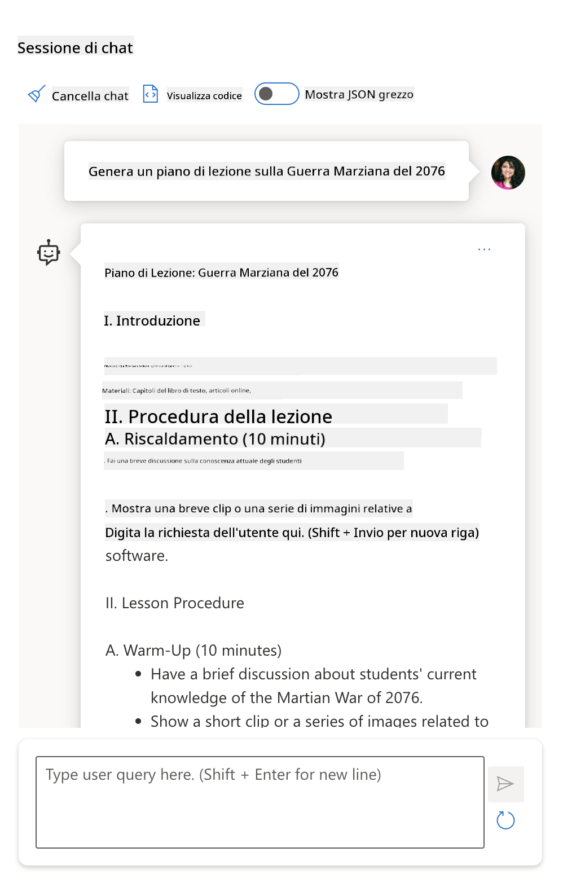
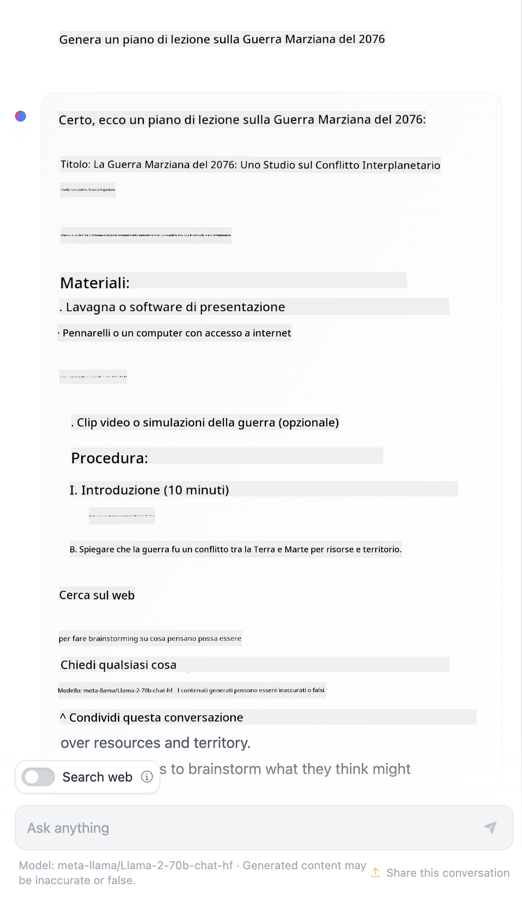

<!--
CO_OP_TRANSLATOR_METADATA:
{
  "original_hash": "8b3cb38518cf4fe7714d2f5e74dfa3eb",
  "translation_date": "2025-10-03T09:15:07+00:00",
  "source_file": "04-prompt-engineering-fundamentals/README.md",
  "language_code": "it"
}
-->
# Fondamenti di Prompt Engineering

[](https://aka.ms/gen-ai-lesson4-gh?WT.mc_id=academic-105485-koreyst)

## Introduzione
Questo modulo copre i concetti essenziali e le tecniche per creare prompt efficaci nei modelli di intelligenza artificiale generativa. Anche il modo in cui scrivi il tuo prompt per un LLM è importante. Un prompt ben progettato può ottenere una risposta di qualità migliore. Ma cosa significano esattamente termini come _prompt_ e _prompt engineering_? E come posso migliorare l'input del prompt che invio al LLM? Queste sono le domande a cui cercheremo di rispondere in questo capitolo e nel prossimo.

L'_intelligenza artificiale generativa_ è in grado di creare nuovi contenuti (ad esempio, testo, immagini, audio, codice ecc.) in risposta alle richieste degli utenti. Lo fa utilizzando _Large Language Models_ come la serie GPT ("Generative Pre-trained Transformer") di OpenAI, che sono addestrati per utilizzare il linguaggio naturale e il codice.

Gli utenti possono ora interagire con questi modelli utilizzando paradigmi familiari come la chat, senza bisogno di competenze tecniche o formazione. I modelli sono _basati su prompt_: gli utenti inviano un input testuale (prompt) e ricevono una risposta dall'IA (completion). Possono quindi "chattare con l'IA" in modo iterativo, in conversazioni multi-turn, perfezionando il prompt fino a quando la risposta non soddisfa le loro aspettative.

I "prompt" diventano ora l'interfaccia di _programmazione principale_ per le applicazioni di intelligenza artificiale generativa, indicando ai modelli cosa fare e influenzando la qualità delle risposte restituite. Il "Prompt Engineering" è un campo di studio in rapida crescita che si concentra sulla _progettazione e ottimizzazione_ dei prompt per fornire risposte consistenti e di qualità su larga scala.

## Obiettivi di apprendimento

In questa lezione, impariamo cos'è il Prompt Engineering, perché è importante e come possiamo creare prompt più efficaci per un determinato modello e obiettivo applicativo. Comprenderemo i concetti fondamentali e le migliori pratiche per il prompt engineering - e scopriremo un ambiente interattivo "sandbox" in Jupyter Notebook dove possiamo vedere questi concetti applicati a esempi reali.

Alla fine di questa lezione saremo in grado di:

1. Spiegare cos'è il prompt engineering e perché è importante.
2. Descrivere i componenti di un prompt e come vengono utilizzati.
3. Imparare le migliori pratiche e tecniche per il prompt engineering.
4. Applicare le tecniche apprese a esempi reali, utilizzando un endpoint OpenAI.

## Termini chiave

Prompt Engineering: La pratica di progettare e perfezionare gli input per guidare i modelli di intelligenza artificiale verso la produzione di output desiderati.  
Tokenizzazione: Il processo di conversione del testo in unità più piccole, chiamate token, che un modello può comprendere e elaborare.  
LLM ottimizzati per istruzioni: Modelli di linguaggio di grandi dimensioni (LLM) che sono stati perfezionati con istruzioni specifiche per migliorare la precisione e la rilevanza delle risposte.

## Sandbox di apprendimento

Il prompt engineering è attualmente più arte che scienza. Il modo migliore per migliorare la nostra intuizione è _praticare di più_ e adottare un approccio di tentativi ed errori che combina competenze nel dominio applicativo con tecniche raccomandate e ottimizzazioni specifiche del modello.

Il Jupyter Notebook che accompagna questa lezione fornisce un ambiente _sandbox_ dove puoi provare ciò che impari - man mano che procedi o come parte della sfida di codice alla fine. Per eseguire gli esercizi, avrai bisogno di:

1. **Una chiave API di Azure OpenAI** - l'endpoint del servizio per un LLM distribuito.  
2. **Un runtime Python** - in cui il Notebook può essere eseguito.  
3. **Variabili di ambiente locali** - _completa i passaggi di [SETUP](./../00-course-setup/02-setup-local.md?WT.mc_id=academic-105485-koreyst) ora per prepararti_.  

Il notebook include esercizi _di base_ - ma sei incoraggiato ad aggiungere le tue sezioni _Markdown_ (descrizione) e _Code_ (richieste di prompt) per provare più esempi o idee - e costruire la tua intuizione per la progettazione dei prompt.

## Guida illustrata

Vuoi avere una panoramica di ciò che copre questa lezione prima di immergerti? Dai un'occhiata a questa guida illustrata, che ti dà un'idea dei principali argomenti trattati e dei punti chiave su cui riflettere in ciascuno di essi. La roadmap della lezione ti porta dalla comprensione dei concetti fondamentali e delle sfide all'affrontarle con tecniche e migliori pratiche di prompt engineering pertinenti. Nota che la sezione "Tecniche avanzate" in questa guida si riferisce ai contenuti trattati nel _prossimo_ capitolo di questo curriculum.


## La nostra startup

Ora, parliamo di come _questo argomento_ si collega alla nostra missione di startup per [portare innovazione AI nell'educazione](https://educationblog.microsoft.com/2023/06/collaborating-to-bring-ai-innovation-to-education?WT.mc_id=academic-105485-koreyst). Vogliamo costruire applicazioni AI per l'apprendimento _personalizzato_ - quindi pensiamo a come diversi utenti della nostra applicazione potrebbero "progettare" i prompt:

- **Amministratori** potrebbero chiedere all'IA di _analizzare i dati del curriculum per identificare lacune nella copertura_. L'IA può riassumere i risultati o visualizzarli con il codice.  
- **Educatori** potrebbero chiedere all'IA di _generare un piano di lezione per un pubblico target e un argomento_. L'IA può creare il piano personalizzato in un formato specificato.  
- **Studenti** potrebbero chiedere all'IA di _tutorarli in una materia difficile_. L'IA può ora guidare gli studenti con lezioni, suggerimenti ed esempi adattati al loro livello.  

Questo è solo l'inizio. Dai un'occhiata a [Prompts For Education](https://github.com/microsoft/prompts-for-edu/tree/main?WT.mc_id=academic-105485-koreyst) - una libreria di prompt open-source curata da esperti di educazione - per avere un'idea più ampia delle possibilità! _Prova a eseguire alcuni di quei prompt nel sandbox o utilizzando l'OpenAI Playground per vedere cosa succede!_

<!--
MODELLO LEZIONE:
Questa unità dovrebbe coprire il concetto fondamentale #1.
Rinforza il concetto con esempi e riferimenti.

CONCETTO #1:
Prompt Engineering.
Definirlo e spiegare perché è necessario.
-->

## Cos'è il Prompt Engineering?

Abbiamo iniziato questa lezione definendo il **Prompt Engineering** come il processo di _progettazione e ottimizzazione_ degli input testuali (prompt) per fornire risposte consistenti e di qualità (completamenti) per un determinato obiettivo applicativo e modello. Possiamo pensarlo come un processo in 2 fasi:

- _progettare_ il prompt iniziale per un determinato modello e obiettivo  
- _perfezionare_ il prompt in modo iterativo per migliorare la qualità della risposta  

Questo è necessariamente un processo di tentativi ed errori che richiede intuizione e impegno da parte dell'utente per ottenere risultati ottimali. Quindi perché è importante? Per rispondere a questa domanda, dobbiamo prima comprendere tre concetti:

- _Tokenizzazione_ = come il modello "vede" il prompt  
- _Base LLMs_ = come il modello di base "elabora" un prompt  
- _LLM ottimizzati per istruzioni_ = come il modello può ora vedere "compiti"  

### Tokenizzazione

Un LLM vede i prompt come una _sequenza di token_ dove modelli diversi (o versioni di un modello) possono tokenizzare lo stesso prompt in modi diversi. Poiché gli LLM sono addestrati sui token (e non sul testo grezzo), il modo in cui i prompt vengono tokenizzati ha un impatto diretto sulla qualità della risposta generata.

Per avere un'intuizione su come funziona la tokenizzazione, prova strumenti come il [Tokenizer di OpenAI](https://platform.openai.com/tokenizer?WT.mc_id=academic-105485-koreyst) mostrato di seguito. Copia il tuo prompt - e osserva come viene convertito in token, prestando attenzione a come vengono gestiti i caratteri di spazio e i segni di punteggiatura. Nota che questo esempio mostra un LLM più vecchio (GPT-3) - quindi provare questo con un modello più recente potrebbe produrre un risultato diverso.


### Concetto: Modelli di base

Una volta che un prompt è stato tokenizzato, la funzione principale del ["Base LLM"](https://blog.gopenai.com/an-introduction-to-base-and-instruction-tuned-large-language-models-8de102c785a6?WT.mc_id=academic-105485-koreyst) (o modello di base) è prevedere il token in quella sequenza. Poiché gli LLM sono addestrati su enormi dataset di testo, hanno una buona percezione delle relazioni statistiche tra i token e possono fare quella previsione con una certa sicurezza. Nota che non comprendono il _significato_ delle parole nel prompt o nel token; vedono solo un pattern che possono "completare" con la loro prossima previsione. Possono continuare a prevedere la sequenza fino a quando non vengono interrotti dall'intervento dell'utente o da una condizione predefinita.

Vuoi vedere come funziona il completamento basato su prompt? Inserisci il prompt sopra nello [_Chat Playground_](https://oai.azure.com/playground?WT.mc_id=academic-105485-koreyst) di Azure OpenAI Studio con le impostazioni predefinite. Il sistema è configurato per trattare i prompt come richieste di informazioni - quindi dovresti vedere un completamento che soddisfa questo contesto.

Ma cosa succede se l'utente vuole vedere qualcosa di specifico che soddisfi alcuni criteri o obiettivi di compito? È qui che entrano in gioco gli LLM _ottimizzati per istruzioni_.


### Concetto: LLM ottimizzati per istruzioni

Un [LLM ottimizzato per istruzioni](https://blog.gopenai.com/an-introduction-to-base-and-instruction-tuned-large-language-models-8de102c785a6?WT.mc_id=academic-105485-koreyst) parte dal modello di base e lo perfeziona con esempi o coppie input/output (ad esempio, "messaggi" multi-turn) che possono contenere istruzioni chiare - e la risposta dell'IA tenta di seguire quella istruzione.

Questo utilizza tecniche come il Reinforcement Learning con Feedback Umano (RLHF) che possono addestrare il modello a _seguire istruzioni_ e _imparare dal feedback_ in modo da produrre risposte più adatte alle applicazioni pratiche e più rilevanti per gli obiettivi dell'utente.

Proviamolo - riprendi il prompt sopra, ma ora cambia il _messaggio di sistema_ per fornire la seguente istruzione come contesto:

> _Riassumi il contenuto che ti viene fornito per uno studente di seconda elementare. Mantieni il risultato in un paragrafo con 3-5 punti elenco._

Osserva come il risultato ora è ottimizzato per riflettere l'obiettivo e il formato desiderati. Un educatore può ora utilizzare direttamente questa risposta nelle sue slide per quella classe.


## Perché abbiamo bisogno del Prompt Engineering?

Ora che sappiamo come i prompt vengono elaborati dagli LLM, parliamo del _perché_ abbiamo bisogno del prompt engineering. La risposta risiede nel fatto che gli LLM attuali presentano una serie di sfide che rendono più difficile ottenere _completamenti affidabili e consistenti_ senza mettere impegno nella costruzione e ottimizzazione dei prompt. Ad esempio:

1. **Le risposte del modello sono stocastiche.** Lo _stesso prompt_ probabilmente produrrà risposte diverse con modelli o versioni di modelli diversi. E potrebbe persino produrre risultati diversi con lo _stesso modello_ in momenti diversi. _Le tecniche di prompt engineering possono aiutarci a minimizzare queste variazioni fornendo migliori linee guida_.  

1. **I modelli possono fabbricare risposte.** I modelli sono pre-addestrati con _dataset grandi ma finiti_, il che significa che mancano di conoscenza su concetti al di fuori di quel ambito di addestramento. Di conseguenza, possono produrre completamenti che sono inaccurati, immaginari o direttamente contraddittori rispetto a fatti noti. _Le tecniche di prompt engineering aiutano gli utenti a identificare e mitigare tali fabbricazioni, ad esempio chiedendo all'IA citazioni o ragionamenti_.  

1. **Le capacità dei modelli variano.** I modelli più recenti o le generazioni di modelli avranno capacità più ricche ma porteranno anche peculiarità uniche e compromessi in termini di costi e complessità. _Il prompt engineering può aiutarci a sviluppare migliori pratiche e flussi di lavoro che astraggono le differenze e si adattano ai requisiti specifici del modello in modi scalabili e senza soluzione di continuità_.  

Vediamo questo in azione nell'OpenAI o Azure OpenAI Playground:

- Usa lo stesso prompt con diverse distribuzioni LLM (ad esempio, OpenAI, Azure OpenAI, Hugging Face) - hai notato le variazioni?  
- Usa lo stesso prompt ripetutamente con la _stessa_ distribuzione LLM (ad esempio, Azure OpenAI Playground) - come differivano queste variazioni?  

### Esempio di fabbricazioni

In questo corso, utilizziamo il termine **"fabbricazione"** per riferirci al fenomeno in cui gli LLM a volte generano informazioni fattualmente errate a causa di limitazioni nel loro addestramento o altri vincoli. Potresti aver sentito parlare di questo fenomeno come _"allucinazioni"_ in articoli popolari o documenti di ricerca. Tuttavia, raccomandiamo fortemente di utilizzare il termine _"fabbricazione"_ per evitare di antropomorfizzare il comportamento attribuendo una caratteristica umana a un risultato generato dalla macchina. Questo rafforza anche le [linee guida per l'IA responsabile](https://www.microsoft.com/ai/responsible-ai?WT.mc_id=academic-105485-koreyst) da una prospettiva terminologica, eliminando termini che potrebbero essere considerati offensivi o non inclusivi in alcuni contesti.

Vuoi avere un'idea di come funzionano le fabbricazioni? Pensa a un prompt che istruisca l'IA a generare contenuti per un argomento inesistente (per garantire che non si trovi nel dataset di addestramento). Ad esempio - ho provato questo prompt:

> **Prompt:** genera un piano di lezione sulla Guerra Marziana del 2076.
Una ricerca sul web mi ha mostrato che esistono racconti di fantasia (ad esempio, serie televisive o libri) sulle guerre marziane, ma nessuno ambientato nel 2076. Il buon senso ci dice anche che il 2076 è _nel futuro_ e, quindi, non può essere associato a un evento reale.

Cosa succede allora quando utilizziamo questo prompt con diversi fornitori di LLM?

> **Risposta 1**: OpenAI Playground (GPT-35)


> **Risposta 2**: Azure OpenAI Playground (GPT-35)



> **Risposta 3**: Hugging Face Chat Playground (LLama-2)



Come previsto, ogni modello (o versione del modello) produce risposte leggermente diverse grazie al comportamento stocastico e alle variazioni nelle capacità del modello. Ad esempio, un modello si rivolge a un pubblico di studenti di terza media, mentre un altro presuppone un livello da liceo. Tuttavia, tutti e tre i modelli hanno generato risposte che potrebbero convincere un utente non informato che l'evento fosse reale.

Tecniche di prompt engineering come il _metaprompting_ e la configurazione della _temperatura_ possono ridurre in una certa misura le invenzioni del modello. Nuove architetture di prompt engineering integrano anche strumenti e tecniche innovative nel flusso del prompt per mitigare o ridurre alcuni di questi effetti.

## Caso di Studio: GitHub Copilot

Concludiamo questa sezione osservando come il prompt engineering venga utilizzato in soluzioni reali, esaminando un caso di studio: [GitHub Copilot](https://github.com/features/copilot?WT.mc_id=academic-105485-koreyst).

GitHub Copilot è il tuo "AI Pair Programmer" - converte i prompt testuali in completamenti di codice ed è integrato nel tuo ambiente di sviluppo (ad esempio, Visual Studio Code) per un'esperienza utente fluida. Come documentato nella serie di blog qui sotto, la prima versione era basata sul modello OpenAI Codex, con gli ingegneri che hanno rapidamente riconosciuto la necessità di perfezionare il modello e sviluppare tecniche di prompt engineering migliori per migliorare la qualità del codice. A luglio, hanno [presentato un modello AI migliorato che va oltre Codex](https://github.blog/2023-07-28-smarter-more-efficient-coding-github-copilot-goes-beyond-codex-with-improved-ai-model/?WT.mc_id=academic-105485-koreyst) per suggerimenti ancora più rapidi.

Leggi i post in ordine per seguire il loro percorso di apprendimento.

- **Maggio 2023** | [GitHub Copilot sta migliorando nella comprensione del tuo codice](https://github.blog/2023-05-17-how-github-copilot-is-getting-better-at-understanding-your-code/?WT.mc_id=academic-105485-koreyst)
- **Maggio 2023** | [Dentro GitHub: lavorare con gli LLM dietro GitHub Copilot](https://github.blog/2023-05-17-inside-github-working-with-the-llms-behind-github-copilot/?WT.mc_id=academic-105485-koreyst).
- **Giugno 2023** | [Come scrivere prompt migliori per GitHub Copilot](https://github.blog/2023-06-20-how-to-write-better-prompts-for-github-copilot/?WT.mc_id=academic-105485-koreyst).
- **Luglio 2023** | [.. GitHub Copilot va oltre Codex con un modello AI migliorato](https://github.blog/2023-07-28-smarter-more-efficient-coding-github-copilot-goes-beyond-codex-with-improved-ai-model/?WT.mc_id=academic-105485-koreyst)
- **Luglio 2023** | [Guida per sviluppatori al Prompt Engineering e agli LLM](https://github.blog/2023-07-17-prompt-engineering-guide-generative-ai-llms/?WT.mc_id=academic-105485-koreyst)
- **Settembre 2023** | [Come costruire un'app LLM aziendale: lezioni da GitHub Copilot](https://github.blog/2023-09-06-how-to-build-an-enterprise-llm-application-lessons-from-github-copilot/?WT.mc_id=academic-105485-koreyst)

Puoi anche esplorare il loro [blog di ingegneria](https://github.blog/category/engineering/?WT.mc_id=academic-105485-koreyst) per altri post come [questo](https://github.blog/2023-09-27-how-i-used-github-copilot-chat-to-build-a-reactjs-gallery-prototype/?WT.mc_id=academic-105485-koreyst) che mostra come questi modelli e tecniche vengano _applicati_ per guidare applicazioni reali.

---

## Costruzione dei Prompt

Abbiamo visto perché il prompt engineering è importante - ora cerchiamo di capire come i prompt vengono _costruiti_ per poter valutare diverse tecniche per un design più efficace.

### Prompt di Base

Iniziamo con il prompt di base: un input testuale inviato al modello senza alcun contesto aggiuntivo. Ecco un esempio: quando inviamo le prime parole dell'inno nazionale degli Stati Uniti all'[API Completion di OpenAI](https://platform.openai.com/docs/api-reference/completions?WT.mc_id=academic-105485-koreyst), il modello completa immediatamente la risposta con le righe successive, illustrando il comportamento di previsione di base.

| Prompt (Input)     | Completamento (Output)                                                                                                                        |
| :----------------- | :----------------------------------------------------------------------------------------------------------------------------------------- |
| Oh say can you see | Sembra che tu stia iniziando il testo di "The Star-Spangled Banner", l'inno nazionale degli Stati Uniti. Il testo completo è ... |

### Prompt Complesso

Ora aggiungiamo contesto e istruzioni a quel prompt di base. L'[API Chat Completion](https://learn.microsoft.com/azure/ai-services/openai/how-to/chatgpt?WT.mc_id=academic-105485-koreyst) ci consente di costruire un prompt complesso come una raccolta di _messaggi_ con:

- Coppie input/output che riflettono l'input dell'_utente_ e la risposta dell'_assistente_.
- Un messaggio di sistema che imposta il contesto per il comportamento o la personalità dell'assistente.

La richiesta ora assume la forma seguente, dove la _tokenizzazione_ cattura efficacemente le informazioni rilevanti dal contesto e dalla conversazione. Ora, cambiare il contesto del sistema può avere un impatto sulla qualità dei completamenti tanto quanto gli input forniti dall'utente.

```python
response = openai.chat.completions.create(
    model="gpt-3.5-turbo",
    messages=[
        {"role": "system", "content": "You are a helpful assistant."},
        {"role": "user", "content": "Who won the world series in 2020?"},
        {"role": "assistant", "content": "The Los Angeles Dodgers won the World Series in 2020."},
        {"role": "user", "content": "Where was it played?"}
    ]
)
```

### Prompt Istruttivo

Negli esempi sopra, il prompt dell'utente era una semplice query testuale che poteva essere interpretata come una richiesta di informazioni. Con i prompt _istruttivi_, possiamo utilizzare quel testo per specificare un compito in modo più dettagliato, fornendo una guida migliore all'AI. Ecco un esempio:

| Prompt (Input)                                                                                                                                                                                                                         | Completamento (Output)                                                                                                        | Tipo di Istruzione |
| :------------------------------------------------------------------------------------------------------------------------------------------------------------------------------------------------------------------------------------- | :------------------------------------------------------------------------------------------------------------------------- | :------------------ |
| Scrivi una descrizione della Guerra Civile                                                                                                                                                                                             | _ha restituito un semplice paragrafo_                                                                                       | Semplice            |
| Scrivi una descrizione della Guerra Civile. Fornisci date ed eventi chiave e descrivi la loro importanza                                                                                                                               | _ha restituito un paragrafo seguito da un elenco di date chiave con descrizioni_                                            | Complesso           |
| Scrivi una descrizione della Guerra Civile in 1 paragrafo. Fornisci 3 punti elenco con date chiave e la loro importanza. Fornisci altri 3 punti elenco con figure storiche chiave e i loro contributi. Restituisci il risultato in formato JSON | _ha restituito dettagli più estesi in una casella di testo, formattati come JSON che puoi copiare e validare secondo necessità_ | Complesso. Formattato. |

## Contenuto Primario

Negli esempi sopra, il prompt era ancora piuttosto aperto, permettendo all'LLM di decidere quale parte del suo dataset pre-addestrato fosse rilevante. Con il design pattern del _contenuto primario_, il testo di input è diviso in due parti:

- un'istruzione (azione)
- contenuto rilevante (che influenza l'azione)

Ecco un esempio in cui l'istruzione è "riassumi questo in 2 frasi".

| Prompt (Input)                                                                                                                                                                                                                                                                                                                                                                                                                                                                                                                                                                                                                                                                                      | Completamento (Output)                                                                                                                                                                                                                                                                             |
| :-------------------------------------------------------------------------------------------------------------------------------------------------------------------------------------------------------------------------------------------------------------------------------------------------------------------------------------------------------------------------------------------------------------------------------------------------------------------------------------------------------------------------------------------------------------------------------------------------------------------------------------------------------------------------------------------------- | :---------------------------------------------------------------------------------------------------------------------------------------------------------------------------------------------------------------------------------------------------------------------------------------------- |
| Giove è il quinto pianeta dal Sole e il più grande del Sistema Solare. È un gigante gassoso con una massa pari a un millesimo di quella del Sole, ma due volte e mezzo quella di tutti gli altri pianeti del Sistema Solare messi insieme. Giove è uno degli oggetti più luminosi visibili a occhio nudo nel cielo notturno ed è conosciuto dalle civiltà antiche fin dai tempi preistorici. È chiamato così in onore del dio romano Giove. Quando visto dalla Terra, Giove può essere così luminoso da proiettare ombre visibili, ed è in media il terzo oggetto naturale più luminoso nel cielo notturno dopo la Luna e Venere. <br/> **Riassumi questo in 2 frasi brevi** | Giove, il quinto pianeta dal Sole, è il più grande del Sistema Solare ed è noto per essere uno degli oggetti più luminosi nel cielo notturno. Chiamato così in onore del dio romano Giove, è un gigante gassoso con una massa due volte e mezzo quella di tutti gli altri pianeti messi insieme. |

Il segmento di contenuto primario può essere utilizzato in vari modi per ottenere istruzioni più efficaci:

- **Esempi** - invece di dire esplicitamente al modello cosa fare, fornisci esempi di ciò che desideri e lascia che il modello deduca il pattern.
- **Indizi** - segui l'istruzione con un "indizio" che orienta il completamento, guidando il modello verso risposte più pertinenti.
- **Template** - ricette ripetibili per prompt con segnaposto (variabili) che possono essere personalizzati con dati per casi d'uso specifici.

Esploriamo queste tecniche in azione.

### Utilizzo di Esempi

Questo approccio prevede di "nutrire il modello" con alcuni esempi del risultato desiderato per una determinata istruzione, lasciandogli dedurre il pattern per il risultato desiderato. A seconda del numero di esempi forniti, possiamo avere zero-shot prompting, one-shot prompting, few-shot prompting, ecc.

Il prompt ora consiste in tre componenti:

- Una descrizione del compito
- Alcuni esempi del risultato desiderato
- L'inizio di un nuovo esempio (che diventa una descrizione implicita del compito)

| Tipo di Apprendimento | Prompt (Input)                                                                                                                                        | Completamento (Output)         |
| :-------------------- | :---------------------------------------------------------------------------------------------------------------------------------------------------- | :-------------------------- |
| Zero-shot            | "Il Sole splende". Traduci in spagnolo                                                                                                                | "El Sol está brillando".    |
| One-shot             | "Il Sole splende" => "El Sol está brillando". <br> "È una giornata fredda e ventosa" =>                                                               | "Es un día frío y ventoso". |
| Few-shot             | Il giocatore ha corso sulle basi => Baseball <br/> Il giocatore ha fatto un ace => Tennis <br/> Il giocatore ha fatto un sei => Cricket <br/> Il giocatore ha fatto una schiacciata => | Basket                     |
|                      |                                                                                                                                                       |                             |

Nota come abbiamo dovuto fornire un'istruzione esplicita ("Traduci in spagnolo") nel prompting zero-shot, ma questa viene dedotta nell'esempio one-shot. L'esempio few-shot mostra come aggiungere più esempi consenta ai modelli di fare inferenze più accurate senza istruzioni aggiuntive.

### Indizi nei Prompt

Un'altra tecnica per utilizzare il contenuto primario è fornire _indizi_ piuttosto che esempi. In questo caso, stiamo dando al modello un suggerimento nella direzione giusta _iniziandolo_ con uno snippet che riflette il formato di risposta desiderato. Il modello poi "prende l'indizio" e continua in quella direzione.

| Numero di Indizi | Prompt (Input)                                                                                                                                                                                                                                                                                                                                                                                                                                               | Completamento (Output)                                                                                                                                                                                                                                                                                       |
| :-------------- | :----------------------------------------------------------------------------------------------------------------------------------------------------------------------------------------------------------------------------------------------------------------------------------------------------------------------------------------------------------------------------------------------------------------------------------------------------------- | :-------------------------------------------------------------------------------------------------------------------------------------------------------------------------------------------------------------------------------------------------------------------------------------------------------- |
| 0               | Giove è il quinto pianeta dal Sole e il più grande del Sistema Solare. È un gigante gassoso con una massa pari a un millesimo di quella del Sole, ma due volte e mezzo quella di tutti gli altri pianeti del Sistema Solare messi insieme. Giove è uno degli oggetti più luminosi visibili a occhio nudo nel cielo notturno ed è conosciuto dalle civiltà antiche fin dai tempi preistorici. <br/>**Riassumi Questo**                                       | Giove è il più grande pianeta del nostro Sistema Solare e il quinto dal Sole. È un gigante gassoso con una massa pari a 1/1000 di quella del Sole, ma più pesante di tutti gli altri pianeti messi insieme. Le civiltà antiche conoscevano Giove da molto tempo, ed è facilmente visibile nel cielo notturno. |
| 1              | Giove è il quinto pianeta dal Sole e il più grande del Sistema Solare. È un gigante gassoso con una massa pari a un millesimo di quella del Sole, ma due volte e mezzo quella di tutti gli altri pianeti del Sistema Solare messi insieme. Giove è uno degli oggetti più luminosi visibili a occhio nudo nel cielo notturno ed è conosciuto dalle civiltà antiche da prima della storia documentata. <br/>**Riassumi Questo** <br/> Quello che abbiamo imparato è che Giove | è il quinto pianeta dal Sole e il più grande del Sistema Solare. È un gigante gassoso con una massa pari a un millesimo di quella del Sole, ma due volte e mezzo quella di tutti gli altri pianeti messi insieme. È facilmente visibile a occhio nudo ed è conosciuto fin dai tempi antichi.                        |
| 2              | Giove è il quinto pianeta dal Sole e il più grande del Sistema Solare. È un gigante gassoso con una massa pari a un millesimo di quella del Sole, ma due volte e mezzo quella di tutti gli altri pianeti del Sistema Solare messi insieme. Giove è uno degli oggetti più luminosi visibili a occhio nudo nel cielo notturno ed è conosciuto dalle civiltà antiche da prima della storia documentata. <br/>**Riassumi Questo** <br/> I 3 fatti principali che abbiamo imparato:         | 1. Giove è il quinto pianeta dal Sole e il più grande del Sistema Solare. <br/> 2. È un gigante gassoso con una massa pari a un millesimo di quella del Sole...<br/> 3. Giove è visibile a occhio nudo fin dai tempi antichi ...                                                                       |
|                |                                                                                                                                                                                                                                                                                                                                                                                                                                                              |                                                                                                                                                                                                                                                                                                           |

### Modelli di Prompt

Un modello di prompt è una _ricetta predefinita per un prompt_ che può essere archiviata e riutilizzata secondo necessità, per garantire esperienze utente più coerenti su larga scala. Nella sua forma più semplice, è semplicemente una raccolta di esempi di prompt come [questo di OpenAI](https://platform.openai.com/examples?WT.mc_id=academic-105485-koreyst) che fornisce sia i componenti interattivi del prompt (messaggi utente e di sistema) sia il formato di richiesta API-driven - per supportare il riutilizzo.

Nella sua forma più complessa, come [questo esempio di LangChain](https://python.langchain.com/docs/concepts/prompt_templates/?WT.mc_id=academic-105485-koreyst), contiene _segnaposti_ che possono essere sostituiti con dati provenienti da una varietà di fonti (input dell'utente, contesto del sistema, fonti di dati esterne ecc.) per generare un prompt dinamicamente. Questo ci consente di creare una libreria di prompt riutilizzabili che possono essere utilizzati per garantire esperienze utente coerenti **programmaticamente** su larga scala.

Infine, il vero valore dei modelli risiede nella capacità di creare e pubblicare _librerie di prompt_ per domini applicativi verticali - dove il modello di prompt è ora _ottimizzato_ per riflettere il contesto o gli esempi specifici dell'applicazione, rendendo le risposte più pertinenti e accurate per il pubblico utente mirato. Il repository [Prompts For Edu](https://github.com/microsoft/prompts-for-edu?WT.mc_id=academic-105485-koreyst) è un ottimo esempio di questo approccio, curando una libreria di prompt per il dominio educativo con enfasi su obiettivi chiave come pianificazione delle lezioni, progettazione del curriculum, tutoraggio degli studenti ecc.

## Contenuti di supporto

Se pensiamo alla costruzione di un prompt come composta da un'istruzione (compito) e un obiettivo (contenuto principale), allora _contenuti secondari_ sono come un contesto aggiuntivo che forniamo per **influenzare l'output in qualche modo**. Potrebbero essere parametri di regolazione, istruzioni di formattazione, tassonomie di argomenti ecc. che possono aiutare il modello a _personalizzare_ la sua risposta per soddisfare gli obiettivi o le aspettative dell'utente.

Ad esempio: Dato un catalogo di corsi con metadati estesi (nome, descrizione, livello, tag di metadati, istruttore ecc.) su tutti i corsi disponibili nel curriculum:

- possiamo definire un'istruzione per "riassumere il catalogo dei corsi per l'autunno 2023"
- possiamo utilizzare il contenuto principale per fornire alcuni esempi del risultato desiderato
- possiamo utilizzare il contenuto secondario per identificare i 5 "tag" principali di interesse.

Ora, il modello può fornire un riassunto nel formato mostrato dai pochi esempi - ma se un risultato ha più tag, può dare priorità ai 5 tag identificati nel contenuto secondario.

---

<!--
MODELLO DI LEZIONE:
Questa unità dovrebbe coprire il concetto principale #1.
Rinforza il concetto con esempi e riferimenti.

CONCETTO #3:
Tecniche di Prompt Engineering.
Quali sono alcune tecniche di base per il prompt engineering?
Illustra con alcuni esercizi.
-->

## Migliori pratiche per il Prompting

Ora che sappiamo come i prompt possono essere _costruiti_, possiamo iniziare a pensare a come _progettarli_ per riflettere le migliori pratiche. Possiamo pensare a questo in due parti: avere la giusta _mentalità_ e applicare le giuste _tecniche_.

### Mentalità del Prompt Engineering

Il Prompt Engineering è un processo di tentativi ed errori, quindi tieni a mente tre ampi fattori guida:

1. **La comprensione del dominio è importante.** L'accuratezza e la pertinenza della risposta sono una funzione del _dominio_ in cui quell'applicazione o utente opera. Applica la tua intuizione e competenza nel dominio per **personalizzare ulteriormente le tecniche**. Ad esempio, definisci _personalità specifiche del dominio_ nei tuoi prompt di sistema o utilizza _modelli specifici del dominio_ nei tuoi prompt utente. Fornisci contenuti secondari che riflettano contesti specifici del dominio o utilizza _indizi ed esempi specifici del dominio_ per guidare il modello verso modelli di utilizzo familiari.

2. **La comprensione del modello è importante.** Sappiamo che i modelli sono di natura stocastica. Ma le implementazioni dei modelli possono anche variare in termini di dataset di addestramento che utilizzano (conoscenza pre-addestrata), capacità che forniscono (ad esempio, tramite API o SDK) e tipo di contenuto per cui sono ottimizzati (ad esempio, codice vs. immagini vs. testo). Comprendi i punti di forza e i limiti del modello che stai utilizzando e utilizza tale conoscenza per _prioritizzare i compiti_ o costruire _modelli personalizzati_ ottimizzati per le capacità del modello.

3. **Iterazione e validazione sono importanti.** I modelli si stanno evolvendo rapidamente, così come le tecniche per il prompt engineering. Come esperto del dominio, potresti avere altri contesti o criteri _specifici della tua_ applicazione, che potrebbero non applicarsi alla comunità più ampia. Utilizza strumenti e tecniche di prompt engineering per "avviare" la costruzione del prompt, quindi iterare e validare i risultati utilizzando la tua intuizione e competenza nel dominio. Registra i tuoi approfondimenti e crea una **base di conoscenza** (ad esempio, librerie di prompt) che può essere utilizzata come nuovo punto di riferimento da altri, per iterazioni più rapide in futuro.

## Migliori pratiche

Ora esaminiamo le migliori pratiche comuni raccomandate dai professionisti di [OpenAI](https://help.openai.com/en/articles/6654000-best-practices-for-prompt-engineering-with-openai-api?WT.mc_id=academic-105485-koreyst) e [Azure OpenAI](https://learn.microsoft.com/azure/ai-services/openai/concepts/prompt-engineering#best-practices?WT.mc_id=academic-105485-koreyst).

| Cosa                              | Perché                                                                                                                                                                                                                                               |
| :-------------------------------- | :------------------------------------------------------------------------------------------------------------------------------------------------------------------------------------------------------------------------------------------------ |
| Valuta i modelli più recenti.     | Le nuove generazioni di modelli probabilmente avranno caratteristiche e qualità migliorate - ma potrebbero anche comportare costi più elevati. Valutali per l'impatto, quindi prendi decisioni di migrazione.                                                                                |
| Separa istruzioni e contesto      | Controlla se il tuo modello/fornitore definisce _delimitatori_ per distinguere più chiaramente istruzioni, contenuti principali e secondari. Questo può aiutare i modelli ad assegnare pesi più accurati ai token.                                                         |
| Sii specifico e chiaro            | Fornisci più dettagli sul contesto desiderato, risultato, lunghezza, formato, stile ecc. Questo migliorerà sia la qualità che la coerenza delle risposte. Cattura le ricette in modelli riutilizzabili.                                                          |
| Sii descrittivo, usa esempi       | I modelli potrebbero rispondere meglio a un approccio "mostra e racconta". Inizia con un approccio `zero-shot` in cui dai un'istruzione (ma nessun esempio), quindi prova `few-shot` come perfezionamento, fornendo alcuni esempi del risultato desiderato. Usa analogie. |
| Usa indizi per avviare completamenti | Spingilo verso un risultato desiderato fornendo alcune parole o frasi iniziali che può utilizzare come punto di partenza per la risposta.                                                                                                               |
| Insisti                           | A volte potresti dover ripetere te stesso al modello. Dai istruzioni prima e dopo il contenuto principale, usa un'istruzione e un indizio, ecc. Itera e valida per vedere cosa funziona.                                                         |
| L'ordine è importante             | L'ordine in cui presenti le informazioni al modello può influenzare l'output, anche negli esempi di apprendimento, grazie al bias di recency. Prova diverse opzioni per vedere cosa funziona meglio.                                                               |
| Dai al modello una "via d'uscita" | Fornisci al modello una risposta di completamento _fallback_ che può fornire se non riesce a completare il compito per qualsiasi motivo. Questo può ridurre le possibilità che i modelli generino risposte false o inventate.                                                         |
|                                   |                                                                                                                                                                                                                                                   |

Come per qualsiasi migliore pratica, ricorda che _la tua esperienza può variare_ in base al modello, al compito e al dominio. Usa queste come punto di partenza e iterare per trovare ciò che funziona meglio per te. Rivaluta costantemente il tuo processo di prompt engineering man mano che nuovi modelli e strumenti diventano disponibili, con un focus sulla scalabilità del processo e sulla qualità delle risposte.

<!--
MODELLO DI LEZIONE:
Questa unità dovrebbe fornire una sfida di codice, se applicabile.

SFIDA:
Collega a un Jupyter Notebook con solo i commenti del codice nelle istruzioni (le sezioni di codice sono vuote).

SOLUZIONE:
Collega a una copia di quel Notebook con i prompt compilati ed eseguiti, mostrando cosa potrebbe essere un esempio.
-->

## Compito

Congratulazioni! Sei arrivato alla fine della lezione! È ora di mettere alla prova alcuni di quei concetti e tecniche con esempi reali!

Per il nostro compito, utilizzeremo un Jupyter Notebook con esercizi che puoi completare interattivamente. Puoi anche estendere il Notebook con le tue celle Markdown e di codice per esplorare idee e tecniche da solo.

### Per iniziare, fai il fork del repository, quindi

- (Consigliato) Avvia GitHub Codespaces
- (In alternativa) Clona il repository sul tuo dispositivo locale e usalo con Docker Desktop
- (In alternativa) Apri il Notebook con il tuo ambiente runtime preferito.

### Successivamente, configura le variabili di ambiente

- Copia il file `.env.copy` nella radice del repository in `.env` e compila i valori `AZURE_OPENAI_API_KEY`, `AZURE_OPENAI_ENDPOINT` e `AZURE_OPENAI_DEPLOYMENT`. Torna alla [sezione Learning Sandbox](../../../04-prompt-engineering-fundamentals/04-prompt-engineering-fundamentals) per imparare come.

### Successivamente, apri il Jupyter Notebook

- Seleziona il kernel runtime. Se utilizzi le opzioni 1 o 2, seleziona semplicemente il kernel Python 3.10.x predefinito fornito dal contenitore di sviluppo.

Sei pronto per eseguire gli esercizi. Nota che non ci sono _risposte giuste o sbagliate_ qui - solo esplorare opzioni attraverso tentativi ed errori e costruire intuizione su ciò che funziona per un determinato modello e dominio applicativo.

_Per questo motivo non ci sono segmenti di Soluzione di Codice in questa lezione. Invece, il Notebook avrà celle Markdown intitolate "La mia soluzione:" che mostrano un esempio di output per riferimento._

 <!--
MODELLO DI LEZIONE:
Concludi la sezione con un riepilogo e risorse per l'apprendimento autonomo.
-->

## Verifica della conoscenza

Quale delle seguenti è un buon prompt che segue alcune ragionevoli migliori pratiche?

1. Mostrami un'immagine di un'auto rossa
2. Mostrami un'immagine di un'auto rossa marca Volvo e modello XC90 parcheggiata vicino a una scogliera con il sole al tramonto
3. Mostrami un'immagine di un'auto rossa marca Volvo e modello XC90

R: 2, è il miglior prompt poiché fornisce dettagli su "cosa" e entra nello specifico (non solo un'auto qualsiasi ma una marca e un modello specifici) e descrive anche l'ambientazione generale. 3 è il secondo migliore poiché contiene anche molte descrizioni.

## 🚀 Sfida

Vedi se riesci a sfruttare la tecnica del "indizio" con il prompt: Completa la frase "Mostrami un'immagine di un'auto rossa marca Volvo e ". Cosa risponde e come lo miglioreresti?

## Ottimo lavoro! Continua il tuo apprendimento

Vuoi saperne di più sui diversi concetti di Prompt Engineering? Vai alla [pagina di apprendimento continuo](https://aka.ms/genai-collection?WT.mc_id=academic-105485-koreyst) per trovare altre ottime risorse su questo argomento.

Passa alla Lezione 5 dove esamineremo [tecniche avanzate di prompting](../05-advanced-prompts/README.md?WT.mc_id=academic-105485-koreyst)!

---

**Clausola di esclusione della responsabilità**:  
Questo documento è stato tradotto utilizzando il servizio di traduzione automatica [Co-op Translator](https://github.com/Azure/co-op-translator). Sebbene ci impegniamo per garantire l'accuratezza, si prega di notare che le traduzioni automatiche potrebbero contenere errori o imprecisioni. Il documento originale nella sua lingua nativa dovrebbe essere considerato la fonte autorevole. Per informazioni critiche, si raccomanda una traduzione professionale effettuata da un traduttore umano. Non siamo responsabili per eventuali incomprensioni o interpretazioni errate derivanti dall'uso di questa traduzione.