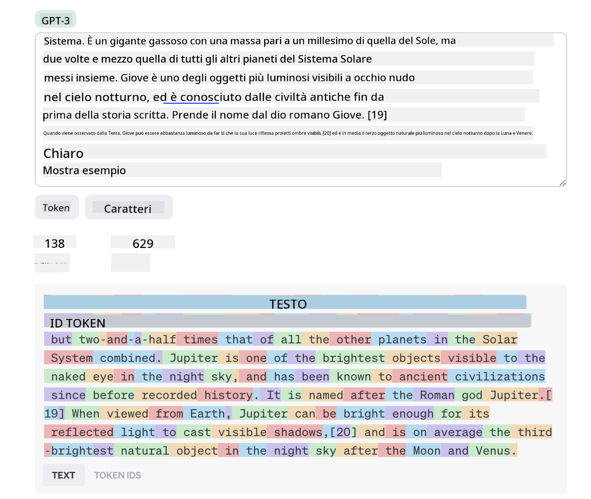
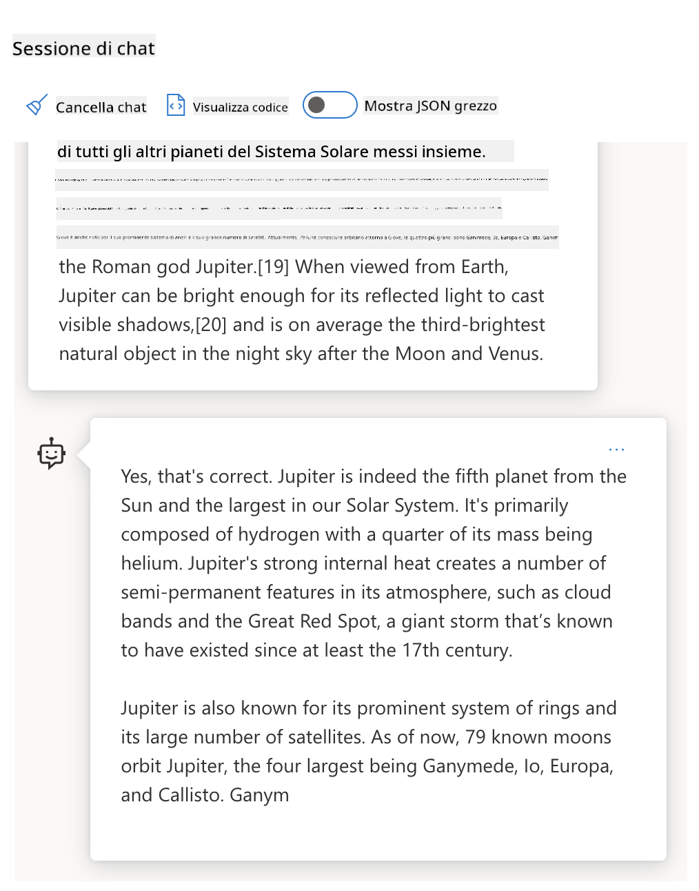
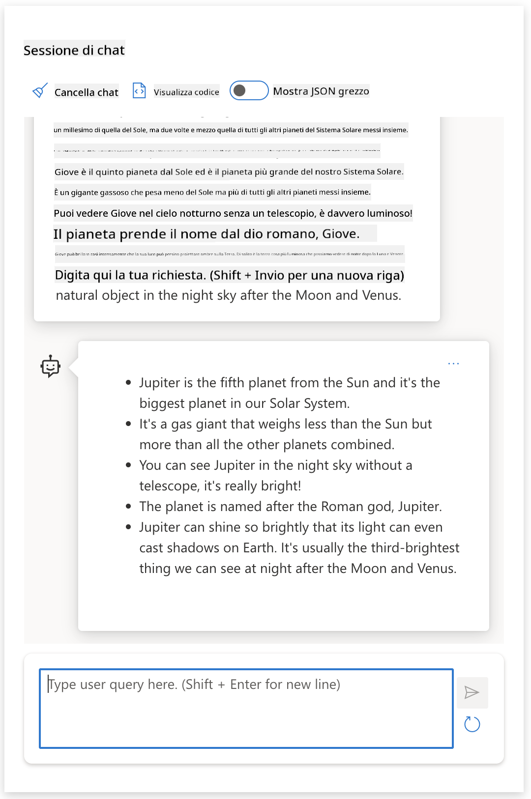

<!--
CO_OP_TRANSLATOR_METADATA:
{
  "original_hash": "a45c318dc6ebc2604f35b8b829f93af2",
  "translation_date": "2025-07-09T10:08:06+00:00",
  "source_file": "04-prompt-engineering-fundamentals/README.md",
  "language_code": "it"
}
-->
# Fondamenti di Prompt Engineering

[](https://aka.ms/gen-ai-lesson4-gh?WT.mc_id=academic-105485-koreyst)

## Introduzione  
Questo modulo copre i concetti e le tecniche essenziali per creare prompt efficaci nei modelli di AI generativa. Anche il modo in cui scrivi il tuo prompt per un LLM è importante. Un prompt ben progettato può ottenere una risposta di qualità superiore. Ma cosa significano esattamente termini come _prompt_ e _prompt engineering_? E come posso migliorare l’_input_ del prompt che invio all’LLM? Queste sono le domande a cui cercheremo di rispondere in questo capitolo e nel successivo.

_L’AI generativa_ è in grado di creare nuovi contenuti (ad esempio testo, immagini, audio, codice ecc.) in risposta alle richieste degli utenti. Lo fa utilizzando _Large Language Models_ come la serie GPT di OpenAI ("Generative Pre-trained Transformer") addestrati per usare il linguaggio naturale e il codice.

Gli utenti possono ora interagire con questi modelli usando paradigmi familiari come la chat, senza necessità di competenze tecniche o formazione. I modelli sono _basati su prompt_ - gli utenti inviano un input testuale (prompt) e ricevono la risposta dell’AI (completion). Possono quindi "chattare con l’AI" in modo iterativo, in conversazioni multi-turno, perfezionando il prompt finché la risposta non corrisponde alle loro aspettative.

I "prompt" diventano così l’interfaccia di _programmazione principale_ per le app di AI generativa, indicando ai modelli cosa fare e influenzando la qualità delle risposte restituite. Il "Prompt Engineering" è un campo di studio in rapida crescita che si concentra sul _design e l’ottimizzazione_ dei prompt per fornire risposte coerenti e di qualità su larga scala.

## Obiettivi di Apprendimento

In questa lezione, impareremo cos’è il Prompt Engineering, perché è importante e come possiamo creare prompt più efficaci per un dato modello e obiettivo applicativo. Comprenderemo i concetti chiave e le migliori pratiche per il prompt engineering - e scopriremo un ambiente interattivo "sandbox" in Jupyter Notebooks dove possiamo vedere questi concetti applicati a esempi reali.

Al termine di questa lezione saremo in grado di:

1. Spiegare cos’è il prompt engineering e perché è importante.  
2. Descrivere i componenti di un prompt e come vengono utilizzati.  
3. Apprendere le migliori pratiche e tecniche per il prompt engineering.  
4. Applicare le tecniche apprese a esempi reali, usando un endpoint OpenAI.

## Termini Chiave

Prompt Engineering: La pratica di progettare e perfezionare gli input per guidare i modelli AI a produrre output desiderati.  
Tokenizzazione: Il processo di conversione del testo in unità più piccole, chiamate token, che un modello può comprendere e elaborare.  
Instruction-Tuned LLMs: Large Language Models (LLM) che sono stati affinati con istruzioni specifiche per migliorare accuratezza e pertinenza delle risposte.

## Ambiente di Apprendimento Sandbox

Il prompt engineering è attualmente più un’arte che una scienza. Il modo migliore per migliorare la nostra intuizione è _praticare di più_ e adottare un approccio di tentativi ed errori che combina competenze nel dominio applicativo con tecniche raccomandate e ottimizzazioni specifiche per modello.

Il Jupyter Notebook che accompagna questa lezione fornisce un ambiente _sandbox_ dove puoi mettere in pratica ciò che impari - man mano o come parte della sfida di codice alla fine. Per eseguire gli esercizi, ti serviranno:

1. **Una chiave API Azure OpenAI** - l’endpoint del servizio per un LLM distribuito.  
2. **Un runtime Python** - in cui eseguire il Notebook.  
3. **Variabili d’ambiente locali** - _completa ora i passaggi di [SETUP](./../00-course-setup/SETUP.md?WT.mc_id=academic-105485-koreyst) per prepararti_.

Il notebook include esercizi _starter_ - ma sei incoraggiato ad aggiungere tue sezioni di _Markdown_ (descrizione) e _Codice_ (richieste di prompt) per provare pi√π esempi o idee - e costruire la tua intuizione per il design dei prompt.

## Guida Illustrata

Vuoi avere una panoramica di cosa tratta questa lezione prima di iniziare? Dai un’occhiata a questa guida illustrata, che ti dà un’idea degli argomenti principali trattati e dei punti chiave su cui riflettere in ciascuno. La roadmap della lezione ti porta dalla comprensione dei concetti fondamentali e delle sfide fino ad affrontarli con tecniche di prompt engineering e best practice rilevanti. Nota che la sezione "Tecniche Avanzate" in questa guida si riferisce ai contenuti trattati nel _capitolo successivo_ di questo percorso.


## La Nostra Startup

Ora, parliamo di come _questo argomento_ si collega alla missione della nostra startup di [portare l’innovazione AI nell’educazione](https://educationblog.microsoft.com/2023/06/collaborating-to-bring-ai-innovation-to-education?WT.mc_id=academic-105485-koreyst). Vogliamo costruire applicazioni AI per l’_apprendimento personalizzato_ - quindi pensiamo a come diversi utenti della nostra applicazione potrebbero "progettare" i prompt:

- **Amministratori** potrebbero chiedere all’AI di _analizzare i dati del curriculum per identificare lacune nella copertura_. L’AI può riassumere i risultati o visualizzarli con codice.  
- **Educatori** potrebbero chiedere all’AI di _generare un piano di lezione per un pubblico e un argomento specifici_. L’AI può costruire il piano personalizzato in un formato specificato.  
- **Studenti** potrebbero chiedere all’AI di _fare da tutor in una materia difficile_. L’AI può ora guidare gli studenti con lezioni, suggerimenti ed esempi su misura per il loro livello.

Questo è solo la punta dell’iceberg. Dai un’occhiata a [Prompts For Education](https://github.com/microsoft/prompts-for-edu/tree/main?WT.mc_id=academic-105485-koreyst) - una libreria open-source di prompt curata da esperti di educazione - per avere un’idea più ampia delle possibilità! _Prova a eseguire alcuni di questi prompt nella sandbox o usando l’OpenAI Playground per vedere cosa succede!_

<!--  
TEMPLATE DELLA LEZIONE:  
Questa unità dovrebbe coprire il concetto chiave #1.  
Rafforzare il concetto con esempi e riferimenti.

CONCETTO #1:  
Prompt Engineering.  
Definirlo e spiegare perché è necessario.  
-->

## Cos’è il Prompt Engineering?

Abbiamo iniziato questa lezione definendo il **Prompt Engineering** come il processo di _progettare e ottimizzare_ input testuali (prompt) per fornire risposte coerenti e di qualità (completion) per un dato obiettivo applicativo e modello. Possiamo pensarlo come un processo in 2 fasi:

- _progettare_ il prompt iniziale per un dato modello e obiettivo  
- _perfezionare_ il prompt in modo iterativo per migliorare la qualità della risposta

Si tratta necessariamente di un processo di tentativi ed errori che richiede intuizione e impegno da parte dell’utente per ottenere risultati ottimali. Ma perché è importante? Per rispondere a questa domanda, dobbiamo prima capire tre concetti:

- _Tokenizzazione_ = come il modello "vede" il prompt  
- _Base LLMs_ = come il modello di base "elabora" un prompt  
- _Instruction-Tuned LLMs_ = come il modello può ora interpretare "compiti"

### Tokenizzazione

Un LLM vede i prompt come una _sequenza di token_ dove modelli diversi (o versioni di un modello) possono tokenizzare lo stesso prompt in modi differenti. Poiché gli LLM sono addestrati su token (e non su testo grezzo), il modo in cui i prompt vengono tokenizzati ha un impatto diretto sulla qualità della risposta generata.

Per farti un’idea di come funziona la tokenizzazione, prova strumenti come l’[OpenAI Tokenizer](https://platform.openai.com/tokenizer?WT.mc_id=academic-105485-koreyst) mostrato qui sotto. Incolla il tuo prompt e guarda come viene convertito in token, prestando attenzione a come vengono gestiti spazi bianchi e segni di punteggiatura. Nota che questo esempio mostra un LLM più vecchio (GPT-3) - quindi provare con un modello più recente potrebbe dare risultati diversi.



### Concetto: Modelli di Base (Foundation Models)

Una volta che un prompt è tokenizzato, la funzione principale del ["Base LLM"](https://blog.gopenai.com/an-introduction-to-base-and-instruction-tuned-large-language-models-8de102c785a6?WT.mc_id=academic-105485-koreyst) (o modello di base) è prevedere il token successivo nella sequenza. Poiché gli LLM sono addestrati su enormi dataset testuali, hanno una buona comprensione delle relazioni statistiche tra i token e possono fare questa previsione con una certa sicurezza. Nota che non comprendono il _significato_ delle parole nel prompt o nel token; vedono solo un pattern che possono "completare" con la loro previsione successiva. Possono continuare a prevedere la sequenza finché non vengono interrotti dall’utente o da una condizione predefinita.

Vuoi vedere come funziona la completion basata su prompt? Inserisci il prompt sopra nell’Azure OpenAI Studio [_Chat Playground_](https://oai.azure.com/playground?WT.mc_id=academic-105485-koreyst) con le impostazioni predefinite. Il sistema è configurato per trattare i prompt come richieste di informazioni - quindi dovresti vedere una completion che soddisfa questo contesto.

Ma cosa succede se l’utente vuole vedere qualcosa di specifico che rispetti certi criteri o obiettivi di compito? Qui entrano in gioco gli LLM _instruction-tuned_.



### Concetto: Instruction Tuned LLMs

Un [Instruction Tuned LLM](https://blog.gopenai.com/an-introduction-to-base-and-instruction-tuned-large-language-models-8de102c785a6?WT.mc_id=academic-105485-koreyst) parte dal modello di base e lo affina con esempi o coppie input/output (ad esempio "messaggi" multi-turno) che possono contenere istruzioni chiare - e la risposta dell’AI cerca di seguire quell’istruzione.

Questo utilizza tecniche come il Reinforcement Learning with Human Feedback (RLHF) che possono addestrare il modello a _seguire istruzioni_ e _imparare dal feedback_ in modo da produrre risposte più adatte ad applicazioni pratiche e più rilevanti per gli obiettivi dell’utente.

Proviamolo - riprendi il prompt sopra, ma ora cambia il _messaggio di sistema_ per fornire la seguente istruzione come contesto:

> _Riassumi il contenuto fornito per uno studente di seconda elementare. Mantieni il risultato in un paragrafo con 3-5 punti elenco._

Vedi come il risultato ora è tarato per riflettere l’obiettivo e il formato desiderati? Un educatore può ora usare direttamente questa risposta nelle sue slide per quella lezione.



## Perché abbiamo bisogno del Prompt Engineering?

Ora che sappiamo come i prompt vengono elaborati dagli LLM, parliamo del _perché_ abbiamo bisogno del prompt engineering. La risposta sta nel fatto che gli LLM attuali presentano diverse sfide che rendono più difficile ottenere _completion affidabili e coerenti_ senza mettere impegno nella costruzione e ottimizzazione del prompt. Per esempio:

1. **Le risposte del modello sono stocastiche.** Lo _stesso prompt_ probabilmente produrrà risposte diverse con modelli o versioni diverse. E può anche produrre risultati differenti con _lo stesso modello_ in momenti diversi. _Le tecniche di prompt engineering ci aiutano a minimizzare queste variazioni fornendo migliori linee guida_.

1. **I modelli possono inventare risposte.** I modelli sono pre-addestrati con dataset _grandi ma finiti_, il che significa che non conoscono concetti al di fuori di quel campo di addestramento. Di conseguenza, possono produrre completion inaccurate, immaginarie o direttamente contraddittorie rispetto a fatti noti. _Le tecniche di prompt engineering aiutano gli utenti a identificare e mitigare queste invenzioni, ad esempio chiedendo all’AI citazioni o ragionamenti_.

1. **Le capacità dei modelli variano.** Modelli più recenti o generazioni successive hanno capacità più ricche ma portano anche peculiarità uniche e compromessi in termini di costi e complessità. _Il prompt engineering può aiutarci a sviluppare best practice e flussi di lavoro che astraggono le differenze e si adattano ai requisiti specifici del modello in modo scalabile e fluido_.

Vediamo questo in azione nell’OpenAI o Azure OpenAI Playground:

- Usa lo stesso prompt con diverse distribuzioni di LLM (ad esempio OpenAI, Azure OpenAI, Hugging Face) - hai notato le variazioni?  
- Usa lo stesso prompt ripetutamente con la _stessa_ distribuzione LLM (ad esempio Azure OpenAI playground) - come sono cambiate queste variazioni?

### Esempio di Invenzioni (Fabrications)

In questo corso, usiamo il termine **"fabrication"** per riferirci al fenomeno per cui gli LLM a volte generano informazioni fattualmente errate a causa di limiti nel loro addestramento o altre restrizioni. Potresti aver sentito questo fenomeno chiamato _"allucinazioni"_ in articoli popolari o paper di ricerca. Tuttavia, raccomandiamo fortemente di usare il termine _"fabrication"_ per non antropomorfizzare involontariamente il comportamento attribuendo una caratteristica umana a un risultato generato da una macchina. Questo rafforza anche le [linee guida di Responsible AI](https://www.microsoft.com/ai/responsible-ai?WT.mc_id=academic-105485-koreyst) dal punto di vista terminologico, eliminando termini che potrebbero essere considerati offensivi o non inclusivi in certi contesti.

Vuoi farti un’idea di come funzionano le fabrication? Pensa a un prompt che istruisce l’AI a generare contenuti su un argomento inesistente (per assicurarti che non sia presente nel dataset di addestramento). Per esempio - ho provato questo prompt:
# Piano di lezione: La Guerra Marziana del 2076

## Obiettivi della lezione
- Comprendere le cause principali della Guerra Marziana del 2076
- Analizzare gli eventi chiave e le strategie militari utilizzate
- Valutare le conseguenze a lungo termine del conflitto su Marte e sulla Terra

## Introduzione (10 minuti)
- Breve panoramica storica di Marte prima del 2076
- Presentazione delle tensioni politiche e sociali che hanno portato alla guerra

## Sviluppo (30 minuti)
### Cause della guerra
- Risorse limitate e competizione tra colonie
- Divergenze ideologiche e politiche
- Incidenti scatenanti e escalation del conflitto

### Eventi principali
- Prima battaglia di Valles Marineris
- Assedio della colonia di Olympus Mons
- Intervento delle forze terrestri

### Strategie militari
- Uso di droni e robot da combattimento
- Tattiche di guerriglia marziana
- Impatto della tecnologia avanzata sul campo di battaglia

## Discussione (15 minuti)
- Come la guerra ha influenzato le relazioni tra Marte e Terra
- Le lezioni apprese e le misure per prevenire futuri conflitti

## Conclusione (5 minuti)
- Riepilogo dei punti chiave
- Domande e risposte

## Materiali di supporto
- Mappe delle principali battaglie
- Documenti storici e testimonianze
- Video ricostruzioni degli eventi

## Compiti a casa
- Scrivere un saggio sulle cause della Guerra Marziana del 2076
- Preparare una presentazione sulle conseguenze del conflitto
Una ricerca sul web mi ha mostrato che esistono racconti di fantasia (ad esempio, serie televisive o libri) sulle guerre marziane - ma nessuno nel 2076. Il buon senso ci dice anche che il 2076 è _nel futuro_ e quindi non può essere associato a un evento reale.

Cosa succede quindi quando eseguiamo questo prompt con diversi fornitori di LLM?

> **Risposta 1**: OpenAI Playground (GPT-35)


> **Risposta 2**: Azure OpenAI Playground (GPT-35)


> **Risposta 3**: : Hugging Face Chat Playground (LLama-2)


Come previsto, ogni modello (o versione del modello) produce risposte leggermente diverse grazie al comportamento stocastico e alle variazioni nelle capacità del modello. Per esempio, un modello si rivolge a un pubblico di ottava elementare mentre un altro assume uno studente delle superiori. Ma tutti e tre i modelli hanno generato risposte che potrebbero convincere un utente non informato che l’evento fosse reale.

Tecniche di prompt engineering come il _metaprompting_ e la _configurazione della temperatura_ possono ridurre in parte le fabbricazioni del modello. Nuove _architetture_ di prompt engineering integrano anche nuovi strumenti e tecniche senza soluzione di continuità nel flusso del prompt, per mitigare o ridurre alcuni di questi effetti.

## Caso di Studio: GitHub Copilot

Concludiamo questa sezione dando un’idea di come il prompt engineering venga utilizzato in soluzioni reali, esaminando un Caso di Studio: [GitHub Copilot](https://github.com/features/copilot?WT.mc_id=academic-105485-koreyst).

GitHub Copilot è il tuo "Programmatore AI in coppia" - trasforma i prompt testuali in completamenti di codice ed è integrato nel tuo ambiente di sviluppo (ad esempio, Visual Studio Code) per un’esperienza utente fluida. Come documentato nella serie di blog qui sotto, la prima versione si basava sul modello OpenAI Codex - con gli ingegneri che hanno rapidamente capito la necessità di affinare il modello e sviluppare tecniche migliori di prompt engineering per migliorare la qualità del codice. A luglio, hanno [presentato un modello AI migliorato che va oltre Codex](https://github.blog/2023-07-28-smarter-more-efficient-coding-github-copilot-goes-beyond-codex-with-improved-ai-model/?WT.mc_id=academic-105485-koreyst) per suggerimenti ancora più rapidi.

Leggi i post in ordine per seguire il loro percorso di apprendimento.

- **Maggio 2023** | [GitHub Copilot sta migliorando nella comprensione del tuo codice](https://github.blog/2023-05-17-how-github-copilot-is-getting-better-at-understanding-your-code/?WT.mc_id=academic-105485-koreyst)
- **Maggio 2023** | [Dentro GitHub: lavorare con gli LLM dietro GitHub Copilot](https://github.blog/2023-05-17-inside-github-working-with-the-llms-behind-github-copilot/?WT.mc_id=academic-105485-koreyst)
- **Giugno 2023** | [Come scrivere prompt migliori per GitHub Copilot](https://github.blog/2023-06-20-how-to-write-better-prompts-for-github-copilot/?WT.mc_id=academic-105485-koreyst)
- **Luglio 2023** | [.. GitHub Copilot va oltre Codex con un modello AI migliorato](https://github.blog/2023-07-28-smarter-more-efficient-coding-github-copilot-goes-beyond-codex-with-improved-ai-model/?WT.mc_id=academic-105485-koreyst)
- **Luglio 2023** | [Guida per sviluppatori al Prompt Engineering e agli LLM](https://github.blog/2023-07-17-prompt-engineering-guide-generative-ai-llms/?WT.mc_id=academic-105485-koreyst)
- **Settembre 2023** | [Come costruire un’app LLM aziendale: lezioni da GitHub Copilot](https://github.blog/2023-09-06-how-to-build-an-enterprise-llm-application-lessons-from-github-copilot/?WT.mc_id=academic-105485-koreyst)

Puoi anche esplorare il loro [blog di Engineering](https://github.blog/category/engineering/?WT.mc_id=academic-105485-koreyst) per altri post come [questo](https://github.blog/2023-09-27-how-i-used-github-copilot-chat-to-build-a-reactjs-gallery-prototype/?WT.mc_id=academic-105485-koreyst) che mostra come questi modelli e tecniche vengano _applicati_ per guidare applicazioni reali.

---

<!--
LESSON TEMPLATE:
Questa unità dovrebbe coprire il concetto chiave #2.
Rafforzare il concetto con esempi e riferimenti.

CONCETTO #2:
Progettazione del Prompt.
Illustrato con esempi.
-->

## Costruzione del Prompt

Abbiamo visto perché il prompt engineering è importante - ora capiamo come i prompt vengono _costruiti_ così da poter valutare diverse tecniche per una progettazione più efficace del prompt.

### Prompt Base

Iniziamo con il prompt base: un input testuale inviato al modello senza altro contesto. Ecco un esempio - quando inviamo le prime parole dell’inno nazionale degli Stati Uniti all’OpenAI [Completion API](https://platform.openai.com/docs/api-reference/completions?WT.mc_id=academic-105485-koreyst), questo completa istantaneamente la risposta con le righe successive, illustrando il comportamento base di predizione.

| Prompt (Input)     | Completion (Output)                                                                                                                        |
| :----------------- | :----------------------------------------------------------------------------------------------------------------------------------------- |
| Oh say can you see | Sembra che tu stia iniziando il testo di "The Star-Spangled Banner", l’inno nazionale degli Stati Uniti. Il testo completo è ...           |

### Prompt Complesso

Ora aggiungiamo contesto e istruzioni a quel prompt base. La [Chat Completion API](https://learn.microsoft.com/azure/ai-services/openai/how-to/chatgpt?WT.mc_id=academic-105485-koreyst) ci permette di costruire un prompt complesso come una raccolta di _messaggi_ con:

- Coppie input/output che riflettono l’input dell’_utente_ e la risposta dell’_assistente_.
- Messaggio di sistema che imposta il contesto per il comportamento o la personalità dell’assistente.

La richiesta ora ha la forma mostrata qui sotto, dove la _tokenizzazione_ cattura efficacemente le informazioni rilevanti dal contesto e dalla conversazione. Cambiare il contesto di sistema può avere un impatto sulla qualità dei completamenti tanto quanto gli input forniti dall’utente.

```python
response = openai.chat.completions.create(
    model="gpt-3.5-turbo",
    messages=[
        {"role": "system", "content": "You are a helpful assistant."},
        {"role": "user", "content": "Who won the world series in 2020?"},
        {"role": "assistant", "content": "The Los Angeles Dodgers won the World Series in 2020."},
        {"role": "user", "content": "Where was it played?"}
    ]
)
```

### Prompt Istruttivo

Negli esempi sopra, il prompt utente era una semplice domanda testuale che può essere interpretata come una richiesta di informazioni. Con i prompt _istruttivi_, possiamo usare quel testo per specificare un compito in modo più dettagliato, fornendo una guida migliore all’AI. Ecco un esempio:

| Prompt (Input)                                                                                                                                                                                                                         | Completion (Output)                                                                                                        | Tipo di Istruzione  |
| :------------------------------------------------------------------------------------------------------------------------------------------------------------------------------------------------------------------------------------- | :------------------------------------------------------------------------------------------------------------------------- | :------------------ |
| Scrivi una descrizione della Guerra Civile                                                                                                                                                                                           | _ha restituito un semplice paragrafo_                                                                                      | Semplice            |
| Scrivi una descrizione della Guerra Civile. Fornisci date ed eventi chiave e descrivi la loro importanza                                                                                                                                 | _ha restituito un paragrafo seguito da un elenco di date chiave con descrizioni_                                           | Complesso           |
| Scrivi una descrizione della Guerra Civile in 1 paragrafo. Fornisci 3 punti elenco con date chiave e la loro importanza. Fornisci altri 3 punti elenco con figure storiche importanti e i loro contributi. Restituisci l’output come file JSON | _restituisce dettagli più estesi in una casella di testo, formattata come JSON che puoi copiare e incollare in un file e validare se necessario_ | Complesso. Formattato. |

## Contenuto Primario

Negli esempi sopra, il prompt era ancora piuttosto aperto, permettendo all’LLM di decidere quale parte del suo dataset pre-addestrato fosse rilevante. Con il pattern di progettazione _contenuto primario_, il testo di input è diviso in due parti:

- un’istruzione (azione)
- contenuto rilevante (che influenza l’azione)

Ecco un esempio in cui l’istruzione è "riassumi questo in 2 frasi".

| Prompt (Input)                                                                                                                                                                                                                                                                                                                                                                                                                                                                                                                                                                                                                                                                                      | Completion (Output)                                                                                                                                                                                                                                                                             |
| :-------------------------------------------------------------------------------------------------------------------------------------------------------------------------------------------------------------------------------------------------------------------------------------------------------------------------------------------------------------------------------------------------------------------------------------------------------------------------------------------------------------------------------------------------------------------------------------------------------------------------------------------------------------------------------------------------- | :---------------------------------------------------------------------------------------------------------------------------------------------------------------------------------------------------------------------------------------------------------------------------------------------- |
| Giove è il quinto pianeta dal Sole ed è il più grande del Sistema Solare. È un gigante gassoso con una massa pari a un millesimo di quella del Sole, ma due volte e mezzo quella di tutti gli altri pianeti del Sistema Solare messi insieme. Giove è uno degli oggetti più luminosi visibili a occhio nudo nel cielo notturno, ed è noto alle antiche civiltà fin da prima della storia registrata. Prende il nome dal dio romano Giove.[19] Quando visto dalla Terra, Giove può essere abbastanza luminoso da far proiettare ombre visibili,[20] ed è in media il terzo oggetto naturale più luminoso nel cielo notturno dopo la Luna e Venere. <br/> **Riassumi questo in 2 frasi brevi** | Giove, il quinto pianeta dal Sole, è il più grande del Sistema Solare ed è noto per essere uno degli oggetti più luminosi nel cielo notturno. Chiamato come il dio romano Giove, è un gigante gassoso la cui massa è due volte e mezzo quella di tutti gli altri pianeti del Sistema Solare messi insieme. |

Il segmento di contenuto primario può essere usato in vari modi per guidare istruzioni più efficaci:

- **Esempi** - invece di dire esplicitamente al modello cosa fare con un’istruzione, fornisci esempi di cosa fare e lascia che inferisca il modello.
- **Suggerimenti** - segui l’istruzione con un "suggerimento" che prepara il completamento, guidando il modello verso risposte più rilevanti.
- **Template** - sono 'ricette' ripetibili per prompt con segnaposto (variabili) che possono essere personalizzati con dati per casi d’uso specifici.

Esploriamo questi casi in azione.

### Uso di Esempi

Questo è un approccio in cui usi il contenuto primario per "nutrire il modello" con alcuni esempi dell’output desiderato per una data istruzione, e lasci che inferisca il modello per l’output desiderato. In base al numero di esempi forniti, possiamo avere zero-shot prompting, one-shot prompting, few-shot prompting ecc.

Il prompt ora consiste di tre componenti:

- Una descrizione del compito
- Alcuni esempi dell’output desiderato
- L’inizio di un nuovo esempio (che diventa una descrizione implicita del compito)

| Tipo di Apprendimento | Prompt (Input)                                                                                                                                        | Completion (Output)         |
| :-------------------- | :---------------------------------------------------------------------------------------------------------------------------------------------------- | :-------------------------- |
| Zero-shot             | "The Sun is Shining". Traduci in spagnolo                                                                                                            | "El Sol est√° brillando".    |
| One-shot              | "The Sun is Shining" => "El Sol está brillando". <br> "It's a Cold and Windy Day" =>                                                                 | "Es un día frío y ventoso". |
| Few-shot              | Il giocatore ha corso le basi => Baseball <br/> Il giocatore ha fatto un ace => Tennis <br/> Il giocatore ha fatto un sei => Cricket <br/> Il giocatore ha fatto una schiacciata => | Basket                     |
|                       |                                                                                                                                                       |                             |

Nota come abbiamo dovuto fornire un’istruzione esplicita ("Traduci in spagnolo") nel zero-shot prompting, ma questa viene dedotta nell’esempio one-shot. L’esempio few-shot mostra come aggiungere più esempi permetta ai modelli di fare inferenze più accurate senza istruzioni aggiuntive.

### Suggerimenti per il Prompt

Un’altra tecnica per usare il contenuto primario è fornire _suggerimenti_ invece di esempi. In questo caso, diamo al modello una spinta nella direzione giusta _iniziando_ con uno snippet che riflette il formato di risposta desiderato. Il modello quindi "prende il suggerimento" e continua in quella direzione.

| Numero di Suggerimenti | Prompt (Input)                                                                                                                                                                                                                                                                                                                                                                                                                                               | Completion (Output)                                                                                                                                                                                                                                                                                       |
| :--------------------- | :----------------------------------------------------------------------------------------------------------------------------------------------------------------------------------------------------------------------------------------------------------------------------------------------------------------------------------------------------------------------------------------------------------------------------------------------------------- | :-------------------------------------------------------------------------------------------------------------------------------------------------------------------------------------------------------------------------------------------------------------------------------------------------------- |
| 0                      | Giove è il quinto pianeta dal Sole ed è il più grande del Sistema Solare. È un gigante gassoso con una massa pari a un millesimo di quella del Sole, ma due volte e mezzo quella di tutti gli altri pianeti del Sistema Solare messi insieme. Giove è uno degli oggetti più luminosi visibili a occhio nudo nel cielo notturno, ed è noto alle antiche civiltà fin da prima della storia registrata.

**Riassumi Questo**                                       | Giove è il pianeta più grande del nostro Sistema Solare e il quinto in ordine di distanza dal Sole. È un gigante gassoso con una massa pari a 1/1000 di quella del Sole, ma è più pesante di tutti gli altri pianeti messi insieme. Le antiche civiltà conoscevano Giove da molto tempo, ed è facilmente visibile nel cielo notturno. |
| 1              | Giove è il quinto pianeta dal Sole e il più grande del Sistema Solare. È un gigante gassoso con una massa pari a un millesimo di quella del Sole, ma due volte e mezzo quella di tutti gli altri pianeti del Sistema Solare messi insieme. Giove è uno degli oggetti più luminosi visibili a occhio nudo nel cielo notturno, ed è conosciuto dalle antiche civiltà fin da prima della storia registrata. <br/>**Riassumi Questo** <br/> Quello che abbiamo imparato è che Giove | è il quinto pianeta dal Sole e il più grande del Sistema Solare. È un gigante gassoso con una massa pari a un millesimo di quella del Sole, ma due volte e mezzo quella di tutti gli altri pianeti messi insieme. È facilmente visibile a occhio nudo ed è conosciuto fin dall’antichità.                        |
| 2              | Giove è il quinto pianeta dal Sole e il più grande del Sistema Solare. È un gigante gassoso con una massa pari a un millesimo di quella del Sole, ma due volte e mezzo quella di tutti gli altri pianeti del Sistema Solare messi insieme. Giove è uno degli oggetti più luminosi visibili a occhio nudo nel cielo notturno, ed è conosciuto dalle antiche civiltà fin da prima della storia registrata. <br/>**Riassumi Questo** <br/> Le 3 principali informazioni che abbiamo appreso:         | 1. Giove è il quinto pianeta dal Sole e il più grande del Sistema Solare. <br/> 2. È un gigante gassoso con una massa pari a un millesimo di quella del Sole...<br/> 3. Giove è visibile a occhio nudo fin dall’antichità ...                                                                       |
|                |                                                                                                                                                                                                                                                                                                                                                                                                                                                              |                                                                                                                                                                                                                                                                                                           |

### Modelli di Prompt

Un modello di prompt è una _ricetta predefinita per un prompt_ che può essere salvata e riutilizzata secondo necessità, per garantire esperienze utente più coerenti su larga scala. Nella sua forma più semplice, è semplicemente una raccolta di esempi di prompt come [questo di OpenAI](https://platform.openai.com/examples?WT.mc_id=academic-105485-koreyst) che fornisce sia i componenti interattivi del prompt (messaggi utente e sistema) sia il formato della richiesta API - per supportare il riutilizzo.

Nella sua forma pi√π complessa, come [questo esempio di LangChain](https://python.langchain.com/docs/concepts/prompt_templates/?WT.mc_id=academic-105485-koreyst), contiene _segnaposto_ che possono essere sostituiti con dati provenienti da varie fonti (input utente, contesto di sistema, fonti dati esterne ecc.) per generare un prompt in modo dinamico. Questo ci permette di creare una libreria di prompt riutilizzabili che possono essere usati per offrire esperienze utente coerenti **in modo programmato** su larga scala.

Infine, il vero valore dei modelli risiede nella capacità di creare e pubblicare _librerie di prompt_ per domini applicativi verticali - dove il modello di prompt è ora _ottimizzato_ per riflettere contesti o esempi specifici dell’applicazione che rendono le risposte più pertinenti e accurate per il pubblico target. Il repository [Prompts For Edu](https://github.com/microsoft/prompts-for-edu?WT.mc_id=academic-105485-koreyst) è un ottimo esempio di questo approccio, curando una libreria di prompt per il settore educativo con enfasi su obiettivi chiave come la pianificazione delle lezioni, la progettazione del curriculum, il tutoraggio degli studenti ecc.

## Contenuti di Supporto

Se consideriamo la costruzione di un prompt come composta da un’istruzione (compito) e un contenuto principale (contenuto primario), allora il _contenuto secondario_ è come un contesto aggiuntivo che forniamo per **influenzare in qualche modo l’output**. Può trattarsi di parametri di regolazione, istruzioni di formattazione, tassonomie di argomenti ecc. che aiutano il modello a _personalizzare_ la risposta per adattarla agli obiettivi o alle aspettative dell’utente.

Per esempio: dato un catalogo corsi con metadati estesi (nome, descrizione, livello, tag di metadati, docente ecc.) su tutti i corsi disponibili nel curriculum:

- possiamo definire un’istruzione per "riassumere il catalogo corsi per l’autunno 2023"
- possiamo usare il contenuto primario per fornire alcuni esempi dell’output desiderato
- possiamo usare il contenuto secondario per identificare i 5 "tag" di maggior interesse.

Ora, il modello può fornire un riassunto nel formato mostrato dagli esempi - ma se un risultato ha più tag, può dare priorità ai 5 tag identificati nel contenuto secondario.

---

<!--
TEMPLATE LEZIONE:
Questa unità dovrebbe coprire il concetto base #1.
Rinforza il concetto con esempi e riferimenti.

CONCETTO #3:
Tecniche di Prompt Engineering.
Quali sono alcune tecniche base per il prompt engineering?
Illustra con alcuni esercizi.
-->

## Buone Pratiche per il Prompting

Ora che sappiamo come i prompt possono essere _costruiti_, possiamo iniziare a pensare a come _progettarli_ per riflettere le migliori pratiche. Possiamo considerare questo in due parti - avere la giusta _mentalità_ e applicare le giuste _tecniche_.

### Mentalità del Prompt Engineering

Il Prompt Engineering è un processo di tentativi ed errori, quindi tieni a mente tre fattori guida generali:

1. **La conoscenza del dominio è importante.** L’accuratezza e la pertinenza della risposta dipendono dal _dominio_ in cui l’applicazione o l’utente opera. Applica la tua intuizione e competenza di dominio per **personalizzare ulteriormente le tecniche**. Per esempio, definisci _personalità specifiche del dominio_ nei prompt di sistema, o usa _modelli specifici del dominio_ nei prompt utente. Fornisci contenuti secondari che riflettano contesti specifici del dominio, o usa _segnali ed esempi specifici del dominio_ per guidare il modello verso schemi d’uso familiari.

2. **La conoscenza del modello è importante.** Sappiamo che i modelli sono per natura stocastici. Ma le implementazioni possono variare in termini di dataset di addestramento usato (conoscenza pre-addestrata), capacità offerte (es. via API o SDK) e tipo di contenuto per cui sono ottimizzati (es. codice vs immagini vs testo). Comprendi i punti di forza e i limiti del modello che stai usando, e usa questa conoscenza per _prioritizzare i compiti_ o costruire _modelli personalizzati_ ottimizzati per le capacità del modello.

3. **Iterazione e validazione sono importanti.** I modelli evolvono rapidamente, così come le tecniche di prompt engineering. Come esperto di dominio, potresti avere altri contesti o criteri specifici per la tua applicazione, che potrebbero non valere per la comunità più ampia. Usa strumenti e tecniche di prompt engineering per "dare una spinta" alla costruzione del prompt, poi itera e valida i risultati usando la tua intuizione e competenza di dominio. Registra le tue intuizioni e crea una **base di conoscenza** (es. librerie di prompt) che altri possono usare come nuovo punto di partenza, per iterazioni più rapide in futuro.

## Migliori Pratiche

Ora vediamo alcune buone pratiche comuni raccomandate da [OpenAI](https://help.openai.com/en/articles/6654000-best-practices-for-prompt-engineering-with-openai-api?WT.mc_id=academic-105485-koreyst) e dai professionisti di [Azure OpenAI](https://learn.microsoft.com/azure/ai-services/openai/concepts/prompt-engineering#best-practices?WT.mc_id=academic-105485-koreyst).

| Cosa                              | Perché                                                                                                                                                                                                                                               |
| :-------------------------------- | :------------------------------------------------------------------------------------------------------------------------------------------------------------------------------------------------------------------------------------------------ |
| Valuta i modelli più recenti.       | Le nuove generazioni di modelli probabilmente offrono funzionalità e qualità migliorate - ma possono anche comportare costi maggiori. Valutali per l’impatto, poi prendi decisioni di migrazione.                                                                                |
| Separa istruzioni e contesto   | Verifica se il tuo modello/fornitore definisce _delimitatori_ per distinguere pi√π chiaramente istruzioni, contenuto primario e secondario. Questo aiuta i modelli ad assegnare pesi pi√π accurati ai token.                                                         |
| Sii specifico e chiaro             | Fornisci più dettagli sul contesto desiderato, risultato, lunghezza, formato, stile ecc. Questo migliora sia la qualità che la coerenza delle risposte. Registra le “ricette” in modelli riutilizzabili.                                                          |
| Sii descrittivo, usa esempi      | I modelli rispondono meglio a un approccio “mostra e racconta”. Parti con un approccio `zero-shot` dove dai solo un’istruzione (ma nessun esempio), poi prova `few-shot` come affinamento, fornendo alcuni esempi dell’output desiderato. Usa analogie. |
| Usa segnali per avviare le risposte | Spingilo verso un risultato desiderato fornendo alcune parole o frasi iniziali che può usare come punto di partenza per la risposta.                                                                                                               |
| Insisti                       | A volte può essere necessario ripetere le istruzioni al modello. Dai istruzioni prima e dopo il contenuto primario, usa un’istruzione e un segnale, ecc. Itera e valida per vedere cosa funziona.                                                         |
| L’ordine conta                     | L’ordine con cui presenti le informazioni al modello può influenzare l’output, anche negli esempi di apprendimento, a causa del bias di recenza. Prova diverse opzioni per vedere cosa funziona meglio.                                                               |
| Dai al modello una “via d’uscita”           | Fornisci al modello una risposta di completamento _di riserva_ che può usare se non riesce a completare il compito per qualsiasi motivo. Questo riduce la probabilità che generi risposte false o inventate.                                                         |
|                                   |                                                                                                                                                                                                                                                   |

Come per ogni buona pratica, ricorda che _i risultati possono variare_ in base al modello, al compito e al dominio. Usa queste indicazioni come punto di partenza e itera per trovare ciò che funziona meglio per te. Rivaluta costantemente il processo di prompt engineering man mano che nuovi modelli e strumenti diventano disponibili, con un focus sulla scalabilità del processo e sulla qualità delle risposte.

<!--
TEMPLATE LEZIONE:
Questa unità dovrebbe fornire una sfida di codice se applicabile

SFIDA:
Link a un Jupyter Notebook con solo i commenti nel codice nelle istruzioni (le sezioni di codice sono vuote).

SOLUZIONE:
Link a una copia di quel Notebook con i prompt compilati e eseguiti, mostrando un esempio di output.
-->

## Compito

Congratulazioni! Sei arrivato alla fine della lezione! È il momento di mettere alla prova alcuni di quei concetti e tecniche con esempi reali!

Per il nostro compito useremo un Jupyter Notebook con esercizi che puoi completare in modo interattivo. Puoi anche estendere il Notebook con le tue celle Markdown e di codice per esplorare idee e tecniche in autonomia.

### Per iniziare, fai un fork del repo, poi

- (Consigliato) Avvia GitHub Codespaces
- (In alternativa) Clona il repo sul tuo dispositivo locale e usalo con Docker Desktop
- (In alternativa) Apri il Notebook con il tuo ambiente di runtime preferito.

### Poi, configura le variabili d’ambiente

- Copia il file `.env.copy` nella root del repo in `.env` e compila i valori di `AZURE_OPENAI_API_KEY`, `AZURE_OPENAI_ENDPOINT` e `AZURE_OPENAI_DEPLOYMENT`. Torna alla [sezione Learning Sandbox](../../../04-prompt-engineering-fundamentals/04-prompt-engineering-fundamentals) per imparare come fare.

### Infine, apri il Jupyter Notebook

- Seleziona il kernel di runtime. Se usi le opzioni 1 o 2, seleziona semplicemente il kernel Python 3.10.x predefinito fornito dal container di sviluppo.

Sei pronto per eseguire gli esercizi. Nota che qui non ci sono risposte “giuste o sbagliate” - si tratta di esplorare opzioni con tentativi ed errori e costruire intuizione su cosa funziona per un dato modello e dominio applicativo.

_Per questo motivo non ci sono segmenti di Soluzione Codice in questa lezione. Invece, il Notebook avrà celle Markdown intitolate "La mia soluzione:" che mostrano un esempio di output come riferimento._

 <!--
TEMPLATE LEZIONE:
Concludi la sezione con un riepilogo e risorse per l’apprendimento autonomo.
-->

## Verifica delle conoscenze

Quale dei seguenti è un buon prompt che segue alcune ragionevoli migliori pratiche?

1. Mostrami un’immagine di un’auto rossa  
2. Mostrami un’immagine di un’auto rossa marca Volvo modello XC90 parcheggiata su una scogliera con il sole al tramonto  
3. Mostrami un’immagine di un’auto rossa marca Volvo modello XC90

Risposta: 2, è il miglior prompt perché fornisce dettagli su “cosa” e va nei particolari (non una qualsiasi auto ma una marca e modello specifici) e descrive anche l’ambientazione generale. 3 è il secondo migliore perché contiene comunque molte descrizioni.

## üöÄ Sfida

Prova a sfruttare la tecnica del “segnale” con il prompt: Completa la frase "Mostrami un’immagine di un’auto rossa marca Volvo e ". Cosa risponde, e come la miglioreresti?

## Ottimo lavoro! Continua a imparare

Vuoi approfondire i diversi concetti di Prompt Engineering? Vai alla [pagina di apprendimento continuato](https://aka.ms/genai-collection?WT.mc_id=academic-105485-koreyst) per trovare altre ottime risorse su questo argomento.

Passa alla Lezione 5 dove vedremo le [tecniche avanzate di prompting](../05-advanced-prompts/README.md?WT.mc_id=academic-105485-koreyst)!

**Disclaimer**:  
Questo documento è stato tradotto utilizzando il servizio di traduzione automatica [Co-op Translator](https://github.com/Azure/co-op-translator). Pur impegnandoci per garantire accuratezza, si prega di notare che le traduzioni automatiche possono contenere errori o imprecisioni. Il documento originale nella sua lingua nativa deve essere considerato la fonte autorevole. Per informazioni critiche, si raccomanda una traduzione professionale effettuata da un umano. Non ci assumiamo alcuna responsabilità per eventuali malintesi o interpretazioni errate derivanti dall’uso di questa traduzione.