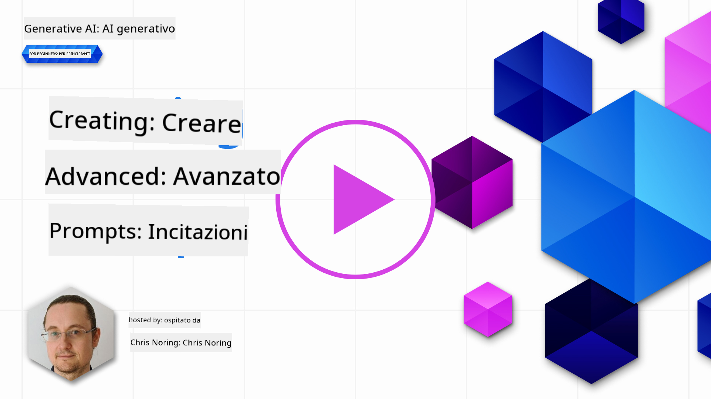

<!--
CO_OP_TRANSLATOR_METADATA:
{
  "original_hash": "b2651fb16bcfbc62b8e518751ed90fdb",
  "translation_date": "2025-10-18T00:47:45+00:00",
  "source_file": "05-advanced-prompts/README.md",
  "language_code": "it"
}
-->
# Creare prompt avanzati

[](https://youtu.be/BAjzkaCdRok?si=NmUIyRf7-cDgbjtt)

Ripassiamo alcune nozioni apprese nel capitolo precedente:

> La _progettazione dei prompt_ è il processo attraverso il quale **guidiamo il modello verso risposte più pertinenti** fornendo istruzioni o contesti più utili.

Ci sono anche due passaggi per scrivere i prompt: costruire il prompt, fornendo un contesto rilevante, e _ottimizzarlo_, ovvero migliorarlo gradualmente.

A questo punto, abbiamo una comprensione di base su come scrivere i prompt, ma dobbiamo approfondire. In questo capitolo, passerai dal provare vari prompt a capire perché un prompt è migliore di un altro. Imparerai a costruire prompt seguendo alcune tecniche di base che possono essere applicate a qualsiasi LLM.

## Introduzione

In questo capitolo, tratteremo i seguenti argomenti:

- Ampliare la tua conoscenza della progettazione dei prompt applicando diverse tecniche ai tuoi prompt.
- Configurare i tuoi prompt per variare l'output.

## Obiettivi di apprendimento

Dopo aver completato questa lezione, sarai in grado di:

- Applicare tecniche di progettazione dei prompt che migliorano il risultato dei tuoi prompt.
- Eseguire prompt che siano variabili o deterministici.

## Progettazione dei prompt

La progettazione dei prompt è il processo di creazione di prompt che producano il risultato desiderato. C'è molto di più nella progettazione dei prompt rispetto alla semplice scrittura di un testo. La progettazione dei prompt non è una disciplina ingegneristica, ma piuttosto un insieme di tecniche che puoi applicare per ottenere il risultato desiderato.

### Un esempio di prompt

Prendiamo un esempio di prompt di base come questo:

> Genera 10 domande sulla geografia.

In questo prompt, stai effettivamente applicando un insieme di diverse tecniche di prompt.

Analizziamolo.

- **Contesto**, specifichi che dovrebbe riguardare la "geografia".
- **Limitazione dell'output**, vuoi non più di 10 domande.

### Limitazioni dei prompt semplici

Potresti ottenere o meno il risultato desiderato. Le domande verranno generate, ma la geografia è un argomento vasto e potresti non ottenere ciò che desideri per i seguenti motivi:

- **Argomento ampio**, non sai se riguarderà paesi, capitali, fiumi e così via.
- **Formato**, cosa succede se desideri che le domande siano formattate in un certo modo?

Come puoi vedere, c'è molto da considerare quando si creano i prompt.

Finora, abbiamo visto un esempio di prompt semplice, ma l'IA generativa è capace di molto di più per aiutare le persone in una varietà di ruoli e settori. Esploriamo alcune tecniche di base.

### Tecniche per creare prompt

Per prima cosa, dobbiamo capire che la creazione di prompt è una proprietà _emergente_ di un LLM, il che significa che non è una funzione integrata nel modello, ma piuttosto qualcosa che scopriamo mentre utilizziamo il modello.

Ci sono alcune tecniche di base che possiamo utilizzare per creare prompt per un LLM. Esploriamole.

- **Zero-shot prompting**, questa è la forma più basilare di creazione di prompt. È un singolo prompt che richiede una risposta dal LLM basandosi esclusivamente sui suoi dati di addestramento.
- **Few-shot prompting**, questo tipo di creazione di prompt guida il LLM fornendo 1 o più esempi su cui può basarsi per generare la sua risposta.
- **Chain-of-thought**, questo tipo di creazione di prompt indica al LLM come suddividere un problema in passaggi.
- **Generated knowledge**, per migliorare la risposta di un prompt, puoi fornire fatti o conoscenze generate in aggiunta al tuo prompt.
- **Least to most**, come il chain-of-thought, questa tecnica consiste nel suddividere un problema in una serie di passaggi e poi chiedere che questi passaggi vengano eseguiti in ordine.
- **Self-refine**, questa tecnica consiste nel criticare l'output del LLM e poi chiedergli di migliorarlo.
- **Maieutic prompting**, qui si vuole garantire che la risposta del LLM sia corretta e si chiede di spiegare varie parti della risposta. Questa è una forma di self-refine.

### Zero-shot prompting

Questo stile di creazione di prompt è molto semplice, consiste in un singolo prompt. Questa tecnica è probabilmente quella che stai utilizzando mentre inizi a imparare sugli LLM. Ecco un esempio:

- Prompt: "Cos'è l'Algebra?"
- Risposta: "L'Algebra è un ramo della matematica che studia i simboli matematici e le regole per manipolare questi simboli."

### Few-shot prompting

Questo stile di creazione di prompt aiuta il modello fornendo alcuni esempi insieme alla richiesta. Consiste in un singolo prompt con dati aggiuntivi specifici per il compito. Ecco un esempio:

- Prompt: "Scrivi una poesia nello stile di Shakespeare. Ecco alcu
Come puoi vedere, i risultati non potrebbero essere più vari.

> Nota che ci sono altri parametri che puoi modificare per variare l'output, come top-k, top-p, repetition penalty, length penalty e diversity penalty, ma questi sono al di fuori dell'ambito di questo curriculum.

## Buone pratiche

Ci sono molte pratiche che puoi applicare per cercare di ottenere ciò che desideri. Troverai il tuo stile man mano che utilizzerai sempre di più il prompting.

Oltre alle tecniche che abbiamo trattato, ci sono alcune buone pratiche da considerare quando si utilizza un LLM.

Ecco alcune buone pratiche da considerare:

- **Specifica il contesto**. Il contesto è importante, più puoi specificare come dominio, argomento, ecc., meglio è.
- Limita l'output. Se desideri un numero specifico di elementi o una lunghezza specifica, specificalo.
- **Specifica sia cosa che come**. Ricorda di menzionare sia cosa vuoi sia come lo vuoi, ad esempio "Crea un Web API in Python con rotte per prodotti e clienti, dividilo in 3 file".
- **Usa template**. Spesso vorrai arricchire i tuoi prompt con dati della tua azienda. Usa template per farlo. I template possono avere variabili che sostituisci con dati reali.
- **Scrivi correttamente**. Gli LLM potrebbero fornirti una risposta corretta, ma se scrivi correttamente otterrai una risposta migliore.

## Compito

Ecco un codice in Python che mostra come costruire una semplice API utilizzando Flask:

```python
from flask import Flask, request

app = Flask(__name__)

@app.route('/')
def hello():
    name = request.args.get('name', 'World')
    return f'Hello, {name}!'

if __name__ == '__main__':
    app.run()
```

Usa un assistente AI come GitHub Copilot o ChatGPT e applica la tecnica "self-refine" per migliorare il codice.

## Soluzione

Prova a risolvere il compito aggiungendo prompt adeguati al codice.

> [!TIP]
> Formula un prompt per chiedere di migliorare, è una buona idea limitare il numero di miglioramenti. Puoi anche chiedere di migliorarlo in un certo modo, ad esempio architettura, prestazioni, sicurezza, ecc.

[Soluzione](../../../05-advanced-prompts/python/aoai-solution.py)

## Verifica delle conoscenze

Perché dovrei usare il prompting chain-of-thought? Mostrami 1 risposta corretta e 2 risposte errate.

1. Per insegnare all'LLM come risolvere un problema.
1. B, Per insegnare all'LLM a trovare errori nel codice.
1. C, Per istruire l'LLM a proporre soluzioni diverse.

A: 1, perché il chain-of-thought riguarda il mostrare all'LLM come risolvere un problema fornendogli una serie di passaggi, problemi simili e come sono stati risolti.

## 🚀 Sfida

Hai appena utilizzato la tecnica self-refine nel compito. Prendi qualsiasi programma che hai creato e considera quali miglioramenti vorresti applicare. Ora usa la tecnica self-refine per applicare le modifiche proposte. Cosa ne pensi del risultato, migliore o peggiore?

## Ottimo lavoro! Continua a imparare

Dopo aver completato questa lezione, dai un'occhiata alla nostra [collezione di apprendimento sull'AI generativa](https://aka.ms/genai-collection?WT.mc_id=academic-105485-koreyst) per continuare a migliorare le tue conoscenze sull'AI generativa!

Vai alla Lezione 6 dove applicheremo le nostre conoscenze di Prompt Engineering [costruendo app di generazione di testo](../06-text-generation-apps/README.md?WT.mc_id=academic-105485-koreyst)

---

**Disclaimer**:  
Questo documento è stato tradotto utilizzando il servizio di traduzione AI [Co-op Translator](https://github.com/Azure/co-op-translator). Sebbene ci impegniamo per garantire l'accuratezza, si prega di notare che le traduzioni automatiche potrebbero contenere errori o imprecisioni. Il documento originale nella sua lingua nativa dovrebbe essere considerato la fonte autorevole. Per informazioni critiche, si consiglia una traduzione professionale umana. Non siamo responsabili per eventuali incomprensioni o interpretazioni errate derivanti dall'uso di questa traduzione.