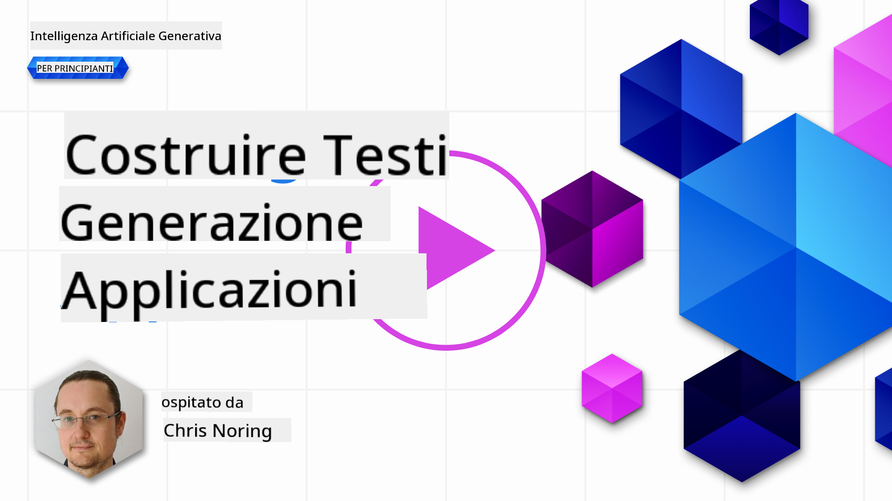

<!--
CO_OP_TRANSLATOR_METADATA:
{
  "original_hash": "5ec6c92b629564538ef397c550adb73e",
  "translation_date": "2025-05-19T16:53:31+00:00",
  "source_file": "06-text-generation-apps/README.md",
  "language_code": "it"
}
-->
# Creare applicazioni di generazione di testo

[](https://aka.ms/gen-ai-lesson6-gh?WT.mc_id=academic-105485-koreyst)

> _(Clicca sull'immagine sopra per visualizzare il video di questa lezione)_

Finora, attraverso questo curriculum, hai visto che ci sono concetti fondamentali come i prompt e persino un'intera disciplina chiamata "ingegneria dei prompt". Molti strumenti con cui puoi interagire, come ChatGPT, Office 365, Microsoft Power Platform e altri, ti supportano nell'utilizzo dei prompt per ottenere qualcosa.

Per aggiungere un'esperienza simile a un'app, devi comprendere concetti come prompt, completamenti e scegliere una libreria con cui lavorare. È esattamente ciò che imparerai in questo capitolo.

## Introduzione

In questo capitolo, imparerai a:

- Conoscere la libreria openai e i suoi concetti fondamentali.
- Creare un'app di generazione di testo utilizzando openai.
- Comprendere come utilizzare concetti come prompt, temperatura e token per costruire un'app di generazione di testo.

## Obiettivi di apprendimento

Alla fine di questa lezione, sarai in grado di:

- Spiegare cos'è un'app di generazione di testo.
- Creare un'app di generazione di testo utilizzando openai.
- Configurare la tua app per utilizzare più o meno token e anche modificare la temperatura, per ottenere risultati variati.

## Cos'è un'app di generazione di testo?

Normalmente, quando costruisci un'app, essa ha una sorta di interfaccia come la seguente:

- Basata su comandi. Le app console sono tipiche app in cui digiti un comando e svolgono un compito. Ad esempio, `git` è un'app basata su comandi.
- Interfaccia utente (UI). Alcune app hanno interfacce grafiche (GUI) dove clicchi su pulsanti, inserisci testo, selezioni opzioni e altro.

### Le app console e UI sono limitate

Confrontale con un'app basata su comandi dove digiti un comando:

- **È limitata**. Non puoi semplicemente digitare qualsiasi comando, solo quelli supportati dall'app.
- **Specifico per la lingua**. Alcune app supportano molte lingue, ma di default l'app è costruita per una lingua specifica, anche se puoi aggiungere supporto per altre lingue.

### Vantaggi delle app di generazione di testo

Quindi, in cosa è diversa un'app di generazione di testo?

In un'app di generazione di testo, hai più flessibilità, non sei limitato a un insieme di comandi o a una lingua di input specifica. Invece, puoi utilizzare il linguaggio naturale per interagire con l'app. Un altro vantaggio è che stai già interagendo con una fonte di dati che è stata addestrata su un vasto corpus di informazioni, mentre un'app tradizionale potrebbe essere limitata a ciò che è in un database.

### Cosa posso costruire con un'app di generazione di testo?

Ci sono molte cose che puoi costruire. Ad esempio:

- **Un chatbot**. Un chatbot che risponde a domande su argomenti, come la tua azienda e i suoi prodotti potrebbe essere una buona soluzione.
- **Aiutante**. Gli LLM sono ottimi per cose come riassumere testo, ottenere intuizioni dal testo, produrre testo come curriculum e altro.
- **Assistente al codice**. A seconda del modello di linguaggio che usi, puoi costruire un assistente al codice che ti aiuta a scrivere codice. Ad esempio, puoi utilizzare un prodotto come GitHub Copilot oltre a ChatGPT per aiutarti a scrivere codice.

## Come posso iniziare?

Beh, devi trovare un modo per integrarti con un LLM che di solito comporta le seguenti due approcci:

- Usare un'API. Qui stai costruendo richieste web con il tuo prompt e ottieni testo generato in risposta.
- Usare una libreria. Le librerie aiutano a incapsulare le chiamate API e renderle più facili da usare.

## Librerie/SDK

Ci sono alcune librerie ben conosciute per lavorare con gli LLM come:

- **openai**, questa libreria facilita la connessione al tuo modello e l'invio di prompt.

Poi ci sono librerie che operano a un livello superiore come:

- **Langchain**. Langchain è ben conosciuta e supporta Python.
- **Semantic Kernel**. Semantic Kernel è una libreria di Microsoft che supporta i linguaggi C#, Python e Java.

## Prima app utilizzando openai

Vediamo come possiamo costruire la nostra prima app, quali librerie sono necessarie, quanto è richiesto e così via.

### Installare openai

Ci sono molte librerie là fuori per interagire con OpenAI o Azure OpenAI. È possibile utilizzare numerosi linguaggi di programmazione come C#, Python, JavaScript, Java e altri. Abbiamo scelto di usare la libreria Python `openai`, quindi utilizzeremo `pip` per installarla.

```bash
pip install openai
```

### Creare una risorsa

Devi eseguire i seguenti passaggi:

- Creare un account su Azure [https://azure.microsoft.com/free/](https://azure.microsoft.com/free/?WT.mc_id=academic-105485-koreyst).
- Ottenere accesso a Azure OpenAI. Vai su [https://learn.microsoft.com/azure/ai-services/openai/overview#how-do-i-get-access-to-azure-openai](https://learn.microsoft.com/azure/ai-services/openai/overview#how-do-i-get-access-to-azure-openai?WT.mc_id=academic-105485-koreyst) e richiedi l'accesso.

  > [!NOTE]
  > Al momento della stesura, è necessario richiedere l'accesso a Azure OpenAI.

- Installare Python <https://www.python.org/>
- Avere creato una risorsa Azure OpenAI Service. Vedi questa guida su come [creare una risorsa](https://learn.microsoft.com/azure/ai-services/openai/how-to/create-resource?pivots=web-portal?WT.mc_id=academic-105485-koreyst).

### Trovare chiave API e endpoint

A questo punto, devi dire alla tua libreria `openai` quale chiave API utilizzare. Per trovare la tua chiave API, vai alla sezione "Keys and Endpoint" della tua risorsa Azure OpenAI e copia il valore "Key 1".


Ora che hai copiato queste informazioni, istruiamo le librerie a utilizzarle.

> [!NOTE]
> Vale la pena separare la tua chiave API dal tuo codice. Puoi farlo utilizzando variabili di ambiente.
>
> - Imposta la variabile di ambiente `OPENAI_API_KEY` to your API key.
>   `export OPENAI_API_KEY='sk-...'`

### Configurare Azure

Se stai usando Azure OpenAI, ecco come configurare:

```python
openai.api_type = 'azure'
openai.api_key = os.environ["OPENAI_API_KEY"]
openai.api_version = '2023-05-15'
openai.api_base = os.getenv("API_BASE")
```

Sopra stiamo impostando quanto segue:

- `api_type` to `azure`. This tells the library to use Azure OpenAI and not OpenAI.
- `api_key`, this is your API key found in the Azure Portal.
- `api_version`, this is the version of the API you want to use. At the time of writing, the latest version is `2023-05-15`.
- `api_base`, this is the endpoint of the API. You can find it in the Azure Portal next to your API key.

> [!NOTE] > `os.getenv` is a function that reads environment variables. You can use it to read environment variables like `OPENAI_API_KEY` and `API_BASE`. Set these environment variables in your terminal or by using a library like `dotenv`.

## Generate text

The way to generate text is to use the `Completion` class. Ecco un esempio:

```python
prompt = "Complete the following: Once upon a time there was a"

completion = openai.Completion.create(model="davinci-002", prompt=prompt)
print(completion.choices[0].text)
```

Nel codice sopra, creiamo un oggetto completion e passiamo il modello che vogliamo utilizzare e il prompt. Poi stampiamo il testo generato.

### Completamenti chat

Finora, hai visto come abbiamo utilizzato `Completion` to generate text. But there's another class called `ChatCompletion` che è più adatto per chatbot. Ecco un esempio di utilizzo:

```python
import openai

openai.api_key = "sk-..."

completion = openai.ChatCompletion.create(model="gpt-3.5-turbo", messages=[{"role": "user", "content": "Hello world"}])
print(completion.choices[0].message.content)
```

Più su questa funzionalità in un capitolo futuro.

## Esercizio - la tua prima app di generazione di testo

Ora che abbiamo imparato come configurare e configurare openai, è il momento di costruire la tua prima app di generazione di testo. Per costruire la tua app, segui questi passaggi:

1. Crea un ambiente virtuale e installa openai:

   ```bash
   python -m venv venv
   source venv/bin/activate
   pip install openai
   ```

   > [!NOTE]
   > Se stai usando Windows digita `venv\Scripts\activate` instead of `source venv/bin/activate`.

   > [!NOTE]
   > Locate your Azure OpenAI key by going to [https://portal.azure.com/](https://portal.azure.com/?WT.mc_id=academic-105485-koreyst) and search for `Open AI` and select the `Open AI resource` and then select `Keys and Endpoint` and copy the `Key 1` value.

1. Crea un file _app.py_ e inserisci il seguente codice:

   ```python
   import openai

   openai.api_key = "<replace this value with your open ai key or Azure OpenAI key>"

   openai.api_type = 'azure'
   openai.api_version = '2023-05-15'
   openai.api_base = "<endpoint found in Azure Portal where your API key is>"
   deployment_name = "<deployment name>"

   # add your completion code
   prompt = "Complete the following: Once upon a time there was a"
   messages = [{"role": "user", "content": prompt}]

   # make completion
   completion = openai.chat.completions.create(model=deployment_name, messages=messages)

   # print response
   print(completion.choices[0].message.content)
   ```

   > [!NOTE]
   > Se stai usando Azure OpenAI, devi impostare il `api_type` to `azure` and set the `api_key` alla tua chiave Azure OpenAI.

   Dovresti vedere un output simile al seguente:

   ```output
    very unhappy _____.

   Once upon a time there was a very unhappy mermaid.
   ```

## Tipi diversi di prompt, per cose diverse

Ora hai visto come generare testo usando un prompt. Hai persino un programma funzionante che puoi modificare e cambiare per generare diversi tipi di testo.

I prompt possono essere utilizzati per tutti i tipi di attività. Ad esempio:

- **Generare un tipo di testo**. Ad esempio, puoi generare una poesia, domande per un quiz ecc.
- **Cercare informazioni**. Puoi usare i prompt per cercare informazioni come il seguente esempio 'Cosa significa CORS nello sviluppo web?'.
- **Generare codice**. Puoi usare i prompt per generare codice, ad esempio sviluppando un'espressione regolare utilizzata per convalidare email o perché non generare un intero programma, come un'app web?

## Un caso d'uso più pratico: un generatore di ricette

Immagina di avere ingredienti a casa e vuoi cucinare qualcosa. Per farlo, hai bisogno di una ricetta. Un modo per trovare ricette è usare un motore di ricerca o potresti usare un LLM per farlo.

Potresti scrivere un prompt come segue:

> "Mostrami 5 ricette per un piatto con i seguenti ingredienti: pollo, patate e carote. Per ogni ricetta, elenca tutti gli ingredienti utilizzati"

Dato il prompt sopra, potresti ottenere una risposta simile a:

```output
1. Roasted Chicken and Vegetables:
Ingredients:
- 4 chicken thighs
- 2 potatoes, cut into cubes
- 2 carrots, cut into cubes
- 2 tablespoons olive oil
- 2 cloves garlic, minced
- 1 teaspoon dried thyme
- 1 teaspoon dried oregano
- Salt and pepper, to taste

2. Chicken and Potato Stew:
Ingredients:
- 2 tablespoons olive oil
- 1 onion, diced
- 2 cloves garlic, minced
- 2 chicken breasts, cut into cubes
- 2 potatoes, cut into cubes
- 2 carrots, cut into cubes
- 1 teaspoon dried oregano
- 1 teaspoon dried thyme
- 1 cup chicken broth
- Salt and pepper, to taste

3. Chicken and Potato Bake:
Ingredients:
- 2 tablespoons olive oil
- 2 chicken breasts, cut into cubes
- 2 potatoes, cut into cubes
- 2 carrots, cut into cubes
- 1 onion, diced
- 2 cloves garlic, minced
- 1 teaspoon dried oregano
- 1 teaspoon dried thyme
- 1 cup chicken broth
- Salt and pepper, to taste

4. Chicken and Potato Soup:
Ingredients:
- 2 tablespoons olive oil
- 1 onion, diced
- 2 cloves garlic, minced
- 2 chicken breasts, cut into cubes
- 2 potatoes, cut into cubes
- 2 carrots, cut into cubes
- 1 teaspoon dried oregano
- 1 teaspoon dried thyme
- 4 cups chicken broth
- Salt and pepper, to taste

5. Chicken and Potato Hash:
Ingredients:
- 2 tablespoons olive oil
- 2 chicken breasts, cut into cubes
- 2 potatoes, cut into cubes
- 2 carrots, cut into cubes
- 1 onion, diced
- 2 cloves garlic, minced
- 1 teaspoon dried oregano
```

Questo risultato è ottimo, so cosa cucinare. A questo punto, ciò che potrebbe essere utile migliorare sono:

- Filtrare gli ingredienti che non mi piacciono o a cui sono allergico.
- Produrre una lista della spesa, nel caso non abbia tutti gli ingredienti a casa.

Per i casi sopra, aggiungiamo un prompt aggiuntivo:

> "Per favore, rimuovi le ricette con aglio dato che sono allergico e sostituiscilo con qualcos'altro. Inoltre, per favore produci una lista della spesa per le ricette, considerando che ho già pollo, patate e carote a casa."

Ora hai un nuovo risultato, ovvero:

```output
1. Roasted Chicken and Vegetables:
Ingredients:
- 4 chicken thighs
- 2 potatoes, cut into cubes
- 2 carrots, cut into cubes
- 2 tablespoons olive oil
- 1 teaspoon dried thyme
- 1 teaspoon dried oregano
- Salt and pepper, to taste

2. Chicken and Potato Stew:
Ingredients:
- 2 tablespoons olive oil
- 1 onion, diced
- 2 chicken breasts, cut into cubes
- 2 potatoes, cut into cubes
- 2 carrots, cut into cubes
- 1 teaspoon dried oregano
- 1 teaspoon dried thyme
- 1 cup chicken broth
- Salt and pepper, to taste

3. Chicken and Potato Bake:
Ingredients:
- 2 tablespoons olive oil
- 2 chicken breasts, cut into cubes
- 2 potatoes, cut into cubes
- 2 carrots, cut into cubes
- 1 onion, diced
- 1 teaspoon dried oregano
- 1 teaspoon dried thyme
- 1 cup chicken broth
- Salt and pepper, to taste

4. Chicken and Potato Soup:
Ingredients:
- 2 tablespoons olive oil
- 1 onion, diced
- 2 chicken breasts, cut into cubes
- 2 potatoes, cut into cubes
- 2 carrots, cut into cubes
- 1 teaspoon dried oregano
- 1 teaspoon dried thyme
- 4 cups chicken broth
- Salt and pepper, to taste

5. Chicken and Potato Hash:
Ingredients:
- 2 tablespoons olive oil
- 2 chicken breasts, cut into cubes
- 2 potatoes, cut into cubes
- 2 carrots, cut into cubes
- 1 onion, diced
- 1 teaspoon dried oregano

Shopping List:
- Olive oil
- Onion
- Thyme
- Oregano
- Salt
- Pepper
```

Queste sono le tue cinque ricette, senza aglio menzionato e hai anche una lista della spesa considerando ciò che hai già a casa.

## Esercizio - costruire un generatore di ricette

Ora che abbiamo messo in scena uno scenario, scriviamo il codice per abbinare lo scenario dimostrato. Per farlo, segui questi passaggi:

1. Usa il file _app.py_ esistente come punto di partenza
1. Trova la variabile `prompt` e cambia il suo codice nel seguente:

   ```python
   prompt = "Show me 5 recipes for a dish with the following ingredients: chicken, potatoes, and carrots. Per recipe, list all the ingredients used"
   ```

   Se ora esegui il codice, dovresti vedere un output simile a:

   ```output
   -Chicken Stew with Potatoes and Carrots: 3 tablespoons oil, 1 onion, chopped, 2 cloves garlic, minced, 1 carrot, peeled and chopped, 1 potato, peeled and chopped, 1 bay leaf, 1 thyme sprig, 1/2 teaspoon salt, 1/4 teaspoon black pepper, 1 1/2 cups chicken broth, 1/2 cup dry white wine, 2 tablespoons chopped fresh parsley, 2 tablespoons unsalted butter, 1 1/2 pounds boneless, skinless chicken thighs, cut into 1-inch pieces
   -Oven-Roasted Chicken with Potatoes and Carrots: 3 tablespoons extra-virgin olive oil, 1 tablespoon Dijon mustard, 1 tablespoon chopped fresh rosemary, 1 tablespoon chopped fresh thyme, 4 cloves garlic, minced, 1 1/2 pounds small red potatoes, quartered, 1 1/2 pounds carrots, quartered lengthwise, 1/2 teaspoon salt, 1/4 teaspoon black pepper, 1 (4-pound) whole chicken
   -Chicken, Potato, and Carrot Casserole: cooking spray, 1 large onion, chopped, 2 cloves garlic, minced, 1 carrot, peeled and shredded, 1 potato, peeled and shredded, 1/2 teaspoon dried thyme leaves, 1/4 teaspoon salt, 1/4 teaspoon black pepper, 2 cups fat-free, low-sodium chicken broth, 1 cup frozen peas, 1/4 cup all-purpose flour, 1 cup 2% reduced-fat milk, 1/4 cup grated Parmesan cheese

   -One Pot Chicken and Potato Dinner: 2 tablespoons olive oil, 1 pound boneless, skinless chicken thighs, cut into 1-inch pieces, 1 large onion, chopped, 3 cloves garlic, minced, 1 carrot, peeled and chopped, 1 potato, peeled and chopped, 1 bay leaf, 1 thyme sprig, 1/2 teaspoon salt, 1/4 teaspoon black pepper, 2 cups chicken broth, 1/2 cup dry white wine

   -Chicken, Potato, and Carrot Curry: 1 tablespoon vegetable oil, 1 large onion, chopped, 2 cloves garlic, minced, 1 carrot, peeled and chopped, 1 potato, peeled and chopped, 1 teaspoon ground coriander, 1 teaspoon ground cumin, 1/2 teaspoon ground turmeric, 1/2 teaspoon ground ginger, 1/4 teaspoon cayenne pepper, 2 cups chicken broth, 1/2 cup dry white wine, 1 (15-ounce) can chickpeas, drained and rinsed, 1/2 cup raisins, 1/2 cup chopped fresh cilantro
   ```

   > NOTE, il tuo LLM è nondeterministico, quindi potresti ottenere risultati diversi ogni volta che esegui il programma.

   Ottimo, vediamo come possiamo migliorare le cose. Per migliorare le cose, vogliamo assicurarci che il codice sia flessibile, quindi gli ingredienti e il numero di ricette possono essere migliorati e cambiati.

1. Cambiamo il codice nel seguente modo:

   ```python
   no_recipes = input("No of recipes (for example, 5): ")

   ingredients = input("List of ingredients (for example, chicken, potatoes, and carrots): ")

   # interpolate the number of recipes into the prompt an ingredients
   prompt = f"Show me {no_recipes} recipes for a dish with the following ingredients: {ingredients}. Per recipe, list all the ingredients used"
   ```

   Prendere il codice per un test potrebbe apparire così:

   ```output
   No of recipes (for example, 5): 3
   List of ingredients (for example, chicken, potatoes, and carrots): milk,strawberries

   -Strawberry milk shake: milk, strawberries, sugar, vanilla extract, ice cubes
   -Strawberry shortcake: milk, flour, baking powder, sugar, salt, unsalted butter, strawberries, whipped cream
   -Strawberry milk: milk, strawberries, sugar, vanilla extract
   ```

### Migliorare aggiungendo filtro e lista della spesa

Ora abbiamo un'app funzionante in grado di produrre ricette ed è flessibile poiché si basa su input dell'utente, sia sul numero di ricette che sugli ingredienti utilizzati.

Per migliorarlo ulteriormente, vogliamo aggiungere quanto segue:

- **Filtrare gli ingredienti**. Vogliamo essere in grado di filtrare gli ingredienti che non ci piacciono o a cui siamo allergici. Per apportare questa modifica, possiamo modificare il nostro prompt esistente e aggiungere una condizione di filtro alla fine come segue:

  ```python
  filter = input("Filter (for example, vegetarian, vegan, or gluten-free): ")

  prompt = f"Show me {no_recipes} recipes for a dish with the following ingredients: {ingredients}. Per recipe, list all the ingredients used, no {filter}"
  ```

  Sopra, aggiungiamo `{filter}` alla fine del prompt e catturiamo anche il valore del filtro dall'utente.

  Un esempio di input di esecuzione del programma può ora apparire così:

  ```output
  No of recipes (for example, 5): 3
  List of ingredients (for example, chicken, potatoes, and carrots): onion,milk
  Filter (for example, vegetarian, vegan, or gluten-free): no milk

  1. French Onion Soup

  Ingredients:

  -1 large onion, sliced
  -3 cups beef broth
  -1 cup milk
  -6 slices french bread
  -1/4 cup shredded Parmesan cheese
  -1 tablespoon butter
  -1 teaspoon dried thyme
  -1/4 teaspoon salt
  -1/4 teaspoon black pepper

  Instructions:

  1. In a large pot, sauté onions in butter until golden brown.
  2. Add beef broth, milk, thyme, salt, and pepper. Bring to a boil.
  3. Reduce heat and simmer for 10 minutes.
  4. Place french bread slices on soup bowls.
  5. Ladle soup over bread.
  6. Sprinkle with Parmesan cheese.

  2. Onion and Potato Soup

  Ingredients:

  -1 large onion, chopped
  -2 cups potatoes, diced
  -3 cups vegetable broth
  -1 cup milk
  -1/4 teaspoon black pepper

  Instructions:

  1. In a large pot, sauté onions in butter until golden brown.
  2. Add potatoes, vegetable broth, milk, and pepper. Bring to a boil.
  3. Reduce heat and simmer for 10 minutes.
  4. Serve hot.

  3. Creamy Onion Soup

  Ingredients:

  -1 large onion, chopped
  -3 cups vegetable broth
  -1 cup milk
  -1/4 teaspoon black pepper
  -1/4 cup all-purpose flour
  -1/2 cup shredded Parmesan cheese

  Instructions:

  1. In a large pot, sauté onions in butter until golden brown.
  2. Add vegetable broth, milk, and pepper. Bring to a boil.
  3. Reduce heat and simmer for 10 minutes.
  4. In a small bowl, whisk together flour and Parmesan cheese until smooth.
  5. Add to soup and simmer for an additional 5 minutes, or until soup has thickened.
  ```

  Come puoi vedere, tutte le ricette con latte sono state filtrate. Ma, se sei intollerante al lattosio, potresti voler filtrare anche le ricette con formaggio, quindi c'è bisogno di essere chiari.

- **Produrre una lista della spesa**. Vogliamo produrre una lista della spesa, considerando ciò che abbiamo già a casa.

  Per questa funzionalità, potremmo provare a risolvere tutto in un unico prompt o potremmo dividerlo in due prompt. Proviamo l'approccio successivo. Qui stiamo suggerendo di aggiungere un prompt aggiuntivo, ma affinché funzioni, dobbiamo aggiungere il risultato del primo prompt come contesto al secondo prompt.

  Trova la parte nel codice che stampa il risultato del primo prompt e aggiungi il seguente codice sotto:

  ```python
  old_prompt_result = completion.choices[0].message.content
  prompt = "Produce a shopping list for the generated recipes and please don't include ingredients that I already have."

  new_prompt = f"{old_prompt_result} {prompt}"
  messages = [{"role": "user", "content": new_prompt}]
  completion = openai.Completion.create(engine=deployment_name, messages=messages, max_tokens=1200)

  # print response
  print("Shopping list:")
  print(completion.choices[0].message.content)
  ```

  Nota quanto segue:

  1. Stiamo costruendo un nuovo prompt aggiungendo il risultato del primo prompt al nuovo prompt:

     ```python
     new_prompt = f"{old_prompt_result} {prompt}"
     ```

  1. Facciamo una nuova richiesta, ma considerando anche il numero di token che abbiamo chiesto nel primo prompt, quindi questa volta diciamo che `max_tokens` è 1200.

     ```python
     completion = openai.Completion.create(engine=deployment_name, prompt=new_prompt, max_tokens=1200)
     ```

     Prendendo questo codice per una prova, ora arriviamo al seguente output:

     ```output
     No of recipes (for example, 5): 2
     List of ingredients (for example, chicken, potatoes, and carrots): apple,flour
     Filter (for example, vegetarian, vegan, or gluten-free): sugar


     -Apple and flour pancakes: 1 cup flour, 1/2 tsp baking powder, 1/2 tsp baking soda, 1/4 tsp salt, 1 tbsp sugar, 1 egg, 1 cup buttermilk or sour milk, 1/4 cup melted butter, 1 Granny Smith apple, peeled and grated
     -Apple fritters: 1-1/2 cups flour, 1 tsp baking powder, 1/4 tsp salt, 1/4 tsp baking soda, 1/4 tsp nutmeg, 1/4 tsp cinnamon, 1/4 tsp allspice, 1/4 cup sugar, 1/4 cup vegetable shortening, 1/4 cup milk, 1 egg, 2 cups shredded, peeled apples
     Shopping list:
     -Flour, baking powder, baking soda, salt, sugar, egg, buttermilk, butter, apple, nutmeg, cinnamon, allspice
     ```

## Migliora il tuo setup

Quello che abbiamo finora è un codice che funziona, ma ci sono alcuni aggiustamenti che dovremmo fare per migliorare ulteriormente le cose. Alcune cose che dovremmo fare sono:

- **Separare i segreti dal codice**, come la chiave API. I segreti non appartengono al codice e dovrebbero essere archiviati in un luogo sicuro. Per separare i segreti dal codice, possiamo usare variabili di ambiente e librerie come `python-dotenv` to load them from a file. Here's how that would look like in code:

  1. Create a `.env` file con il seguente contenuto:

     ```bash
     OPENAI_API_KEY=sk-...
     ```

     > Nota, per Azure, devi impostare le seguenti variabili di ambiente:

     ```bash
     OPENAI_API_TYPE=azure
     OPENAI_API_VERSION=2023-05-15
     OPENAI_API_BASE=<replace>
     ```

     Nel codice, caricheresti le variabili di ambiente come segue:

     ```python
     from dotenv import load_dotenv

     load_dotenv()

     openai.api_key = os.environ["OPENAI_API_KEY"]
     ```

- **Una parola sulla lunghezza dei token**. Dovremmo considerare quanti token abbiamo bisogno per generare il testo che vogliamo. I token costano denaro, quindi dove possibile, dovremmo cercare di essere economici con il numero di token che usiamo. Ad esempio, possiamo formulare il prompt in modo da poter usare meno token?

  Per modificare i token utilizzati, puoi usare il parametro `max_tokens`. Ad esempio, se vuoi usare 100 token, faresti:

  ```python
  completion = client.chat.completions.create(model=deployment, messages=messages, max_tokens=100)
  ```

- **Sperimentare con la temperatura**. La temperatura è qualcosa che non abbiamo menzionato finora ma è un contesto importante per come il nostro programma si comporta. Più alto è il valore della temperatura, più casuale sarà l'output. Al contrario, più basso è il valore della temperatura, più prevedibile sarà l'output. Considera se vuoi variazione nel tuo output o meno.

  Per modificare la temperatura, puoi usare il parametro `temperature`. Ad esempio, se vuoi usare una temperatura di 0.5, faresti:

  ```python
  completion = client.chat.completions.create(model=deployment, messages=messages, temperature=0.5)
  ```

  > Nota, più vicino a 1.0, più variato sarà l'output.

## Compito

Per questo compito, puoi scegliere cosa costruire.

Ecco alcuni suggerimenti:

- Modifica l'app generatore di ricette per migliorarla ulteriormente. Gioca con i valori di temperatura e i prompt per vedere cosa riesci a ottenere.
- Costruisci un "compagno di studio". Questa app dovrebbe essere in grado di rispondere a domande su un argomento, ad esempio Python, potresti avere prompt come "Cos'è un certo argomento in Python?", o potresti avere un prompt che dice, mostrami il codice per un certo argomento ecc.
- Bot storico, fai rivivere la storia, istruisci il bot a interpretare un certo personaggio storico e chiedigli domande sulla sua vita e sui suoi tempi.

## Soluzione

### Compagno di studio

Di seguito è riportato un prompt iniziale, vedi come puoi usarlo e modificarlo a tuo piacimento.

```text
- "You're an expert on the Python language

    Suggest a beginner lesson for Python in the following format:

    Format:
    - concepts:
    - brief explanation of the lesson:
    - exercise in code with solutions"
```

### Bot storico

Ecco alcuni prompt che potresti usare:

```text
- "You are Abe Lincoln, tell me about yourself in 3 sentences, and respond using grammar and words like Abe would have used"
- "You are Abe Lincoln, respond using grammar and words like Abe would have used:

   Tell me about your greatest accomplishments, in 300 words"
```

## Verifica della conoscenza

Cosa fa il concetto di temperatura?

1. Controlla quanto è casuale l'output.
1. Controlla quanto grande è la risposta.
1. Controlla quanti token vengono utilizzati.

## 🚀 Sfida

Quando lavori al compito, prova a variare la temperatura, prova a impostarla su 0, 0.5 e 1. Ricorda che 0 è il meno variato e 1 è il più variato, quale valore funziona meglio per la tua app?

## Ottimo lavoro! Continua

**Disclaimer**:  
Questo documento è stato tradotto utilizzando il servizio di traduzione automatica [Co-op Translator](https://github.com/Azure/co-op-translator). Anche se ci impegniamo per l'accuratezza, si prega di essere consapevoli che le traduzioni automatiche possono contenere errori o imprecisioni. Il documento originale nella sua lingua madre dovrebbe essere considerato la fonte autorevole. Per informazioni critiche, si consiglia la traduzione umana professionale. Non siamo responsabili per eventuali incomprensioni o interpretazioni errate derivanti dall'uso di questa traduzione.