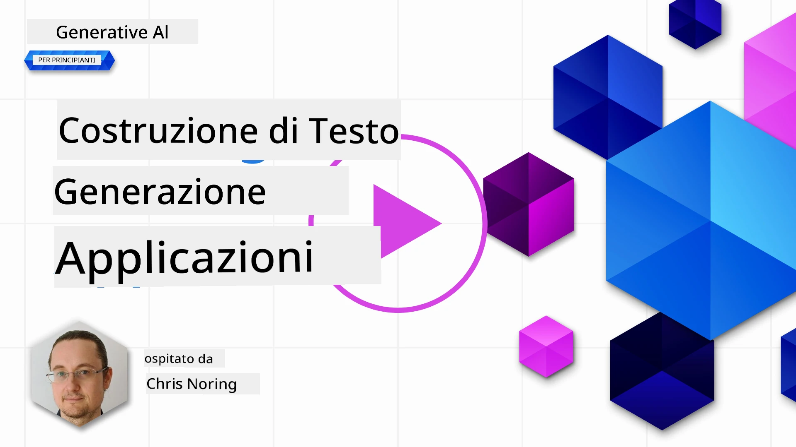

# Costruire applicazioni di generazione di testo

[](https://youtu.be/0Y5Luf5sRQA?si=t_xVg0clnAI4oUFZ)

> _(Clicca sull'immagine sopra per vedere il video di questa lezione)_

Finora in questo curriculum hai visto che ci sono concetti fondamentali come i prompt e anche un'intera disciplina chiamata "prompt engineering". Molti strumenti con cui puoi interagire, come ChatGPT, Office 365, Microsoft Power Platform e altri, supportano l'uso di prompt per portare a termine qualcosa.

Per aggiungere tale esperienza a una app, devi comprendere concetti come prompt, completamenti e scegliere una libreria con cui lavorare. È esattamente ciò che imparerai in questo capitolo.

## Introduzione

In questo capitolo, imparerai a:

- Conoscere la libreria openai e i suoi concetti fondamentali.
- Costruire un'app per la generazione di testo usando openai.
- Capire come usare concetti come prompt, temperature e token per costruire un'app di generazione di testo.

## Obiettivi di apprendimento

Al termine di questa lezione, sarai in grado di:

- Spiegare cos'è un'app di generazione di testo.
- Costruire un'app di generazione di testo usando openai.
- Configurare la tua app per usare più o meno token e anche cambiare la temperatura, per un output vario.

## Cos'è un'app di generazione di testo?

Normalmente quando costruisci un'app ha una qualche sorta di interfaccia come la seguente:

- Basata su comandi. Le app da console sono tipiche app dove digiti un comando e viene eseguito un compito. Per esempio, `git` è un'app basata su comandi.
- Interfaccia utente (UI). Alcune app hanno interfacce grafiche (GUI) dove clicchi pulsanti, inserisci testo, selezioni opzioni e altro.

### Le app da console e le app GUI sono limitate

Confrontale con un'app basata su comandi dove digiti un comando:

- **È limitata**. Non puoi digitare qualsiasi comando, solo quelli che l'app supporta.
- **Specifico del linguaggio**. Alcune app supportano molte lingue, però per impostazione predefinita l'app è costruita per un linguaggio specifico, anche se puoi aggiungere supporto per più lingue.

### Vantaggi delle app di generazione di testo

Come sono diverse allora le app di generazione di testo?

In un'app di generazione di testo, hai più flessibilità, non sei limitato a una serie di comandi o a un linguaggio di input specifico. Puoi invece usare il linguaggio naturale per interagire con l'app. Un altro vantaggio è che stai già interagendo con una fonte di dati che è stata addestrata su un vasto corpus di informazioni, mentre un'app tradizionale potrebbe essere limitata a ciò che è in un database.

### Cosa posso costruire con un'app di generazione di testo?

Ci sono molte cose che puoi costruire. Per esempio:

- **Un chatbot**. Un chatbot che risponde a domande su argomenti, come la tua azienda e i suoi prodotti, potrebbe essere una buona soluzione.
- **Assistente**. Gli LLM sono ottimi per cose come riassumere testo, ottenere informazioni da testo, produrre testo come CV e altro.
- **Assistente codice**. A seconda del modello di linguaggio che usi, puoi costruire un assistente codice che ti aiuti a scrivere codice. Per esempio, puoi usare prodotti come GitHub Copilot così come ChatGPT per aiutarti a scrivere codice.

## Come posso iniziare?

Bene, devi trovare un modo per integrare un LLM che solitamente comporta i seguenti due approcci:

- Usare un'API. Qui costruisci richieste web con il tuo prompt e ricevi il testo generato in risposta.
- Usare una libreria. Le librerie aiutano a incapsulare le chiamate API e renderle più semplici da usare.

## Librerie/SDK

Ci sono alcune librerie ben note per lavorare con LLM come:

- **openai**, questa libreria rende facile connettersi al tuo modello e inviare prompt.

Poi ci sono librerie che operano a un livello più alto come:

- **Langchain**. Langchain è ben noto e supporta Python.
- **Semantic Kernel**. Semantic Kernel è una libreria di Microsoft che supporta i linguaggi C#, Python e Java.

## Prima app usando openai

Vediamo come possiamo costruire la nostra prima app, quali librerie ci servono, quanto è richiesto e così via.

### Installa openai

Ci sono molte librerie per interagire con OpenAI o Azure OpenAI. È possibile usare molti linguaggi di programmazione come C#, Python, JavaScript, Java e altri. Abbiamo scelto di usare la libreria Python `openai`, quindi useremo `pip` per installarla.

```bash
pip install openai
```

### Crea una risorsa

Devi eseguire i seguenti passaggi:

- Crea un account su Azure [https://azure.microsoft.com/free/](https://azure.microsoft.com/free/?WT.mc_id=academic-105485-koreyst).
- Ottieni accesso ad Azure OpenAI. Vai su [https://learn.microsoft.com/azure/ai-foundry/openai/overview#how-do-i-get-access-to-azure-openai](https://learn.microsoft.com/azure/ai-foundry/openai/overview#how-do-i-get-access-to-azure-openai?WT.mc_id=academic-105485-koreyst) e richiedi l'accesso.

  > [!NOTE]
  > Al momento della stesura, devi fare richiesta per avere accesso ad Azure OpenAI.

- Installa Python <https://www.python.org/>
- Hai creato una risorsa Azure OpenAI Service. Vedi questa guida su come [creare una risorsa](https://learn.microsoft.com/azure/ai-foundry/openai/how-to/create-resource?pivots=web-portal?WT.mc_id=academic-105485-koreyst).

### Trova chiave API e endpoint

A questo punto devi indicare alla libreria `openai` quale chiave API usare. Per trovare la tua chiave API, vai alla sezione "Keys and Endpoint" della tua risorsa Azure OpenAI e copia il valore "Key 1".


Ora che hai copiato queste informazioni, istruiamo le librerie a usarle.

> [!NOTE]
> Vale la pena separare la tua chiave API dal codice. Puoi farlo usando variabili d'ambiente.
>
> - Imposta la variabile d'ambiente `OPENAI_API_KEY` con la tua chiave API.
>   `export OPENAI_API_KEY='sk-...'`

### Configurazione Azure

Se stai usando Azure OpenAI (ora parte di Microsoft Foundry), ecco come configurare. Usiamo il client standard `OpenAI` puntato all'endpoint Azure OpenAI `/openai/v1/`, che funziona con l'API Responses e non ha bisogno di `api_version`:

```python
import os
from openai import OpenAI

client = OpenAI(
    api_key=os.environ["AZURE_OPENAI_API_KEY"],
    base_url=f"{os.environ['AZURE_OPENAI_ENDPOINT'].rstrip('/')}/openai/v1/",
)
```

Sopra stiamo impostando quanto segue:

- `api_key`, questa è la tua chiave API trovata nel portale Azure o portale Microsoft Foundry.
- `base_url`, questo è l'endpoint della tua risorsa Foundry con `/openai/v1/` aggiunto. L'endpoint stabile v1 funziona sia con OpenAI che con Azure OpenAI senza gestione `api_version`.

> [!NOTE] > `os.environ` legge le variabili d'ambiente. Puoi usarlo per leggere variabili come `AZURE_OPENAI_API_KEY` e `AZURE_OPENAI_ENDPOINT`. Imposta queste variabili nel terminale o usando una libreria come `dotenv`.

## Generare testo

Il modo per generare testo è usare l'API Responses tramite il metodo `responses.create`. Ecco un esempio:

```python
prompt = "Complete the following: Once upon a time there was a"

response = client.responses.create(
    model="gpt-5-mini",  # questo è il nome del tuo modello di deployment
    input=prompt,
    store=False,
)
print(response.output_text)
```

Nel codice sopra, creiamo una risposta e passiamo il modello che vogliamo usare e il prompt. Poi stampiamo il testo generato tramite `response.output_text`.

### Conversazioni multi-turno

L'API Responses è adatta sia per generazione di testo a turno singolo che per chatbot a turni multipli - fornisci una lista di messaggi in `input` per costruire una conversazione:

```python
from openai import OpenAI

client = OpenAI(api_key="sk-...")

response = client.responses.create(model="gpt-5-mini", input="Hello world", store=False)
print(response.output_text)
```

Maggiori dettagli su questa funzionalità in un capitolo futuro.

## Esercizio - la tua prima app di generazione di testo

Ora che abbiamo imparato come configurare e impostare openai, è tempo di costruire la tua prima app di generazione di testo. Per costruire la tua app, segui questi passaggi:

1. Crea un ambiente virtuale e installa openai:

   ```bash
   python -m venv venv
   source venv/bin/activate
   pip install openai
   ```

   > [!NOTE]
   > Se usi Windows digita `venv\Scripts\activate` invece di `source venv/bin/activate`.

   > [!NOTE]
   > Trova la tua chiave Azure OpenAI andando su [https://portal.azure.com/](https://portal.azure.com/?WT.mc_id=academic-105485-koreyst), cerca `Open AI`, seleziona la risorsa `Open AI` e poi seleziona `Keys and Endpoint` e copia il valore `Key 1`.

1. Crea un file _app.py_ e inserisci il seguente codice:

   ```python
   import os
   from openai import OpenAI

   client = OpenAI(
       api_key="<replace this value with your Azure OpenAI key>",
       base_url="<endpoint found in Azure Portal>/openai/v1/",
   )
   deployment_name = "<deployment name>"

   # aggiungi il tuo codice di completamento
   prompt = "Complete the following: Once upon a time there was a"

   # fai una richiesta usando l'API delle Risposte
   response = client.responses.create(model=deployment_name, input=prompt, store=False)

   # stampa la risposta
   print(response.output_text)
   ```

   > [!NOTE]
   > Se usi il semplice OpenAI (non Azure), usa `client = OpenAI(api_key="<replace this value with your OpenAI key>")` (senza `base_url`) e passa un nome modello come `gpt-5-mini` invece di un nome di deployment.

   Dovresti vedere un output simile al seguente:

   ```output
    very unhappy _____.

   Once upon a time there was a very unhappy mermaid.
   ```

## Tipi diversi di prompt, per cose diverse

Ora hai visto come generare testo usando un prompt. Hai anche un programma funzionante che puoi modificare e cambiare per generare tipi diversi di testo.

I prompt possono essere usati per tutti i tipi di compiti. Per esempio:

- **Generare un tipo di testo**. Per esempio, puoi generare una poesia, domande per un quiz ecc.
- **Cercare informazioni**. Puoi usare i prompt per cercare informazioni come nell'esempio 'Cosa significa CORS nello sviluppo web?'.
- **Generare codice**. Puoi usare i prompt per generare codice, per esempio sviluppare una espressione regolare usata per validare email o perché no generare un intero programma, come una web app?

## Un caso d'uso più pratico: un generatore di ricette

Immagina di avere ingredienti a casa e vuoi cucinare qualcosa. Per questo, ti serve una ricetta. Un modo per trovare ricette è usare un motore di ricerca oppure potresti usare un LLM per farlo.

Potresti scrivere un prompt così:

> "Mostrami 5 ricette per un piatto con i seguenti ingredienti: pollo, patate e carote. Per ogni ricetta, elenca tutti gli ingredienti usati"

Dato il prompt sopra potresti ricevere una risposta simile a:

```output
1. Roasted Chicken and Vegetables:
Ingredients:
- 4 chicken thighs
- 2 potatoes, cut into cubes
- 2 carrots, cut into cubes
- 2 tablespoons olive oil
- 2 cloves garlic, minced
- 1 teaspoon dried thyme
- 1 teaspoon dried oregano
- Salt and pepper, to taste

2. Chicken and Potato Stew:
Ingredients:
- 2 tablespoons olive oil
- 1 onion, diced
- 2 cloves garlic, minced
- 2 chicken breasts, cut into cubes
- 2 potatoes, cut into cubes
- 2 carrots, cut into cubes
- 1 teaspoon dried oregano
- 1 teaspoon dried thyme
- 1 cup chicken broth
- Salt and pepper, to taste

3. Chicken and Potato Bake:
Ingredients:
- 2 tablespoons olive oil
- 2 chicken breasts, cut into cubes
- 2 potatoes, cut into cubes
- 2 carrots, cut into cubes
- 1 onion, diced
- 2 cloves garlic, minced
- 1 teaspoon dried oregano
- 1 teaspoon dried thyme
- 1 cup chicken broth
- Salt and pepper, to taste

4. Chicken and Potato Soup:
Ingredients:
- 2 tablespoons olive oil
- 1 onion, diced
- 2 cloves garlic, minced
- 2 chicken breasts, cut into cubes
- 2 potatoes, cut into cubes
- 2 carrots, cut into cubes
- 1 teaspoon dried oregano
- 1 teaspoon dried thyme
- 4 cups chicken broth
- Salt and pepper, to taste

5. Chicken and Potato Hash:
Ingredients:
- 2 tablespoons olive oil
- 2 chicken breasts, cut into cubes
- 2 potatoes, cut into cubes
- 2 carrots, cut into cubes
- 1 onion, diced
- 2 cloves garlic, minced
- 1 teaspoon dried oregano
```

Questo risultato è ottimo, so cosa cucinare. A questo punto, miglioramenti utili potrebbero essere:

- Filtrare gli ingredienti che non mi piacciono o a cui sono allergico.
- Produrre una lista della spesa, nel caso in cui non abbia tutti gli ingredienti a casa.

Per i casi sopra, aggiungiamo un prompt addizionale:

> "Per favore rimuovi le ricette con aglio perché sono allergico e sostituiscile con altro. Inoltre, per favore produci una lista della spesa per le ricette, considerando che ho già pollo, patate e carote a casa."

Ora hai un nuovo risultato, ossia:

```output
1. Roasted Chicken and Vegetables:
Ingredients:
- 4 chicken thighs
- 2 potatoes, cut into cubes
- 2 carrots, cut into cubes
- 2 tablespoons olive oil
- 1 teaspoon dried thyme
- 1 teaspoon dried oregano
- Salt and pepper, to taste

2. Chicken and Potato Stew:
Ingredients:
- 2 tablespoons olive oil
- 1 onion, diced
- 2 chicken breasts, cut into cubes
- 2 potatoes, cut into cubes
- 2 carrots, cut into cubes
- 1 teaspoon dried oregano
- 1 teaspoon dried thyme
- 1 cup chicken broth
- Salt and pepper, to taste

3. Chicken and Potato Bake:
Ingredients:
- 2 tablespoons olive oil
- 2 chicken breasts, cut into cubes
- 2 potatoes, cut into cubes
- 2 carrots, cut into cubes
- 1 onion, diced
- 1 teaspoon dried oregano
- 1 teaspoon dried thyme
- 1 cup chicken broth
- Salt and pepper, to taste

4. Chicken and Potato Soup:
Ingredients:
- 2 tablespoons olive oil
- 1 onion, diced
- 2 chicken breasts, cut into cubes
- 2 potatoes, cut into cubes
- 2 carrots, cut into cubes
- 1 teaspoon dried oregano
- 1 teaspoon dried thyme
- 4 cups chicken broth
- Salt and pepper, to taste

5. Chicken and Potato Hash:
Ingredients:
- 2 tablespoons olive oil
- 2 chicken breasts, cut into cubes
- 2 potatoes, cut into cubes
- 2 carrots, cut into cubes
- 1 onion, diced
- 1 teaspoon dried oregano

Shopping List:
- Olive oil
- Onion
- Thyme
- Oregano
- Salt
- Pepper
```

Queste sono le tue cinque ricette, senza aglio menzionato e hai anche una lista della spesa considerando ciò che hai già a casa.

## Esercizio - costruire un generatore di ricette

Ora che abbiamo simulato uno scenario, scriviamo il codice per corrispondere allo scenario dimostrato. Per farlo, segui questi passaggi:

1. Usa il file _app.py_ esistente come punto di partenza
1. Trova la variabile `prompt` e cambia il suo codice come segue:

   ```python
   prompt = "Show me 5 recipes for a dish with the following ingredients: chicken, potatoes, and carrots. Per recipe, list all the ingredients used"
   ```

   Se esegui ora il codice, dovresti vedere un output simile a:

   ```output
   -Chicken Stew with Potatoes and Carrots: 3 tablespoons oil, 1 onion, chopped, 2 cloves garlic, minced, 1 carrot, peeled and chopped, 1 potato, peeled and chopped, 1 bay leaf, 1 thyme sprig, 1/2 teaspoon salt, 1/4 teaspoon black pepper, 1 1/2 cups chicken broth, 1/2 cup dry white wine, 2 tablespoons chopped fresh parsley, 2 tablespoons unsalted butter, 1 1/2 pounds boneless, skinless chicken thighs, cut into 1-inch pieces
   -Oven-Roasted Chicken with Potatoes and Carrots: 3 tablespoons extra-virgin olive oil, 1 tablespoon Dijon mustard, 1 tablespoon chopped fresh rosemary, 1 tablespoon chopped fresh thyme, 4 cloves garlic, minced, 1 1/2 pounds small red potatoes, quartered, 1 1/2 pounds carrots, quartered lengthwise, 1/2 teaspoon salt, 1/4 teaspoon black pepper, 1 (4-pound) whole chicken
   -Chicken, Potato, and Carrot Casserole: cooking spray, 1 large onion, chopped, 2 cloves garlic, minced, 1 carrot, peeled and shredded, 1 potato, peeled and shredded, 1/2 teaspoon dried thyme leaves, 1/4 teaspoon salt, 1/4 teaspoon black pepper, 2 cups fat-free, low-sodium chicken broth, 1 cup frozen peas, 1/4 cup all-purpose flour, 1 cup 2% reduced-fat milk, 1/4 cup grated Parmesan cheese

   -One Pot Chicken and Potato Dinner: 2 tablespoons olive oil, 1 pound boneless, skinless chicken thighs, cut into 1-inch pieces, 1 large onion, chopped, 3 cloves garlic, minced, 1 carrot, peeled and chopped, 1 potato, peeled and chopped, 1 bay leaf, 1 thyme sprig, 1/2 teaspoon salt, 1/4 teaspoon black pepper, 2 cups chicken broth, 1/2 cup dry white wine

   -Chicken, Potato, and Carrot Curry: 1 tablespoon vegetable oil, 1 large onion, chopped, 2 cloves garlic, minced, 1 carrot, peeled and chopped, 1 potato, peeled and chopped, 1 teaspoon ground coriander, 1 teaspoon ground cumin, 1/2 teaspoon ground turmeric, 1/2 teaspoon ground ginger, 1/4 teaspoon cayenne pepper, 2 cups chicken broth, 1/2 cup dry white wine, 1 (15-ounce) can chickpeas, drained and rinsed, 1/2 cup raisins, 1/2 cup chopped fresh cilantro
   ```

   > NOTA, il tuo LLM è nondeterministico, quindi potresti ottenere risultati diversi ogni volta che esegui il programma.

   Ottimo, vediamo come possiamo migliorare le cose. Per migliorare vogliamo garantire che il codice sia flessibile, così ingredienti e numero di ricette possono essere modificati e cambiati.

1. Cambiamo il codice nel modo seguente:

   ```python
   no_recipes = input("No of recipes (for example, 5): ")

   ingredients = input("List of ingredients (for example, chicken, potatoes, and carrots): ")

   # interpolare il numero di ricette nel prompt e negli ingredienti
   prompt = f"Show me {no_recipes} recipes for a dish with the following ingredients: {ingredients}. Per recipe, list all the ingredients used"
   ```

   Eseguire un test del codice potrebbe essere così:

   ```output
   No of recipes (for example, 5): 3
   List of ingredients (for example, chicken, potatoes, and carrots): milk,strawberries

   -Strawberry milk shake: milk, strawberries, sugar, vanilla extract, ice cubes
   -Strawberry shortcake: milk, flour, baking powder, sugar, salt, unsalted butter, strawberries, whipped cream
   -Strawberry milk: milk, strawberries, sugar, vanilla extract
   ```

### Migliorare aggiungendo filtro e lista della spesa

Ora abbiamo un'app funzionante capace di produrre ricette ed è flessibile perché si basa su input dell'utente, sia sul numero di ricette sia sugli ingredienti usati.

Per migliorare ulteriormente, vogliamo aggiungere quanto segue:

- **Filtrare ingredienti**. Vogliamo poter filtrare ingredienti che non ci piacciono o a cui siamo allergici. Per realizzare questa modifica, possiamo modificare il nostro prompt esistente aggiungendo una condizione di filtro alla fine come segue:

  ```python
  filter = input("Filter (for example, vegetarian, vegan, or gluten-free): ")

  prompt = f"Show me {no_recipes} recipes for a dish with the following ingredients: {ingredients}. Per recipe, list all the ingredients used, no {filter}"
  ```

  Sopra, aggiungiamo `{filter}` alla fine del prompt e catturiamo anche il valore filtro dall'utente.

  Un esempio di input eseguendo il programma può ora apparire così:

  ```output
  No of recipes (for example, 5): 3
  List of ingredients (for example, chicken, potatoes, and carrots): onion,milk
  Filter (for example, vegetarian, vegan, or gluten-free): no milk

  1. French Onion Soup

  Ingredients:

  -1 large onion, sliced
  -3 cups beef broth
  -1 cup milk
  -6 slices french bread
  -1/4 cup shredded Parmesan cheese
  -1 tablespoon butter
  -1 teaspoon dried thyme
  -1/4 teaspoon salt
  -1/4 teaspoon black pepper

  Instructions:

  1. In a large pot, sauté onions in butter until golden brown.
  2. Add beef broth, milk, thyme, salt, and pepper. Bring to a boil.
  3. Reduce heat and simmer for 10 minutes.
  4. Place french bread slices on soup bowls.
  5. Ladle soup over bread.
  6. Sprinkle with Parmesan cheese.

  2. Onion and Potato Soup

  Ingredients:

  -1 large onion, chopped
  -2 cups potatoes, diced
  -3 cups vegetable broth
  -1 cup milk
  -1/4 teaspoon black pepper

  Instructions:

  1. In a large pot, sauté onions in butter until golden brown.
  2. Add potatoes, vegetable broth, milk, and pepper. Bring to a boil.
  3. Reduce heat and simmer for 10 minutes.
  4. Serve hot.

  3. Creamy Onion Soup

  Ingredients:

  -1 large onion, chopped
  -3 cups vegetable broth
  -1 cup milk
  -1/4 teaspoon black pepper
  -1/4 cup all-purpose flour
  -1/2 cup shredded Parmesan cheese

  Instructions:

  1. In a large pot, sauté onions in butter until golden brown.
  2. Add vegetable broth, milk, and pepper. Bring to a boil.
  3. Reduce heat and simmer for 10 minutes.
  4. In a small bowl, whisk together flour and Parmesan cheese until smooth.
  5. Add to soup and simmer for an additional 5 minutes, or until soup has thickened.
  ```

  Come puoi vedere, tutte le ricette con latte sono state filtrate. Ma, se sei intollerante al lattosio, potresti voler filtrare anche ricette con formaggio, quindi è necessario essere chiari.


- **Produci una lista della spesa**. Vogliamo produrre una lista della spesa, considerando cosa abbiamo già a casa.

  Per questa funzionalità, potremmo provare a risolvere tutto in un unico prompt oppure potremmo suddividerlo in due prompt. Proviamo quest'ultimo approccio. Qui suggeriamo di aggiungere un prompt aggiuntivo, ma affinché funzioni, dobbiamo aggiungere il risultato del primo prompt come contesto per il secondo prompt.

  Individua la parte nel codice che stampa il risultato del primo prompt e aggiungi il codice seguente sotto:

  ```python
  old_prompt_result = response.output_text
  prompt = "Produce a shopping list for the generated recipes and please don't include ingredients that I already have."

  new_prompt = f"{old_prompt_result} {prompt}"
  response = client.responses.create(model=deployment_name, input=new_prompt, max_output_tokens=1200, store=False)

  # stampa la risposta
  print("Shopping list:")
  print(response.output_text)
  ```

  Nota quanto segue:

  1. Stiamo costruendo un nuovo prompt aggiungendo il risultato del primo prompt al nuovo prompt:

     ```python
     new_prompt = f"{old_prompt_result} {prompt}"
     ```

  1. Facciamo una nuova richiesta, considerando anche il numero di token richiesti nel primo prompt, quindi questa volta impostiamo `max_output_tokens` a 1200.

     ```python
     response = client.responses.create(model=deployment_name, input=new_prompt, max_output_tokens=1200, store=False)
     ```

     Provando questo codice, ora otteniamo il seguente output:

     ```output
     No of recipes (for example, 5): 2
     List of ingredients (for example, chicken, potatoes, and carrots): apple,flour
     Filter (for example, vegetarian, vegan, or gluten-free): sugar


     -Apple and flour pancakes: 1 cup flour, 1/2 tsp baking powder, 1/2 tsp baking soda, 1/4 tsp salt, 1 tbsp sugar, 1 egg, 1 cup buttermilk or sour milk, 1/4 cup melted butter, 1 Granny Smith apple, peeled and grated
     -Apple fritters: 1-1/2 cups flour, 1 tsp baking powder, 1/4 tsp salt, 1/4 tsp baking soda, 1/4 tsp nutmeg, 1/4 tsp cinnamon, 1/4 tsp allspice, 1/4 cup sugar, 1/4 cup vegetable shortening, 1/4 cup milk, 1 egg, 2 cups shredded, peeled apples
     Shopping list:
     -Flour, baking powder, baking soda, salt, sugar, egg, buttermilk, butter, apple, nutmeg, cinnamon, allspice
     ```

## Migliora la tua configurazione

Ciò che abbiamo finora è un codice funzionante, ma ci sono alcune modifiche che dovremmo fare per migliorare ulteriormente le cose. Alcune cose da fare sono:

- **Separare i segreti dal codice**, come la chiave API. I segreti non appartengono al codice e dovrebbero essere conservati in un luogo sicuro. Per separare i segreti dal codice, possiamo utilizzare variabili d'ambiente e librerie come `python-dotenv` per caricarli da un file. Ecco come apparirebbe in codice:

  1. Crea un file `.env` con il seguente contenuto:

     ```bash
     OPENAI_API_KEY=sk-...
     ```

     > Nota, per Azure OpenAI in Microsoft Foundry, devi impostare invece le seguenti variabili d'ambiente:

     ```bash
     AZURE_OPENAI_API_KEY=<replace>
     AZURE_OPENAI_ENDPOINT=<replace>
     AZURE_OPENAI_API_VERSION=2024-10-21
     ```

     Nel codice, caricheresti le variabili d'ambiente in questo modo:

     ```python
     import os
     from dotenv import load_dotenv
     from openai import OpenAI

     load_dotenv()

     client = OpenAI(api_key=os.environ["OPENAI_API_KEY"])
     ```

- **Una parola sulla lunghezza dei token**. Dovremmo considerare quanti token sono necessari per generare il testo desiderato. I token costano denaro, quindi dove possibile, dovremmo cercare di essere economici con il numero di token utilizzati. Per esempio, possiamo formulare il prompt in modo da usare meno token?

  Per modificare i token usati, puoi usare il parametro `max_output_tokens`. Per esempio, se vuoi usare 100 token, faresti:

  ```python
  response = client.responses.create(model=deployment, input=prompt, max_output_tokens=100, store=False)
  ```

- **Sperimentare con la temperatura**. La temperatura è qualcosa che non abbiamo menzionato finora ma è un contesto importante per come si comporta il nostro programma. Più alta è la temperatura, più casuale sarà l'output. Al contrario, più bassa è la temperatura, più prevedibile sarà l'output. Considera se vuoi una variazione nell'output o meno.

  Per modificare la temperatura, puoi usare il parametro `temperature`. Per esempio, se vuoi usare una temperatura di 0.5, faresti:

  ```python
  response = client.responses.create(model=deployment, input=prompt, temperature=0.5, store=False)
  ```

  > Nota, più ti avvicini a 1.0, più variato sarà l'output.

- **I modelli di ragionamento non usano `temperature`**. Questo è un importante cambiamento 2026. I modelli attuali e non deprecati su Microsoft Foundry sono **modelli di ragionamento** (la famiglia GPT-5, serie o) - e **non supportano `temperature` o `top_p`** (né `max_tokens`; usa `max_output_tokens`). Se invii `temperature` a `gpt-5-mini` riceverai un errore "parametro non supportato". Quindi per provare l'esempio sulla temperatura sopra, usa un modello che supporta ancora i controlli di campionamento - per esempio un modello aperto **Llama** come `Llama-3.3-70B-Instruct` dal [catalogo modelli Microsoft Foundry](https://ai.azure.com/catalog/models?WT.mc_id=academic-105485-koreyst), chiamato tramite l'endpoint Foundry Models / Azure AI Inference (lo stesso modo degli esempi `githubmodels-*`). Per modelli di ragionamento come GPT-5, dirigi l'output in modo diverso:
  - **Prompt engineering** - istruzioni chiare, esempi e output strutturato (vedi lezione [04 - Prompt Engineering](../04-prompt-engineering-fundamentals/README.md?WT.mc_id=academic-105485-koreyst)) fanno il lavoro che prima facevano i comandi di campionamento.
  - **Controlli di ragionamento** - parametri come sforzo di ragionamento/verbosità bilanciano profondità del ragionamento, latenza e costo.

  In breve: `temperature`/`top_p` sono ancora validi su molti modelli (Llama, Mistral, Phi e la famiglia GPT-4.x - anche se GPT-4.x sta deprecando), ma la direzione è prompt engineering + controlli di ragionamento sui modelli di ragionamento come GPT-5.

## Compito

Per questo compito, puoi scegliere cosa costruire.

Ecco alcune idee:

- Modifica l'app generatrice di ricette per migliorarla ulteriormente. Sperimenta con i valori di temperatura e i prompt per vedere cosa riesci a ottenere.
- Crea un "compagno di studio". Questa app dovrebbe essere in grado di rispondere a domande su un argomento, per esempio Python; potresti avere prompt come "Cos'è un certo argomento in Python?", oppure un prompt del tipo "mostrami codice su un certo argomento", ecc.
- Bot storico, fai prendere vita alla storia, istruisci il bot a interpretare un certo personaggio storico e chiedigli domande sulla sua vita e i suoi tempi.

## Soluzione

### Compagno di studio

Qui sotto c'è un prompt di partenza, vedi come puoi usarlo e modificarlo a tuo piacimento.

```text
- "You're an expert on the Python language

    Suggest a beginner lesson for Python in the following format:

    Format:
    - concepts:
    - brief explanation of the lesson:
    - exercise in code with solutions"
```

### Bot storico

Ecco alcuni prompt che potresti usare:

```text
- "You are Abe Lincoln, tell me about yourself in 3 sentences, and respond using grammar and words like Abe would have used"
- "You are Abe Lincoln, respond using grammar and words like Abe would have used:

   Tell me about your greatest accomplishments, in 300 words"
```

## Verifica delle conoscenze

Cosa fa il concetto di temperatura?

1. Controlla quanto è casuale l'output.
1. Controlla quanto è grande la risposta.
1. Controlla quanti token vengono usati.

## 🚀 Sfida

Quando lavori al compito, prova a variare la temperatura, impostandola a 0, 0.5 e 1. Ricorda che 0 è il meno variato e 1 il più variato. Quale valore funziona meglio per la tua app?

## Ottimo lavoro! Continua a imparare

Dopo aver completato questa lezione, dai un'occhiata alla nostra [collezione di apprendimento sull'AI generativa](https://aka.ms/genai-collection?WT.mc_id=academic-105485-koreyst) per continuare a migliorare le tue conoscenze sull'AI generativa!

Vai alla Lezione 7 dove vedremo come [costruire applicazioni di chat](../07-building-chat-applications/README.md?WT.mc_id=academic-105485-koreyst)!

---

<!-- CO-OP TRANSLATOR DISCLAIMER START -->
**Disclaimer**:
Questo documento è stato tradotto utilizzando il servizio di traduzione AI [Co-op Translator](https://github.com/Azure/co-op-translator). Sebbene ci impegniamo per garantire la precisione, si prega di notare che le traduzioni automatizzate possono contenere errori o imprecisioni. Il documento originale nella sua lingua nativa deve essere considerato la fonte autorevole. Per informazioni critiche, si raccomanda una traduzione professionale effettuata da un essere umano. Non siamo responsabili per eventuali malintesi o interpretazioni errate derivanti dall’uso di questa traduzione.
<!-- CO-OP TRANSLATOR DISCLAIMER END -->