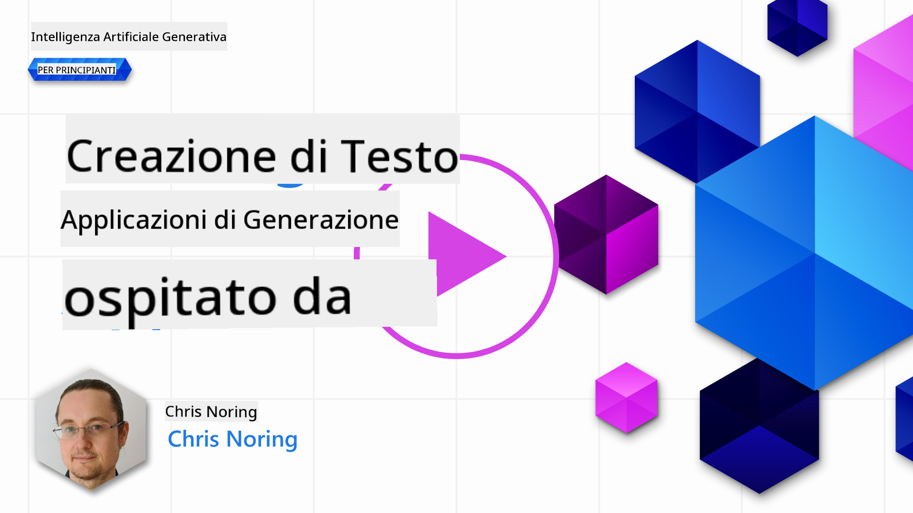

<!--
CO_OP_TRANSLATOR_METADATA:
{
  "original_hash": "ce8224073b86b728ed52b19bed7932fd",
  "translation_date": "2025-07-09T11:55:45+00:00",
  "source_file": "06-text-generation-apps/README.md",
  "language_code": "it"
}
-->
# Costruire applicazioni per la generazione di testo

[](https://aka.ms/gen-ai-lesson6-gh?WT.mc_id=academic-105485-koreyst)

> _(Clicca sull'immagine sopra per vedere il video di questa lezione)_

Finora, in questo percorso formativo, hai visto che esistono concetti fondamentali come i prompt e persino un’intera disciplina chiamata "prompt engineering". Molti strumenti con cui puoi interagire, come ChatGPT, Office 365, Microsoft Power Platform e altri, ti supportano nell’uso dei prompt per realizzare qualcosa.

Per aggiungere un’esperienza simile a un’app, devi comprendere concetti come prompt, completamenti e scegliere una libreria con cui lavorare. Proprio questo imparerai in questo capitolo.

## Introduzione

In questo capitolo, imparerai a:

- Conoscere la libreria openai e i suoi concetti fondamentali.
- Costruire un’app per la generazione di testo usando openai.
- Capire come usare concetti come prompt, temperatura e token per creare un’app di generazione di testo.

## Obiettivi di apprendimento

Al termine di questa lezione, sarai in grado di:

- Spiegare cos’è un’app per la generazione di testo.
- Costruire un’app per la generazione di testo usando openai.
- Configurare la tua app per usare più o meno token e modificare la temperatura, per ottenere risultati diversi.

## Cos’è un’app per la generazione di testo?

Normalmente, quando costruisci un’app, ha qualche tipo di interfaccia come le seguenti:

- Basata su comandi. Le app da console sono tipiche app in cui digiti un comando ed esegue un’operazione. Per esempio, `git` è un’app basata su comandi.
- Interfaccia utente (UI). Alcune app hanno interfacce grafiche (GUI) dove clicchi pulsanti, inserisci testo, selezioni opzioni e altro.

### Le app da console e UI hanno dei limiti

Confrontale con un’app basata su comandi dove digiti un comando:

- **È limitata**. Non puoi digitare qualsiasi comando, solo quelli supportati dall’app.
- **Specificità linguistica**. Alcune app supportano molte lingue, ma di default sono costruite per una lingua specifica, anche se puoi aggiungere supporto per altre lingue.

### Vantaggi delle app per la generazione di testo

In cosa si differenzia un’app per la generazione di testo?

In un’app per la generazione di testo hai più flessibilità, non sei limitato a un set di comandi o a una lingua specifica di input. Puoi invece usare il linguaggio naturale per interagire con l’app. Un altro vantaggio è che stai già interagendo con una fonte di dati addestrata su un vasto corpus di informazioni, mentre un’app tradizionale potrebbe essere limitata a ciò che è presente in un database.

### Cosa posso costruire con un’app per la generazione di testo?

Ci sono molte cose che puoi costruire. Per esempio:

- **Un chatbot**. Un chatbot che risponde a domande su argomenti come la tua azienda e i suoi prodotti potrebbe essere una buona soluzione.
- **Assistente**. I LLM sono ottimi per attività come riassumere testi, estrarre informazioni, produrre testi come curriculum e altro.
- **Assistente per il codice**. A seconda del modello linguistico che usi, puoi costruire un assistente per il codice che ti aiuta a scrivere codice. Per esempio, puoi usare prodotti come GitHub Copilot o ChatGPT per aiutarti a scrivere codice.

## Come posso iniziare?

Devi trovare un modo per integrarti con un LLM, che di solito prevede due approcci:

- Usare un’API. Qui costruisci richieste web con il tuo prompt e ricevi indietro il testo generato.
- Usare una libreria. Le librerie aiutano a incapsulare le chiamate API e a renderle più semplici da usare.

## Librerie/SDK

Ci sono alcune librerie ben note per lavorare con LLM come:

- **openai**, questa libreria rende facile connettersi al modello e inviare prompt.

Poi ci sono librerie che operano a un livello più alto come:

- **Langchain**. Langchain è molto conosciuta e supporta Python.
- **Semantic Kernel**. Semantic Kernel è una libreria Microsoft che supporta i linguaggi C#, Python e Java.

## Prima app usando openai

Vediamo come costruire la nostra prima app, quali librerie servono, quanto è necessario e così via.

### Installare openai

Ci sono molte librerie per interagire con OpenAI o Azure OpenAI. È possibile usare diversi linguaggi di programmazione come C#, Python, JavaScript, Java e altri. Abbiamo scelto di usare la libreria Python `openai`, quindi useremo `pip` per installarla.

```bash
pip install openai
```

### Creare una risorsa

Devi seguire questi passaggi:

- Crea un account su Azure [https://azure.microsoft.com/free/](https://azure.microsoft.com/free/?WT.mc_id=academic-105485-koreyst).
- Ottieni accesso ad Azure OpenAI. Vai su [https://learn.microsoft.com/azure/ai-services/openai/overview#how-do-i-get-access-to-azure-openai](https://learn.microsoft.com/azure/ai-services/openai/overview#how-do-i-get-access-to-azure-openai?WT.mc_id=academic-105485-koreyst) e richiedi l’accesso.

  > [!NOTE]
  > Al momento della scrittura, è necessario fare richiesta per ottenere l’accesso ad Azure OpenAI.

- Installa Python <https://www.python.org/>
- Crea una risorsa Azure OpenAI Service. Consulta questa guida su come [creare una risorsa](https://learn.microsoft.com/azure/ai-services/openai/how-to/create-resource?pivots=web-portal?WT.mc_id=academic-105485-koreyst).

### Trovare la chiave API e l’endpoint

A questo punto devi indicare alla libreria `openai` quale chiave API usare. Per trovare la tua chiave API, vai alla sezione "Keys and Endpoint" della tua risorsa Azure OpenAI e copia il valore di "Key 1".


Ora che hai copiato queste informazioni, istruiamo le librerie a usarle.

> [!NOTE]
> È consigliabile separare la tua chiave API dal codice. Puoi farlo usando variabili d’ambiente.
>
> - Imposta la variabile d’ambiente `OPENAI_API_KEY` con la tua chiave API.
>   `export OPENAI_API_KEY='sk-...'`

### Configurazione Azure

Se usi Azure OpenAI, ecco come configurare:

```python
openai.api_type = 'azure'
openai.api_key = os.environ["OPENAI_API_KEY"]
openai.api_version = '2023-05-15'
openai.api_base = os.getenv("API_BASE")
```

Qui stiamo impostando:

- `api_type` su `azure`. Questo indica alla libreria di usare Azure OpenAI e non OpenAI.
- `api_key`, la tua chiave API trovata nel portale Azure.
- `api_version`, la versione dell’API che vuoi usare. Al momento della scrittura, l’ultima versione è `2023-05-15`.
- `api_base`, l’endpoint dell’API. Lo trovi nel portale Azure accanto alla tua chiave API.

> [!NOTE] > `os.getenv` è una funzione che legge le variabili d’ambiente. Puoi usarla per leggere variabili come `OPENAI_API_KEY` e `API_BASE`. Imposta queste variabili nel terminale o usando una libreria come `dotenv`.

## Generare testo

Il modo per generare testo è usare la classe `Completion`. Ecco un esempio:

```python
prompt = "Complete the following: Once upon a time there was a"

completion = openai.Completion.create(model="davinci-002", prompt=prompt)
print(completion.choices[0].text)
```

Nel codice sopra, creiamo un oggetto completion e passiamo il modello che vogliamo usare e il prompt. Poi stampiamo il testo generato.

### Completamenti chat

Finora hai visto come usiamo `Completion` per generare testo. Ma c’è un’altra classe chiamata `ChatCompletion` più adatta per chatbot. Ecco un esempio di utilizzo:

```python
import openai

openai.api_key = "sk-..."

completion = openai.ChatCompletion.create(model="gpt-3.5-turbo", messages=[{"role": "user", "content": "Hello world"}])
print(completion.choices[0].message.content)
```

Approfondiremo questa funzionalità in un capitolo successivo.

## Esercizio - la tua prima app per la generazione di testo

Ora che abbiamo imparato a configurare openai, è il momento di costruire la tua prima app per la generazione di testo. Per farlo, segui questi passaggi:

1. Crea un ambiente virtuale e installa openai:

   ```bash
   python -m venv venv
   source venv/bin/activate
   pip install openai
   ```

   > [!NOTE]
   > Se usi Windows digita `venv\Scripts\activate` invece di `source venv/bin/activate`.

   > [!NOTE]
   > Trova la tua chiave Azure OpenAI andando su [https://portal.azure.com/](https://portal.azure.com/?WT.mc_id=academic-105485-koreyst), cerca `Open AI`, seleziona la risorsa `Open AI` e poi vai su `Keys and Endpoint` e copia il valore di `Key 1`.

1. Crea un file _app.py_ e inserisci il seguente codice:

   ```python
   import openai

   openai.api_key = "<replace this value with your open ai key or Azure OpenAI key>"

   openai.api_type = 'azure'
   openai.api_version = '2023-05-15'
   openai.api_base = "<endpoint found in Azure Portal where your API key is>"
   deployment_name = "<deployment name>"

   # add your completion code
   prompt = "Complete the following: Once upon a time there was a"
   messages = [{"role": "user", "content": prompt}]

   # make completion
   completion = openai.chat.completions.create(model=deployment_name, messages=messages)

   # print response
   print(completion.choices[0].message.content)
   ```

   > [!NOTE]
   > Se usi Azure OpenAI, devi impostare `api_type` su `azure` e `api_key` con la tua chiave Azure OpenAI.

   Dovresti vedere un output simile al seguente:

   ```output
    very unhappy _____.

   Once upon a time there was a very unhappy mermaid.
   ```

## Tipi diversi di prompt, per scopi diversi

Ora hai visto come generare testo usando un prompt. Hai anche un programma funzionante che puoi modificare per generare tipi diversi di testo.

I prompt possono essere usati per molti compiti. Per esempio:

- **Generare un tipo di testo**. Per esempio, puoi generare una poesia, domande per un quiz, ecc.
- **Cercare informazioni**. Puoi usare i prompt per cercare informazioni come nell’esempio: "Cosa significa CORS nello sviluppo web?".
- **Generare codice**. Puoi usare i prompt per generare codice, per esempio sviluppare una regex per validare email o addirittura generare un intero programma, come un’app web.

## Un caso d’uso più pratico: un generatore di ricette

Immagina di avere degli ingredienti a casa e vuoi cucinare qualcosa. Per farlo, ti serve una ricetta. Un modo per trovare ricette è usare un motore di ricerca oppure un LLM.

Potresti scrivere un prompt così:

> "Mostrami 5 ricette per un piatto con i seguenti ingredienti: pollo, patate e carote. Per ogni ricetta, elenca tutti gli ingredienti usati"

Dato questo prompt, potresti ricevere una risposta simile a:

```output
1. Roasted Chicken and Vegetables:
Ingredients:
- 4 chicken thighs
- 2 potatoes, cut into cubes
- 2 carrots, cut into cubes
- 2 tablespoons olive oil
- 2 cloves garlic, minced
- 1 teaspoon dried thyme
- 1 teaspoon dried oregano
- Salt and pepper, to taste

2. Chicken and Potato Stew:
Ingredients:
- 2 tablespoons olive oil
- 1 onion, diced
- 2 cloves garlic, minced
- 2 chicken breasts, cut into cubes
- 2 potatoes, cut into cubes
- 2 carrots, cut into cubes
- 1 teaspoon dried oregano
- 1 teaspoon dried thyme
- 1 cup chicken broth
- Salt and pepper, to taste

3. Chicken and Potato Bake:
Ingredients:
- 2 tablespoons olive oil
- 2 chicken breasts, cut into cubes
- 2 potatoes, cut into cubes
- 2 carrots, cut into cubes
- 1 onion, diced
- 2 cloves garlic, minced
- 1 teaspoon dried oregano
- 1 teaspoon dried thyme
- 1 cup chicken broth
- Salt and pepper, to taste

4. Chicken and Potato Soup:
Ingredients:
- 2 tablespoons olive oil
- 1 onion, diced
- 2 cloves garlic, minced
- 2 chicken breasts, cut into cubes
- 2 potatoes, cut into cubes
- 2 carrots, cut into cubes
- 1 teaspoon dried oregano
- 1 teaspoon dried thyme
- 4 cups chicken broth
- Salt and pepper, to taste

5. Chicken and Potato Hash:
Ingredients:
- 2 tablespoons olive oil
- 2 chicken breasts, cut into cubes
- 2 potatoes, cut into cubes
- 2 carrots, cut into cubes
- 1 onion, diced
- 2 cloves garlic, minced
- 1 teaspoon dried oregano
```

Questo risultato è ottimo, so cosa cucinare. A questo punto, miglioramenti utili potrebbero essere:

- Filtrare gli ingredienti che non mi piacciono o a cui sono allergico.
- Creare una lista della spesa, nel caso non abbia tutti gli ingredienti a casa.

Per questi casi, aggiungiamo un prompt aggiuntivo:

> "Per favore rimuovi le ricette con aglio perché sono allergico e sostituiscilo con qualcos’altro. Inoltre, crea una lista della spesa per le ricette, considerando che ho già pollo, patate e carote a casa."

Ora hai un nuovo risultato, cioè:

```output
1. Roasted Chicken and Vegetables:
Ingredients:
- 4 chicken thighs
- 2 potatoes, cut into cubes
- 2 carrots, cut into cubes
- 2 tablespoons olive oil
- 1 teaspoon dried thyme
- 1 teaspoon dried oregano
- Salt and pepper, to taste

2. Chicken and Potato Stew:
Ingredients:
- 2 tablespoons olive oil
- 1 onion, diced
- 2 chicken breasts, cut into cubes
- 2 potatoes, cut into cubes
- 2 carrots, cut into cubes
- 1 teaspoon dried oregano
- 1 teaspoon dried thyme
- 1 cup chicken broth
- Salt and pepper, to taste

3. Chicken and Potato Bake:
Ingredients:
- 2 tablespoons olive oil
- 2 chicken breasts, cut into cubes
- 2 potatoes, cut into cubes
- 2 carrots, cut into cubes
- 1 onion, diced
- 1 teaspoon dried oregano
- 1 teaspoon dried thyme
- 1 cup chicken broth
- Salt and pepper, to taste

4. Chicken and Potato Soup:
Ingredients:
- 2 tablespoons olive oil
- 1 onion, diced
- 2 chicken breasts, cut into cubes
- 2 potatoes, cut into cubes
- 2 carrots, cut into cubes
- 1 teaspoon dried oregano
- 1 teaspoon dried thyme
- 4 cups chicken broth
- Salt and pepper, to taste

5. Chicken and Potato Hash:
Ingredients:
- 2 tablespoons olive oil
- 2 chicken breasts, cut into cubes
- 2 potatoes, cut into cubes
- 2 carrots, cut into cubes
- 1 onion, diced
- 1 teaspoon dried oregano

Shopping List:
- Olive oil
- Onion
- Thyme
- Oregano
- Salt
- Pepper
```

Ecco le tue cinque ricette, senza aglio, e anche la lista della spesa considerando ciò che hai già a casa.

## Esercizio - costruisci un generatore di ricette

Ora che abbiamo simulato uno scenario, scriviamo il codice per replicarlo. Per farlo, segui questi passaggi:

1. Usa il file _app.py_ esistente come punto di partenza
1. Trova la variabile `prompt` e modifica il suo codice così:

   ```python
   prompt = "Show me 5 recipes for a dish with the following ingredients: chicken, potatoes, and carrots. Per recipe, list all the ingredients used"
   ```

   Se ora esegui il codice, dovresti vedere un output simile a:

   ```output
   -Chicken Stew with Potatoes and Carrots: 3 tablespoons oil, 1 onion, chopped, 2 cloves garlic, minced, 1 carrot, peeled and chopped, 1 potato, peeled and chopped, 1 bay leaf, 1 thyme sprig, 1/2 teaspoon salt, 1/4 teaspoon black pepper, 1 1/2 cups chicken broth, 1/2 cup dry white wine, 2 tablespoons chopped fresh parsley, 2 tablespoons unsalted butter, 1 1/2 pounds boneless, skinless chicken thighs, cut into 1-inch pieces
   -Oven-Roasted Chicken with Potatoes and Carrots: 3 tablespoons extra-virgin olive oil, 1 tablespoon Dijon mustard, 1 tablespoon chopped fresh rosemary, 1 tablespoon chopped fresh thyme, 4 cloves garlic, minced, 1 1/2 pounds small red potatoes, quartered, 1 1/2 pounds carrots, quartered lengthwise, 1/2 teaspoon salt, 1/4 teaspoon black pepper, 1 (4-pound) whole chicken
   -Chicken, Potato, and Carrot Casserole: cooking spray, 1 large onion, chopped, 2 cloves garlic, minced, 1 carrot, peeled and shredded, 1 potato, peeled and shredded, 1/2 teaspoon dried thyme leaves, 1/4 teaspoon salt, 1/4 teaspoon black pepper, 2 cups fat-free, low-sodium chicken broth, 1 cup frozen peas, 1/4 cup all-purpose flour, 1 cup 2% reduced-fat milk, 1/4 cup grated Parmesan cheese

   -One Pot Chicken and Potato Dinner: 2 tablespoons olive oil, 1 pound boneless, skinless chicken thighs, cut into 1-inch pieces, 1 large onion, chopped, 3 cloves garlic, minced, 1 carrot, peeled and chopped, 1 potato, peeled and chopped, 1 bay leaf, 1 thyme sprig, 1/2 teaspoon salt, 1/4 teaspoon black pepper, 2 cups chicken broth, 1/2 cup dry white wine

   -Chicken, Potato, and Carrot Curry: 1 tablespoon vegetable oil, 1 large onion, chopped, 2 cloves garlic, minced, 1 carrot, peeled and chopped, 1 potato, peeled and chopped, 1 teaspoon ground coriander, 1 teaspoon ground cumin, 1/2 teaspoon ground turmeric, 1/2 teaspoon ground ginger, 1/4 teaspoon cayenne pepper, 2 cups chicken broth, 1/2 cup dry white wine, 1 (15-ounce) can chickpeas, drained and rinsed, 1/2 cup raisins, 1/2 cup chopped fresh cilantro
   ```

   > NOTA, il tuo LLM è nondeterministico, quindi potresti ottenere risultati diversi ogni volta che esegui il programma.

   Ottimo, vediamo come migliorare le cose. Per farlo, vogliamo che il codice sia flessibile, così da poter modificare sia gli ingredienti che il numero di ricette.

1. Cambiamo il codice in questo modo:

   ```python
   no_recipes = input("No of recipes (for example, 5): ")

   ingredients = input("List of ingredients (for example, chicken, potatoes, and carrots): ")

   # interpolate the number of recipes into the prompt an ingredients
   prompt = f"Show me {no_recipes} recipes for a dish with the following ingredients: {ingredients}. Per recipe, list all the ingredients used"
   ```

   Un test di esecuzione del codice potrebbe essere così:

   ```output
   No of recipes (for example, 5): 3
   List of ingredients (for example, chicken, potatoes, and carrots): milk,strawberries

   -Strawberry milk shake: milk, strawberries, sugar, vanilla extract, ice cubes
   -Strawberry shortcake: milk, flour, baking powder, sugar, salt, unsalted butter, strawberries, whipped cream
   -Strawberry milk: milk, strawberries, sugar, vanilla extract
   ```

### Migliorare aggiungendo filtro e lista della spesa

Ora abbiamo un’app funzionante capace di produrre ricette ed è flessibile perché si basa su input dell’utente, sia sul numero di ricette che sugli ingredienti usati.

Per migliorare ulteriormente, vogliamo aggiungere:

- **Filtrare gli ingredienti**. Vogliamo poter escludere ingredienti che non ci piacciono o a cui siamo allergici. Per farlo, possiamo modificare il prompt esistente aggiungendo una condizione di filtro alla fine, così:

  ```python
  filter = input("Filter (for example, vegetarian, vegan, or gluten-free): ")

  prompt = f"Show me {no_recipes} recipes for a dish with the following ingredients: {ingredients}. Per recipe, list all the ingredients used, no {filter}"
  ```

  Qui aggiungiamo `{filter}` alla fine del prompt e catturiamo anche il valore del filtro dall’utente.

  Un esempio di input eseguendo il programma ora potrebbe essere:

  ```output
  No of recipes (for example, 5): 3
  List of ingredients (for example, chicken, potatoes, and carrots): onion,milk
  Filter (for example, vegetarian, vegan, or gluten-free): no milk

  1. French Onion Soup

  Ingredients:

  -1 large onion, sliced
  -3 cups beef broth
  -1 cup milk
  -6 slices french bread
  -1/4 cup shredded Parmesan cheese
  -1 tablespoon butter
  -1 teaspoon dried thyme
  -1/4 teaspoon salt
  -1/4 teaspoon black pepper

  Instructions:

  1. In a large pot, sauté onions in butter until golden brown.
  2. Add beef broth, milk, thyme, salt, and pepper. Bring to a boil.
  3. Reduce heat and simmer for 10 minutes.
  4. Place french bread slices on soup bowls.
  5. Ladle soup over bread.
  6. Sprinkle with Parmesan cheese.

  2. Onion and Potato Soup

  Ingredients:

  -1 large onion, chopped
  -2 cups potatoes, diced
  -3 cups vegetable broth
  -1 cup milk
  -1/4 teaspoon black pepper

  Instructions:

  1. In a large pot, sauté onions in butter until golden brown.
  2. Add potatoes, vegetable broth, milk, and pepper. Bring to a boil.
  3. Reduce heat and simmer for 10 minutes.
  4. Serve hot.

  3. Creamy Onion Soup

  Ingredients:

  -1 large onion, chopped
  -3 cups vegetable broth
  -1 cup milk
  -1/4 teaspoon black pepper
  -1/4 cup all-purpose flour
  -1/2 cup shredded Parmesan cheese

  Instructions:

  1. In a large pot, sauté onions in butter until golden brown.
  2. Add vegetable broth, milk, and pepper. Bring to a boil.
  3. Reduce heat and simmer for 10 minutes.
  4. In a small bowl, whisk together flour and Parmesan cheese until smooth.
  5. Add to soup and simmer for an additional 5 minutes, or until soup has thickened.
  ```

  Come vedi, tutte le ricette con latte sono state filtrate. Ma se sei intollerante al lattosio, potresti voler escludere anche ricette con formaggio, quindi è importante essere chiari.

- **Creare una lista della spesa**. Vogliamo produrre una lista della spesa, considerando ciò che abbiamo già a casa.

  Per questa funzionalità, potremmo provare a risolvere tutto in un solo prompt oppure dividerlo in due prompt. Proviamo la seconda opzione. Qui suggeriamo di aggiungere un prompt aggiuntivo, ma perché funzioni dobbiamo passare il risultato del primo prompt come contesto al secondo.

  Trova la parte del codice che stampa il risultato del primo prompt e aggiungi il seguente codice subito dopo:

  ```python
  old_prompt_result = completion.choices[0].message.content
  prompt = "Produce a shopping list for the generated recipes and please don't include ingredients that I already have."

  new_prompt = f"{old_prompt_result} {prompt}"
  messages = [{"role": "user", "content": new_prompt}]
  completion = openai.Completion.create(engine=deployment_name, messages=messages, max_tokens=1200)

  # print response
  print("Shopping list:")
  print(completion.choices[0].message.content)
  ```

  Nota quanto segue:

  1. Stiamo costruendo un nuovo prompt aggiungendo il risultato del primo prompt al nuovo prompt:

     ```python
     new_prompt = f"{old_prompt_result} {prompt}"
     ```
1. Facciamo una nuova richiesta, tenendo però conto anche del numero di token richiesti nel primo prompt, quindi questa volta impostiamo `max_tokens` a 1200.

   ```python
     completion = openai.Completion.create(engine=deployment_name, prompt=new_prompt, max_tokens=1200)
     ```

   Provando questo codice, otteniamo il seguente output:

   ```output
     No of recipes (for example, 5): 2
     List of ingredients (for example, chicken, potatoes, and carrots): apple,flour
     Filter (for example, vegetarian, vegan, or gluten-free): sugar


     -Apple and flour pancakes: 1 cup flour, 1/2 tsp baking powder, 1/2 tsp baking soda, 1/4 tsp salt, 1 tbsp sugar, 1 egg, 1 cup buttermilk or sour milk, 1/4 cup melted butter, 1 Granny Smith apple, peeled and grated
     -Apple fritters: 1-1/2 cups flour, 1 tsp baking powder, 1/4 tsp salt, 1/4 tsp baking soda, 1/4 tsp nutmeg, 1/4 tsp cinnamon, 1/4 tsp allspice, 1/4 cup sugar, 1/4 cup vegetable shortening, 1/4 cup milk, 1 egg, 2 cups shredded, peeled apples
     Shopping list:
     -Flour, baking powder, baking soda, salt, sugar, egg, buttermilk, butter, apple, nutmeg, cinnamon, allspice
     ```

## Migliora la tua configurazione

Quello che abbiamo finora è un codice funzionante, ma ci sono alcune modifiche che dovremmo fare per migliorare ulteriormente. Alcune cose da fare sono:

- **Separare i segreti dal codice**, come la chiave API. I segreti non devono essere nel codice e dovrebbero essere conservati in un luogo sicuro. Per separare i segreti dal codice, possiamo usare variabili d’ambiente e librerie come `python-dotenv` per caricarli da un file. Ecco come potrebbe apparire nel codice:

  1. Crea un file `.env` con il seguente contenuto:

     ```bash
     OPENAI_API_KEY=sk-...
     ```

     
> Nota, per Azure, devi impostare le seguenti variabili d’ambiente:

     ```bash
     OPENAI_API_TYPE=azure
     OPENAI_API_VERSION=2023-05-15
     OPENAI_API_BASE=<replace>
     ```

     Nel codice, caricheresti le variabili d’ambiente in questo modo:

     ```python
     from dotenv import load_dotenv

     load_dotenv()

     openai.api_key = os.environ["OPENAI_API_KEY"]
     ```

- **Una parola sulla lunghezza dei token**. Dovremmo considerare quanti token servono per generare il testo desiderato. I token hanno un costo, quindi dove possibile dovremmo cercare di essere parsimoniosi con il numero di token usati. Per esempio, possiamo formulare il prompt in modo da usare meno token?

  Per modificare i token usati, puoi usare il parametro `max_tokens`. Per esempio, se vuoi usare 100 token, faresti così:

  ```python
  completion = client.chat.completions.create(model=deployment, messages=messages, max_tokens=100)
  ```

- **Sperimentare con la temperatura**. La temperatura è un aspetto che non abbiamo ancora menzionato ma è importante per il comportamento del nostro programma. Più alto è il valore della temperatura, più casuale sarà l’output. Al contrario, più basso è il valore, più prevedibile sarà l’output. Valuta se vuoi una certa variazione nel risultato o meno.

  Per modificare la temperatura, puoi usare il parametro `temperature`. Per esempio, se vuoi impostare la temperatura a 0.5, faresti così:

  ```python
  completion = client.chat.completions.create(model=deployment, messages=messages, temperature=0.5)
  ```

  > Nota, più ci si avvicina a 1.0, più vario sarà l’output.

## Compito

Per questo compito, puoi scegliere cosa costruire.

Ecco qualche suggerimento:

- Modifica l’app generatrice di ricette per migliorarla ulteriormente. Gioca con i valori di temperatura e con i prompt per vedere cosa riesci a ottenere.
- Crea un “compagno di studio”. Questa app dovrebbe essere in grado di rispondere a domande su un argomento, per esempio Python; potresti avere prompt come “Cos’è un certo argomento in Python?” oppure un prompt che dice “mostrami il codice per un certo argomento” ecc.
- Bot storico, fai rivivere la storia, istruisci il bot a impersonare un certo personaggio storico e fagli domande sulla sua vita e i suoi tempi.

## Soluzione

### Compagno di studio

Qui sotto trovi un prompt di partenza, prova a usarlo e modificarlo a tuo piacimento.

```text
- "You're an expert on the Python language

    Suggest a beginner lesson for Python in the following format:

    Format:
    - concepts:
    - brief explanation of the lesson:
    - exercise in code with solutions"
```

### Bot storico

Ecco alcuni prompt che potresti usare:

```text
- "You are Abe Lincoln, tell me about yourself in 3 sentences, and respond using grammar and words like Abe would have used"
- "You are Abe Lincoln, respond using grammar and words like Abe would have used:

   Tell me about your greatest accomplishments, in 300 words"
```

## Verifica delle conoscenze

Cosa fa il concetto di temperatura?

1. Controlla quanto è casuale l’output.
1. Controlla quanto è grande la risposta.
1. Controlla quanti token vengono usati.

## 🚀 Sfida

Mentre lavori al compito, prova a variare la temperatura, impostandola a 0, 0.5 e 1. Ricorda che 0 è il meno vario e 1 il più vario. Quale valore funziona meglio per la tua app?

## Ottimo lavoro! Continua a imparare

Dopo aver completato questa lezione, dai un’occhiata alla nostra [collezione di apprendimento sull’AI generativa](https://aka.ms/genai-collection?WT.mc_id=academic-105485-koreyst) per continuare a migliorare le tue conoscenze sull’AI generativa!

Passa alla Lezione 7 dove vedremo come [costruire applicazioni di chat](../07-building-chat-applications/README.md?WT.mc_id=academic-105485-koreyst)!

**Disclaimer**:  
Questo documento è stato tradotto utilizzando il servizio di traduzione automatica [Co-op Translator](https://github.com/Azure/co-op-translator). Pur impegnandoci per garantire accuratezza, si prega di notare che le traduzioni automatiche possono contenere errori o imprecisioni. Il documento originale nella sua lingua nativa deve essere considerato la fonte autorevole. Per informazioni critiche, si raccomanda una traduzione professionale effettuata da un umano. Non ci assumiamo alcuna responsabilità per eventuali malintesi o interpretazioni errate derivanti dall’uso di questa traduzione.