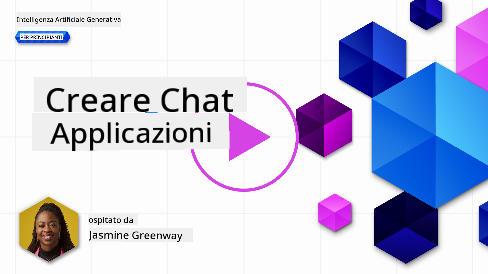
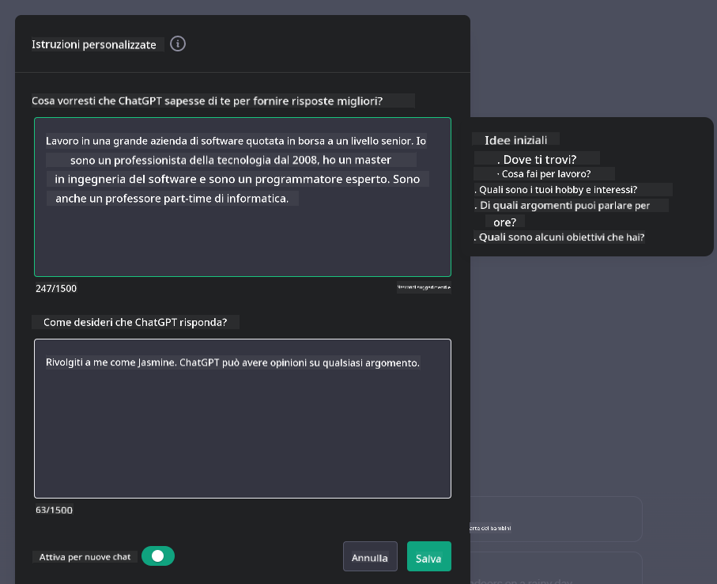

<!--
CO_OP_TRANSLATOR_METADATA:
{
  "original_hash": "ea4bbe640847aafbbba14dae4625e9af",
  "translation_date": "2025-07-09T12:26:31+00:00",
  "source_file": "07-building-chat-applications/README.md",
  "language_code": "it"
}
-->
# Creare Applicazioni Chat Potenziate da AI Generativa

[](https://aka.ms/gen-ai-lessons7-gh?WT.mc_id=academic-105485-koreyst)

> _(Clicca sull'immagine sopra per vedere il video di questa lezione)_

Ora che abbiamo visto come costruire applicazioni di generazione di testo, esploriamo le applicazioni chat.

Le applicazioni chat sono diventate parte integrante della nostra vita quotidiana, offrendo molto più di un semplice mezzo per conversazioni informali. Sono elementi fondamentali per il servizio clienti, il supporto tecnico e persino per sistemi di consulenza sofisticati. Probabilmente hai ricevuto assistenza da un’applicazione chat non molto tempo fa. Man mano che integriamo tecnologie più avanzate come l’AI generativa in queste piattaforme, aumentano sia la complessità che le sfide.

Alcune domande a cui dobbiamo rispondere sono:

- **Costruire l’app**. Come possiamo costruire in modo efficiente e integrare senza problemi queste applicazioni AI-powered per casi d’uso specifici?
- **Monitoraggio**. Una volta distribuite, come possiamo monitorare e garantire che le applicazioni funzionino al massimo livello di qualità, sia in termini di funzionalità che di rispetto dei [sei principi dell’AI responsabile](https://www.microsoft.com/ai/responsible-ai?WT.mc_id=academic-105485-koreyst)?

Mentre ci avviciniamo a un’epoca definita dall’automazione e dalle interazioni fluide uomo-macchina, diventa essenziale comprendere come l’AI generativa trasformi la portata, la profondità e l’adattabilità delle applicazioni chat. Questa lezione analizzerà gli aspetti architetturali che supportano questi sistemi complessi, approfondirà le metodologie per il fine-tuning su compiti specifici di dominio e valuterà le metriche e le considerazioni rilevanti per garantire un’implementazione responsabile dell’AI.

## Introduzione

Questa lezione copre:

- Tecniche per costruire e integrare efficacemente applicazioni chat.
- Come applicare personalizzazioni e fine-tuning alle applicazioni.
- Strategie e considerazioni per monitorare efficacemente le applicazioni chat.

## Obiettivi di Apprendimento

Al termine di questa lezione, sarai in grado di:

- Descrivere le considerazioni per costruire e integrare applicazioni chat in sistemi esistenti.
- Personalizzare applicazioni chat per casi d’uso specifici.
- Identificare metriche chiave e considerazioni per monitorare e mantenere efficacemente la qualità delle applicazioni chat AI-powered.
- Assicurare che le applicazioni chat sfruttino l’AI in modo responsabile.

## Integrare l’AI Generativa nelle Applicazioni Chat

Elevare le applicazioni chat tramite l’AI generativa non significa solo renderle più intelligenti; si tratta di ottimizzare architettura, prestazioni e interfaccia utente per offrire un’esperienza di qualità. Questo implica analizzare le basi architetturali, le integrazioni API e le considerazioni sull’interfaccia utente. Questa sezione mira a offrirti una roadmap completa per orientarti in questi scenari complessi, sia che tu stia collegando le applicazioni a sistemi esistenti o costruendole come piattaforme autonome.

Al termine di questa sezione, avrai le competenze necessarie per costruire e integrare efficacemente applicazioni chat.

### Chatbot o Applicazione Chat?

Prima di addentrarci nella costruzione di applicazioni chat, confrontiamo i “chatbot” con le “applicazioni chat AI-powered”, che svolgono ruoli e funzioni differenti. Lo scopo principale di un chatbot è automatizzare compiti conversazionali specifici, come rispondere a domande frequenti o tracciare un pacco. Di solito è governato da logiche basate su regole o algoritmi AI complessi. Al contrario, un’applicazione chat AI-powered è un ambiente molto più ampio progettato per facilitare varie forme di comunicazione digitale, come chat testuali, vocali e video tra utenti umani. La sua caratteristica distintiva è l’integrazione di un modello AI generativo che simula conversazioni sfumate e umane, generando risposte basate su una vasta gamma di input e segnali contestuali. Un’applicazione chat potenziata da AI generativa può impegnarsi in discussioni a dominio aperto, adattarsi a contesti conversazionali in evoluzione e persino produrre dialoghi creativi o complessi.

La tabella seguente evidenzia le principali differenze e somiglianze per aiutarci a comprendere i loro ruoli unici nella comunicazione digitale.

| Chatbot                               | Applicazione Chat Potenziata da AI Generativa |
| ------------------------------------- | --------------------------------------------- |
| Focalizzato su compiti e basato su regole | Consapevole del contesto                      |
| Spesso integrato in sistemi più ampi  | Può ospitare uno o più chatbot                 |
| Limitato a funzioni programmate       | Integra modelli AI generativi                  |
| Interazioni specializzate e strutturate | Capace di discussioni a dominio aperto         |

### Sfruttare funzionalità predefinite con SDK e API

Quando si costruisce un’applicazione chat, un ottimo primo passo è valutare cosa è già disponibile. Usare SDK e API per costruire applicazioni chat è una strategia vantaggiosa per diversi motivi. Integrando SDK e API ben documentati, posizioni strategicamente la tua applicazione per un successo a lungo termine, affrontando questioni di scalabilità e manutenzione.

- **Accelera il processo di sviluppo e riduce i costi**: Affidarsi a funzionalità predefinite invece di costruirle da zero ti permette di concentrarti su altri aspetti dell’applicazione che ritieni più importanti, come la logica di business.
- **Migliore performance**: Quando costruisci funzionalità da zero, ti chiederai “Come scala? L’applicazione è in grado di gestire un improvviso aumento di utenti?” SDK e API ben mantenuti spesso includono soluzioni integrate per queste problematiche.
- **Manutenzione più semplice**: Aggiornamenti e miglioramenti sono più facili da gestire, poiché la maggior parte delle API e SDK richiede semplicemente l’aggiornamento di una libreria quando viene rilasciata una nuova versione.
- **Accesso a tecnologie all’avanguardia**: Sfruttare modelli affinati e addestrati su dataset estesi fornisce alla tua applicazione capacità di linguaggio naturale avanzate.

L’accesso alle funzionalità di un SDK o API generalmente richiede il permesso di utilizzare i servizi forniti, spesso tramite una chiave unica o un token di autenticazione. Useremo la OpenAI Python Library per esplorare come funziona. Puoi anche provarla autonomamente nel seguente [notebook per OpenAI](../../../07-building-chat-applications/python/oai-assignment.ipynb) o [notebook per Azure OpenAI Services](../../../07-building-chat-applications/python/aoai-assignment.ipynb) per questa lezione.

```python
import os
from openai import OpenAI

API_KEY = os.getenv("OPENAI_API_KEY","")

client = OpenAI(
    api_key=API_KEY
    )

chat_completion = client.chat.completions.create(model="gpt-3.5-turbo", messages=[{"role": "user", "content": "Suggest two titles for an instructional lesson on chat applications for generative AI."}])
```

L’esempio sopra utilizza il modello GPT-3.5 Turbo per completare il prompt, ma nota che la chiave API è impostata prima di eseguire la chiamata. Riceveresti un errore se non impostassi la chiave.

## Esperienza Utente (UX)

I principi generali di UX si applicano alle applicazioni chat, ma qui ci sono alcune considerazioni aggiuntive particolarmente importanti a causa dei componenti di machine learning coinvolti.

- **Meccanismo per gestire l’ambiguità**: I modelli AI generativi a volte producono risposte ambigue. Una funzione che consente agli utenti di chiedere chiarimenti può essere utile in questi casi.
- **Mantenimento del contesto**: I modelli AI generativi avanzati hanno la capacità di ricordare il contesto all’interno di una conversazione, un aspetto che può migliorare notevolmente l’esperienza utente. Dare agli utenti la possibilità di controllare e gestire il contesto migliora l’esperienza, ma introduce il rischio di conservare informazioni sensibili. Considerazioni su quanto a lungo queste informazioni vengano conservate, come l’introduzione di una policy di retention, possono bilanciare la necessità di contesto con la privacy.
- **Personalizzazione**: Con la capacità di apprendere e adattarsi, i modelli AI offrono un’esperienza personalizzata per l’utente. Personalizzare l’esperienza tramite funzionalità come i profili utente non solo fa sentire l’utente compreso, ma aiuta anche nella ricerca di risposte specifiche, creando un’interazione più efficiente e soddisfacente.

Un esempio di personalizzazione è l’impostazione "Custom instructions" in ChatGPT di OpenAI. Ti permette di fornire informazioni su di te che possono essere un contesto importante per i tuoi prompt. Ecco un esempio di istruzione personalizzata.



Questo “profilo” spinge ChatGPT a creare un piano di lezione sulle liste concatenate. Nota come ChatGPT tenga conto che l’utente potrebbe volere un piano di lezione più approfondito basato sulla sua esperienza.


### Il Framework dei Messaggi di Sistema di Microsoft per i Large Language Models

[Microsoft ha fornito indicazioni](https://learn.microsoft.com/azure/ai-services/openai/concepts/system-message#define-the-models-output-format?WT.mc_id=academic-105485-koreyst) per scrivere messaggi di sistema efficaci nella generazione di risposte da LLM, suddivise in 4 aree:

1. Definire a chi è destinato il modello, oltre alle sue capacità e limitazioni.
2. Definire il formato di output del modello.
3. Fornire esempi specifici che dimostrino il comportamento previsto del modello.
4. Fornire ulteriori linee guida comportamentali.

### Accessibilità

Che un utente abbia disabilità visive, uditive, motorie o cognitive, un’applicazione chat ben progettata dovrebbe essere utilizzabile da tutti. La lista seguente dettaglia funzionalità specifiche volte a migliorare l’accessibilità per varie disabilità.

- **Funzionalità per disabilità visive**: Temi ad alto contrasto e testo ridimensionabile, compatibilità con screen reader.
- **Funzionalità per disabilità uditive**: Funzioni di sintesi vocale e riconoscimento vocale, segnali visivi per notifiche audio.
- **Funzionalità per disabilità motorie**: Supporto alla navigazione da tastiera, comandi vocali.
- **Funzionalità per disabilità cognitive**: Opzioni di linguaggio semplificato.

## Personalizzazione e Fine-tuning per Modelli Linguistici Specifici di Dominio

Immagina un’applicazione chat che comprende il gergo della tua azienda e anticipa le domande specifiche che gli utenti fanno più spesso. Ci sono un paio di approcci da considerare:

- **Sfruttare modelli DSL**. DSL sta per domain specific language. Puoi utilizzare un modello DSL addestrato su un dominio specifico per comprendere i suoi concetti e scenari.
- **Applicare il fine-tuning**. Il fine-tuning è il processo di addestrare ulteriormente il modello con dati specifici.

## Personalizzazione: Usare un DSL

Sfruttare modelli linguistici specifici di dominio (DSL Models) può migliorare l’engagement degli utenti fornendo interazioni specializzate e contestualmente rilevanti. Si tratta di un modello addestrato o fine-tuned per comprendere e generare testo relativo a un campo, settore o argomento specifico. Le opzioni per usare un modello DSL variano dal crearne uno da zero, all’utilizzo di modelli preesistenti tramite SDK e API. Un’altra opzione è il fine-tuning, che consiste nel prendere un modello pre-addestrato esistente e adattarlo a un dominio specifico.

## Personalizzazione: Applicare il fine-tuning

Il fine-tuning è spesso preso in considerazione quando un modello pre-addestrato non è sufficiente in un dominio specializzato o per un compito specifico.

Ad esempio, le domande mediche sono complesse e richiedono molto contesto. Quando un medico fa una diagnosi, si basa su vari fattori come lo stile di vita o condizioni preesistenti, e può anche fare riferimento a riviste mediche recenti per convalidare la diagnosi. In scenari così sfumati, un’applicazione chat AI generica non può essere una fonte affidabile.

### Scenario: un’applicazione medica

Considera un’applicazione chat progettata per assistere i medici fornendo riferimenti rapidi a linee guida terapeutiche, interazioni farmacologiche o ricerche recenti.

Un modello generico potrebbe essere adeguato per rispondere a domande mediche di base o fornire consigli generali, ma potrebbe avere difficoltà con:

- **Casi altamente specifici o complessi**. Per esempio, un neurologo potrebbe chiedere all’applicazione: “Quali sono le migliori pratiche attuali per gestire l’epilessia farmacoresistente nei pazienti pediatrici?”
- **Mancanza di aggiornamenti recenti**. Un modello generico potrebbe faticare a fornire una risposta aggiornata che includa le più recenti scoperte in neurologia e farmacologia.

In casi come questi, il fine-tuning del modello con un dataset medico specializzato può migliorare significativamente la capacità di gestire queste complesse richieste mediche in modo più accurato e affidabile. Ciò richiede l’accesso a un dataset ampio e rilevante che rappresenti le sfide e le domande specifiche del dominio.

## Considerazioni per un’Esperienza Chat AI-Driven di Alta Qualità

Questa sezione delinea i criteri per applicazioni chat “di alta qualità”, che includono la raccolta di metriche utili e l’adesione a un framework che sfrutta l’AI in modo responsabile.

### Metriche Chiave

Per mantenere alte prestazioni di un’applicazione, è essenziale monitorare metriche e considerazioni chiave. Queste misurazioni non solo garantiscono la funzionalità dell’applicazione, ma valutano anche la qualità del modello AI e l’esperienza utente. Di seguito una lista che copre metriche di base, AI e UX da considerare.

| Metrica                       | Definizione                                                                                                           | Considerazioni per lo Sviluppatore Chat                          |
| ----------------------------- | -------------------------------------------------------------------------------------------------------------------- | ---------------------------------------------------------------- |
| **Uptime**                    | Misura il tempo in cui l’applicazione è operativa e accessibile dagli utenti.                                         | Come minimizzerai i tempi di inattività?                         |
| **Tempo di Risposta**         | Il tempo impiegato dall’applicazione per rispondere a una query dell’utente.                                         | Come ottimizzerai l’elaborazione delle query per migliorare i tempi di risposta? |
| **Precisione**                | Rapporto tra predizioni positive corrette e il totale delle predizioni positive.                                     | Come convaliderai la precisione del tuo modello?                |
| **Recall (Sensibilità)**      | Rapporto tra predizioni positive corrette e il numero reale di positivi.                                             | Come misurerai e migliorerai il recall?                          |
| **F1 Score**                  | Media armonica di precisione e recall, che bilancia il compromesso tra entrambi.                                     | Qual è il tuo obiettivo di F1 Score? Come bilancerai precisione e recall? |
| **Perplessità**               | Misura quanto la distribuzione di probabilità prevista dal modello si allinea con la distribuzione reale dei dati.  | Come minimizzerai la perplessità?                               |
| **Metriche di Soddisfazione Utente** | Misura la percezione dell’utente sull’applicazione. Spesso raccolta tramite sondaggi.                              | Quanto spesso raccoglierai feedback? Come ti adatterai in base a essi? |
| **Tasso di Errore**           | Frequenza con cui il modello commette errori nella comprensione o nell’output.                                       | Quali strategie hai per ridurre il tasso di errore?             |
| **Cicli di Riaddestramento** | Frequenza con cui il modello viene aggiornato per incorporare nuovi dati e informazioni.                             | Quanto spesso riaddestrerai il modello? Cosa innesca un ciclo di riaddestramento? |
| **Rilevamento delle Anomalie** | Strumenti e tecniche per identificare schemi insoliti che non corrispondono al comportamento previsto. | Come risponderai alle anomalie? |

### Implementare pratiche di AI responsabile nelle applicazioni di chat

L'approccio di Microsoft all'AI responsabile ha individuato sei principi che dovrebbero guidare lo sviluppo e l'uso dell'AI. Di seguito sono riportati i principi, la loro definizione e gli aspetti che uno sviluppatore di chat dovrebbe considerare e perché è importante prenderli sul serio.

| Principi               | Definizione di Microsoft                              | Considerazioni per lo sviluppatore di chat                         | Perché è importante                                                                    |
| ---------------------- | ----------------------------------------------------- | ----------------------------------------------------------------- | -------------------------------------------------------------------------------------- |
| Equità                 | I sistemi AI dovrebbero trattare tutte le persone in modo equo. | Assicurarsi che l'applicazione di chat non discrimini in base ai dati degli utenti. | Per costruire fiducia e inclusività tra gli utenti; evita implicazioni legali.         |
| Affidabilità e Sicurezza| I sistemi AI dovrebbero funzionare in modo affidabile e sicuro. | Implementare test e sistemi di sicurezza per ridurre al minimo errori e rischi. | Garantisce la soddisfazione degli utenti e previene potenziali danni.                  |
| Privacy e Sicurezza    | I sistemi AI dovrebbero essere sicuri e rispettare la privacy. | Applicare crittografia robusta e misure di protezione dei dati.   | Per proteggere i dati sensibili degli utenti e rispettare le normative sulla privacy.  |
| Inclusività            | I sistemi AI dovrebbero dare potere a tutti e coinvolgere le persone. | Progettare UI/UX accessibili e facili da usare per pubblici diversi. | Garantisce che un numero più ampio di persone possa utilizzare efficacemente l’applicazione. |
| Trasparenza            | I sistemi AI dovrebbero essere comprensibili.         | Fornire documentazione chiara e spiegazioni sulle risposte dell’AI. | Gli utenti tendono a fidarsi di più di un sistema se comprendono come vengono prese le decisioni. |
| Responsabilità         | Le persone dovrebbero essere responsabili dei sistemi AI. | Stabilire un processo chiaro per audit e miglioramento delle decisioni AI. | Permette miglioramenti continui e misure correttive in caso di errori.                 |

## Compito

Consulta [assignment](../../../07-building-chat-applications/python) che ti guiderà attraverso una serie di esercizi, dal primo utilizzo dei prompt di chat, alla classificazione e sintesi di testi e altro ancora. Nota che i compiti sono disponibili in diversi linguaggi di programmazione!

## Ottimo lavoro! Continua il percorso

Dopo aver completato questa lezione, dai un’occhiata alla nostra [collezione di apprendimento sull’AI generativa](https://aka.ms/genai-collection?WT.mc_id=academic-105485-koreyst) per continuare a migliorare le tue competenze sull’AI generativa!

Vai alla Lezione 8 per scoprire come iniziare a [costruire applicazioni di ricerca](../08-building-search-applications/README.md?WT.mc_id=academic-105485-koreyst)!

**Disclaimer**:  
Questo documento è stato tradotto utilizzando il servizio di traduzione automatica [Co-op Translator](https://github.com/Azure/co-op-translator). Pur impegnandoci per garantire l’accuratezza, si prega di notare che le traduzioni automatiche possono contenere errori o imprecisioni. Il documento originale nella sua lingua nativa deve essere considerato la fonte autorevole. Per informazioni critiche, si raccomanda una traduzione professionale effettuata da un umano. Non ci assumiamo alcuna responsabilità per eventuali malintesi o interpretazioni errate derivanti dall’uso di questa traduzione.