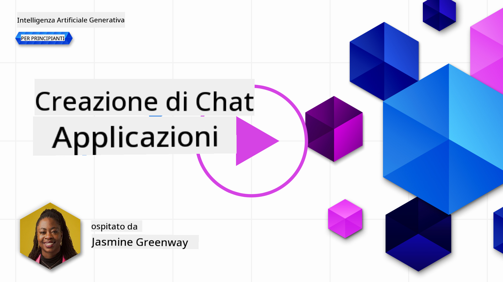

<!--
CO_OP_TRANSLATOR_METADATA:
{
  "original_hash": "ea4bbe640847aafbbba14dae4625e9af",
  "translation_date": "2025-05-19T17:47:48+00:00",
  "source_file": "07-building-chat-applications/README.md",
  "language_code": "it"
}
-->
# Costruire Applicazioni di Chat Potenziate dall'Intelligenza Artificiale Generativa

[](https://aka.ms/gen-ai-lessons7-gh?WT.mc_id=academic-105485-koreyst)

> _(Clicca sull'immagine sopra per vedere il video di questa lezione)_

Ora che abbiamo visto come costruire app per la generazione di testo, esaminiamo le applicazioni di chat.

Le applicazioni di chat sono diventate parte integrante della nostra vita quotidiana, offrendo più di un semplice mezzo di conversazione informale. Sono parti essenziali del servizio clienti, del supporto tecnico e persino di sistemi di consulenza sofisticati. È probabile che tu abbia ricevuto aiuto da un'applicazione di chat non molto tempo fa. Man mano che integriamo tecnologie più avanzate come l'IA generativa in queste piattaforme, la complessità aumenta, così come le sfide.

Alcune domande a cui dobbiamo rispondere sono:

- **Costruire l'app**. Come possiamo costruire in modo efficiente e integrare senza problemi queste applicazioni potenziate dall'IA per casi d'uso specifici?
- **Monitoraggio**. Una volta distribuite, come possiamo monitorare e garantire che le applicazioni funzionino al massimo livello di qualità, sia in termini di funzionalità che di aderenza ai [sei principi dell'IA responsabile](https://www.microsoft.com/ai/responsible-ai?WT.mc_id=academic-105485-koreyst)?

Mentre ci muoviamo ulteriormente in un'era definita dall'automazione e dalle interazioni uomo-macchina senza soluzione di continuità, comprendere come l'IA generativa trasforma la portata, la profondità e l'adattabilità delle applicazioni di chat diventa essenziale. Questa lezione esaminerà gli aspetti dell'architettura che supportano questi sistemi complessi, approfondirà le metodologie per affinarli per compiti specifici del dominio e valuterà le metriche e le considerazioni pertinenti per garantire un'implementazione responsabile dell'IA.

## Introduzione

Questa lezione copre:

- Tecniche per costruire e integrare in modo efficiente le applicazioni di chat.
- Come applicare la personalizzazione e l'affinamento alle applicazioni.
- Strategie e considerazioni per monitorare efficacemente le applicazioni di chat.

## Obiettivi di Apprendimento

Alla fine di questa lezione, sarai in grado di:

- Descrivere le considerazioni per costruire e integrare applicazioni di chat nei sistemi esistenti.
- Personalizzare le applicazioni di chat per casi d'uso specifici.
- Identificare le metriche chiave e le considerazioni per monitorare e mantenere efficacemente la qualità delle applicazioni di chat potenziate dall'IA.
- Garantire che le applicazioni di chat sfruttino l'IA in modo responsabile.

## Integrare l'IA Generativa nelle Applicazioni di Chat

Elevare le applicazioni di chat attraverso l'IA generativa non si concentra solo sul renderle più intelligenti; si tratta di ottimizzare la loro architettura, prestazioni e interfaccia utente per offrire un'esperienza utente di qualità. Questo comporta l'investigazione delle fondamenta architetturali, delle integrazioni API e delle considerazioni sull'interfaccia utente. Questa sezione mira a offrirti una roadmap completa per navigare in questi paesaggi complessi, sia che tu li stia integrando in sistemi esistenti o costruendoli come piattaforme autonome.

Alla fine di questa sezione, sarai dotato delle competenze necessarie per costruire e incorporare efficacemente applicazioni di chat.

### Chatbot o Applicazione di Chat?

Prima di immergerci nella costruzione di applicazioni di chat, confrontiamo i 'chatbot' con le 'applicazioni di chat potenziate dall'IA', che svolgono ruoli e funzionalità distinti. Lo scopo principale di un chatbot è automatizzare compiti conversazionali specifici, come rispondere a domande frequenti o tracciare un pacchetto. È tipicamente governato da logica basata su regole o algoritmi di IA complessi. Al contrario, un'applicazione di chat potenziata dall'IA è un ambiente molto più ampio progettato per facilitare varie forme di comunicazione digitale, come chat di testo, voce e video tra utenti umani. La sua caratteristica distintiva è l'integrazione di un modello di IA generativa che simula conversazioni sfumate e simili a quelle umane, generando risposte basate su una vasta gamma di input e indizi contestuali. Un'applicazione di chat potenziata dall'IA generativa può impegnarsi in discussioni aperte, adattarsi a contesti conversazionali in evoluzione e persino produrre dialoghi creativi o complessi.

La tabella seguente delinea le principali differenze e somiglianze per aiutarci a comprendere i loro ruoli unici nella comunicazione digitale.

| Chatbot                               | Applicazione di Chat Potenziata dall'IA Generativa |
| ------------------------------------- | -------------------------------------- |
| Focalizzata sui compiti e basata su regole | Consapevole del contesto                |
| Spesso integrata in sistemi più grandi  | Può ospitare uno o più chatbot          |
| Limitata a funzioni programmate        | Incorpora modelli di IA generativa      |
| Interazioni specializzate e strutturate | Capace di discussioni aperte            |

### Sfruttare le funzionalità pre-costruite con SDK e API

Quando si costruisce un'applicazione di chat, un ottimo primo passo è valutare cosa è già disponibile. Utilizzare SDK e API per costruire applicazioni di chat è una strategia vantaggiosa per vari motivi. Integrando SDK e API ben documentati, stai posizionando strategicamente la tua applicazione per il successo a lungo termine, affrontando preoccupazioni di scalabilità e manutenzione.

- **Accelera il processo di sviluppo e riduce i costi generali**: Affidarsi a funzionalità pre-costruite invece del costoso processo di costruirle da soli ti permette di concentrarti su altri aspetti della tua applicazione che potresti trovare più importanti, come la logica aziendale.
- **Migliori prestazioni**: Quando costruisci funzionalità da zero, ti chiederai inevitabilmente "Come si scala? Questa applicazione è in grado di gestire un improvviso afflusso di utenti?" Gli SDK e le API ben mantenuti spesso hanno soluzioni integrate per queste preoccupazioni.
- **Manutenzione più semplice**: Gli aggiornamenti e i miglioramenti sono più facili da gestire poiché la maggior parte delle API e degli SDK richiede semplicemente un aggiornamento a una libreria quando viene rilasciata una versione più recente.
- **Accesso alla tecnologia all'avanguardia**: Sfruttare modelli che sono stati raffinati e addestrati su set di dati estesi fornisce alla tua applicazione capacità di linguaggio naturale.

Accedere alla funzionalità di un SDK o API tipicamente implica ottenere il permesso di usare i servizi forniti, che avviene spesso tramite l'uso di una chiave unica o un token di autenticazione. Useremo la Libreria Python di OpenAI per esplorare come appare. Puoi anche provarlo da solo nel seguente [notebook per OpenAI](../../../07-building-chat-applications/python/oai-assignment.ipynb) o [notebook per i Servizi Azure OpenAI](../../../07-building-chat-applications/python/aoai-assignment.ipynb) per questa lezione.

```python
import os
from openai import OpenAI

API_KEY = os.getenv("OPENAI_API_KEY","")

client = OpenAI(
    api_key=API_KEY
    )

chat_completion = client.chat.completions.create(model="gpt-3.5-turbo", messages=[{"role": "user", "content": "Suggest two titles for an instructional lesson on chat applications for generative AI."}])
```

L'esempio sopra utilizza il modello GPT-3.5 Turbo per completare il prompt, ma nota che la chiave API è impostata prima di farlo. Riceveresti un errore se non impostassi la chiave.

## Esperienza Utente (UX)

I principi generali di UX si applicano alle applicazioni di chat, ma ecco alcune considerazioni aggiuntive che diventano particolarmente importanti a causa dei componenti di apprendimento automatico coinvolti.

- **Meccanismo per affrontare l'ambiguità**: I modelli di IA generativa occasionalmente generano risposte ambigue. Una funzione che consente agli utenti di chiedere chiarimenti può essere utile se si imbattono in questo problema.
- **Ritenzione del contesto**: I modelli di IA generativa avanzati hanno la capacità di ricordare il contesto all'interno di una conversazione, il che può essere un asset necessario per l'esperienza utente. Dare agli utenti la possibilità di controllare e gestire il contesto migliora l'esperienza utente, ma introduce il rischio di conservare informazioni sensibili degli utenti. Le considerazioni su quanto tempo queste informazioni vengono conservate, come l'introduzione di una politica di ritenzione, possono bilanciare la necessità di contesto con la privacy.
- **Personalizzazione**: Con la capacità di apprendere e adattarsi, i modelli di IA offrono un'esperienza individualizzata per un utente. Personalizzare l'esperienza utente attraverso funzionalità come i profili utente non solo fa sentire l'utente compreso, ma aiuta anche nella ricerca di risposte specifiche, creando un'interazione più efficiente e soddisfacente.

Un esempio di personalizzazione è l'impostazione "Istruzioni personalizzate" in ChatGPT di OpenAI. Ti consente di fornire informazioni su di te che possono essere un contesto importante per i tuoi prompt. Ecco un esempio di un'istruzione personalizzata.


Questo "profilo" invita ChatGPT a creare un piano di lezione sulle liste collegate. Nota che ChatGPT tiene conto del fatto che l'utente potrebbe volere un piano di lezione più approfondito basato sulla sua esperienza.


### Il Framework di Messaggi di Sistema di Microsoft per i Modelli di Linguaggio di Grandi Dimensioni

[Microsoft ha fornito indicazioni](https://learn.microsoft.com/azure/ai-services/openai/concepts/system-message#define-the-models-output-format?WT.mc_id=academic-105485-koreyst) per scrivere messaggi di sistema efficaci quando si generano risposte dai LLM suddivisi in 4 aree:

1. Definire per chi è il modello, così come le sue capacità e limitazioni.
2. Definire il formato di output del modello.
3. Fornire esempi specifici che dimostrano il comportamento previsto del modello.
4. Fornire ulteriori guardrail comportamentali.

### Accessibilità

Che un utente abbia disabilità visive, uditive, motorie o cognitive, un'applicazione di chat ben progettata dovrebbe essere utilizzabile da tutti. L'elenco seguente suddivide funzionalità specifiche mirate a migliorare l'accessibilità per varie disabilità degli utenti.

- **Funzionalità per disabilità visive**: Temi ad alto contrasto e testo ridimensionabile, compatibilità con lettori di schermo.
- **Funzionalità per disabilità uditive**: Funzioni di testo in voce e voce in testo, segnali visivi per notifiche audio.
- **Funzionalità per disabilità motorie**: Supporto per la navigazione tramite tastiera, comandi vocali.
- **Funzionalità per disabilità cognitive**: Opzioni di linguaggio semplificato.

## Personalizzazione e Affinamento per Modelli di Linguaggio Specifici del Dominio

Immagina un'applicazione di chat che comprende il gergo della tua azienda e anticipa le domande specifiche che il suo pubblico di riferimento ha comunemente. Ci sono un paio di approcci che vale la pena menzionare:

- **Sfruttare i modelli DSL**. DSL sta per linguaggio specifico del dominio. Puoi sfruttare un cosiddetto modello DSL addestrato su un dominio specifico per comprendere i suoi concetti e scenari.
- **Applicare l'affinamento**. L'affinamento è il processo di ulteriore addestramento del tuo modello con dati specifici.

## Personalizzazione: Usare un DSL

Sfruttare un modello di linguaggio specifico del dominio (DSL Models) può migliorare il coinvolgimento degli utenti fornendo interazioni specializzate e contestualmente rilevanti. È un modello che è stato addestrato o affinato per comprendere e generare testo relativo a un campo, un settore o un argomento specifico. Le opzioni per utilizzare un modello DSL possono variare dall'addestrarne uno da zero all'utilizzo di quelli preesistenti tramite SDK e API. Un'altra opzione è l'affinamento, che implica prendere un modello pre-addestrato esistente e adattarlo per un dominio specifico.

## Personalizzazione: Applicare l'affinamento

L'affinamento è spesso considerato quando un modello pre-addestrato non è all'altezza in un dominio specializzato o in un compito specifico.

Ad esempio, le domande mediche sono complesse e richiedono molto contesto. Quando un professionista medico diagnostica un paziente, si basa su una varietà di fattori come lo stile di vita o le condizioni preesistenti e può persino fare affidamento su riviste mediche recenti per convalidare la loro diagnosi. In scenari così sfumati, un'applicazione di chat AI generica non può essere una fonte affidabile.

### Scenario: un'applicazione medica

Considera un'applicazione di chat progettata per assistere i professionisti medici fornendo riferimenti rapidi alle linee guida sul trattamento, alle interazioni farmacologiche o alle scoperte di ricerca recenti.

Un modello generico potrebbe essere adeguato per rispondere a domande mediche di base o fornire consigli generali, ma potrebbe avere difficoltà con quanto segue:

- **Casi altamente specifici o complessi**. Ad esempio, un neurologo potrebbe chiedere all'applicazione: "Quali sono le migliori pratiche attuali per gestire l'epilessia resistente ai farmaci nei pazienti pediatrici?"
- **Mancanza di avanzamenti recenti**. Un modello generico potrebbe avere difficoltà a fornire una risposta attuale che incorpori i progressi più recenti in neurologia e farmacologia.

In casi come questi, affinare il modello con un dataset medico specializzato può migliorare significativamente la sua capacità di gestire queste complesse richieste mediche in modo più accurato e affidabile. Questo richiede l'accesso a un dataset ampio e rilevante che rappresenti le sfide e le domande specifiche del dominio che devono essere affrontate.

## Considerazioni per un'Esperienza di Chat di Alta Qualità Guidata dall'IA

Questa sezione delinea i criteri per applicazioni di chat di "alta qualità", che includono la cattura di metriche azionabili e l'adesione a un framework che sfrutta responsabilmente la tecnologia IA.

### Metriche Chiave

Per mantenere l'alta qualità delle prestazioni di un'applicazione, è essenziale tenere traccia delle metriche chiave e delle considerazioni. Queste misurazioni non solo garantiscono la funzionalità dell'applicazione, ma valutano anche la qualità del modello IA e l'esperienza utente. Di seguito è riportato un elenco che copre metriche di base, IA e esperienza utente da considerare.

| Metrica                        | Definizione                                                                                                             | Considerazioni per lo Sviluppatore di Chat                                 |
| ----------------------------- | ---------------------------------------------------------------------------------------------------------------------- | ------------------------------------------------------------------------- |
| **Uptime**                    | Misura il tempo in cui l'applicazione è operativa e accessibile dagli utenti.                                          | Come minimizzerai i tempi di inattività?                                  |
| **Tempo di Risposta**         | Il tempo impiegato dall'applicazione per rispondere alla query di un utente.                                           | Come puoi ottimizzare l'elaborazione delle query per migliorare il tempo di risposta? |
| **Precisione**                | Il rapporto tra le previsioni positive vere e il numero totale di previsioni positive                                   | Come validerai la precisione del tuo modello?                             |
| **Recall (Sensibilità)**      | Il rapporto tra le previsioni positive vere e il numero effettivo di positivi                                           | Come misurerai e migliorerai il recall?                                   |
| **F1 Score**                  | La media armonica di precisione e recall, che bilancia il compromesso tra entrambi.                                     | Qual è il tuo obiettivo di F1 Score? Come bilancerai precisione e recall? |
| **Perplessità**               | Misura quanto bene la distribuzione di probabilità prevista dal modello si allinea con la distribuzione effettiva dei dati. | Come minimizzerai la perplessità?                                         |
| **Metriche di Soddisfazione dell'Utente** | Misura la percezione dell'utente dell'applicazione. Spesso catturata attraverso sondaggi.                       | Quanto spesso raccoglierai il feedback degli utenti? Come ti adatterai in base ad esso? |
| **Tasso di Errore**           | Il tasso al quale il modello commette errori nella comprensione o nell'output.                                         | Quali strategie hai in atto per ridurre i tassi di errore?                |
| **Cicli di Riaddestramento**  | La frequenza con cui il modello viene aggiornato per incorporare nuovi dati e approfondimenti.                         | Quanto spesso riaddestrerai il modello? Cosa innesca un ciclo di riaddestramento? |
| **Rilevamento delle Anomalie** | Strumenti e tecniche per identificare schemi insoliti che non si conformano al comportamento previsto.                 | Come risponderai alle anomalie?                                           |

### Implementare Pratiche di IA Responsabile nelle Applicazioni di Chat

L'approccio di Microsoft all'IA Responsabile ha identificato sei principi che dovrebbero guidare lo sviluppo e l'uso dell'IA. Di seguito sono riportati i principi, la loro definizione e le cose che

**Disclaimer**:  
Questo documento è stato tradotto utilizzando il servizio di traduzione AI [Co-op Translator](https://github.com/Azure/co-op-translator). Sebbene ci impegniamo per l'accuratezza, si prega di essere consapevoli che le traduzioni automatiche possono contenere errori o imprecisioni. Il documento originale nella sua lingua nativa dovrebbe essere considerato la fonte autorevole. Per informazioni critiche, si raccomanda una traduzione umana professionale. Non siamo responsabili per eventuali incomprensioni o interpretazioni errate derivanti dall'uso di questa traduzione.