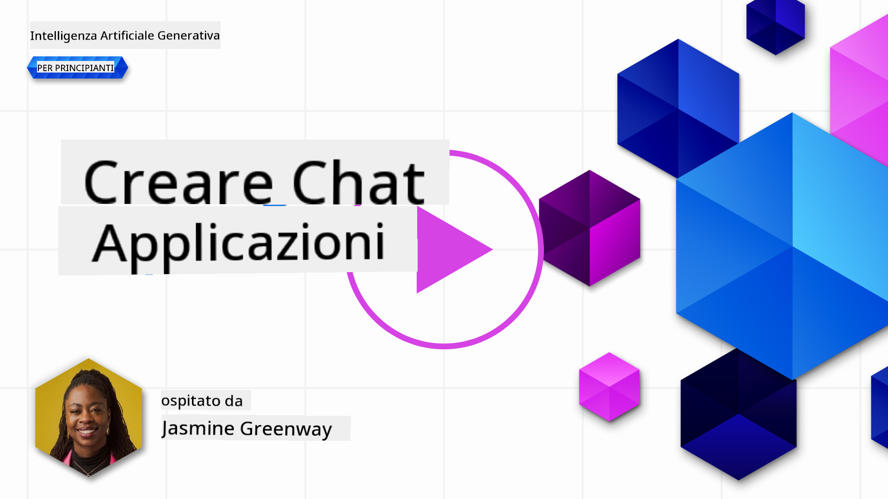
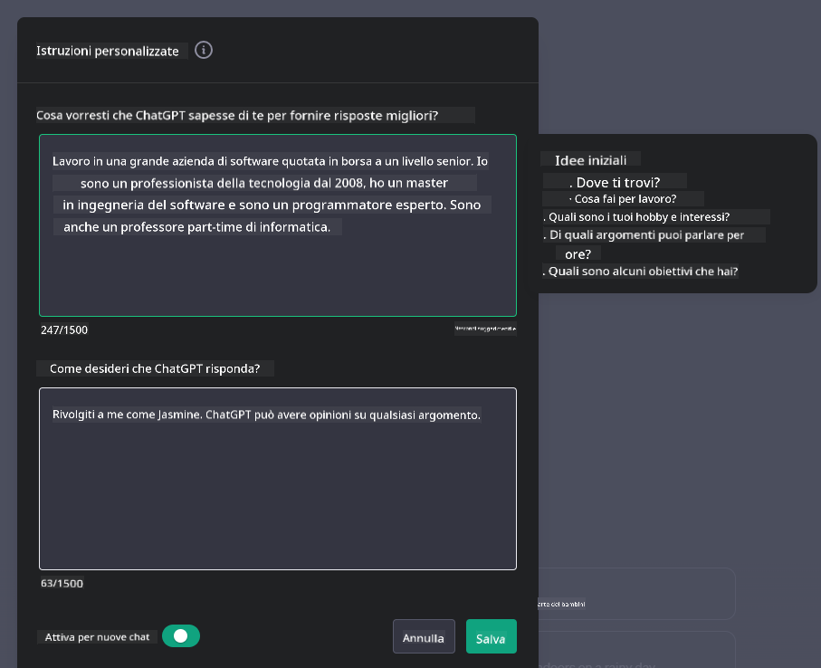

<!--
CO_OP_TRANSLATOR_METADATA:
{
  "original_hash": "ea4bbe640847aafbbba14dae4625e9af",
  "translation_date": "2025-06-25T15:28:25+00:00",
  "source_file": "07-building-chat-applications/README.md",
  "language_code": "it"
}
-->
# Costruire Applicazioni Chat Potenziate dall'AI Generativa

[](https://aka.ms/gen-ai-lessons7-gh?WT.mc_id=academic-105485-koreyst)

> _(Clicca sull'immagine sopra per visualizzare il video di questa lezione)_

Ora che abbiamo visto come possiamo costruire app per la generazione di testo, diamo un'occhiata alle applicazioni di chat.

Le applicazioni di chat sono diventate parte integrante della nostra vita quotidiana, offrendo più di un semplice mezzo di conversazione casuale. Sono parti essenziali del servizio clienti, del supporto tecnico e persino di sistemi di consulenza sofisticati. È probabile che tu abbia ricevuto aiuto da un'applicazione di chat non molto tempo fa. Man mano che integriamo tecnologie più avanzate come l'AI generativa in queste piattaforme, la complessità aumenta e così anche le sfide.

Alcune domande a cui dobbiamo rispondere sono:

- **Costruire l'app**. Come possiamo costruire e integrare in modo efficiente queste applicazioni potenziate dall'AI per casi d'uso specifici?
- **Monitoraggio**. Una volta distribuite, come possiamo monitorare e garantire che le applicazioni operino al massimo livello di qualità, sia in termini di funzionalità che di aderenza ai [sei principi dell'AI responsabile](https://www.microsoft.com/ai/responsible-ai?WT.mc_id=academic-105485-koreyst)?

Man mano che ci avviciniamo a un'era definita dall'automazione e dalle interazioni fluide tra uomo e macchina, diventa essenziale comprendere come l'AI generativa trasforma la portata, la profondità e l'adattabilità delle applicazioni di chat. Questa lezione indagherà sugli aspetti dell'architettura che supportano questi sistemi complessi, approfondirà le metodologie per perfezionarli per compiti specifici del dominio e valuterà le metriche e le considerazioni pertinenti per garantire un'implementazione responsabile dell'AI.

## Introduzione

Questa lezione copre:

- Tecniche per costruire e integrare in modo efficiente applicazioni di chat.
- Come applicare personalizzazione e perfezionamento alle applicazioni.
- Strategie e considerazioni per monitorare efficacemente le applicazioni di chat.

## Obiettivi di Apprendimento

Alla fine di questa lezione, sarai in grado di:

- Descrivere le considerazioni per costruire e integrare applicazioni di chat nei sistemi esistenti.
- Personalizzare le applicazioni di chat per casi d'uso specifici.
- Identificare le metriche chiave e le considerazioni per monitorare efficacemente e mantenere la qualità delle applicazioni di chat potenziate dall'AI.
- Garantire che le applicazioni di chat sfruttino l'AI in modo responsabile.

## Integrare l'AI Generativa nelle Applicazioni di Chat

Elevare le applicazioni di chat attraverso l'AI generativa non è solo incentrato sul renderle più intelligenti; si tratta di ottimizzare la loro architettura, prestazioni e interfaccia utente per offrire un'esperienza utente di qualità. Questo implica investigare le basi architettoniche, le integrazioni API e le considerazioni sull'interfaccia utente. Questa sezione mira a offrirti una roadmap completa per navigare in questi paesaggi complessi, sia che tu stia collegandoli a sistemi esistenti o costruendoli come piattaforme autonome.

Alla fine di questa sezione, sarai equipaggiato con l'esperienza necessaria per costruire e incorporare efficacemente applicazioni di chat.

### Chatbot o Applicazione di Chat?

Prima di immergerci nella costruzione delle applicazioni di chat, confrontiamo 'chatbot' con 'applicazioni di chat potenziate dall'AI,' che servono ruoli e funzionalità distinti. Lo scopo principale di un chatbot è automatizzare compiti conversazionali specifici, come rispondere a domande frequenti o tracciare un pacco. È tipicamente governato da logica basata su regole o algoritmi AI complessi. In contrasto, un'applicazione di chat potenziata dall'AI è un ambiente molto più ampio progettato per facilitare varie forme di comunicazione digitale, come chat testuali, vocali e video tra utenti umani. La sua caratteristica distintiva è l'integrazione di un modello AI generativo che simula conversazioni sfumate e simili a quelle umane, generando risposte basate su una vasta gamma di input e indizi contestuali. Un'applicazione di chat potenziata dall'AI generativa può impegnarsi in discussioni su domini aperti, adattarsi a contesti conversazionali in evoluzione e persino produrre dialoghi creativi o complessi.

La tabella seguente delinea le principali differenze e somiglianze per aiutarci a comprendere i loro ruoli unici nella comunicazione digitale.

| Chatbot                               | Applicazione di Chat Potenziata dall'AI Generativa |
| ------------------------------------- | -------------------------------------- |
| Focalizzata sui compiti e basata su regole           | Consapevole del contesto                          |
| Spesso integrata in sistemi più grandi  | Può ospitare uno o più chatbot      |
| Limitata a funzioni programmate       | Incorpora modelli AI generativi      |
| Interazioni specializzate e strutturate | Capace di discussioni su domini aperti     |

### Sfruttare le funzionalità pre-costruite con SDK e API

Quando si costruisce un'applicazione di chat, un ottimo primo passo è valutare ciò che è già disponibile. Utilizzare SDK e API per costruire applicazioni di chat è una strategia vantaggiosa per vari motivi. Integrando SDK e API ben documentati, posizioni strategicamente la tua applicazione per il successo a lungo termine, affrontando preoccupazioni di scalabilità e manutenzione.

- **Accelera il processo di sviluppo e riduce i costi**: Affidarsi a funzionalità pre-costruite invece del costoso processo di costruirle da soli ti consente di concentrarti su altri aspetti della tua applicazione che potresti ritenere più importanti, come la logica aziendale.
- **Migliori prestazioni**: Quando si costruisce una funzionalità da zero, ci si chiede inevitabilmente "Come scala? Questa applicazione è in grado di gestire un afflusso improvviso di utenti?" Gli SDK e le API ben mantenuti spesso hanno soluzioni integrate per queste preoccupazioni.
- **Manutenzione più semplice**: Gli aggiornamenti e i miglioramenti sono più facili da gestire poiché la maggior parte delle API e degli SDK richiede semplicemente un aggiornamento a una libreria quando viene rilasciata una nuova versione.
- **Accesso alla tecnologia all'avanguardia**: Sfruttare modelli che sono stati perfezionati e addestrati su set di dati estesi fornisce alla tua applicazione capacità di linguaggio naturale.

Accedere alla funzionalità di un SDK o API comporta tipicamente l'ottenimento del permesso di utilizzare i servizi forniti, spesso tramite l'uso di una chiave unica o di un token di autenticazione. Useremo la Libreria Python di OpenAI per esplorare come appare. Puoi anche provarlo da solo nel seguente [notebook per OpenAI](../../../07-building-chat-applications/python/oai-assignment.ipynb) o [notebook per Azure OpenAI Services](../../../07-building-chat-applications/python/aoai-assignment.ipynb) per questa lezione.

```python
import os
from openai import OpenAI

API_KEY = os.getenv("OPENAI_API_KEY","")

client = OpenAI(
    api_key=API_KEY
    )

chat_completion = client.chat.completions.create(model="gpt-3.5-turbo", messages=[{"role": "user", "content": "Suggest two titles for an instructional lesson on chat applications for generative AI."}])
```

L'esempio sopra utilizza il modello GPT-3.5 Turbo per completare il prompt, ma nota che la chiave API è impostata prima di farlo. Riceveresti un errore se non impostassi la chiave.

## Esperienza Utente (UX)

I principi generali di UX si applicano alle applicazioni di chat, ma ecco alcune considerazioni aggiuntive che diventano particolarmente importanti a causa dei componenti di apprendimento automatico coinvolti.

- **Meccanismo per affrontare l'ambiguità**: I modelli AI generativi occasionalmente generano risposte ambigue. Una funzione che consente agli utenti di chiedere chiarimenti può essere utile nel caso in cui si imbattano in questo problema.
- **Ritenzione del contesto**: I modelli AI generativi avanzati hanno la capacità di ricordare il contesto all'interno di una conversazione, che può essere un asset necessario per l'esperienza utente. Dare agli utenti la possibilità di controllare e gestire il contesto migliora l'esperienza utente, ma introduce il rischio di conservare informazioni sensibili degli utenti. Le considerazioni su quanto tempo queste informazioni vengono conservate, come l'introduzione di una politica di ritenzione, possono bilanciare la necessità di contesto con la privacy.
- **Personalizzazione**: Con la capacità di apprendere e adattarsi, i modelli AI offrono un'esperienza individualizzata per un utente. Personalizzare l'esperienza utente attraverso funzionalità come i profili utente non solo fa sentire l'utente compreso, ma aiuta anche nella ricerca di risposte specifiche, creando un'interazione più efficiente e soddisfacente.

Un esempio di personalizzazione è l'impostazione "Istruzioni personalizzate" in ChatGPT di OpenAI. Ti consente di fornire informazioni su di te che potrebbero essere un contesto importante per i tuoi prompt. Ecco un esempio di istruzione personalizzata.



Questo "profilo" invita ChatGPT a creare un piano di lezione sui linked lists. Nota che ChatGPT tiene conto del fatto che l'utente potrebbe volere un piano di lezione più approfondito basato sulla sua esperienza.


### Framework di Messaggi di Sistema di Microsoft per Modelli di Linguaggio di Grandi Dimensioni

[Microsoft ha fornito indicazioni](https://learn.microsoft.com/azure/ai-services/openai/concepts/system-message#define-the-models-output-format?WT.mc_id=academic-105485-koreyst) per scrivere messaggi di sistema efficaci quando si generano risposte da LLM suddivisi in 4 aree:

1. Definire per chi è il modello, così come le sue capacità e limitazioni.
2. Definire il formato di output del modello.
3. Fornire esempi specifici che dimostrano il comportamento previsto del modello.
4. Fornire ulteriori guide comportamentali.

### Accessibilità

Che un utente abbia disabilità visive, uditive, motorie o cognitive, un'applicazione di chat ben progettata dovrebbe essere utilizzabile da tutti. L'elenco seguente suddivide le caratteristiche specifiche mirate a migliorare l'accessibilità per vari tipi di disabilità degli utenti.

- **Caratteristiche per disabilità visive**: Temi ad alto contrasto e testo ridimensionabile, compatibilità con lettori di schermo.
- **Caratteristiche per disabilità uditive**: Funzioni di text-to-speech e speech-to-text, segnali visivi per notifiche audio.
- **Caratteristiche per disabilità motorie**: Supporto per navigazione tramite tastiera, comandi vocali.
- **Caratteristiche per disabilità cognitive**: Opzioni di linguaggio semplificato.

## Personalizzazione e Perfezionamento per Modelli di Linguaggio Specifici del Dominio

Immagina un'applicazione di chat che comprende il gergo della tua azienda e anticipa le domande specifiche che la sua base di utenti comunemente ha. Ci sono un paio di approcci che vale la pena menzionare:

- **Sfruttare i modelli DSL**. DSL sta per linguaggio specifico del dominio. Puoi sfruttare un cosiddetto modello DSL addestrato su un dominio specifico per comprendere i suoi concetti e scenari.
- **Applicare il perfezionamento**. Il perfezionamento è il processo di ulteriore addestramento del tuo modello con dati specifici.

## Personalizzazione: Utilizzare un DSL

Sfruttare i modelli di linguaggio specifico del dominio (DSL Models) può migliorare il coinvolgimento degli utenti fornendo interazioni specializzate e contestualmente rilevanti. È un modello che è stato addestrato o perfezionato per comprendere e generare testo relativo a un campo, industria o argomento specifico. Le opzioni per utilizzare un modello DSL possono variare dall'addestramento di uno da zero, all'utilizzo di quelli preesistenti tramite SDK e API. Un'altra opzione è il perfezionamento, che comporta l'adattamento di un modello pre-addestrato esistente per un dominio specifico.

## Personalizzazione: Applicare il perfezionamento

Il perfezionamento è spesso considerato quando un modello pre-addestrato non è all'altezza in un dominio specializzato o in un compito specifico.

Ad esempio, le domande mediche sono complesse e richiedono molto contesto. Quando un professionista medico diagnostica un paziente, si basa su una varietà di fattori come lo stile di vita o condizioni preesistenti, e può anche fare affidamento su riviste mediche recenti per convalidare la loro diagnosi. In scenari così sfumati, un'applicazione di chat AI generica non può essere una fonte affidabile.

### Scenario: un'applicazione medica

Considera un'applicazione di chat progettata per assistere i professionisti medici fornendo riferimenti rapidi a linee guida di trattamento, interazioni farmacologiche o risultati di ricerche recenti.

Un modello generico potrebbe essere adeguato per rispondere a domande mediche di base o fornire consigli generali, ma potrebbe avere difficoltà con quanto segue:

- **Casi altamente specifici o complessi**. Ad esempio, un neurologo potrebbe chiedere all'applicazione, "Quali sono le migliori pratiche attuali per gestire l'epilessia resistente ai farmaci nei pazienti pediatrici?"
- **Mancanza di avanzamenti recenti**. Un modello generico potrebbe avere difficoltà a fornire una risposta attuale che incorpori gli avanzamenti più recenti in neurologia e farmacologia.

In casi come questi, perfezionare il modello con un dataset medico specializzato può migliorare significativamente la sua capacità di gestire queste intricate richieste mediche in modo più accurato e affidabile. Questo richiede l'accesso a un dataset ampio e rilevante che rappresenta le sfide e le domande specifiche del dominio che devono essere affrontate.

## Considerazioni per un'Esperienza Chat AI-Driven di Alta Qualità

Questa sezione delinea i criteri per le applicazioni di chat di "alta qualità," che includono la cattura di metriche azionabili e l'aderenza a un framework che sfrutta responsabilmente la tecnologia AI.

### Metriche Chiave

Per mantenere le prestazioni di alta qualità di un'applicazione, è essenziale tenere traccia delle metriche chiave e delle considerazioni. Queste misurazioni non solo garantiscono la funzionalità dell'applicazione, ma valutano anche la qualità del modello AI e l'esperienza utente. Di seguito è riportato un elenco che copre metriche di base, AI e di esperienza utente da considerare.

| Metrica                        | Definizione                                                                                                             | Considerazioni per lo Sviluppatore di Chat                                         |
| ----------------------------- | ---------------------------------------------------------------------------------------------------------------------- | ------------------------------------------------------------------------- |
| **Uptime**                    | Misura il tempo in cui l'applicazione è operativa e accessibile dagli utenti.                                              | Come minimizzerai il downtime?                                           |
| **Tempo di Risposta**             | Il tempo impiegato dall'applicazione per rispondere a una query dell'utente.                                                          | Come puoi ottimizzare l'elaborazione delle query per migliorare il tempo di risposta?           |
| **Precisione**                 | Il rapporto tra le previsioni positive vere e il numero totale di previsioni positive                                     | Come validerai la precisione del tuo modello?                        |
| **Richiamo (Sensibilità)**      | Il rapporto tra le previsioni positive vere e il numero effettivo di positivi                                               | Come misurerai e migliorerai il richiamo?                                  |
| **F1 Score**                  | La media armonica di precisione e richiamo, che bilancia il compromesso tra entrambi.                                   | Qual è il tuo obiettivo di F1 Score? Come bilancerai precisione e richiamo?  |
| **Perplessità**                | Misura quanto bene la distribuzione di probabilità prevista dal modello si allinea con la distribuzione effettiva dei dati. | Come minimizzerai la perplessità?                                         |
| **Metriche di Soddisfazione dell'Utente** | Misura la percezione dell'utente dell'applicazione. Spesso catturata tramite sondaggi.                                     | Quanto spesso raccoglierai feedback dagli utenti? Come ti adatterai in base ad esso? |
| **Tasso di Errore**                | Il tasso al quale il modello commette errori nella comprensione o nell'output.                                                 | Quali strategie hai in atto per ridurre i tassi di errore?               |
| **Cicli di Ritraining**         | La frequenza con cui il modello viene aggiornato per incorporare nuovi dati e intuizioni.                                    | Quanto spesso ritrainerai il modello? Cosa innesca un ciclo di ritraining?   |
| **Rilevamento Anomalie**         | Strumenti e tecniche per identificare modelli insoliti che non si conformano al comportamento previsto.                        | Come risponderai alle anomalie?                                        |

### Implementare Pratiche AI Responsabili nelle Applicazioni di Chat

L'approccio di Microsoft all'AI Responsabile ha identificato sei principi che dovrebbero guidare lo sviluppo e l'uso dell'AI. Di seguito sono riportati i principi, la loro definizione, e le cose che uno sviluppatore di chat dovrebbe considerare e perché dovrebbe prenderli seriamente.

| Principi             | Definizione di Microsoft

**Disclaimer**:  
Questo documento è stato tradotto utilizzando il servizio di traduzione AI [Co-op Translator](https://github.com/Azure/co-op-translator). Sebbene ci impegniamo per l'accuratezza, si prega di notare che le traduzioni automatiche possono contenere errori o imprecisioni. Il documento originale nella sua lingua madre dovrebbe essere considerato la fonte autorevole. Per informazioni critiche, si raccomanda una traduzione umana professionale. Non siamo responsabili per eventuali malintesi o interpretazioni errate derivanti dall'uso di questa traduzione.