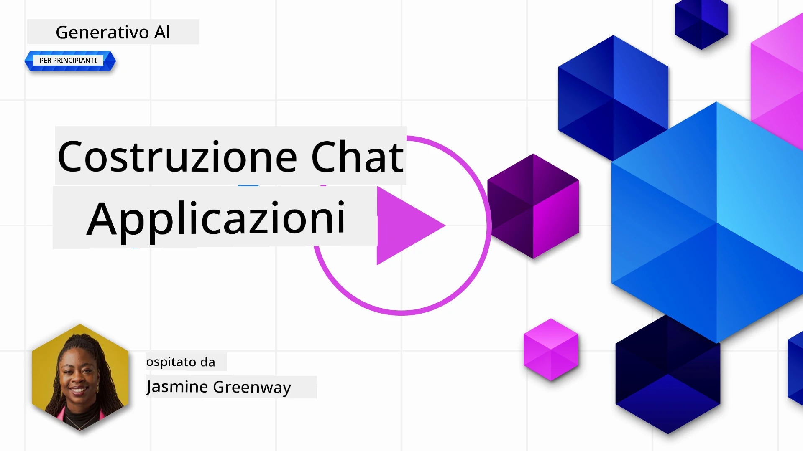
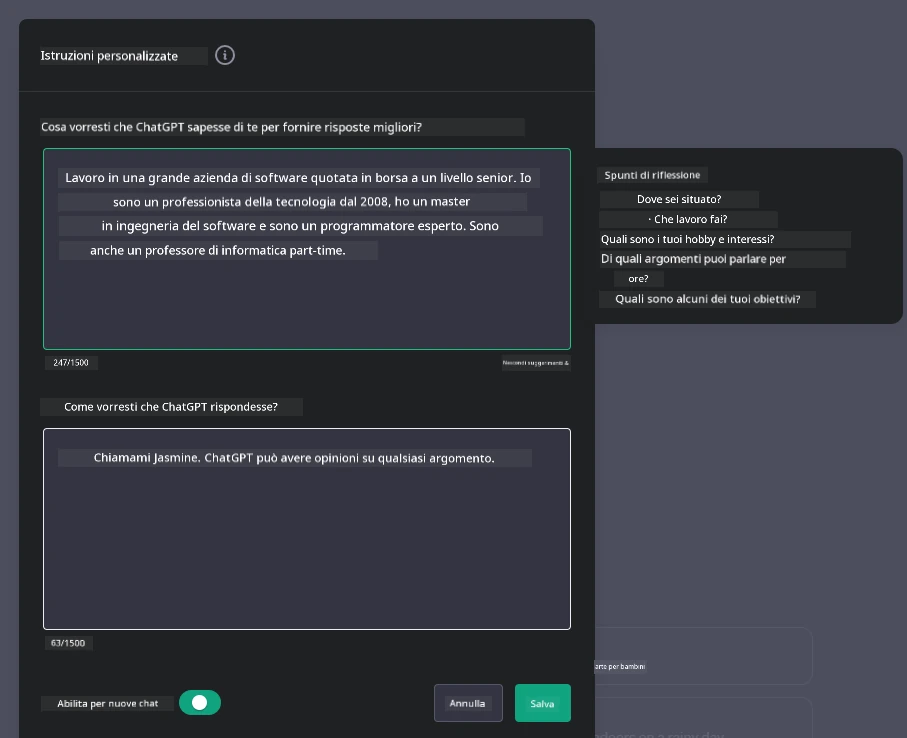

# Costruire Applicazioni di Chat Potenziate da AI Generativa

[](https://youtu.be/R9V0ZY1BEQo?si=IHuU-fS9YWT8s4sA)

> _(Clicca sull'immagine sopra per vedere il video di questa lezione)_

Ora che abbiamo visto come costruire app di generazione di testo, diamo un'occhiata alle applicazioni di chat.

Le applicazioni di chat sono diventate integrate nella nostra vita quotidiana, offrendo più di un semplice mezzo di conversazione informale. Sono parte integrante del servizio clienti, del supporto tecnico e anche di sistemi consulenziali sofisticati. È probabile che tu abbia ricevuto assistenza tramite un'applicazione di chat non molto tempo fa. Man mano che integriamo tecnologie più avanzate come l'AI generativa in queste piattaforme, aumenta la complessità così come le sfide.

Alcune domande a cui dobbiamo rispondere sono:

- **Costruzione dell'app**. Come costruiamo in modo efficiente e integriamo senza intoppi queste applicazioni potenziate dall'AI per casi d'uso specifici?
- **Monitoraggio**. Una volta distribuite, come possiamo monitorare e assicurarci che le applicazioni operino al massimo livello di qualità, sia in termini di funzionalità che di adesione ai [sei principi dell'AI responsabile](https://www.microsoft.com/ai/responsible-ai?WT.mc_id=academic-105485-koreyst)?

Man mano che ci addentriamo in un'epoca definita dall'automazione e da interazioni fluide tra uomo e macchina, diventa essenziale comprendere come l'AI generativa trasforma la portata, la profondità e l’adattabilità delle applicazioni di chat. Questa lezione esaminerà gli aspetti architetturali che supportano questi sistemi intricati, approfondirà le metodologie per il fine-tuning su compiti specifici del dominio e valuterà le metriche e le considerazioni pertinenti per garantire un'implementazione responsabile dell'AI.

## Introduzione

Questa lezione copre:

- Tecniche per costruire e integrare efficacemente applicazioni di chat.
- Come applicare personalizzazioni e fine-tuning alle applicazioni.
- Strategie e considerazioni per monitorare efficacemente le applicazioni di chat.

## Obiettivi di Apprendimento

Alla fine di questa lezione, sarai in grado di:

- Descrivere le considerazioni per costruire e integrare applicazioni di chat nei sistemi esistenti.
- Personalizzare le applicazioni di chat per casi d’uso specifici.
- Identificare le metriche chiave e le considerazioni per monitorare e mantenere efficacemente la qualità delle applicazioni di chat potenziate dall'AI.
- Garantire che le applicazioni di chat sfruttino l'AI responsabilmente.

## Integrazione dell'AI Generativa nelle Applicazioni di Chat

Elevare le applicazioni di chat con l'AI generativa non significa solo renderle più intelligenti; si tratta di ottimizzare la loro architettura, prestazioni e interfaccia utente per offrire un'esperienza di qualità. Questo comporta l'indagine delle fondamenta architetturali, integrazioni API e considerazioni sull’interfaccia utente. Questa sezione si propone di offrirti una roadmap completa per navigare questi paesaggi complessi, sia che tu li stia collegando a sistemi esistenti o li stia costruendo come piattaforme autonome.

Alla fine di questa sezione, sarai dotato delle competenze necessarie per costruire e incorporare efficacemente applicazioni di chat.

### Chatbot o Applicazione di Chat?

Prima di immergerci nella costruzione di applicazioni di chat, confrontiamo i "chatbot" con le "applicazioni di chat potenziate dall'AI", che servono a ruoli e funzionalità distinti. Lo scopo principale di un chatbot è automatizzare compiti conversazionali specifici, come rispondere a domande frequenti o tracciare un pacco. Di solito è governato da una logica basata su regole o algoritmi AI complessi. Al contrario, un’applicazione di chat potenziata dall'AI è un ambiente molto più ampio progettato per facilitare varie forme di comunicazione digitale, come chat testuali, vocali e video tra utenti umani. La sua caratteristica distintiva è l'integrazione di un modello di AI generativa che simula conversazioni sfumate e simili a quelle umane, generando risposte basate su un'ampia varietà di input e indizi contestuali. Un’applicazione di chat potenziata da AI generativa può impegnarsi in discussioni a dominio aperto, adattarsi a contesti conversazionali in evoluzione e persino produrre dialoghi creativi o complessi.

La tabella seguente evidenzia le differenze e somiglianze chiave per aiutarci a capire i loro ruoli unici nella comunicazione digitale.

| Chatbot                               | Applicazione di Chat Potenziata da AI Generativa        |
| ------------------------------------- | --------------------------------------               |
| Focalizzato su compiti e basato su regole | Consapevole del contesto                                 |
| Spesso integrato in sistemi più ampi      | Può ospitare uno o più chatbot                           |
| Limitato a funzioni programmate           | Incorpora modelli di AI generativa                       |
| Interazioni specializzate e strutturate   | Capace di discussioni a dominio aperto                   |

### Sfruttare funzionalità pre-costruite con SDK e API

Nell costruire un’applicazione di chat, una buona prima mossa è valutare ciò che è già disponibile. Usare SDK e API per costruire applicazioni di chat è una strategia vantaggiosa per diversi motivi. Integrando SDK e API ben documentati, posizioni strategicamente la tua applicazione per il successo a lungo termine, affrontando preoccupazioni di scalabilità e manutenzione.

- **Accelera il processo di sviluppo e riduce il carico**: Affidarsi a funzionalità pre-costruite invece del processo costoso di costruirle da te ti permette di concentrarti su altri aspetti della tua applicazione che potresti trovare più importanti, come la logica di business.
- **Migliore prestazione**: Quando costruisci una funzionalità da zero, ti chiederai alla fine "Come scala? Questa applicazione è capace di gestire un improvviso afflusso di utenti?" SDK e API ben mantenuti spesso hanno soluzioni incorporate per queste preoccupazioni.
- **Manutenzione più facile**: Aggiornamenti e miglioramenti sono più facili da gestire poiché la maggior parte delle API e SDK richiede semplicemente l’aggiornamento di una libreria quando viene rilasciata una versione nuova.
- **Accesso a tecnologie all’avanguardia**: Sfruttare modelli che sono stati finemente ottimizzati e addestrati su dataset estesi fornisce alla tua applicazione capacità di linguaggio naturale.

L’accesso alle funzionalità di un SDK o API solitamente implica ottenere l'autorizzazione a utilizzare i servizi forniti, che avviene spesso tramite l’uso di una chiave unica o un token di autenticazione. Utilizzeremo la libreria Python di OpenAI per esplorare come appare questo processo. Puoi anche provarlo in autonomia nel seguente [notebook per OpenAI](./python/oai-assignment.ipynb?WT.mc_id=academic-105485-koreyst) o [notebook per Azure OpenAI Services](./python/aoai-assignment.ipynb?WT.mc_id=academic-105485-koreys) per questa lezione.

```python
import os
from openai import OpenAI

API_KEY = os.getenv("OPENAI_API_KEY","")

client = OpenAI(
    api_key=API_KEY
    )

response = client.responses.create(model="gpt-4o-mini", input="Suggest two titles for an instructional lesson on chat applications for generative AI.", store=False)
print(response.output_text)
```

L’esempio sopra utilizza il modello GPT-4o mini con l’API Responses per completare il prompt, ma nota che la chiave API è impostata prima di farlo. Riceveresti un errore se non impostassi la chiave.

## Esperienza Utente (UX)

I principi generali di UX si applicano alle applicazioni di chat, ma qui ci sono alcune considerazioni aggiuntive particolarmente importanti a causa dei componenti di machine learning coinvolti.

- **Meccanismo per gestire l'ambiguità**: I modelli di AI generativa occasionalmente generano risposte ambigue. Una funzione che permette agli utenti di chiedere chiarimenti può essere utile se incontrano questo problema.
- **Conservazione del contesto**: I modelli AI generativi avanzati hanno la capacità di ricordare il contesto all’interno di una conversazione, cosa che può essere una risorsa necessaria per l’esperienza utente. Dare agli utenti la possibilità di controllare e gestire il contesto migliora l’esperienza utente, ma introduce il rischio di conservare informazioni sensibili degli utenti. Le considerazioni su quanto a lungo queste informazioni vengono conservate, come l’introduzione di una politica di conservazione, possono bilanciare la necessità di contesto con la privacy.
- **Personalizzazione**: Con la capacità di apprendere e adattarsi, i modelli AI offrono un’esperienza individualizzata per l’utente. Personalizzare l’esperienza utente tramite funzionalità come i profili utente non solo fa sentire l’utente compreso, ma aiuta anche nella ricerca di risposte specifiche, creando un’interazione più efficiente e soddisfacente.

Un esempio di personalizzazione è la funzione "Istruzioni personalizzate" in ChatGPT di OpenAI. Ti permette di fornire informazioni su di te che possono essere un contesto importante per i tuoi prompt. Ecco un esempio di istruzione personalizzata.



Questo "profilo" spinge ChatGPT a creare un piano di lezione sulle liste concatenate. Nota che ChatGPT tiene conto del fatto che l’utente possa voler un piano di lezione più approfondito basato sulla sua esperienza.


### Il Framework del Messaggio di Sistema di Microsoft per i Large Language Models

[Microsoft ha fornito linee guida](https://learn.microsoft.com/azure/ai-services/openai/concepts/system-message#define-the-models-output-format?WT.mc_id=academic-105485-koreyst) per scrivere messaggi di sistema efficaci nella generazione di risposte dai LLM, suddivise in 4 aree:

1. Definire per chi è il modello, così come le sue capacità e limitazioni.
2. Definire il formato di output del modello.
3. Fornire esempi specifici che dimostrano il comportamento previsto del modello.
4. Fornire ulteriori regole comportamentali di sicurezza.

### Accessibilità

Che un utente abbia disabilità visive, uditive, motorie o cognitive, un’applicazione di chat ben progettata dovrebbe essere utilizzabile da tutti. La seguente lista elenca caratteristiche specifiche mirate a migliorare l’accessibilità per varie disabilità dell’utente.

- **Caratteristiche per Disabilità Visive**: Temi ad alto contrasto e testo ridimensionabile, compatibilità con lettori di schermo.
- **Caratteristiche per Disabilità Uditive**: Funzioni di sintesi vocale e riconoscimento vocale, segnali visivi per notifiche audio.
- **Caratteristiche per Disabilità Motorie**: Supporto alla navigazione da tastiera, comandi vocali.
- **Caratteristiche per Disabilità Cognitive**: Opzioni di linguaggio semplificato.

## Personalizzazione e Fine-tuning per Modelli Linguistici Specifici di Dominio

Immagina un’applicazione di chat che capisce il gergo della tua azienda e anticipa le domande specifiche che la sua base di utenti fa comunemente. Ci sono un paio di approcci da menzionare:

- **Sfruttare i modelli DSL**. DSL sta per domain specific language (linguaggio specifico di dominio). Puoi utilizzare un cosiddetto modello DSL addestrato su un dominio specifico per comprenderne i concetti e gli scenari.
- **Applicare il fine-tuning**. Il fine-tuning è il processo di addestrare ulteriormente il modello con dati specifici.

## Personalizzazione: Usare un DSL

Sfruttare modelli di linguaggio specifici di dominio (modelli DSL) può migliorare il coinvolgimento dell’utente fornendo interazioni specializzate e contestualmente rilevanti. È un modello addestrato o fine-tuned per comprendere e generare testo relativo a un campo, industria o soggetto specifico. Le opzioni per usare un modello DSL possono variare dall’addestrarne uno da zero, all’uso di modelli preesistenti tramite SDK e API. Un’altra opzione è il fine-tuning, che consiste nel prendere un modello pre-addestrato esistente e adattarlo a un dominio specifico.

## Personalizzazione: Applicare il fine-tuning

Il fine-tuning è spesso considerato quando un modello pre-addestrato non è sufficiente in un dominio specializzato o in un compito specifico.

Per esempio, le questioni mediche sono complesse e richiedono molto contesto. Quando un medico diagnostica un paziente, si basa su vari fattori come stile di vita o condizioni preesistenti, e può anche fare affidamento su riviste mediche recenti per convalidare la diagnosi. In scenari così sfumati, un'applicazione di chat AI generica non può essere una fonte affidabile.

### Scenario: un'applicazione medica

Considera un’applicazione di chat progettata per assistere i professionisti medici fornendo riferimenti rapidi a linee guida per trattamenti, interazioni farmacologiche o risultati di ricerche recenti.

Un modello generalista potrebbe essere adeguato per rispondere a domande mediche di base o fornire consigli generali, ma potrebbe avere difficoltà con:

- **Casi altamente specifici o complessi**. Per esempio, un neurologo potrebbe chiedere all'applicazione: "Quali sono le migliori pratiche attuali per gestire l'epilessia resistente ai farmaci nei pazienti pediatrici?"
- **Mancanza di aggiornamenti recenti**. Un modello generalista potrebbe faticare a fornire una risposta aggiornata che incorpori gli ultimi progressi in neurologia e farmacologia.

In situazioni come queste, il fine-tuning del modello con un dataset medico specializzato può migliorare significativamente la sua capacità di gestire queste intricate richieste mediche in modo più accurato e affidabile. Questo richiede l'accesso a un dataset ampio e rilevante che rappresenti le sfide e le domande specifiche del dominio da affrontare.

## Considerazioni per un’Esperienza di Chat AI di Alta Qualità

Questa sezione illustra i criteri per applicazioni di chat "di alta qualità", che includono la raccolta di metriche utili e l’adesione a un framework che sfrutta responsabilmente la tecnologia AI.

### Metriche Chiave

Per mantenere alte prestazioni di un’applicazione, è essenziale tenere traccia di metriche chiave e considerazioni. Queste misurazioni non solo assicurano la funzionalità dell'applicazione, ma valutano anche la qualità del modello AI e l’esperienza utente. Di seguito una lista che copre metriche base, AI ed esperienza utente da considerare.

| Metrica                     | Definizione                                                                                                             | Considerazioni per lo Sviluppatore di Chat                          |
| --------------------------- | ---------------------------------------------------------------------------------------------------------------------- | ------------------------------------------------------------------ |
| **Tempo di attività (Uptime)**| Misura il tempo in cui l’applicazione è operativa e accessibile dagli utenti.                                            | Come ridurrai al minimo i tempi di inattività?                     |
| **Tempo di risposta**        | Il tempo impiegato dall’applicazione per rispondere a una richiesta dell’utente.                                         | Come puoi ottimizzare l’elaborazione delle richieste per migliorare i tempi di risposta? |
| **Precisione**               | Il rapporto tra predizioni positive vere e il totale delle predizioni positive.                                          | Come convaliderai la precisione del tuo modello?                  |
| **Richiamo (Sensibilità)**   | Il rapporto tra predizioni positive vere e il numero reale di positivi.                                                 | Come misurerai e migliorerai il richiamo?                          |
| **Punteggio F1**             | La media armonica di precisione e richiamo che bilancia il compromesso tra entrambi.                                    | Qual è il tuo punteggio F1 obiettivo? Come bilancerai precisione e richiamo? |
| **Perplessità**              | Misura quanto bene la distribuzione di probabilità prevista dal modello si allinea con la distribuzione reale dei dati. | Come ridurrai la perplessità?                                      |
| **Metriche di Soddisfazione Utente** | Misura la percezione dell’utente dell’applicazione. Spesso raccolta tramite sondaggi.                                      | Con quale frequenza raccoglierai feedback degli utenti? Come ti adeguerai in base a essi? |
| **Tasso di errore**          | La frequenza con cui il modello commette errori nella comprensione o nell’output.                                       | Quali strategie hai in atto per ridurre i tassi di errore?        |
| **Cicli di ri-allenamento** | La frequenza con cui il modello viene aggiornato per incorporare nuovi dati e intuizioni.                                | Quanto spesso ri-allenarai il modello? Quali eventi triggerano un ciclo di ri-allenamento? |

| **Rilevamento delle anomalie**         | Strumenti e tecniche per identificare modelli insoliti che non corrispondono al comportamento previsto.                        | Come risponderai alle anomalie?                                        |

### Implementare pratiche di AI responsabile nelle applicazioni di chat

L'approccio di Microsoft all'AI responsabile ha identificato sei principi che dovrebbero guidare lo sviluppo e l'uso dell'AI. Di seguito i principi, la loro definizione e le considerazioni che uno sviluppatore di chat dovrebbe tenere presenti e perché dovrebbero prenderli sul serio.

| Principi             | Definizione di Microsoft                                | Considerazioni per lo sviluppatore di chat                              | Perché è importante                                                                      |
| ---------------------- | ----------------------------------------------------- | ---------------------------------------------------------------------- | ---------------------------------------------------------------------------------------- |
| Equità               | I sistemi AI dovrebbero trattare tutte le persone equamente.            | Assicurarsi che l'applicazione di chat non discrimini in base ai dati degli utenti.  | Per costruire fiducia e inclusività tra gli utenti; evita implicazioni legali.            |
| Affidabilità e sicurezza | I sistemi AI dovrebbero funzionare in modo affidabile e sicuro.        | Implementare test e meccanismi di sicurezza per minimizzare errori e rischi.         | Garantisce la soddisfazione degli utenti e previene potenziali danni.                     |
| Privacy e sicurezza   | I sistemi AI dovrebbero essere sicuri e rispettare la privacy.      | Implementare crittografia avanzata e misure di protezione dei dati.              | Per salvaguardare i dati sensibili degli utenti e conformarsi alle leggi sulla privacy.   |
| Inclusività          | I sistemi AI dovrebbero responsabilizzare tutti e coinvolgere le persone. | Progettare UI/UX accessibili e facili da usare per pubblici diversificati. | Garantisce che un'ampia varietà di persone possa usare efficacemente l'applicazione.     |
| Trasparenza           | I sistemi AI dovrebbero essere comprensibili.                  | Fornire documentazione chiara e motivazioni per le risposte dell'AI.            | Gli utenti sono più propensi a fidarsi di un sistema se possono capire come vengono prese le decisioni. |
| Responsabilità         | Le persone dovrebbero essere responsabili per i sistemi AI.          | Stabilire un processo chiaro per l'audit e il miglioramento delle decisioni dell'AI.     | Permette miglioramenti continui e misure correttive in caso di errori.                    |

## Compito

Vedi [assignment](../../../07-building-chat-applications/python). Ti guiderà attraverso una serie di esercizi, dal eseguire le prime chat prompt, classificare e riassumere testi e altro ancora. Nota che i compiti sono disponibili in diversi linguaggi di programmazione!

## Ottimo lavoro! Continua il percorso

Dopo aver completato questa lezione, dai un'occhiata alla nostra [collezione di apprendimento sull'AI generativa](https://aka.ms/genai-collection?WT.mc_id=academic-105485-koreyst) per continuare a migliorare la tua conoscenza sull'AI generativa!

Vai alla Lezione 8 per vedere come puoi iniziare a [costruire applicazioni di ricerca](../08-building-search-applications/README.md?WT.mc_id=academic-105485-koreyst)!

---

<!-- CO-OP TRANSLATOR DISCLAIMER START -->
**Disclaimer**:
Questo documento è stato tradotto utilizzando il servizio di traduzione AI [Co-op Translator](https://github.com/Azure/co-op-translator). Sebbene ci impegniamo per garantire la precisione, si prega di notare che le traduzioni automatizzate possono contenere errori o imprecisioni. Il documento originale nella sua lingua nativa deve essere considerato la fonte autorevole. Per informazioni critiche, si raccomanda una traduzione professionale effettuata da un essere umano. Non siamo responsabili per eventuali malintesi o interpretazioni errate derivanti dall’uso di questa traduzione.
<!-- CO-OP TRANSLATOR DISCLAIMER END -->