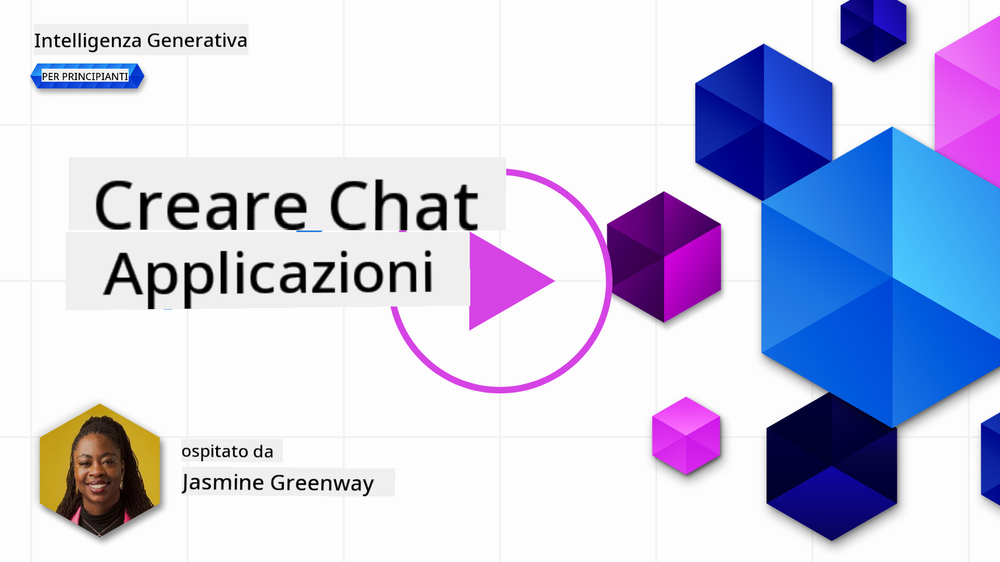

<!--
CO_OP_TRANSLATOR_METADATA:
{
  "original_hash": "a5308963a56cfbad2d73b0fa99fe84b3",
  "translation_date": "2025-10-18T00:49:05+00:00",
  "source_file": "07-building-chat-applications/README.md",
  "language_code": "it"
}
-->
# Creare Applicazioni Chat Potenziate dall'AI Generativa

[](https://youtu.be/R9V0ZY1BEQo?si=IHuU-fS9YWT8s4sA)

> _(Clicca sull'immagine sopra per vedere il video di questa lezione)_

Ora che abbiamo visto come costruire applicazioni per la generazione di testo, diamo un'occhiata alle applicazioni di chat.

Le applicazioni di chat sono diventate parte integrante della nostra vita quotidiana, offrendo molto più di un semplice mezzo di conversazione informale. Sono elementi fondamentali del servizio clienti, del supporto tecnico e persino di sistemi di consulenza sofisticati. Probabilmente hai ricevuto aiuto da un'applicazione di chat non molto tempo fa. Con l'integrazione di tecnologie più avanzate come l'AI generativa in queste piattaforme, aumenta la complessità e anche le sfide.

Alcune domande che dobbiamo affrontare sono:

- **Creare l'app**. Come possiamo costruire e integrare in modo efficiente queste applicazioni potenziate dall'AI per casi d'uso specifici?
- **Monitoraggio**. Una volta distribuite, come possiamo monitorare e garantire che le applicazioni funzionino al massimo livello di qualità, sia in termini di funzionalità che di rispetto dei [sei principi dell'AI responsabile](https://www.microsoft.com/ai/responsible-ai?WT.mc_id=academic-105485-koreyst)?

Man mano che ci addentriamo in un'era definita dall'automazione e dalle interazioni fluide tra uomo e macchina, comprendere come l'AI generativa trasformi la portata, la profondità e l'adattabilità delle applicazioni di chat diventa essenziale. Questa lezione indagherà gli aspetti dell'architettura che supportano questi sistemi complessi, approfondirà le metodologie per adattarli a compiti specifici e valuterà le metriche e le considerazioni pertinenti per garantire un'implementazione responsabile dell'AI.

## Introduzione

Questa lezione copre:

- Tecniche per costruire e integrare applicazioni di chat in modo efficiente.
- Come applicare personalizzazioni e ottimizzazioni alle applicazioni.
- Strategie e considerazioni per monitorare efficacemente le applicazioni di chat.

## Obiettivi di Apprendimento

Alla fine di questa lezione, sarai in grado di:

- Descrivere le considerazioni per costruire e integrare applicazioni di chat nei sistemi esistenti.
- Personalizzare le applicazioni di chat per casi d'uso specifici.
- Identificare le metriche chiave e le considerazioni per monitorare e mantenere efficacemente la qualità delle applicazioni di chat potenziate dall'AI.
- Garantire che le applicazioni di chat utilizzino l'AI in modo responsabile.

## Integrare l'AI Generativa nelle Applicazioni di Chat

Migliorare le applicazioni di chat attraverso l'AI generativa non significa solo renderle più intelligenti; si tratta di ottimizzare la loro architettura, prestazioni e interfaccia utente per offrire un'esperienza di qualità. Questo implica indagare le fondamenta architettoniche, le integrazioni API e le considerazioni sull'interfaccia utente. Questa sezione mira a offrirti una roadmap completa per navigare in questi paesaggi complessi, sia che tu stia integrandole in sistemi esistenti sia che tu stia costruendo piattaforme autonome.

Alla fine di questa sezione, avrai le competenze necessarie per costruire e incorporare applicazioni di chat in modo efficiente.

### Chatbot o Applicazione di Chat?

Prima di immergerci nella creazione di applicazioni di chat, confrontiamo i "chatbot" con le "applicazioni di chat potenziate dall'AI", che svolgono ruoli e funzionalità distinti. Lo scopo principale di un chatbot è automatizzare compiti conversazionali specifici, come rispondere a domande frequenti o tracciare un pacco. Di solito è governato da logiche basate su regole o algoritmi AI complessi. Al contrario, un'applicazione di chat potenziata dall'AI è un ambiente molto più ampio progettato per facilitare varie forme di comunicazione digitale, come chat testuali, vocali e video tra utenti umani. La sua caratteristica distintiva è l'integrazione di un modello di AI generativa che simula conversazioni sfumate e simili a quelle umane, generando risposte basate su una vasta gamma di input e segnali contestuali. Un'applicazione di chat potenziata dall'AI può impegnarsi in discussioni aperte, adattarsi a contesti conversazionali in evoluzione e persino produrre dialoghi creativi o complessi.

La tabella seguente evidenzia le principali differenze e somiglianze per aiutarci a comprendere i loro ruoli unici nella comunicazione digitale.

| Chatbot                               | Applicazione di Chat Potenziata dall'AI Generativa |
| ------------------------------------- | ------------------------------------------------- |
| Focalizzato su compiti specifici e basato su regole | Consapevole del contesto                          |
| Spesso integrato in sistemi più grandi | Può ospitare uno o più chatbot                   |
| Limitato a funzioni programmate       | Incorpora modelli di AI generativa               |
| Interazioni specializzate e strutturate | Capace di discussioni aperte                     |

### Sfruttare funzionalità predefinite con SDK e API

Quando si costruisce un'applicazione di chat, un ottimo primo passo è valutare ciò che è già disponibile. Utilizzare SDK e API per costruire applicazioni di chat è una strategia vantaggiosa per una varietà di motivi. Integrando SDK e API ben documentati, posizioni strategicamente la tua applicazione per un successo a lungo termine, affrontando preoccupazioni relative alla scalabilità e alla manutenzione.

- **Accelera il processo di sviluppo e riduce i costi**: Affidarsi a funzionalità predefinite invece di costruirle da zero ti consente di concentrarti su altri aspetti della tua applicazione che potresti ritenere più importanti, come la logica aziendale.
- **Prestazioni migliori**: Quando si costruisce una funzionalità da zero, ti chiederai inevitabilmente "Come si scala? Questa applicazione è in grado di gestire un improvviso afflusso di utenti?" Gli SDK e le API ben mantenuti spesso hanno soluzioni integrate per queste preoccupazioni.
- **Manutenzione più semplice**: Gli aggiornamenti e i miglioramenti sono più facili da gestire poiché la maggior parte delle API e degli SDK richiede semplicemente un aggiornamento della libreria quando viene rilasciata una nuova versione.
- **Accesso alla tecnologia all'avanguardia**: Sfruttare modelli che sono stati ottimizzati e addestrati su dataset estesi fornisce alla tua applicazione capacità di linguaggio naturale.

Accedere alle funzionalità di un SDK o API di solito comporta l'ottenimento dell'autorizzazione per utilizzare i servizi forniti, spesso tramite l'uso di una chiave unica o di un token di autenticazione. Utilizzeremo la Libreria Python di OpenAI per esplorare come appare questo processo. Puoi anche provarlo da solo nel seguente [notebook per OpenAI](./python/oai-assignment.ipynb?WT.mc_id=academic-105485-koreyst) o nel [notebook per Azure OpenAI Services](./python/aoai-assignment.ipynb?WT.mc_id=academic-105485-koreys) per questa lezione.

```python
import os
from openai import OpenAI

API_KEY = os.getenv("OPENAI_API_KEY","")

client = OpenAI(
    api_key=API_KEY
    )

chat_completion = client.chat.completions.create(model="gpt-3.5-turbo", messages=[{"role": "user", "content": "Suggest two titles for an instructional lesson on chat applications for generative AI."}])
```

L'esempio sopra utilizza il modello GPT-3.5 Turbo per completare il prompt, ma nota che la chiave API viene impostata prima di farlo. Riceveresti un errore se non impostassi la chiave.

## Esperienza Utente (UX)

I principi generali di UX si applicano alle applicazioni di chat, ma ci sono alcune considerazioni aggiuntive che diventano particolarmente importanti a causa dei componenti di apprendimento automatico coinvolti.

- **Meccanismo per affrontare l'ambiguità**: I modelli di AI generativa occasionalmente generano risposte ambigue. Una funzione che consente agli utenti di chiedere chiarimenti può essere utile nel caso in cui si trovino di fronte a questo problema.
- **Conservazione del contesto**: I modelli avanzati di AI generativa hanno la capacità di ricordare il contesto all'interno di una conversazione, il che può essere un vantaggio necessario per l'esperienza utente. Dare agli utenti la possibilità di controllare e gestire il contesto migliora l'esperienza utente, ma introduce il rischio di conservare informazioni sensibili degli utenti. Le considerazioni su quanto tempo queste informazioni vengono conservate, come l'introduzione di una politica di conservazione, possono bilanciare la necessità di contesto con la privacy.
- **Personalizzazione**: Con la capacità di apprendere e adattarsi, i modelli di AI offrono un'esperienza individualizzata per l'utente. Personalizzare l'esperienza utente attraverso funzionalità come i profili utente non solo fa sentire l'utente compreso, ma aiuta anche nella ricerca di risposte specifiche, creando un'interazione più efficiente e soddisfacente.

Un esempio di personalizzazione è l'impostazione "Istruzioni personalizzate" in ChatGPT di OpenAI. Ti consente di fornire informazioni su di te che potrebbero essere un contesto importante per i tuoi prompt. Ecco un esempio di istruzione personalizzata.


Questo "profilo" invita ChatGPT a creare un piano di lezione sui linked list. Nota che ChatGPT tiene conto del fatto che l'utente potrebbe desiderare un piano di lezione più approfondito basato sulla sua esperienza.


### Framework di Messaggi di Sistema di Microsoft per Modelli di Linguaggio Avanzati

[Microsoft ha fornito indicazioni](https://learn.microsoft.com/azure/ai-services/openai/concepts/system-message#define-the-models-output-format?WT.mc_id=academic-105485-koreyst) per scrivere messaggi di sistema efficaci quando si generano risposte dai LLM suddivise in 4 aree:

1. Definire per chi è il modello, così come le sue capacità e limitazioni.
2. Definire il formato di output del modello.
3. Fornire esempi specifici che dimostrano il comportamento previsto del modello.
4. Fornire ulteriori linee guida comportamentali.

### Accessibilità

Che un utente abbia disabilità visive, uditive, motorie o cognitive, un'applicazione di chat ben progettata dovrebbe essere utilizzabile da tutti. L'elenco seguente suddivide le funzionalità specifiche mirate a migliorare l'accessibilità per vari tipi di disabilità.

- **Funzionalità per disabilità visive**: Temi ad alto contrasto e testo ridimensionabile, compatibilità con lettori di schermo.
- **Funzionalità per disabilità uditive**: Funzioni di testo in voce e voce in testo, segnali visivi per notifiche audio.
- **Funzionalità per disabilità motorie**: Supporto per la navigazione tramite tastiera, comandi vocali.
- **Funzionalità per disabilità cognitive**: Opzioni di linguaggio semplificato.

## Personalizzazione e Ottimizzazione per Modelli di Linguaggio Specifici per Dominio

Immagina un'applicazione di chat che comprenda il gergo della tua azienda e anticipi le domande specifiche che il suo pubblico di utenti pone comunemente. Ci sono un paio di approcci che vale la pena menzionare:

- **Sfruttare i modelli DSL**. DSL sta per linguaggio specifico del dominio. Puoi sfruttare un cosiddetto modello DSL addestrato su un dominio specifico per comprendere i suoi concetti e scenari.
- **Applicare l'ottimizzazione**. L'ottimizzazione è il processo di ulteriore addestramento del tuo modello con dati specifici.

## Personalizzazione: Utilizzare un DSL

Sfruttare modelli di linguaggio specifici per dominio (DSL Models) può migliorare l'engagement degli utenti fornendo interazioni specializzate e contestualmente rilevanti. È un modello che è stato addestrato o ottimizzato per comprendere e generare testo relativo a un campo, industria o argomento specifico. Le opzioni per utilizzare un modello DSL possono variare dall'addestrarne uno da zero, all'utilizzo di modelli preesistenti tramite SDK e API. Un'altra opzione è l'ottimizzazione, che comporta l'adattamento di un modello pre-addestrato per un dominio specifico.

## Personalizzazione: Applicare l'ottimizzazione

L'ottimizzazione è spesso considerata quando un modello pre-addestrato non è sufficiente in un dominio specializzato o per un compito specifico.

Ad esempio, le domande mediche sono complesse e richiedono molto contesto. Quando un professionista medico diagnostica un paziente, si basa su una varietà di fattori come lo stile di vita o le condizioni preesistenti, e può persino fare affidamento su riviste mediche recenti per convalidare la sua diagnosi. In scenari così sfumati, un'applicazione di chat AI generica non può essere una fonte affidabile.

### Scenario: un'applicazione medica

Considera un'applicazione di chat progettata per assistere i medici fornendo riferimenti rapidi a linee guida sui trattamenti, interazioni farmacologiche o risultati di ricerche recenti.

Un modello generico potrebbe essere adeguato per rispondere a domande mediche di base o fornire consigli generali, ma potrebbe avere difficoltà con quanto segue:

- **Casi altamente specifici o complessi**. Ad esempio, un neurologo potrebbe chiedere all'applicazione: "Quali sono le migliori pratiche attuali per gestire l'epilessia resistente ai farmaci nei pazienti pediatrici?"
- **Mancanza di avanzamenti recenti**. Un modello generico potrebbe avere difficoltà a fornire una risposta aggiornata che incorpori gli avanzamenti più recenti in neurologia e farmacologia.

In casi come questi, ottimizzare il modello con un dataset medico specializzato può migliorare significativamente la sua capacità di gestire queste complesse richieste mediche in modo più accurato e affidabile. Questo richiede l'accesso a un dataset ampio e rilevante che rappresenti le sfide e le domande specifiche del dominio che devono essere affrontate.

## Considerazioni per un'Esperienza di Chat AI di Alta Qualità

Questa sezione delinea i criteri per applicazioni di chat "di alta qualità", che includono la cattura di metriche azionabili e l'adesione a un framework che sfrutta responsabilmente la tecnologia AI.

### Metriche Chiave

Per mantenere le prestazioni di alta qualità di un'applicazione, è essenziale tenere traccia di metriche chiave e considerazioni. Queste misurazioni non solo garantiscono la funzionalità dell'applicazione, ma valutano anche la qualità del modello AI e dell'esperienza utente. Di seguito è riportato un elenco che copre metriche di base, AI e esperienza utente da considerare.

| Metrica                        | Definizione                                                                                                             | Considerazioni per lo Sviluppatore della Chat                              |
| ----------------------------- | ---------------------------------------------------------------------------------------------------------------------- | ------------------------------------------------------------------------- |
| **Uptime**                    | Misura il tempo in cui l'applicazione è operativa e accessibile dagli utenti.                                           | Come minimizzerai i tempi di inattività?                                  |
| **Tempo di Risposta**         | Il tempo impiegato dall'applicazione per rispondere alla query di un utente.                                            | Come puoi ottimizzare l'elaborazione delle query per migliorare il tempo di risposta? |
| **Precisione**                | Il rapporto tra le previsioni positive vere e il numero totale di previsioni positive.                                  | Come validerai la precisione del tuo modello?                             |
| **Richiamo (Sensibilità)**    | Il rapporto tra le previsioni positive vere e il numero effettivo di positivi.                                          | Come misurerai e migliorerai il richiamo?                                 |
| **F1 Score**                  | La media armonica di precisione e richiamo, che bilancia il compromesso tra entrambi.                                   | Qual è il tuo obiettivo di F1 Score? Come bilancerai precisione e richiamo? |
| **Perplessità**               | Misura quanto bene la distribuzione di probabilità prevista dal modello si allinea con la distribuzione effettiva dei dati. | Come minimizzerai la perplessità?                                         |
| **Metriche di Soddisfazione Utente** | Misura la percezione dell'utente sull'applicazione. Spesso catturata tramite sondaggi.                              | Con quale frequenza raccoglierai feedback dagli utenti? Come ti adatterai in base a esso? |
| **Tasso di Errore**           | La frequenza con cui il modello commette errori nella comprensione o nell'output.                                       | Quali strategie hai in atto per ridurre i tassi di errore?                |
| **Cicli di Riaddestramento**  | La frequenza con cui il modello viene aggiornato per incorporare nuovi dati e intuizioni.                               | Con quale frequenza riaddestrerai il modello? Cosa innesca un ciclo di riaddestramento? |
| **Rilevamento delle anomalie** | Strumenti e tecniche per identificare schemi insoliti che non si conformano al comportamento previsto. | Come risponderai alle anomalie? |

### Implementare pratiche di AI responsabile nelle applicazioni di chat

L'approccio di Microsoft all'AI responsabile ha identificato sei principi che dovrebbero guidare lo sviluppo e l'uso dell'AI. Di seguito sono riportati i principi, la loro definizione e le considerazioni che uno sviluppatore di chat dovrebbe tenere a mente, oltre al motivo per cui sono importanti.

| Principi                | Definizione di Microsoft                              | Considerazioni per lo sviluppatore di chat                             | Perché è importante                                                                      |
| ----------------------- | ---------------------------------------------------- | ---------------------------------------------------------------------- | --------------------------------------------------------------------------------------- |
| Equità                 | I sistemi di AI dovrebbero trattare tutte le persone in modo equo. | Assicurarsi che l'applicazione di chat non discrimini in base ai dati degli utenti. | Per costruire fiducia e inclusività tra gli utenti; evita implicazioni legali.          |
| Affidabilità e Sicurezza | I sistemi di AI dovrebbero funzionare in modo affidabile e sicuro. | Implementare test e misure di sicurezza per ridurre al minimo errori e rischi. | Garantisce la soddisfazione degli utenti e previene potenziali danni.                   |
| Privacy e Sicurezza     | I sistemi di AI dovrebbero essere sicuri e rispettare la privacy. | Implementare una forte crittografia e misure di protezione dei dati.   | Per proteggere i dati sensibili degli utenti e rispettare le leggi sulla privacy.        |
| Inclusività             | I sistemi di AI dovrebbero favorire tutti e coinvolgere le persone. | Progettare UI/UX accessibili e facili da usare per un pubblico diversificato. | Garantisce che un'ampia gamma di persone possa utilizzare l'applicazione in modo efficace. |
| Trasparenza             | I sistemi di AI dovrebbero essere comprensibili.     | Fornire documentazione chiara e spiegazioni per le risposte dell'AI.   | Gli utenti sono più propensi a fidarsi di un sistema se possono capire come vengono prese le decisioni. |
| Responsabilità          | Le persone dovrebbero essere responsabili dei sistemi di AI. | Stabilire un processo chiaro per audit e miglioramento delle decisioni dell'AI. | Consente miglioramenti continui e misure correttive in caso di errori.                  |

## Compito

Consulta [compito](../../../07-building-chat-applications/python). Ti guiderà attraverso una serie di esercizi, dal tuo primo prompt di chat alla classificazione e sintesi del testo e altro ancora. Nota che i compiti sono disponibili in diverse lingue di programmazione!

## Ottimo lavoro! Continua il tuo percorso

Dopo aver completato questa lezione, dai un'occhiata alla nostra [collezione di apprendimento sull'AI generativa](https://aka.ms/genai-collection?WT.mc_id=academic-105485-koreyst) per continuare a migliorare le tue conoscenze sull'AI generativa!

Vai alla Lezione 8 per scoprire come iniziare a [costruire applicazioni di ricerca](../08-building-search-applications/README.md?WT.mc_id=academic-105485-koreyst)!

---

**Disclaimer**:  
Questo documento è stato tradotto utilizzando il servizio di traduzione AI [Co-op Translator](https://github.com/Azure/co-op-translator). Sebbene ci impegniamo per garantire l'accuratezza, si prega di notare che le traduzioni automatiche potrebbero contenere errori o imprecisioni. Il documento originale nella sua lingua nativa dovrebbe essere considerato la fonte autorevole. Per informazioni critiche, si raccomanda una traduzione professionale umana. Non siamo responsabili per eventuali incomprensioni o interpretazioni errate derivanti dall'uso di questa traduzione.