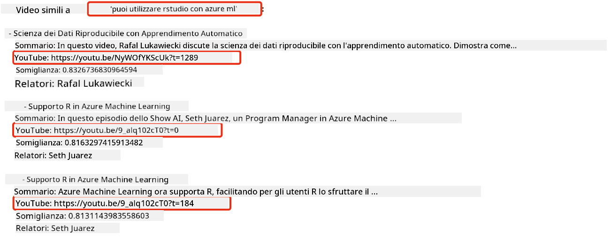
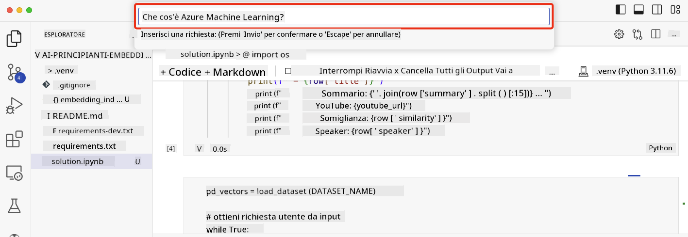

<!--
CO_OP_TRANSLATOR_METADATA:
{
  "original_hash": "d46aad0917a1a342d613e2c13d457da5",
  "translation_date": "2025-05-19T18:28:38+00:00",
  "source_file": "08-building-search-applications/README.md",
  "language_code": "it"
}
-->
# Costruire un'Applicazione di Ricerca

[](https://aka.ms/gen-ai-lesson8-gh?WT.mc_id=academic-105485-koreyst)

> > _Clicca sull'immagine sopra per vedere il video di questa lezione_

Gli LLM offrono più delle semplici chatbot e generazione di testo. È anche possibile costruire applicazioni di ricerca utilizzando gli Embeddings. Gli Embeddings sono rappresentazioni numeriche dei dati, noti anche come vettori, e possono essere utilizzati per la ricerca semantica dei dati.

In questa lezione, costruirai un'applicazione di ricerca per la nostra startup educativa. La nostra startup è un'organizzazione no-profit che fornisce istruzione gratuita agli studenti nei paesi in via di sviluppo. La nostra startup ha un gran numero di video su YouTube che gli studenti possono utilizzare per apprendere sull'AI. La nostra startup desidera costruire un'applicazione di ricerca che permetta agli studenti di cercare un video su YouTube digitando una domanda.

Ad esempio, uno studente potrebbe digitare 'Cosa sono i Jupyter Notebooks?' o 'Cos'è Azure ML' e l'applicazione di ricerca restituirà un elenco di video su YouTube pertinenti alla domanda e, ancora meglio, l'applicazione di ricerca restituirà un link al punto del video dove si trova la risposta alla domanda.

## Introduzione

In questa lezione, tratteremo:

- Ricerca semantica vs Ricerca per parole chiave.
- Cosa sono i Text Embeddings.
- Creare un Indice di Text Embeddings.
- Cercare in un Indice di Text Embeddings.

## Obiettivi di Apprendimento

Dopo aver completato questa lezione, sarai in grado di:

- Distinguere tra ricerca semantica e ricerca per parole chiave.
- Spiegare cosa sono i Text Embeddings.
- Creare un'applicazione utilizzando gli Embeddings per cercare dati.

## Perché costruire un'applicazione di ricerca?

Creare un'applicazione di ricerca ti aiuterà a capire come utilizzare gli Embeddings per cercare dati. Imparerai anche a costruire un'applicazione di ricerca che può essere utilizzata dagli studenti per trovare informazioni rapidamente.

La lezione include un Indice di Embedding delle trascrizioni di YouTube per il canale YouTube Microsoft [AI Show](https://www.youtube.com/playlist?list=PLlrxD0HtieHi0mwteKBOfEeOYf0LJU4O1). L'AI Show è un canale YouTube che ti insegna sull'AI e il machine learning. L'Indice di Embedding contiene gli Embeddings per ciascuna delle trascrizioni di YouTube fino a ottobre 2023. Utilizzerai l'Indice di Embedding per costruire un'applicazione di ricerca per la nostra startup. L'applicazione di ricerca restituisce un link al punto del video dove si trova la risposta alla domanda. Questo è un ottimo modo per gli studenti di trovare rapidamente le informazioni di cui hanno bisogno.

Il seguente è un esempio di una query semantica per la domanda 'puoi usare rstudio con azure ml?'. Controlla l'url di YouTube, vedrai che l'url contiene un timestamp che ti porta al punto del video dove si trova la risposta alla domanda.



## Cos'è la ricerca semantica?

Ora potresti chiederti, cos'è la ricerca semantica? La ricerca semantica è una tecnica di ricerca che utilizza la semantica, o il significato, delle parole in una query per restituire risultati pertinenti.

Ecco un esempio di ricerca semantica. Supponiamo che tu stia cercando di comprare un'auto, potresti cercare 'la mia auto dei sogni', la ricerca semantica capisce che non stai `dreaming` su un'auto, ma piuttosto stai cercando di comprare la tua `ideal` auto. La ricerca semantica comprende la tua intenzione e restituisce risultati pertinenti. L'alternativa è `keyword search` che cercherebbe letteralmente sogni sulle auto e spesso restituisce risultati irrilevanti.

## Cosa sono i Text Embeddings?

[I text embeddings](https://en.wikipedia.org/wiki/Word_embedding?WT.mc_id=academic-105485-koreyst) sono una tecnica di rappresentazione del testo utilizzata nell'[elaborazione del linguaggio naturale](https://en.wikipedia.org/wiki/Natural_language_processing?WT.mc_id=academic-105485-koreyst). I text embeddings sono rappresentazioni numeriche semantiche del testo. Gli Embeddings vengono utilizzati per rappresentare i dati in un modo che sia facile da comprendere per una macchina. Esistono molti modelli per costruire text embeddings, in questa lezione ci concentreremo sulla generazione di embeddings utilizzando il Modello di Embedding di OpenAI.

Ecco un esempio, immagina che il seguente testo sia in una trascrizione di uno degli episodi sul canale YouTube AI Show:

```text
Today we are going to learn about Azure Machine Learning.
```

Passeremmo il testo all'API di Embedding di OpenAI e restituirebbe il seguente embedding composto da 1536 numeri, noto anche come vettore. Ogni numero nel vettore rappresenta un aspetto diverso del testo. Per brevità, ecco i primi 10 numeri nel vettore.

```python
[-0.006655829958617687, 0.0026128944009542465, 0.008792596869170666, -0.02446001023054123, -0.008540431968867779, 0.022071078419685364, -0.010703742504119873, 0.003311325330287218, -0.011632772162556648, -0.02187200076878071, ...]
```

## Come viene creato l'Indice di Embedding?

L'Indice di Embedding per questa lezione è stato creato con una serie di script Python. Troverai gli script insieme alle istruzioni nel [README](./scripts/README.md?WT.mc_id=academic-105485-koreyst) nella cartella 'scripts' per questa lezione. Non è necessario eseguire questi script per completare questa lezione poiché l'Indice di Embedding è fornito per te.

Gli script eseguono le seguenti operazioni:

1. Viene scaricata la trascrizione di ciascun video YouTube nella playlist [AI Show](https://www.youtube.com/playlist?list=PLlrxD0HtieHi0mwteKBOfEeOYf0LJU4O1).
2. Utilizzando le [Funzioni di OpenAI](https://learn.microsoft.com/azure/ai-services/openai/how-to/function-calling?WT.mc_id=academic-105485-koreyst), viene tentato di estrarre il nome del relatore dai primi 3 minuti della trascrizione di YouTube. Il nome del relatore per ciascun video è memorizzato nell'Indice di Embedding denominato `embedding_index_3m.json`.
3. Il testo della trascrizione viene quindi suddiviso in **segmenti di testo di 3 minuti**. Il segmento include circa 20 parole che si sovrappongono al segmento successivo per garantire che l'Embedding del segmento non venga tagliato e per fornire un miglior contesto di ricerca.
4. Ogni segmento di testo viene quindi passato all'API di Chat di OpenAI per riassumere il testo in 60 parole. Anche il riassunto è memorizzato nell'Indice di Embedding `embedding_index_3m.json`.
5. Infine, il testo del segmento viene passato all'API di Embedding di OpenAI. L'API di Embedding restituisce un vettore di 1536 numeri che rappresentano il significato semantico del segmento. Il segmento insieme al vettore di Embedding di OpenAI è memorizzato in un Indice di Embedding `embedding_index_3m.json`.

### Database di Vettori

Per semplicità della lezione, l'Indice di Embedding è memorizzato in un file JSON denominato `embedding_index_3m.json` e caricato in un DataFrame di Pandas. Tuttavia, in produzione, l'Indice di Embedding verrebbe memorizzato in un database di vettori come [Azure Cognitive Search](https://learn.microsoft.com/training/modules/improve-search-results-vector-search?WT.mc_id=academic-105485-koreyst), [Redis](https://cookbook.openai.com/examples/vector_databases/redis/readme?WT.mc_id=academic-105485-koreyst), [Pinecone](https://cookbook.openai.com/examples/vector_databases/pinecone/readme?WT.mc_id=academic-105485-koreyst), [Weaviate](https://cookbook.openai.com/examples/vector_databases/weaviate/readme?WT.mc_id=academic-105485-koreyst), per citarne alcuni.

## Comprendere la similarità coseno

Abbiamo appreso dei text embeddings, il passo successivo è imparare come utilizzare i text embeddings per cercare dati e in particolare trovare gli embeddings più simili a una determinata query utilizzando la similarità coseno.

### Cos'è la similarità coseno?

La similarità coseno è una misura di somiglianza tra due vettori, sentirai anche questo termine riferito come `nearest neighbor search`. Per eseguire una ricerca di similarità coseno è necessario _vettorizzare_ il testo della _query_ utilizzando l'API di Embedding di OpenAI. Quindi calcolare la _similarità coseno_ tra il vettore della query e ciascun vettore nell'Indice di Embedding. Ricorda, l'Indice di Embedding ha un vettore per ciascun segmento di testo della trascrizione di YouTube. Infine, ordina i risultati per similarità coseno e i segmenti di testo con la similarità coseno più alta sono i più simili alla query.

Da una prospettiva matematica, la similarità coseno misura il coseno dell'angolo tra due vettori proiettati in uno spazio multidimensionale. Questa misura è utile, perché se due documenti sono distanti per distanza euclidea a causa delle dimensioni, potrebbero comunque avere un angolo più piccolo tra di loro e quindi una similarità coseno più alta. Per ulteriori informazioni sulle equazioni di similarità coseno, vedi [Similarità coseno](https://en.wikipedia.org/wiki/Cosine_similarity?WT.mc_id=academic-105485-koreyst).

## Costruire la tua prima applicazione di ricerca

Successivamente, impareremo a costruire un'applicazione di ricerca utilizzando gli Embeddings. L'applicazione di ricerca permetterà agli studenti di cercare un video digitando una domanda. L'applicazione di ricerca restituirà un elenco di video pertinenti alla domanda. L'applicazione di ricerca restituirà anche un link al punto del video dove si trova la risposta alla domanda.

Questa soluzione è stata costruita e testata su Windows 11, macOS e Ubuntu 22.04 utilizzando Python 3.10 o versioni successive. Puoi scaricare Python da [python.org](https://www.python.org/downloads/?WT.mc_id=academic-105485-koreyst).

## Compito - costruire un'applicazione di ricerca, per abilitare gli studenti

Abbiamo introdotto la nostra startup all'inizio di questa lezione. Ora è il momento di permettere agli studenti di costruire un'applicazione di ricerca per le loro valutazioni.

In questo compito, creerai i Servizi Azure OpenAI che verranno utilizzati per costruire l'applicazione di ricerca. Creerai i seguenti Servizi Azure OpenAI. Avrai bisogno di un abbonamento Azure per completare questo compito.

### Avviare la Azure Cloud Shell

1. Accedi al [portale di Azure](https://portal.azure.com/?WT.mc_id=academic-105485-koreyst).
2. Seleziona l'icona Cloud Shell nell'angolo in alto a destra del portale di Azure.
3. Seleziona **Bash** per il tipo di ambiente.

#### Creare un gruppo di risorse

> Per queste istruzioni, stiamo utilizzando il gruppo di risorse chiamato "semantic-video-search" nell'Est degli Stati Uniti.
> Puoi cambiare il nome del gruppo di risorse, ma quando cambi la posizione delle risorse,
> controlla la [tabella di disponibilità dei modelli](https://aka.ms/oai/models?WT.mc_id=academic-105485-koreyst).

```shell
az group create --name semantic-video-search --location eastus
```

#### Creare una risorsa Azure OpenAI Service

Dalla Azure Cloud Shell, esegui il seguente comando per creare una risorsa Azure OpenAI Service.

```shell
az cognitiveservices account create --name semantic-video-openai --resource-group semantic-video-search \
    --location eastus --kind OpenAI --sku s0
```

#### Ottenere l'endpoint e le chiavi per l'uso in questa applicazione

Dalla Azure Cloud Shell, esegui i seguenti comandi per ottenere l'endpoint e le chiavi per la risorsa Azure OpenAI Service.

```shell
az cognitiveservices account show --name semantic-video-openai \
   --resource-group  semantic-video-search | jq -r .properties.endpoint
az cognitiveservices account keys list --name semantic-video-openai \
   --resource-group semantic-video-search | jq -r .key1
```

#### Distribuire il modello di Embedding OpenAI

Dalla Azure Cloud Shell, esegui il seguente comando per distribuire il modello di Embedding OpenAI.

```shell
az cognitiveservices account deployment create \
    --name semantic-video-openai \
    --resource-group  semantic-video-search \
    --deployment-name text-embedding-ada-002 \
    --model-name text-embedding-ada-002 \
    --model-version "2"  \
    --model-format OpenAI \
    --sku-capacity 100 --sku-name "Standard"
```

## Soluzione

Apri il [notebook della soluzione](../../../08-building-search-applications/python/aoai-solution.ipynb) in GitHub Codespaces e segui le istruzioni nel Jupyter Notebook.

Quando esegui il notebook, ti verrà chiesto di inserire una query. La casella di input apparirà così:



## Ottimo Lavoro! Continua il Tuo Apprendimento

Dopo aver completato questa lezione, dai un'occhiata alla nostra [collezione di apprendimento sull'AI Generativa](https://aka.ms/genai-collection?WT.mc_id=academic-105485-koreyst) per continuare a migliorare le tue conoscenze sull'AI Generativa!

Vai alla Lezione 9 dove vedremo come [costruire applicazioni di generazione di immagini](../09-building-image-applications/README.md?WT.mc_id=academic-105485-koreyst)!

**Disclaimer**:  
Questo documento è stato tradotto utilizzando il servizio di traduzione AI [Co-op Translator](https://github.com/Azure/co-op-translator). Sebbene ci impegniamo per l'accuratezza, si prega di essere consapevoli che le traduzioni automatiche possono contenere errori o imprecisioni. Il documento originale nella sua lingua nativa dovrebbe essere considerato la fonte autorevole. Per informazioni critiche, si raccomanda la traduzione professionale umana. Non siamo responsabili per eventuali incomprensioni o interpretazioni errate derivanti dall'uso di questa traduzione.