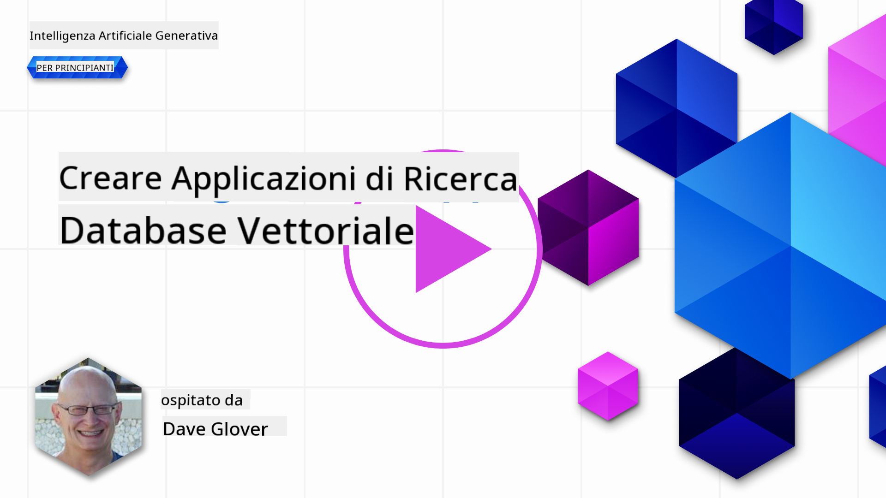
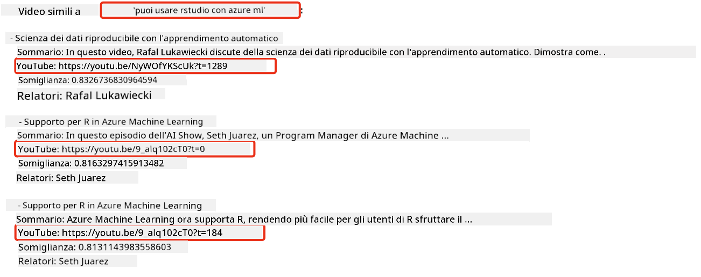
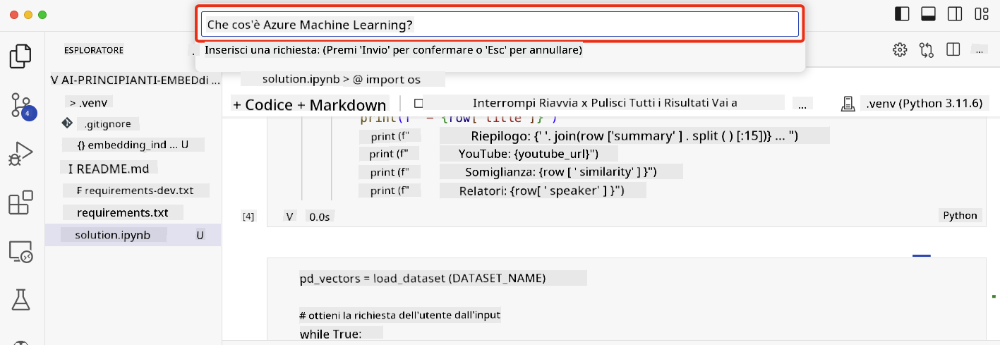

<!--
CO_OP_TRANSLATOR_METADATA:
{
  "original_hash": "d46aad0917a1a342d613e2c13d457da5",
  "translation_date": "2025-07-09T12:53:55+00:00",
  "source_file": "08-building-search-applications/README.md",
  "language_code": "it"
}
-->
# Costruire Applicazioni di Ricerca

[](https://aka.ms/gen-ai-lesson8-gh?WT.mc_id=academic-105485-koreyst)

> > _Clicca sull'immagine sopra per vedere il video di questa lezione_

Gli LLM non servono solo per chatbot e generazione di testo. È anche possibile costruire applicazioni di ricerca usando gli Embeddings. Gli Embeddings sono rappresentazioni numeriche dei dati, noti anche come vettori, e possono essere usati per la ricerca semantica dei dati.

In questa lezione, costruirai un'applicazione di ricerca per la nostra startup educativa. La nostra startup è un'organizzazione no-profit che offre educazione gratuita agli studenti nei paesi in via di sviluppo. La nostra startup dispone di un gran numero di video YouTube che gli studenti possono usare per imparare sull'IA. La nostra startup vuole costruire un'applicazione di ricerca che permetta agli studenti di cercare un video YouTube digitando una domanda.

Ad esempio, uno studente potrebbe digitare 'Cosa sono i Jupyter Notebooks?' o 'Cos'è Azure ML' e l'applicazione di ricerca restituirà una lista di video YouTube rilevanti per la domanda, e ancora meglio, l'applicazione di ricerca restituirà un link al punto del video dove si trova la risposta alla domanda.

## Introduzione

In questa lezione tratteremo:

- Ricerca semantica vs ricerca per parole chiave.
- Cosa sono gli Text Embeddings.
- Creazione di un indice di Text Embeddings.
- Ricerca in un indice di Text Embeddings.

## Obiettivi di apprendimento

Dopo aver completato questa lezione, sarai in grado di:

- Distinguere tra ricerca semantica e ricerca per parole chiave.
- Spiegare cosa sono gli Text Embeddings.
- Creare un'applicazione che utilizza gli Embeddings per cercare dati.

## Perché costruire un'applicazione di ricerca?

Creare un'applicazione di ricerca ti aiuterà a capire come usare gli Embeddings per cercare dati. Imparerai anche come costruire un'applicazione di ricerca che gli studenti possono usare per trovare informazioni rapidamente.

La lezione include un indice di Embeddings delle trascrizioni YouTube del canale Microsoft [AI Show](https://www.youtube.com/playlist?list=PLlrxD0HtieHi0mwteKBOfEeOYf0LJU4O1). AI Show è un canale YouTube che insegna IA e machine learning. L'indice di Embeddings contiene gli Embeddings per ciascuna trascrizione YouTube fino a ottobre 2023. Userai questo indice per costruire un'applicazione di ricerca per la nostra startup. L'applicazione di ricerca restituisce un link al punto del video dove si trova la risposta alla domanda. Questo è un ottimo modo per gli studenti di trovare rapidamente le informazioni di cui hanno bisogno.

Ecco un esempio di query semantica per la domanda 'si può usare rstudio con azure ml?'. Dai un'occhiata all'URL di YouTube, vedrai che contiene un timestamp che ti porta al punto del video dove si trova la risposta alla domanda.



## Cos'è la ricerca semantica?

Ora ti starai chiedendo, cos'è la ricerca semantica? La ricerca semantica è una tecnica di ricerca che usa la semantica, o il significato, delle parole in una query per restituire risultati rilevanti.

Ecco un esempio di ricerca semantica. Supponiamo che tu voglia comprare un'auto, potresti cercare 'la mia auto dei sogni', la ricerca semantica capisce che non stai `sognando` un'auto, ma stai cercando di comprare la tua auto `ideale`. La ricerca semantica comprende la tua intenzione e restituisce risultati pertinenti. L'alternativa è la `ricerca per parole chiave` che cercherebbe letteralmente sogni su auto e spesso restituisce risultati irrilevanti.

## Cosa sono gli Text Embeddings?

[Text embeddings](https://en.wikipedia.org/wiki/Word_embedding?WT.mc_id=academic-105485-koreyst) sono una tecnica di rappresentazione del testo usata nel [natural language processing](https://en.wikipedia.org/wiki/Natural_language_processing?WT.mc_id=academic-105485-koreyst). Gli text embeddings sono rappresentazioni numeriche semantiche del testo. Gli embeddings sono usati per rappresentare i dati in un modo che sia facile da comprendere per una macchina. Esistono molti modelli per costruire text embeddings, in questa lezione ci concentreremo sulla generazione di embeddings usando il modello OpenAI Embedding.

Ecco un esempio, immagina che il seguente testo sia in una trascrizione di uno degli episodi del canale YouTube AI Show:

```text
Today we are going to learn about Azure Machine Learning.
```

Passeremmo il testo all'API OpenAI Embedding e questa restituirebbe il seguente embedding composto da 1536 numeri, ovvero un vettore. Ogni numero nel vettore rappresenta un aspetto diverso del testo. Per brevità, ecco i primi 10 numeri del vettore.

```python
[-0.006655829958617687, 0.0026128944009542465, 0.008792596869170666, -0.02446001023054123, -0.008540431968867779, 0.022071078419685364, -0.010703742504119873, 0.003311325330287218, -0.011632772162556648, -0.02187200076878071, ...]
```

## Come viene creato l'indice di Embedding?

L'indice di Embedding per questa lezione è stato creato con una serie di script Python. Troverai gli script insieme alle istruzioni nel [README](./scripts/README.md?WT.mc_id=academic-105485-koreyst) nella cartella 'scripts' di questa lezione. Non è necessario eseguire questi script per completare la lezione poiché l'indice di Embedding è fornito.

Gli script eseguono le seguenti operazioni:

1. Viene scaricata la trascrizione di ogni video YouTube nella playlist [AI Show](https://www.youtube.com/playlist?list=PLlrxD0HtieHi0mwteKBOfEeOYf0LJU4O1).
2. Usando le [OpenAI Functions](https://learn.microsoft.com/azure/ai-services/openai/how-to/function-calling?WT.mc_id=academic-105485-koreyst), si tenta di estrarre il nome del relatore dai primi 3 minuti della trascrizione YouTube. Il nome del relatore per ogni video viene memorizzato nell'indice di Embedding chiamato `embedding_index_3m.json`.
3. Il testo della trascrizione viene quindi suddiviso in **segmenti di testo di 3 minuti**. Il segmento include circa 20 parole in sovrapposizione con il segmento successivo per assicurare che l'Embedding del segmento non venga tagliato e per fornire un contesto di ricerca migliore.
4. Ogni segmento di testo viene passato all'OpenAI Chat API per riassumere il testo in 60 parole. Il riassunto viene anch'esso memorizzato nell'indice di Embedding `embedding_index_3m.json`.
5. Infine, il testo del segmento viene passato all'OpenAI Embedding API. L'API restituisce un vettore di 1536 numeri che rappresentano il significato semantico del segmento. Il segmento insieme al vettore OpenAI Embedding viene memorizzato nell'indice di Embedding `embedding_index_3m.json`.

### Database vettoriali

Per semplicità in questa lezione, l'indice di Embedding è memorizzato in un file JSON chiamato `embedding_index_3m.json` e caricato in un DataFrame Pandas. Tuttavia, in produzione, l'indice di Embedding sarebbe memorizzato in un database vettoriale come [Azure Cognitive Search](https://learn.microsoft.com/training/modules/improve-search-results-vector-search?WT.mc_id=academic-105485-koreyst), [Redis](https://cookbook.openai.com/examples/vector_databases/redis/readme?WT.mc_id=academic-105485-koreyst), [Pinecone](https://cookbook.openai.com/examples/vector_databases/pinecone/readme?WT.mc_id=academic-105485-koreyst), [Weaviate](https://cookbook.openai.com/examples/vector_databases/weaviate/readme?WT.mc_id=academic-105485-koreyst), solo per citarne alcuni.

## Comprendere la similarità coseno

Abbiamo imparato cosa sono gli text embeddings, il passo successivo è imparare come usarli per cercare dati e in particolare trovare gli embeddings più simili a una query data usando la similarità coseno.

### Cos'è la similarità coseno?

La similarità coseno è una misura di somiglianza tra due vettori, viene anche chiamata `ricerca del vicino più prossimo`. Per eseguire una ricerca con similarità coseno devi _vettorializzare_ il testo della _query_ usando l'OpenAI Embedding API. Poi calcolare la _similarità coseno_ tra il vettore della query e ogni vettore nell'indice di Embedding. Ricorda, l'indice di Embedding ha un vettore per ogni segmento di testo della trascrizione YouTube. Infine, ordina i risultati per similarità coseno e i segmenti di testo con la similarità coseno più alta sono quelli più simili alla query.

Dal punto di vista matematico, la similarità coseno misura il coseno dell'angolo tra due vettori proiettati in uno spazio multidimensionale. Questa misura è utile perché se due documenti sono distanti in termini di distanza euclidea a causa della dimensione, potrebbero comunque avere un angolo più piccolo tra loro e quindi una similarità coseno più alta. Per maggiori informazioni sulle equazioni della similarità coseno, vedi [Cosine similarity](https://en.wikipedia.org/wiki/Cosine_similarity?WT.mc_id=academic-105485-koreyst).

## Costruire la tua prima applicazione di ricerca

Ora impareremo come costruire un'applicazione di ricerca usando gli Embeddings. L'applicazione di ricerca permetterà agli studenti di cercare un video digitando una domanda. L'applicazione restituirà una lista di video rilevanti per la domanda. Restituirà anche un link al punto del video dove si trova la risposta alla domanda.

Questa soluzione è stata costruita e testata su Windows 11, macOS e Ubuntu 22.04 usando Python 3.10 o versioni successive. Puoi scaricare Python da [python.org](https://www.python.org/downloads/?WT.mc_id=academic-105485-koreyst).

## Compito - costruire un'applicazione di ricerca per aiutare gli studenti

Abbiamo presentato la nostra startup all'inizio di questa lezione. Ora è il momento di permettere agli studenti di costruire un'applicazione di ricerca per i loro compiti.

In questo compito, creerai i servizi Azure OpenAI che saranno usati per costruire l'applicazione di ricerca. Creerai i seguenti servizi Azure OpenAI. Ti servirà un abbonamento Azure per completare questo compito.

### Avviare Azure Cloud Shell

1. Accedi al [portale Azure](https://portal.azure.com/?WT.mc_id=academic-105485-koreyst).
2. Seleziona l'icona Cloud Shell nell'angolo in alto a destra del portale Azure.
3. Seleziona **Bash** come tipo di ambiente.

#### Crea un gruppo di risorse

> Per queste istruzioni, usiamo il gruppo di risorse chiamato "semantic-video-search" in East US.
> Puoi cambiare il nome del gruppo di risorse, ma se cambi la posizione delle risorse,
> controlla la [tabella di disponibilità dei modelli](https://aka.ms/oai/models?WT.mc_id=academic-105485-koreyst).

```shell
az group create --name semantic-video-search --location eastus
```

#### Crea una risorsa Azure OpenAI Service

Dal Cloud Shell di Azure, esegui il seguente comando per creare una risorsa Azure OpenAI Service.

```shell
az cognitiveservices account create --name semantic-video-openai --resource-group semantic-video-search \
    --location eastus --kind OpenAI --sku s0
```

#### Ottieni endpoint e chiavi per l'uso in questa applicazione

Dal Cloud Shell di Azure, esegui i seguenti comandi per ottenere endpoint e chiavi per la risorsa Azure OpenAI Service.

```shell
az cognitiveservices account show --name semantic-video-openai \
   --resource-group  semantic-video-search | jq -r .properties.endpoint
az cognitiveservices account keys list --name semantic-video-openai \
   --resource-group semantic-video-search | jq -r .key1
```

#### Distribuisci il modello OpenAI Embedding

Dal Cloud Shell di Azure, esegui il seguente comando per distribuire il modello OpenAI Embedding.

```shell
az cognitiveservices account deployment create \
    --name semantic-video-openai \
    --resource-group  semantic-video-search \
    --deployment-name text-embedding-ada-002 \
    --model-name text-embedding-ada-002 \
    --model-version "2"  \
    --model-format OpenAI \
    --sku-capacity 100 --sku-name "Standard"
```

## Soluzione

Apri il [notebook soluzione](python/aoai-solution.ipynb) in GitHub Codespaces e segui le istruzioni nel Jupyter Notebook.

Quando esegui il notebook, ti verrà chiesto di inserire una query. La casella di input apparirà così:



## Ottimo lavoro! Continua a imparare

Dopo aver completato questa lezione, dai un'occhiata alla nostra [collezione di apprendimento sull'Intelligenza Artificiale Generativa](https://aka.ms/genai-collection?WT.mc_id=academic-105485-koreyst) per continuare a migliorare le tue conoscenze sull'IA Generativa!

Passa alla Lezione 9 dove vedremo come [costruire applicazioni di generazione di immagini](../09-building-image-applications/README.md?WT.mc_id=academic-105485-koreyst)!

**Disclaimer**:  
Questo documento è stato tradotto utilizzando il servizio di traduzione automatica [Co-op Translator](https://github.com/Azure/co-op-translator). Pur impegnandoci per garantire accuratezza, si prega di notare che le traduzioni automatiche possono contenere errori o imprecisioni. Il documento originale nella sua lingua nativa deve essere considerato la fonte autorevole. Per informazioni critiche, si raccomanda una traduzione professionale effettuata da un umano. Non ci assumiamo alcuna responsabilità per eventuali malintesi o interpretazioni errate derivanti dall’uso di questa traduzione.