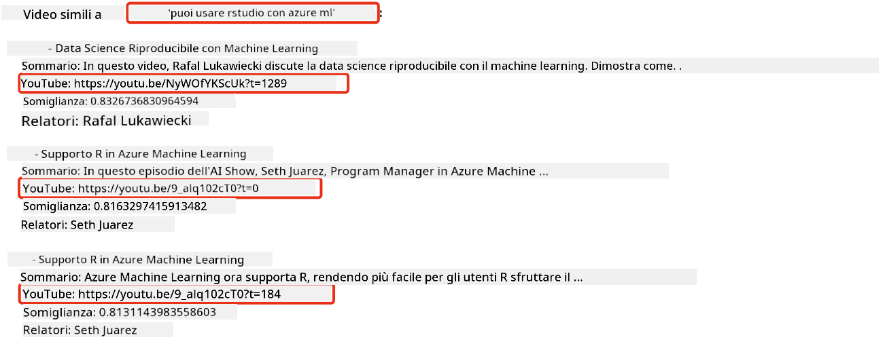
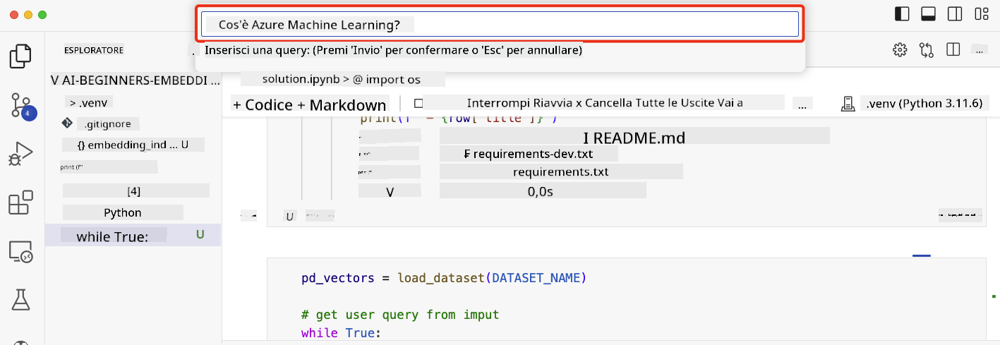

<!--
CO_OP_TRANSLATOR_METADATA:
{
  "original_hash": "58953c08b8ba7073b836d4270ea0fe86",
  "translation_date": "2025-10-17T16:06:34+00:00",
  "source_file": "08-building-search-applications/README.md",
  "language_code": "it"
}
-->
# Creare Applicazioni di Ricerca

[](https://youtu.be/W0-nzXjOjr0?si=GcsqiTTvd7RKbo7V)

> > _Clicca sull'immagine sopra per vedere il video di questa lezione_

C'è molto di più nei LLM rispetto ai chatbot e alla generazione di testo. È anche possibile creare applicazioni di ricerca utilizzando gli Embeddings. Gli Embeddings sono rappresentazioni numeriche dei dati, conosciuti anche come vettori, e possono essere utilizzati per la ricerca semantica dei dati.

In questa lezione, costruirai un'applicazione di ricerca per la nostra startup educativa. La nostra startup è un'organizzazione no-profit che offre istruzione gratuita agli studenti nei paesi in via di sviluppo. La startup dispone di un gran numero di video su YouTube che gli studenti possono utilizzare per imparare sull'AI. La startup vuole creare un'applicazione di ricerca che permetta agli studenti di cercare un video su YouTube digitando una domanda.

Ad esempio, uno studente potrebbe digitare 'Cosa sono i Jupyter Notebooks?' o 'Cos'è Azure ML' e l'applicazione di ricerca restituirà un elenco di video su YouTube pertinenti alla domanda, e ancora meglio, l'applicazione di ricerca restituirà un link al punto del video in cui si trova la risposta alla domanda.

## Introduzione

In questa lezione, tratteremo:

- Ricerca semantica vs ricerca per parole chiave.
- Cosa sono gli Embeddings Testuali.
- Creazione di un Indice di Embeddings Testuali.
- Ricerca in un Indice di Embeddings Testuali.

## Obiettivi di Apprendimento

Dopo aver completato questa lezione, sarai in grado di:

- Distinguere tra ricerca semantica e ricerca per parole chiave.
- Spiegare cosa sono gli Embeddings Testuali.
- Creare un'applicazione utilizzando gli Embeddings per cercare dati.

## Perché creare un'applicazione di ricerca?

Creare un'applicazione di ricerca ti aiuterà a capire come utilizzare gli Embeddings per cercare dati. Imparerai anche come costruire un'applicazione di ricerca che possa essere utilizzata dagli studenti per trovare informazioni rapidamente.

La lezione include un Indice di Embeddings dei trascritti di YouTube del canale [AI Show](https://www.youtube.com/playlist?list=PLlrxD0HtieHi0mwteKBOfEeOYf0LJU4O1). L'AI Show è un canale YouTube che insegna sull'AI e il machine learning. L'Indice di Embeddings contiene gli Embeddings per ciascuno dei trascritti di YouTube fino a ottobre 2023. Utilizzerai l'Indice di Embeddings per costruire un'applicazione di ricerca per la nostra startup. L'applicazione di ricerca restituisce un link al punto del video in cui si trova la risposta alla domanda. Questo è un ottimo modo per gli studenti di trovare rapidamente le informazioni di cui hanno bisogno.

Di seguito è riportato un esempio di una query semantica per la domanda 'puoi usare rstudio con azure ml?'. Dai un'occhiata all'URL di YouTube, vedrai che l'URL contiene un timestamp che ti porta al punto del video in cui si trova la risposta alla domanda.



## Cos'è la ricerca semantica?

Ora potresti chiederti, cos'è la ricerca semantica? La ricerca semantica è una tecnica di ricerca che utilizza la semantica, o il significato, delle parole in una query per restituire risultati pertinenti.

Ecco un esempio di ricerca semantica. Supponiamo che tu stia cercando di comprare un'auto, potresti cercare 'la mia auto dei sogni', la ricerca semantica capisce che non stai `sognando` un'auto, ma piuttosto stai cercando di comprare la tua auto `ideale`. La ricerca semantica comprende la tua intenzione e restituisce risultati pertinenti. L'alternativa è la `ricerca per parole chiave` che cercherebbe letteralmente sogni sulle auto e spesso restituisce risultati irrilevanti.

## Cosa sono gli Embeddings Testuali?

[Gli embeddings testuali](https://en.wikipedia.org/wiki/Word_embedding?WT.mc_id=academic-105485-koreyst) sono una tecnica di rappresentazione testuale utilizzata nell'[elaborazione del linguaggio naturale](https://en.wikipedia.org/wiki/Natural_language_processing?WT.mc_id=academic-105485-koreyst). Gli embeddings testuali sono rappresentazioni numeriche semantiche del testo. Gli embeddings vengono utilizzati per rappresentare i dati in un modo che sia facile da comprendere per una macchina. Esistono molti modelli per costruire embeddings testuali, in questa lezione ci concentreremo sulla generazione di embeddings utilizzando il modello OpenAI Embedding.

Ecco un esempio, immagina che il seguente testo sia in una trascrizione di uno degli episodi del canale YouTube AI Show:

```text
Today we are going to learn about Azure Machine Learning.
```

Passeremmo il testo all'API OpenAI Embedding e questa restituirebbe il seguente embedding composto da 1536 numeri, noto anche come vettore. Ogni numero nel vettore rappresenta un aspetto diverso del testo. Per brevità, ecco i primi 10 numeri nel vettore.

```python
[-0.006655829958617687, 0.0026128944009542465, 0.008792596869170666, -0.02446001023054123, -0.008540431968867779, 0.022071078419685364, -0.010703742504119873, 0.003311325330287218, -0.011632772162556648, -0.02187200076878071, ...]
```

## Come viene creato l'Indice di Embeddings?

L'Indice di Embeddings per questa lezione è stato creato con una serie di script Python. Troverai gli script insieme alle istruzioni nel [README](./scripts/README.md?WT.mc_id=academic-105485-koreyst) nella cartella 'scripts' di questa lezione. Non è necessario eseguire questi script per completare la lezione poiché l'Indice di Embeddings è fornito.

Gli script eseguono le seguenti operazioni:

1. La trascrizione di ciascun video YouTube nella playlist [AI Show](https://www.youtube.com/playlist?list=PLlrxD0HtieHi0mwteKBOfEeOYf0LJU4O1) viene scaricata.
2. Utilizzando le [Funzioni OpenAI](https://learn.microsoft.com/azure/ai-services/openai/how-to/function-calling?WT.mc_id=academic-105485-koreyst), si tenta di estrarre il nome del relatore dai primi 3 minuti della trascrizione di YouTube. Il nome del relatore per ciascun video viene memorizzato nell'Indice di Embeddings chiamato `embedding_index_3m.json`.
3. Il testo della trascrizione viene quindi suddiviso in **segmenti di testo di 3 minuti**. Il segmento include circa 20 parole sovrapposte dal segmento successivo per garantire che l'Embedding del segmento non venga troncato e per fornire un contesto di ricerca migliore.
4. Ogni segmento di testo viene quindi passato all'API OpenAI Chat per riassumere il testo in 60 parole. Il riassunto viene anche memorizzato nell'Indice di Embeddings `embedding_index_3m.json`.
5. Infine, il testo del segmento viene passato all'API OpenAI Embedding. L'API Embedding restituisce un vettore di 1536 numeri che rappresentano il significato semantico del segmento. Il segmento insieme al vettore OpenAI Embedding viene memorizzato in un Indice di Embeddings `embedding_index_3m.json`.

### Database di Vettori

Per semplicità della lezione, l'Indice di Embeddings è memorizzato in un file JSON chiamato `embedding_index_3m.json` e caricato in un DataFrame Pandas. Tuttavia, in produzione, l'Indice di Embeddings verrebbe memorizzato in un database di vettori come [Azure Cognitive Search](https://learn.microsoft.com/training/modules/improve-search-results-vector-search?WT.mc_id=academic-105485-koreyst), [Redis](https://cookbook.openai.com/examples/vector_databases/redis/readme?WT.mc_id=academic-105485-koreyst), [Pinecone](https://cookbook.openai.com/examples/vector_databases/pinecone/readme?WT.mc_id=academic-105485-koreyst), [Weaviate](https://cookbook.openai.com/examples/vector_databases/weaviate/readme?WT.mc_id=academic-105485-koreyst), per citarne alcuni.

## Comprendere la similarità coseno

Abbiamo imparato sugli embeddings testuali, il passo successivo è imparare come utilizzare gli embeddings testuali per cercare dati e in particolare trovare gli embeddings più simili a una determinata query utilizzando la similarità coseno.

### Cos'è la similarità coseno?

La similarità coseno è una misura di somiglianza tra due vettori, spesso chiamata anche `ricerca del vicino più prossimo`. Per eseguire una ricerca di similarità coseno è necessario _vettorizzare_ il testo della _query_ utilizzando l'API OpenAI Embedding. Quindi calcolare la _similarità coseno_ tra il vettore della query e ciascun vettore nell'Indice di Embeddings. Ricorda, l'Indice di Embeddings ha un vettore per ciascun segmento di testo della trascrizione di YouTube. Infine, ordina i risultati per similarità coseno e i segmenti di testo con la similarità coseno più alta sono i più simili alla query.

Da una prospettiva matematica, la similarità coseno misura il coseno dell'angolo tra due vettori proiettati in uno spazio multidimensionale. Questa misurazione è utile, perché se due documenti sono distanti per distanza euclidea a causa della dimensione, potrebbero comunque avere un angolo più piccolo tra loro e quindi una similarità coseno più alta. Per ulteriori informazioni sulle equazioni di similarità coseno, consulta [Cosine similarity](https://en.wikipedia.org/wiki/Cosine_similarity?WT.mc_id=academic-105485-koreyst).

## Creare la tua prima applicazione di ricerca

Successivamente, impareremo come costruire un'applicazione di ricerca utilizzando gli Embeddings. L'applicazione di ricerca permetterà agli studenti di cercare un video digitando una domanda. L'applicazione di ricerca restituirà un elenco di video pertinenti alla domanda. L'applicazione di ricerca restituirà anche un link al punto del video in cui si trova la risposta alla domanda.

Questa soluzione è stata costruita e testata su Windows 11, macOS e Ubuntu 22.04 utilizzando Python 3.10 o versioni successive. Puoi scaricare Python da [python.org](https://www.python.org/downloads/?WT.mc_id=academic-105485-koreyst).

## Compito - creare un'applicazione di ricerca per aiutare gli studenti

Abbiamo introdotto la nostra startup all'inizio di questa lezione. Ora è il momento di abilitare gli studenti a costruire un'applicazione di ricerca per le loro valutazioni.

In questo compito, creerai i servizi Azure OpenAI che saranno utilizzati per costruire l'applicazione di ricerca. Creerai i seguenti servizi Azure OpenAI. Avrai bisogno di un abbonamento Azure per completare questo compito.

### Avviare la Cloud Shell di Azure

1. Accedi al [portale Azure](https://portal.azure.com/?WT.mc_id=academic-105485-koreyst).
2. Seleziona l'icona Cloud Shell nell'angolo in alto a destra del portale Azure.
3. Seleziona **Bash** come tipo di ambiente.

#### Creare un gruppo di risorse

> Per queste istruzioni, utilizziamo il gruppo di risorse chiamato "semantic-video-search" in East US.
> Puoi cambiare il nome del gruppo di risorse, ma quando cambi la posizione delle risorse,
> controlla la [tabella di disponibilità dei modelli](https://aka.ms/oai/models?WT.mc_id=academic-105485-koreyst).

```shell
az group create --name semantic-video-search --location eastus
```

#### Creare una risorsa Azure OpenAI Service

Dalla Cloud Shell di Azure, esegui il seguente comando per creare una risorsa Azure OpenAI Service.

```shell
az cognitiveservices account create --name semantic-video-openai --resource-group semantic-video-search \
    --location eastus --kind OpenAI --sku s0
```

#### Ottenere l'endpoint e le chiavi per l'uso in questa applicazione

Dalla Cloud Shell di Azure, esegui i seguenti comandi per ottenere l'endpoint e le chiavi per la risorsa Azure OpenAI Service.

```shell
az cognitiveservices account show --name semantic-video-openai \
   --resource-group  semantic-video-search | jq -r .properties.endpoint
az cognitiveservices account keys list --name semantic-video-openai \
   --resource-group semantic-video-search | jq -r .key1
```

#### Distribuire il modello OpenAI Embedding

Dalla Cloud Shell di Azure, esegui il seguente comando per distribuire il modello OpenAI Embedding.

```shell
az cognitiveservices account deployment create \
    --name semantic-video-openai \
    --resource-group  semantic-video-search \
    --deployment-name text-embedding-ada-002 \
    --model-name text-embedding-ada-002 \
    --model-version "2"  \
    --model-format OpenAI \
    --sku-capacity 100 --sku-name "Standard"
```

## Soluzione

Apri il [notebook della soluzione](./python/aoai-solution.ipynb?WT.mc_id=academic-105485-koreyst) in GitHub Codespaces e segui le istruzioni nel Jupyter Notebook.

Quando esegui il notebook, ti verrà chiesto di inserire una query. La casella di input apparirà così:



## Ottimo lavoro! Continua a imparare

Dopo aver completato questa lezione, dai un'occhiata alla nostra [collezione di apprendimento sull'AI generativa](https://aka.ms/genai-collection?WT.mc_id=academic-105485-koreyst) per continuare a migliorare le tue conoscenze sull'AI generativa!

Vai alla Lezione 9 dove vedremo come [creare applicazioni di generazione di immagini](../09-building-image-applications/README.md?WT.mc_id=academic-105485-koreyst)!

---

**Disclaimer**:  
Questo documento è stato tradotto utilizzando il servizio di traduzione AI [Co-op Translator](https://github.com/Azure/co-op-translator). Sebbene ci impegniamo per garantire l'accuratezza, si prega di notare che le traduzioni automatiche possono contenere errori o imprecisioni. Il documento originale nella sua lingua nativa dovrebbe essere considerato la fonte autorevole. Per informazioni critiche, si raccomanda una traduzione professionale umana. Non siamo responsabili per eventuali incomprensioni o interpretazioni errate derivanti dall'uso di questa traduzione.