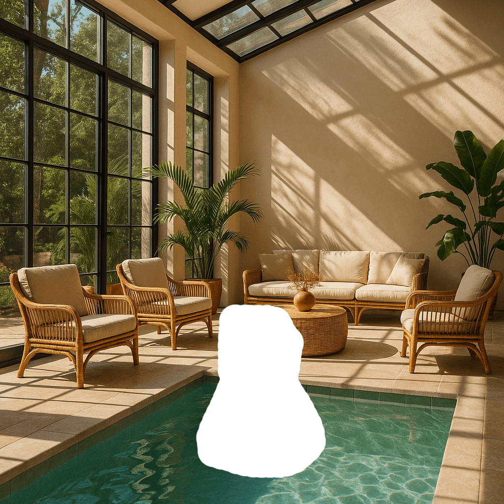

<!--
CO_OP_TRANSLATOR_METADATA:
{
  "original_hash": "063a2ac57d6b71bea0eaa880c68770d2",
  "translation_date": "2025-09-29T21:41:21+00:00",
  "source_file": "09-building-image-applications/README.md",
  "language_code": "it"
}
-->
# Creare Applicazioni per la Generazione di Immagini

[](https://aka.ms/gen-ai-lesson9-gh?WT.mc_id=academic-105485-koreyst)

Gli LLM non si limitano alla generazione di testo. È anche possibile generare immagini a partire da descrizioni testuali. Avere immagini come modalità può essere estremamente utile in numerosi settori, come MedTech, architettura, turismo, sviluppo di videogiochi e altro ancora. In questo capitolo, esamineremo i due modelli di generazione di immagini più popolari: DALL-E e Midjourney.

## Introduzione

In questa lezione, tratteremo:

- La generazione di immagini e perché è utile.
- DALL-E e Midjourney: cosa sono e come funzionano.
- Come costruire un'applicazione per la generazione di immagini.

## Obiettivi di Apprendimento

Dopo aver completato questa lezione, sarai in grado di:

- Creare un'applicazione per la generazione di immagini.
- Definire i limiti per la tua applicazione con meta prompt.
- Lavorare con DALL-E e Midjourney.

## Perché creare un'applicazione per la generazione di immagini?

Le applicazioni per la generazione di immagini sono un ottimo modo per esplorare le capacità dell'AI Generativa. Possono essere utilizzate, ad esempio, per:

- **Modifica e sintesi di immagini**. Puoi generare immagini per una varietà di casi d'uso, come la modifica e la sintesi di immagini.

- **Applicazioni in diversi settori**. Possono anche essere utilizzate per generare immagini per diversi settori come MedTech, Turismo, Sviluppo di videogiochi e altro.

## Scenario: Edu4All

Come parte di questa lezione, continueremo a lavorare con la nostra startup, Edu4All. Gli studenti creeranno immagini per le loro valutazioni; esattamente quali immagini dipenderà dagli studenti, ma potrebbero essere illustrazioni per la loro fiaba, la creazione di un nuovo personaggio per la loro storia o aiutarli a visualizzare le loro idee e concetti.

Ecco cosa potrebbero generare gli studenti di Edu4All, ad esempio, se stanno lavorando in classe sui monumenti:


usando un prompt come:

> "Cane accanto alla Torre Eiffel al sole del primo mattino"

## Cosa sono DALL-E e Midjourney?

[DALL-E](https://openai.com/dall-e-2?WT.mc_id=academic-105485-koreyst) e [Midjourney](https://www.midjourney.com/?WT.mc_id=academic-105485-koreyst) sono due dei modelli di generazione di immagini più popolari, che permettono di utilizzare prompt per generare immagini.

### DALL-E

Iniziamo con DALL-E, un modello di AI Generativa che genera immagini a partire da descrizioni testuali.

> [DALL-E è una combinazione di due modelli, CLIP e attenzione diffusa](https://towardsdatascience.com/openais-dall-e-and-clip-101-a-brief-introduction-3a4367280d4e?WT.mc_id=academic-105485-koreyst).

- **CLIP**, è un modello che genera embeddings, rappresentazioni numeriche dei dati, da immagini e testo.

- **Attenzione diffusa**, è un modello che genera immagini dagli embeddings. DALL-E è addestrato su un dataset di immagini e testo e può essere utilizzato per generare immagini a partire da descrizioni testuali. Ad esempio, DALL-E può essere utilizzato per generare immagini di un gatto con un cappello o di un cane con una cresta.

### Midjourney

Midjourney funziona in modo simile a DALL-E, generando immagini a partire da prompt testuali. Midjourney può anche essere utilizzato per generare immagini con prompt come "un gatto con un cappello" o "un cane con una cresta".


_Crediti immagine Wikipedia, immagine generata da Midjourney_

## Come funzionano DALL-E e Midjourney

Prima di tutto, [DALL-E](https://arxiv.org/pdf/2102.12092.pdf?WT.mc_id=academic-105485-koreyst). DALL-E è un modello di AI Generativa basato sull'architettura transformer con un _transformer autoregressivo_.

Un _transformer autoregressivo_ definisce come un modello genera immagini a partire da descrizioni testuali, generando un pixel alla volta e utilizzando i pixel generati per generare il pixel successivo. Passa attraverso più livelli in una rete neurale, fino a completare l'immagine.

Con questo processo, DALL-E controlla attributi, oggetti, caratteristiche e altro nell'immagine che genera. Tuttavia, DALL-E 2 e 3 offrono un maggiore controllo sull'immagine generata.

## Creare la tua prima applicazione per la generazione di immagini

Cosa serve per creare un'applicazione per la generazione di immagini? Hai bisogno delle seguenti librerie:

- **python-dotenv**, è altamente consigliato utilizzare questa libreria per mantenere i tuoi segreti in un file _.env_ separato dal codice.
- **openai**, questa libreria ti permette di interagire con l'API di OpenAI.
- **pillow**, per lavorare con immagini in Python.
- **requests**, per aiutarti a effettuare richieste HTTP.

## Creare e distribuire un modello Azure OpenAI

Se non lo hai già fatto, segui le istruzioni sulla pagina [Microsoft Learn](https://learn.microsoft.com/azure/ai-foundry/openai/how-to/create-resource?pivots=web-portal) per creare una risorsa e un modello Azure OpenAI. Seleziona DALL-E 3 come modello.

## Creare l'app

1. Crea un file _.env_ con il seguente contenuto:

   ```text
   AZURE_OPENAI_ENDPOINT=<your endpoint>
   AZURE_OPENAI_API_KEY=<your key>
   AZURE_OPENAI_DEPLOYMENT="dall-e-3"
   ```

   Trova queste informazioni nel portale Azure OpenAI Foundry per la tua risorsa nella sezione "Deployments".

1. Raccogli le librerie sopra in un file chiamato _requirements.txt_ come segue:

   ```text
   python-dotenv
   openai
   pillow
   requests
   ```

1. Successivamente, crea un ambiente virtuale e installa le librerie:

   ```bash
   python3 -m venv venv
   source venv/bin/activate
   pip install -r requirements.txt
   ```

   Per Windows, usa i seguenti comandi per creare e attivare il tuo ambiente virtuale:

   ```bash
   python3 -m venv venv
   venv\Scripts\activate.bat
   ```

1. Aggiungi il seguente codice in un file chiamato _app.py_:

    ```python
    import openai
    import os
    import requests
    from PIL import Image
    import dotenv
    from openai import OpenAI, AzureOpenAI
    
    # import dotenv
    dotenv.load_dotenv()
    
    # configure Azure OpenAI service client 
    client = AzureOpenAI(
      azure_endpoint = os.environ["AZURE_OPENAI_ENDPOINT"],
      api_key=os.environ['AZURE_OPENAI_API_KEY'],
      api_version = "2024-02-01"
      )
    try:
        # Create an image by using the image generation API
        generation_response = client.images.generate(
                                prompt='Bunny on horse, holding a lollipop, on a foggy meadow where it grows daffodils',
                                size='1024x1024', n=1,
                                model=os.environ['AZURE_OPENAI_DEPLOYMENT']
                              )

        # Set the directory for the stored image
        image_dir = os.path.join(os.curdir, 'images')

        # If the directory doesn't exist, create it
        if not os.path.isdir(image_dir):
            os.mkdir(image_dir)

        # Initialize the image path (note the filetype should be png)
        image_path = os.path.join(image_dir, 'generated-image.png')

        # Retrieve the generated image
        image_url = generation_response.data[0].url  # extract image URL from response
        generated_image = requests.get(image_url).content  # download the image
        with open(image_path, "wb") as image_file:
            image_file.write(generated_image)

        # Display the image in the default image viewer
        image = Image.open(image_path)
        image.show()

    # catch exceptions
    except openai.InvalidRequestError as err:
        print(err)
   ```

Spieghiamo questo codice:

- Per prima cosa, importiamo le librerie necessarie, inclusa la libreria OpenAI, la libreria dotenv, la libreria requests e la libreria Pillow.

  ```python
  import openai
  import os
  import requests
  from PIL import Image
  import dotenv
  ```

- Successivamente, carichiamo le variabili d'ambiente dal file _.env_.

  ```python
  # import dotenv
  dotenv.load_dotenv()
  ```

- Dopo di che, configuriamo il client del servizio Azure OpenAI.

  ```python
  # Get endpoint and key from environment variables
  client = AzureOpenAI(
      azure_endpoint = os.environ["AZURE_OPENAI_ENDPOINT"],
      api_key=os.environ['AZURE_OPENAI_API_KEY'],
      api_version = "2024-02-01"
      )
  ```

- Successivamente, generiamo l'immagine:

  ```python
  # Create an image by using the image generation API
  generation_response = client.images.generate(
                        prompt='Bunny on horse, holding a lollipop, on a foggy meadow where it grows daffodils',
                        size='1024x1024', n=1,
                        model=os.environ['AZURE_OPENAI_DEPLOYMENT']
                      )
  ```

  Il codice sopra risponde con un oggetto JSON che contiene l'URL dell'immagine generata. Possiamo utilizzare l'URL per scaricare l'immagine e salvarla in un file.

- Infine, apriamo l'immagine e utilizziamo il visualizzatore di immagini standard per mostrarla:

  ```python
  image = Image.open(image_path)
  image.show()
  ```

### Maggiori dettagli sulla generazione dell'immagine

Esaminiamo il codice che genera l'immagine in dettaglio:

   ```python
     generation_response = client.images.generate(
                               prompt='Bunny on horse, holding a lollipop, on a foggy meadow where it grows daffodils',
                               size='1024x1024', n=1,
                               model=os.environ['AZURE_OPENAI_DEPLOYMENT']
                           )
   ```

- **prompt**, è il prompt testuale utilizzato per generare l'immagine. In questo caso, stiamo utilizzando il prompt "Coniglio su cavallo, che tiene un lecca-lecca, in un prato nebbioso dove crescono narcisi".
- **size**, è la dimensione dell'immagine generata. In questo caso, stiamo generando un'immagine di 1024x1024 pixel.
- **n**, è il numero di immagini generate. In questo caso, stiamo generando due immagini.
- **temperature**, è un parametro che controlla la casualità dell'output di un modello di AI Generativa. La temperatura è un valore compreso tra 0 e 1, dove 0 significa che l'output è deterministico e 1 significa che l'output è casuale. Il valore predefinito è 0.7.

Ci sono altre cose che puoi fare con le immagini che tratteremo nella sezione successiva.

## Capacità aggiuntive della generazione di immagini

Finora hai visto come siamo stati in grado di generare un'immagine con poche righe di codice in Python. Tuttavia, ci sono altre cose che puoi fare con le immagini.

Puoi anche fare quanto segue:

- **Effettuare modifiche**. Fornendo un'immagine esistente, una maschera e un prompt, puoi modificare un'immagine. Ad esempio, puoi aggiungere qualcosa a una parte di un'immagine. Immagina la nostra immagine del coniglio: puoi aggiungere un cappello al coniglio. Come fare ciò è fornendo l'immagine, una maschera (che identifica la parte dell'area per il cambiamento) e un prompt testuale per indicare cosa dovrebbe essere fatto. 
> Nota: questo non è supportato in DALL-E 3.

Ecco un esempio utilizzando GPT Image:

   ```python
   response = client.images.edit(
       model="gpt-image-1",
       image=open("sunlit_lounge.png", "rb"),
       mask=open("mask.png", "rb"),
       prompt="A sunlit indoor lounge area with a pool containing a flamingo"
   )
   image_url = response.data[0].url
   ```

  L'immagine di base conterrebbe solo il salotto con piscina, ma l'immagine finale avrebbe un fenicottero:

<div style="display: flex; justify-content: space-between; align-items: center; margin: 20px 0;">
  
  
  
</div>

- **Creare variazioni**. L'idea è che prendi un'immagine esistente e chiedi che vengano create variazioni. Per creare una variazione, fornisci un'immagine e un prompt testuale e un codice come segue:

  ```python
  response = openai.Image.create_variation(
    image=open("bunny-lollipop.png", "rb"),
    n=1,
    size="1024x1024"
  )
  image_url = response['data'][0]['url']
  ```

  > Nota, questo è supportato solo su OpenAI.

## Temperatura

La temperatura è un parametro che controlla la casualità dell'output di un modello di AI Generativa. La temperatura è un valore compreso tra 0 e 1, dove 0 significa che l'output è deterministico e 1 significa che l'output è casuale. Il valore predefinito è 0.7.

Esaminiamo un esempio di come funziona la temperatura, eseguendo questo prompt due volte:

> Prompt: "Coniglio su cavallo, che tiene un lecca-lecca, in un prato nebbioso dove crescono narcisi"


Ora eseguiamo lo stesso prompt per vedere che non otterremo la stessa immagine due volte:


Come puoi vedere, le immagini sono simili, ma non identiche. Proviamo a cambiare il valore della temperatura a 0.1 e vediamo cosa succede:

```python
 generation_response = client.images.create(
        prompt='Bunny on horse, holding a lollipop, on a foggy meadow where it grows daffodils',    # Enter your prompt text here
        size='1024x1024',
        n=2
    )
```

### Cambiare la temperatura

Proviamo a rendere la risposta più deterministica. Abbiamo osservato dalle due immagini generate che nella prima immagine c'è un coniglio e nella seconda immagine c'è un cavallo, quindi le immagini variano molto.

Cambiamo quindi il nostro codice e impostiamo la temperatura a 0, come segue:

```python
generation_response = client.images.create(
        prompt='Bunny on horse, holding a lollipop, on a foggy meadow where it grows daffodils',    # Enter your prompt text here
        size='1024x1024',
        n=2,
        temperature=0
    )
```

Ora, quando esegui questo codice, ottieni queste due immagini:

- 
- 

Qui puoi chiaramente vedere come le immagini si somigliano di più.

## Come definire i limiti per la tua applicazione con metaprompt

Con la nostra demo, possiamo già generare immagini per i nostri clienti. Tuttavia, dobbiamo creare alcuni limiti per la nostra applicazione.

Ad esempio, non vogliamo generare immagini che non siano adatte al lavoro o che non siano appropriate per i bambini.

Possiamo farlo con _metaprompt_. I metaprompt sono prompt testuali utilizzati per controllare l'output di un modello di AI Generativa. Ad esempio, possiamo utilizzare metaprompt per controllare l'output e garantire che le immagini generate siano adatte al lavoro o appropriate per i bambini.

### Come funziona?

Ora, come funzionano i metaprompt?

I metaprompt sono prompt testuali utilizzati per controllare l'output di un modello di AI Generativa, sono posizionati prima del prompt testuale e vengono utilizzati per controllare l'output del modello e incorporati nelle applicazioni per controllare l'output del modello. Incapsulano l'input del prompt e l'input del metaprompt in un unico prompt testuale.

Un esempio di metaprompt potrebbe essere il seguente:

```text
You are an assistant designer that creates images for children.

The image needs to be safe for work and appropriate for children.

The image needs to be in color.

The image needs to be in landscape orientation.

The image needs to be in a 16:9 aspect ratio.

Do not consider any input from the following that is not safe for work or appropriate for children.

(Input)

```

Ora, vediamo come possiamo utilizzare i metaprompt nella nostra demo.

```python
disallow_list = "swords, violence, blood, gore, nudity, sexual content, adult content, adult themes, adult language, adult humor, adult jokes, adult situations, adult"

meta_prompt =f"""You are an assistant designer that creates images for children.

The image needs to be safe for work and appropriate for children.

The image needs to be in color.

The image needs to be in landscape orientation.

The image needs to be in a 16:9 aspect ratio.

Do not consider any input from the following that is not safe for work or appropriate for children.
{disallow_list}
"""

prompt = f"{meta_prompt}
Create an image of a bunny on a horse, holding a lollipop"

# TODO add request to generate image
```

Dal prompt sopra, puoi vedere come tutte le immagini create considerano il metaprompt.

## Compito - abilitiamo gli studenti

Abbiamo introdotto Edu4All all'inizio di questa lezione. Ora è il momento di abilitare gli studenti a generare immagini per le loro valutazioni.

Gli studenti creeranno immagini per le loro valutazioni contenenti monumenti; esattamente quali monumenti dipenderà dagli studenti. Gli studenti sono invitati a usare la loro creatività in questo compito per collocare questi monumenti in contesti diversi.

## Soluzione

Ecco una possibile soluzione:
```python
import openai
import os
import requests
from PIL import Image
import dotenv
from openai import AzureOpenAI
# import dotenv
dotenv.load_dotenv()

# Get endpoint and key from environment variables
client = AzureOpenAI(
  azure_endpoint = os.environ["AZURE_OPENAI_ENDPOINT"],
  api_key=os.environ['AZURE_OPENAI_API_KEY'],
  api_version = "2024-02-01"
  )


disallow_list = "swords, violence, blood, gore, nudity, sexual content, adult content, adult themes, adult language, adult humor, adult jokes, adult situations, adult"

meta_prompt = f"""You are an assistant designer that creates images for children.

The image needs to be safe for work and appropriate for children.

The image needs to be in color.

The image needs to be in landscape orientation.

The image needs to be in a 16:9 aspect ratio.

Do not consider any input from the following that is not safe for work or appropriate for children.
{disallow_list}
"""

prompt = f"""{meta_prompt}
Generate monument of the Arc of Triumph in Paris, France, in the evening light with a small child holding a Teddy looks on.
""""

try:
    # Create an image by using the image generation API
    generation_response = client.images.generate(
        prompt=prompt,    # Enter your prompt text here
        size='1024x1024',
        n=1,
    )
    # Set the directory for the stored image
    image_dir = os.path.join(os.curdir, 'images')

    # If the directory doesn't exist, create it
    if not os.path.isdir(image_dir):
        os.mkdir(image_dir)

    # Initialize the image path (note the filetype should be png)
    image_path = os.path.join(image_dir, 'generated-image.png')

    # Retrieve the generated image
    image_url = generation_response.data[0].url  # extract image URL from response
    generated_image = requests.get(image_url).content  # download the image
    with open(image_path, "wb") as image_file:
        image_file.write(generated_image)

    # Display the image in the default image viewer
    image = Image.open(image_path)
    image.show()

# catch exceptions
except openai.BadRequestError as err:
    print(err)
```

## Ottimo lavoro! Continua a imparare

Dopo aver completato questa lezione, dai un'occhiata alla nostra [collezione di apprendimento sull'AI generativa](https://aka.ms/genai-collection?WT.mc_id=academic-105485-koreyst) per continuare a migliorare le tue conoscenze sull'AI generativa!

Vai alla Lezione 10, dove vedremo come [creare applicazioni AI con low-code](../10-building-low-code-ai-applications/README.md?WT.mc_id=academic-105485-koreyst)

---

**Disclaimer**:  
Questo documento è stato tradotto utilizzando il servizio di traduzione automatica [Co-op Translator](https://github.com/Azure/co-op-translator). Sebbene ci impegniamo per garantire l'accuratezza, si prega di notare che le traduzioni automatiche possono contenere errori o imprecisioni. Il documento originale nella sua lingua nativa dovrebbe essere considerato la fonte autorevole. Per informazioni critiche, si raccomanda una traduzione professionale effettuata da un traduttore umano. Non siamo responsabili per eventuali incomprensioni o interpretazioni errate derivanti dall'uso di questa traduzione.