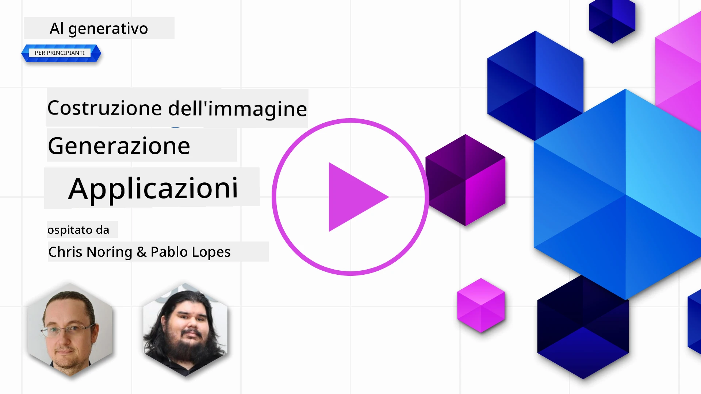

# Costruire Applicazioni per la Generazione di Immagini

[](https://youtu.be/B5VP0_J7cs8?si=5P3L5o7F_uS_QcG9)

Gli LLM non servono solo per generare testo. È anche possibile generare immagini da descrizioni testuali. Avere le immagini come modalità può essere estremamente utile in diversi ambiti, dalla MedTech, all'architettura, al turismo, allo sviluppo di giochi e altro ancora. In questo capitolo, esamineremo i due modelli di generazione di immagini più popolari, DALL-E e Midjourney.

## Introduzione

In questa lezione, tratteremo:

- La generazione di immagini e perché è utile.
- DALL-E e Midjourney, cosa sono e come funzionano.
- Come costruire un'applicazione di generazione di immagini.

## Obiettivi di Apprendimento

Dopo aver completato questa lezione, sarai in grado di:

- Costruire un'applicazione per la generazione di immagini.
- Definire i confini per la tua applicazione con metaprompts.
- Lavorare con DALL-E e Midjourney.

## Perché costruire un'applicazione di generazione di immagini?

Le applicazioni di generazione di immagini sono un ottimo modo per esplorare le capacità dell'AI Generativa. Possono essere usate, ad esempio, per:

- **Modifica e sintesi di immagini**. Puoi generare immagini per una varietà di casi d'uso, come la modifica e la sintesi di immagini.

- **Applicati a diversi settori**. Possono anche essere usate per generare immagini in diversi settori come la Medtech, il Turismo, lo sviluppo di giochi e altro.

## Scenario: Edu4All

Come parte di questa lezione, continueremo a lavorare con la nostra startup, Edu4All. Gli studenti creeranno immagini per le loro valutazioni, quali immagini creare è a scelta degli studenti, ma potrebbero essere illustrazioni per la loro fiaba, creare un nuovo personaggio per la loro storia o aiutarli a visualizzare le loro idee e concetti.

Ecco cosa potrebbero generare gli studenti di Edu4All ad esempio se stanno lavorando in classe sui monumenti:


usando un prompt come

> "Cane accanto alla Torre Eiffel alla luce dell'alba"

## Cosa sono DALL-E e Midjourney?

[DALL-E](https://openai.com/dall-e-2?WT.mc_id=academic-105485-koreyst) e [Midjourney](https://www.midjourney.com/?WT.mc_id=academic-105485-koreyst) sono due dei modelli di generazione di immagini più popolari, ti permettono di usare prompt per generare immagini.

### DALL-E

Iniziamo con DALL-E, un modello di AI Generativa che genera immagini da descrizioni testuali.

> [DALL-E è una combinazione di due modelli, CLIP e diffused attention](https://towardsdatascience.com/openais-dall-e-and-clip-101-a-brief-introduction-3a4367280d4e?WT.mc_id=academic-105485-koreyst).

- **CLIP**, è un modello che genera embedding, ovvero rappresentazioni numeriche dei dati, da immagini e testo.

- **Diffused attention**, è un modello che genera immagini dagli embedding. DALL-E è addestrato su un dataset di immagini e testo e può essere usato per generare immagini da descrizioni testuali. Per esempio, DALL-E può essere usato per generare immagini di un gatto con un cappello o di un cane con un mohawk.

### Midjourney

Midjourney funziona in modo simile a DALL-E, genera immagini da prompt testuali. Midjourney può anche essere usato per generare immagini usando prompt come “un gatto con un cappello” o un “cane con un mohawk”.


_Credito immagine Wikipedia, immagine generata da Midjourney_

## Come funzionano DALL-E e Midjourney

Prima, [DALL-E](https://arxiv.org/pdf/2102.12092.pdf?WT.mc_id=academic-105485-koreyst). DALL-E è un modello di AI Generativa basato sull'architettura transformer con un _autoregressive transformer_.

Un _autoregressive transformer_ definisce come un modello genera immagini da descrizioni testuali, genera un pixel alla volta, e poi usa i pixel generati per generare il pixel successivo. Passando attraverso più strati in una rete neurale, fino a quando l'immagine è completa.

Con questo processo, DALL-E controlla attributi, oggetti, caratteristiche e altro nell'immagine che genera. Tuttavia, DALL-E 2 e 3 offrono un controllo maggiore sull'immagine generata.

## Costruire la tua prima applicazione per la generazione di immagini

Cosa serve per costruire un'applicazione di generazione di immagini? Hai bisogno delle seguenti librerie:

- **python-dotenv**, è fortemente consigliato usare questa libreria per mantenere i tuoi segreti in un file _.env_ lontano dal codice.
- **openai**, questa libreria è quella che userai per interagire con l'API OpenAI.
- **pillow**, per lavorare con immagini in Python.
- **requests**, ti aiuta a fare richieste HTTP.

## Creare e distribuire un modello Azure OpenAI

Se non l'hai già fatto, segui le istruzioni sulla pagina [Microsoft Learn](https://learn.microsoft.com/azure/ai-foundry/openai/how-to/create-resource?pivots=web-portal&WT.mc_id=academic-105485-koreyst)
per creare una risorsa e un modello Azure OpenAI. Seleziona **gpt-image-1** come modello (il modello di generazione immagini Azure OpenAI di ultima generazione; DALL-E 3 è legacy e non più disponibile per nuovi deploy).

## Creare l'app

1. Crea un file _.env_ con il seguente contenuto:

   ```text
   AZURE_OPENAI_ENDPOINT=<your endpoint>
   AZURE_OPENAI_API_KEY=<your key>
   AZURE_OPENAI_DEPLOYMENT="gpt-image-1"
   ```

   Trova queste informazioni nel Portale Azure OpenAI Foundry per la tua risorsa nella sezione "Deployments".

1. Raccogli le librerie sopra in un file chiamato _requirements.txt_ così:

   ```text
   python-dotenv
   openai
   pillow
   requests
   ```

1. Ora crea un ambiente virtuale e installa le librerie:

   ```bash
   python3 -m venv venv
   source venv/bin/activate
   pip install -r requirements.txt
   ```

   Per Windows, usa i seguenti comandi per creare e attivare il tuo ambiente virtuale:

   ```bash
   python3 -m venv venv
   venv\Scripts\activate.bat
   ```

1. Aggiungi il seguente codice in un file chiamato _app.py_:

    ```python
    import openai
    import os
    import requests
    from PIL import Image
    import dotenv
    from openai import OpenAI, AzureOpenAI
    
    # import dotenv
    dotenv.load_dotenv()
    
    # Configura il client del servizio Azure OpenAI
    client = AzureOpenAI(
      azure_endpoint = os.environ["AZURE_OPENAI_ENDPOINT"],
      api_key=os.environ['AZURE_OPENAI_API_KEY'],
      api_version = "2024-10-21"
      )
    try:
        # Crea un'immagine utilizzando l'API di generazione immagini
        generation_response = client.images.generate(
                                prompt='Bunny on horse, holding a lollipop, on a foggy meadow where it grows daffodils',
                                size='1024x1024', n=1,
                                model=os.environ['AZURE_OPENAI_DEPLOYMENT']
                              )

        # Imposta la directory per l'immagine salvata
        image_dir = os.path.join(os.curdir, 'images')

        # Se la directory non esiste, creala
        if not os.path.isdir(image_dir):
            os.mkdir(image_dir)

        # Inizializza il percorso dell'immagine (nota che il formato file dovrebbe essere png)
        image_path = os.path.join(image_dir, 'generated-image.png')

        # Recupera l'immagine generata
        image_url = generation_response.data[0].url  # estrai l'URL dell'immagine dalla risposta
        generated_image = requests.get(image_url).content  # scarica l'immagine
        with open(image_path, "wb") as image_file:
            image_file.write(generated_image)

        # Visualizza l'immagine nel visualizzatore predefinito
        image = Image.open(image_path)
        image.show()

    # cattura le eccezioni
    except openai.BadRequestError as err:
        print(err)
   ```

Spieghiamo questo codice:

- Prima, importiamo le librerie di cui abbiamo bisogno, inclusa la libreria OpenAI, dotenv, requests e Pillow.

  ```python
  import openai
  import os
  import requests
  from PIL import Image
  import dotenv
  ```

- Poi, carichiamo le variabili di ambiente dal file _.env_.

  ```python
  # importa dotenv
  dotenv.load_dotenv()
  ```

- Dopo, configuriamo il client del servizio Azure OpenAI

  ```python
  # Ottieni endpoint e chiave dalle variabili d'ambiente
  client = AzureOpenAI(
      azure_endpoint = os.environ["AZURE_OPENAI_ENDPOINT"],
      api_key=os.environ['AZURE_OPENAI_API_KEY'],
      api_version = "2024-10-21"
      )
  ```

- Successivamente, generiamo l'immagine:

  ```python
  # Crea un'immagine utilizzando l'API di generazione delle immagini
  generation_response = client.images.generate(
                        prompt='Bunny on horse, holding a lollipop, on a foggy meadow where it grows daffodils',
                        size='1024x1024', n=1,
                        model=os.environ['AZURE_OPENAI_DEPLOYMENT']
                      )
  ```

  Il codice sopra risponde con un oggetto JSON che contiene l'URL dell'immagine generata. Possiamo usare l'URL per scaricare l'immagine e salvarla in un file.

- Infine, apriamo l'immagine e usiamo il visualizzatore standard per mostrarla:

  ```python
  image = Image.open(image_path)
  image.show()
  ```

### Maggiori dettagli sulla generazione dell'immagine

Esaminiamo il codice che genera l'immagine in maggior dettaglio:

   ```python
     generation_response = client.images.generate(
                               prompt='Bunny on horse, holding a lollipop, on a foggy meadow where it grows daffodils',
                               size='1024x1024', n=1,
                               model=os.environ['AZURE_OPENAI_DEPLOYMENT']
                           )
   ```

- **prompt**, è il testo che viene usato per generare l'immagine. In questo caso, usiamo il prompt "Coniglio su un cavallo, che tiene un lecca-lecca, in un prato nebbioso dove crescono narcisi".
- **size**, è la dimensione dell'immagine generata. In questo caso, stiamo generando un'immagine 1024x1024 pixel.
- **n**, è il numero di immagini generate. In questo caso, generiamo due immagini.
- **temperature**, è un parametro che controlla il grado di casualità dell'output di un modello di AI Generativa. La temperatura è un valore tra 0 e 1 dove 0 significa che l'output è deterministico e 1 che l'output è casuale. Il valore predefinito è 0.7.

Ci sono altre cose che puoi fare con le immagini che tratteremo nella sezione successiva.

## Capacità aggiuntive della generazione di immagini

Hai visto finora come siamo stati capaci di generare un'immagine con poche linee di Python. Tuttavia, ci sono altre cose che puoi fare con le immagini.

Puoi anche fare quanto segue:

- **Effettuare modifiche**. Fornendo un'immagine esistente, una maschera e un prompt, puoi alterare un'immagine. Per esempio, puoi aggiungere qualcosa a una parte dell'immagine. Immagina la nostra immagine del coniglio, puoi aggiungere un cappello al coniglio. Come fare? Fornendo l'immagine, una maschera (che identifica la parte dell'area da modificare) e un prompt testuale che descriva cosa fare.
> Nota: questo non è supportato in DALL-E 3.
 
Ecco un esempio usando GPT Image:

   ```python
   response = client.images.edit(
       model="gpt-image-1",
       image=open("sunlit_lounge.png", "rb"),
       mask=open("mask.png", "rb"),
       prompt="A sunlit indoor lounge area with a pool containing a flamingo"
   )
   image_url = response.data[0].url
   ```

  L'immagine base conterrebbe solo il salotto con piscina, ma l'immagine finale avrebbe un fenicottero:

<div style="display: flex; justify-content: space-between; align-items: center; margin: 20px 0;">
  
  
  
</div>


- **Creare variazioni**. L'idea è che prendi un'immagine esistente e chiedi che vengano create variazioni. Per creare una variazione, fornisci un'immagine e un prompt testuale e un codice simile a questo:

  ```python
  response = client.images.create_variation(
    image=open("bunny-lollipop.png", "rb"),
    n=1,
    size="1024x1024"
  )
  image_url = response.data[0].url
  ```

  > Nota, questo è supportato solo sul modello DALL-E 2 di OpenAI, non su gpt-image-1

## Temperatura

La temperatura è un parametro che regola il grado di casualità nell'output di un modello Generativo AI. Il valore è tra 0 e 1, dove 0 significa output deterministico e 1 significa output casuale. Il valore di default è 0.7.

Vediamo un esempio di come funziona la temperatura, eseguendo questo prompt due volte:

> Prompt : "Coniglio su un cavallo, che tiene un lecca-lecca, in un prato nebbioso dove crescono narcisi"


Ora eseguiamo lo stesso prompt solo per mostrare che non otterremo la stessa immagine due volte:


Come vedi, le immagini sono simili, ma non identiche. Proviamo a cambiare il valore della temperatura a 0.1 e vediamo cosa succede:

```python
 generation_response = client.images.generate(
        prompt='Bunny on horse, holding a lollipop, on a foggy meadow where it grows daffodils',    # Inserisci qui il testo del tuo prompt
        size='1024x1024',
        n=2
    )
```

### Cambiare la temperatura

Proviamo a rendere la risposta più deterministica. Possiamo osservare dalle due immagini generate che nella prima c'è un coniglio e nella seconda un cavallo, quindi le immagini variano molto.

Cambiamo quindi il nostro codice e impostiamo la temperatura a 0, così:

```python
generation_response = client.images.generate(
        prompt='Bunny on horse, holding a lollipop, on a foggy meadow where it grows daffodils',    # Inserisci qui il testo del tuo prompt
        size='1024x1024',
        n=2,
        temperature=0
    )
```

Ora, quando esegui questo codice, ottieni queste due immagini:

- 
- 

Qui puoi vedere chiaramente come le immagini si somiglino molto di più.

## Come definire i confini per la tua applicazione con metaprompts

Con la nostra demo, possiamo già generare immagini per i nostri clienti. Tuttavia, dobbiamo creare dei limiti per la nostra applicazione.

Per esempio, non vogliamo generare immagini non adatte al lavoro o inappropriate per i bambini.

Possiamo farlo con i _metaprompts_. I metaprompts sono prompt testuali usati per controllare l'output di un modello Generativo AI. Per esempio, possiamo usare metaprompts per controllare l'output e garantire che le immagini generate siano sicure e adatte ai bambini.

### Come funziona?

Ora, come funzionano i metaprompts?

I metaprompts sono prompt testuali usati per controllare l'output di un modello AI Generativo, sono posizionati prima del prompt testuale e vengono usati per controllare l'output del modello, integrati nelle applicazioni per governare l'output. Incapsulano l'input del prompt e l'input del metaprompt in un unico prompt testuale.

Un esempio di metaprompt sarebbe il seguente:

```text
You are an assistant designer that creates images for children.

The image needs to be safe for work and appropriate for children.

The image needs to be in color.

The image needs to be in landscape orientation.

The image needs to be in a 16:9 aspect ratio.

Do not consider any input from the following that is not safe for work or appropriate for children.

(Input)

```

Ora, vediamo come possiamo usare i metaprompts nella nostra demo.

```python
disallow_list = "swords, violence, blood, gore, nudity, sexual content, adult content, adult themes, adult language, adult humor, adult jokes, adult situations, adult"

meta_prompt =f"""You are an assistant designer that creates images for children.

The image needs to be safe for work and appropriate for children.

The image needs to be in color.

The image needs to be in landscape orientation.

The image needs to be in a 16:9 aspect ratio.

Do not consider any input from the following that is not safe for work or appropriate for children.
{disallow_list}
"""

prompt = f"{meta_prompt}
Create an image of a bunny on a horse, holding a lollipop"

# TODO aggiungere richiesta per generare immagine
```

Dal prompt sopra, puoi vedere come tutte le immagini create considerano il metaprompt.

## Compito - abilitiamo gli studenti

Abbiamo introdotto Edu4All all'inizio di questa lezione. Ora è il momento di permettere agli studenti di generare immagini per le loro valutazioni.


Gli studenti creeranno immagini per le loro valutazioni contenenti monumenti, quali monumenti esattamente dipende dagli studenti. Agli studenti viene chiesto di usare la loro creatività in questo compito per collocare questi monumenti in contesti diversi.

## Soluzione

Ecco una possibile soluzione:

```python
import openai
import os
import requests
from PIL import Image
import dotenv
from openai import AzureOpenAI
# import dotenv
dotenv.load_dotenv()

# Ottieni l'endpoint e la chiave dalle variabili d'ambiente
client = AzureOpenAI(
  azure_endpoint = os.environ["AZURE_OPENAI_ENDPOINT"],
  api_key=os.environ['AZURE_OPENAI_API_KEY'],
  api_version = "2024-10-21"
  )


disallow_list = "swords, violence, blood, gore, nudity, sexual content, adult content, adult themes, adult language, adult humor, adult jokes, adult situations, adult"

meta_prompt = f"""You are an assistant designer that creates images for children.

The image needs to be safe for work and appropriate for children.

The image needs to be in color.

The image needs to be in landscape orientation.

The image needs to be in a 16:9 aspect ratio.

Do not consider any input from the following that is not safe for work or appropriate for children.
{disallow_list}
"""

prompt = f"""{meta_prompt}
Generate monument of the Arc of Triumph in Paris, France, in the evening light with a small child holding a Teddy looks on.
"""

try:
    # Crea un'immagine usando l'API di generazione immagini
    generation_response = client.images.generate(
        prompt=prompt,    # Inserisci qui il testo del tuo prompt
        size='1024x1024',
        n=1,
    )
    # Imposta la directory per l'immagine salvata
    image_dir = os.path.join(os.curdir, 'images')

    # Se la directory non esiste, creala
    if not os.path.isdir(image_dir):
        os.mkdir(image_dir)

    # Inizializza il percorso dell'immagine (nota che il formato del file dovrebbe essere png)
    image_path = os.path.join(image_dir, 'generated-image.png')

    # Recupera l'immagine generata
    image_url = generation_response.data[0].url  # estrai l'URL dell'immagine dalla risposta
    generated_image = requests.get(image_url).content  # scarica l'immagine
    with open(image_path, "wb") as image_file:
        image_file.write(generated_image)

    # Mostra l'immagine nel visualizzatore predefinito
    image = Image.open(image_path)
    image.show()

# gestisci le eccezioni
except openai.BadRequestError as err:
    print(err)
```

## Ottimo lavoro! Continua ad apprendere

Dopo aver completato questa lezione, dai un’occhiata alla nostra [collezione di apprendimento sull'IA Generativa](https://aka.ms/genai-collection?WT.mc_id=academic-105485-koreyst) per continuare a migliorare le tue conoscenze sull’IA Generativa!

Vai alla Lezione 10 dove vedremo come [costruire applicazioni AI con low-code](../10-building-low-code-ai-applications/README.md?WT.mc_id=academic-105485-koreyst)

---

<!-- CO-OP TRANSLATOR DISCLAIMER START -->
**Disclaimer**:
Questo documento è stato tradotto utilizzando il servizio di traduzione AI [Co-op Translator](https://github.com/Azure/co-op-translator). Sebbene ci impegniamo per garantire la precisione, si prega di notare che le traduzioni automatizzate possono contenere errori o imprecisioni. Il documento originale nella sua lingua nativa deve essere considerato la fonte autorevole. Per informazioni critiche, si raccomanda una traduzione professionale effettuata da un essere umano. Non siamo responsabili per eventuali malintesi o interpretazioni errate derivanti dall’uso di questa traduzione.
<!-- CO-OP TRANSLATOR DISCLAIMER END -->