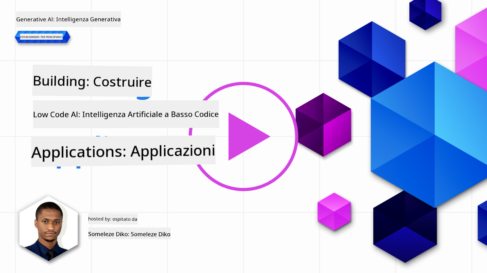
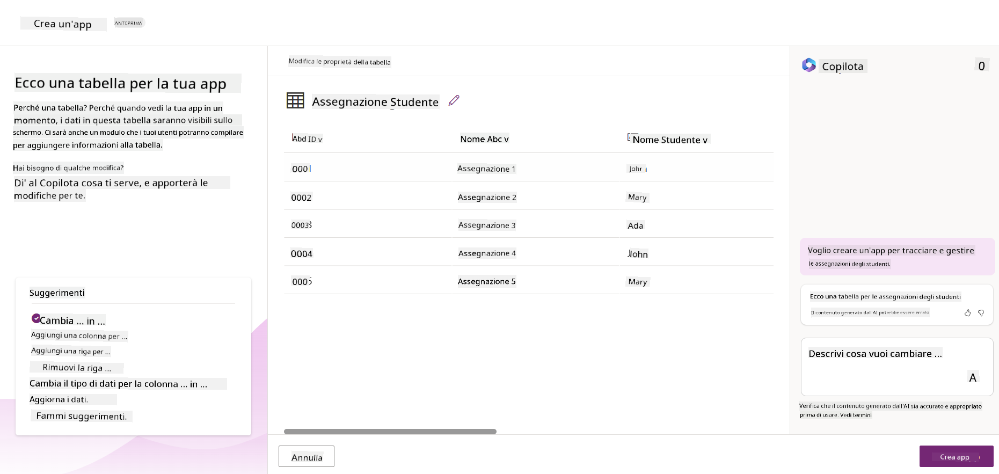
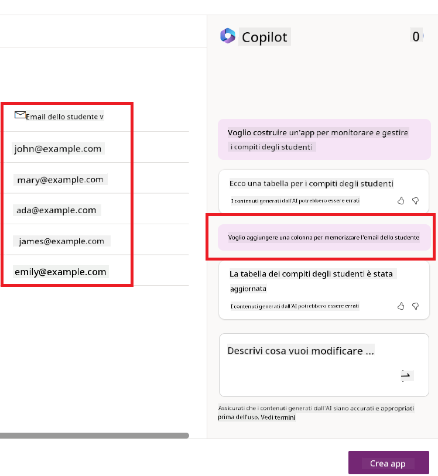
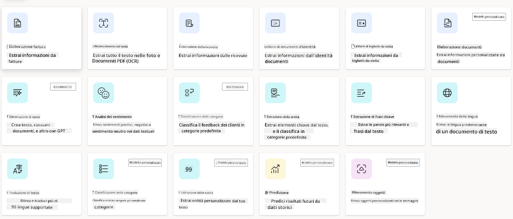
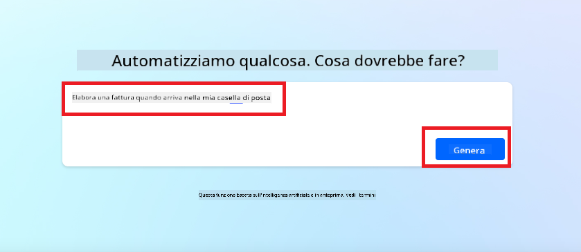
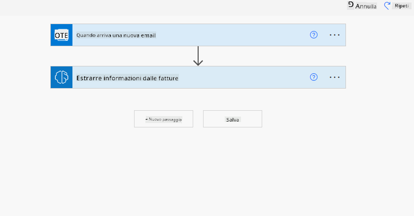
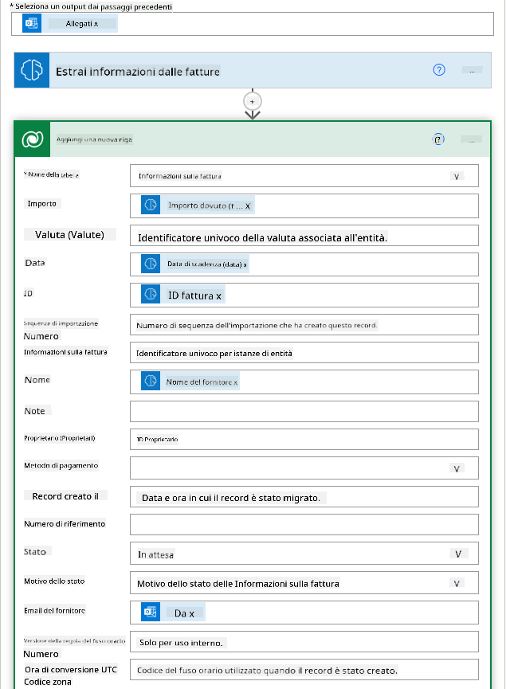
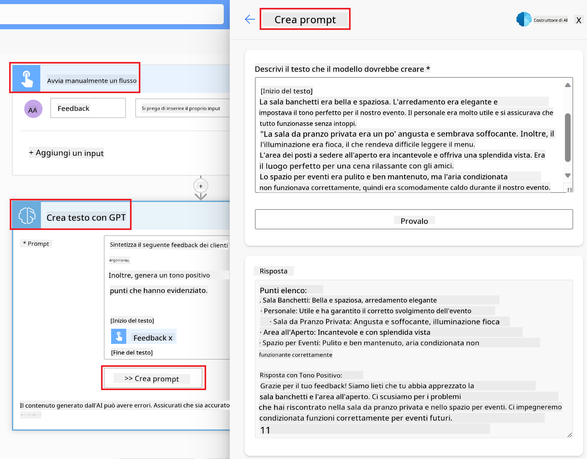

<!--
CO_OP_TRANSLATOR_METADATA:
{
  "original_hash": "f5ff3b6204a695a117d6f452403c95f7",
  "translation_date": "2025-05-19T20:17:04+00:00",
  "source_file": "10-building-low-code-ai-applications/README.md",
  "language_code": "it"
}
-->
# Costruire Applicazioni AI a Basso Codice

> _(Clicca sull'immagine sopra per vedere il video di questa lezione)_

## Introduzione

Ora che abbiamo imparato a costruire applicazioni che generano immagini, parliamo del basso codice. L'AI generativa può essere utilizzata in diversi ambiti, incluso il basso codice, ma cosa significa basso codice e come possiamo aggiungere l'AI ad esso?

Costruire app e soluzioni è diventato più facile per gli sviluppatori tradizionali e i non sviluppatori grazie all'uso delle Piattaforme di Sviluppo a Basso Codice. Queste piattaforme permettono di costruire app e soluzioni con poco o nessun codice, fornendo un ambiente di sviluppo visivo che consente di trascinare e rilasciare componenti per costruire app e soluzioni. Questo permette di costruire app e soluzioni più velocemente e con meno risorse. In questa lezione, esploreremo come utilizzare il basso codice e come migliorare lo sviluppo a basso codice con l'AI utilizzando la Power Platform.

La Power Platform offre alle organizzazioni l'opportunità di dare potere ai propri team di costruire le proprie soluzioni attraverso un ambiente intuitivo a basso codice o senza codice. Questo ambiente aiuta a semplificare il processo di costruzione delle soluzioni. Con Power Platform, le soluzioni possono essere costruite in giorni o settimane invece che in mesi o anni. Power Platform è composta da cinque prodotti chiave: Power Apps, Power Automate, Power BI, Power Pages e Copilot Studio.

Questa lezione copre:

- Introduzione all'AI Generativa in Power Platform
- Introduzione a Copilot e come usarlo
- Utilizzare l'AI Generativa per costruire app e flussi in Power Platform
- Comprendere i Modelli AI in Power Platform con AI Builder

## Obiettivi di Apprendimento

Alla fine di questa lezione, sarai in grado di:

- Comprendere come funziona Copilot in Power Platform.

- Costruire un'app di Tracciamento delle Assegnazioni degli Studenti per la nostra startup educativa.

- Costruire un flusso di Elaborazione delle Fatture che utilizza l'AI per estrarre informazioni dalle fatture.

- Applicare le migliori pratiche quando si utilizza il Modello AI GPT per la Creazione di Testo.

Gli strumenti e le tecnologie che utilizzerai in questa lezione sono:

- **Power Apps**, per l'app di Tracciamento delle Assegnazioni degli Studenti, che fornisce un ambiente di sviluppo a basso codice per costruire app per tracciare, gestire e interagire con i dati.

- **Dataverse**, per memorizzare i dati per l'app di Tracciamento delle Assegnazioni degli Studenti dove Dataverse fornirà una piattaforma dati a basso codice per memorizzare i dati dell'app.

- **Power Automate**, per il flusso di Elaborazione delle Fatture dove avrai un ambiente di sviluppo a basso codice per costruire flussi di lavoro per automatizzare il processo di Elaborazione delle Fatture.

- **AI Builder**, per il Modello AI di Elaborazione delle Fatture dove utilizzerai Modelli AI predefiniti per elaborare le fatture per la nostra startup.

## AI Generativa in Power Platform

Migliorare lo sviluppo e l'applicazione a basso codice con l'AI generativa è un'area di interesse chiave per Power Platform. L'obiettivo è consentire a tutti di costruire app, siti, dashboard e automatizzare processi con l'AI, _senza richiedere alcuna competenza in data science_. Questo obiettivo è raggiunto integrando l'AI generativa nell'esperienza di sviluppo a basso codice in Power Platform sotto forma di Copilot e AI Builder.

### Come funziona?

Copilot è un assistente AI che ti consente di costruire soluzioni Power Platform descrivendo i tuoi requisiti in una serie di passaggi conversazionali usando il linguaggio naturale. Puoi, per esempio, istruire il tuo assistente AI a dichiarare quali campi la tua app utilizzerà e questo creerà sia l'app che il modello di dati sottostante oppure potresti specificare come impostare un flusso in Power Automate.

Puoi utilizzare le funzionalità guidate da Copilot come una caratteristica nei tuoi schermi delle app per consentire agli utenti di scoprire approfondimenti attraverso interazioni conversazionali.

AI Builder è una capacità AI a basso codice disponibile in Power Platform che ti consente di utilizzare Modelli AI per aiutarti ad automatizzare processi e prevedere risultati. Con AI Builder puoi portare l'AI nelle tue app e flussi che si connettono ai tuoi dati in Dataverse o in varie fonti di dati cloud, come SharePoint, OneDrive o Azure.

Copilot è disponibile in tutti i prodotti Power Platform: Power Apps, Power Automate, Power BI, Power Pages e Power Virtual Agents. AI Builder è disponibile in Power Apps e Power Automate. In questa lezione, ci concentreremo su come utilizzare Copilot e AI Builder in Power Apps e Power Automate per costruire una soluzione per la nostra startup educativa.

### Copilot in Power Apps

Come parte della Power Platform, Power Apps fornisce un ambiente di sviluppo a basso codice per costruire app per tracciare, gestire e interagire con i dati. È una suite di servizi di sviluppo app con una piattaforma dati scalabile e la capacità di connettersi a servizi cloud e dati on-premises. Power Apps ti consente di costruire app che funzionano su browser, tablet e telefoni, e possono essere condivise con i colleghi. Power Apps facilita gli utenti nello sviluppo di app con un'interfaccia semplice, in modo che ogni utente aziendale o sviluppatore professionista possa costruire app personalizzate. L'esperienza di sviluppo delle app è anche migliorata con l'AI Generativa attraverso Copilot.

La funzionalità dell'assistente AI copilot in Power Apps ti consente di descrivere che tipo di app hai bisogno e quali informazioni vuoi che la tua app tracci, raccolga o mostri. Copilot genera quindi un'app Canvas reattiva basata sulla tua descrizione. Puoi quindi personalizzare l'app per soddisfare le tue esigenze. L'AI Copilot genera e suggerisce anche una Tabella Dataverse con i campi di cui hai bisogno per memorizzare i dati che vuoi tracciare e alcuni dati di esempio. Esamineremo cosa è Dataverse e come puoi usarlo in Power Apps in questa lezione più avanti. Puoi quindi personalizzare la tabella per soddisfare le tue esigenze utilizzando la funzionalità dell'assistente AI Copilot attraverso passaggi conversazionali. Questa funzionalità è facilmente disponibile dalla schermata principale di Power Apps.

### Copilot in Power Automate

Come parte della Power Platform, Power Automate consente agli utenti di creare flussi di lavoro automatizzati tra applicazioni e servizi. Aiuta ad automatizzare processi aziendali ripetitivi come comunicazione, raccolta dati e approvazioni di decisioni. La sua interfaccia semplice consente agli utenti con ogni competenza tecnica (dai principianti agli sviluppatori esperti) di automatizzare i compiti di lavoro. L'esperienza di sviluppo del flusso di lavoro è anche migliorata con l'AI Generativa attraverso Copilot.

La funzionalità dell'assistente AI copilot in Power Automate ti consente di descrivere che tipo di flusso hai bisogno e quali azioni vuoi che il tuo flusso esegua. Copilot genera quindi un flusso basato sulla tua descrizione. Puoi quindi personalizzare il flusso per soddisfare le tue esigenze. L'AI Copilot genera e suggerisce anche le azioni di cui hai bisogno per eseguire il compito che vuoi automatizzare. Esamineremo cosa sono i flussi e come puoi usarli in Power Automate in questa lezione più avanti. Puoi quindi personalizzare le azioni per soddisfare le tue esigenze utilizzando la funzionalità dell'assistente AI Copilot attraverso passaggi conversazionali. Questa funzionalità è facilmente disponibile dalla schermata principale di Power Automate.

## Compito: Gestire assegnazioni studentesche e fatture per la nostra startup, utilizzando Copilot

La nostra startup offre corsi online agli studenti. La startup è cresciuta rapidamente e ora sta lottando per tenere il passo con la domanda dei suoi corsi. La startup ti ha assunto come sviluppatore Power Platform per aiutarli a costruire una soluzione a basso codice per aiutarli a gestire le assegnazioni studentesche e le fatture. La loro soluzione dovrebbe essere in grado di aiutarli a tracciare e gestire le assegnazioni studentesche tramite un'app e automatizzare il processo di elaborazione delle fatture tramite un flusso di lavoro. Ti è stato chiesto di utilizzare l'AI Generativa per sviluppare la soluzione.

Quando inizi a usare Copilot, puoi utilizzare la [Power Platform Copilot Prompt Library](https://github.com/pnp/powerplatform-prompts?WT.mc_id=academic-109639-somelezediko) per iniziare con i prompt. Questa libreria contiene un elenco di prompt che puoi utilizzare per costruire app e flussi con Copilot. Puoi anche utilizzare i prompt nella libreria per avere un'idea di come descrivere i tuoi requisiti a Copilot.

### Costruire un'App di Tracciamento delle Assegnazioni Studentesche per la Nostra Startup

Gli educatori della nostra startup hanno avuto difficoltà a tenere traccia delle assegnazioni studentesche. Hanno utilizzato un foglio di calcolo per tracciare le assegnazioni, ma questo è diventato difficile da gestire con l'aumento del numero di studenti. Ti hanno chiesto di costruire un'app che li aiuti a tracciare e gestire le assegnazioni studentesche. L'app dovrebbe permettere loro di aggiungere nuove assegnazioni, visualizzare le assegnazioni, aggiornare le assegnazioni e cancellare le assegnazioni. L'app dovrebbe anche permettere agli educatori e agli studenti di visualizzare le assegnazioni che sono state valutate e quelle che non sono state valutate.

Costruirai l'app usando Copilot in Power Apps seguendo i passaggi seguenti:

1. Naviga alla schermata principale di [Power Apps](https://make.powerapps.com?WT.mc_id=academic-105485-koreyst).

1. Usa l'area di testo sulla schermata principale per descrivere l'app che vuoi costruire. Ad esempio, **_Voglio costruire un'app per tracciare e gestire le assegnazioni studentesche_**. Clicca sul pulsante **Invia** per inviare il prompt all'AI Copilot.

1. L'AI Copilot suggerirà una Tabella Dataverse con i campi di cui hai bisogno per memorizzare i dati che vuoi tracciare e alcuni dati di esempio. Puoi quindi personalizzare la tabella per soddisfare le tue esigenze utilizzando la funzionalità dell'assistente AI Copilot attraverso passaggi conversazionali.

   > **Importante**: Dataverse è la piattaforma dati sottostante per Power Platform. È una piattaforma dati a basso codice per memorizzare i dati dell'app. È un servizio completamente gestito che memorizza in modo sicuro i dati nel Cloud Microsoft ed è fornito all'interno del tuo ambiente Power Platform. Viene fornito con capacità di governance dei dati integrate, come classificazione dei dati, lineage dei dati, controllo di accesso granulare e altro. Puoi saperne di più su Dataverse [qui](https://docs.microsoft.com/powerapps/maker/data-platform/data-platform-intro?WT.mc_id=academic-109639-somelezediko).

   

1. Gli educatori vogliono inviare email agli studenti che hanno inviato le loro assegnazioni per tenerli aggiornati sullo stato delle loro assegnazioni. Puoi utilizzare Copilot per aggiungere un nuovo campo alla tabella per memorizzare l'email dello studente. Ad esempio, puoi utilizzare il seguente prompt per aggiungere un nuovo campo alla tabella: **_Voglio aggiungere una colonna per memorizzare l'email dello studente_**. Clicca sul pulsante **Invia** per inviare il prompt all'AI Copilot.

1. L'AI Copilot genererà un nuovo campo e puoi quindi personalizzare il campo per soddisfare le tue esigenze.

1. Una volta terminata la tabella, clicca sul pulsante **Crea app** per creare l'app.

1. L'AI Copilot genererà un'app Canvas reattiva basata sulla tua descrizione. Puoi quindi personalizzare l'app per soddisfare le tue esigenze.

1. Per permettere agli educatori di inviare email agli studenti, puoi utilizzare Copilot per aggiungere un nuovo schermo all'app. Ad esempio, puoi utilizzare il seguente prompt per aggiungere un nuovo schermo all'app: **_Voglio aggiungere uno schermo per inviare email agli studenti_**. Clicca sul pulsante **Invia** per inviare il prompt all'AI Copilot.

1. L'AI Copilot genererà un nuovo schermo e puoi quindi personalizzare lo schermo per soddisfare le tue esigenze.

1. Una volta terminata l'app, clicca sul pulsante **Salva** per salvare l'app.

1. Per condividere l'app con gli educatori, clicca sul pulsante **Condividi** e poi clicca nuovamente sul pulsante **Condividi**. Puoi quindi condividere l'app con gli educatori inserendo i loro indirizzi email.

> **Il tuo compito**: L'app che hai appena costruito è un buon inizio ma può essere migliorata. Con la funzionalità email, gli educatori possono solo inviare email agli studenti manualmente dovendo digitare le loro email. Puoi utilizzare Copilot per costruire un'automazione che permetta agli educatori di inviare email agli studenti automaticamente quando inviano le loro assegnazioni? Il tuo suggerimento è che con il giusto prompt puoi utilizzare Copilot in Power Automate per costruire questo.

### Costruire una Tabella Informazioni Fatture per la Nostra Startup

Il team finanziario della nostra startup ha avuto difficoltà a tenere traccia delle fatture. Hanno utilizzato un foglio di calcolo per tracciare le fatture, ma questo è diventato difficile da gestire con l'aumento del numero di fatture. Ti hanno chiesto di costruire una tabella che li aiuti a memorizzare, tracciare e gestire le informazioni delle fatture ricevute. La tabella dovrebbe essere utilizzata per costruire un'automazione che estragga tutte le informazioni delle fatture e le memorizzi nella tabella. La tabella dovrebbe anche permettere al team finanziario di visualizzare le fatture che sono state pagate e quelle che non sono state pagate.

La Power Platform ha una piattaforma dati sottostante chiamata Dataverse che ti consente di memorizzare i dati per le tue app e soluzioni. Dataverse fornisce una piattaforma dati a basso codice per memorizzare i dati dell'app. È un servizio completamente gestito che memorizza in modo sicuro i dati nel Cloud Microsoft ed è fornito all'interno del tuo ambiente Power Platform. Viene fornito con capacità di governance dei dati integrate, come classificazione dei dati, lineage dei dati, controllo di accesso granulare e altro. Puoi saperne di più [su Dataverse qui](https://docs.microsoft.com/powerapps/maker/data-platform/data-platform-intro?WT.mc_id=academic-109639-somelezediko).

Perché dovremmo usare Dataverse per la nostra startup? Le tabelle standard e personalizzate all'interno di Dataverse forniscono un'opzione di archiviazione sicura e basata sul cloud per i tuoi dati. Le tabelle ti permettono di memorizzare diversi tipi di dati, simili a come potresti usare più fogli di lavoro in un singolo file Excel. Puoi usare le tabelle per memorizzare dati specifici per le esigenze della tua organizzazione o azienda. Alcuni dei benefici che la nostra startup otterrà utilizzando Dataverse includono ma non sono limitati a:

- **Facile da gestire**: Sia i metadati che i dati sono memorizzati nel cloud, quindi non devi preoccuparti dei dettagli di come sono memorizzati o gestiti. Puoi concentrarti sulla costruzione delle tue app e soluzioni.

- **Sicuro**: Dataverse fornisce un'opzione di archiviazione sicura e basata sul cloud per i tuoi dati. Puoi controllare chi ha accesso ai dati nelle tue tabelle e come possono accedervi utilizzando la sicurezza basata sui ruoli.

- **Ricchi metadati**: I tipi di dati e le relazioni sono usati direttamente all'interno di Power Apps

- **Logica e validazione**: Puoi usare regole aziendali, campi calcolati e regole di validazione per applicare la logica aziendale e mantenere l'accuratezza dei dati.

Ora che sai cos'è Dataverse e perché dovresti usarlo, vediamo come puoi usare Copilot per creare una tabella in Dataverse per soddisfare i requisiti del nostro team finanziario.

> **Nota**: Utilizzerai questa tabella nella sezione successiva per costruire un'automazione che estragga tutte le informazioni delle fatture e le memorizzi nella tabella.
Per creare una tabella in Dataverse utilizzando Copilot, segui i passaggi seguenti: 1. Naviga alla schermata principale di [Power Apps](https://make.powerapps.com?WT.mc_id=academic-105485-koreyst). 2. Nella barra di navigazione a sinistra, selez
un testo. - **Analisi del Sentimento**: Questo modello rileva sentimenti positivi, negativi, neutri o misti nel testo. - **Lettore di Biglietti da Visita**: Questo modello estrae informazioni dai biglietti da visita. - **Riconoscimento del Testo**: Questo modello estrae testo dalle immagini. - **Rilevamento degli Oggetti**: Questo modello rileva ed estrae oggetti dalle immagini. - **Elaborazione dei Documenti**: Questo modello estrae informazioni dai moduli. - **Elaborazione delle Fatture**: Questo modello estrae informazioni dalle fatture. Con i Modelli AI Personalizzati puoi portare il tuo modello in AI Builder in modo che possa funzionare come qualsiasi modello personalizzato di AI Builder, permettendoti di addestrare il modello utilizzando i tuoi dati. Puoi utilizzare questi modelli per automatizzare processi e prevedere risultati sia in Power Apps che in Power Automate. Quando utilizzi il tuo modello ci sono delle limitazioni che si applicano. Leggi di più su queste [limitazioni](https://learn.microsoft.com/ai-builder/byo-model#limitations?WT.mc_id=academic-105485-koreyst). 

## Compito #2 - Costruisci un Flusso di Elaborazione delle Fatture per la Nostra Startup

Il team finanziario ha avuto difficoltà a elaborare le fatture. Hanno utilizzato un foglio di calcolo per tenere traccia delle fatture ma è diventato difficile gestirlo con l'aumento del numero di fatture. Ti hanno chiesto di costruire un flusso di lavoro che li aiuti a elaborare le fatture utilizzando l'AI. Il flusso di lavoro dovrebbe permettere loro di estrarre informazioni dalle fatture e memorizzare le informazioni in una tabella Dataverse. Il flusso di lavoro dovrebbe anche permettere loro di inviare un'email al team finanziario con le informazioni estratte.

Ora che sai cos'è AI Builder e perché dovresti usarlo, vediamo come puoi utilizzare il Modello AI di Elaborazione delle Fatture in AI Builder, che abbiamo trattato in precedenza, per costruire un flusso di lavoro che aiuti il team finanziario a elaborare le fatture. Per costruire un flusso di lavoro che aiuti il team finanziario a elaborare le fatture utilizzando il Modello AI di Elaborazione delle Fatture in AI Builder, segui i passaggi qui sotto:

1. Vai alla schermata principale di [Power Automate](https://make.powerautomate.com?WT.mc_id=academic-105485-koreyst).
2. Usa l'area di testo sulla schermata principale per descrivere il flusso di lavoro che vuoi costruire. Ad esempio, **_Elabora una fattura quando arriva nella mia casella di posta_**. Clicca sul pulsante **Invia** per inviare il prompt al Copilota AI. 
3. Il Copilota AI suggerirà le azioni necessarie per eseguire il compito che vuoi automatizzare. Puoi cliccare sul pulsante **Avanti** per procedere con i passaggi successivi.
4. Nel passaggio successivo, Power Automate ti chiederà di configurare le connessioni richieste per il flusso. Una volta completato, clicca sul pulsante **Crea flusso** per creare il flusso.
5. Il Copilota AI genererà un flusso e potrai quindi personalizzare il flusso per soddisfare le tue esigenze.
6. Aggiorna il trigger del flusso e imposta la **Cartella** alla cartella dove verranno memorizzate le fatture. Ad esempio, puoi impostare la cartella su **Posta in arrivo**. Clicca su **Mostra opzioni avanzate** e imposta **Solo con Allegati** su **Sì**. Questo assicurerà che il flusso venga eseguito solo quando viene ricevuta un'email con un allegato nella cartella.
7. Rimuovi le seguenti azioni dal flusso: **HTML a testo**, **Componi**, **Componi 2**, **Componi 3** e **Componi 4** perché non le utilizzerai.
8. Rimuovi l'azione **Condizione** dal flusso perché non la utilizzerai. Dovrebbe apparire come nel seguente screenshot: 
9. Clicca sul pulsante **Aggiungi un'azione** e cerca **Dataverse**. Seleziona l'azione **Aggiungi una nuova riga**.
10. Nell'azione **Estrai Informazioni dalle fatture**, aggiorna il **File della Fattura** per puntare al **Contenuto Allegato** dall'email. Questo assicurerà che il flusso estragga informazioni dall'allegato della fattura.
11. Seleziona la **Tabella** che hai creato in precedenza. Ad esempio, puoi selezionare la tabella **Informazioni Fattura**. Scegli il contenuto dinamico dall'azione precedente per popolare i seguenti campi: - ID - Importo - Data - Nome - Stato - Imposta lo **Stato** su **In sospeso**. - Email del Fornitore - Usa il contenuto dinamico **Da** dal trigger **Quando arriva una nuova email**. 
12. Una volta completato il flusso, clicca sul pulsante **Salva** per salvare il flusso. Puoi quindi testare il flusso inviando un'email con una fattura alla cartella che hai specificato nel trigger.

> **Il tuo compito**: Il flusso che hai appena costruito è un buon inizio, ora devi pensare a come puoi costruire un'automazione che permetta al nostro team finanziario di inviare un'email al fornitore per aggiornarlo sullo stato attuale della sua fattura. Il tuo suggerimento: il flusso deve essere eseguito quando lo stato della fattura cambia.

## Utilizza un Modello AI di Generazione di Testo in Power Automate

Il Modello AI di Creazione Testo con GPT in AI Builder ti consente di generare testo basato su un prompt ed è alimentato dal Servizio OpenAI di Microsoft Azure. Con questa capacità, puoi incorporare la tecnologia GPT (Generative Pre-Trained Transformer) nelle tue app e flussi per costruire una varietà di flussi automatizzati e applicazioni perspicaci.

I modelli GPT sono sottoposti a un addestramento approfondito su enormi quantità di dati, permettendo loro di produrre testo che somiglia da vicino al linguaggio umano quando viene fornito un prompt. Quando integrati con l'automazione dei flussi di lavoro, i modelli AI come GPT possono essere sfruttati per semplificare e automatizzare una vasta gamma di compiti.

Ad esempio, puoi costruire flussi per generare automaticamente testo per una varietà di casi d'uso, come: bozze di email, descrizioni di prodotti e altro ancora. Puoi anche utilizzare il modello per generare testo per una varietà di app, come chatbot e app di assistenza clienti che consentono agli agenti del servizio clienti di rispondere in modo efficace ed efficiente alle richieste dei clienti.

Per imparare a utilizzare questo Modello AI in Power Automate, segui il modulo [Aggiungi intelligenza con AI Builder e GPT](https://learn.microsoft.com/training/modules/ai-builder-text-generation/?WT.mc_id=academic-109639-somelezediko).

## Ottimo Lavoro! Continua il Tuo Apprendimento

Dopo aver completato questa lezione, dai un'occhiata alla nostra [collezione di Apprendimento AI Generativa](https://aka.ms/genai-collection?WT.mc_id=academic-105485-koreyst) per continuare a migliorare la tua conoscenza dell'AI Generativa!

Vai alla Lezione 11 dove vedremo come [integrare AI Generativa con Chiamata Funzione](../11-integrating-with-function-calling/README.md?WT.mc_id=academic-105485-koreyst)!

**Disclaimer**:  
Questo documento è stato tradotto utilizzando il servizio di traduzione AI [Co-op Translator](https://github.com/Azure/co-op-translator). Sebbene ci impegniamo per l'accuratezza, si prega di essere consapevoli che le traduzioni automatiche possono contenere errori o imprecisioni. Il documento originale nella sua lingua madre dovrebbe essere considerato la fonte autorevole. Per informazioni critiche, si raccomanda la traduzione professionale umana. Non siamo responsabili per eventuali incomprensioni o interpretazioni errate derivanti dall'uso di questa traduzione.