# Costruire applicazioni AI a basso codice  

[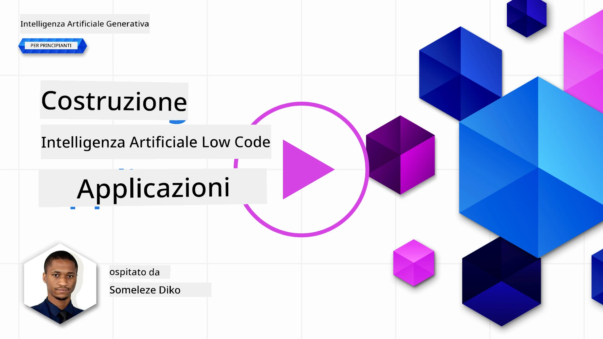](https://youtu.be/1vzq3Nd8GBA?si=h6LHWJXdmqf6mhDg)  

> _(Fai clic sull'immagine sopra per visualizzare il video di questa lezione)_  

## Introduzione  

Ora che abbiamo imparato come costruire applicazioni di generazione di immagini, parliamo di low code. L'AI generativa può essere utilizzata in diversi ambiti, incluso il low code, ma cos'è il low code e come possiamo aggiungere l'AI a questo?  

Costruire app e soluzioni è diventato più facile sia per sviluppatori tradizionali che per non sviluppatori grazie all'uso di piattaforme di sviluppo low code. Le piattaforme di sviluppo low code permettono di creare app e soluzioni con poco o nessun codice. Ciò è possibile fornendo un ambiente di sviluppo visivo che consente di trascinare e rilasciare componenti per costruire app e soluzioni. Questo permette di creare app e soluzioni più velocemente e con meno risorse. In questa lezione, approfondiremo come usare il Low Code e come migliorare lo sviluppo low code con l'AI usando Power Platform.  

Power Platform offre alle organizzazioni l'opportunità di potenziare i loro team per costruire le proprie soluzioni attraverso un ambiente intuitivo a basso o nessun codice. Questo ambiente aiuta a semplificare il processo di costruzione delle soluzioni. Con Power Platform, le soluzioni possono essere realizzate in giorni o settimane anziché mesi o anni. Power Platform si compone di cinque prodotti chiave: Power Apps, Power Automate, Power BI, Power Pages e Copilot Studio.  

Questa lezione copre:  

- Introduzione all' AI generativa in Power Platform  
- Introduzione a Copilot e come usarlo  
- Usare l'AI generativa per costruire app e flussi in Power Platform  
- Comprendere i modelli AI in Power Platform con AI Builder  
- Costruire agenti intelligenti con Microsoft Copilot Studio  

## Obiettivi di apprendimento  

Al termine di questa lezione, sarai in grado di:  

- Capire come funziona Copilot in Power Platform.  

- Costruire un'app Student Assignment Tracker per la nostra startup educativa.  

- Costruire un flusso di elaborazione fatture che usa l'AI per estrarre informazioni dalle fatture.  

- Applicare best practice quando si usa il modello AI Create Text con GPT.  

- Comprendere cos'è Microsoft Copilot Studio e come costruire agenti intelligenti con esso.  

Gli strumenti e le tecnologie che utilizzerai in questa lezione sono:  

- **Power Apps**, per l'app Student Assignment Tracker, che fornisce un ambiente di sviluppo low code per costruire app per tracciare, gestire e interagire con i dati.  

- **Dataverse**, per memorizzare i dati per l'app Student Assignment Tracker, dove Dataverse fornirà una piattaforma di dati low code per memorizzare i dati dell'app.  

- **Power Automate**, per il flusso di elaborazione delle fatture, dove avrai un ambiente di sviluppo low code per costruire workflow per automatizzare il processo di elaborazione fatture.  

- **AI Builder**, per il modello AI di elaborazione fatture, dove userai modelli AI predefiniti per elaborare le fatture per la nostra startup.  

## AI generativa in Power Platform  

Migliorare lo sviluppo low code e le applicazioni con l'AI generativa è un'area chiave di interesse per Power Platform. L'obiettivo è permettere a tutti di costruire app, siti, dashboard abilitati all'AI e automatizzare i processi con l'AI, _senza richiedere competenze di data science_. Questo obiettivo è raggiunto integrando l'AI generativa nell'esperienza di sviluppo low code in Power Platform sotto forma di Copilot e AI Builder.  

### Come funziona?  

Copilot è un assistente AI che ti permette di costruire soluzioni Power Platform descrivendo le tue esigenze in una serie di passaggi conversazionali usando il linguaggio naturale. Puoi per esempio istruire il tuo assistente AI a indicare quali campi la tua app userà e creerà sia l'app sia il modello dati sottostante oppure potresti specificare come configurare un flusso in Power Automate.  

Puoi usare funzionalità guidate da Copilot come una funzione nelle schermate della tua app per consentire agli utenti di scoprire informazioni tramite interazioni conversazionali.  

AI Builder è una capacità AI low code disponibile in Power Platform che ti permette di usare modelli AI per aiutarti ad automatizzare processi e prevedere risultati. Con AI Builder puoi portare l'AI alle tue app e flussi che si collegano ai tuoi dati in Dataverse o in varie fonti cloud, come SharePoint, OneDrive o Azure.  

Copilot è disponibile in tutti i prodotti Power Platform: Power Apps, Power Automate, Power BI, Power Pages e Copilot Studio (ex Power Virtual Agents). AI Builder è disponibile in Power Apps e Power Automate. In questa lezione ci concentreremo sull'uso di Copilot e AI Builder in Power Apps e Power Automate per costruire una soluzione per la nostra startup educativa.  

### Copilot in Power Apps  

Come parte di Power Platform, Power Apps fornisce un ambiente di sviluppo low code per costruire app per tracciare, gestire e interagire con i dati. È una suite di servizi di sviluppo app con una piattaforma dati scalabile e la capacità di connettersi a servizi cloud e dati on-premises. Power Apps ti permette di costruire app che funzionano su browser, tablet e telefoni, e possono essere condivise con i colleghi. Power Apps facilita gli utenti a sviluppare app con un'interfaccia semplice, così che ogni utente business o sviluppatore esperto possa costruire app personalizzate. L'esperienza di sviluppo delle app è anche migliorata con l'AI generativa tramite Copilot.  

La funzione assistente AI copilot in Power Apps ti permette di descrivere che tipo di app ti serve e quali informazioni vuoi che la tua app traccia, raccolga o mostri. Copilot genera quindi un'app Canvas reattiva basata sulla tua descrizione. Puoi quindi personalizzare l'app per soddisfare le tue esigenze. L'AI Copilot genera e suggerisce anche una tabella Dataverse con i campi necessari per memorizzare i dati che vuoi tracciare e alcuni dati di esempio. Più avanti in questa lezione vedremo cosa è Dataverse e come usarlo in Power Apps. Puoi quindi personalizzare la tabella per soddisfare le tue esigenze usando la funzione assistente AI Copilot attraverso passaggi conversazionali. Questa funzione è facilmente accessibile dalla schermata principale di Power Apps.  

### Copilot in Power Automate  

Come parte di Power Platform, Power Automate permette agli utenti di creare flussi di lavoro automatizzati tra applicazioni e servizi. Aiuta ad automatizzare processi aziendali ripetitivi come comunicazione, raccolta dati e approvazioni di decisioni. La sua interfaccia semplice consente a utenti di ogni competenza tecnica (da principianti a sviluppatori esperti) di automatizzare compiti lavorativi. L'esperienza di sviluppo dei workflow è anche migliorata con l'AI generativa tramite Copilot.  

La funzione assistente AI copilot in Power Automate ti permette di descrivere che tipo di flusso ti serve e quali azioni vuoi che il tuo flusso esegua. Copilot genera quindi un flusso basato sulla tua descrizione. Puoi quindi personalizzare il flusso per soddisfare le tue esigenze. L'AI Copilot genera e suggerisce anche le azioni necessarie per svolgere il compito che vuoi automatizzare. Nel corso della lezione vedremo cosa sono i flussi e come usarli in Power Automate. Puoi quindi personalizzare le azioni per soddisfare le tue esigenze usando la funzione assistente AI Copilot attraverso passaggi conversazionali. Questa funzione è facilmente accessibile dalla schermata principale di Power Automate.  

## Costruire agenti intelligenti con Microsoft Copilot Studio  

[Microsoft Copilot Studio](https://learn.microsoft.com/microsoft-copilot-studio/fundamentals-what-is-copilot-studio?WT.mc_id=academic-105485-koreyst) (ex Power Virtual Agents) è il componente low code di Power Platform per costruire **agenti AI** — copiloti conversazionali che possono rispondere a domande, eseguire azioni e automatizzare compiti per conto dei tuoi utenti. Proprio come il resto di Power Platform, costruisci questi agenti in un'esperienza visiva e focalizzata sul linguaggio naturale: descrivi cosa vuoi che l'agente faccia e Copilot Studio aiuta a strutturarne le istruzioni, la conoscenza e le azioni.  

Per la nostra startup educativa, potresti costruire un agente che risponde alle domande degli studenti sui corsi, controlla le scadenze degli assignment e perfino invia email a un istruttore — tutto senza scrivere codice.  

Ecco alcune delle ultime funzionalità che rendono Copilot Studio potente:  

- **Risposte generative dalla tua conoscenza**. Invece di costruire manualmente ogni conversazione, puoi connettere **fonti di conoscenza** — siti web pubblici, SharePoint, OneDrive, Dataverse, file caricati o dati aziendali tramite connettori — e l'agente genera risposte fondate su questi contenuti.  

- **Orchestrazione generativa**. Piuttosto che affidarsi a frasi trigger rigide, l'agente usa l'AI per comprendere una richiesta e decidere dinamicamente quali conoscenze, argomenti e azioni combinare per soddisfarla, inclusa la concatenazione di più passaggi.  

- **Azioni e connettori**. Gli agenti possono *fare* cose, non solo chattare. Puoi fornire a un agente azioni supportate dai 1.500+ connettori Power Platform predefiniti, flussi Power Automate, API REST personalizzate, prompt o server **Model Context Protocol (MCP)**.  

- **Agenti autonomi**. Gli agenti non sono limitati a rispondere in una finestra chat. Puoi costruire **agenti autonomi** che si attivano per eventi — come nuova email, nuovo record in Dataverse o caricamento di file — e agiscono in background per completare un compito.  

- **Orchestrazione multi-agente**. Gli agenti possono chiamare altri agenti. Un agente Copilot Studio può passare il controllo o essere esteso da altri agenti, inclusi agenti pubblicati in Microsoft 365 Copilot e agenti costruiti in Microsoft Foundry.  

- **Scelta del modello**. Oltre ai modelli integrati, puoi portare modelli dal catalogo Microsoft Foundry per personalizzare come il tuo agente ragiona e risponde.  

- **Pubblica ovunque**. Una volta costruito, un agente può essere pubblicato su più canali — Microsoft Teams, Microsoft 365 Copilot, un sito web o app personalizzata, e altro — con sicurezza, autenticazione e analitiche gestite tramite l'esperienza di amministrazione di Power Platform.  

Puoi iniziare a costruire il tuo primo agente su [copilotstudio.microsoft.com](https://copilotstudio.microsoft.com?WT.mc_id=academic-105485-koreyst) e imparare di più nella [documentazione Microsoft Copilot Studio](https://learn.microsoft.com/microsoft-copilot-studio/?WT.mc_id=academic-105485-koreyst).  

## Compito: Gestire assignment studenteschi e fatture per la nostra startup, usando Copilot  

La nostra startup offre corsi online agli studenti. La startup è cresciuta rapidamente e ora fatica a tenere il passo con la domanda dei suoi corsi. Hanno assunto te come sviluppatore Power Platform per aiutarli a costruire una soluzione low code per gestire assignment studenteschi e fatture. La soluzione deve aiutarli a tracciare e gestire gli assignment tramite un'app e automatizzare il processo di elaborazione fatture tramite un workflow. Ti è stato chiesto di usare l'AI generativa per sviluppare la soluzione.  

Quando inizi a usare Copilot, puoi usare la [Power Platform Copilot Prompt Library](https://github.com/pnp/powerplatform-prompts?WT.mc_id=academic-109639-somelezediko) per iniziare con i prompt. Questa libreria contiene una lista di prompt che puoi usare per costruire app e flussi con Copilot. Puoi anche usare i prompt in libreria per farti un'idea di come descrivere le tue esigenze a Copilot.  

### Costruire un'app Student Assignment Tracker per la nostra startup  

Gli educatori della nostra startup hanno avuto difficoltà a tenere traccia degli assignment degli studenti. Usavano un foglio di calcolo per tracciare gli assignment ma è diventato difficile da gestire con l'aumento degli studenti. Ti hanno chiesto di costruire un'app che li aiuti a tracciare e gestire gli assignment studenteschi. L'app deve permettere di aggiungere nuovi assignment, visualizzare, aggiornare e cancellare assignment. Deve anche permettere a educatori e studenti di vedere quali assignment sono stati valutati e quali no.  

Costruirai l'app usando Copilot in Power Apps seguendo i passaggi seguenti:  

1. Naviga alla schermata principale di [Power Apps](https://make.powerapps.com?WT.mc_id=academic-105485-koreyst).  

1. Usa l’area di testo nella schermata principale per descrivere l’app che vuoi costruire. Per esempio, **_Voglio costruire un'app per tracciare e gestire gli assignment degli studenti_**. Clicca sul pulsante **Invia** per inviare il prompt all’AI Copilot.  

  

1. L’AI Copilot suggerirà una tabella Dataverse con i campi necessari per memorizzare i dati che vuoi tracciare e qualche dato di esempio. Puoi quindi personalizzare la tabella per soddisfare le tue esigenze usando la funzione assistente AI Copilot tramite passaggi conversazionali.  

   > **Importante**: Dataverse è la piattaforma dati sottostante per Power Platform. È una piattaforma dati low code per memorizzare i dati dell'app. È un servizio completamente gestito che memorizza i dati in modo sicuro nel Microsoft Cloud ed è fornito all'interno del tuo ambiente Power Platform. Include capacità di governance dei dati integrate, come classificazione dati, tracciamento dei dati, controllo accessi granulare e altro. Puoi saperne di più su Dataverse [qui](https://docs.microsoft.com/powerapps/maker/data-platform/data-platform-intro?WT.mc_id=academic-109639-somelezediko).  

   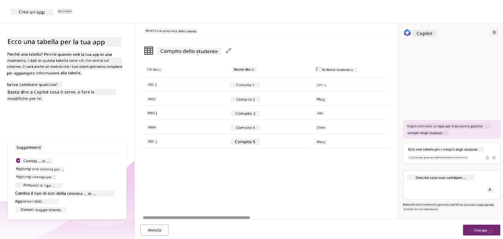  

1. Gli educatori vogliono inviare email agli studenti che hanno consegnato gli assignment per aggiornarli sul progresso. Puoi usare Copilot per aggiungere un nuovo campo alla tabella per memorizzare l’email dello studente. Per esempio, puoi usare il seguente prompt per aggiungere una nuova colonna alla tabella: **_Voglio aggiungere una colonna per memorizzare l’email degli studenti_**. Clicca sul pulsante **Invia** per inviare il prompt all’AI Copilot.  

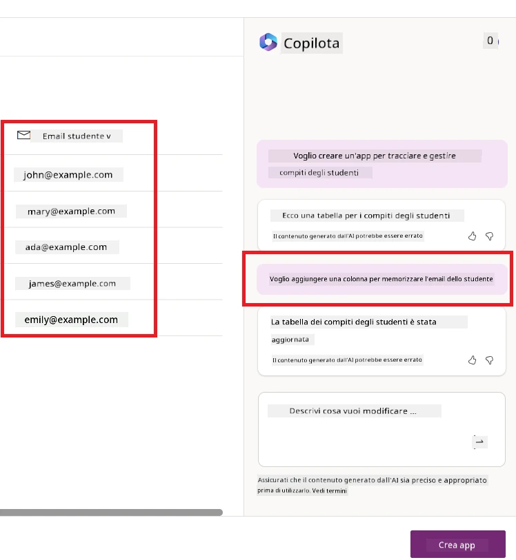  

1. L’AI Copilot genererà un nuovo campo che potrai quindi personalizzare per soddisfare le tue esigenze.  

1. Una volta terminata la tabella, fai clic sul pulsante **Crea app** per creare l'app.

1. L'AI Copilot genererà un'app Canvas reattiva basata sulla tua descrizione. Potrai quindi personalizzare l'app per soddisfare le tue esigenze.

1. Per gli insegnanti che vogliono inviare email agli studenti, puoi utilizzare Copilot per aggiungere una nuova schermata all'app. Ad esempio, puoi usare il seguente prompt per aggiungere una nuova schermata all'app: **_Voglio aggiungere una schermata per inviare email agli studenti_**. Clicca sul pulsante **Invia** per inviare il prompt all'AI Copilot.

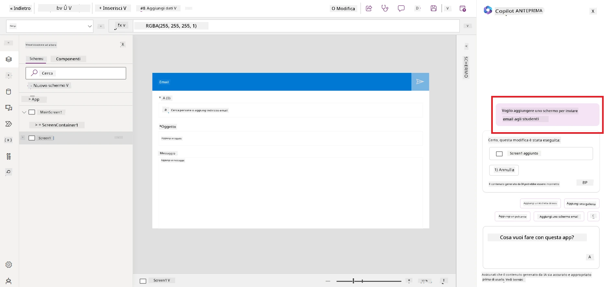

1. L'AI Copilot genererà una nuova schermata e potrai quindi personalizzarla per soddisfare le tue esigenze.

1. Una volta terminata l'app, fai clic sul pulsante **Salva** per salvare l'app.

1. Per condividere l'app con gli insegnanti, fai clic sul pulsante **Condividi** e poi fai clic nuovamente sul pulsante **Condividi**. Potrai quindi condividere l'app con gli insegnanti inserendo i loro indirizzi email.

> **Il tuo compito**: L'app che hai appena creato è un buon inizio ma può essere migliorata. Con la funzionalità email, gli insegnanti possono inviare email agli studenti solo manualmente, digitando gli indirizzi email. Puoi usare Copilot per costruire un'automazione che permetta agli insegnanti di inviare automaticamente email agli studenti quando consegnano i loro compiti? Il suggerimento è che con il prompt giusto puoi usare Copilot in Power Automate per costruire questo.

### Costruisci una Tabella Informazioni Fatture per la Nostra Startup

Il team finanziario della nostra startup ha avuto difficoltà a tenere traccia delle fatture. Stanno usando un foglio di calcolo per monitorare le fatture, ma è diventato difficile gestirlo poiché il numero delle fatture è aumentato. Ti hanno chiesto di creare una tabella che li aiuti a conservare, tracciare e gestire le informazioni delle fatture ricevute. La tabella deve essere utilizzata per costruire un'automazione che estrarrà tutte le informazioni delle fatture e le memorizzerà nella tabella. La tabella dovrebbe anche permettere al team finanziario di visualizzare quali fatture sono state pagate e quali no.

La Power Platform dispone di una piattaforma dati sottostante chiamata Dataverse che consente di memorizzare i dati per le tue app e soluzioni. Dataverse fornisce una piattaforma dati low-code per archiviare i dati dell'app. È un servizio completamente gestito che memorizza in modo sicuro i dati nel Microsoft Cloud ed è fornito all'interno del tuo ambiente Power Platform. Include capacità integrate di governance dei dati, come classificazione dei dati, origine dei dati, controllo di accesso granulare e altro. Puoi saperne di più [su Dataverse qui](https://docs.microsoft.com/powerapps/maker/data-platform/data-platform-intro?WT.mc_id=academic-109639-somelezediko).

Perché dovremmo usare Dataverse per la nostra startup? Le tabelle standard e personalizzate in Dataverse offrono una soluzione di archiviazione sicura e basata sul cloud per i tuoi dati. Le tabelle ti permettono di archiviare diversi tipi di dati, simile a come potresti usare più fogli di lavoro in un singolo file Excel. Puoi usare le tabelle per archiviare dati specifici per la tua organizzazione o esigenze di business. Alcuni dei vantaggi che la nostra startup otterrà usando Dataverse includono, ma non solo:

- **Facile da gestire**: sia i metadata che i dati sono archiviati nel cloud, quindi non devi preoccuparti dei dettagli di come vengono archiviati o gestiti. Puoi concentrarti sulla costruzione delle tue app e soluzioni.

- **Sicuro**: Dataverse offre un'opzione di archiviazione sicura e basata sul cloud per i tuoi dati. Puoi controllare chi ha accesso ai dati nelle tue tabelle e come vi accede, tramite la sicurezza basata sui ruoli.

- **Ricchi metadata**: Tipi di dati e relazioni sono usati direttamente in Power Apps

- **Logica e validazione**: Puoi usare regole di business, campi calcolati e regole di validazione per imporre la logica di business e mantenere l'accuratezza dei dati.

Ora che sai cos'è Dataverse e perché dovresti usarlo, vediamo come puoi usare Copilot per creare una tabella in Dataverse che soddisfi i requisiti del nostro team finanziario.

> **Nota** : Userai questa tabella nella sezione successiva per costruire un'automazione che estrarrà tutte le informazioni delle fatture e le conserverà nella tabella.

Per creare una tabella in Dataverse usando Copilot, segui i passaggi seguenti:

1. Vai alla schermata principale di [Power Apps](https://make.powerapps.com?WT.mc_id=academic-105485-koreyst).

2. Nella barra di navigazione a sinistra, seleziona **Tabelle** e poi clicca su **Descrivi la nuova Tabella**.

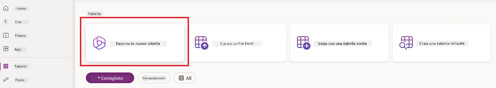

1. Nella schermata **Descrivi la nuova Tabella**, usa l'area di testo per descrivere la tabella che vuoi creare. Per esempio, **_Voglio creare una tabella per conservare informazioni sulle fatture_**. Clicca sul pulsante **Invia** per spedire il prompt all'AI Copilot.

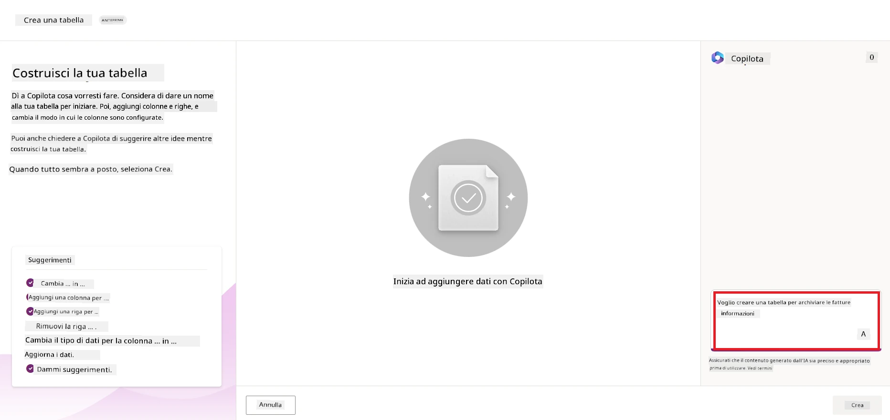

1. L'AI Copilot suggerirà una tabella Dataverse con i campi necessari per conservare i dati che vuoi monitorare e alcuni dati di esempio. Potrai quindi personalizzare la tabella per soddisfare le tue esigenze usando la funzione assistente AI Copilot tramite passaggi conversazionali.

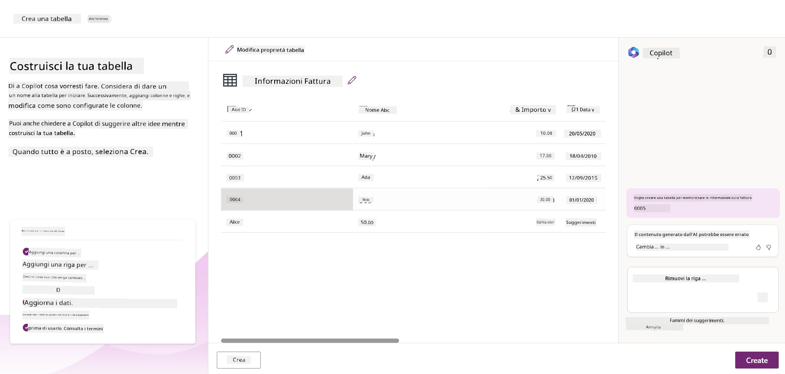

1. Il team finanziario vuole inviare un'email al fornitore per aggiornarlo sullo stato attuale della loro fattura. Puoi usare Copilot per aggiungere un nuovo campo alla tabella per conservare l'email del fornitore. Per esempio, puoi usare il seguente prompt per aggiungere un nuovo campo alla tabella: **_Voglio aggiungere una colonna per conservare email del fornitore_**. Clicca sul pulsante **Invia** per spedire il prompt all'AI Copilot.

1. L'AI Copilot genererà un nuovo campo e potrai personalizzarlo per soddisfare le tue esigenze.

1. Una volta terminata la tabella, fai clic sul pulsante **Crea** per creare la tabella.

## Modelli AI in Power Platform con AI Builder

AI Builder è una capacità AI low-code disponibile in Power Platform che ti consente di usare Modelli AI per aiutarti a automatizzare i processi e prevedere i risultati. Con AI Builder puoi integrare l'AI nelle tue app e flussi collegati ai dati in Dataverse o in diverse fonti dati cloud, come SharePoint, OneDrive o Azure.

## Modelli AI Preconfigurati vs Modelli AI Personalizzati

AI Builder offre due tipi di Modelli AI: Modelli AI Preconfigurati e Modelli AI Personalizzati. I Modelli AI Preconfigurati sono modelli pronti all'uso, addestrati da Microsoft e disponibili in Power Platform. Ti aiutano ad aggiungere intelligenza alle tue app e flussi senza dover raccogliere dati, costruire, addestrare e pubblicare i tuoi modelli. Puoi usare questi modelli per automatizzare processi e prevedere risultati.

Alcuni Modelli AI Preconfigurati disponibili in Power Platform includono:

- **Estrazione di Frasi Chiave**: questo modello estrae frasi chiave dal testo.
- **Rilevamento della Lingua**: questo modello rileva la lingua di un testo.
- **Analisi del Sentimento**: questo modello rileva sentimenti positivi, negativi, neutrali o misti nel testo.
- **Lettore di Biglietti da Visita**: questo modello estrae informazioni dai biglietti da visita.
- **Riconoscimento del Testo**: questo modello estrae testo dalle immagini.
- **Rilevamento Oggetti**: questo modello rileva ed estrae oggetti dalle immagini.
- **Elaborazione Documenti**: questo modello estrae informazioni dai moduli.
- **Elaborazione Fatture**: questo modello estrae informazioni dalle fatture.

Con Modelli AI Personalizzati puoi portare un tuo modello in AI Builder in modo che possa funzionare come qualsiasi modello personalizzato di AI Builder, permettendoti di addestrare il modello usando i tuoi dati. Puoi usare questi modelli per automatizzare processi e prevedere risultati sia in Power Apps che in Power Automate. Quando usi un tuo modello si applicano alcune limitazioni. Leggi di più su queste [limitazioni](https://learn.microsoft.com/ai-builder/byo-model#limitations?WT.mc_id=academic-105485-koreyst).

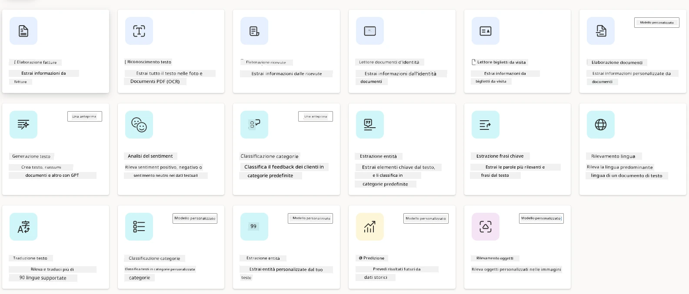

## Compito #2 - Costruire un Flusso di Elaborazione Fatture per la Nostra Startup

Il team finanziario ha avuto difficoltà a elaborare le fatture. Stavano usando un foglio di calcolo per tenere traccia, ma è diventato difficile gestirlo con l’aumento delle fatture. Ti hanno chiesto di costruire un flusso di lavoro che li aiuti nell'elaborazione delle fatture usando l’AI. Il flusso di lavoro dovrebbe permettere di estrarre informazioni dalle fatture e conservarle in una tabella Dataverse. Il flusso dovrebbe inoltre permettere di inviare un’email al team finanziario con le informazioni estratte.

Ora che sai cos'è AI Builder e perché dovresti usarlo, vediamo come usare il Modello AI di Elaborazione Fatture in AI Builder, di cui abbiamo parlato prima, per costruire un flusso che aiuti il team finanziario nell'elaborazione delle fatture.

Per costruire un flusso di lavoro che aiuti il team finanziario nell’elaborazione delle fatture usando il Modello AI di Elaborazione Fatture in AI Builder, segui i passaggi sotto:

1. Vai alla schermata principale di [Power Automate](https://make.powerautomate.com?WT.mc_id=academic-105485-koreyst).

2. Usa l’area testo nella schermata principale per descrivere il flusso che vuoi costruire. Per esempio, **_Elabora una fattura quando arriva nella mia casella di posta_**. Clicca sul pulsante **Invia** per spedire il prompt all'AI Copilot.

   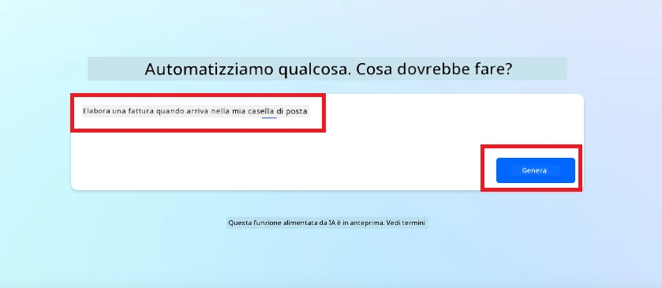

3. L'AI Copilot suggerirà le azioni necessarie per svolgere il compito che vuoi automatizzare. Puoi cliccare sul pulsante **Avanti** per passare ai passaggi successivi.

4. Nel passaggio successivo, Power Automate ti chiederà di configurare le connessioni richieste per il flusso. Terminata la configurazione, clicca su **Crea flusso** per creare il flusso.

5. L'AI Copilot genererà un flusso che potrai personalizzare per soddisfare le tue esigenze.

6. Aggiorna il trigger del flusso impostando la **Cartella** dove saranno archiviate le fatture. Per esempio, puoi impostare la cartella su **Posta in arrivo**. Clicca su **Mostra opzioni avanzate** e imposta **Solo con allegati** su **Sì**. Questo garantirà che il flusso si attivi solo quando arriva una email con allegato nella cartella.

7. Rimuovi le seguenti azioni dal flusso: **HTML a testo**, **Componi**, **Componi 2**, **Componi 3** e **Componi 4** perché non le userai.

8. Rimuovi l’azione **Condizione** dal flusso perché non la userai. Dovrebbe assomigliare all’immagine seguente:

   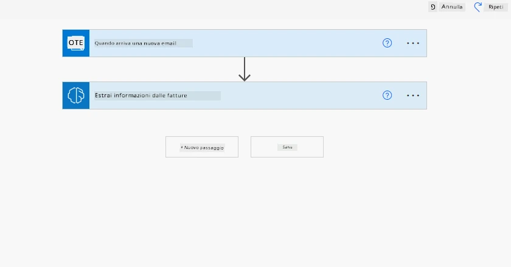

9. Clicca sul pulsante **Aggiungi un'azione** e cerca **Dataverse**. Seleziona l'azione **Aggiungi una nuova riga**.

10. Nell’azione **Estrai informazioni dalle fatture**, aggiorna il campo **File fattura** per puntare a **Contenuto allegato** dall’email. Questo garantisce che il flusso estragga informazioni dall’allegato fattura.

11. Seleziona la **Tabella** creata in precedenza. Per esempio, puoi selezionare la tabella **Informazioni fattura**. Scegli il contenuto dinamico dall’azione precedente per popolare i seguenti campi:

    - ID
    - Importo
    - Data
    - Nome
    - Stato - Imposta lo **Stato** su **In sospeso**.
    - Email fornitore - Usa il contenuto dinamico **Da** dal trigger **Quando arriva una nuova email**.

    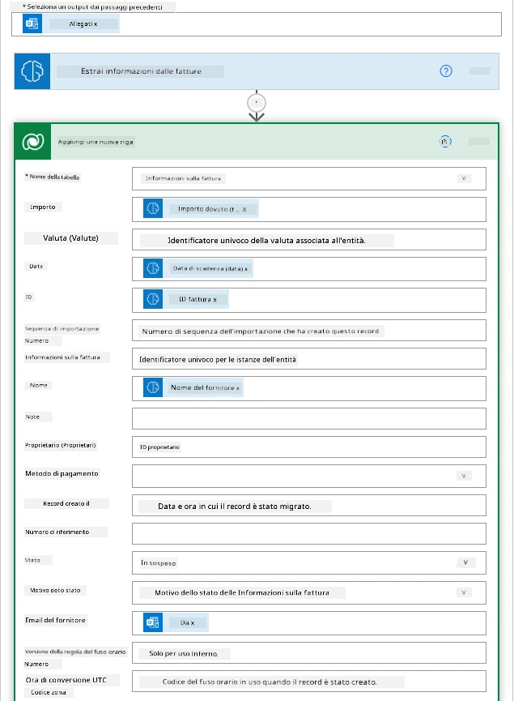

12. Una volta terminato il flusso, clicca su **Salva** per salvarlo. Potrai quindi testare il flusso inviando un'email con una fattura alla cartella specificata nel trigger.

> **Il tuo compito**: Il flusso che hai creato è un buon inizio, ora devi pensare a come costruire un'automazione che permetta al nostro team finanziario di inviare un'email al fornitore per aggiornarlo sullo stato attuale della loro fattura. Il suggerimento: il flusso deve attivarsi quando cambia lo stato della fattura.

## Usa un Modello AI di Generazione Testo in Power Automate

Il modello AI Crea Testo con GPT in AI Builder ti permette di generare testo basato su un prompt ed è alimentato dal Microsoft Azure OpenAI Service. Con questa capacità puoi integrare la tecnologia GPT (Generative Pre-Trained Transformer) nelle tue app e nei tuoi flussi per costruire vari flussi automatizzati e applicazioni intelligenti.

I modelli GPT vengono addestrati estensivamente su grandi quantità di dati, permettendo loro di produrre testo che somiglia molto al linguaggio umano quando viene fornito un prompt. Integrati con l'automazione dei flussi di lavoro, modelli AI come GPT possono essere usati per semplificare e automatizzare una vasta gamma di compiti.

Per esempio, puoi costruire flussi per generare automaticamente testo per vari casi d'uso, come: bozze di email, descrizioni di prodotti e altro ancora. Puoi anche usare il modello per generare testo per diverse app, come chatbot e app per il servizio clienti che permettono agli operatori di rispondere efficacemente ed efficientemente alle richieste dei clienti.

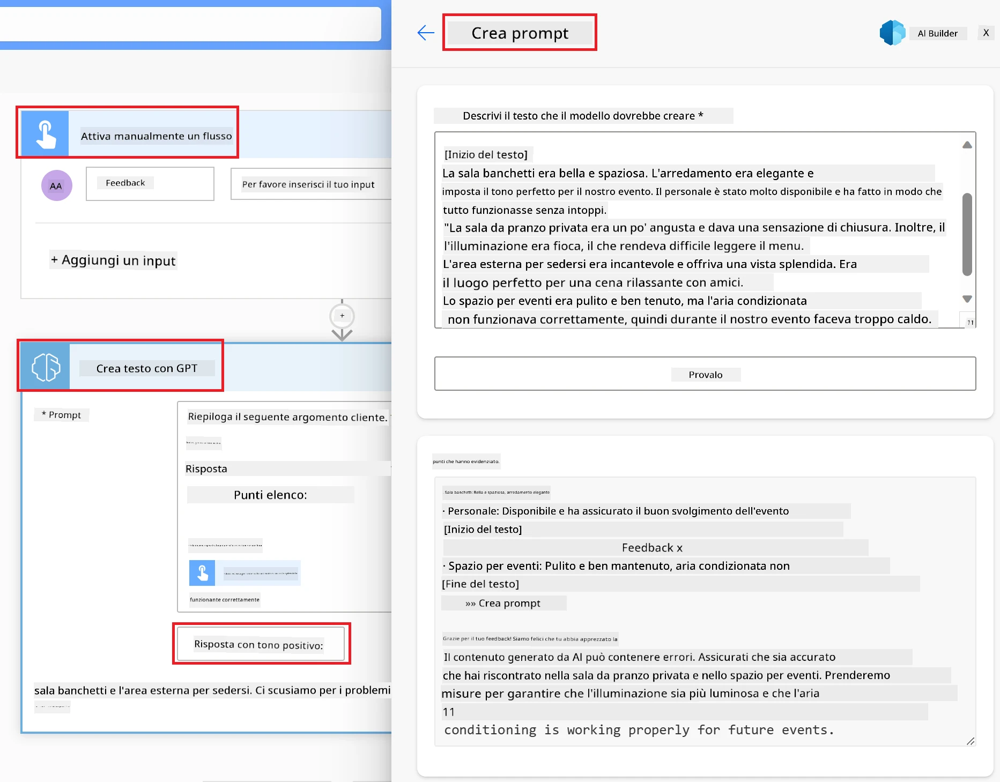

Per imparare come utilizzare questo Modello AI in Power Automate, consulta il modulo [Aggiungi intelligenza con AI Builder e GPT](https://learn.microsoft.com/training/modules/ai-builder-text-generation/?WT.mc_id=academic-109639-somelezediko).

## Ottimo lavoro! Continua il tuo apprendimento

Dopo aver completato questa lezione, dai un'occhiata alla nostra [collezione di apprendimento sull'IA generativa](https://aka.ms/genai-collection?WT.mc_id=academic-105485-koreyst) per continuare a migliorare la tua conoscenza sull'IA generativa!

Vuoi personalizzare e ottenere di più da Copilot? Esplora [Awesome Copilot](https://github.com/github/awesome-copilot?WT.mc_id=academic-105485-koreyst) — una collezione di istruzioni, agenti, competenze e configurazioni contribuite dalla comunità per aiutarti a sfruttare al meglio GitHub Copilot.

Vai alla Lezione 11 dove esamineremo come [integrare l'IA generativa con la Chiamata di Funzioni](../11-integrating-with-function-calling/README.md?WT.mc_id=academic-105485-koreyst)!

---

<!-- CO-OP TRANSLATOR DISCLAIMER START -->
**Disclaimer**:
Questo documento è stato tradotto utilizzando il servizio di traduzione AI [Co-op Translator](https://github.com/Azure/co-op-translator). Sebbene ci impegniamo per garantire la precisione, si prega di notare che le traduzioni automatizzate possono contenere errori o imprecisioni. Il documento originale nella sua lingua nativa deve essere considerato la fonte autorevole. Per informazioni critiche, si raccomanda una traduzione professionale effettuata da un essere umano. Non siamo responsabili per eventuali malintesi o interpretazioni errate derivanti dall’uso di questa traduzione.
<!-- CO-OP TRANSLATOR DISCLAIMER END -->