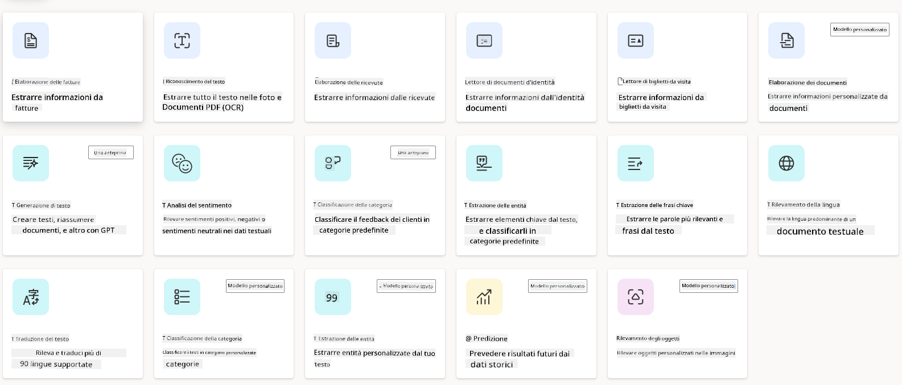
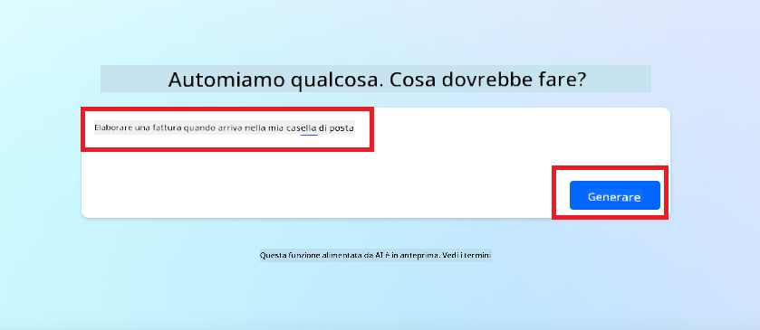
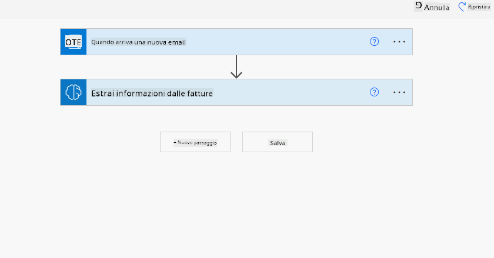
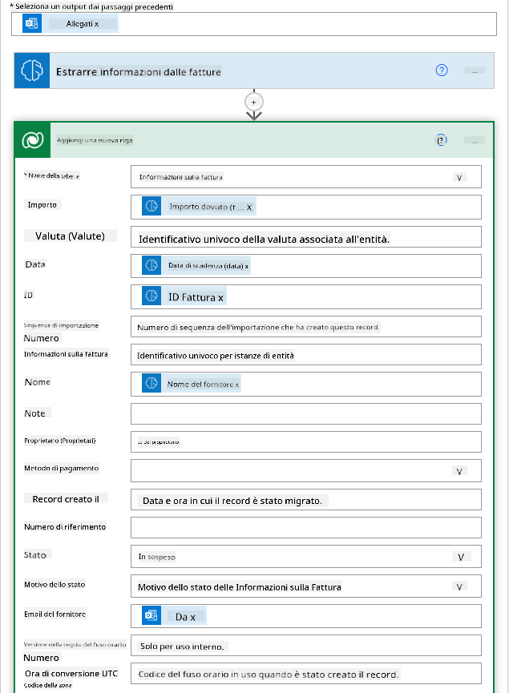
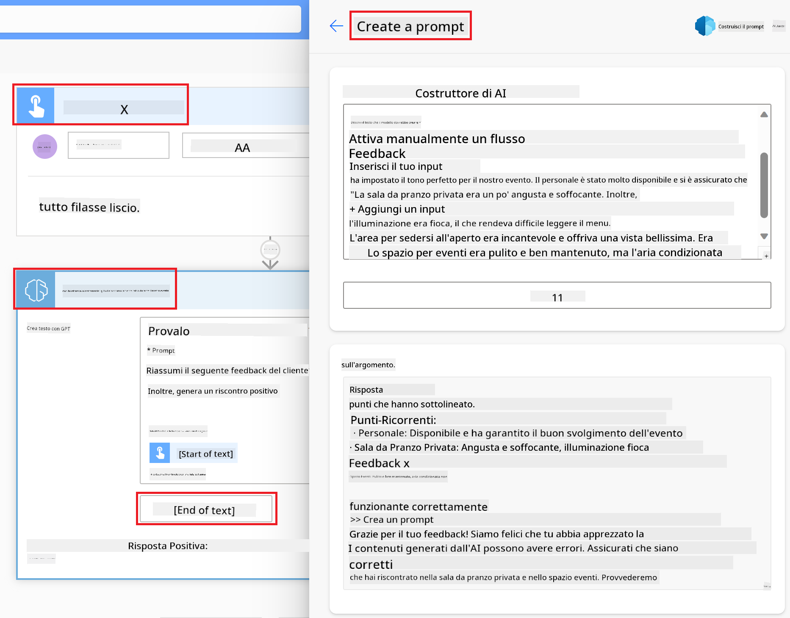

<!--
CO_OP_TRANSLATOR_METADATA:
{
  "original_hash": "f5ff3b6204a695a117d6f452403c95f7",
  "translation_date": "2025-06-25T18:36:21+00:00",
  "source_file": "10-building-low-code-ai-applications/README.md",
  "language_code": "it"
}
-->
# Costruire Applicazioni AI a Basso Codice

## Introduzione

Ora che abbiamo imparato a costruire applicazioni per la generazione di immagini, parliamo di basso codice. L'AI generativa può essere utilizzata in vari ambiti, incluso il basso codice, ma cos'è il basso codice e come possiamo aggiungere l'AI ad esso?

Costruire app e soluzioni è diventato più facile per sviluppatori tradizionali e non, grazie all'uso delle Piattaforme di Sviluppo a Basso Codice. Queste piattaforme permettono di creare app e soluzioni con poco o nessun codice, fornendo un ambiente di sviluppo visivo che consente di trascinare e rilasciare componenti per costruire app e soluzioni. Ciò permette di costruire app e soluzioni più velocemente e con meno risorse. In questa lezione, esploreremo come utilizzare il basso codice e come migliorare lo sviluppo a basso codice con l'AI utilizzando Power Platform.

Power Platform offre alle organizzazioni l'opportunità di dare potere ai propri team per costruire le proprie soluzioni attraverso un ambiente intuitivo a basso codice o senza codice. Questo ambiente aiuta a semplificare il processo di costruzione delle soluzioni. Con Power Platform, le soluzioni possono essere costruite in giorni o settimane invece che in mesi o anni. Power Platform è composto da cinque prodotti chiave: Power Apps, Power Automate, Power BI, Power Pages e Copilot Studio.

Questa lezione copre:

- Introduzione all'AI generativa in Power Platform
- Introduzione a Copilot e come usarlo
- Utilizzare l'AI generativa per costruire app e flussi in Power Platform
- Comprendere i modelli AI in Power Platform con AI Builder

## Obiettivi di Apprendimento

Alla fine di questa lezione, sarai in grado di:

- Comprendere come funziona Copilot in Power Platform.

- Costruire un'app per tracciare le assegnazioni degli studenti per la nostra startup educativa.

- Costruire un flusso di elaborazione delle fatture che utilizza l'AI per estrarre informazioni dalle fatture.

- Applicare le migliori pratiche quando si utilizza il modello AI Create Text con GPT.

Gli strumenti e le tecnologie che utilizzerai in questa lezione sono:

- **Power Apps**, per l'app di tracciamento delle assegnazioni degli studenti, che fornisce un ambiente di sviluppo a basso codice per costruire app per tracciare, gestire e interagire con i dati.

- **Dataverse**, per memorizzare i dati per l'app di tracciamento delle assegnazioni degli studenti, dove Dataverse fornirà una piattaforma dati a basso codice per memorizzare i dati dell'app.

- **Power Automate**, per il flusso di elaborazione delle fatture dove avrai un ambiente di sviluppo a basso codice per costruire flussi di lavoro per automatizzare il processo di elaborazione delle fatture.

- **AI Builder**, per il modello AI di elaborazione delle fatture dove utilizzerai modelli AI predefiniti per elaborare le fatture per la nostra startup.

## AI Generativa in Power Platform

Migliorare lo sviluppo e l'applicazione a basso codice con l'AI generativa è un'area di interesse chiave per Power Platform. L'obiettivo è consentire a tutti di costruire app, siti, dashboard potenziati dall'AI e automatizzare processi con l'AI, _senza richiedere alcuna competenza in data science_. Questo obiettivo è raggiunto integrando l'AI generativa nell'esperienza di sviluppo a basso codice in Power Platform sotto forma di Copilot e AI Builder.

### Come funziona?

Copilot è un assistente AI che ti permette di costruire soluzioni Power Platform descrivendo i tuoi requisiti in una serie di passaggi conversazionali usando il linguaggio naturale. Puoi, ad esempio, istruire il tuo assistente AI a specificare quali campi utilizzerà la tua app e lui creerà sia l'app che il modello di dati sottostante o potresti specificare come impostare un flusso in Power Automate.

Puoi utilizzare le funzionalità guidate da Copilot come una caratteristica nei tuoi schermi app per permettere agli utenti di scoprire intuizioni attraverso interazioni conversazionali.

AI Builder è una capacità AI a basso codice disponibile in Power Platform che ti permette di utilizzare modelli AI per aiutarti ad automatizzare processi e prevedere risultati. Con AI Builder puoi portare l'AI alle tue app e flussi che si connettono ai tuoi dati in Dataverse o in varie fonti di dati cloud, come SharePoint, OneDrive o Azure.

Copilot è disponibile in tutti i prodotti Power Platform: Power Apps, Power Automate, Power BI, Power Pages e Power Virtual Agents. AI Builder è disponibile in Power Apps e Power Automate. In questa lezione, ci concentreremo su come utilizzare Copilot e AI Builder in Power Apps e Power Automate per costruire una soluzione per la nostra startup educativa.

### Copilot in Power Apps

Come parte di Power Platform, Power Apps fornisce un ambiente di sviluppo a basso codice per costruire app per tracciare, gestire e interagire con i dati. È una suite di servizi di sviluppo app con una piattaforma dati scalabile e la capacità di connettersi a servizi cloud e dati locali. Power Apps ti permette di costruire app che funzionano su browser, tablet e telefoni, e possono essere condivise con i colleghi. Power Apps facilita gli utenti nello sviluppo di app con un'interfaccia semplice, in modo che ogni utente aziendale o sviluppatore professionista possa costruire app personalizzate. L'esperienza di sviluppo app è anche migliorata con l'AI generativa tramite Copilot.

La funzione assistente AI copilot in Power Apps ti permette di descrivere che tipo di app hai bisogno e quali informazioni vuoi che la tua app tracci, raccolga o mostri. Copilot genera quindi un'app Canvas reattiva basata sulla tua descrizione. Puoi quindi personalizzare l'app per soddisfare le tue esigenze. L'AI Copilot genera anche e suggerisce una tabella Dataverse con i campi necessari per memorizzare i dati che vuoi tracciare e alcuni dati di esempio. Vedremo cos'è Dataverse e come puoi usarlo in Power Apps in questa lezione più avanti. Puoi quindi personalizzare la tabella per soddisfare le tue esigenze utilizzando la funzione assistente AI Copilot attraverso passaggi conversazionali. Questa funzione è facilmente accessibile dalla schermata principale di Power Apps.

### Copilot in Power Automate

Come parte di Power Platform, Power Automate permette agli utenti di creare flussi di lavoro automatizzati tra applicazioni e servizi. Aiuta ad automatizzare processi aziendali ripetitivi come comunicazione, raccolta dati e approvazioni di decisioni. La sua interfaccia semplice permette agli utenti di ogni competenza tecnica (dai principianti agli sviluppatori esperti) di automatizzare le attività lavorative. L'esperienza di sviluppo del flusso di lavoro è anche migliorata con l'AI generativa tramite Copilot.

La funzione assistente AI copilot in Power Automate ti permette di descrivere che tipo di flusso hai bisogno e quali azioni vuoi che il tuo flusso esegua. Copilot genera quindi un flusso basato sulla tua descrizione. Puoi quindi personalizzare il flusso per soddisfare le tue esigenze. L'AI Copilot genera anche e suggerisce le azioni necessarie per eseguire il compito che vuoi automatizzare. Vedremo cosa sono i flussi e come puoi usarli in Power Automate in questa lezione più avanti. Puoi quindi personalizzare le azioni per soddisfare le tue esigenze utilizzando la funzione assistente AI Copilot attraverso passaggi conversazionali. Questa funzione è facilmente accessibile dalla schermata principale di Power Automate.

## Assegnazione: Gestire le assegnazioni degli studenti e le fatture per la nostra startup, utilizzando Copilot

La nostra startup offre corsi online agli studenti. La startup è cresciuta rapidamente e ora fatica a tenere il passo con la domanda dei suoi corsi. La startup ti ha assunto come sviluppatore Power Platform per aiutarli a costruire una soluzione a basso codice per aiutarli a gestire le assegnazioni degli studenti e le fatture. La loro soluzione dovrebbe essere in grado di aiutarli a tracciare e gestire le assegnazioni degli studenti attraverso un'app e automatizzare il processo di elaborazione delle fatture attraverso un flusso di lavoro. Ti è stato chiesto di utilizzare l'AI generativa per sviluppare la soluzione.

Quando inizi a usare Copilot, puoi utilizzare la [Power Platform Copilot Prompt Library](https://github.com/pnp/powerplatform-prompts?WT.mc_id=academic-109639-somelezediko) per iniziare con i prompt. Questa libreria contiene un elenco di prompt che puoi utilizzare per costruire app e flussi con Copilot. Puoi anche utilizzare i prompt nella libreria per avere un'idea di come descrivere i tuoi requisiti a Copilot.

### Costruire un'App per il Tracciamento delle Assegnazioni degli Studenti per la Nostra Startup

Gli educatori della nostra startup hanno avuto difficoltà a tenere traccia delle assegnazioni degli studenti. Hanno utilizzato un foglio di calcolo per tracciare le assegnazioni, ma questo è diventato difficile da gestire con l'aumentare del numero di studenti. Ti hanno chiesto di costruire un'app che li aiuti a tracciare e gestire le assegnazioni degli studenti. L'app dovrebbe permettere loro di aggiungere nuove assegnazioni, visualizzare le assegnazioni, aggiornare le assegnazioni e cancellare le assegnazioni. L'app dovrebbe anche permettere agli educatori e agli studenti di visualizzare le assegnazioni che sono state valutate e quelle che non lo sono state.

Costruirai l'app utilizzando Copilot in Power Apps seguendo i passaggi seguenti:

1. Naviga alla schermata principale di [Power Apps](https://make.powerapps.com?WT.mc_id=academic-105485-koreyst).

1. Usa l'area di testo sulla schermata principale per descrivere l'app che vuoi costruire. Ad esempio, **_Voglio costruire un'app per tracciare e gestire le assegnazioni degli studenti_**. Clicca sul pulsante **Invia** per inviare il prompt al AI Copilot.

1. L'AI Copilot suggerirà una tabella Dataverse con i campi necessari per memorizzare i dati che vuoi tracciare e alcuni dati di esempio. Puoi quindi personalizzare la tabella per soddisfare le tue esigenze utilizzando la funzione assistente AI Copilot attraverso passaggi conversazionali.

   > **Importante**: Dataverse è la piattaforma dati sottostante per Power Platform. È una piattaforma dati a basso codice per memorizzare i dati dell'app. È un servizio completamente gestito che memorizza in modo sicuro i dati nel Cloud Microsoft ed è fornito all'interno del tuo ambiente Power Platform. Viene fornito con funzionalità di governance dei dati integrate, come classificazione dei dati, tracciamento dei dati, controllo di accesso dettagliato e altro ancora. Puoi saperne di più su Dataverse [qui](https://docs.microsoft.com/powerapps/maker/data-platform/data-platform-intro?WT.mc_id=academic-109639-somelezediko).

1. Gli educatori vogliono inviare email agli studenti che hanno consegnato le loro assegnazioni per tenerli aggiornati sui progressi delle loro assegnazioni. Puoi utilizzare Copilot per aggiungere un nuovo campo alla tabella per memorizzare l'email dello studente. Ad esempio, puoi utilizzare il seguente prompt per aggiungere un nuovo campo alla tabella: **_Voglio aggiungere una colonna per memorizzare l'email dello studente_**. Clicca sul pulsante **Invia** per inviare il prompt al AI Copilot.

1. L'AI Copilot genererà un nuovo campo e potrai quindi personalizzare il campo per soddisfare le tue esigenze.

1. Una volta terminata la tabella, clicca sul pulsante **Crea app** per creare l'app.

1. L'AI Copilot genererà un'app Canvas reattiva basata sulla tua descrizione. Puoi quindi personalizzare l'app per soddisfare le tue esigenze.

1. Per permettere agli educatori di inviare email agli studenti, puoi utilizzare Copilot per aggiungere un nuovo schermo all'app. Ad esempio, puoi utilizzare il seguente prompt per aggiungere un nuovo schermo all'app: **_Voglio aggiungere uno schermo per inviare email agli studenti_**. Clicca sul pulsante **Invia** per inviare il prompt al AI Copilot.

1. L'AI Copilot genererà un nuovo schermo e potrai quindi personalizzare lo schermo per soddisfare le tue esigenze.

1. Una volta terminata l'app, clicca sul pulsante **Salva** per salvare l'app.

1. Per condividere l'app con gli educatori, clicca sul pulsante **Condividi** e poi clicca di nuovo sul pulsante **Condividi**. Puoi quindi condividere l'app con gli educatori inserendo i loro indirizzi email.

> **Compito a casa**: L'app che hai appena costruito è un buon inizio ma può essere migliorata. Con la funzione email, gli educatori possono inviare email agli studenti solo manualmente dovendo digitare le loro email. Puoi utilizzare Copilot per costruire un'automazione che permetta agli educatori di inviare email agli studenti automaticamente quando consegnano le loro assegnazioni? Il tuo suggerimento è che con il giusto prompt puoi utilizzare Copilot in Power Automate per costruire questo.

### Costruire una Tabella di Informazioni sulle Fatture per la Nostra Startup

Il team finanziario della nostra startup ha avuto difficoltà a tenere traccia delle fatture. Hanno utilizzato un foglio di calcolo per tracciare le fatture, ma questo è diventato difficile da gestire con l'aumentare del numero di fatture. Ti hanno chiesto di costruire una tabella che li aiuti a memorizzare, tracciare e gestire le informazioni delle fatture ricevute. La tabella dovrebbe essere utilizzata per costruire un'automazione che estragga tutte le informazioni delle fatture e le memorizzi nella tabella. La tabella dovrebbe anche permettere al team finanziario di visualizzare le fatture che sono state pagate e quelle che non sono state pagate.

Power Platform ha una piattaforma dati sottostante chiamata Dataverse che ti permette di memorizzare i dati per le tue app e soluzioni. Dataverse fornisce una piattaforma dati a basso codice per memorizzare i dati dell'app. È un servizio completamente gestito che memorizza in modo sicuro i dati nel Cloud Microsoft ed è fornito all'interno del tuo ambiente Power Platform. Viene fornito con funzionalità di governance dei dati integrate, come classificazione dei dati, tracciamento dei dati, controllo di accesso dettagliato e altro ancora. Puoi saperne di più [su Dataverse qui](https://docs.microsoft.com/powerapps/maker/data-platform/data-platform-intro?WT.mc_id=academic-109639-somelezediko).

Perché dovremmo usare Dataverse per la nostra startup? Le tabelle standard e personalizzate all'interno di Dataverse forniscono un'opzione di archiviazione sicura e basata su cloud per i tuoi dati. Le tabelle ti permettono di memorizzare diversi tipi di dati, simile a come potresti utilizzare più fogli di lavoro in un singolo quaderno Excel. Puoi utilizzare le tabelle per memorizzare dati specifici per le esigenze della tua organizzazione o azienda. Alcuni dei benefici che la nostra startup otterrà utilizzando Dataverse includono ma non sono limitati a:

- **Facile da gestire**: Sia i metadati che i dati sono memorizzati nel cloud, quindi non devi preoccuparti dei dettagli su come sono memorizzati o gestiti. Puoi concentrarti sulla costruzione delle tue app e soluzioni.

- **Sicuro**: Dataverse fornisce un'opzione di archiviazione sicura e basata su cloud per i tuoi dati. Puoi controllare chi ha accesso ai dati nelle tue tabelle e come possono accedervi utilizzando la sicurezza basata sui ruoli.

- **Metadati ricchi**: Tipi di dati e relazioni sono utilizzati direttamente all'interno di Power Apps

- **Logica e validazione**: Puoi utilizzare regole aziendali, campi calcolati e regole di validazione per applicare la logica aziendale e mantenere l'accuratezza dei dati.

Ora che sai cos'è Dataverse e perché dovresti usarlo, vediamo come puoi utilizzare Copilot per creare una tabella in Dataverse per soddisfare i requisiti del nostro team finanziario.

> **Nota**: Utilizzerai questa tabella nella sezione successiva per costruire un'automazione che estragga tutte le informazioni delle fatture e le memorizzi nella tabella.
Per creare una tabella in Dataverse utilizzando Copilot, segui i passaggi seguenti: 1. Naviga alla schermata principale di [Power Apps](https://make.powerapps.com?WT.mc_id=academic-105485-koreyst). 2. Nella barra di navigazione a sinistra, seleziona **Tabelle** e poi clicca su **Descrivi la nuova tabella**. 1. Nella schermata **Descrivi la nuova tabella**, usa l'area di testo per descrivere la tabella che vuoi creare. Ad esempio, **_Voglio creare una tabella per memorizzare le informazioni delle fatture_**. Clicca sul pulsante **Invia** per inviare il prompt al AI Copilot. 1. L'AI Copilot suggerirà una tabella Dataverse con i campi necessari per memorizzare i dati che vuoi tracciare e alcuni dati di esempio. Puoi quindi personalizzare la tabella per soddisfare le tue esigenze utilizzando la funzione assistente AI Copilot attraverso passaggi conversazionali. 1. Il team finanziario vuole inviare un'email al fornitore per aggiornarlo con lo stato attuale della loro fattura. Puoi utilizzare Copilot per aggiungere un nuovo campo alla tabella per memorizzare l'email del fornitore. Ad esempio, puoi utilizzare il seguente prompt per aggiungere un nuovo campo alla tabella: **_Voglio aggiungere una colonna per memorizzare l'email
un testo. - **Analisi del Sentimento**: Questo modello rileva sentimenti positivi, negativi, neutrali o misti nel testo. - **Lettore di Biglietti da Visita**: Questo modello estrae informazioni dai biglietti da visita. - **Riconoscimento del Testo**: Questo modello estrae testo dalle immagini. - **Rilevamento Oggetti**: Questo modello rileva ed estrae oggetti dalle immagini. - **Elaborazione Documenti**: Questo modello estrae informazioni dai moduli. - **Elaborazione Fatture**: Questo modello estrae informazioni dalle fatture. Con i Modelli AI Personalizzati puoi portare il tuo modello in AI Builder affinché possa funzionare come qualsiasi modello personalizzato di AI Builder, permettendoti di addestrare il modello utilizzando i tuoi dati. Puoi utilizzare questi modelli per automatizzare i processi e prevedere risultati sia in Power Apps che in Power Automate. Quando utilizzi il tuo modello ci sono delle limitazioni che si applicano. Leggi di più su queste [limitazioni](https://learn.microsoft.com/ai-builder/byo-model#limitations?WT.mc_id=academic-105485-koreyst).  ## Compito #2 - Costruire un Flusso di Elaborazione Fatture per la Nostra Startup Il team finanziario ha avuto difficoltà a elaborare le fatture. Hanno utilizzato un foglio di calcolo per tracciare le fatture, ma questo è diventato difficile da gestire con l'aumento del numero di fatture. Ti hanno chiesto di costruire un flusso di lavoro che li aiuti a elaborare le fatture utilizzando l'AI. Il flusso di lavoro dovrebbe consentire loro di estrarre informazioni dalle fatture e memorizzarle in una tabella Dataverse. Il flusso di lavoro dovrebbe anche permettere loro di inviare un'email al team finanziario con le informazioni estratte. Ora che sai cos'è AI Builder e perché dovresti usarlo, vediamo come puoi utilizzare il Modello AI di Elaborazione Fatture in AI Builder, che abbiamo trattato in precedenza, per costruire un flusso di lavoro che aiuterà il team finanziario a elaborare le fatture. Per costruire un flusso di lavoro che aiuti il team finanziario a elaborare le fatture utilizzando il Modello AI di Elaborazione Fatture in AI Builder, segui i passaggi seguenti: 1. Vai alla schermata iniziale di [Power Automate](https://make.powerautomate.com?WT.mc_id=academic-105485-koreyst). 2. Utilizza l'area di testo sulla schermata iniziale per descrivere il flusso di lavoro che vuoi costruire. Ad esempio, **_Elaborare una fattura quando arriva nella mia casella di posta_**. Clicca sul pulsante **Invia** per inviare il prompt al Copilota AI.  3. Il Copilota AI suggerirà le azioni che devi eseguire per automatizzare il compito desiderato. Puoi cliccare sul pulsante **Avanti** per passare ai passaggi successivi. 4. Nel passaggio successivo, Power Automate ti chiederà di configurare le connessioni necessarie per il flusso. Una volta completato, clicca sul pulsante **Crea flusso** per creare il flusso. 5. Il Copilota AI genererà un flusso che puoi poi personalizzare per soddisfare le tue esigenze. 6. Aggiorna il trigger del flusso e imposta la **Cartella** alla cartella dove verranno memorizzate le fatture. Ad esempio, puoi impostare la cartella su **Posta in arrivo**. Clicca su **Mostra opzioni avanzate** e imposta **Solo con Allegati** su **Sì**. Questo garantirà che il flusso si attivi solo quando viene ricevuta un'email con un allegato nella cartella. 7. Rimuovi le seguenti azioni dal flusso: **HTML a testo**, **Componi**, **Componi 2**, **Componi 3** e **Componi 4** perché non le utilizzerai. 8. Rimuovi l'azione **Condizione** dal flusso perché non la utilizzerai. Dovrebbe apparire come nel seguente screenshot:  9. Clicca sul pulsante **Aggiungi un'azione** e cerca **Dataverse**. Seleziona l'azione **Aggiungi una nuova riga**. 10. Nell'azione **Estrai Informazioni dalle fatture**, aggiorna il **File Fattura** per puntare al **Contenuto Allegato** dall'email. Questo garantirà che il flusso estragga informazioni dall'allegato della fattura. 11. Seleziona la **Tabella** che hai creato in precedenza. Ad esempio, puoi selezionare la tabella **Informazioni Fattura**. Scegli il contenuto dinamico dall'azione precedente per popolare i seguenti campi: - ID - Importo - Data - Nome - Stato - Imposta lo **Stato** su **In attesa**. - Email Fornitore - Utilizza il contenuto dinamico **Da** dal trigger **Quando arriva una nuova email**.  12. Una volta completato il flusso, clicca sul pulsante **Salva** per salvare il flusso. Puoi poi testare il flusso inviando un'email con una fattura alla cartella specificata nel trigger. > **Il tuo compito**: Il flusso che hai appena costruito è un buon inizio, ora devi pensare a come puoi costruire un'automazione che permetta al nostro team finanziario di inviare un'email al fornitore per aggiornarlo sullo stato attuale della sua fattura. Il tuo suggerimento: il flusso deve attivarsi quando lo stato della fattura cambia.

## Utilizzare un Modello AI di Generazione Testo in Power Automate

Il Modello AI Crea Testo con GPT in AI Builder ti consente di generare testo basato su un prompt ed è alimentato dal Servizio Microsoft Azure OpenAI. Con questa capacità, puoi incorporare la tecnologia GPT (Generative Pre-Trained Transformer) nelle tue app e flussi per costruire una varietà di flussi automatizzati e applicazioni perspicaci.

I modelli GPT vengono sottoposti a un ampio addestramento su vasti quantitativi di dati, consentendo loro di produrre testo che somiglia molto al linguaggio umano quando fornito con un prompt. Quando integrati con l'automazione dei flussi di lavoro, i modelli AI come GPT possono essere sfruttati per semplificare e automatizzare una vasta gamma di attività.

Ad esempio, puoi costruire flussi per generare automaticamente testo per una varietà di casi d'uso, come: bozze di email, descrizioni di prodotti e altro ancora. Puoi anche utilizzare il modello per generare testo per una varietà di app, come chatbot e app di servizio clienti che consentono agli agenti di servizio clienti di rispondere in modo efficace ed efficiente alle richieste dei clienti.

Per imparare come utilizzare questo Modello AI in Power Automate, consulta il modulo [Aggiungi intelligenza con AI Builder e GPT](https://learn.microsoft.com/training/modules/ai-builder-text-generation/?WT.mc_id=academic-109639-somelezediko).

## Ottimo Lavoro! Continua a Imparare

Dopo aver completato questa lezione, dai un'occhiata alla nostra [collezione di Apprendimento AI Generativa](https://aka.ms/genai-collection?WT.mc_id=academic-105485-koreyst) per continuare a migliorare la tua conoscenza sull'AI Generativa!

Vai alla Lezione 11 dove vedremo come [integrare l'AI Generativa con la Chiamata Funzione](../11-integrating-with-function-calling/README.md?WT.mc_id=academic-105485-koreyst)!

**Disclaimer**:  
Questo documento è stato tradotto utilizzando il servizio di traduzione AI [Co-op Translator](https://github.com/Azure/co-op-translator). Sebbene ci impegniamo per l'accuratezza, si prega di essere consapevoli che le traduzioni automatiche possono contenere errori o imprecisioni. Il documento originale nella sua lingua nativa dovrebbe essere considerato la fonte autorevole. Per informazioni critiche, si raccomanda la traduzione professionale umana. Non siamo responsabili per eventuali incomprensioni o interpretazioni errate derivanti dall'uso di questa traduzione.