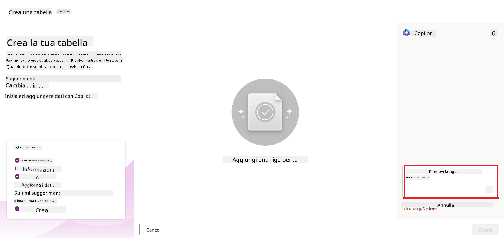
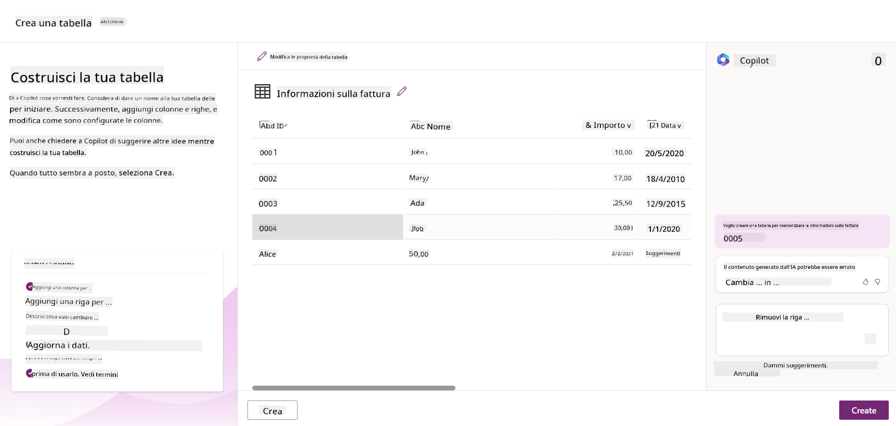
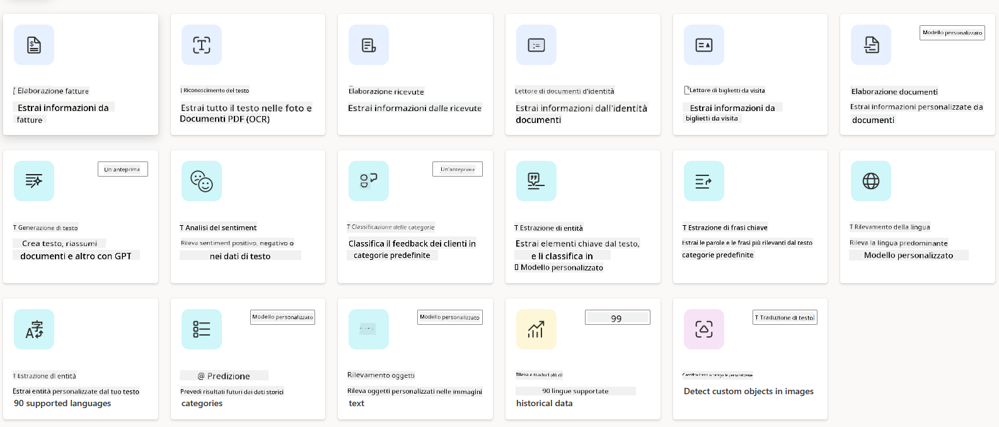
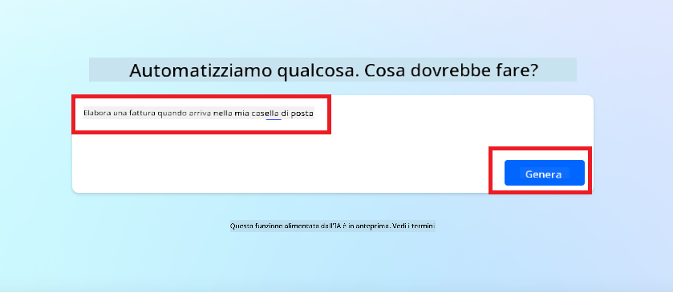
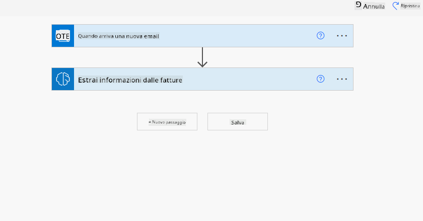
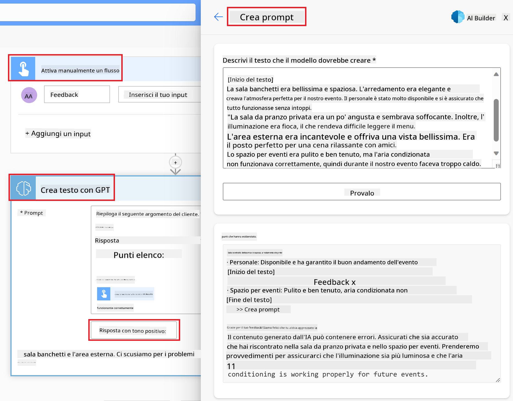

<!--
CO_OP_TRANSLATOR_METADATA:
{
  "original_hash": "f5ff3b6204a695a117d6f452403c95f7",
  "translation_date": "2025-07-09T13:56:50+00:00",
  "source_file": "10-building-low-code-ai-applications/README.md",
  "language_code": "it"
}
-->
# Creare Applicazioni AI Low Code

> _(Clicca sull’immagine sopra per vedere il video di questa lezione)_

## Introduzione

Ora che abbiamo imparato a creare applicazioni per la generazione di immagini, parliamo di low code. L’AI generativa può essere utilizzata in diversi ambiti, incluso il low code, ma cos’è il low code e come possiamo integrare l’AI in esso?

Creare app e soluzioni è diventato più semplice sia per sviluppatori tradizionali che per non sviluppatori grazie all’uso delle Piattaforme di Sviluppo Low Code. Le Piattaforme Low Code permettono di costruire app e soluzioni con poco o nessun codice. Questo è possibile grazie a un ambiente di sviluppo visuale che consente di trascinare e rilasciare componenti per costruire app e soluzioni. Ciò permette di sviluppare più rapidamente e con meno risorse. In questa lezione approfondiremo come usare il Low Code e come potenziare lo sviluppo low code con l’AI usando Power Platform.

Power Platform offre alle organizzazioni l’opportunità di dare ai propri team la possibilità di creare soluzioni in autonomia attraverso un ambiente intuitivo low-code o no-code. Questo ambiente semplifica il processo di creazione delle soluzioni. Con Power Platform, le soluzioni possono essere realizzate in giorni o settimane invece che in mesi o anni. Power Platform è composta da cinque prodotti chiave: Power Apps, Power Automate, Power BI, Power Pages e Copilot Studio.

Questa lezione copre:

- Introduzione all’AI Generativa in Power Platform  
- Introduzione a Copilot e come usarlo  
- Uso dell’AI Generativa per creare app e flussi in Power Platform  
- Comprendere i Modelli AI in Power Platform con AI Builder  

## Obiettivi di Apprendimento

Al termine di questa lezione, sarai in grado di:

- Capire come funziona Copilot in Power Platform.

- Creare un’app per il tracciamento degli incarichi degli studenti per la nostra startup educativa.

- Costruire un flusso di elaborazione fatture che utilizza l’AI per estrarre informazioni dalle fatture.

- Applicare le best practice nell’uso del modello AI Create Text con GPT.

Gli strumenti e le tecnologie che utilizzerai in questa lezione sono:

- **Power Apps**, per l’app Student Assignment Tracker, che offre un ambiente di sviluppo low-code per costruire app per tracciare, gestire e interagire con i dati.

- **Dataverse**, per memorizzare i dati dell’app Student Assignment Tracker, fornendo una piattaforma dati low-code per archiviare i dati dell’app.

- **Power Automate**, per il flusso di elaborazione fatture, che offre un ambiente low-code per costruire workflow per automatizzare il processo di gestione delle fatture.

- **AI Builder**, per il modello AI di elaborazione fatture, dove utilizzerai modelli AI predefiniti per processare le fatture della nostra startup.

## AI Generativa in Power Platform

Potenziare lo sviluppo low-code e le applicazioni con l’AI generativa è un’area chiave per Power Platform. L’obiettivo è permettere a chiunque di creare app, siti, dashboard e automatizzare processi con AI, _senza richiedere competenze di data science_. Questo obiettivo si realizza integrando l’AI generativa nell’esperienza di sviluppo low-code di Power Platform tramite Copilot e AI Builder.

### Come funziona?

Copilot è un assistente AI che ti permette di costruire soluzioni Power Platform descrivendo le tue esigenze attraverso una serie di passaggi conversazionali in linguaggio naturale. Puoi, ad esempio, chiedere al tuo assistente AI quali campi deve usare la tua app e lui creerà sia l’app che il modello dati sottostante, oppure potresti specificare come configurare un flusso in Power Automate.

Puoi usare le funzionalità guidate da Copilot come una feature nelle schermate della tua app per permettere agli utenti di scoprire insight tramite interazioni conversazionali.

AI Builder è una capacità AI low-code disponibile in Power Platform che ti consente di usare modelli AI per automatizzare processi e prevedere risultati. Con AI Builder puoi integrare l’AI nelle tue app e flussi che si connettono ai dati in Dataverse o in varie fonti cloud, come SharePoint, OneDrive o Azure.

Copilot è disponibile in tutti i prodotti Power Platform: Power Apps, Power Automate, Power BI, Power Pages e Power Virtual Agents. AI Builder è disponibile in Power Apps e Power Automate. In questa lezione ci concentreremo su come usare Copilot e AI Builder in Power Apps e Power Automate per costruire una soluzione per la nostra startup educativa.

### Copilot in Power Apps

Come parte di Power Platform, Power Apps offre un ambiente di sviluppo low-code per creare app per tracciare, gestire e interagire con i dati. È una suite di servizi per lo sviluppo di app con una piattaforma dati scalabile e la possibilità di connettersi a servizi cloud e dati on-premises. Power Apps permette di creare app che funzionano su browser, tablet e telefoni, e possono essere condivise con colleghi. Power Apps facilita l’ingresso nello sviluppo di app con un’interfaccia semplice, così che ogni utente business o sviluppatore possa creare app personalizzate. L’esperienza di sviluppo è inoltre potenziata dall’AI generativa tramite Copilot.

La funzione assistente AI Copilot in Power Apps ti permette di descrivere che tipo di app ti serve e quali informazioni vuoi che la tua app tracci, raccolga o mostri. Copilot genera quindi un’app Canvas responsive basata sulla tua descrizione. Puoi poi personalizzare l’app secondo le tue esigenze. L’AI Copilot genera e suggerisce anche una tabella Dataverse con i campi necessari per memorizzare i dati da tracciare e alcuni dati di esempio. In questa lezione vedremo cos’è Dataverse e come usarlo in Power Apps. Puoi poi personalizzare la tabella con l’assistente AI Copilot attraverso passaggi conversazionali. Questa funzione è disponibile direttamente dalla schermata iniziale di Power Apps.

### Copilot in Power Automate

Come parte di Power Platform, Power Automate consente agli utenti di creare flussi di lavoro automatizzati tra applicazioni e servizi. Aiuta ad automatizzare processi aziendali ripetitivi come comunicazioni, raccolta dati e approvazioni. La sua interfaccia semplice permette a utenti di ogni livello tecnico (da principianti a sviluppatori esperti) di automatizzare attività lavorative. L’esperienza di sviluppo dei flussi è potenziata dall’AI generativa tramite Copilot.

La funzione assistente AI Copilot in Power Automate ti permette di descrivere che tipo di flusso ti serve e quali azioni vuoi che il flusso esegua. Copilot genera quindi un flusso basato sulla tua descrizione. Puoi poi personalizzare il flusso secondo le tue esigenze. L’AI Copilot genera e suggerisce anche le azioni necessarie per completare il compito che vuoi automatizzare. In questa lezione vedremo cosa sono i flussi e come usarli in Power Automate. Puoi poi personalizzare le azioni con l’assistente AI Copilot attraverso passaggi conversazionali. Questa funzione è disponibile direttamente dalla schermata iniziale di Power Automate.

## Compito: Gestire incarichi studenti e fatture per la nostra startup, usando Copilot

La nostra startup offre corsi online agli studenti. La startup è cresciuta rapidamente e ora fatica a soddisfare la domanda dei corsi. Ci hanno assunto come sviluppatori Power Platform per aiutarli a costruire una soluzione low code per gestire gli incarichi degli studenti e le fatture. La loro soluzione dovrebbe permettere di tracciare e gestire gli incarichi tramite un’app e automatizzare il processo di elaborazione delle fatture tramite un flusso di lavoro. Ti è stato chiesto di usare l’AI generativa per sviluppare la soluzione.

Quando inizi a usare Copilot, puoi utilizzare la [Power Platform Copilot Prompt Library](https://github.com/pnp/powerplatform-prompts?WT.mc_id=academic-109639-somelezediko) per partire con i prompt. Questa libreria contiene una lista di prompt che puoi usare per costruire app e flussi con Copilot. Puoi anche usarli per farti un’idea di come descrivere le tue esigenze a Copilot.

### Crea un’app per tracciare gli incarichi degli studenti per la nostra startup

Gli educatori della nostra startup hanno difficoltà a tenere traccia degli incarichi degli studenti. Usano un foglio di calcolo, ma è diventato difficile da gestire con l’aumento degli studenti. Ti hanno chiesto di creare un’app che li aiuti a tracciare e gestire gli incarichi. L’app deve permettere di aggiungere nuovi incarichi, visualizzarli, aggiornarli e cancellarli. Deve anche permettere a educatori e studenti di vedere quali incarichi sono stati valutati e quali no.

Costruirai l’app usando Copilot in Power Apps seguendo questi passaggi:

1. Vai alla schermata iniziale di [Power Apps](https://make.powerapps.com?WT.mc_id=academic-105485-koreyst).

1. Usa l’area di testo nella schermata iniziale per descrivere l’app che vuoi costruire. Per esempio, **_Voglio creare un’app per tracciare e gestire gli incarichi degli studenti_**. Clicca sul pulsante **Invia** per mandare il prompt all’AI Copilot.

1. L’AI Copilot suggerirà una tabella Dataverse con i campi necessari per memorizzare i dati da tracciare e alcuni dati di esempio. Puoi poi personalizzare la tabella con l’assistente AI Copilot attraverso passaggi conversazionali.

   > **Importante**: Dataverse è la piattaforma dati sottostante di Power Platform. È una piattaforma dati low-code per archiviare i dati dell’app. È un servizio completamente gestito che memorizza i dati in modo sicuro nel Microsoft Cloud ed è fornito all’interno del tuo ambiente Power Platform. Include funzionalità di governance dati integrate, come classificazione dei dati, tracciabilità, controllo degli accessi granulare e altro. Puoi approfondire Dataverse [qui](https://docs.microsoft.com/powerapps/maker/data-platform/data-platform-intro?WT.mc_id=academic-109639-somelezediko).

   

1. Gli educatori vogliono inviare email agli studenti che hanno consegnato gli incarichi per aggiornarli sullo stato. Puoi usare Copilot per aggiungere un nuovo campo alla tabella per memorizzare l’email dello studente. Per esempio, puoi usare questo prompt per aggiungere un campo: **_Voglio aggiungere una colonna per memorizzare l’email dello studente_**. Clicca su **Invia** per mandare il prompt all’AI Copilot.

1. L’AI Copilot genererà un nuovo campo che potrai personalizzare secondo le tue esigenze.

1. Quando hai finito con la tabella, clicca sul pulsante **Crea app** per creare l’app.

1. L’AI Copilot genererà un’app Canvas responsive basata sulla tua descrizione. Potrai poi personalizzarla secondo le tue necessità.

1. Per permettere agli educatori di inviare email agli studenti, puoi usare Copilot per aggiungere una nuova schermata all’app. Per esempio, usa questo prompt per aggiungere una schermata: **_Voglio aggiungere una schermata per inviare email agli studenti_**. Clicca su **Invia** per mandare il prompt all’AI Copilot.

1. L’AI Copilot genererà una nuova schermata che potrai personalizzare secondo le tue esigenze.

1. Quando hai finito con l’app, clicca su **Salva** per salvarla.

1. Per condividere l’app con gli educatori, clicca su **Condividi** e poi di nuovo su **Condividi**. Potrai quindi condividere l’app inserendo gli indirizzi email degli educatori.

> **Compito a casa**: L’app che hai appena creato è un buon inizio ma può essere migliorata. Con la funzione email, gli educatori possono inviare email agli studenti solo manualmente, digitando gli indirizzi. Riesci a usare Copilot per creare un’automazione che permetta agli educatori di inviare email automaticamente agli studenti quando consegnano gli incarichi? Il suggerimento è che con il prompt giusto puoi usare Copilot in Power Automate per costruire questo.

### Crea una tabella informazioni fatture per la nostra startup

Il team finanziario della nostra startup ha difficoltà a tenere traccia delle fatture. Usano un foglio di calcolo, ma è diventato difficile da gestire con l’aumento delle fatture. Ti hanno chiesto di creare una tabella che li aiuti a memorizzare, tracciare e gestire le informazioni delle fatture ricevute. La tabella sarà usata per costruire un’automazione che estrarrà tutte le informazioni delle fatture e le memorizzerà nella tabella. La tabella deve anche permettere al team finanziario di vedere quali fatture sono state pagate e quali no.

Power Platform ha una piattaforma dati sottostante chiamata Dataverse che ti permette di memorizzare i dati per le tue app e soluzioni. Dataverse fornisce una piattaforma dati low-code per archiviare i dati dell’app. È un servizio completamente gestito che memorizza i dati in modo sicuro nel Microsoft Cloud ed è fornito all’interno del tuo ambiente Power Platform. Include funzionalità di governance dati integrate, come classificazione dei dati, tracciabilità, controllo degli accessi granulare e altro. Puoi approfondire [Dataverse qui](https://docs.microsoft.com/powerapps/maker/data-platform/data-platform-intro?WT.mc_id=academic-109639-somelezediko).

Perché dovremmo usare Dataverse per la nostra startup? Le tabelle standard e personalizzate in Dataverse offrono un’opzione di archiviazione sicura e basata sul cloud per i tuoi dati. Le tabelle ti permettono di memorizzare diversi tipi di dati, simile a come potresti usare più fogli di lavoro in un unico file Excel. Puoi usare le tabelle per archiviare dati specifici per la tua organizzazione o esigenze di business. Alcuni dei vantaggi che la nostra startup otterrà usando Dataverse includono, ma non si limitano a:
- **Facile da gestire**: Sia i metadata che i dati sono archiviati nel cloud, quindi non devi preoccuparti dei dettagli su come vengono memorizzati o gestiti. Puoi concentrarti sulla creazione delle tue app e soluzioni.

- **Sicuro**: Dataverse offre un’opzione di archiviazione sicura e basata sul cloud per i tuoi dati. Puoi controllare chi ha accesso ai dati nelle tue tabelle e come possono accedervi utilizzando la sicurezza basata sui ruoli.

- **Metadata ricchi**: Tipi di dati e relazioni sono utilizzati direttamente all’interno di Power Apps

- **Logica e validazione**: Puoi usare regole aziendali, campi calcolati e regole di validazione per applicare la logica di business e mantenere l’accuratezza dei dati.

Ora che sai cos’è Dataverse e perché dovresti usarlo, vediamo come puoi utilizzare Copilot per creare una tabella in Dataverse che soddisfi le esigenze del nostro team finanziario.

> **Note** : Userai questa tabella nella sezione successiva per creare un’automazione che estrarrà tutte le informazioni delle fatture e le memorizzerà nella tabella.

Per creare una tabella in Dataverse usando Copilot, segui i passaggi seguenti:

1. Vai alla schermata principale di [Power Apps](https://make.powerapps.com?WT.mc_id=academic-105485-koreyst).

2. Nella barra di navigazione a sinistra, seleziona **Tabelle** e poi clicca su **Descrivi la nuova tabella**.

3. Nella schermata **Descrivi la nuova tabella**, usa l’area di testo per descrivere la tabella che vuoi creare. Ad esempio, **_Voglio creare una tabella per memorizzare le informazioni delle fatture_**. Clicca sul pulsante **Invia** per inviare il prompt all’AI Copilot.

4. L’AI Copilot suggerirà una tabella Dataverse con i campi necessari per memorizzare i dati che vuoi tracciare e alcuni dati di esempio. Potrai quindi personalizzare la tabella in base alle tue esigenze utilizzando la funzione assistente AI Copilot attraverso passaggi conversazionali.

5. Il team finanziario vuole inviare un’email al fornitore per aggiornarlo sullo stato attuale della loro fattura. Puoi usare Copilot per aggiungere un nuovo campo alla tabella per memorizzare l’email del fornitore. Ad esempio, puoi usare il seguente prompt per aggiungere un nuovo campo alla tabella: **_Voglio aggiungere una colonna per memorizzare l’email del fornitore_**. Clicca sul pulsante **Invia** per inviare il prompt all’AI Copilot.

6. L’AI Copilot genererà un nuovo campo e potrai quindi personalizzarlo in base alle tue esigenze.

7. Quando hai finito con la tabella, clicca sul pulsante **Crea** per creare la tabella.

## Modelli AI in Power Platform con AI Builder

AI Builder è una funzionalità AI low-code disponibile in Power Platform che ti permette di usare modelli AI per automatizzare processi e prevedere risultati. Con AI Builder puoi integrare l’AI nelle tue app e nei tuoi flussi che si connettono ai dati in Dataverse o in varie fonti dati cloud, come SharePoint, OneDrive o Azure.

## Modelli AI predefiniti vs Modelli AI personalizzati

AI Builder offre due tipi di modelli AI: Modelli AI predefiniti e Modelli AI personalizzati. I Modelli AI predefiniti sono modelli pronti all’uso, addestrati da Microsoft e disponibili in Power Platform. Questi ti aiutano ad aggiungere intelligenza alle tue app e ai tuoi flussi senza dover raccogliere dati, costruire, addestrare e pubblicare i tuoi modelli. Puoi usare questi modelli per automatizzare processi e prevedere risultati.

Alcuni dei Modelli AI predefiniti disponibili in Power Platform includono:

- **Estrazione di frasi chiave**: questo modello estrae frasi chiave dal testo.
- **Rilevamento della lingua**: questo modello rileva la lingua di un testo.
- **Analisi del sentiment**: questo modello rileva sentiment positivo, negativo, neutro o misto nel testo.
- **Lettore di biglietti da visita**: questo modello estrae informazioni dai biglietti da visita.
- **Riconoscimento del testo**: questo modello estrae testo dalle immagini.
- **Rilevamento oggetti**: questo modello rileva ed estrae oggetti dalle immagini.
- **Elaborazione documenti**: questo modello estrae informazioni dai moduli.
- **Elaborazione fatture**: questo modello estrae informazioni dalle fatture.

Con i Modelli AI personalizzati puoi importare il tuo modello in AI Builder affinché funzioni come qualsiasi modello personalizzato AI Builder, permettendoti di addestrare il modello usando i tuoi dati. Puoi usare questi modelli per automatizzare processi e prevedere risultati sia in Power Apps che in Power Automate. Quando usi il tuo modello, si applicano alcune limitazioni. Leggi di più su queste [limitazioni](https://learn.microsoft.com/ai-builder/byo-model#limitations?WT.mc_id=academic-105485-koreyst).

## Compito #2 - Crea un flusso di elaborazione fatture per la nostra startup

Il team finanziario ha avuto difficoltà a gestire le fatture. Hanno usato un foglio di calcolo per tracciare le fatture, ma è diventato difficile da gestire con l’aumento del numero di fatture. Ti hanno chiesto di creare un flusso di lavoro che li aiuti a elaborare le fatture usando l’AI. Il flusso di lavoro dovrebbe permettere di estrarre informazioni dalle fatture e memorizzarle in una tabella Dataverse. Inoltre, dovrebbe consentire di inviare un’email al team finanziario con le informazioni estratte.

Ora che sai cos’è AI Builder e perché dovresti usarlo, vediamo come puoi usare il modello AI di elaborazione fatture in AI Builder, che abbiamo visto prima, per creare un flusso di lavoro che aiuti il team finanziario a elaborare le fatture.

Per creare un flusso di lavoro che aiuti il team finanziario a elaborare le fatture usando il modello AI di elaborazione fatture in AI Builder, segui i passaggi seguenti:

1. Vai alla schermata principale di [Power Automate](https://make.powerautomate.com?WT.mc_id=academic-105485-koreyst).

2. Usa l’area di testo nella schermata principale per descrivere il flusso di lavoro che vuoi creare. Ad esempio, **_Elaborare una fattura quando arriva nella mia casella di posta_**. Clicca sul pulsante **Invia** per inviare il prompt all’AI Copilot.

   

3. L’AI Copilot suggerirà le azioni necessarie per eseguire il compito che vuoi automatizzare. Puoi cliccare sul pulsante **Avanti** per procedere con i passaggi successivi.

4. Nel passaggio successivo, Power Automate ti chiederà di configurare le connessioni necessarie per il flusso. Quando hai finito, clicca sul pulsante **Crea flusso** per creare il flusso.

5. L’AI Copilot genererà un flusso che potrai personalizzare in base alle tue esigenze.

6. Aggiorna il trigger del flusso e imposta la **Cartella** su quella in cui saranno memorizzate le fatture. Ad esempio, puoi impostare la cartella su **Posta in arrivo**. Clicca su **Mostra opzioni avanzate** e imposta **Solo con allegati** su **Sì**. Questo garantirà che il flusso venga eseguito solo quando arriva un’email con allegato nella cartella.

7. Rimuovi le seguenti azioni dal flusso: **HTML a testo**, **Componi**, **Componi 2**, **Componi 3** e **Componi 4** perché non le userai.

8. Rimuovi l’azione **Condizione** dal flusso perché non la userai. Dovrebbe apparire come nello screenshot seguente:

   

9. Clicca sul pulsante **Aggiungi un’azione** e cerca **Dataverse**. Seleziona l’azione **Aggiungi una nuova riga**.

10. Nell’azione **Estrai informazioni dalle fatture**, aggiorna il campo **File fattura** per puntare al **Contenuto allegato** dell’email. Questo garantirà che il flusso estragga le informazioni dall’allegato della fattura.

11. Seleziona la **Tabella** che hai creato in precedenza. Ad esempio, puoi selezionare la tabella **Informazioni fattura**. Scegli il contenuto dinamico dall’azione precedente per popolare i seguenti campi:

    - ID
    - Importo
    - Data
    - Nome
    - Stato - Imposta lo **Stato** su **In sospeso**.
    - Email fornitore - Usa il contenuto dinamico **Da** dal trigger **Quando arriva una nuova email**.

    

12. Quando hai finito con il flusso, clicca sul pulsante **Salva** per salvare il flusso. Puoi quindi testare il flusso inviando un’email con una fattura alla cartella che hai specificato nel trigger.

> **Il tuo compito a casa**: Il flusso che hai appena creato è un buon inizio, ora devi pensare a come costruire un’automazione che permetta al nostro team finanziario di inviare un’email al fornitore per aggiornarlo sullo stato attuale della loro fattura. Un suggerimento: il flusso deve attivarsi quando lo stato della fattura cambia.

## Usa un modello AI di generazione testo in Power Automate

Il modello AI Create Text with GPT in AI Builder ti permette di generare testo basato su un prompt ed è alimentato dal Microsoft Azure OpenAI Service. Con questa funzionalità, puoi integrare la tecnologia GPT (Generative Pre-Trained Transformer) nelle tue app e flussi per creare una varietà di flussi automatizzati e applicazioni intelligenti.

I modelli GPT sono addestrati su grandi quantità di dati, permettendo loro di produrre testo che somiglia molto al linguaggio umano quando ricevono un prompt. Integrati con l’automazione dei flussi di lavoro, modelli AI come GPT possono essere utilizzati per semplificare e automatizzare una vasta gamma di attività.

Ad esempio, puoi creare flussi per generare automaticamente testo per vari casi d’uso, come bozze di email, descrizioni di prodotti e altro. Puoi anche usare il modello per generare testo per diverse app, come chatbot e app di assistenza clienti che aiutano gli operatori a rispondere in modo efficace ed efficiente alle richieste dei clienti.

Per imparare come usare questo modello AI in Power Automate, segui il modulo [Aggiungi intelligenza con AI Builder e GPT](https://learn.microsoft.com/training/modules/ai-builder-text-generation/?WT.mc_id=academic-109639-somelezediko).

## Ottimo lavoro! Continua a imparare

Dopo aver completato questa lezione, dai un’occhiata alla nostra [collezione di apprendimento su Generative AI](https://aka.ms/genai-collection?WT.mc_id=academic-105485-koreyst) per continuare a migliorare le tue conoscenze su Generative AI!

Passa alla Lezione 11 dove vedremo come [integrare Generative AI con Function Calling](../11-integrating-with-function-calling/README.md?WT.mc_id=academic-105485-koreyst)!

**Disclaimer**:  
Questo documento è stato tradotto utilizzando il servizio di traduzione automatica [Co-op Translator](https://github.com/Azure/co-op-translator). Pur impegnandoci per garantire accuratezza, si prega di notare che le traduzioni automatiche possono contenere errori o imprecisioni. Il documento originale nella sua lingua nativa deve essere considerato la fonte autorevole. Per informazioni critiche, si raccomanda una traduzione professionale effettuata da un umano. Non siamo responsabili per eventuali malintesi o interpretazioni errate derivanti dall’uso di questa traduzione.