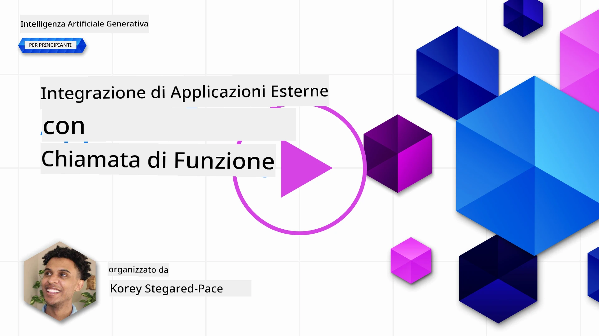
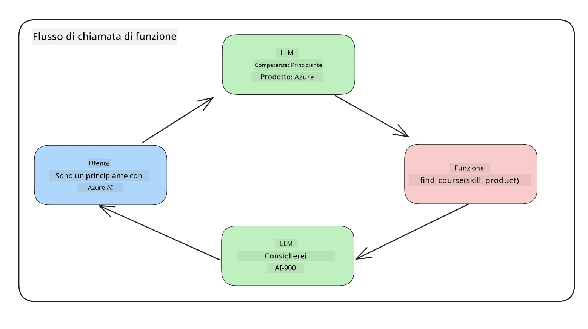
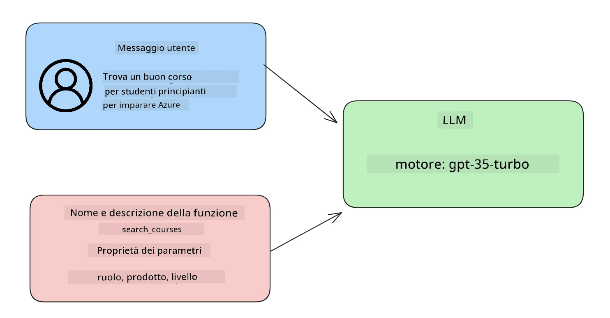

# Integrazione con la chiamata di funzioni

[](https://youtu.be/DgUdCLX8qYQ?si=f1ouQU5HQx6F8Gl2)

Finora hai imparato abbastanza dalle lezioni precedenti. Tuttavia, possiamo migliorare ulteriormente. Alcune cose che possiamo affrontare sono come ottenere un formato di risposta più coerente per facilitare il lavoro con la risposta in fasi successive. Inoltre, potremmo voler aggiungere dati da altre fonti per arricchire ulteriormente la nostra applicazione.

I problemi sopra menzionati sono quelli che questo capitolo si propone di affrontare.

## Introduzione

Questa lezione coprirà:

- Spiegare cos'è la chiamata di funzioni e i suoi casi d'uso.
- Creare una chiamata di funzione utilizzando Azure OpenAI.
- Come integrare una chiamata di funzione in un'applicazione.

## Obiettivi di apprendimento

Al termine di questa lezione, sarai in grado di:

- Spiegare lo scopo dell'uso della chiamata di funzioni.
- Configurare la chiamata di funzione utilizzando il servizio Azure OpenAI.
- Progettare chiamate di funzioni efficaci per il caso d'uso della tua applicazione.

## Scenario: Migliorare il nostro chatbot con le funzioni

Per questa lezione, vogliamo creare una funzionalità per la nostra startup educativa che consenta agli utenti di utilizzare un chatbot per trovare corsi tecnici. Consiglieremo corsi adatti al loro livello di competenza, ruolo attuale e tecnologia di interesse.

Per completare questo scenario, useremo una combinazione di:

- `Azure OpenAI` per creare un'esperienza di chat per l'utente.
- `Microsoft Learn Catalog API` per aiutare gli utenti a trovare corsi in base alla richiesta dell'utente.
- `Function Calling` per prendere la query dell'utente e inviarla a una funzione che esegue la richiesta API.

Per iniziare, vediamo perché vorremmo usare la chiamata di funzioni in primo luogo:

## Perché la chiamata di funzioni

Prima della chiamata di funzioni, le risposte da un LLM erano non strutturate e incoerenti. Gli sviluppatori dovevano scrivere codice di validazione complesso per assicurarsi di poter gestire ogni variazione di una risposta. Gli utenti non potevano ottenere risposte come "Qual è il meteo attuale a Stoccolma?". Questo perché i modelli erano limitati ai dati disponibili al momento dell'addestramento.

La chiamata di funzioni è una funzionalità del servizio Azure OpenAI per superare le seguenti limitazioni:

- **Formato di risposta coerente**. Se possiamo controllare meglio il formato della risposta, possiamo integrare più facilmente la risposta in altri sistemi a valle.
- **Dati esterni**. Capacità di usare dati da altre fonti di un'applicazione in un contesto di chat.

## Illustrazione del problema attraverso uno scenario

> Ti consigliamo di usare il [notebook incluso](./python/aoai-assignment.ipynb?WT.mc_id=academic-105485-koreyst) se vuoi eseguire lo scenario qui sotto. Puoi anche limitarti a leggere mentre cerchiamo di illustrare un problema che le funzioni possono aiutare a risolvere.

Vediamo un esempio che illustra il problema del formato di risposta:

Diciamo che vogliamo creare un database di dati degli studenti in modo da poter suggerire loro il corso giusto. Qui sotto abbiamo due descrizioni di studenti che sono molto simili nei dati che contengono.

1. Crea una connessione alla nostra risorsa Azure OpenAI:

   ```python
   import os
   import json
   from openai import OpenAI
   from dotenv import load_dotenv
   load_dotenv()

   # L'API delle Risposte è fornita dal endpoint Azure OpenAI (Microsoft Foundry) v1
   # , quindi puntiamo il client OpenAI a <your-endpoint>/openai/v1/.
   endpoint = os.environ['AZURE_OPENAI_ENDPOINT']
   client = OpenAI(
   api_key=os.environ['AZURE_OPENAI_API_KEY'],
   base_url=f"{endpoint.rstrip('/')}/openai/v1/",
   )

   deployment=os.environ['AZURE_OPENAI_DEPLOYMENT']
   ```

   Qui sotto c'è del codice Python per configurare la nostra connessione ad Azure OpenAI. Poiché utilizziamo il endpoint v1, dobbiamo solo impostare `api_key` e `base_url` (non è necessaria la `api_version`).

1. Creare due descrizioni di studenti usando le variabili `student_1_description` e `student_2_description`.

   ```python
   student_1_description="Emily Johnson is a sophomore majoring in computer science at Duke University. She has a 3.7 GPA. Emily is an active member of the university's Chess Club and Debate Team. She hopes to pursue a career in software engineering after graduating."

   student_2_description = "Michael Lee is a sophomore majoring in computer science at Stanford University. He has a 3.8 GPA. Michael is known for his programming skills and is an active member of the university's Robotics Club. He hopes to pursue a career in artificial intelligence after finishing his studies."
   ```

   Vogliamo inviare le descrizioni degli studenti sopra a un LLM per analizzare i dati. Questi dati potranno poi essere usati nella nostra applicazione e inviati a un'API o memorizzati in un database.

1. Creiamo due prompt identici in cui istruiamo l'LLM su quali informazioni ci interessano:

   ```python
   prompt1 = f'''
   Please extract the following information from the given text and return it as a JSON object:

   name
   major
   school
   grades
   club

   This is the body of text to extract the information from:
   {student_1_description}
   '''

   prompt2 = f'''
   Please extract the following information from the given text and return it as a JSON object:

   name
   major
   school
   grades
   club

   This is the body of text to extract the information from:
   {student_2_description}
   '''
   ```

   I prompt sopra istruiscono l'LLM ad estrarre informazioni e restituire la risposta in formato JSON.

1. Dopo aver impostato i prompt e la connessione ad Azure OpenAI, ora invieremo i prompt all'LLM usando `client.responses.create`. Memorizziamo il prompt nella variabile `input` e assegniamo il ruolo di `user`. Questo è per simulare un messaggio da un utente scritto a un chatbot.

   ```python
   # risposta al prompt uno
   openai_response1 = client.responses.create(
   model=deployment,
   input = [{'role': 'user', 'content': prompt1}],
   store=False,
   )
   openai_response1.output_text

   # risposta al prompt due
   openai_response2 = client.responses.create(
   model=deployment,
   input = [{'role': 'user', 'content': prompt2}],
   store=False,
   )
   openai_response2.output_text
   ```

Ora possiamo inviare entrambe le richieste all'LLM ed esaminare la risposta che riceviamo trovandola come `openai_response1.output_text`.

1. Infine, possiamo convertire la risposta in formato JSON chiamando `json.loads`:

   ```python
   # Caricamento della risposta come oggetto JSON
   json_response1 = json.loads(openai_response1.output_text)
   json_response1
   ```

   Risposta 1:

   ```json
   {
     "name": "Emily Johnson",
     "major": "computer science",
     "school": "Duke University",
     "grades": "3.7",
     "club": "Chess Club"
   }
   ```

   Risposta 2:

   ```json
   {
     "name": "Michael Lee",
     "major": "computer science",
     "school": "Stanford University",
     "grades": "3.8 GPA",
     "club": "Robotics Club"
   }
   ```

   Anche se i prompt sono gli stessi e le descrizioni sono simili, vediamo i valori della proprietà `Grades` formattati in modo diverso, poiché a volte otteniamo il formato `3.7` o `3.7 GPA`, per esempio.

   Questo risultato è dovuto al fatto che l'LLM prende dati non strutturati dalla forma del prompt scritto e restituisce anche dati non strutturati. Abbiamo bisogno di un formato strutturato in modo da sapere cosa aspettarci quando memorizziamo o usiamo questi dati.

Quindi come risolviamo il problema della formattazione? Usando la chiamata di funzioni, possiamo assicurarci di ricevere dati strutturati in risposta. Quando si usa la chiamata di funzioni, l'LLM non chiama o esegue realmente alcuna funzione. Invece, creiamo una struttura che l'LLM deve seguire per le sue risposte. Quindi usiamo queste risposte strutturate per sapere quale funzione eseguire nelle nostre applicazioni.



Possiamo quindi prendere ciò che viene restituito dalla funzione e inviarlo nuovamente all'LLM. L'LLM risponderà utilizzando linguaggio naturale per rispondere alla query dell'utente.

## Casi d'uso per l'uso delle chiamate di funzione

Ci sono molti casi d'uso in cui le chiamate di funzione possono migliorare la tua app, come:

- **Chiamare strumenti esterni**. I chatbot sono ottimi nel fornire risposte alle domande degli utenti. Usando la chiamata di funzioni, i chatbot possono usare i messaggi degli utenti per completare certi compiti. Per esempio, uno studente può chiedere al chatbot "Invia un'email al mio istruttore dicendo che ho bisogno di più assistenza con questa materia". Questo può fare una chiamata di funzione a `send_email(to: string, body: string)`

- **Creare query API o di database**. Gli utenti possono trovare informazioni usando linguaggio naturale che viene convertito in una query o richiesta API formattata. Un esempio potrebbe essere un insegnante che chiede "Chi sono gli studenti che hanno completato l'ultimo compito" e chiama una funzione chiamata `get_completed(student_name: string, assignment: int, current_status: string)`

- **Creare dati strutturati**. Gli utenti possono prendere un blocco di testo o CSV e usare l'LLM per estrarre informazioni importanti. Per esempio, uno studente può convertire un articolo di Wikipedia sugli accordi di pace per creare flashcard AI. Questo può essere fatto usando una funzione chiamata `get_important_facts(agreement_name: string, date_signed: string, parties_involved: list)`

## Creare la tua prima chiamata di funzione

Il processo per creare una chiamata di funzione include 3 passaggi principali:

1. **Chiamare** l'API Responses con una lista delle tue funzioni (strumenti) e un messaggio dell'utente.
2. **Leggere** la risposta del modello per eseguire un'azione cioè eseguire una funzione o una chiamata API.
3. **Fare** un'altra chiamata all'API Responses con la risposta della tua funzione per usare quella informazione per creare una risposta all'utente.



### Passo 1 - creare i messaggi

Il primo passo è creare un messaggio utente. Questo può essere assegnato dinamicamente prendendo il valore di un input testuale o puoi assegnare un valore qui. Se è la prima volta che lavori con l'API Responses, dobbiamo definire il `role` e il `content` del messaggio.

Il `role` può essere `system` (creare regole), `assistant` (il modello) o `user` (l'utente finale). Per la chiamata di funzioni, assegneremo questo come `user` e una domanda di esempio.

```python
messages= [ {"role": "user", "content": "Find me a good course for a beginner student to learn Azure."} ]
```

Assegnando ruoli diversi, si chiarisce all'LLM se è il sistema a dire qualcosa o l'utente, il che aiuta a costruire una storia della conversazione su cui l'LLM può basarsi.

### Passo 2 - creare le funzioni

Successivamente, definiamo una funzione e i parametri di quella funzione. Useremo una sola funzione qui chiamata `search_courses` ma puoi creare più funzioni.

> **Importante** : Le funzioni sono incluse nel messaggio di sistema per l'LLM e saranno incluse nella quantità di token disponibili.

Qui sotto, creiamo le funzioni come un array di elementi. Ogni elemento è uno strumento nel formato piatto dell'API Responses, con proprietà `type`, `name`, `description` e `parameters`:

```python
functions = [
   {
      "type":"function",
      "name":"search_courses",
      "description":"Retrieves courses from the search index based on the parameters provided",
      "parameters":{
         "type":"object",
         "properties":{
            "role":{
               "type":"string",
               "description":"The role of the learner (i.e. developer, data scientist, student, etc.)"
            },
            "product":{
               "type":"string",
               "description":"The product that the lesson is covering (i.e. Azure, Power BI, etc.)"
            },
            "level":{
               "type":"string",
               "description":"The level of experience the learner has prior to taking the course (i.e. beginner, intermediate, advanced)"
            }
         },
         "required":[
            "role"
         ]
      }
   }
]
```

Descriviamo ogni istanza di funzione più in dettaglio sotto:

- `name` - Il nome della funzione che vogliamo chiamare.
- `description` - Questa è la descrizione di come funziona la funzione. Qui è importante essere specifici e chiari.
- `parameters` - Una lista di valori e formato che vuoi che il modello produca nella sua risposta. L'array parameters consiste in elementi con le seguenti proprietà:
  1.  `type` - Il tipo di dato in cui verranno memorizzate le proprietà.
  1.  `properties` - Lista dei valori specifici che il modello userà per la sua risposta
      1. `name` - La chiave è il nome della proprietà che il modello userà nella sua risposta formattata, per esempio, `product`.
      1. `type` - Il tipo di dato di questa proprietà, per esempio, `string`.
      1. `description` - Descrizione della proprietà specifica.

C'è anche una proprietà opzionale `required` - proprietà obbligatoria perché la chiamata della funzione venga completata.

### Passo 3 - Effettuare la chiamata di funzione

Dopo aver definito una funzione, ora dobbiamo includerla nella chiamata all'API Responses. Lo facciamo aggiungendo `tools` alla richiesta. In questo caso `tools=functions`.

C'è anche un'opzione per impostare `tool_choice` su `auto`. Questo significa che lasceremo decidere all'LLM quale funzione chiamare in base al messaggio dell'utente invece di assegnarlo noi.

Ecco un codice qui sotto in cui chiamiamo `client.responses.create`, nota come impostiamo `tools=functions` e `tool_choice="auto"` dando così all'LLM la scelta di quando chiamare le funzioni che gli forniamo:

```python
response = client.responses.create(model=deployment,
                                        input=messages,
                                        tools=functions,
                                        tool_choice="auto",
                                        store=False)

print(response.output)
```

La risposta che ritorna ora include un elemento `function_call` in `response.output` che appare così:

```json
{
  "type": "function_call",
  "name": "search_courses",
  "call_id": "call_abc123",
  "arguments": "{\n  \"role\": \"student\",\n  \"product\": \"Azure\",\n  \"level\": \"beginner\"\n}"
}
```

Qui vediamo come la funzione `search_courses` è stata chiamata e con quali argomenti, elencati nella proprietà `arguments` nella risposta JSON.

La conclusione è che l'LLM è riuscito a trovare i dati per adattarsi agli argomenti della funzione mentre li estraeva dal valore fornito al parametro `input` nella chiamata all'API Responses. Qui sotto c'è un promemoria del valore `messages`:

```python
messages= [ {"role": "user", "content": "Find me a good course for a beginner student to learn Azure."} ]
```

Come puoi vedere, `student`, `Azure` e `beginner` sono stati estratti da `messages` e impostati come input per la funzione. Usare le funzioni in questo modo è un ottimo modo per estrarre informazioni da un prompt, ma anche per fornire struttura all'LLM e avere funzionalità riutilizzabile.

Ora vediamo come possiamo usare questo nella nostra app.

## Integrare le chiamate di funzione in un'applicazione

Dopo aver testato la risposta formattata dall'LLM, ora possiamo integrarla in un'applicazione.

### Gestire il flusso

Per integrare questo nella nostra applicazione, seguiamo i seguenti passaggi:

1. Per prima cosa, facciamo la chiamata ai servizi OpenAI ed estraiamo gli elementi di chiamata di funzione dalla risposta `output`.

   ```python
   response_items = response.output
   tool_calls = [item for item in response_items if item.type == "function_call"]
   ```

1. Ora definiamo la funzione che chiamerà l'API Microsoft Learn per ottenere una lista di corsi:

   ```python
   import requests

   def search_courses(role, product, level):
     url = "https://learn.microsoft.com/api/catalog/"
     params = {
        "role": role,
        "product": product,
        "level": level
     }
     response = requests.get(url, params=params)
     modules = response.json()["modules"]
     results = []
     for module in modules[:5]:
        title = module["title"]
        url = module["url"]
        results.append({"title": title, "url": url})
     return str(results)
   ```

   Nota come ora creiamo una vera funzione Python che corrisponde ai nomi delle funzioni introdotte nella variabile `functions`. Stiamo anche facendo vere chiamate API esterne per recuperare i dati di cui abbiamo bisogno. In questo caso, chiamiamo l'API Microsoft Learn per cercare moduli di formazione.

Ok, abbiamo creato la variabile `functions` e una funzione Python corrispondente, come facciamo a dire all'LLM come mappare questi due insieme perché la nostra funzione Python venga chiamata?

1. Per vedere se dobbiamo chiamare una funzione Python, dobbiamo guardare nella risposta dell'LLM e vedere se un elemento `function_call` fa parte di essa e chiamare la funzione indicata. Ecco come puoi fare il controllo menzionato qui sotto:

   ```python
   # Verifica se il modello vuole chiamare una funzione
   if tool_calls:
    for tool_call in tool_calls:
     print("Recommended Function call:")
     print(tool_call.name)
     print()

     # Chiama la funzione.
     function_name = tool_call.name

     available_functions = {
             "search_courses": search_courses,
     }
     function_to_call = available_functions[function_name]

     function_args = json.loads(tool_call.arguments)
     function_response = function_to_call(**function_args)

     print("Output of function call:")
     print(function_response)
     print(type(function_response))

     # Aggiungi la chiamata della funzione e il suo risultato alla conversazione.
     # L'elemento function_call del modello deve essere aggiunto prima del suo output.
     messages.append(tool_call)  # l'elemento function_call dell'assistente
     messages.append( # il risultato della funzione
         {
             "type": "function_call_output",
             "call_id": tool_call.call_id,
             "output": function_response,
         }
     )
   ```

   Queste tre righe assicurano che estraiamo il nome della funzione, gli argomenti e facciamo la chiamata:

   ```python
   function_to_call = available_functions[function_name]

   function_args = json.loads(tool_call.arguments)
   function_response = function_to_call(**function_args)
   ```

   Qui sotto c'è l'output dall'esecuzione del nostro codice:

   **Output**

   ```Recommended Function call:
   {
     "name": "search_courses",
     "arguments": "{\n  \"role\": \"student\",\n  \"product\": \"Azure\",\n  \"level\": \"beginner\"\n}"
   }

   Output of function call:
   [{'title': 'Describe concepts of cryptography', 'url': 'https://learn.microsoft.com/training/modules/describe-concepts-of-cryptography/?
   WT.mc_id=api_CatalogApi'}, {'title': 'Introduction to audio classification with TensorFlow', 'url': 'https://learn.microsoft.com/en-
   us/training/modules/intro-audio-classification-tensorflow/?WT.mc_id=api_CatalogApi'}, {'title': 'Design a Performant Data Model in Azure SQL
   Database with Azure Data Studio', 'url': 'https://learn.microsoft.com/training/modules/design-a-data-model-with-ads/?
   WT.mc_id=api_CatalogApi'}, {'title': 'Getting started with the Microsoft Cloud Adoption Framework for Azure', 'url':
   'https://learn.microsoft.com/training/modules/cloud-adoption-framework-getting-started/?WT.mc_id=api_CatalogApi'}, {'title': 'Set up the
   Rust development environment', 'url': 'https://learn.microsoft.com/training/modules/rust-set-up-environment/?WT.mc_id=api_CatalogApi'}]
   <class 'str'>
   ```

1. Ora invieremo il messaggio aggiornato, `messages`, all'LLM in modo da poter ricevere una risposta in linguaggio naturale invece di una risposta JSON formattata dall'API.

   ```python
   print("Messages in next request:")
   print(messages)
   print()

   second_response = client.responses.create(
      input=messages,
      model=deployment,
      tool_choice="auto",
      tools=functions,
      temperature=0,
      store=False,
         )  # ottenere una nuova risposta dal modello dove può vedere la risposta della funzione


   print(second_response.output_text)
   ```

   **Output**

   ```text
   I found some good courses for beginner students to learn Azure:

   1. [Describe concepts of cryptography](https://learn.microsoft.com/training/modules/describe-concepts-of-cryptography/?WT.mc_id=api_CatalogApi)
   2. [Introduction to audio classification with TensorFlow](https://learn.microsoft.com/training/modules/intro-audio-classification-tensorflow/?WT.mc_id=api_CatalogApi)
   3. [Design a Performant Data Model in Azure SQL Database with Azure Data Studio](https://learn.microsoft.com/training/modules/design-a-data-model-with-ads/?WT.mc_id=api_CatalogApi)
   4. [Getting started with the Microsoft Cloud Adoption Framework for Azure](https://learn.microsoft.com/training/modules/cloud-adoption-framework-getting-started/?WT.mc_id=api_CatalogApi)
   5. [Set up the Rust development environment](https://learn.microsoft.com/training/modules/rust-set-up-environment/?WT.mc_id=api_CatalogApi)

   You can click on the links to access the courses.
   ```

## Compito

Per continuare a imparare sulla chiamata di funzione di Azure OpenAI puoi creare:

- Più parametri della funzione che potrebbero aiutare gli studenti a trovare più corsi.

- Crea un'altra chiamata di funzione che prenda più informazioni dall'apprendente come la sua lingua nativa
- Crea una gestione degli errori quando la chiamata di funzione e/o la chiamata API non restituisce corsi adatti

Suggerimento: Segui la pagina [Documentazione di riferimento API Learn](https://learn.microsoft.com/training/support/catalog-api-developer-reference?WT.mc_id=academic-105485-koreyst) per vedere come e dove questi dati sono disponibili.

## Ottimo lavoro! Continua il viaggio

Dopo aver completato questa lezione, dai un'occhiata alla nostra [collezione di apprendimento sull'Intelligenza Artificiale Generativa](https://aka.ms/genai-collection?WT.mc_id=academic-105485-koreyst) per continuare a migliorare le tue conoscenze sull'IA Generativa!

Passa alla Lezione 12, dove esamineremo come [progettare UX per applicazioni AI](../12-designing-ux-for-ai-applications/README.md?WT.mc_id=academic-105485-koreyst)!

---

<!-- CO-OP TRANSLATOR DISCLAIMER START -->
**Disclaimer**:
Questo documento è stato tradotto utilizzando il servizio di traduzione AI [Co-op Translator](https://github.com/Azure/co-op-translator). Sebbene ci impegniamo per garantire la precisione, si prega di notare che le traduzioni automatizzate possono contenere errori o imprecisioni. Il documento originale nella sua lingua nativa deve essere considerato la fonte autorevole. Per informazioni critiche, si raccomanda una traduzione professionale effettuata da un essere umano. Non siamo responsabili per eventuali malintesi o interpretazioni errate derivanti dall’uso di questa traduzione.
<!-- CO-OP TRANSLATOR DISCLAIMER END -->