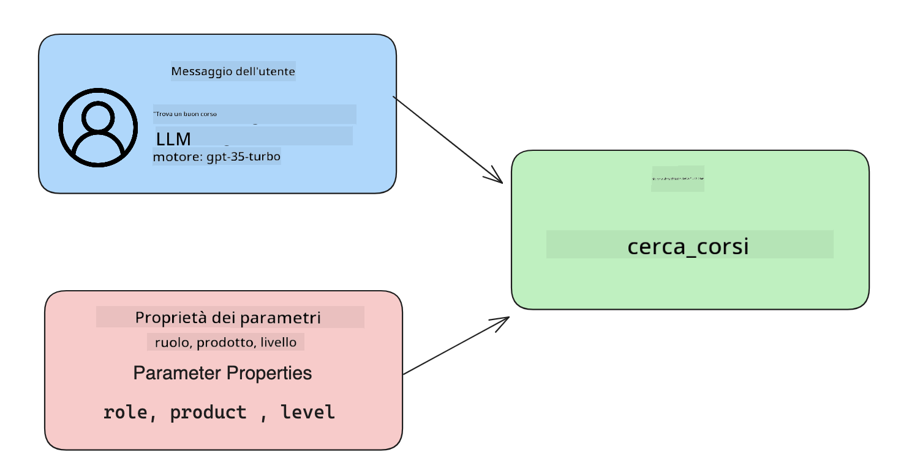

<!--
CO_OP_TRANSLATOR_METADATA:
{
  "original_hash": "f6f84f9ef2d066cd25850cab93580a50",
  "translation_date": "2025-10-17T16:06:55+00:00",
  "source_file": "11-integrating-with-function-calling/README.md",
  "language_code": "it"
}
-->
# Integrazione con la chiamata di funzioni

[](https://youtu.be/DgUdCLX8qYQ?si=f1ouQU5HQx6F8Gl2)

Hai già imparato parecchio nelle lezioni precedenti. Tuttavia, possiamo migliorare ulteriormente. Alcuni aspetti che possiamo affrontare includono ottenere un formato di risposta più coerente per facilitare il lavoro con la risposta a valle. Inoltre, potremmo voler aggiungere dati da altre fonti per arricchire ulteriormente la nostra applicazione.

I problemi sopra menzionati sono ciò che questo capitolo si propone di affrontare.

## Introduzione

Questa lezione coprirà:

- Spiegare cosa sia la chiamata di funzioni e i suoi casi d'uso.
- Creare una chiamata di funzione utilizzando Azure OpenAI.
- Come integrare una chiamata di funzione in un'applicazione.

## Obiettivi di apprendimento

Alla fine di questa lezione, sarai in grado di:

- Spiegare lo scopo dell'utilizzo della chiamata di funzioni.
- Configurare la chiamata di funzioni utilizzando il servizio Azure OpenAI.
- Progettare chiamate di funzioni efficaci per il caso d'uso della tua applicazione.

## Scenario: Migliorare il nostro chatbot con le funzioni

Per questa lezione, vogliamo costruire una funzionalità per la nostra startup educativa che consenta agli utenti di utilizzare un chatbot per trovare corsi tecnici. Consiglieremo corsi che si adattano al loro livello di competenza, ruolo attuale e tecnologia di interesse.

Per completare questo scenario, utilizzeremo una combinazione di:

- `Azure OpenAI` per creare un'esperienza di chat per l'utente.
- `Microsoft Learn Catalog API` per aiutare gli utenti a trovare corsi in base alla loro richiesta.
- `Chiamata di funzioni` per prendere la query dell'utente e inviarla a una funzione per effettuare la richiesta API.

Per iniziare, vediamo perché vorremmo utilizzare la chiamata di funzioni in primo luogo:

## Perché la chiamata di funzioni

Prima della chiamata di funzioni, le risposte da un LLM erano non strutturate e incoerenti. Gli sviluppatori erano costretti a scrivere codice di validazione complesso per gestire ogni variazione di risposta. Gli utenti non potevano ottenere risposte come "Qual è il meteo attuale a Stoccolma?". Questo perché i modelli erano limitati al periodo in cui i dati erano stati addestrati.

La chiamata di funzioni è una funzionalità del servizio Azure OpenAI per superare le seguenti limitazioni:

- **Formato di risposta coerente**. Se possiamo controllare meglio il formato della risposta, possiamo integrare più facilmente la risposta a valle in altri sistemi.
- **Dati esterni**. Possibilità di utilizzare dati da altre fonti di un'applicazione in un contesto di chat.

## Illustrare il problema attraverso uno scenario

> Ti consigliamo di utilizzare il [notebook incluso](./python/aoai-assignment.ipynb?WT.mc_id=academic-105485-koreyst) se desideri eseguire lo scenario seguente. Puoi anche semplicemente leggere, poiché stiamo cercando di illustrare un problema in cui le funzioni possono aiutare a risolverlo.

Esaminiamo un esempio che illustra il problema del formato di risposta:

Supponiamo di voler creare un database di dati degli studenti per suggerire loro il corso giusto. Di seguito abbiamo due descrizioni di studenti molto simili nei dati che contengono.

1. Creare una connessione alla nostra risorsa Azure OpenAI:

   ```python
   import os
   import json
   from openai import AzureOpenAI
   from dotenv import load_dotenv
   load_dotenv()

   client = AzureOpenAI(
   api_key=os.environ['AZURE_OPENAI_API_KEY'],  # this is also the default, it can be omitted
   api_version = "2023-07-01-preview"
   )

   deployment=os.environ['AZURE_OPENAI_DEPLOYMENT']
   ```

   Di seguito è riportato un codice Python per configurare la nostra connessione ad Azure OpenAI dove impostiamo `api_type`, `api_base`, `api_version` e `api_key`.

1. Creare due descrizioni di studenti utilizzando le variabili `student_1_description` e `student_2_description`.

   ```python
   student_1_description="Emily Johnson is a sophomore majoring in computer science at Duke University. She has a 3.7 GPA. Emily is an active member of the university's Chess Club and Debate Team. She hopes to pursue a career in software engineering after graduating."

   student_2_description = "Michael Lee is a sophomore majoring in computer science at Stanford University. He has a 3.8 GPA. Michael is known for his programming skills and is an active member of the university's Robotics Club. He hopes to pursue a career in artificial intelligence after finishing his studies."
   ```

   Vogliamo inviare le descrizioni degli studenti sopra a un LLM per analizzare i dati. Questi dati possono essere utilizzati successivamente nella nostra applicazione e inviati a un'API o archiviati in un database.

1. Creiamo due prompt identici in cui istruiamo il LLM su quali informazioni ci interessano:

   ```python
   prompt1 = f'''
   Please extract the following information from the given text and return it as a JSON object:

   name
   major
   school
   grades
   club

   This is the body of text to extract the information from:
   {student_1_description}
   '''

   prompt2 = f'''
   Please extract the following information from the given text and return it as a JSON object:

   name
   major
   school
   grades
   club

   This is the body of text to extract the information from:
   {student_2_description}
   '''
   ```

   I prompt sopra istruiscono il LLM a estrarre informazioni e restituire la risposta in formato JSON.

1. Dopo aver configurato i prompt e la connessione ad Azure OpenAI, invieremo ora i prompt al LLM utilizzando `openai.ChatCompletion`. Archiviamo il prompt nella variabile `messages` e assegniamo il ruolo a `user`. Questo per simulare un messaggio scritto da un utente a un chatbot.

   ```python
   # response from prompt one
   openai_response1 = client.chat.completions.create(
   model=deployment,
   messages = [{'role': 'user', 'content': prompt1}]
   )
   openai_response1.choices[0].message.content

   # response from prompt two
   openai_response2 = client.chat.completions.create(
   model=deployment,
   messages = [{'role': 'user', 'content': prompt2}]
   )
   openai_response2.choices[0].message.content
   ```

Ora possiamo inviare entrambe le richieste al LLM ed esaminare la risposta che riceviamo trovandola come segue `openai_response1['choices'][0]['message']['content']`.

1. Infine, possiamo convertire la risposta in formato JSON chiamando `json.loads`:

   ```python
   # Loading the response as a JSON object
   json_response1 = json.loads(openai_response1.choices[0].message.content)
   json_response1
   ```

   Risposta 1:

   ```json
   {
     "name": "Emily Johnson",
     "major": "computer science",
     "school": "Duke University",
     "grades": "3.7",
     "club": "Chess Club"
   }
   ```

   Risposta 2:

   ```json
   {
     "name": "Michael Lee",
     "major": "computer science",
     "school": "Stanford University",
     "grades": "3.8 GPA",
     "club": "Robotics Club"
   }
   ```

   Anche se i prompt sono gli stessi e le descrizioni sono simili, vediamo valori della proprietà `Grades` formattati in modo diverso, come `3.7` o `3.7 GPA` per esempio.

   Questo risultato è dovuto al fatto che il LLM prende dati non strutturati sotto forma di prompt scritto e restituisce anche dati non strutturati. Abbiamo bisogno di un formato strutturato per sapere cosa aspettarci quando archiviamo o utilizziamo questi dati.

Quindi, come risolviamo il problema della formattazione? Utilizzando la chiamata di funzioni, possiamo assicurarci di ricevere dati strutturati. Quando utilizziamo la chiamata di funzioni, il LLM non chiama o esegue effettivamente alcuna funzione. Invece, creiamo una struttura che il LLM deve seguire per le sue risposte. Utilizziamo quindi quelle risposte strutturate per sapere quale funzione eseguire nelle nostre applicazioni.


Possiamo quindi prendere ciò che viene restituito dalla funzione e inviarlo nuovamente al LLM. Il LLM risponderà quindi utilizzando il linguaggio naturale per rispondere alla query dell'utente.

## Casi d'uso per l'utilizzo delle chiamate di funzioni

Ci sono molti casi d'uso diversi in cui le chiamate di funzioni possono migliorare la tua app, come:

- **Chiamare strumenti esterni**. I chatbot sono ottimi per fornire risposte alle domande degli utenti. Utilizzando la chiamata di funzioni, i chatbot possono utilizzare i messaggi degli utenti per completare determinate attività. Ad esempio, uno studente può chiedere al chatbot di "Inviare un'email al mio istruttore dicendo che ho bisogno di più assistenza con questa materia". Questo può effettuare una chiamata di funzione a `send_email(to: string, body: string)`.

- **Creare query API o database**. Gli utenti possono trovare informazioni utilizzando il linguaggio naturale che viene convertito in una query formattata o una richiesta API. Un esempio potrebbe essere un insegnante che chiede "Chi sono gli studenti che hanno completato l'ultimo compito" che potrebbe chiamare una funzione chiamata `get_completed(student_name: string, assignment: int, current_status: string)`.

- **Creare dati strutturati**. Gli utenti possono prendere un blocco di testo o un CSV e utilizzare il LLM per estrarre informazioni importanti da esso. Ad esempio, uno studente può convertire un articolo di Wikipedia sugli accordi di pace per creare flashcard AI. Questo può essere fatto utilizzando una funzione chiamata `get_important_facts(agreement_name: string, date_signed: string, parties_involved: list)`.

## Creare la tua prima chiamata di funzione

Il processo di creazione di una chiamata di funzione include 3 passaggi principali:

1. **Chiamare** l'API Chat Completions con un elenco delle tue funzioni e un messaggio dell'utente.
2. **Leggere** la risposta del modello per eseguire un'azione, ad esempio eseguire una funzione o una chiamata API.
3. **Effettuare** un'altra chiamata all'API Chat Completions con la risposta della tua funzione per utilizzare quelle informazioni per creare una risposta per l'utente.



### Passaggio 1 - Creare messaggi

Il primo passaggio è creare un messaggio utente. Questo può essere assegnato dinamicamente prendendo il valore di un input di testo oppure puoi assegnare un valore qui. Se è la prima volta che lavori con l'API Chat Completions, dobbiamo definire il `role` e il `content` del messaggio.

Il `role` può essere `system` (creare regole), `assistant` (il modello) o `user` (l'utente finale). Per la chiamata di funzioni, lo assegneremo come `user` e una domanda di esempio.

```python
messages= [ {"role": "user", "content": "Find me a good course for a beginner student to learn Azure."} ]
```

Assegnando ruoli diversi, è chiaro al LLM se è il sistema a dire qualcosa o l'utente, il che aiuta a costruire una cronologia della conversazione su cui il LLM può basarsi.

### Passaggio 2 - Creare funzioni

Successivamente, definiremo una funzione e i parametri di quella funzione. Utilizzeremo solo una funzione qui chiamata `search_courses`, ma puoi creare più funzioni.

> **Importante**: Le funzioni sono incluse nel messaggio di sistema al LLM e saranno incluse nel numero di token disponibili.

Di seguito, creiamo le funzioni come un array di elementi. Ogni elemento è una funzione e ha proprietà `name`, `description` e `parameters`:

```python
functions = [
   {
      "name":"search_courses",
      "description":"Retrieves courses from the search index based on the parameters provided",
      "parameters":{
         "type":"object",
         "properties":{
            "role":{
               "type":"string",
               "description":"The role of the learner (i.e. developer, data scientist, student, etc.)"
            },
            "product":{
               "type":"string",
               "description":"The product that the lesson is covering (i.e. Azure, Power BI, etc.)"
            },
            "level":{
               "type":"string",
               "description":"The level of experience the learner has prior to taking the course (i.e. beginner, intermediate, advanced)"
            }
         },
         "required":[
            "role"
         ]
      }
   }
]
```

Descriviamo ogni istanza della funzione più in dettaglio di seguito:

- `name` - Il nome della funzione che vogliamo venga chiamata.
- `description` - Questa è la descrizione di come funziona la funzione. Qui è importante essere specifici e chiari.
- `parameters` - Un elenco di valori e formato che desideri che il modello produca nella sua risposta. L'array dei parametri consiste in elementi in cui gli elementi hanno le seguenti proprietà:
  1.  `type` - Il tipo di dati in cui verranno archiviati i valori.
  1.  `properties` - Elenco dei valori specifici che il modello utilizzerà per la sua risposta.
      1. `name` - La chiave è il nome della proprietà che il modello utilizzerà nella sua risposta formattata, ad esempio `product`.
      1. `type` - Il tipo di dati di questa proprietà, ad esempio `string`.
      1. `description` - Descrizione della proprietà specifica.

C'è anche una proprietà opzionale `required` - proprietà richiesta affinché la chiamata di funzione venga completata.

### Passaggio 3 - Effettuare la chiamata di funzione

Dopo aver definito una funzione, ora dobbiamo includerla nella chiamata all'API Chat Completion. Lo facciamo aggiungendo `functions` alla richiesta. In questo caso `functions=functions`.

C'è anche un'opzione per impostare `function_call` su `auto`. Questo significa che lasceremo decidere al LLM quale funzione dovrebbe essere chiamata in base al messaggio dell'utente piuttosto che assegnarla noi stessi.

Ecco del codice di seguito in cui chiamiamo `ChatCompletion.create`, nota come impostiamo `functions=functions` e `function_call="auto"` e diamo quindi al LLM la scelta di quando chiamare le funzioni che gli forniamo:

```python
response = client.chat.completions.create(model=deployment,
                                        messages=messages,
                                        functions=functions,
                                        function_call="auto")

print(response.choices[0].message)
```

La risposta che arriva ora appare così:

```json
{
  "role": "assistant",
  "function_call": {
    "name": "search_courses",
    "arguments": "{\n  \"role\": \"student\",\n  \"product\": \"Azure\",\n  \"level\": \"beginner\"\n}"
  }
}
```

Qui possiamo vedere come la funzione `search_courses` è stata chiamata e con quali argomenti, come elencato nella proprietà `arguments` nella risposta JSON.

La conclusione è che il LLM è stato in grado di trovare i dati per adattarli agli argomenti della funzione poiché li stava estraendo dal valore fornito al parametro `messages` nella chiamata di completamento della chat. Di seguito è riportato un promemoria del valore `messages`:

```python
messages= [ {"role": "user", "content": "Find me a good course for a beginner student to learn Azure."} ]
```

Come puoi vedere, `student`, `Azure` e `beginner` sono stati estratti da `messages` e impostati come input per la funzione. Utilizzare le funzioni in questo modo è un ottimo modo per estrarre informazioni da un prompt ma anche per fornire struttura al LLM e avere funzionalità riutilizzabili.

Successivamente, dobbiamo vedere come possiamo utilizzare questo nella nostra app.

## Integrare le chiamate di funzioni in un'applicazione

Dopo aver testato la risposta formattata dal LLM, possiamo ora integrarla in un'applicazione.

### Gestire il flusso

Per integrarlo nella nostra applicazione, seguiamo i seguenti passaggi:

1. Per prima cosa, effettuiamo la chiamata ai servizi OpenAI e archiviamo il messaggio in una variabile chiamata `response_message`.

   ```python
   response_message = response.choices[0].message
   ```

1. Ora definiremo la funzione che chiamerà l'API Microsoft Learn per ottenere un elenco di corsi:

   ```python
   import requests

   def search_courses(role, product, level):
     url = "https://learn.microsoft.com/api/catalog/"
     params = {
        "role": role,
        "product": product,
        "level": level
     }
     response = requests.get(url, params=params)
     modules = response.json()["modules"]
     results = []
     for module in modules[:5]:
        title = module["title"]
        url = module["url"]
        results.append({"title": title, "url": url})
     return str(results)
   ```

   Nota come ora creiamo una vera funzione Python che si mappa ai nomi delle funzioni introdotti nella variabile `functions`. Stiamo anche effettuando vere chiamate API esterne per recuperare i dati di cui abbiamo bisogno. In questo caso, utilizziamo l'API Microsoft Learn per cercare moduli di formazione.

Ok, quindi abbiamo creato variabili `functions` e una corrispondente funzione Python, come facciamo a dire al LLM come mappare queste due insieme affinché venga chiamata la nostra funzione Python?

1. Per vedere se dobbiamo chiamare una funzione Python, dobbiamo esaminare la risposta del LLM e vedere se `function_call` ne fa parte e chiamare la funzione indicata. Ecco come puoi effettuare il controllo menzionato di seguito:

   ```python
   # Check if the model wants to call a function
   if response_message.function_call.name:
    print("Recommended Function call:")
    print(response_message.function_call.name)
    print()

    # Call the function.
    function_name = response_message.function_call.name

    available_functions = {
            "search_courses": search_courses,
    }
    function_to_call = available_functions[function_name]

    function_args = json.loads(response_message.function_call.arguments)
    function_response = function_to_call(**function_args)

    print("Output of function call:")
    print(function_response)
    print(type(function_response))


    # Add the assistant response and function response to the messages
    messages.append( # adding assistant response to messages
        {
            "role": response_message.role,
            "function_call": {
                "name": function_name,
                "arguments": response_message.function_call.arguments,
            },
            "content": None
        }
    )
    messages.append( # adding function response to messages
        {
            "role": "function",
            "name": function_name,
            "content":function_response,
        }
    )
   ```

   Queste tre righe assicurano che estraiamo il nome della funzione, gli argomenti e effettuiamo la chiamata:

   ```python
   function_to_call = available_functions[function_name]

   function_args = json.loads(response_message.function_call.arguments)
   function_response = function_to_call(**function_args)
   ```

   Di seguito è riportato l'output dell'esecuzione del nostro codice:

   **Output**

   ```Recommended Function call:
   {
     "name": "search_courses",
     "arguments": "{\n  \"role\": \"student\",\n  \"product\": \"Azure\",\n  \"level\": \"beginner\"\n}"
   }

   Output of function call:
   [{'title': 'Describe concepts of cryptography', 'url': 'https://learn.microsoft.com/training/modules/describe-concepts-of-cryptography/?
   WT.mc_id=api_CatalogApi'}, {'title': 'Introduction to audio classification with TensorFlow', 'url': 'https://learn.microsoft.com/en-
   us/training/modules/intro-audio-classification-tensorflow/?WT.mc_id=api_CatalogApi'}, {'title': 'Design a Performant Data Model in Azure SQL
   Database with Azure Data Studio', 'url': 'https://learn.microsoft.com/training/modules/design-a-data-model-with-ads/?
   WT.mc_id=api_CatalogApi'}, {'title': 'Getting started with the Microsoft Cloud Adoption Framework for Azure', 'url':
   'https://learn.microsoft.com/training/modules/cloud-adoption-framework-getting-started/?WT.mc_id=api_CatalogApi'}, {'title': 'Set up the
   Rust development environment', 'url': 'https://learn.microsoft.com/training/modules/rust-set-up-environment/?WT.mc_id=api_CatalogApi'}]
   <class 'str'>
   ```

1. Ora invieremo il messaggio aggiornato, `messages`, al LLM in modo da poter ricevere una risposta in linguaggio naturale invece di una risposta formattata in JSON API.

   ```python
   print("Messages in next request:")
   print(messages)
   print()

   second_response = client.chat.completions.create(
      messages=messages,
      model=deployment,
      function_call="auto",
      functions=functions,
      temperature=0
         )  # get a new response from GPT where it can see the function response


   print(second_response.choices[0].message)
   ```

   **Output**

   ```python
   {
     "role": "assistant",
     "content": "I found some good courses for beginner students to learn Azure:\n\n1. [Describe concepts of cryptography] (https://learn.microsoft.com/training/modules/describe-concepts-of-cryptography/?WT.mc_id=api_CatalogApi)\n2. [Introduction to audio classification with TensorFlow](https://learn.microsoft.com/training/modules/intro-audio-classification-tensorflow/?WT.mc_id=api_CatalogApi)\n3. [Design a Performant Data Model in Azure SQL Database with Azure Data Studio](https://learn.microsoft.com/training/modules/design-a-data-model-with-ads/?WT.mc_id=api_CatalogApi)\n4. [Getting started with the Microsoft Cloud Adoption Framework for Azure](https://learn.microsoft.com/training/modules/cloud-adoption-framework-getting-started/?WT.mc_id=api_CatalogApi)\n5. [Set up the Rust development environment](https://learn.microsoft.com/training/modules/rust-set-up-environment/?WT.mc_id=api_CatalogApi)\n\nYou can click on the links to access the courses."
   }

   ```

## Compito

Per continuare il tuo apprendimento sulla chiamata di funzioni di Azure OpenAI puoi costruire:

- Più parametri della funzione che potrebbero aiutare gli studenti a trovare più corsi.
- Creare un'altra chiamata di funzione che prenda più informazioni dallo studente, come la sua lingua madre.
- Crea una gestione degli errori quando la chiamata alla funzione e/o la chiamata API non restituisce alcun corso adatto

Suggerimento: Consulta la pagina [Documentazione di riferimento dell'API Learn](https://learn.microsoft.com/training/support/catalog-api-developer-reference?WT.mc_id=academic-105485-koreyst) per vedere come e dove sono disponibili questi dati.

## Ottimo lavoro! Continua il viaggio

Dopo aver completato questa lezione, dai un'occhiata alla nostra [collezione di apprendimento sull'AI generativa](https://aka.ms/genai-collection?WT.mc_id=academic-105485-koreyst) per continuare a migliorare le tue conoscenze sull'AI generativa!

Vai alla Lezione 12, dove esamineremo come [progettare l'UX per applicazioni AI](../12-designing-ux-for-ai-applications/README.md?WT.mc_id=academic-105485-koreyst)!

---

**Disclaimer**:  
Questo documento è stato tradotto utilizzando il servizio di traduzione AI [Co-op Translator](https://github.com/Azure/co-op-translator). Sebbene ci impegniamo per garantire l'accuratezza, si prega di notare che le traduzioni automatiche possono contenere errori o imprecisioni. Il documento originale nella sua lingua nativa dovrebbe essere considerato la fonte autorevole. Per informazioni critiche, si raccomanda una traduzione professionale umana. Non siamo responsabili per eventuali incomprensioni o interpretazioni errate derivanti dall'uso di questa traduzione.