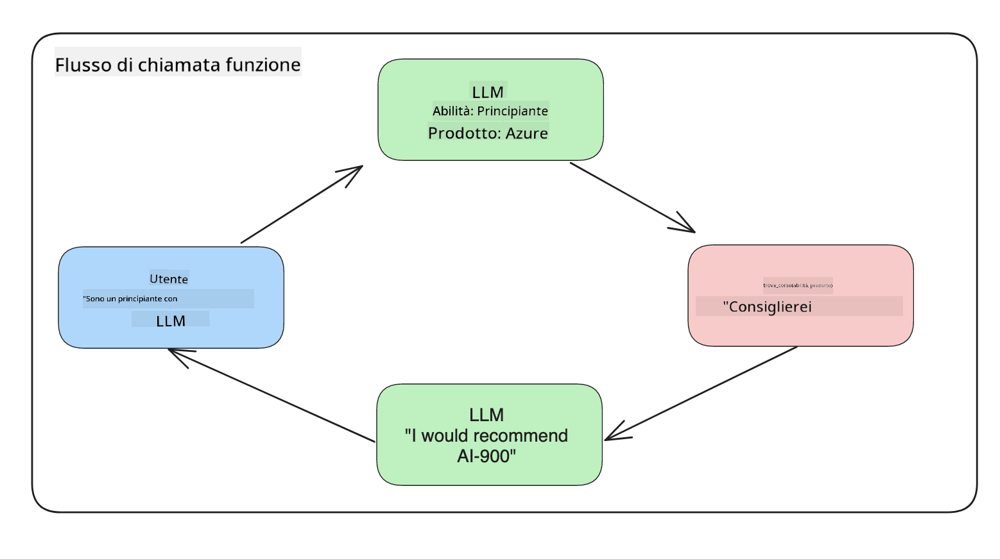

<!--
CO_OP_TRANSLATOR_METADATA:
{
  "original_hash": "77a48a201447be19aa7560706d6f93a0",
  "translation_date": "2025-07-09T14:32:00+00:00",
  "source_file": "11-integrating-with-function-calling/README.md",
  "language_code": "it"
}
-->
# Integrazione con function calling

[](https://aka.ms/gen-ai-lesson11-gh?WT.mc_id=academic-105485-koreyst)

Hai già imparato abbastanza nelle lezioni precedenti. Tuttavia, possiamo migliorare ulteriormente. Alcuni aspetti che possiamo affrontare riguardano come ottenere un formato di risposta più coerente per facilitare l'elaborazione della risposta a valle. Inoltre, potremmo voler aggiungere dati provenienti da altre fonti per arricchire ulteriormente la nostra applicazione.

I problemi menzionati sopra sono quelli che questo capitolo si propone di risolvere.

## Introduzione

In questa lezione vedremo:

- Spiegare cos’è il function calling e i suoi casi d’uso.
- Creare una chiamata di funzione usando Azure OpenAI.
- Come integrare una chiamata di funzione in un’applicazione.

## Obiettivi di apprendimento

Al termine di questa lezione, sarai in grado di:

- Spiegare lo scopo dell’uso del function calling.
- Configurare Function Call usando il servizio Azure OpenAI.
- Progettare chiamate di funzione efficaci per il caso d’uso della tua applicazione.

## Scenario: Migliorare il nostro chatbot con le funzioni

Per questa lezione, vogliamo costruire una funzionalità per la nostra startup educativa che permetta agli utenti di utilizzare un chatbot per trovare corsi tecnici. Consiglieremo corsi adatti al loro livello di competenza, ruolo attuale e tecnologia di interesse.

Per completare questo scenario, useremo una combinazione di:

- `Azure OpenAI` per creare un’esperienza di chat per l’utente.
- `Microsoft Learn Catalog API` per aiutare gli utenti a trovare corsi in base alla loro richiesta.
- `Function Calling` per prendere la query dell’utente e inviarla a una funzione che effettuerà la richiesta API.

Per iniziare, vediamo perché vorremmo usare il function calling in primo luogo:

## Perché Function Calling

Prima del function calling, le risposte di un LLM erano non strutturate e incoerenti. Gli sviluppatori dovevano scrivere codice di validazione complesso per gestire ogni possibile variazione di risposta. Gli utenti non potevano ottenere risposte a domande come "Qual è il meteo attuale a Stoccolma?". Questo perché i modelli erano limitati ai dati con cui erano stati addestrati.

Function Calling è una funzionalità del servizio Azure OpenAI che supera le seguenti limitazioni:

- **Formato di risposta coerente**. Se possiamo controllare meglio il formato della risposta, possiamo integrare più facilmente la risposta a valle in altri sistemi.
- **Dati esterni**. Possibilità di usare dati provenienti da altre fonti di un’applicazione in un contesto di chat.

## Illustrare il problema attraverso uno scenario

> Ti consigliamo di usare il [notebook incluso](python/aoai-assignment.ipynb) se vuoi eseguire lo scenario qui sotto. Puoi anche semplicemente leggere mentre cerchiamo di illustrare un problema che le funzioni possono aiutare a risolvere.

Vediamo un esempio che illustra il problema del formato di risposta:

Supponiamo di voler creare un database di dati degli studenti per poter suggerire loro il corso giusto. Qui sotto abbiamo due descrizioni di studenti molto simili nei dati che contengono.

1. Creiamo una connessione alla nostra risorsa Azure OpenAI:

   ```python
   import os
   import json
   from openai import AzureOpenAI
   from dotenv import load_dotenv
   load_dotenv()

   client = AzureOpenAI(
   api_key=os.environ['AZURE_OPENAI_API_KEY'],  # this is also the default, it can be omitted
   api_version = "2023-07-01-preview"
   )

   deployment=os.environ['AZURE_OPENAI_DEPLOYMENT']
   ```

   Qui sotto c’è del codice Python per configurare la connessione ad Azure OpenAI dove impostiamo `api_type`, `api_base`, `api_version` e `api_key`.

1. Creiamo due descrizioni di studenti usando le variabili `student_1_description` e `student_2_description`.

   ```python
   student_1_description="Emily Johnson is a sophomore majoring in computer science at Duke University. She has a 3.7 GPA. Emily is an active member of the university's Chess Club and Debate Team. She hopes to pursue a career in software engineering after graduating."

   student_2_description = "Michael Lee is a sophomore majoring in computer science at Stanford University. He has a 3.8 GPA. Michael is known for his programming skills and is an active member of the university's Robotics Club. He hopes to pursue a career in artificial intelligence after finishing his studies."
   ```

   Vogliamo inviare le descrizioni degli studenti a un LLM per analizzare i dati. Questi dati potranno poi essere usati nella nostra applicazione, inviati a un’API o memorizzati in un database.

1. Creiamo due prompt identici in cui istruiamo l’LLM su quali informazioni ci interessano:

   ```python
   prompt1 = f'''
   Please extract the following information from the given text and return it as a JSON object:

   name
   major
   school
   grades
   club

   This is the body of text to extract the information from:
   {student_1_description}
   '''

   prompt2 = f'''
   Please extract the following information from the given text and return it as a JSON object:

   name
   major
   school
   grades
   club

   This is the body of text to extract the information from:
   {student_2_description}
   '''
   ```

   I prompt sopra istruiscono l’LLM a estrarre informazioni e restituire la risposta in formato JSON.

1. Dopo aver impostato i prompt e la connessione ad Azure OpenAI, invieremo i prompt all’LLM usando `openai.ChatCompletion`. Memorizziamo il prompt nella variabile `messages` e assegniamo il ruolo `user`. Questo per simulare un messaggio scritto da un utente a un chatbot.

   ```python
   # response from prompt one
   openai_response1 = client.chat.completions.create(
   model=deployment,
   messages = [{'role': 'user', 'content': prompt1}]
   )
   openai_response1.choices[0].message.content

   # response from prompt two
   openai_response2 = client.chat.completions.create(
   model=deployment,
   messages = [{'role': 'user', 'content': prompt2}]
   )
   openai_response2.choices[0].message.content
   ```

Ora possiamo inviare entrambe le richieste all’LLM ed esaminare la risposta che riceviamo trovandola così: `openai_response1['choices'][0]['message']['content']`.

1. Infine, possiamo convertire la risposta in formato JSON chiamando `json.loads`:

   ```python
   # Loading the response as a JSON object
   json_response1 = json.loads(openai_response1.choices[0].message.content)
   json_response1
   ```

   Risposta 1:

   ```json
   {
     "name": "Emily Johnson",
     "major": "computer science",
     "school": "Duke University",
     "grades": "3.7",
     "club": "Chess Club"
   }
   ```

   Risposta 2:

   ```json
   {
     "name": "Michael Lee",
     "major": "computer science",
     "school": "Stanford University",
     "grades": "3.8 GPA",
     "club": "Robotics Club"
   }
   ```

   Anche se i prompt sono gli stessi e le descrizioni simili, vediamo che i valori della proprietà `Grades` sono formattati in modo diverso, ad esempio a volte otteniamo il formato `3.7` o `3.7 GPA`.

   Questo risultato è dovuto al fatto che l’LLM prende dati non strutturati sotto forma di prompt scritto e restituisce dati non strutturati. Abbiamo bisogno di un formato strutturato per sapere cosa aspettarci quando memorizziamo o usiamo questi dati.

Allora, come risolviamo il problema del formato? Usando il function calling, possiamo assicurarci di ricevere dati strutturati in risposta. Quando usiamo il function calling, l’LLM in realtà non chiama o esegue funzioni. Invece, creiamo una struttura che l’LLM deve seguire per le sue risposte. Usiamo poi queste risposte strutturate per sapere quale funzione eseguire nelle nostre applicazioni.



Possiamo quindi prendere ciò che viene restituito dalla funzione e inviarlo di nuovo all’LLM. L’LLM risponderà quindi usando il linguaggio naturale per rispondere alla query dell’utente.

## Casi d’uso per l’uso delle chiamate di funzione

Ci sono molti casi d’uso in cui le chiamate di funzione possono migliorare la tua app, come:

- **Chiamare strumenti esterni**. I chatbot sono ottimi nel fornire risposte alle domande degli utenti. Usando il function calling, i chatbot possono usare i messaggi degli utenti per completare determinate attività. Ad esempio, uno studente può chiedere al chatbot di "Inviare un’email al mio insegnante dicendo che ho bisogno di più assistenza su questo argomento". Questo può fare una chiamata di funzione a `send_email(to: string, body: string)`

- **Creare query API o database**. Gli utenti possono trovare informazioni usando il linguaggio naturale che viene convertito in una query formattata o richiesta API. Un esempio potrebbe essere un insegnante che chiede "Chi sono gli studenti che hanno completato l’ultimo compito" che potrebbe chiamare una funzione chiamata `get_completed(student_name: string, assignment: int, current_status: string)`

- **Creare dati strutturati**. Gli utenti possono prendere un blocco di testo o un CSV e usare l’LLM per estrarre informazioni importanti. Ad esempio, uno studente può convertire un articolo di Wikipedia sugli accordi di pace per creare flashcard AI. Questo può essere fatto usando una funzione chiamata `get_important_facts(agreement_name: string, date_signed: string, parties_involved: list)`

## Creare la tua prima chiamata di funzione

Il processo per creare una chiamata di funzione include 3 passaggi principali:

1. **Chiamare** l’API Chat Completions con una lista delle tue funzioni e un messaggio utente.
2. **Leggere** la risposta del modello per eseguire un’azione, cioè eseguire una funzione o una chiamata API.
3. **Fare** un’altra chiamata all’API Chat Completions con la risposta della tua funzione per usare quell’informazione e creare una risposta per l’utente.


### Passo 1 - creare i messaggi

Il primo passo è creare un messaggio utente. Questo può essere assegnato dinamicamente prendendo il valore da un input di testo oppure puoi assegnare un valore qui. Se è la prima volta che lavori con l’API Chat Completions, dobbiamo definire il `role` e il `content` del messaggio.

Il `role` può essere `system` (creare regole), `assistant` (il modello) o `user` (l’utente finale). Per il function calling, assegneremo `user` e una domanda di esempio.

```python
messages= [ {"role": "user", "content": "Find me a good course for a beginner student to learn Azure."} ]
```

Assegnando ruoli diversi, si chiarisce all’LLM se è il sistema a parlare o l’utente, il che aiuta a costruire una cronologia della conversazione su cui l’LLM può basarsi.

### Passo 2 - creare le funzioni

Successivamente, definiremo una funzione e i parametri di quella funzione. Useremo una sola funzione chiamata `search_courses` ma puoi crearne più di una.

> **Importante** : Le funzioni sono incluse nel messaggio di sistema all’LLM e saranno conteggiate nel numero di token disponibili.

Qui sotto creiamo le funzioni come un array di elementi. Ogni elemento è una funzione e ha le proprietà `name`, `description` e `parameters`:

```python
functions = [
   {
      "name":"search_courses",
      "description":"Retrieves courses from the search index based on the parameters provided",
      "parameters":{
         "type":"object",
         "properties":{
            "role":{
               "type":"string",
               "description":"The role of the learner (i.e. developer, data scientist, student, etc.)"
            },
            "product":{
               "type":"string",
               "description":"The product that the lesson is covering (i.e. Azure, Power BI, etc.)"
            },
            "level":{
               "type":"string",
               "description":"The level of experience the learner has prior to taking the course (i.e. beginner, intermediate, advanced)"
            }
         },
         "required":[
            "role"
         ]
      }
   }
]
```

Descriviamo più nel dettaglio ogni istanza di funzione:

- `name` - Il nome della funzione che vogliamo venga chiamata.
- `description` - Descrizione di come funziona la funzione. Qui è importante essere specifici e chiari.
- `parameters` - Una lista di valori e formati che vuoi che il modello produca nella sua risposta. L’array parameters consiste di elementi che hanno le seguenti proprietà:
  1.  `type` - Il tipo di dato in cui saranno memorizzate le proprietà.
  1.  `properties` - Lista dei valori specifici che il modello userà nella sua risposta
      1. `name` - La chiave è il nome della proprietà che il modello userà nella risposta formattata, ad esempio `product`.
      1. `type` - Il tipo di dato di questa proprietà, ad esempio `string`.
      1. `description` - Descrizione della proprietà specifica.

C’è anche una proprietà opzionale `required` - proprietà obbligatoria affinché la chiamata di funzione venga completata.

### Passo 3 - Effettuare la chiamata di funzione

Dopo aver definito una funzione, dobbiamo includerla nella chiamata all’API Chat Completion. Lo facciamo aggiungendo `functions` alla richiesta. In questo caso `functions=functions`.

C’è anche l’opzione di impostare `function_call` su `auto`. Questo significa che lasciamo decidere all’LLM quale funzione chiamare in base al messaggio dell’utente invece di assegnarla noi.

Ecco un po’ di codice dove chiamiamo `ChatCompletion.create`, nota come impostiamo `functions=functions` e `function_call="auto"` dando così all’LLM la scelta di quando chiamare le funzioni che gli forniamo:

```python
response = client.chat.completions.create(model=deployment,
                                        messages=messages,
                                        functions=functions,
                                        function_call="auto")

print(response.choices[0].message)
```

La risposta che riceviamo ora appare così:

```json
{
  "role": "assistant",
  "function_call": {
    "name": "search_courses",
    "arguments": "{\n  \"role\": \"student\",\n  \"product\": \"Azure\",\n  \"level\": \"beginner\"\n}"
  }
}
```

Qui vediamo come la funzione `search_courses` è stata chiamata e con quali argomenti, elencati nella proprietà `arguments` nella risposta JSON.

La conclusione è che l’LLM è stato in grado di trovare i dati per adattarli agli argomenti della funzione mentre li estraeva dal valore fornito al parametro `messages` nella chiamata di completamento chat. Qui sotto un promemoria del valore `messages`:

```python
messages= [ {"role": "user", "content": "Find me a good course for a beginner student to learn Azure."} ]
```

Come puoi vedere, `student`, `Azure` e `beginner` sono stati estratti da `messages` e impostati come input alla funzione. Usare le funzioni in questo modo è un ottimo modo per estrarre informazioni da un prompt ma anche per fornire struttura all’LLM e avere funzionalità riutilizzabili.

Ora vediamo come possiamo usare questo nella nostra app.

## Integrare le chiamate di funzione in un’applicazione

Dopo aver testato la risposta formattata dall’LLM, possiamo ora integrarla in un’applicazione.

### Gestire il flusso

Per integrare questo nella nostra applicazione, seguiamo questi passaggi:

1. Per prima cosa, facciamo la chiamata ai servizi OpenAI e memorizziamo il messaggio in una variabile chiamata `response_message`.

   ```python
   response_message = response.choices[0].message
   ```

1. Ora definiamo la funzione che chiamerà la Microsoft Learn API per ottenere una lista di corsi:

   ```python
   import requests

   def search_courses(role, product, level):
     url = "https://learn.microsoft.com/api/catalog/"
     params = {
        "role": role,
        "product": product,
        "level": level
     }
     response = requests.get(url, params=params)
     modules = response.json()["modules"]
     results = []
     for module in modules[:5]:
        title = module["title"]
        url = module["url"]
        results.append({"title": title, "url": url})
     return str(results)
   ```

   Nota come ora creiamo una vera funzione Python che mappa i nomi delle funzioni introdotti nella variabile `functions`. Stiamo anche effettuando vere chiamate API esterne per recuperare i dati di cui abbiamo bisogno. In questo caso, interroghiamo la Microsoft Learn API per cercare moduli di formazione.

Ok, abbiamo creato la variabile `functions` e una corrispondente funzione Python, come facciamo a dire all’LLM come collegare queste due cose affinché venga chiamata la nostra funzione Python?

1. Per vedere se dobbiamo chiamare una funzione Python, dobbiamo controllare la risposta dell’LLM e verificare se `function_call` è presente e chiamare la funzione indicata. Ecco come fare il controllo:

   ```python
   # Check if the model wants to call a function
   if response_message.function_call.name:
    print("Recommended Function call:")
    print(response_message.function_call.name)
    print()

    # Call the function.
    function_name = response_message.function_call.name

    available_functions = {
            "search_courses": search_courses,
    }
    function_to_call = available_functions[function_name]

    function_args = json.loads(response_message.function_call.arguments)
    function_response = function_to_call(**function_args)

    print("Output of function call:")
    print(function_response)
    print(type(function_response))


    # Add the assistant response and function response to the messages
    messages.append( # adding assistant response to messages
        {
            "role": response_message.role,
            "function_call": {
                "name": function_name,
                "arguments": response_message.function_call.arguments,
            },
            "content": None
        }
    )
    messages.append( # adding function response to messages
        {
            "role": "function",
            "name": function_name,
            "content":function_response,
        }
    )
   ```

   Queste tre righe assicurano che estraiamo il nome della funzione, gli argomenti e facciamo la chiamata:

   ```python
   function_to_call = available_functions[function_name]

   function_args = json.loads(response_message.function_call.arguments)
   function_response = function_to_call(**function_args)
   ```

   Qui sotto l’output ottenuto eseguendo il nostro codice:

   **Output**

   ```Recommended Function call:
   {
     "name": "search_courses",
     "arguments": "{\n  \"role\": \"student\",\n  \"product\": \"Azure\",\n  \"level\": \"beginner\"\n}"
   }

   Output of function call:
   [{'title': 'Describe concepts of cryptography', 'url': 'https://learn.microsoft.com/training/modules/describe-concepts-of-cryptography/?
   WT.mc_id=api_CatalogApi'}, {'title': 'Introduction to audio classification with TensorFlow', 'url': 'https://learn.microsoft.com/en-
   us/training/modules/intro-audio-classification-tensorflow/?WT.mc_id=api_CatalogApi'}, {'title': 'Design a Performant Data Model in Azure SQL
   Database with Azure Data Studio', 'url': 'https://learn.microsoft.com/training/modules/design-a-data-model-with-ads/?
   WT.mc_id=api_CatalogApi'}, {'title': 'Getting started with the Microsoft Cloud Adoption Framework for Azure', 'url':
   'https://learn.microsoft.com/training/modules/cloud-adoption-framework-getting-started/?WT.mc_id=api_CatalogApi'}, {'title': 'Set up the
   Rust development environment', 'url': 'https://learn.microsoft.com/training/modules/rust-set-up-environment/?WT.mc_id=api_CatalogApi'}]
   <class 'str'>
   ```

1. Ora invieremo il messaggio aggiornato, `messages` all’LLM così da ricevere una risposta in linguaggio naturale invece di una risposta JSON formattata da API.

   ```python
   print("Messages in next request:")
   print(messages)
   print()

   second_response = client.chat.completions.create(
      messages=messages,
      model=deployment,
      function_call="auto",
      functions=functions,
      temperature=0
         )  # get a new response from GPT where it can see the function response


   print(second_response.choices[0].message)
   ```

   **Output**

   ```python
   {
     "role": "assistant",
     "content": "I found some good courses for beginner students to learn Azure:\n\n1. [Describe concepts of cryptography] (https://learn.microsoft.com/training/modules/describe-concepts-of-cryptography/?WT.mc_id=api_CatalogApi)\n2. [Introduction to audio classification with TensorFlow](https://learn.microsoft.com/training/modules/intro-audio-classification-tensorflow/?WT.mc_id=api_CatalogApi)\n3. [Design a Performant Data Model in Azure SQL Database with Azure Data Studio](https://learn.microsoft.com/training/modules/design-a-data-model-with-ads/?WT.mc_id=api_CatalogApi)\n4. [Getting started with the Microsoft Cloud Adoption Framework for Azure](https://learn.microsoft.com/training/modules/cloud-adoption-framework-getting-started/?WT.mc_id=api_CatalogApi)\n5. [Set up the Rust development environment](https://learn.microsoft.com/training/modules/rust-set-up-environment/?WT.mc_id=api_CatalogApi)\n\nYou can click on the links to access the courses."
   }

   ```

## Compito

Per continuare il tuo apprendimento su Azure OpenAI Function Calling puoi sviluppare:

- Più parametri della funzione che potrebbero aiutare gli studenti a trovare più corsi.
- Creare un’altra chiamata di funzione che prenda più informazioni dallo studente, come la loro lingua madre.
- Creare una gestione degli errori quando la chiamata di funzione e/o la chiamata API non restituiscono corsi adatti.
## Ottimo lavoro! Continua il viaggio

Dopo aver completato questa lezione, dai un’occhiata alla nostra [collezione di apprendimento sull’Intelligenza Artificiale Generativa](https://aka.ms/genai-collection?WT.mc_id=academic-105485-koreyst) per continuare a migliorare le tue conoscenze sull’IA Generativa!

Passa alla Lezione 12, dove vedremo come [progettare l’UX per applicazioni di IA](../12-designing-ux-for-ai-applications/README.md?WT.mc_id=academic-105485-koreyst)!

**Disclaimer**:  
Questo documento è stato tradotto utilizzando il servizio di traduzione automatica [Co-op Translator](https://github.com/Azure/co-op-translator). Pur impegnandoci per garantire accuratezza, si prega di notare che le traduzioni automatiche possono contenere errori o imprecisioni. Il documento originale nella sua lingua nativa deve essere considerato la fonte autorevole. Per informazioni critiche, si raccomanda una traduzione professionale effettuata da un umano. Non ci assumiamo alcuna responsabilità per eventuali malintesi o interpretazioni errate derivanti dall’uso di questa traduzione.