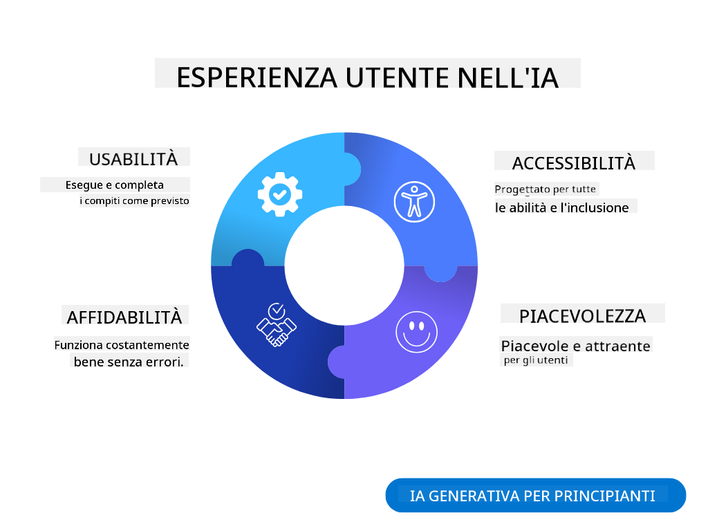
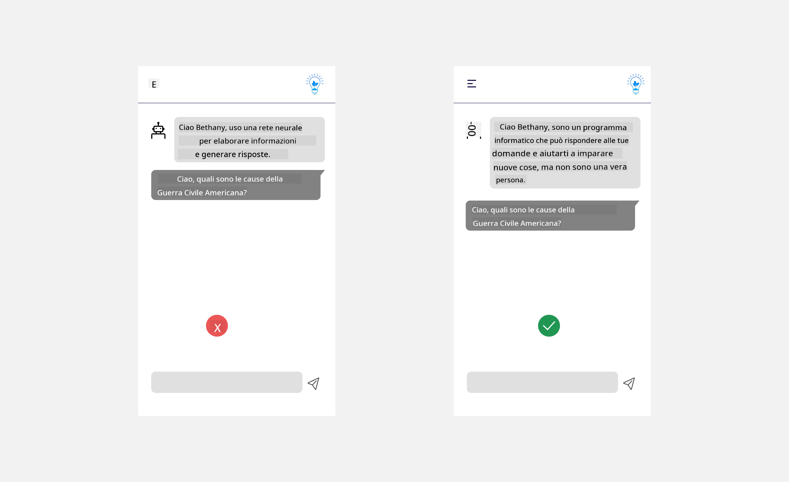
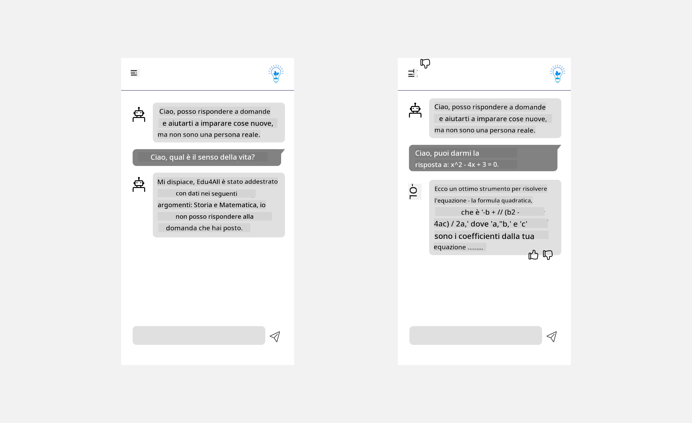

<!--
CO_OP_TRANSLATOR_METADATA:
{
  "original_hash": "ec385b41ee50579025d50cc03bfb3a25",
  "translation_date": "2025-05-19T21:53:57+00:00",
  "source_file": "12-designing-ux-for-ai-applications/README.md",
  "language_code": "it"
}
-->
# Progettare l'esperienza utente per applicazioni AI

> _(Clicca sull'immagine sopra per vedere il video di questa lezione)_

L'esperienza utente è un aspetto molto importante nella creazione di app. Gli utenti devono essere in grado di utilizzare la tua app in modo efficiente per svolgere compiti. Essere efficienti è una cosa, ma è anche necessario progettare app che possano essere utilizzate da tutti, rendendole _accessibili_. Questo capitolo si concentrerà su quest'area affinché tu possa progettare un'app che le persone possano e vogliano usare.

## Introduzione

L'esperienza utente riguarda il modo in cui un utente interagisce e utilizza un prodotto o servizio specifico, che si tratti di un sistema, strumento o design. Quando si sviluppano applicazioni AI, gli sviluppatori non solo si concentrano sull'assicurare che l'esperienza utente sia efficace, ma anche etica. In questa lezione, affrontiamo come costruire applicazioni di Intelligenza Artificiale (AI) che rispondano alle esigenze degli utenti.

La lezione coprirà i seguenti aspetti:

- Introduzione all'esperienza utente e comprensione delle esigenze degli utenti
- Progettare applicazioni AI per fiducia e trasparenza
- Progettare applicazioni AI per collaborazione e feedback

## Obiettivi di apprendimento

Dopo aver seguito questa lezione, sarai in grado di:

- Comprendere come costruire applicazioni AI che soddisfino le esigenze degli utenti.
- Progettare applicazioni AI che promuovano fiducia e collaborazione.

### Prerequisiti

Prenditi un po' di tempo per leggere di più su [esperienza utente e design thinking.](https://learn.microsoft.com/training/modules/ux-design?WT.mc_id=academic-105485-koreyst)

## Introduzione all'esperienza utente e comprensione delle esigenze degli utenti

Nella nostra startup educativa fittizia, abbiamo due utenti principali, insegnanti e studenti. Ognuno dei due utenti ha esigenze uniche. Un design centrato sull'utente dà priorità all'utente, assicurando che i prodotti siano rilevanti e vantaggiosi per coloro a cui sono destinati.

L'applicazione dovrebbe essere **utile, affidabile, accessibile e piacevole** per fornire una buona esperienza utente.

### Usabilità

Essere utile significa che l'applicazione ha funzionalità che corrispondono al suo scopo, come automatizzare il processo di valutazione o generare flashcard per la revisione. Un'applicazione che automatizza il processo di valutazione dovrebbe essere in grado di assegnare punteggi in modo accurato ed efficiente al lavoro degli studenti in base a criteri predefiniti. Allo stesso modo, un'applicazione che genera flashcard per la revisione dovrebbe essere in grado di creare domande pertinenti e diversificate basate sui suoi dati.

### Affidabilità

Essere affidabile significa che l'applicazione può svolgere il suo compito in modo coerente e senza errori. Tuttavia, l'AI, come gli esseri umani, non è perfetta e può essere soggetta a errori. Le applicazioni possono incontrare errori o situazioni inaspettate che richiedono l'intervento o la correzione umana. Come gestisci gli errori? Nell'ultima sezione di questa lezione, affronteremo come i sistemi e le applicazioni AI sono progettati per collaborazione e feedback.

### Accessibilità

Essere accessibile significa estendere l'esperienza utente a utenti con varie abilità, inclusi quelli con disabilità, assicurando che nessuno venga escluso. Seguendo le linee guida e i principi di accessibilità, le soluzioni AI diventano più inclusive, utilizzabili e vantaggiose per tutti gli utenti.

### Piacevole

Essere piacevole significa che l'applicazione è piacevole da usare. Un'esperienza utente attraente può avere un impatto positivo sull'utente, incoraggiandolo a tornare all'applicazione e aumentando i ricavi aziendali.

Non tutte le sfide possono essere risolte con l'AI. L'AI entra in gioco per migliorare la tua esperienza utente, sia automatizzando compiti manuali, sia personalizzando le esperienze degli utenti.

## Progettare applicazioni AI per fiducia e trasparenza

Costruire fiducia è fondamentale quando si progettano applicazioni AI. La fiducia garantisce che un utente sia sicuro che l'applicazione porterà a termine il lavoro, fornirà risultati in modo coerente e che i risultati siano ciò di cui l'utente ha bisogno. Un rischio in quest'area è la sfiducia e l'eccessiva fiducia. La sfiducia si verifica quando un utente ha poca o nessuna fiducia in un sistema AI, portando l'utente a rifiutare la tua applicazione. L'eccessiva fiducia si verifica quando un utente sovrastima la capacità di un sistema AI, portando gli utenti a fidarsi troppo del sistema AI. Ad esempio, un sistema di valutazione automatizzato nel caso di eccessiva fiducia potrebbe portare l'insegnante a non controllare alcuni dei documenti per assicurarsi che il sistema di valutazione funzioni bene. Questo potrebbe risultare in voti ingiusti o inaccurati per gli studenti, o opportunità mancate di feedback e miglioramento.

Due modi per assicurarsi che la fiducia sia al centro del design sono la spiegabilità e il controllo.

### Spiegabilità

Quando l'AI aiuta a informare decisioni come impartire conoscenza alle generazioni future, è fondamentale che insegnanti e genitori comprendano come vengono prese le decisioni AI. Questa è la spiegabilità: comprendere come le applicazioni AI prendono decisioni. Progettare per la spiegabilità include l'aggiunta di dettagli di esempi di ciò che un'applicazione AI può fare. Ad esempio, invece di "Inizia con l'insegnante AI", il sistema può usare: "Riassumi i tuoi appunti per una revisione più facile usando l'AI."

Un altro esempio è come l'AI utilizza dati utente e personali. Ad esempio, un utente con la persona studente può avere limitazioni basate sulla sua persona. L'AI potrebbe non essere in grado di rivelare risposte alle domande ma può aiutare a guidare l'utente a pensare a come possono risolvere un problema.

Un'ultima parte chiave della spiegabilità è la semplificazione delle spiegazioni. Studenti e insegnanti potrebbero non essere esperti di AI, quindi le spiegazioni di ciò che l'applicazione può o non può fare dovrebbero essere semplificate e facili da comprendere.

### Controllo

L'AI generativa crea una collaborazione tra l'AI e l'utente, dove ad esempio un utente può modificare i prompt per risultati diversi. Inoltre, una volta generato un output, gli utenti dovrebbero essere in grado di modificare i risultati dando loro un senso di controllo. Ad esempio, quando si utilizza Bing, puoi adattare il tuo prompt in base al formato, tono e lunghezza. Inoltre, puoi apportare modifiche al tuo output e modificarlo come mostrato di seguito:

Un'altra funzionalità in Bing che consente a un utente di avere controllo sull'applicazione è la possibilità di optare per l'uso o meno dei dati che l'AI utilizza. Per un'applicazione scolastica, uno studente potrebbe voler utilizzare i propri appunti così come le risorse degli insegnanti come materiale di revisione.

> Quando si progettano applicazioni AI, l'intenzionalità è fondamentale per garantire che gli utenti non abbiano eccessiva fiducia impostando aspettative irrealistiche delle sue capacità. Un modo per farlo è creare attrito tra i prompt e i risultati. Ricordando all'utente che questa è AI e non un essere umano

## Progettare applicazioni AI per collaborazione e feedback

Come accennato in precedenza, l'AI generativa crea una collaborazione tra l'utente e l'AI. La maggior parte degli impegni sono con un utente che inserisce un prompt e l'AI che genera un output. E se l'output fosse errato? Come gestisce l'applicazione gli errori se si verificano? L'AI incolpa l'utente o si prende il tempo di spiegare l'errore?

Le applicazioni AI dovrebbero essere costruite per ricevere e fornire feedback. Questo non solo aiuta il sistema AI a migliorare, ma costruisce anche fiducia con gli utenti. Un ciclo di feedback dovrebbe essere incluso nel design, un esempio può essere un semplice pollice su o giù sull'output.

Un altro modo per gestire questo è comunicare chiaramente le capacità e le limitazioni del sistema. Quando un utente commette un errore richiedendo qualcosa al di là delle capacità dell'AI, dovrebbe anche esserci un modo per gestirlo, come mostrato di seguito.

Gli errori di sistema sono comuni con le applicazioni dove l'utente potrebbe aver bisogno di assistenza con informazioni al di fuori dell'ambito dell'AI o l'applicazione potrebbe avere un limite su quante domande/soggetti un utente può generare riassunti. Ad esempio, un'applicazione AI addestrata con dati su soggetti limitati, ad esempio, Storia e Matematica, potrebbe non essere in grado di gestire domande su Geografia. Per mitigare questo, il sistema AI può fornire una risposta del tipo: "Mi dispiace, il nostro prodotto è stato addestrato con dati nei seguenti soggetti....., non posso essere in grado di rispondere alla domanda che hai posto."

Le applicazioni AI non sono perfette, quindi, sono destinate a commettere errori. Quando progetti le tue applicazioni, dovresti assicurarti di creare spazio per feedback dagli utenti e gestione degli errori in modo semplice e facilmente spiegabile.

## Compito

Prendi qualsiasi app AI che hai costruito finora, considera di implementare i seguenti passaggi nella tua app:

- **Piacevole:** Considera come puoi rendere la tua app più piacevole. Stai aggiungendo spiegazioni ovunque? Stai incoraggiando l'utente a esplorare? Come stai formulando i tuoi messaggi di errore?

- **Usabilità:** Costruire un'app web. Assicurati che la tua app sia navigabile sia con il mouse che con la tastiera.

- **Fiducia e trasparenza:** Non fidarti completamente dell'AI e del suo output, considera come aggiungere un umano al processo per verificare l'output. Considera e implementa anche altri modi per ottenere fiducia e trasparenza.

- **Controllo:** Dai all'utente il controllo dei dati che fornisce all'applicazione. Implementa un modo in cui un utente può optare per l'uso o meno dei dati nell'applicazione AI.

## Continua il tuo apprendimento!

Dopo aver completato questa lezione, dai un'occhiata alla nostra [collezione di apprendimento sull'AI generativa](https://aka.ms/genai-collection?WT.mc_id=academic-105485-koreyst) per continuare a migliorare la tua conoscenza dell'AI generativa!

Vai alla Lezione 13, dove vedremo come [proteggere le applicazioni AI](../13-securing-ai-applications/README.md?WT.mc_id=academic-105485-koreyst)!

**Disclaimer**:  
Questo documento è stato tradotto utilizzando il servizio di traduzione AI [Co-op Translator](https://github.com/Azure/co-op-translator). Sebbene ci impegniamo per l'accuratezza, si prega di essere consapevoli che le traduzioni automatiche possono contenere errori o inesattezze. Il documento originale nella sua lingua nativa dovrebbe essere considerato la fonte autorevole. Per informazioni critiche, si raccomanda una traduzione professionale umana. Non siamo responsabili per eventuali incomprensioni o interpretazioni errate derivanti dall'uso di questa traduzione.