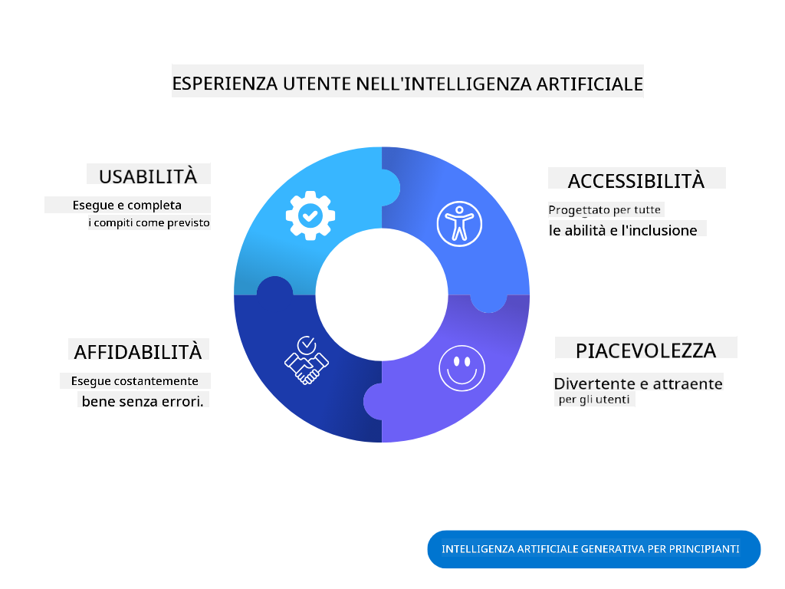
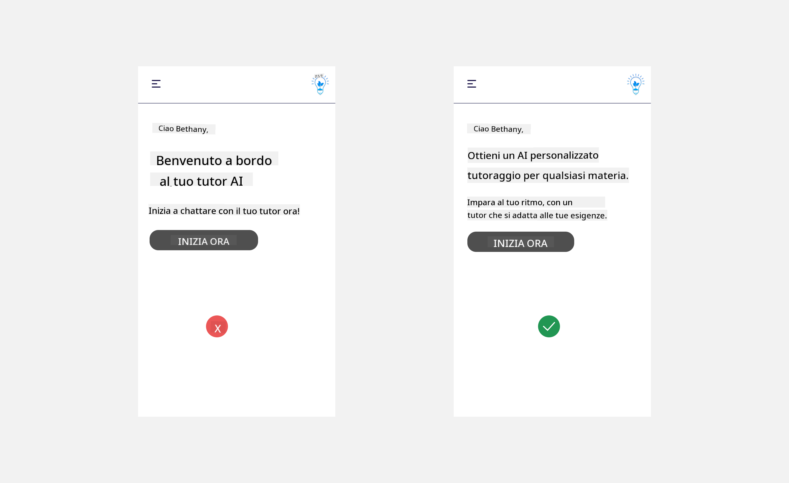
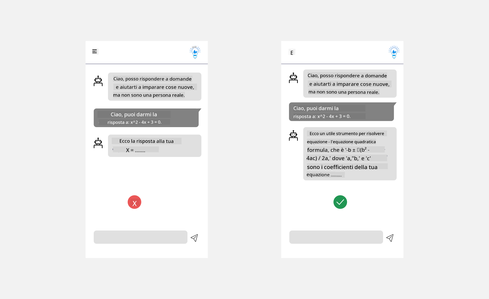
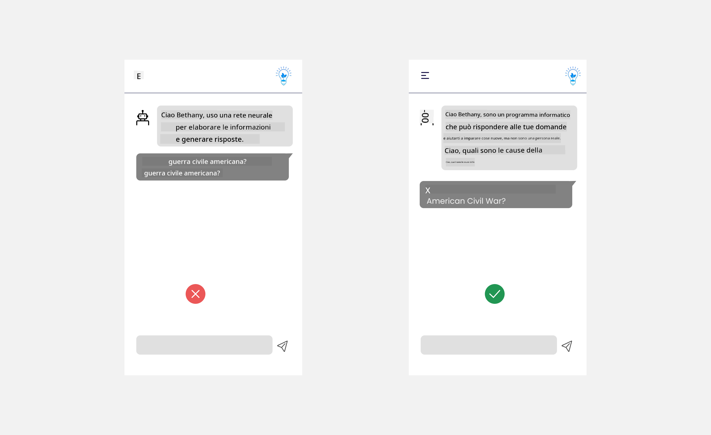
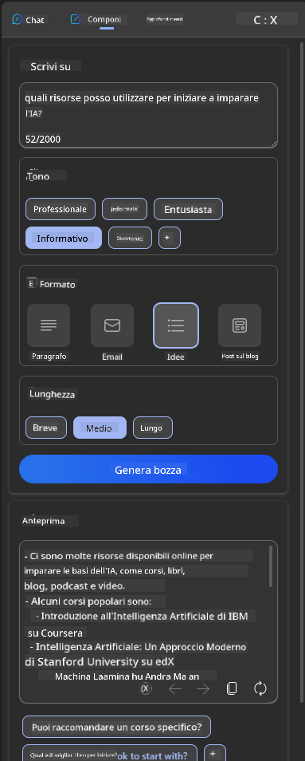
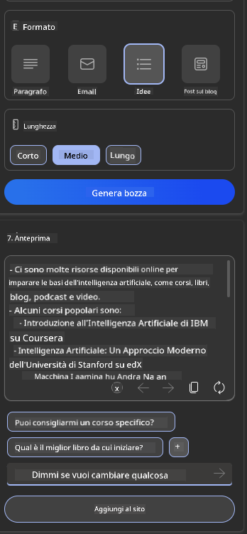
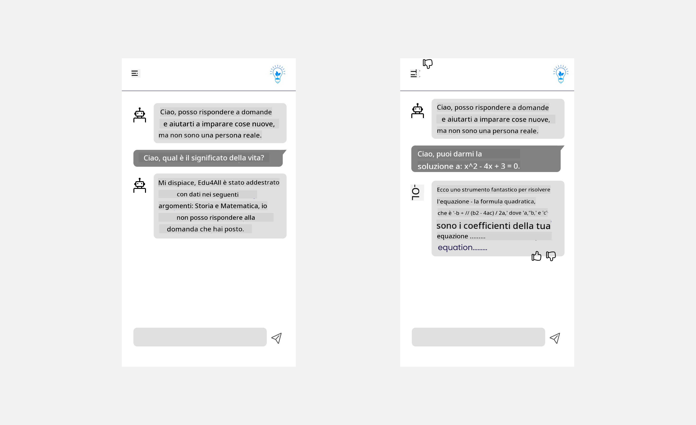

<!--
CO_OP_TRANSLATOR_METADATA:
{
  "original_hash": "ec385b41ee50579025d50cc03bfb3a25",
  "translation_date": "2025-07-09T14:56:18+00:00",
  "source_file": "12-designing-ux-for-ai-applications/README.md",
  "language_code": "it"
}
-->
# Progettare l’UX per Applicazioni AI

> _(Clicca sull’immagine sopra per vedere il video di questa lezione)_

L’esperienza utente è un aspetto molto importante nella creazione di app. Gli utenti devono poter utilizzare la tua app in modo efficiente per svolgere le attività. Essere efficienti è una cosa, ma è anche necessario progettare app che possano essere usate da tutti, rendendole _accessibili_. Questo capitolo si concentrerà su questo aspetto, così da aiutarti a progettare un’app che le persone possano e vogliano usare.

## Introduzione

L’esperienza utente è il modo in cui un utente interagisce e utilizza un prodotto o servizio specifico, che sia un sistema, uno strumento o un design. Quando si sviluppano applicazioni AI, gli sviluppatori non si concentrano solo sull’efficacia dell’esperienza utente, ma anche sull’etica. In questa lezione, vedremo come costruire applicazioni di Intelligenza Artificiale (AI) che rispondano ai bisogni degli utenti.

La lezione tratterà i seguenti argomenti:

- Introduzione all’Esperienza Utente e Comprensione dei Bisogni degli Utenti  
- Progettare Applicazioni AI per Fiducia e Trasparenza  
- Progettare Applicazioni AI per Collaborazione e Feedback  

## Obiettivi di apprendimento

Dopo aver seguito questa lezione, sarai in grado di:

- Comprendere come costruire applicazioni AI che soddisfino i bisogni degli utenti.  
- Progettare applicazioni AI che promuovano fiducia e collaborazione.  

### Prerequisiti

Prenditi un momento per approfondire [esperienza utente e design thinking.](https://learn.microsoft.com/training/modules/ux-design?WT.mc_id=academic-105485-koreyst)

## Introduzione all’Esperienza Utente e Comprensione dei Bisogni degli Utenti

Nella nostra startup educativa immaginaria, abbiamo due utenti principali: insegnanti e studenti. Ciascuno dei due ha bisogni unici. Un design centrato sull’utente dà priorità all’utente, assicurando che i prodotti siano rilevanti e utili per chi sono destinati.

L’applicazione dovrebbe essere **utile, affidabile, accessibile e piacevole** per offrire una buona esperienza utente.

### Usabilità

Essere utile significa che l’applicazione ha funzionalità che corrispondono al suo scopo, come automatizzare il processo di valutazione o generare flashcard per la revisione. Un’app che automatizza la valutazione dovrebbe essere in grado di assegnare punteggi in modo accurato ed efficiente al lavoro degli studenti, basandosi su criteri predefiniti. Allo stesso modo, un’app che genera flashcard per la revisione dovrebbe creare domande rilevanti e varie basate sui dati a disposizione.

### Affidabilità

Essere affidabile significa che l’applicazione può svolgere il suo compito in modo costante e senza errori. Tuttavia, l’AI, come gli esseri umani, non è perfetta e può commettere errori. Le applicazioni possono incontrare errori o situazioni impreviste che richiedono l’intervento o la correzione umana. Come gestisci gli errori? Nell’ultima sezione di questa lezione vedremo come i sistemi e le applicazioni AI sono progettati per la collaborazione e il feedback.

### Accessibilità

Essere accessibile significa estendere l’esperienza utente a persone con diverse abilità, comprese quelle con disabilità, assicurandosi che nessuno venga escluso. Seguendo linee guida e principi di accessibilità, le soluzioni AI diventano più inclusive, utilizzabili e vantaggiose per tutti gli utenti.

### Piacevolezza

Essere piacevole significa che l’applicazione è gradevole da usare. Un’esperienza utente attraente può avere un impatto positivo sull’utente, incoraggiandolo a tornare sull’applicazione e aumentando i ricavi.

Non tutte le sfide possono essere risolte con l’AI. L’AI serve a potenziare l’esperienza utente, che sia automatizzando compiti manuali o personalizzando le esperienze.

## Progettare Applicazioni AI per Fiducia e Trasparenza

Costruire fiducia è fondamentale nella progettazione di applicazioni AI. La fiducia garantisce che l’utente sia sicuro che l’applicazione svolgerà il lavoro, fornirà risultati costanti e che i risultati siano ciò di cui l’utente ha bisogno. Un rischio in questo ambito è la sfiducia e la sovrafiducia. La sfiducia si verifica quando un utente ha poca o nessuna fiducia in un sistema AI, portandolo a rifiutare l’applicazione. La sovrafiducia si verifica quando un utente sopravvaluta le capacità di un sistema AI, affidandosi troppo ad esso. Per esempio, un sistema di valutazione automatica, in caso di sovrafiducia, potrebbe portare l’insegnante a non controllare alcuni compiti per assicurarsi che il sistema funzioni correttamente. Questo potrebbe causare voti ingiusti o inaccurati per gli studenti, o perdere opportunità di feedback e miglioramento.

Due modi per mettere la fiducia al centro del design sono spiegabilità e controllo.

### Spiegabilità

Quando l’AI aiuta a prendere decisioni, come trasmettere conoscenze alle future generazioni, è fondamentale che insegnanti e genitori capiscano come vengono prese le decisioni dall’AI. Questa è la spiegabilità: comprendere come le applicazioni AI prendono decisioni. Progettare per la spiegabilità significa aggiungere dettagli ed esempi di cosa un’app AI può fare. Per esempio, invece di “Inizia con AI teacher”, il sistema può usare: “Riepiloga i tuoi appunti per una revisione più semplice con l’AI.”

Un altro esempio è come l’AI utilizza i dati personali e dell’utente. Per esempio, un utente con il profilo studente può avere limitazioni basate sul suo profilo. L’AI potrebbe non poter rivelare le risposte alle domande, ma può aiutare a guidare l’utente a riflettere su come risolvere un problema.

Un ultimo aspetto chiave della spiegabilità è la semplificazione delle spiegazioni. Studenti e insegnanti potrebbero non essere esperti di AI, quindi le spiegazioni su cosa l’applicazione può o non può fare dovrebbero essere semplici e facili da capire.

### Controllo

L’AI generativa crea una collaborazione tra AI e utente, dove per esempio l’utente può modificare i prompt per ottenere risultati diversi. Inoltre, una volta generato un output, gli utenti dovrebbero poter modificare i risultati, dando loro un senso di controllo. Per esempio, usando Bing, puoi personalizzare il prompt in base a formato, tono e lunghezza. Inoltre, puoi aggiungere modifiche al risultato e modificarlo come mostrato di seguito:

Un’altra funzione di Bing che permette all’utente di avere controllo sull’applicazione è la possibilità di scegliere se partecipare o meno alla raccolta dati usata dall’AI. Per un’app scolastica, uno studente potrebbe voler usare i propri appunti così come le risorse degli insegnanti come materiale di revisione.

> Quando progetti applicazioni AI, l’intenzionalità è fondamentale per evitare che gli utenti abbiano una sovrafiducia, creando aspettative irrealistiche sulle capacità. Un modo per farlo è creare attrito tra prompt e risultati, ricordando all’utente che si tratta di AI e non di un essere umano.

## Progettare Applicazioni AI per Collaborazione e Feedback

Come detto prima, l’AI generativa crea una collaborazione tra utente e AI. La maggior parte delle interazioni consiste in un utente che inserisce un prompt e l’AI che genera un output. Cosa succede se l’output è errato? Come gestisce l’applicazione gli errori se si verificano? L’AI dà la colpa all’utente o si prende il tempo per spiegare l’errore?

Le applicazioni AI dovrebbero essere progettate per ricevere e fornire feedback. Questo non solo aiuta il sistema AI a migliorare, ma costruisce anche fiducia con gli utenti. Un ciclo di feedback dovrebbe essere incluso nel design, un esempio può essere un semplice pollice in su o in giù sull’output.

Un altro modo per gestire questo è comunicare chiaramente le capacità e i limiti del sistema. Quando un utente commette un errore richiedendo qualcosa oltre le capacità dell’AI, dovrebbe esserci un modo per gestirlo, come mostrato di seguito.

Gli errori di sistema sono comuni nelle applicazioni dove l’utente potrebbe aver bisogno di assistenza con informazioni fuori dal campo dell’AI o l’applicazione potrebbe avere un limite sul numero di domande/argomenti per cui un utente può generare riassunti. Per esempio, un’app AI addestrata con dati su materie limitate come Storia e Matematica potrebbe non essere in grado di gestire domande di Geografia. Per mitigare questo, il sistema AI può rispondere con: “Spiacente, il nostro prodotto è stato addestrato con dati nelle seguenti materie....., non posso rispondere alla domanda che hai posto.”

Le applicazioni AI non sono perfette, quindi è inevitabile che commettano errori. Quando progetti le tue applicazioni, assicurati di creare spazio per il feedback degli utenti e per la gestione degli errori in modo semplice e facilmente comprensibile.

## Compito

Prendi una qualsiasi app AI che hai costruito finora e considera di implementare i seguenti passaggi nella tua app:

- **Piacevolezza:** Rifletti su come rendere la tua app più piacevole. Stai aggiungendo spiegazioni ovunque? Incoraggi l’utente a esplorare? Come formuli i messaggi di errore?

- **Usabilità:** Se stai costruendo un’app web, assicurati che sia navigabile sia con mouse che con tastiera.

- **Fiducia e trasparenza:** Non fidarti completamente dell’AI e dei suoi output, considera come potresti inserire un controllo umano per verificare i risultati. Inoltre, considera e implementa altri modi per ottenere fiducia e trasparenza.

- **Controllo:** Dai all’utente il controllo sui dati che fornisce all’applicazione. Implementa un modo per permettere all’utente di scegliere se partecipare o meno alla raccolta dati nell’app AI.

## Continua a imparare!

Dopo aver completato questa lezione, dai un’occhiata alla nostra [collezione di apprendimento sull’AI generativa](https://aka.ms/genai-collection?WT.mc_id=academic-105485-koreyst) per continuare a migliorare le tue conoscenze sull’AI generativa!

Passa alla Lezione 13, dove vedremo come [mettere in sicurezza le applicazioni AI](../13-securing-ai-applications/README.md?WT.mc_id=academic-105485-koreyst)!

**Disclaimer**:  
Questo documento è stato tradotto utilizzando il servizio di traduzione automatica [Co-op Translator](https://github.com/Azure/co-op-translator). Pur impegnandoci per garantire accuratezza, si prega di notare che le traduzioni automatiche possono contenere errori o imprecisioni. Il documento originale nella sua lingua nativa deve essere considerato la fonte autorevole. Per informazioni critiche, si raccomanda una traduzione professionale effettuata da un umano. Non ci assumiamo alcuna responsabilità per eventuali malintesi o interpretazioni errate derivanti dall’uso di questa traduzione.