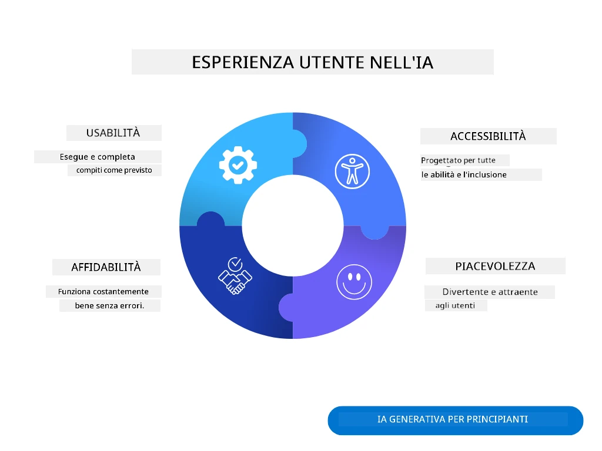
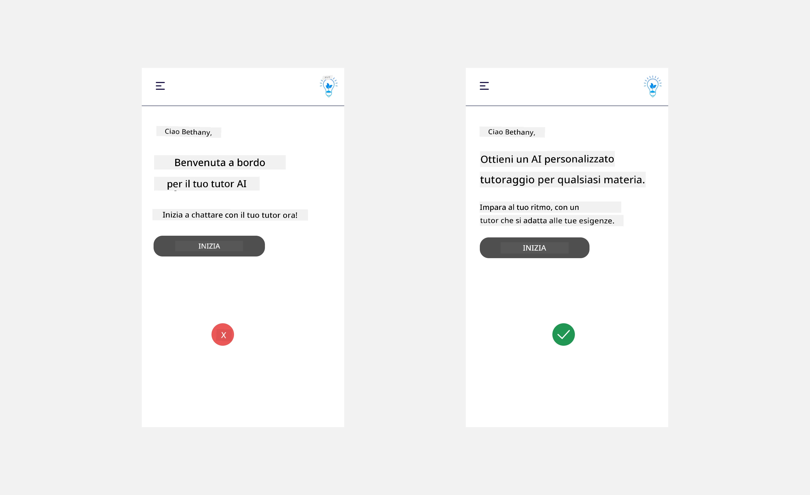
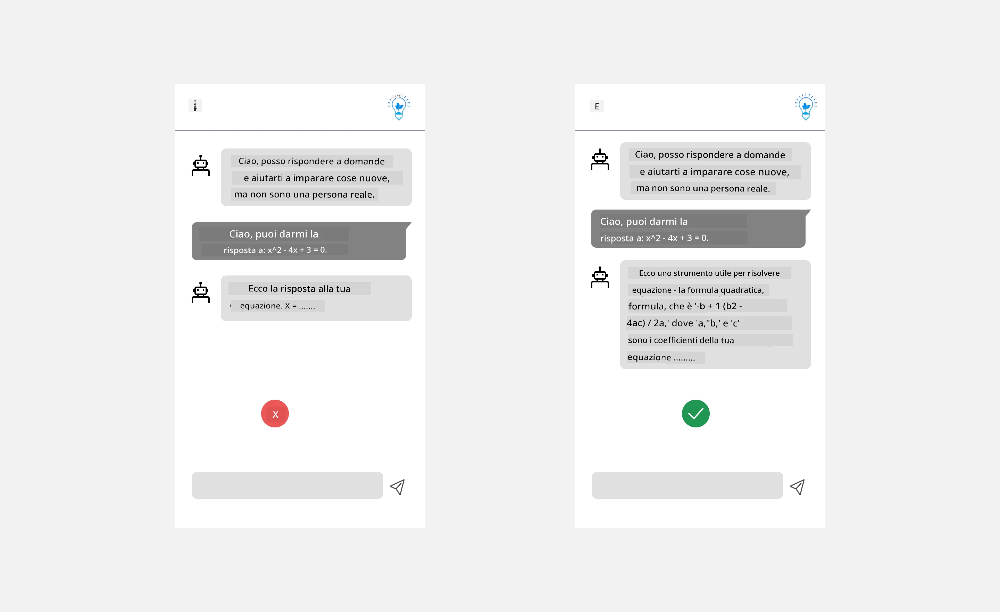
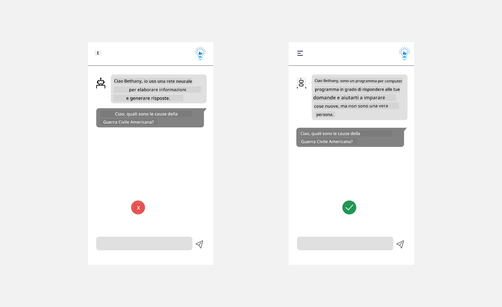
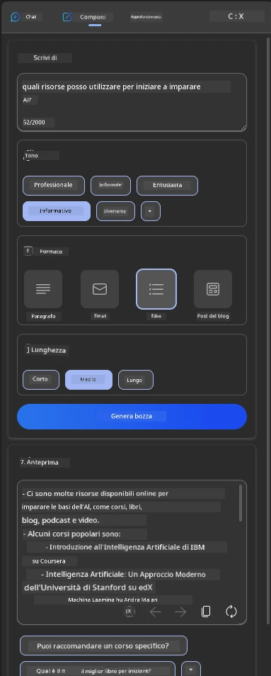
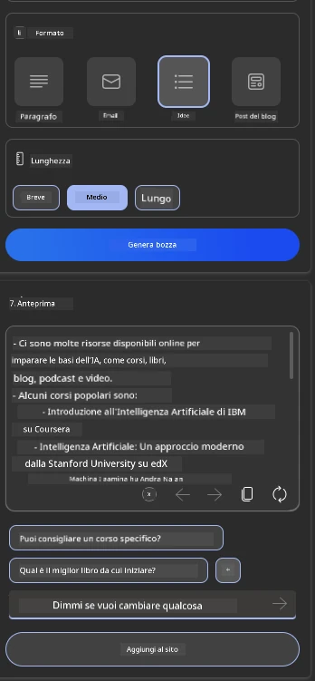
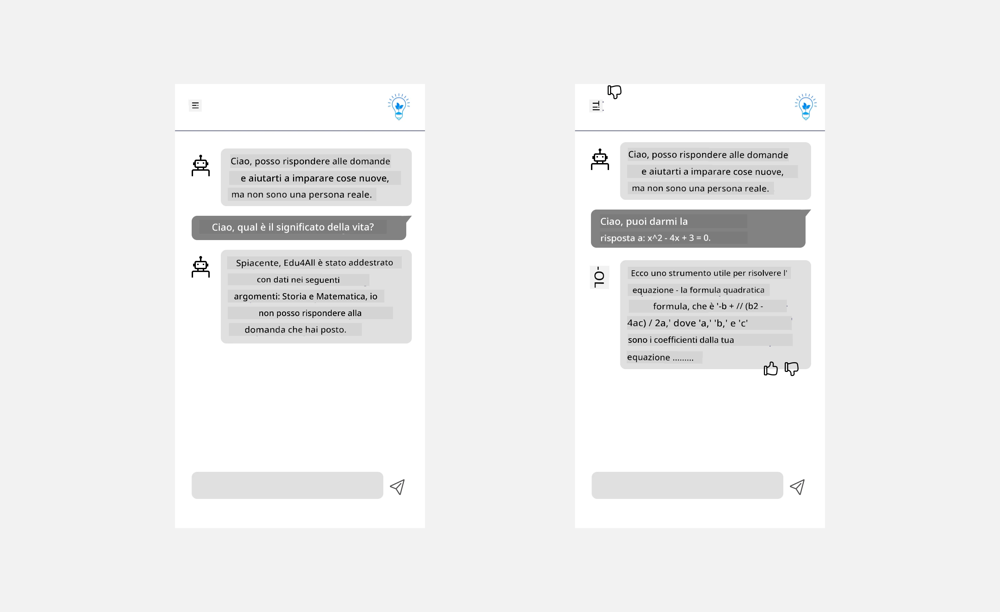

# Progettare l'esperienza utente per applicazioni AI

> _(Clicca sull'immagine sopra per vedere il video di questa lezione)_

L'esperienza utente è un aspetto molto importante nella costruzione di app. Gli utenti devono poter usare la tua app in modo efficiente per svolgere le attività. Essere efficienti è una cosa, ma devi anche progettare app che possano essere usate da tutti, rendendole _accessibili_. Questo capitolo si concentrerà su questo aspetto affinché tu possa progettare un'app che le persone possano e vogliano usare.

## Introduzione

L'esperienza utente riguarda come un utente interagisce con e usa un prodotto o servizio specifico, sia esso un sistema, uno strumento o un design. Nello sviluppo di applicazioni AI, gli sviluppatori non si concentrano solo sull'efficacia dell'esperienza utente, ma anche sull'etica. In questa lezione, affrontiamo come costruire applicazioni di Intelligenza Artificiale (AI) che rispondano ai bisogni degli utenti.

La lezione coprirà le seguenti aree:

- Introduzione all'esperienza utente e comprensione dei bisogni degli utenti
- Progettazione di applicazioni AI per fiducia e trasparenza
- Progettazione di applicazioni AI per collaborazione e feedback

## Obiettivi di apprendimento

Dopo aver seguito questa lezione, sarai in grado di:

- Capire come costruire applicazioni AI che soddisfano i bisogni degli utenti.
- Progettare applicazioni AI che promuovono fiducia e collaborazione.

### Prerequisito

Prenditi del tempo per leggere di più su [esperienza utente e design thinking.](https://learn.microsoft.com/training/modules/ux-design?WT.mc_id=academic-105485-koreyst)

## Introduzione all'esperienza utente e comprensione dei bisogni degli utenti

Nella nostra startup educativa fittizia, abbiamo due utenti principali, insegnanti e studenti. Ciascuno dei due utenti ha bisogni unici. Un design centrato sull'utente dà priorità all'utente assicurando che i prodotti siano rilevanti e utili per chi sono destinati.

L'applicazione dovrebbe essere **utile, affidabile, accessibile e piacevole** per fornire una buona esperienza utente.

### Usabilità

Essere utile significa che l'applicazione ha funzionalità che corrispondono al suo scopo previsto, come automatizzare il processo di valutazione o generare flashcard per la revisione. Un'applicazione che automatizza il processo di valutazione dovrebbe essere in grado di assegnare punteggi in modo accurato ed efficiente al lavoro degli studenti basandosi su criteri predefiniti. Allo stesso modo, un'applicazione che genera flashcard di revisione dovrebbe essere in grado di creare domande rilevanti e diversificate basate sui suoi dati.

### Affidabilità

Essere affidabile significa che l'applicazione può svolgere il suo compito in modo costante e senza errori. Tuttavia, l'AI, proprio come gli esseri umani, non è perfetta e può essere soggetta a errori. Le applicazioni possono incontrare errori o situazioni inaspettate che richiedono intervento o correzione umana. Come gestisci gli errori? Nell'ultima sezione di questa lezione, affronteremo come i sistemi e le applicazioni AI sono progettati per la collaborazione e il feedback.

### Accessibilità

Essere accessibile significa estendere l'esperienza utente a utenti con varie abilità, inclusi quelli con disabilità, assicurandosi che nessuno resti escluso. Seguendo le linee guida e i principi di accessibilità, le soluzioni AI diventano più inclusive, utilizzabili e vantaggiose per tutti gli utenti.

### Piacevolezza

Essere piacevole significa che l'applicazione è gradevole da usare. Un'esperienza utente attraente può avere un impatto positivo sull'utente, incoraggiandolo a tornare all'applicazione e aumentando le entrate aziendali.

Non tutte le sfide possono essere risolte con l'AI. L'AI serve a migliorare la tua esperienza utente, sia automatizzando compiti manuali, sia personalizzando le esperienze utente.

## Progettare applicazioni AI per fiducia e trasparenza

Costruire fiducia è fondamentale quando si progettano applicazioni AI. La fiducia assicura che l'utente sia sicuro che l'applicazione completerà il lavoro, fornirà risultati costantemente e che i risultati rispondano alle sue necessità. Un rischio in quest'area è la sfiducia e la fiducia eccessiva. La sfiducia si verifica quando un utente ha poca o nessuna fiducia in un sistema AI, il che porta l'utente a rifiutare la tua applicazione. La fiducia eccessiva si verifica quando un utente sopravvaluta la capacità di un sistema AI, portando gli utenti a fidarsi troppo del sistema AI. Per esempio, un sistema di valutazione automatizzato in caso di fiducia eccessiva potrebbe portare l'insegnante a non controllare alcuni compiti per assicurarsi che il sistema di valutazione funzioni bene. Questo potrebbe causare voti ingiusti o inaccurati per gli studenti, o opportunità perse di feedback e miglioramenti.

Due modi per assicurarsi che la fiducia sia posta al centro del design sono spiegabilità e controllo.

### Spiegabilità

Quando l'AI aiuta a prendere decisioni come trasmettere conoscenza alle future generazioni, è fondamentale che insegnanti e genitori capiscano come le decisioni AI vengono prese. Questa è la spiegabilità - comprendere come le applicazioni AI prendono decisioni. Progettare per la spiegabilità include aggiungere dettagli che evidenziano come l'AI è arrivata al risultato. Il pubblico deve essere consapevole che il risultato è generato dall'AI e non da un essere umano. Per esempio, invece di dire "Inizia a chattare con il tuo tutor ora" si dica "Usa il tutor AI che si adatta alle tue esigenze e ti aiuta a imparare al tuo ritmo."

Un altro esempio è come l'AI utilizza i dati personali e dell'utente. Per esempio, un utente con la persona studente può avere limitazioni basate sulla sua persona. L'AI potrebbe non essere in grado di rivelare le risposte alle domande, ma potrebbe aiutare a guidare l'utente a riflettere su come poter risolvere un problema.

Un'ultima parte chiave della spiegabilità è la semplificazione delle spiegazioni. Studenti e insegnanti potrebbero non essere esperti di AI, perciò le spiegazioni su cosa l'applicazione può o non può fare devono essere semplificate e facili da capire.

### Controllo

L'AI generativa crea una collaborazione tra AI e utente, dove per esempio un utente può modificare i prompt per ottenere risultati differenti. Inoltre, una volta generato un output, gli utenti dovrebbero poter modificare i risultati, dandogli un senso di controllo. Per esempio, usando Microsoft Copilot (precedentemente Bing Chat), puoi adattare il tuo prompt basandoti su formato, tono e lunghezza. Inoltre, puoi aggiungere modifiche al tuo output e modificarlo come mostrato di seguito:

Un'altra funzionalità in Microsoft Copilot che consente all'utente di avere controllo sull'applicazione è la possibilità di scegliere se fornire o meno i dati che l'AI utilizza. Per un'applicazione scolastica, uno studente potrebbe voler usare le sue note così come le risorse degli insegnanti come materiale di revisione.

> Quando si progettano applicazioni AI, l'intenzionalità è fondamentale per assicurarsi che gli utenti non abbiano troppa fiducia, impostando aspettative irrealistiche delle sue capacità. Un modo per farlo è creare attrito tra i prompt e i risultati, ricordando all'utente che si tratta di AI e non di un altro essere umano.

## Progettare applicazioni AI per collaborazione e feedback

Come accennato prima, l'AI generativa crea una collaborazione tra utente e AI. La maggior parte degli scambi avviene con un utente che immette un prompt e l'AI che genera un output. E se l'output fosse errato? Come gestisce l'applicazione gli errori se si verificano? L'AI dà la colpa all'utente o prende tempo per spiegare l'errore?

Le applicazioni AI dovrebbero essere costruite per ricevere e fornire feedback. Questo non solo aiuta il sistema AI a migliorare, ma costruisce anche fiducia con gli utenti. Un ciclo di feedback dovrebbe essere incluso nel design, un esempio può essere un semplice pollice in su o in giù sull'output.

Un altro modo per gestire questo è comunicare chiaramente le capacità e le limitazioni del sistema. Quando un utente commette un errore chiedendo qualcosa oltre le capacità dell'AI, dovrebbe anche esserci un modo per gestirlo, come mostrato di seguito.

Gli errori di sistema sono comuni nelle applicazioni dove l'utente potrebbe aver bisogno di assistenza con informazioni fuori dallo scopo dell'AI o l'applicazione può avere un limite su quante domande/argomenti un utente può generare riassunti. Per esempio, un'applicazione AI addestrata con dati su argomenti limitati come Storia e Matematica potrebbe non essere in grado di gestire domande sulla Geografia. Per mitigare questo, il sistema AI può dare una risposta come: "Spiacenti, il nostro prodotto è stato addestrato con dati nei seguenti soggetti....., non posso rispondere alla domanda che hai posto."

Le applicazioni AI non sono perfette, quindi sono destinate a commettere errori. Quando progetti le tue applicazioni, dovresti assicurarti di creare spazio per il feedback degli utenti e per la gestione degli errori in modo semplice e facilmente spiegabile.

## Compito

Prendi qualsiasi app AI che hai costruito finora, considera di implementare i seguenti passi nella tua app:

- **Piacevolezza:** Considera come rendere la tua app più piacevole. Stai aggiungendo spiegazioni ovunque? Incoraggi l'utente a esplorare? Come formuli i tuoi messaggi di errore?

- **Usabilità:** Stai costruendo un'app web. Assicurati che la tua app sia navigabile sia con il mouse che con la tastiera.

- **Fiducia e trasparenza:** Non fidarti completamente dell'AI e del suo output, considera come aggiungere un umano al processo per verificare il risultato. Inoltre, considera e implementa altri modi per ottenere fiducia e trasparenza.

- **Controllo:** Dai all'utente il controllo sui dati che fornisce all'applicazione. Implementa un modo in cui un utente può scegliere di partecipare o meno alla raccolta dati nell'app AI.

<!-- ## [Post-lecture quiz](../../../12-designing-ux-for-ai-applications/quiz-url) -->

## Continua il tuo apprendimento!

Dopo aver completato questa lezione, dai un'occhiata alla nostra [collezione di apprendimento AI generativa](https://aka.ms/genai-collection?WT.mc_id=academic-105485-koreyst) per continuare a migliorare la tua conoscenza sull'AI generativa!

Vai alla Lezione 13, dove vedremo come [proteggere le applicazioni AI](../13-securing-ai-applications/README.md?WT.mc_id=academic-105485-koreyst)!

---

<!-- CO-OP TRANSLATOR DISCLAIMER START -->
**Disclaimer**:
Questo documento è stato tradotto utilizzando il servizio di traduzione AI [Co-op Translator](https://github.com/Azure/co-op-translator). Sebbene ci impegniamo per garantire la precisione, si prega di notare che le traduzioni automatizzate possono contenere errori o imprecisioni. Il documento originale nella sua lingua nativa deve essere considerato la fonte autorevole. Per informazioni critiche, si raccomanda una traduzione professionale effettuata da un essere umano. Non siamo responsabili per eventuali malintesi o interpretazioni errate derivanti dall’uso di questa traduzione.
<!-- CO-OP TRANSLATOR DISCLAIMER END -->