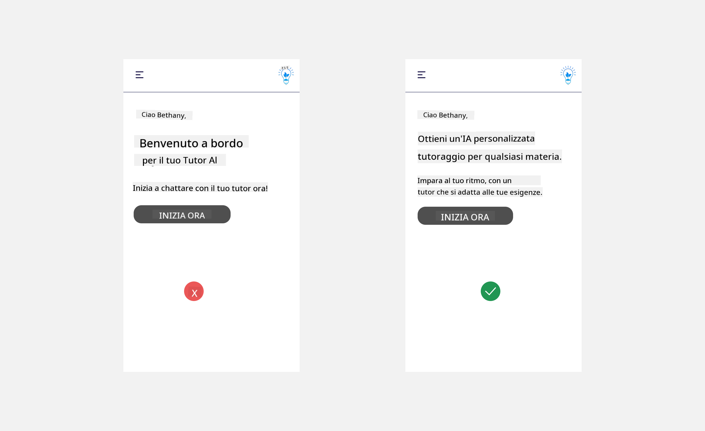
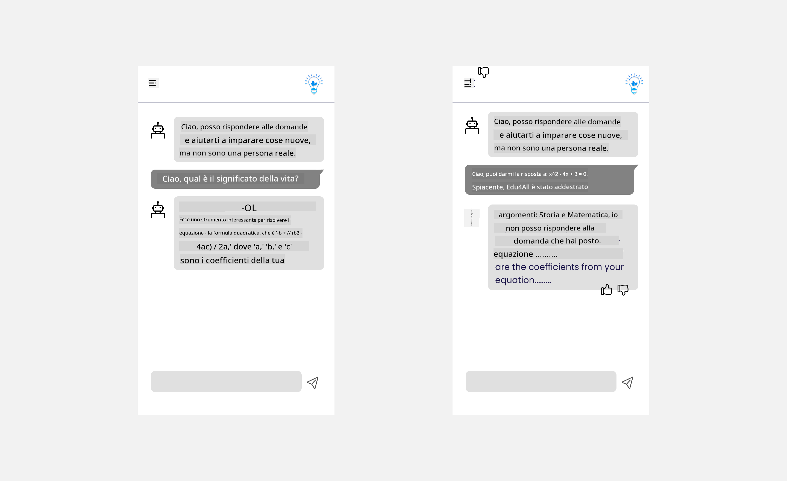

<!--
CO_OP_TRANSLATOR_METADATA:
{
  "original_hash": "747668e4c53d067369f06e9ec2e6313e",
  "translation_date": "2025-08-26T16:37:29+00:00",
  "source_file": "12-designing-ux-for-ai-applications/README.md",
  "language_code": "it"
}
-->
# Progettare l’UX per Applicazioni AI

> _(Clicca sull’immagine qui sopra per vedere il video della lezione)_

L’esperienza utente è un aspetto fondamentale nella creazione di app. Gli utenti devono poter utilizzare la tua app in modo efficiente per svolgere le attività. Essere efficienti è importante, ma bisogna anche progettare le app affinché siano utilizzabili da tutti, rendendole _accessibili_. Questo capitolo si concentra su questo tema, così potrai progettare un’app che le persone possono e vogliono usare.

## Introduzione

L’esperienza utente riguarda il modo in cui una persona interagisce e utilizza un prodotto o servizio, che sia un sistema, uno strumento o un design. Quando si sviluppano applicazioni AI, gli sviluppatori non si concentrano solo sull’efficacia dell’esperienza utente, ma anche sull’etica. In questa lezione vediamo come costruire applicazioni di Intelligenza Artificiale (AI) che rispondano alle esigenze degli utenti.

La lezione copre i seguenti argomenti:

- Introduzione all’Esperienza Utente e comprensione delle esigenze degli utenti
- Progettare applicazioni AI per la fiducia e la trasparenza
- Progettare applicazioni AI per la collaborazione e il feedback

## Obiettivi di apprendimento

Dopo questa lezione, sarai in grado di:

- Comprendere come costruire applicazioni AI che rispondano alle esigenze degli utenti.
- Progettare applicazioni AI che favoriscano fiducia e collaborazione.

### Prerequisiti

Dedica un po’ di tempo a leggere di più su [user experience e design thinking.](https://learn.microsoft.com/training/modules/ux-design?WT.mc_id=academic-105485-koreyst)

## Introduzione all’Esperienza Utente e comprensione delle esigenze degli utenti

Nella nostra startup educativa fittizia, abbiamo due utenti principali: insegnanti e studenti. Ognuno di loro ha esigenze specifiche. Un design centrato sull’utente mette al primo posto l’utente, assicurando che i prodotti siano pertinenti e utili per chi li utilizza.

L’applicazione dovrebbe essere **utile, affidabile, accessibile e piacevole** per offrire una buona esperienza utente.

### Usabilità

Essere utile significa che l’applicazione ha funzionalità che corrispondono allo scopo previsto, come automatizzare la correzione dei compiti o generare flashcard per il ripasso. Un’app che automatizza la correzione dovrebbe assegnare i punteggi in modo accurato ed efficiente, seguendo criteri predefiniti. Allo stesso modo, un’app che genera flashcard per il ripasso dovrebbe creare domande pertinenti e varie in base ai dati disponibili.

### Affidabilità

Essere affidabile significa che l’applicazione svolge il suo compito in modo costante e senza errori. Tuttavia, l’AI, come gli esseri umani, non è perfetta e può commettere errori. Le applicazioni possono incontrare errori o situazioni impreviste che richiedono l’intervento umano o una correzione. Come gestire gli errori? Nell’ultima parte di questa lezione vedremo come progettare sistemi AI e applicazioni per la collaborazione e il feedback.

### Accessibilità

Essere accessibile significa estendere l’esperienza utente a persone con diverse abilità, incluse quelle con disabilità, assicurando che nessuno venga escluso. Seguendo le linee guida e i principi di accessibilità, le soluzioni AI diventano più inclusive, utilizzabili e vantaggiose per tutti.

### Piacevolezza

Essere piacevole significa che l’applicazione è gradevole da usare. Un’esperienza utente coinvolgente può avere un impatto positivo sull’utente, invogliandolo a tornare sull’app e aumentando i ricavi.

Non tutte le sfide si risolvono con l’AI. L’AI serve ad arricchire l’esperienza utente, ad esempio automatizzando compiti manuali o personalizzando le esperienze.

## Progettare applicazioni AI per la fiducia e la trasparenza

Costruire fiducia è fondamentale quando si progettano applicazioni AI. La fiducia fa sì che l’utente sia sicuro che l’app svolgerà il lavoro, fornirà risultati costanti e che questi risultati siano quelli di cui ha bisogno. In questo ambito, il rischio è la sfiducia o l’eccessiva fiducia. La sfiducia si verifica quando l’utente ha poca o nessuna fiducia nel sistema AI, portandolo a rifiutare l’applicazione. L’eccessiva fiducia si verifica quando l’utente sopravvaluta le capacità dell’AI, affidandosi troppo al sistema. Ad esempio, un sistema di correzione automatica, se usato con troppa fiducia, potrebbe portare l’insegnante a non controllare alcuni compiti, rischiando valutazioni ingiuste o errori, oppure perdendo occasioni di feedback e miglioramento.

Due modi per mettere la fiducia al centro del design sono la spiegabilità e il controllo.

### Spiegabilità

Quando l’AI aiuta a prendere decisioni, come trasmettere conoscenze alle nuove generazioni, è fondamentale che insegnanti e genitori capiscano come vengono prese le decisioni dall’AI. Questo è il concetto di spiegabilità: comprendere come le applicazioni AI prendono decisioni. Progettare per la spiegabilità significa aggiungere dettagli che evidenziano come l’AI ha prodotto un certo risultato. Il pubblico deve sapere che il risultato è generato dall’AI e non da una persona. Ad esempio, invece di dire "Inizia a chattare con il tuo tutor ora", si può dire "Usa il tutor AI che si adatta alle tue esigenze e ti aiuta a imparare al tuo ritmo."

Un altro esempio riguarda l’uso dei dati personali da parte dell’AI. Ad esempio, uno studente potrebbe avere delle limitazioni in base al suo profilo. L’AI potrebbe non poter fornire direttamente le risposte, ma può guidare l’utente a ragionare su come risolvere un problema.

Un ultimo aspetto importante della spiegabilità è la semplificazione delle spiegazioni. Studenti e insegnanti potrebbero non essere esperti di AI, quindi le spiegazioni su cosa l’app può o non può fare devono essere semplici e comprensibili.

### Controllo

L’AI generativa crea una collaborazione tra AI e utente, dove ad esempio l’utente può modificare i prompt per ottenere risultati diversi. Inoltre, una volta generato un risultato, l’utente dovrebbe poterlo modificare, sentendosi così più coinvolto. Ad esempio, usando Bing, puoi personalizzare il prompt in base al formato, al tono e alla lunghezza. Puoi anche modificare il risultato come mostrato qui sotto:

Un’altra funzione di Bing che permette all’utente di avere controllo sull’applicazione è la possibilità di scegliere se condividere o meno i dati con l’AI. In un’app scolastica, uno studente potrebbe voler usare i propri appunti e le risorse dell’insegnante come materiale di ripasso.

> Quando si progettano applicazioni AI, è importante essere intenzionali per evitare che gli utenti si fidino troppo e abbiano aspettative irrealistiche sulle capacità dell’AI. Un modo per farlo è creare un po’ di “attrito” tra i prompt e i risultati, ricordando all’utente che si tratta di AI e non di una persona.

## Progettare applicazioni AI per la collaborazione e il feedback

Come accennato prima, l’AI generativa crea una collaborazione tra utente e AI. Nella maggior parte dei casi, l’utente inserisce un prompt e l’AI genera un risultato. Ma cosa succede se il risultato è sbagliato? Come gestisce l’applicazione gli errori? L’AI dà la colpa all’utente o si prende il tempo di spiegare l’errore?

Le applicazioni AI dovrebbero essere progettate per ricevere e fornire feedback. Questo aiuta non solo il sistema AI a migliorare, ma anche a costruire fiducia con gli utenti. Nel design dovrebbe essere previsto un ciclo di feedback, ad esempio con un semplice pollice su o giù sul risultato.

Un altro modo per gestire questa situazione è comunicare chiaramente le capacità e i limiti del sistema. Se l’utente commette un errore chiedendo qualcosa che va oltre le capacità dell’AI, ci dovrebbe essere un modo per gestirlo, come mostrato qui sotto.

Gli errori di sistema sono comuni nelle applicazioni, ad esempio quando l’utente ha bisogno di informazioni che l’AI non può fornire, oppure l’app ha un limite sul numero di domande o argomenti per cui può generare riassunti. Ad esempio, un’app AI addestrata solo su Storia e Matematica potrebbe non essere in grado di rispondere a domande di Geografia. Per gestire questa situazione, il sistema AI può rispondere: "Spiacente, il nostro prodotto è stato addestrato con dati sui seguenti argomenti..., non posso rispondere alla domanda che hai posto."

Le applicazioni AI non sono perfette, quindi possono commettere errori. Quando progetti le tue applicazioni, assicurati di prevedere la possibilità di ricevere feedback dagli utenti e di gestire gli errori in modo semplice e comprensibile.

## Compito

Prendi una delle app AI che hai già creato e prova a implementare i seguenti passaggi:

- **Piacevolezza:** Pensa a come rendere la tua app più piacevole. Stai aggiungendo spiegazioni ovunque? Invogli l’utente a esplorare? Come scrivi i messaggi di errore?

- **Usabilità:** Se stai creando una web app, assicurati che sia navigabile sia con il mouse che con la tastiera.

- **Fiducia e trasparenza:** Non fidarti ciecamente dell’AI e dei suoi risultati, pensa a come potresti coinvolgere una persona per verificare i risultati. Considera e implementa altri modi per ottenere fiducia e trasparenza.

- **Controllo:** Dai all’utente il controllo sui dati che fornisce all’applicazione. Implementa un modo per permettere all’utente di scegliere se partecipare o meno alla raccolta dati nell’app AI.

## Continua a imparare!

Dopo aver completato questa lezione, dai un’occhiata alla nostra [raccolta di risorse su Generative AI](https://aka.ms/genai-collection?WT.mc_id=academic-105485-koreyst) per continuare a migliorare le tue competenze!

Vai alla Lezione 13, dove vedremo come [proteggere le applicazioni AI](../13-securing-ai-applications/README.md?WT.mc_id=academic-105485-koreyst)!

---

**Disclaimer**:  
Questo documento è stato tradotto utilizzando il servizio di traduzione AI [Co-op Translator](https://github.com/Azure/co-op-translator). Pur impegnandoci per garantire l’accuratezza, si prega di notare che le traduzioni automatiche possono contenere errori o imprecisioni. Il documento originale nella sua lingua nativa deve essere considerato la fonte autorevole. Per informazioni critiche, si raccomanda una traduzione professionale umana. Non siamo responsabili per eventuali fraintendimenti o interpretazioni errate derivanti dall’uso di questa traduzione.