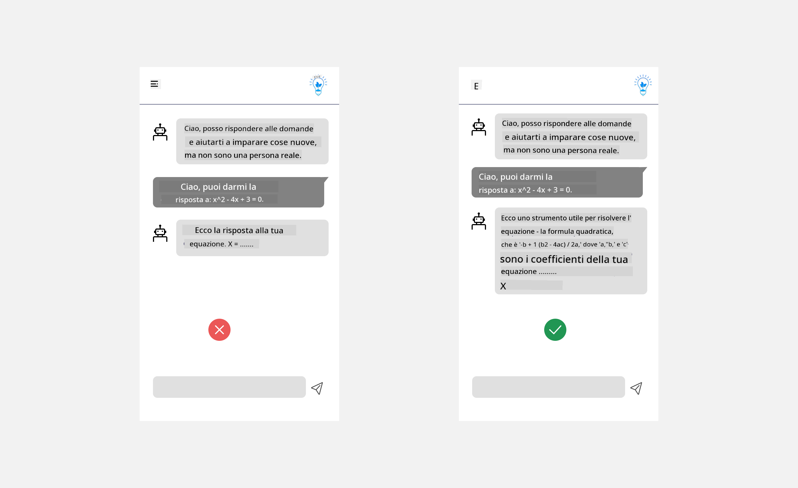
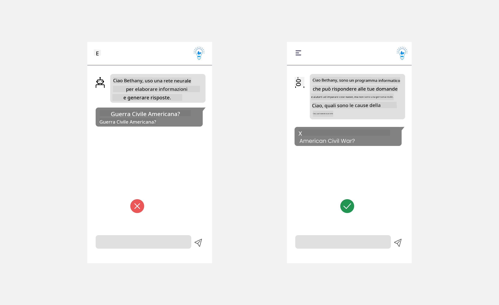

<!--
CO_OP_TRANSLATOR_METADATA:
{
  "original_hash": "78bbeed50fd4dc9fdee931f5daf98cb3",
  "translation_date": "2025-10-17T16:06:09+00:00",
  "source_file": "12-designing-ux-for-ai-applications/README.md",
  "language_code": "it"
}
-->
# Progettare l'UX per le applicazioni AI

> _(Clicca sull'immagine sopra per vedere il video di questa lezione)_

L'esperienza utente è un aspetto molto importante nella creazione di app. Gli utenti devono essere in grado di utilizzare la tua app in modo efficiente per svolgere le attività. Essere efficienti è una cosa, ma è anche necessario progettare app che possano essere utilizzate da tutti, rendendole _accessibili_. Questo capitolo si concentrerà su quest'area, con l'obiettivo di aiutarti a progettare un'app che le persone possano e vogliano utilizzare.

## Introduzione

L'esperienza utente riguarda il modo in cui un utente interagisce con e utilizza un prodotto o servizio specifico, che si tratti di un sistema, uno strumento o un design. Quando si sviluppano applicazioni AI, gli sviluppatori non si concentrano solo sull'efficacia dell'esperienza utente, ma anche sull'etica. In questa lezione, esploreremo come costruire applicazioni di Intelligenza Artificiale (AI) che rispondano alle esigenze degli utenti.

La lezione coprirà i seguenti argomenti:

- Introduzione all'esperienza utente e comprensione delle esigenze degli utenti
- Progettare applicazioni AI per fiducia e trasparenza
- Progettare applicazioni AI per collaborazione e feedback

## Obiettivi di apprendimento

Dopo aver seguito questa lezione, sarai in grado di:

- Comprendere come costruire applicazioni AI che soddisfino le esigenze degli utenti.
- Progettare applicazioni AI che promuovano fiducia e collaborazione.

### Prerequisiti

Dedica un po' di tempo a leggere di più su [esperienza utente e design thinking.](https://learn.microsoft.com/training/modules/ux-design?WT.mc_id=academic-105485-koreyst)

## Introduzione all'esperienza utente e comprensione delle esigenze degli utenti

Nel nostro ipotetico startup educativo, abbiamo due utenti principali: insegnanti e studenti. Ognuno di questi due utenti ha esigenze uniche. Un design centrato sull'utente dà priorità all'utente, garantendo che i prodotti siano rilevanti e utili per coloro a cui sono destinati.

L'applicazione dovrebbe essere **utile, affidabile, accessibile e piacevole** per fornire una buona esperienza utente.

### Usabilità

Essere utile significa che l'applicazione ha funzionalità che corrispondono al suo scopo previsto, come automatizzare il processo di valutazione o generare flashcard per la revisione. Un'applicazione che automatizza il processo di valutazione dovrebbe essere in grado di assegnare punteggi in modo accurato ed efficiente ai lavori degli studenti in base a criteri predefiniti. Allo stesso modo, un'applicazione che genera flashcard per la revisione dovrebbe essere in grado di creare domande pertinenti e diversificate basate sui suoi dati.

### Affidabilità

Essere affidabile significa che l'applicazione può svolgere il suo compito in modo coerente e senza errori. Tuttavia, l'AI, proprio come gli esseri umani, non è perfetta e può essere soggetta a errori. Le applicazioni possono incontrare errori o situazioni impreviste che richiedono interventi o correzioni umane. Come gestire gli errori? Nell'ultima sezione di questa lezione, tratteremo come i sistemi e le applicazioni AI sono progettati per la collaborazione e il feedback.

### Accessibilità

Essere accessibile significa estendere l'esperienza utente a utenti con diverse abilità, inclusi coloro che hanno disabilità, garantendo che nessuno venga escluso. Seguendo le linee guida e i principi di accessibilità, le soluzioni AI diventano più inclusive, utilizzabili e utili per tutti gli utenti.

### Piacevolezza

Essere piacevole significa che l'applicazione è piacevole da usare. Un'esperienza utente accattivante può avere un impatto positivo sull'utente, incoraggiandolo a tornare all'applicazione e aumentando i ricavi aziendali.

Non tutte le sfide possono essere risolte con l'AI. L'AI entra in gioco per migliorare l'esperienza utente, sia automatizzando compiti manuali che personalizzando le esperienze degli utenti.

## Progettare applicazioni AI per fiducia e trasparenza

Costruire fiducia è fondamentale quando si progettano applicazioni AI. La fiducia garantisce che un utente sia sicuro che l'applicazione svolgerà il lavoro, fornirà risultati coerenti e che i risultati siano ciò di cui l'utente ha bisogno. Un rischio in quest'area è la mancanza di fiducia o l'eccessiva fiducia. La mancanza di fiducia si verifica quando un utente ha poca o nessuna fiducia in un sistema AI, portandolo a rifiutare la tua applicazione. L'eccessiva fiducia si verifica quando un utente sovrastima le capacità di un sistema AI, portandolo a fidarsi troppo del sistema AI. Ad esempio, un sistema di valutazione automatizzato, nel caso di eccessiva fiducia, potrebbe portare l'insegnante a non controllare alcuni dei compiti per assicurarsi che il sistema di valutazione funzioni correttamente. Questo potrebbe risultare in voti ingiusti o inaccurati per gli studenti, o in opportunità mancate di feedback e miglioramento.

Due modi per garantire che la fiducia sia al centro del design sono la spiegabilità e il controllo.

### Spiegabilità

Quando l'AI aiuta a informare decisioni come impartire conoscenze alle generazioni future, è fondamentale per insegnanti e genitori comprendere come vengono prese le decisioni dell'AI. Questa è la spiegabilità: capire come le applicazioni AI prendono decisioni. Progettare per la spiegabilità include l'aggiunta di dettagli che evidenziano come l'AI è arrivata al risultato. Il pubblico deve essere consapevole che il risultato è generato dall'AI e non da un essere umano. Ad esempio, invece di dire "Inizia a chattare con il tuo tutor ora", dire "Usa il tutor AI che si adatta alle tue esigenze e ti aiuta a imparare al tuo ritmo."

Un altro esempio è come l'AI utilizza i dati degli utenti e personali. Ad esempio, un utente con il persona "studente" potrebbe avere limitazioni basate sul suo persona. L'AI potrebbe non essere in grado di rivelare risposte alle domande, ma potrebbe aiutare a guidare l'utente a riflettere su come risolvere un problema.

Un ultimo elemento chiave della spiegabilità è la semplificazione delle spiegazioni. Studenti e insegnanti potrebbero non essere esperti di AI, quindi le spiegazioni su ciò che l'applicazione può o non può fare dovrebbero essere semplificate e facili da comprendere.

### Controllo

L'AI generativa crea una collaborazione tra l'AI e l'utente, dove ad esempio un utente può modificare i prompt per ottenere risultati diversi. Inoltre, una volta generato un output, gli utenti dovrebbero essere in grado di modificarlo, dando loro un senso di controllo. Ad esempio, utilizzando Bing, puoi personalizzare il tuo prompt in base al formato, al tono e alla lunghezza. Inoltre, puoi apportare modifiche al tuo output e modificarlo come mostrato di seguito:

Un'altra funzione di Bing che consente a un utente di avere il controllo sull'applicazione è la possibilità di scegliere se partecipare o meno ai dati utilizzati dall'AI. Per un'applicazione scolastica, uno studente potrebbe voler utilizzare i propri appunti così come le risorse dell'insegnante come materiale di revisione.

> Quando si progettano applicazioni AI, l'intenzionalità è fondamentale per garantire che gli utenti non abbiano un'eccessiva fiducia, creando aspettative irrealistiche sulle sue capacità. Un modo per farlo è creare attrito tra i prompt e i risultati, ricordando all'utente che si tratta di AI e non di un essere umano.

## Progettare applicazioni AI per collaborazione e feedback

Come accennato in precedenza, l'AI generativa crea una collaborazione tra l'utente e l'AI. La maggior parte delle interazioni avviene con un utente che inserisce un prompt e l'AI che genera un output. E se l'output fosse errato? Come gestisce l'applicazione gli errori se si verificano? L'AI incolpa l'utente o si prende il tempo per spiegare l'errore?

Le applicazioni AI dovrebbero essere progettate per ricevere e fornire feedback. Questo non solo aiuta il sistema AI a migliorare, ma costruisce anche fiducia con gli utenti. Un ciclo di feedback dovrebbe essere incluso nel design, un esempio può essere un semplice pollice in su o in giù sull'output.

Un altro modo per gestire questo è comunicare chiaramente le capacità e i limiti del sistema. Quando un utente commette un errore richiedendo qualcosa al di là delle capacità dell'AI, dovrebbe esserci anche un modo per gestire questo, come mostrato di seguito.

Gli errori di sistema sono comuni nelle applicazioni, dove l'utente potrebbe aver bisogno di assistenza con informazioni al di fuori dell'ambito dell'AI o l'applicazione potrebbe avere un limite sul numero di domande/soggetti per cui un utente può generare riassunti. Ad esempio, un'applicazione AI addestrata con dati su soggetti limitati, come Storia e Matematica, potrebbe non essere in grado di gestire domande su Geografia. Per mitigare questo, il sistema AI potrebbe rispondere con: "Mi dispiace, il nostro prodotto è stato addestrato con dati sui seguenti soggetti....., non posso rispondere alla domanda che hai posto."

Le applicazioni AI non sono perfette, quindi sono destinate a commettere errori. Quando progetti le tue applicazioni, dovresti assicurarti di creare spazio per il feedback degli utenti e la gestione degli errori in modo semplice e facilmente comprensibile.

## Compito

Prendi qualsiasi app AI che hai costruito finora e considera di implementare i seguenti passaggi nella tua app:

- **Piacevolezza:** Considera come puoi rendere la tua app più piacevole. Stai aggiungendo spiegazioni ovunque? Stai incoraggiando l'utente a esplorare? Come stai formulando i tuoi messaggi di errore?

- **Usabilità:** Stai costruendo un'app web. Assicurati che la tua app sia navigabile sia con il mouse che con la tastiera.

- **Fiducia e trasparenza:** Non fidarti completamente dell'AI e del suo output, considera come potresti aggiungere un intervento umano per verificare l'output. Inoltre, considera e implementa altri modi per raggiungere fiducia e trasparenza.

- **Controllo:** Dai all'utente il controllo sui dati che fornisce all'applicazione. Implementa un modo per consentire all'utente di scegliere se partecipare o meno alla raccolta dei dati nell'applicazione AI.

<!-- ## [Quiz post-lezione](../../../12-designing-ux-for-ai-applications/quiz-url) -->

## Continua a imparare!

Dopo aver completato questa lezione, dai un'occhiata alla nostra [collezione di apprendimento sull'AI generativa](https://aka.ms/genai-collection?WT.mc_id=academic-105485-koreyst) per continuare a migliorare le tue conoscenze sull'AI generativa!

Vai alla Lezione 13, dove esamineremo come [proteggere le applicazioni AI](../13-securing-ai-applications/README.md?WT.mc_id=academic-105485-koreyst)!

---

**Disclaimer**:  
Questo documento è stato tradotto utilizzando il servizio di traduzione AI [Co-op Translator](https://github.com/Azure/co-op-translator). Sebbene ci impegniamo per garantire l'accuratezza, si prega di notare che le traduzioni automatiche possono contenere errori o imprecisioni. Il documento originale nella sua lingua nativa dovrebbe essere considerato la fonte autorevole. Per informazioni critiche, si raccomanda una traduzione professionale umana. Non siamo responsabili per eventuali incomprensioni o interpretazioni errate derivanti dall'uso di questa traduzione.