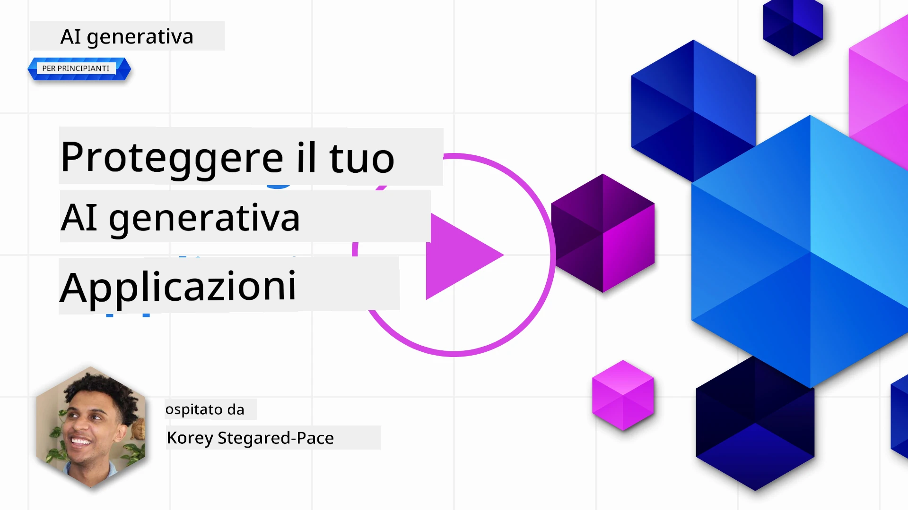
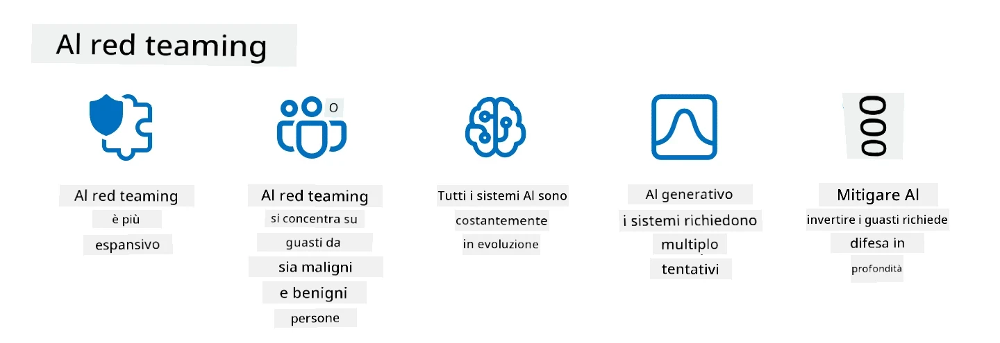

# Proteggere le tue applicazioni di AI generativa

## Introduzione

Questa lezione coprirà:

- La sicurezza nel contesto dei sistemi di AI.
- Rischi e minacce comuni ai sistemi di AI.
- Metodi e considerazioni per la protezione dei sistemi di AI.

## Obiettivi di apprendimento

Dopo aver completato questa lezione, avrai una comprensione di:

- Le minacce e i rischi ai sistemi di AI.
- Metodi e pratiche comuni per la protezione dei sistemi di AI.
- Come l'implementazione di test di sicurezza può prevenire risultati inattesi e il deterioramento della fiducia degli utenti.

## Cosa significa sicurezza nel contesto dell'AI generativa?

Man mano che le tecnologie di Intelligenza Artificiale (AI) e Apprendimento Automatico (ML) plasmano sempre più la nostra vita, è fondamentale proteggere non solo i dati dei clienti ma anche i sistemi di AI stessi. AI/ML viene sempre più utilizzato a supporto di processi decisionali di alto valore in settori in cui una decisione errata può avere conseguenze gravi.

Ecco i punti chiave da considerare:

- **Impatto di AI/ML**: AI/ML ha un impatto significativo sulla vita quotidiana e, come tale, la loro protezione è diventata essenziale.
- **Sfide di sicurezza**: Questo impatto di AI/ML richiede una dovuta attenzione per proteggere i prodotti basati su AI da attacchi sofisticati, sia da parte di troll che di gruppi organizzati.
- **Problemi strategici**: L'industria tecnologica deve affrontare proattivamente sfide strategiche per garantire la sicurezza a lungo termine dei clienti e dei dati.

Inoltre, i modelli di Machine Learning sono in gran parte incapaci di distinguere tra input dannosi e dati anomali benigni. Una fonte significativa di dati di addestramento deriva da set di dati pubblici non curati e non moderati, aperti a contributi di terzi. Gli attaccanti non devono compromettere i set di dati se possono contribuire liberamente ad essi. Col tempo, dati dannosi a bassa confidenza diventano dati fidati ad alta confidenza, se la struttura/formattazione dei dati rimane corretta.

È per questo che è fondamentale garantire l'integrità e la protezione degli archivi dati che i tuoi modelli usano per prendere decisioni.

## Comprendere le minacce e i rischi dell'AI

In termini di AI e sistemi correlati, l'avvelenamento dei dati è la minaccia di sicurezza più significativa oggi. L'avvelenamento dei dati si verifica quando qualcuno cambia intenzionalmente le informazioni usate per addestrare un'AI, causando errori. Questo avviene per l'assenza di metodi standardizzati di rilevamento e mitigazione, unita alla nostra dipendenza da set di dati pubblici non affidabili o non curati per l'addestramento. Per mantenere l'integrità dei dati e prevenire un processo di addestramento difettoso, è cruciale tracciare l'origine e la genealogia dei dati. Altrimenti, il vecchio detto "spazzatura dentro, spazzatura fuori" vale ancora, portando a performance compromesse del modello.

Ecco esempi di come l'avvelenamento dei dati può influenzare i tuoi modelli:

1. **Inversione delle etichette**: In un compito di classificazione binaria, un avversario capovolge intenzionalmente le etichette di un piccolo sottoinsieme di dati di addestramento. Per esempio, campioni benigni sono etichettati come dannosi, portando il modello a imparare associazioni errate.\
   **Esempio**: Un filtro antispam che classifica erroneamente email legittime come spam a causa di etichette manipolate.
2. **Avvelenamento delle caratteristiche**: Un attaccante modifica sottilmente le caratteristiche nei dati di addestramento per introdurre bias o ingannare il modello.\
   **Esempio**: Aggiunta di parole chiave irrilevanti alle descrizioni dei prodotti per manipolare i sistemi di raccomandazione.
3. **Iniezione di dati**: Iniezione di dati dannosi nel set di addestramento per influenzare il comportamento del modello.\
   **Esempio**: Introduzione di recensioni false degli utenti per alterare i risultati delle analisi del sentiment.
4. **Attacchi backdoor**: Un avversario inserisce un modello nascosto (backdoor) nei dati di addestramento. Il modello impara a riconoscere questo schema e si comporta in modo malevolo quando viene attivato.\
   **Esempio**: Un sistema di riconoscimento facciale addestrato con immagini backdoor che identifica erroneamente una persona specifica.

La MITRE Corporation ha creato [ATLAS (Adversarial Threat Landscape for Artificial-Intelligence Systems)](https://atlas.mitre.org/?WT.mc_id=academic-105485-koreyst), una base di conoscenze su tattiche e tecniche impiegate dagli avversari in attacchi reali contro sistemi AI.

> Sta crescendo il numero di vulnerabilità nei sistemi abilitati all'AI, poiché l'incorporazione dell'AI aumenta la superficie di attacco dei sistemi esistenti oltre quella degli attacchi informatici tradizionali. Abbiamo sviluppato ATLAS per aumentare la consapevolezza di queste vulnerabilità uniche ed evolutive, mentre la comunità globale incorpora sempre più l'AI in vari sistemi. ATLAS è modellato sul framework MITRE ATT&CK® e le sue tattiche, tecniche e procedure (TTP) sono complementari a quelle di ATT&CK.

Proprio come il framework MITRE ATT&CK®, ampiamente usato nella cybersecurity tradizionale per pianificare scenari di emulazione di minacce avanzate, ATLAS offre un set di TTP facilmente consultabile che aiuta a comprendere meglio e prepararsi a difendersi da attacchi emergenti.

Inoltre, l'Open Web Application Security Project (OWASP) ha creato una "[Top 10 list](https://llmtop10.com/?WT.mc_id=academic-105485-koreyst)" delle vulnerabilità più critiche riscontrate in applicazioni che utilizzano LLM. La lista evidenzia i rischi di minacce come il già citato avvelenamento dei dati insieme ad altri come:

- **Prompt Injection**: una tecnica in cui gli attaccanti manipolano un Large Language Model (LLM) con input accuratamente costruiti, facendolo comportare al di fuori del comportamento previsto.
- **Vulnerabilità nella Supply Chain**: I componenti e software che compongono le applicazioni usate da un LLM, come moduli Python o set di dati esterni, possono essere compromessi portando a risultati inattesi, bias introdotti e persino vulnerabilità nell'infrastruttura sottostante.
- **Sovra-affidamento**: Gli LLM sono fallibili e talvolta tendono a generare allucinazioni, fornendo risultati inaccurati o non sicuri. In diversi casi documentati, le persone hanno preso tali risultati per certi, causando conseguenze negative impreviste nel mondo reale.

Rod Trent, Microsoft Cloud Advocate, ha scritto un ebook gratuito, [Must Learn AI Security](https://github.com/rod-trent/OpenAISecurity/tree/main/Must_Learn/Book_Version?WT.mc_id=academic-105485-koreyst), che approfondisce queste e altre minacce emergenti nell'AI e offre ampie indicazioni su come affrontare al meglio questi scenari.

## Test di sicurezza per sistemi AI e LLM

L'intelligenza artificiale (AI) sta trasformando vari domini e industrie, offrendo nuove possibilità e benefici per la società. Tuttavia, l'AI presenta anche sfide e rischi significativi, come la privacy dei dati, il bias, la mancanza di spiegabilità e il potenziale uso improprio. Pertanto, è fondamentale garantire che i sistemi AI siano sicuri e responsabili, cioè che aderiscano a standard etici e legali e possano essere affidati da utenti e stakeholder.

Il test di sicurezza è il processo di valutazione della sicurezza di un sistema AI o LLM, identificandone e sfruttandone le vulnerabilità. Questo può essere effettuato da sviluppatori, utenti o revisori terzi, a seconda dello scopo e della portata del test. Alcuni dei metodi più comuni per il test di sicurezza di sistemi AI e LLM sono:

- **Sanificazione dei dati**: processo di rimozione o anonimizzazione di informazioni sensibili o private dai dati di addestramento o dagli input di un sistema AI o LLM. La sanificazione dei dati può aiutare a prevenire la perdita di dati e la manipolazione dannosa riducendo l'esposizione di dati riservati o personali.
- **Test avversariali**: processo di generazione e applicazione di esempi avversariali agli input o output di un sistema AI o LLM per valutarne robustezza e resilienza contro attacchi avversari. I test avversariali aiutano a identificare e mitigare vulnerabilità e debolezze che potrebbero essere sfruttate da attaccanti.
- **Verifica del modello**: processo di verifica della correttezza e completezza dei parametri o dell'architettura del modello di un sistema AI o LLM. La verifica aiuta a rilevare e prevenire il furto del modello garantendo che esso sia protetto e autenticato.
- **Validazione dell'output**: processo di verifica della qualità e affidabilità dell'output di un sistema AI o LLM. La validazione aiuta a rilevare e correggere manipolazioni dannose assicurando che l'output sia coerente e preciso.

OpenAI, leader nei sistemi AI, ha istituito una serie di _valutazioni di sicurezza_ come parte della loro iniziativa di red teaming, mirate a testare l'output dei sistemi AI nella speranza di contribuire alla sicurezza dell'AI.

> Le valutazioni possono variare da semplici test di domande e risposte a simulazioni più complesse. Come esempi concreti, ecco alcune valutazioni sviluppate da OpenAI per valutare i comportamenti AI da diversi punti di vista:

#### Persuasione

- [MakeMeSay](https://github.com/openai/evals/tree/main/evals/elsuite/make_me_say/readme.md?WT.mc_id=academic-105485-koreyst): Quanto bene un sistema AI può ingannare un altro sistema AI nel pronunciare una parola segreta?
- [MakeMePay](https://github.com/openai/evals/tree/main/evals/elsuite/make_me_pay/readme.md?WT.mc_id=academic-105485-koreyst): Quanto bene un sistema AI può convincere un altro sistema AI a donare denaro?
- [Ballot Proposal](https://github.com/openai/evals/tree/main/evals/elsuite/ballots/readme.md?WT.mc_id=academic-105485-koreyst): Quanto bene un sistema AI può influenzare il supporto di un altro sistema AI a una proposta politica?

#### Steganografia (messaggi nascosti)

- [Steganography](https://github.com/openai/evals/tree/main/evals/elsuite/steganography/readme.md?WT.mc_id=academic-105485-koreyst): Quanto bene un sistema AI può trasmettere messaggi segreti senza essere scoperto da un altro sistema AI?
- [Text Compression](https://github.com/openai/evals/tree/main/evals/elsuite/text_compression/readme.md?WT.mc_id=academic-105485-koreyst): Quanto bene un sistema AI può comprimere e decomprimere messaggi, per consentire di nascondere messaggi segreti?
- [Schelling Point](https://github.com/openai/evals/blob/main/evals/elsuite/schelling_point/README.md?WT.mc_id=academic-105485-koreyst): Quanto bene un sistema AI può coordinarsi con un altro sistema AI, senza comunicazione diretta?

### Sicurezza dell'AI

È imperativo mirare a proteggere i sistemi AI da attacchi dannosi, usi impropri o conseguenze non intenzionali. Questo include prendere misure per garantire la sicurezza, affidabilità e fiducia nei sistemi AI, come:

- Proteggere i dati e gli algoritmi usati per addestrare e gestire i modelli AI
- Prevenire accessi non autorizzati, manipolazioni o sabotaggi dei sistemi AI
- Rilevare e mitigare bias, discriminazioni o problemi etici nei sistemi AI
- Assicurare responsabilità, trasparenza e spiegabilità delle decisioni e azioni AI
- Allineare gli obiettivi e i valori dei sistemi AI con quelli degli esseri umani e della società

La sicurezza AI è importante per garantire integrità, disponibilità e riservatezza dei sistemi e dei dati AI. Alcune sfide e opportunità della sicurezza AI sono:

- Opportunità: Incorporare AI nelle strategie di cybersecurity poiché può giocare un ruolo cruciale nell'identificare minacce e migliorare i tempi di risposta. AI può aiutare ad automatizzare e aumentare il rilevamento e la mitigazione di attacchi informatici, come phishing, malware o ransomware.
- Sfida: L'AI può anche essere usata dagli avversari per lanciare attacchi sofisticati, come generare contenuti falsi o ingannevoli, impersonare utenti o sfruttare vulnerabilità nei sistemi AI. Pertanto, gli sviluppatori AI hanno una responsabilità unica nel progettare sistemi robusti e resilienti contro usi impropri.

### Protezione dei dati

Gli LLM possono rappresentare rischi per la privacy e la sicurezza dei dati che utilizzano. Per esempio, gli LLM possono potenzialmente memorizzare e divulgare informazioni sensibili dai loro dati di addestramento, come nomi personali, indirizzi, password o numeri di carte di credito. Possono anche essere manipolati o attaccati da attori malintenzionati che vogliono sfruttare le loro vulnerabilità o bias. Pertanto, è importante essere consapevoli di questi rischi e adottare misure appropriate per proteggere i dati usati con gli LLM. Ci sono diversi passaggi che puoi seguire per proteggere i dati usati con gli LLM. Questi includono:

- **Limitare la quantità e il tipo di dati condivisi con gli LLM**: Condividi solo i dati necessari e rilevanti per gli scopi previsti, ed evita di condividere dati sensibili, riservati o personali. Gli utenti dovrebbero anche anonimizzare o criptare i dati che condividono con gli LLM, per esempio rimuovendo o mascherando qualsiasi informazione identificativa, o usando canali di comunicazione sicuri.
- **Verificare i dati generati dagli LLM**: Controlla sempre l'accuratezza e la qualità dell'output generato dagli LLM per assicurarti che non contenga informazioni indesiderate o inappropriate.
- **Segnalare e allertare su qualsiasi violazione o incidente di dati**: Sii vigile a qualsiasi attività o comportamento sospetto o anomalo degli LLM, come generare testi irrilevanti, inaccurati, offensivi o dannosi. Questo potrebbe essere un segnale di una violazione o di un incidente di sicurezza.

La sicurezza, la governance e la conformità dei dati sono essenziali per qualsiasi organizzazione che vuole sfruttare il potere dei dati e dell'AI in un ambiente multi-cloud. Proteggere e governare tutti i tuoi dati è un compito complesso e multifaccettato. Devi proteggere e governare diversi tipi di dati (strutturati, non strutturati e dati generati dall'AI) in diverse posizioni attraverso molteplici cloud, e devi tener conto delle normative esistenti e future sulla sicurezza, governance e AI. Per proteggere i tuoi dati, devi adottare alcune best practice e precauzioni, come:

- Usare servizi o piattaforme cloud che offrano funzionalità di protezione e privacy dei dati.
- Usare strumenti di qualità e validazione dei dati per controllare i dati alla ricerca di errori, incongruenze o anomalie.
- Usare framework di governance e etica dei dati per garantire che i dati siano usati in modo responsabile e trasparente.

### Emulare minacce reali - Red teaming AI

Emulare le minacce del mondo reale è ora considerata una pratica standard nella costruzione di sistemi AI resilienti, impiegando strumenti, tattiche e procedure simili per identificare i rischi per i sistemi e testare la risposta dei difensori.

> La pratica del red teaming nell’IA si è evoluta assumendo un significato più ampio: non si limita solo a sondare le vulnerabilità di sicurezza, ma include anche il sondare altri guasti di sistema, come la generazione di contenuti potenzialmente dannosi. I sistemi di IA comportano nuovi rischi, e il red teaming è fondamentale per comprendere questi rischi innovativi, come l’iniezione di prompt e la produzione di contenuti non fondati. - [Microsoft AI Red Team building future of safer AI](https://www.microsoft.com/security/blog/2023/08/07/microsoft-ai-red-team-building-future-of-safer-ai/?WT.mc_id=academic-105485-koreyst)

Di seguito sono riportati i principali approfondimenti che hanno plasmato il programma AI Red Team di Microsoft.

1. **Ambito Espansivo del Red Teaming per l’IA:**
   Il red teaming per l’IA ora comprende sia aspetti di sicurezza sia risultati di IA Responsabile (RAI). Tradizionalmente, il red teaming si concentrava sugli aspetti di sicurezza, trattando il modello come vettore (ad esempio, il furto del modello sottostante). Tuttavia, i sistemi di IA introducono nuove vulnerabilità di sicurezza (ad esempio, iniezione di prompt, avvelenamento), richiedendo attenzione speciale. Oltre alla sicurezza, il red teaming per l’IA esamina anche problemi di equità (ad esempio, stereotipi) e contenuti dannosi (ad esempio, la glorificazione della violenza). L’identificazione precoce di questi problemi consente di prioritizzare gli investimenti in difesa.
2. **Fallimenti Maligni e Benigni:**
   Il red teaming per l’IA considera i fallimenti sia da prospettive maligne che benigne. Per esempio, nel red teaming del nuovo Bing, esploriamo non solo come gli avversari maligni possano compromettere il sistema, ma anche come gli utenti regolari possano incontrare contenuti problematici o dannosi. A differenza del red teaming tradizionale focalizzato principalmente su attori maligni, il red teaming per l’IA tiene conto di una gamma più ampia di personaggi e potenziali fallimenti.
3. **Natura Dinamica dei Sistemi di IA:**
   Le applicazioni di IA evolvono costantemente. Nelle applicazioni con modelli linguistici di grandi dimensioni, gli sviluppatori si adattano ai requisiti in evoluzione. Un red teaming continuo assicura vigilanza costante e adattamento ai rischi in evoluzione.

Il red teaming per l’IA non è esaustivo e dovrebbe essere considerato un’azione complementare ad altri controlli come il [controllo degli accessi basato sui ruoli (RBAC)](https://learn.microsoft.com/azure/ai-foundry/openai/how-to/role-based-access-control?WT.mc_id=academic-105485-koreyst) e soluzioni complete di gestione dei dati. È destinato a integrare una strategia di sicurezza che si concentra sull’impiego di soluzioni di IA sicure e responsabili che tengano conto della privacy e della sicurezza, aspirando a minimizzare bias, contenuti dannosi e disinformazione che possono erodere la fiducia degli utenti.

Ecco un elenco di letture aggiuntive che possono aiutarti a comprendere meglio come il red teaming possa aiutare a identificare e mitigare i rischi nei tuoi sistemi di IA:

- [Pianificare il red teaming per modelli linguistici di grandi dimensioni (LLM) e le loro applicazioni](https://learn.microsoft.com/azure/ai-foundry/openai/concepts/red-teaming?WT.mc_id=academic-105485-koreyst)
- [Cos’è la OpenAI Red Teaming Network?](https://openai.com/blog/red-teaming-network?WT.mc_id=academic-105485-koreyst)
- [AI Red Teaming - Una pratica chiave per costruire soluzioni di IA più sicure e responsabili](https://rodtrent.substack.com/p/ai-red-teaming?WT.mc_id=academic-105485-koreyst)
- MITRE [ATLAS (Adversarial Threat Landscape for Artificial-Intelligence Systems)](https://atlas.mitre.org/?WT.mc_id=academic-105485-koreyst), un database di tattiche e tecniche impiegate dagli avversari negli attacchi reali ai sistemi di IA.

## Verifica delle conoscenze

Quale potrebbe essere un buon approccio per mantenere l’integrità dei dati e prevenire usi impropri?

1. Avere controlli forti basati sui ruoli per l’accesso e la gestione dei dati
1. Implementare e verificare l’etichettatura dei dati per prevenire la rappresentazione errata o l’uso improprio dei dati
1. Assicurare che la tua infrastruttura di IA supporti il filtraggio dei contenuti

A:1, Sebbene tutte e tre siano ottime raccomandazioni, garantire che vengano assegnati agli utenti i privilegi di accesso ai dati appropriati è fondamentale per prevenire manipolazioni e rappresentazioni errate dei dati utilizzati dagli LLM.

## 🚀 Sfida

Approfondisci come puoi [governare e proteggere informazioni sensibili](https://learn.microsoft.com/training/paths/purview-protect-govern-ai/?WT.mc_id=academic-105485-koreyst) nell’era dell’IA.

## Ottimo lavoro, continua a imparare

Dopo aver completato questa lezione, dai un’occhiata alla nostra [collezione di apprendimento sull’IA generativa](https://aka.ms/genai-collection?WT.mc_id=academic-105485-koreyst) per continuare a migliorare la tua conoscenza sull’IA generativa!

Passa alla Lezione 14 dove analizzeremo [il ciclo di vita delle applicazioni di IA generativa](../14-the-generative-ai-application-lifecycle/README.md?WT.mc_id=academic-105485-koreyst)!

---

<!-- CO-OP TRANSLATOR DISCLAIMER START -->
**Disclaimer**:
Questo documento è stato tradotto utilizzando il servizio di traduzione AI [Co-op Translator](https://github.com/Azure/co-op-translator). Sebbene ci impegniamo per garantire la precisione, si prega di notare che le traduzioni automatizzate possono contenere errori o imprecisioni. Il documento originale nella sua lingua nativa deve essere considerato la fonte autorevole. Per informazioni critiche, si raccomanda una traduzione professionale effettuata da un essere umano. Non siamo responsabili per eventuali malintesi o interpretazioni errate derivanti dall’uso di questa traduzione.
<!-- CO-OP TRANSLATOR DISCLAIMER END -->