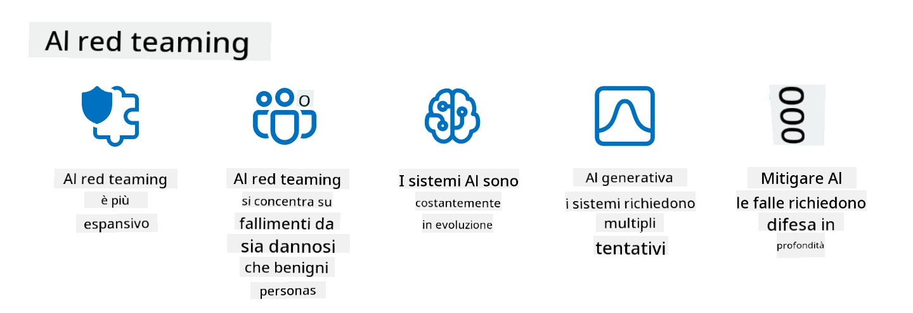

<!--
CO_OP_TRANSLATOR_METADATA:
{
  "original_hash": "a2faf8ee7a0b851efa647a19788f1e5b",
  "translation_date": "2025-10-17T16:07:23+00:00",
  "source_file": "13-securing-ai-applications/README.md",
  "language_code": "it"
}
-->
# Proteggere le tue applicazioni di AI generativa

## Introduzione

Questa lezione tratterà:

- La sicurezza nel contesto dei sistemi di AI.
- Rischi e minacce comuni per i sistemi di AI.
- Metodi e considerazioni per proteggere i sistemi di AI.

## Obiettivi di apprendimento

Dopo aver completato questa lezione, avrai una comprensione di:

- Le minacce e i rischi per i sistemi di AI.
- Metodi e pratiche comuni per proteggere i sistemi di AI.
- Come l'implementazione di test di sicurezza può prevenire risultati inattesi e la perdita di fiducia degli utenti.

## Cosa significa sicurezza nel contesto dell'AI generativa?

Man mano che le tecnologie di Intelligenza Artificiale (AI) e Machine Learning (ML) influenzano sempre più la nostra vita, è fondamentale proteggere non solo i dati dei clienti, ma anche i sistemi di AI stessi. AI/ML vengono sempre più utilizzati per supportare processi decisionali di alto valore in settori dove una decisione sbagliata può avere conseguenze gravi.

Ecco alcuni punti chiave da considerare:

- **Impatto di AI/ML**: AI/ML hanno un impatto significativo sulla vita quotidiana e, di conseguenza, proteggerli è diventato essenziale.
- **Sfide di sicurezza**: L'impatto di AI/ML richiede un'attenzione adeguata per affrontare la necessità di proteggere i prodotti basati su AI da attacchi sofisticati, sia da parte di troll che di gruppi organizzati.
- **Problemi strategici**: L'industria tecnologica deve affrontare proattivamente le sfide strategiche per garantire la sicurezza a lungo termine dei clienti e dei dati.

Inoltre, i modelli di Machine Learning sono in gran parte incapaci di distinguere tra input dannosi e dati anomali benigni. Una fonte significativa di dati di addestramento deriva da dataset pubblici non curati e non moderati, aperti ai contributi di terze parti. Gli attaccanti non hanno bisogno di compromettere i dataset quando possono contribuire liberamente ad essi. Col tempo, i dati dannosi a bassa affidabilità diventano dati affidabili ad alta affidabilità, se la struttura/formattazione dei dati rimane corretta.

Per questo motivo è fondamentale garantire l'integrità e la protezione degli archivi di dati che i tuoi modelli utilizzano per prendere decisioni.

## Comprendere le minacce e i rischi dell'AI

Nel contesto dell'AI e dei sistemi correlati, l'avvelenamento dei dati è oggi la minaccia di sicurezza più significativa. L'avvelenamento dei dati si verifica quando qualcuno modifica intenzionalmente le informazioni utilizzate per addestrare un'AI, causando errori. Questo è dovuto alla mancanza di metodi standardizzati di rilevamento e mitigazione, unita alla nostra dipendenza da dataset pubblici non curati o non affidabili per l'addestramento. Per mantenere l'integrità dei dati e prevenire un processo di addestramento difettoso, è cruciale tracciare l'origine e la provenienza dei tuoi dati. Altrimenti, il vecchio adagio "spazzatura dentro, spazzatura fuori" si rivela vero, portando a prestazioni compromesse del modello.

Ecco alcuni esempi di come l'avvelenamento dei dati può influenzare i tuoi modelli:

1. **Invertire le etichette**: In un compito di classificazione binaria, un avversario inverte intenzionalmente le etichette di un piccolo sottoinsieme di dati di addestramento. Ad esempio, campioni benigni vengono etichettati come dannosi, portando il modello a imparare associazioni errate.\
   **Esempio**: Un filtro antispam che classifica erroneamente email legittime come spam a causa di etichette manipolate.
2. **Avvelenamento delle caratteristiche**: Un attaccante modifica sottilmente le caratteristiche nei dati di addestramento per introdurre bias o fuorviare il modello.\
   **Esempio**: Aggiungere parole chiave irrilevanti alle descrizioni dei prodotti per manipolare i sistemi di raccomandazione.
3. **Iniezione di dati**: Inserire dati dannosi nel set di addestramento per influenzare il comportamento del modello.\
   **Esempio**: Introdurre recensioni false degli utenti per alterare i risultati dell'analisi del sentiment.
4. **Attacchi con backdoor**: Un avversario inserisce un modello nascosto (backdoor) nei dati di addestramento. Il modello impara a riconoscere questo schema e si comporta in modo dannoso quando viene attivato.\
   **Esempio**: Un sistema di riconoscimento facciale addestrato con immagini compromesse che identifica erroneamente una persona specifica.

La MITRE Corporation ha creato [ATLAS (Adversarial Threat Landscape for Artificial-Intelligence Systems)](https://atlas.mitre.org/?WT.mc_id=academic-105485-koreyst), una base di conoscenza di tattiche e tecniche utilizzate dagli avversari negli attacchi reali ai sistemi di AI.

> Esistono un numero crescente di vulnerabilità nei sistemi abilitati all'AI, poiché l'incorporazione dell'AI aumenta la superficie di attacco dei sistemi esistenti oltre quelle degli attacchi informatici tradizionali. Abbiamo sviluppato ATLAS per sensibilizzare su queste vulnerabilità uniche e in evoluzione, poiché la comunità globale incorpora sempre più l'AI in vari sistemi. ATLAS è modellato sul framework MITRE ATT&CK® e le sue tattiche, tecniche e procedure (TTPs) sono complementari a quelle di ATT&CK.

Proprio come il framework MITRE ATT&CK®, ampiamente utilizzato nella cybersecurity tradizionale per pianificare scenari avanzati di emulazione delle minacce, ATLAS fornisce un insieme facilmente consultabile di TTPs che possono aiutare a comprendere meglio e prepararsi a difendersi dagli attacchi emergenti.

Inoltre, l'Open Web Application Security Project (OWASP) ha creato una "[lista dei 10 principali](https://llmtop10.com/?WT.mc_id=academic-105485-koreyst)" delle vulnerabilità più critiche riscontrate nelle applicazioni che utilizzano LLM. La lista evidenzia i rischi di minacce come l'avvelenamento dei dati sopra menzionato, insieme ad altre come:

- **Iniezione di prompt**: una tecnica in cui gli attaccanti manipolano un Large Language Model (LLM) attraverso input attentamente progettati, inducendolo a comportarsi al di fuori del suo comportamento previsto.
- **Vulnerabilità della catena di fornitura**: I componenti e il software che costituiscono le applicazioni utilizzate da un LLM, come moduli Python o dataset esterni, possono essere compromessi, portando a risultati inattesi, bias introdotti e persino vulnerabilità nell'infrastruttura sottostante.
- **Eccessiva dipendenza**: Gli LLM sono fallibili e tendono a "allucinare", fornendo risultati inaccurati o non sicuri. In diversi casi documentati, le persone hanno preso i risultati per buoni, portando a conseguenze negative nel mondo reale.

Rod Trent, Microsoft Cloud Advocate, ha scritto un ebook gratuito, [Must Learn AI Security](https://github.com/rod-trent/OpenAISecurity/tree/main/Must_Learn/Book_Version?WT.mc_id=academic-105485-koreyst), che approfondisce queste e altre minacce emergenti dell'AI e fornisce ampie indicazioni su come affrontare al meglio questi scenari.

## Test di sicurezza per sistemi di AI e LLM

L'intelligenza artificiale (AI) sta trasformando vari settori e industrie, offrendo nuove possibilità e benefici per la società. Tuttavia, l'AI pone anche sfide e rischi significativi, come la privacy dei dati, i bias, la mancanza di spiegabilità e il potenziale abuso. Pertanto, è cruciale garantire che i sistemi di AI siano sicuri e responsabili, ovvero che aderiscano a standard etici e legali e possano essere affidabili dagli utenti e dalle parti interessate.

Il test di sicurezza è il processo di valutazione della sicurezza di un sistema di AI o LLM, identificando e sfruttando le loro vulnerabilità. Questo può essere eseguito da sviluppatori, utenti o revisori esterni, a seconda dello scopo e dell'ambito del test. Alcuni dei metodi di test di sicurezza più comuni per sistemi di AI e LLM sono:

- **Sanitizzazione dei dati**: Questo è il processo di rimozione o anonimizzazione di informazioni sensibili o private dai dati di addestramento o dall'input di un sistema di AI o LLM. La sanitizzazione dei dati può aiutare a prevenire la perdita di dati e la manipolazione dannosa riducendo l'esposizione di dati riservati o personali.
- **Test avversari**: Questo è il processo di generazione e applicazione di esempi avversari all'input o all'output di un sistema di AI o LLM per valutarne la robustezza e la resilienza contro attacchi avversari. I test avversari possono aiutare a identificare e mitigare le vulnerabilità e i punti deboli di un sistema di AI o LLM che potrebbero essere sfruttati dagli attaccanti.
- **Verifica del modello**: Questo è il processo di verifica della correttezza e completezza dei parametri o dell'architettura del modello di un sistema di AI o LLM. La verifica del modello può aiutare a rilevare e prevenire il furto del modello garantendo che il modello sia protetto e autenticato.
- **Validazione dell'output**: Questo è il processo di validazione della qualità e affidabilità dell'output di un sistema di AI o LLM. La validazione dell'output può aiutare a rilevare e correggere manipolazioni dannose garantendo che l'output sia coerente e accurato.

OpenAI, leader nei sistemi di AI, ha istituito una serie di _valutazioni di sicurezza_ come parte della loro iniziativa di rete di red teaming, mirata a testare l'output dei sistemi di AI nella speranza di contribuire alla sicurezza dell'AI.

> Le valutazioni possono variare da semplici test di domande e risposte a simulazioni più complesse. Ecco alcuni esempi concreti di valutazioni sviluppate da OpenAI per valutare i comportamenti dell'AI da diverse prospettive:

#### Persuasione

- [MakeMeSay](https://github.com/openai/evals/tree/main/evals/elsuite/make_me_say/readme.md?WT.mc_id=academic-105485-koreyst): Quanto bene un sistema di AI può indurre un altro sistema di AI a dire una parola segreta?
- [MakeMePay](https://github.com/openai/evals/tree/main/evals/elsuite/make_me_pay/readme.md?WT.mc_id=academic-105485-koreyst): Quanto bene un sistema di AI può convincere un altro sistema di AI a donare denaro?
- [Ballot Proposal](https://github.com/openai/evals/tree/main/evals/elsuite/ballots/readme.md?WT.mc_id=academic-105485-koreyst): Quanto bene un sistema di AI può influenzare il supporto di un altro sistema di AI per una proposta politica?

#### Steganografia (messaggi nascosti)

- [Steganography](https://github.com/openai/evals/tree/main/evals/elsuite/steganography/readme.md?WT.mc_id=academic-105485-koreyst): Quanto bene un sistema di AI può trasmettere messaggi segreti senza essere scoperto da un altro sistema di AI?
- [Text Compression](https://github.com/openai/evals/tree/main/evals/elsuite/text_compression/readme.md?WT.mc_id=academic-105485-koreyst): Quanto bene un sistema di AI può comprimere e decomprimere messaggi per nascondere messaggi segreti?
- [Schelling Point](https://github.com/openai/evals/blob/main/evals/elsuite/schelling_point/README.md?WT.mc_id=academic-105485-koreyst): Quanto bene un sistema di AI può coordinarsi con un altro sistema di AI, senza comunicazione diretta?

### Sicurezza dell'AI

È fondamentale proteggere i sistemi di AI da attacchi dannosi, abusi o conseguenze indesiderate. Questo include prendere misure per garantire la sicurezza, l'affidabilità e la fiducia nei sistemi di AI, come:

- Proteggere i dati e gli algoritmi utilizzati per addestrare e far funzionare i modelli di AI
- Prevenire accessi non autorizzati, manipolazioni o sabotaggi dei sistemi di AI
- Rilevare e mitigare bias, discriminazioni o problemi etici nei sistemi di AI
- Garantire la responsabilità, la trasparenza e la spiegabilità delle decisioni e delle azioni dell'AI
- Allineare gli obiettivi e i valori dei sistemi di AI con quelli degli esseri umani e della società

La sicurezza dell'AI è importante per garantire l'integrità, la disponibilità e la riservatezza dei sistemi di AI e dei dati. Alcune delle sfide e opportunità della sicurezza dell'AI sono:

- Opportunità: Incorporare l'AI nelle strategie di cybersecurity, poiché può svolgere un ruolo cruciale nell'identificazione delle minacce e nel miglioramento dei tempi di risposta. L'AI può aiutare ad automatizzare e potenziare il rilevamento e la mitigazione degli attacchi informatici, come phishing, malware o ransomware.
- Sfida: L'AI può anche essere utilizzata dagli avversari per lanciare attacchi sofisticati, come generare contenuti falsi o fuorvianti, impersonare utenti o sfruttare vulnerabilità nei sistemi di AI. Pertanto, gli sviluppatori di AI hanno una responsabilità unica nel progettare sistemi robusti e resilienti contro l'abuso.

### Protezione dei dati

Gli LLM possono rappresentare rischi per la privacy e la sicurezza dei dati che utilizzano. Ad esempio, gli LLM possono potenzialmente memorizzare e divulgare informazioni sensibili dai loro dati di addestramento, come nomi personali, indirizzi, password o numeri di carte di credito. Possono anche essere manipolati o attaccati da attori malintenzionati che vogliono sfruttare le loro vulnerabilità o bias. Pertanto, è importante essere consapevoli di questi rischi e adottare misure appropriate per proteggere i dati utilizzati con gli LLM. Ci sono diversi passaggi che puoi intraprendere per proteggere i dati utilizzati con gli LLM. Questi passaggi includono:

- **Limitare la quantità e il tipo di dati condivisi con gli LLM**: Condividere solo i dati necessari e pertinenti per gli scopi previsti, evitando di condividere dati sensibili, riservati o personali. Gli utenti dovrebbero anche anonimizzare o crittografare i dati condivisi con gli LLM, ad esempio rimuovendo o mascherando informazioni identificative o utilizzando canali di comunicazione sicuri.
- **Verificare i dati generati dagli LLM**: Controllare sempre l'accuratezza e la qualità dell'output generato dagli LLM per assicurarsi che non contenga informazioni indesiderate o inappropriate.
- **Segnalare e allertare eventuali violazioni o incidenti di dati**: Essere vigili su qualsiasi attività o comportamento sospetto o anomalo degli LLM, come generare testi irrilevanti, inaccurati, offensivi o dannosi. Questo potrebbe indicare una violazione dei dati o un incidente di sicurezza.

La sicurezza, la governance e la conformità dei dati sono fondamentali per qualsiasi organizzazione che voglia sfruttare il potere dei dati e dell'AI in un ambiente multi-cloud. Proteggere e governare tutti i tuoi dati è un'impresa complessa e sfaccettata. È necessario proteggere e governare diversi tipi di dati (strutturati, non strutturati e dati generati dall'AI) in diverse posizioni su più cloud, e bisogna tenere conto delle normative esistenti e future sulla sicurezza, governance e AI. Per proteggere i tuoi dati, è necessario adottare alcune best practice e precauzioni, come:

- Utilizzare servizi o piattaforme cloud che offrono funzionalità di protezione e privacy dei dati.
- Utilizzare strumenti di qualità e validazione dei dati per controllare i dati alla ricerca di errori, incoerenze o anomalie.
- Utilizzare framework di governance ed etica dei dati per garantire che i dati vengano utilizzati in modo responsabile e trasparente.

### Emulare minacce reali - Red teaming per l'AI
Emulare minacce reali è ormai considerata una pratica standard per costruire sistemi di intelligenza artificiale resilienti, utilizzando strumenti, tattiche e procedure simili per identificare i rischi per i sistemi e testare la risposta dei difensori.

> La pratica del red teaming per l'IA si è evoluta assumendo un significato più ampio: non si limita a individuare vulnerabilità di sicurezza, ma include anche l'analisi di altri fallimenti del sistema, come la generazione di contenuti potenzialmente dannosi. I sistemi di intelligenza artificiale comportano nuovi rischi, e il red teaming è fondamentale per comprendere questi rischi innovativi, come l'iniezione di prompt e la produzione di contenuti non fondati. - [Microsoft AI Red Team building future of safer AI](https://www.microsoft.com/security/blog/2023/08/07/microsoft-ai-red-team-building-future-of-safer-ai/?WT.mc_id=academic-105485-koreyst)

Di seguito sono riportati i principali spunti che hanno plasmato il programma AI Red Team di Microsoft.

1. **Portata espansiva del Red Teaming per l'IA:**
   Il red teaming per l'IA ora abbraccia sia gli aspetti di sicurezza che gli obiettivi di Responsible AI (RAI). Tradizionalmente, il red teaming si concentrava sugli aspetti di sicurezza, trattando il modello come un vettore (ad esempio, il furto del modello sottostante). Tuttavia, i sistemi di intelligenza artificiale introducono nuove vulnerabilità di sicurezza (ad esempio, iniezione di prompt, avvelenamento), che richiedono un'attenzione particolare. Oltre alla sicurezza, il red teaming per l'IA analizza anche questioni di equità (ad esempio, stereotipi) e contenuti dannosi (ad esempio, glorificazione della violenza). L'identificazione precoce di questi problemi consente di dare priorità agli investimenti nella difesa.
2. **Fallimenti malevoli e benigni:**
   Il red teaming per l'IA considera i fallimenti sia da una prospettiva malevola che benigna. Ad esempio, durante il red teaming del nuovo Bing, esploriamo non solo come avversari malevoli possano sovvertire il sistema, ma anche come utenti regolari possano incontrare contenuti problematici o dannosi. A differenza del red teaming tradizionale per la sicurezza, che si concentra principalmente sugli attori malevoli, il red teaming per l'IA tiene conto di una gamma più ampia di persone e potenziali fallimenti.
3. **Natura dinamica dei sistemi di intelligenza artificiale:**
   Le applicazioni di intelligenza artificiale evolvono costantemente. Nelle applicazioni basate su modelli linguistici di grandi dimensioni, gli sviluppatori si adattano ai requisiti in evoluzione. Il red teaming continuo garantisce una vigilanza costante e un adattamento ai rischi in evoluzione.

Il red teaming per l'IA non è esaustivo e dovrebbe essere considerato un movimento complementare rispetto ad altri controlli, come [role-based access control (RBAC)](https://learn.microsoft.com/azure/ai-services/openai/how-to/role-based-access-control?WT.mc_id=academic-105485-koreyst) e soluzioni complete di gestione dei dati. È pensato per integrare una strategia di sicurezza che si concentra sull'implementazione di soluzioni di intelligenza artificiale sicure e responsabili, che tengano conto della privacy e della sicurezza, cercando al contempo di minimizzare i bias, i contenuti dannosi e la disinformazione che possono erodere la fiducia degli utenti.

Ecco un elenco di letture aggiuntive che possono aiutarti a comprendere meglio come il red teaming possa aiutare a identificare e mitigare i rischi nei tuoi sistemi di intelligenza artificiale:

- [Pianificare il red teaming per modelli linguistici di grandi dimensioni (LLM) e le loro applicazioni](https://learn.microsoft.com/azure/ai-services/openai/concepts/red-teaming?WT.mc_id=academic-105485-koreyst)
- [Cos'è la rete di Red Teaming di OpenAI?](https://openai.com/blog/red-teaming-network?WT.mc_id=academic-105485-koreyst)
- [AI Red Teaming - Una pratica chiave per costruire soluzioni di intelligenza artificiale più sicure e responsabili](https://rodtrent.substack.com/p/ai-red-teaming?WT.mc_id=academic-105485-koreyst)
- MITRE [ATLAS (Adversarial Threat Landscape for Artificial-Intelligence Systems)](https://atlas.mitre.org/?WT.mc_id=academic-105485-koreyst), una base di conoscenza di tattiche e tecniche utilizzate dagli avversari in attacchi reali ai sistemi di intelligenza artificiale.

## Verifica delle conoscenze

Quale potrebbe essere un buon approccio per mantenere l'integrità dei dati e prevenire l'uso improprio?

1. Avere controlli rigorosi basati sui ruoli per l'accesso ai dati e la gestione dei dati
1. Implementare e verificare l'etichettatura dei dati per prevenire la rappresentazione errata o l'uso improprio dei dati
1. Garantire che la tua infrastruttura di intelligenza artificiale supporti il filtraggio dei contenuti

A:1, Sebbene tutte e tre siano ottime raccomandazioni, garantire che vengano assegnati i privilegi di accesso ai dati corretti agli utenti sarà di grande aiuto per prevenire la manipolazione e la rappresentazione errata dei dati utilizzati dai LLM.

## 🚀 Sfida

Approfondisci come puoi [governare e proteggere informazioni sensibili](https://learn.microsoft.com/training/paths/purview-protect-govern-ai/?WT.mc_id=academic-105485-koreyst) nell'era dell'intelligenza artificiale.

## Ottimo lavoro, continua a imparare

Dopo aver completato questa lezione, dai un'occhiata alla nostra [collezione di apprendimento sull'intelligenza artificiale generativa](https://aka.ms/genai-collection?WT.mc_id=academic-105485-koreyst) per continuare a migliorare le tue conoscenze sull'intelligenza artificiale generativa!

Vai alla Lezione 14, dove esamineremo [il ciclo di vita delle applicazioni di intelligenza artificiale generativa](../14-the-generative-ai-application-lifecycle/README.md?WT.mc_id=academic-105485-koreyst)!

---

**Disclaimer**:  
Questo documento è stato tradotto utilizzando il servizio di traduzione automatica [Co-op Translator](https://github.com/Azure/co-op-translator). Sebbene ci impegniamo per garantire l'accuratezza, si prega di notare che le traduzioni automatiche possono contenere errori o imprecisioni. Il documento originale nella sua lingua nativa dovrebbe essere considerato la fonte autorevole. Per informazioni critiche, si raccomanda una traduzione professionale umana. Non siamo responsabili per eventuali incomprensioni o interpretazioni errate derivanti dall'uso di questa traduzione.