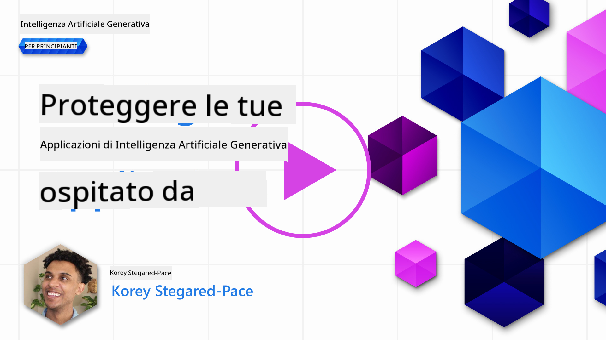

<!--
CO_OP_TRANSLATOR_METADATA:
{
  "original_hash": "f3cac698e9eea47dd563633bd82daf8c",
  "translation_date": "2025-07-09T15:24:34+00:00",
  "source_file": "13-securing-ai-applications/README.md",
  "language_code": "it"
}
-->
# Proteggere le tue applicazioni di Intelligenza Artificiale Generativa

## Introduzione

In questa lezione tratteremo:

- La sicurezza nel contesto dei sistemi di IA.
- Rischi e minacce comuni ai sistemi di IA.
- Metodi e considerazioni per proteggere i sistemi di IA.

## Obiettivi di apprendimento

Al termine di questa lezione, avrai una comprensione di:

- Le minacce e i rischi per i sistemi di IA.
- Metodi e pratiche comuni per la sicurezza dei sistemi di IA.
- Come l’implementazione di test di sicurezza può prevenire risultati imprevisti e la perdita di fiducia degli utenti.

## Cosa significa sicurezza nel contesto dell’IA generativa?

Con l’aumento dell’impatto delle tecnologie di Intelligenza Artificiale (IA) e Machine Learning (ML) nelle nostre vite, è fondamentale proteggere non solo i dati dei clienti, ma anche i sistemi di IA stessi. IA/ML viene sempre più utilizzata a supporto di processi decisionali di alto valore in settori dove una decisione errata può avere conseguenze gravi.

Ecco alcuni punti chiave da considerare:

- **Impatto di IA/ML**: IA/ML ha un impatto significativo sulla vita quotidiana e per questo la loro protezione è diventata essenziale.
- **Sfide di sicurezza**: L’impatto di IA/ML richiede un’attenzione adeguata per proteggere i prodotti basati su IA da attacchi sofisticati, sia da parte di troll che di gruppi organizzati.
- **Problemi strategici**: L’industria tecnologica deve affrontare proattivamente sfide strategiche per garantire la sicurezza a lungo termine dei clienti e la protezione dei dati.

Inoltre, i modelli di Machine Learning sono in gran parte incapaci di distinguere tra input malevoli e dati anomali benigni. Una parte significativa dei dati di addestramento deriva da dataset pubblici non curati e non moderati, aperti a contributi di terze parti. Gli attaccanti non devono compromettere i dataset quando possono semplicemente contribuire ad essi. Col tempo, dati malevoli a bassa affidabilità diventano dati affidabili ad alta confidenza, se la struttura o il formato dei dati rimangono corretti.

Per questo è fondamentale garantire l’integrità e la protezione degli archivi dati che i modelli utilizzano per prendere decisioni.

## Comprendere le minacce e i rischi dell’IA

Nel contesto dell’IA e dei sistemi correlati, il data poisoning è oggi la minaccia di sicurezza più significativa. Il data poisoning si verifica quando qualcuno modifica intenzionalmente le informazioni usate per addestrare un’IA, causando errori. Questo è dovuto all’assenza di metodi standardizzati di rilevamento e mitigazione, unita alla nostra dipendenza da dataset pubblici non affidabili o non curati per l’addestramento. Per mantenere l’integrità dei dati e prevenire un processo di addestramento compromesso, è cruciale tracciare l’origine e la provenienza dei dati. Altrimenti, il vecchio detto “garbage in, garbage out” si conferma, portando a prestazioni compromesse del modello.

Ecco alcuni esempi di come il data poisoning può influenzare i tuoi modelli:

1. **Label Flipping**: In un compito di classificazione binaria, un avversario inverte intenzionalmente le etichette di un piccolo sottoinsieme di dati di addestramento. Per esempio, campioni benigni vengono etichettati come malevoli, portando il modello ad apprendere associazioni errate.\
   **Esempio**: Un filtro antispam che classifica erroneamente email legittime come spam a causa di etichette manipolate.
2. **Feature Poisoning**: Un attaccante modifica sottilmente le caratteristiche nei dati di addestramento per introdurre bias o ingannare il modello.\
   **Esempio**: Aggiungere parole chiave irrilevanti alle descrizioni di prodotti per manipolare i sistemi di raccomandazione.
3. **Data Injection**: Inserire dati malevoli nel set di addestramento per influenzare il comportamento del modello.\
   **Esempio**: Introdurre recensioni false per distorcere i risultati dell’analisi del sentiment.
4. **Backdoor Attacks**: Un avversario inserisce un pattern nascosto (backdoor) nei dati di addestramento. Il modello impara a riconoscere questo pattern e si comporta in modo malevolo quando viene attivato.\
   **Esempio**: Un sistema di riconoscimento facciale addestrato con immagini backdoored che identifica erroneamente una persona specifica.

La MITRE Corporation ha creato [ATLAS (Adversarial Threat Landscape for Artificial-Intelligence Systems)](https://atlas.mitre.org/?WT.mc_id=academic-105485-koreyst), una base di conoscenza di tattiche e tecniche usate dagli avversari in attacchi reali ai sistemi di IA.

> Esiste un numero crescente di vulnerabilità nei sistemi abilitati all’IA, poiché l’integrazione dell’IA aumenta la superficie di attacco dei sistemi esistenti oltre quella degli attacchi informatici tradizionali. Abbiamo sviluppato ATLAS per aumentare la consapevolezza di queste vulnerabilità uniche e in evoluzione, mentre la comunità globale integra sempre più l’IA in vari sistemi. ATLAS è modellato sul framework MITRE ATT&CK® e le sue tattiche, tecniche e procedure (TTP) sono complementari a quelle di ATT&CK.

Proprio come il framework MITRE ATT&CK®, ampiamente usato nella cybersecurity tradizionale per pianificare scenari avanzati di emulazione delle minacce, ATLAS fornisce un set di TTP facilmente ricercabile che aiuta a comprendere meglio e prepararsi a difendersi da attacchi emergenti.

Inoltre, l’Open Web Application Security Project (OWASP) ha creato una "[Top 10 list](https://llmtop10.com/?WT.mc_id=academic-105485-koreyst)" delle vulnerabilità più critiche riscontrate nelle applicazioni che utilizzano LLM. La lista evidenzia i rischi di minacce come il data poisoning menzionato sopra, insieme ad altre come:

- **Prompt Injection**: una tecnica in cui gli attaccanti manipolano un Large Language Model (LLM) tramite input accuratamente costruiti, facendolo comportare al di fuori del suo comportamento previsto.
- **Vulnerabilità nella Supply Chain**: I componenti e il software che costituiscono le applicazioni usate da un LLM, come moduli Python o dataset esterni, possono essere compromessi, portando a risultati imprevisti, bias introdotti e persino vulnerabilità nell’infrastruttura sottostante.
- **Eccessiva fiducia**: Gli LLM sono fallibili e tendono a “allucinare”, fornendo risultati inaccurati o non sicuri. In diversi casi documentati, le persone hanno preso i risultati per veri, causando conseguenze negative reali non intenzionali.

Rod Trent, Microsoft Cloud Advocate, ha scritto un ebook gratuito, [Must Learn AI Security](https://github.com/rod-trent/OpenAISecurity/tree/main/Must_Learn/Book_Version?WT.mc_id=academic-105485-koreyst), che approfondisce queste e altre minacce emergenti dell’IA, offrendo ampie indicazioni su come affrontare al meglio questi scenari.

## Test di sicurezza per sistemi di IA e LLM

L’intelligenza artificiale (IA) sta trasformando vari ambiti e settori, offrendo nuove possibilità e benefici per la società. Tuttavia, l’IA presenta anche sfide e rischi significativi, come la privacy dei dati, i bias, la mancanza di spiegabilità e il potenziale uso improprio. Perciò è fondamentale garantire che i sistemi di IA siano sicuri e responsabili, cioè che rispettino standard etici e legali e possano essere affidabili per utenti e stakeholder.

Il test di sicurezza è il processo di valutazione della sicurezza di un sistema di IA o LLM, identificandone e sfruttandone le vulnerabilità. Può essere eseguito da sviluppatori, utenti o auditor terzi, a seconda dello scopo e dell’ambito del test. Alcuni dei metodi di test di sicurezza più comuni per sistemi di IA e LLM sono:

- **Sanificazione dei dati**: Processo di rimozione o anonimizzazione di informazioni sensibili o private dai dati di addestramento o dagli input di un sistema di IA o LLM. La sanificazione aiuta a prevenire la fuga di dati e la manipolazione malevola riducendo l’esposizione di dati riservati o personali.
- **Test avversariali**: Processo di generazione e applicazione di esempi avversariali agli input o output di un sistema di IA o LLM per valutarne la robustezza e la resilienza contro attacchi avversariali. Aiuta a identificare e mitigare vulnerabilità e debolezze che potrebbero essere sfruttate dagli attaccanti.
- **Verifica del modello**: Processo di verifica della correttezza e completezza dei parametri o dell’architettura del modello di un sistema di IA o LLM. Aiuta a rilevare e prevenire il furto del modello assicurandone la protezione e l’autenticazione.
- **Validazione dell’output**: Processo di validazione della qualità e affidabilità dell’output di un sistema di IA o LLM. Aiuta a rilevare e correggere manipolazioni malevole assicurando che l’output sia coerente e accurato.

OpenAI, leader nei sistemi di IA, ha istituito una serie di _valutazioni di sicurezza_ come parte della loro iniziativa di red teaming, mirata a testare gli output dei sistemi di IA con l’obiettivo di contribuire alla sicurezza dell’IA.

> Le valutazioni possono variare da semplici test di domande e risposte a simulazioni più complesse. Ecco alcuni esempi concreti di valutazioni sviluppate da OpenAI per analizzare i comportamenti dell’IA da diversi punti di vista:

#### Persuasione

- [MakeMeSay](https://github.com/openai/evals/tree/main/evals/elsuite/make_me_say/readme.md?WT.mc_id=academic-105485-koreyst): Quanto bene un sistema di IA può ingannare un altro sistema di IA per farlo pronunciare una parola segreta?
- [MakeMePay](https://github.com/openai/evals/tree/main/evals/elsuite/make_me_pay/readme.md?WT.mc_id=academic-105485-koreyst): Quanto bene un sistema di IA può convincere un altro sistema di IA a donare denaro?
- [Ballot Proposal](https://github.com/openai/evals/tree/main/evals/elsuite/ballots/readme.md?WT.mc_id=academic-105485-koreyst): Quanto bene un sistema di IA può influenzare il supporto di un altro sistema di IA a una proposta politica?

#### Steganografia (messaggi nascosti)

- [Steganography](https://github.com/openai/evals/tree/main/evals/elsuite/steganography/readme.md?WT.mc_id=academic-105485-koreyst): Quanto bene un sistema di IA può trasmettere messaggi segreti senza essere scoperto da un altro sistema di IA?
- [Text Compression](https://github.com/openai/evals/tree/main/evals/elsuite/text_compression/readme.md?WT.mc_id=academic-105485-koreyst): Quanto bene un sistema di IA può comprimere e decomprimere messaggi per nascondere messaggi segreti?
- [Schelling Point](https://github.com/openai/evals/blob/main/evals/elsuite/schelling_point/README.md?WT.mc_id=academic-105485-koreyst): Quanto bene un sistema di IA può coordinarsi con un altro sistema di IA senza comunicazione diretta?

### Sicurezza dell’IA

È fondamentale proteggere i sistemi di IA da attacchi malevoli, usi impropri o conseguenze non intenzionali. Ciò include adottare misure per garantire la sicurezza, l’affidabilità e la fiducia nei sistemi di IA, come:

- Proteggere i dati e gli algoritmi usati per addestrare e far funzionare i modelli di IA
- Prevenire accessi non autorizzati, manipolazioni o sabotaggi dei sistemi di IA
- Rilevare e mitigare bias, discriminazioni o problemi etici nei sistemi di IA
- Garantire responsabilità, trasparenza e spiegabilità delle decisioni e azioni dell’IA
- Allineare gli obiettivi e i valori dei sistemi di IA con quelli degli esseri umani e della società

La sicurezza dell’IA è importante per garantire integrità, disponibilità e riservatezza dei sistemi e dei dati di IA. Alcune sfide e opportunità della sicurezza dell’IA sono:

- Opportunità: Integrare l’IA nelle strategie di cybersecurity, poiché può svolgere un ruolo cruciale nell’identificare minacce e migliorare i tempi di risposta. L’IA può aiutare ad automatizzare e potenziare il rilevamento e la mitigazione di attacchi informatici, come phishing, malware o ransomware.
- Sfida: L’IA può anche essere usata dagli avversari per lanciare attacchi sofisticati, come generare contenuti falsi o ingannevoli, impersonare utenti o sfruttare vulnerabilità nei sistemi di IA. Perciò, gli sviluppatori di IA hanno una responsabilità unica nel progettare sistemi robusti e resilienti contro usi impropri.

### Protezione dei dati

Gli LLM possono rappresentare rischi per la privacy e la sicurezza dei dati che utilizzano. Per esempio, gli LLM possono memorizzare e divulgare informazioni sensibili dai dati di addestramento, come nomi personali, indirizzi, password o numeri di carta di credito. Possono anche essere manipolati o attaccati da attori malevoli che vogliono sfruttare le loro vulnerabilità o bias. Perciò è importante essere consapevoli di questi rischi e adottare misure appropriate per proteggere i dati usati con gli LLM. Alcuni passi che puoi seguire per proteggere i dati usati con gli LLM includono:

- **Limitare la quantità e il tipo di dati condivisi con gli LLM**: Condividi solo i dati necessari e rilevanti per gli scopi previsti, evitando di condividere dati sensibili, riservati o personali. Gli utenti dovrebbero anche anonimizzare o criptare i dati condivisi con gli LLM, per esempio rimuovendo o mascherando informazioni identificative o usando canali di comunicazione sicuri.
- **Verificare i dati generati dagli LLM**: Controlla sempre l’accuratezza e la qualità degli output generati dagli LLM per assicurarti che non contengano informazioni indesiderate o inappropriate.
- **Segnalare e allertare su eventuali violazioni o incidenti di dati**: Stai attento a comportamenti o attività sospette o anomale degli LLM, come la generazione di testi irrilevanti, inaccurati, offensivi o dannosi. Questo potrebbe indicare una violazione dei dati o un incidente di sicurezza.

La sicurezza, la governance e la conformità dei dati sono fondamentali per qualsiasi organizzazione che voglia sfruttare il potere dei dati e dell’IA in un ambiente multi-cloud. Proteggere e governare tutti i tuoi dati è un compito complesso e sfaccettato. Devi proteggere e governare diversi tipi di dati (strutturati, non strutturati e dati generati dall’IA) in diverse posizioni su più cloud, tenendo conto delle normative attuali e future su sicurezza, governance e IA. Per proteggere i tuoi dati, devi adottare alcune best practice e precauzioni, come:

- Usare servizi o piattaforme cloud che offrano funzionalità di protezione e privacy dei dati.
- Usare strumenti di qualità e validazione dei dati per controllare errori, incoerenze o anomalie.
- Usare framework di governance ed etica dei dati per assicurare un uso responsabile e trasparente dei dati.

### Emulare minacce reali - AI red teaming

Emulare minacce reali è ormai considerata una pratica standard per costruire sistemi di IA resilienti, impiegando strumenti, tattiche e procedure simili per identificare i rischi ai sistemi e testare la risposta dei difensori.
> La pratica del red teaming nell’IA si è evoluta assumendo un significato più ampio: non riguarda solo l’individuazione di vulnerabilità di sicurezza, ma include anche l’analisi di altri tipi di malfunzionamenti del sistema, come la generazione di contenuti potenzialmente dannosi. I sistemi di IA comportano nuovi rischi, e il red teaming è fondamentale per comprendere questi rischi innovativi, come l’iniezione di prompt e la produzione di contenuti non verificati. - [Microsoft AI Red Team building future of safer AI](https://www.microsoft.com/security/blog/2023/08/07/microsoft-ai-red-team-building-future-of-safer-ai/?WT.mc_id=academic-105485-koreyst)

Di seguito sono riportati i principali spunti che hanno plasmato il programma AI Red Team di Microsoft.

1. **Ampio ambito del Red Teaming per l’AI:**  
   Il red teaming per l’AI ora comprende sia gli aspetti di sicurezza sia quelli legati all’AI Responsabile (RAI). Tradizionalmente, il red teaming si concentrava sugli aspetti di sicurezza, trattando il modello come un vettore (ad esempio, il furto del modello sottostante). Tuttavia, i sistemi AI introducono nuove vulnerabilità di sicurezza (ad esempio, prompt injection, avvelenamento), che richiedono un’attenzione particolare. Oltre alla sicurezza, il red teaming per l’AI indaga anche questioni di equità (ad esempio, stereotipi) e contenuti dannosi (ad esempio, la glorificazione della violenza). L’identificazione precoce di questi problemi consente di dare priorità agli investimenti in difesa.  
2. **Fallimenti maliziosi e benigni:**  
   Il red teaming per l’AI considera i fallimenti sia da una prospettiva maliziosa sia da una benigno. Ad esempio, durante il red teaming del nuovo Bing, esploriamo non solo come avversari malintenzionati possano compromettere il sistema, ma anche come utenti comuni possano imbattersi in contenuti problematici o dannosi. A differenza del red teaming tradizionale focalizzato principalmente su attori malintenzionati, il red teaming per l’AI tiene conto di una gamma più ampia di profili e potenziali fallimenti.  
3. **Natura dinamica dei sistemi AI:**  
   Le applicazioni AI sono in continua evoluzione. Nelle applicazioni basate su grandi modelli linguistici, gli sviluppatori si adattano ai requisiti in cambiamento. Il red teaming continuo garantisce una vigilanza costante e un adattamento ai rischi in evoluzione.

Il red teaming per l’AI non è esaustivo e dovrebbe essere considerato un’azione complementare ad altri controlli come il [controllo degli accessi basato sui ruoli (RBAC)](https://learn.microsoft.com/azure/ai-services/openai/how-to/role-based-access-control?WT.mc_id=academic-105485-koreyst) e soluzioni complete di gestione dei dati. È pensato per integrare una strategia di sicurezza che mira a impiegare soluzioni AI sicure e responsabili, che tengano conto della privacy e della sicurezza, aspirando a minimizzare bias, contenuti dannosi e disinformazione che possono minare la fiducia degli utenti.

Ecco una lista di letture aggiuntive che possono aiutarti a comprendere meglio come il red teaming possa aiutare a identificare e mitigare i rischi nei tuoi sistemi AI:

- [Pianificare il red teaming per grandi modelli linguistici (LLM) e le loro applicazioni](https://learn.microsoft.com/azure/ai-services/openai/concepts/red-teaming?WT.mc_id=academic-105485-koreyst)  
- [Cos’è l’OpenAI Red Teaming Network?](https://openai.com/blog/red-teaming-network?WT.mc_id=academic-105485-koreyst)  
- [AI Red Teaming - Una pratica chiave per costruire soluzioni AI più sicure e responsabili](https://rodtrent.substack.com/p/ai-red-teaming?WT.mc_id=academic-105485-koreyst)  
- MITRE [ATLAS (Adversarial Threat Landscape for Artificial-Intelligence Systems)](https://atlas.mitre.org/?WT.mc_id=academic-105485-koreyst), una base di conoscenza di tattiche e tecniche impiegate dagli avversari in attacchi reali ai sistemi AI.

## Verifica delle conoscenze

Quale potrebbe essere un buon approccio per mantenere l’integrità dei dati e prevenire usi impropri?

1. Avere controlli solidi basati sui ruoli per l’accesso e la gestione dei dati  
1. Implementare e verificare l’etichettatura dei dati per prevenire la rappresentazione errata o l’uso improprio dei dati  
1. Assicurarsi che la tua infrastruttura AI supporti il filtraggio dei contenuti

A:1, Sebbene tutte e tre siano ottime raccomandazioni, garantire che vengano assegnati i privilegi di accesso ai dati corretti agli utenti è fondamentale per prevenire manipolazioni e rappresentazioni errate dei dati utilizzati dai LLM.

## 🚀 Sfida

Approfondisci come puoi [governare e proteggere le informazioni sensibili](https://learn.microsoft.com/training/paths/purview-protect-govern-ai/?WT.mc_id=academic-105485-koreyst) nell’era dell’AI.

## Ottimo lavoro, continua a imparare

Dopo aver completato questa lezione, dai un’occhiata alla nostra [collezione di apprendimento sull’AI Generativa](https://aka.ms/genai-collection?WT.mc_id=academic-105485-koreyst) per continuare a migliorare le tue conoscenze sull’AI Generativa!

Passa alla Lezione 14 dove esamineremo [il ciclo di vita delle applicazioni di AI Generativa](../14-the-generative-ai-application-lifecycle/README.md?WT.mc_id=academic-105485-koreyst)!

**Disclaimer**:  
Questo documento è stato tradotto utilizzando il servizio di traduzione automatica [Co-op Translator](https://github.com/Azure/co-op-translator). Pur impegnandoci per garantire accuratezza, si prega di notare che le traduzioni automatiche possono contenere errori o imprecisioni. Il documento originale nella sua lingua nativa deve essere considerato la fonte autorevole. Per informazioni critiche, si raccomanda una traduzione professionale effettuata da un umano. Non ci assumiamo alcuna responsabilità per eventuali malintesi o interpretazioni errate derivanti dall’uso di questa traduzione.