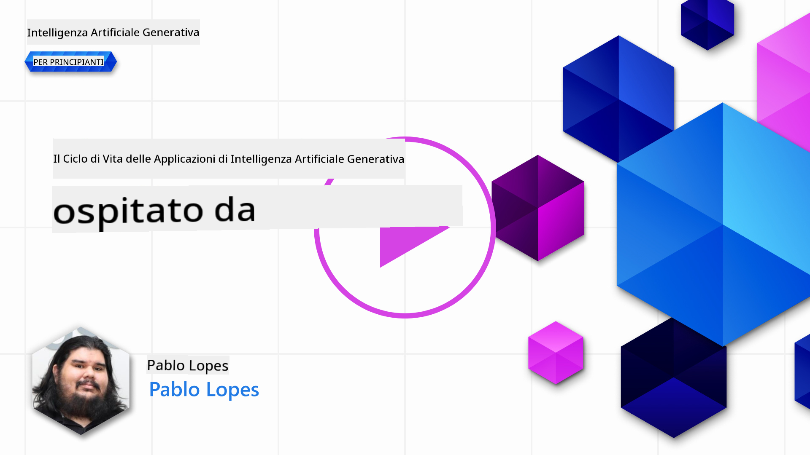
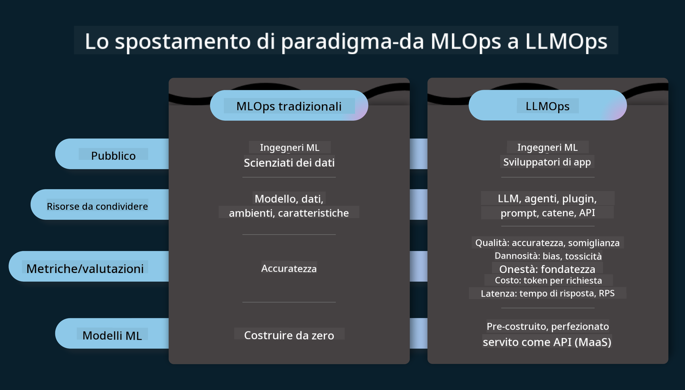
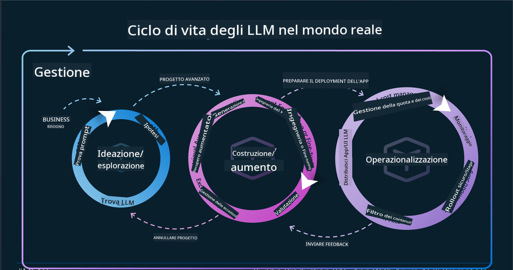
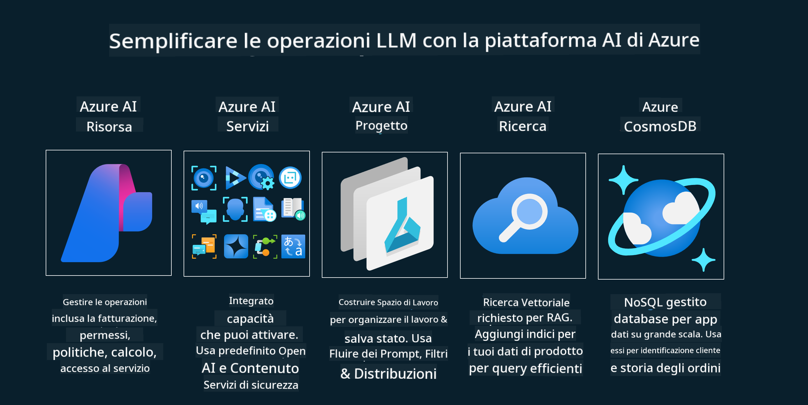
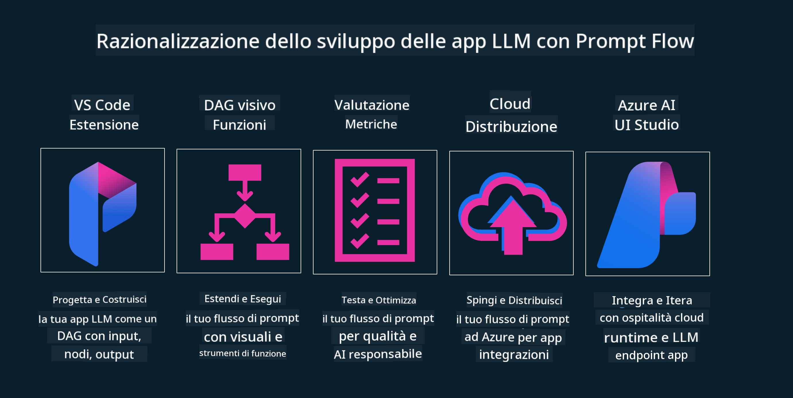

<!--
CO_OP_TRANSLATOR_METADATA:
{
  "original_hash": "27a5347a5022d5ef0a72ab029b03526a",
  "translation_date": "2025-05-19T23:26:28+00:00",
  "source_file": "14-the-generative-ai-application-lifecycle/README.md",
  "language_code": "it"
}
-->

# Il Ciclo di Vita delle Applicazioni di Intelligenza Artificiale Generativa

Una domanda importante per tutte le applicazioni di intelligenza artificiale è la rilevanza delle funzionalità AI, poiché l'AI è un campo in rapida evoluzione. Per garantire che la tua applicazione rimanga rilevante, affidabile e robusta, è necessario monitorarla, valutarla e migliorarla continuamente. È qui che entra in gioco il ciclo di vita dell'AI generativa.

Il ciclo di vita dell'AI generativa è un framework che ti guida attraverso le fasi di sviluppo, distribuzione e mantenimento di un'applicazione di AI generativa. Ti aiuta a definire i tuoi obiettivi, misurare le tue prestazioni, identificare le tue sfide e implementare le tue soluzioni. Ti aiuta anche ad allineare la tua applicazione con gli standard etici e legali del tuo dominio e dei tuoi stakeholder. Seguendo il ciclo di vita dell'AI generativa, puoi garantire che la tua applicazione offra sempre valore e soddisfi i tuoi utenti.

## Introduzione

In questo capitolo, imparerai a:

- Comprendere il Cambiamento di Paradigma da MLOps a LLMOps
- Il Ciclo di Vita degli LLM
- Strumenti per il Ciclo di Vita
- Misurazione e Valutazione del Ciclo di Vita

## Comprendere il Cambiamento di Paradigma da MLOps a LLMOps

Gli LLM sono un nuovo strumento nell'arsenale dell'Intelligenza Artificiale, incredibilmente potenti nei compiti di analisi e generazione per le applicazioni, tuttavia questo potere ha alcune conseguenze su come ottimizziamo i compiti di AI e Machine Learning classico.

Con questo, abbiamo bisogno di un nuovo paradigma per adattare questo strumento in modo dinamico, con gli incentivi corretti. Possiamo categorizzare le vecchie app di AI come "App ML" e le nuove app di AI come "App GenAI" o semplicemente "App AI", riflettendo la tecnologia e le tecniche principali utilizzate al momento. Questo sposta la nostra narrazione in molti modi, guarda il seguente confronto.

Nota che in LLMOps ci concentriamo maggiormente sugli sviluppatori di app, utilizzando le integrazioni come punto chiave, utilizzando "Modelli come Servizio" e pensando ai seguenti punti per le metriche.

- Qualità: Qualità della risposta
- Danno: AI Responsabile
- Onestà: Fondamento della risposta (Ha senso? È corretto?)
- Costo: Budget della soluzione
- Latenza: Tempo medio per la risposta del token

## Il Ciclo di Vita degli LLM

Per prima cosa, per comprendere il ciclo di vita e le modifiche, osserviamo la seguente infografica.

Come puoi notare, questo è diverso dai soliti cicli di vita di MLOps. Gli LLM hanno molti nuovi requisiti, come il Prompting, diverse tecniche per migliorare la qualità (Fine-Tuning, RAG, Meta-Prompts), diverse valutazioni e responsabilità con l'AI responsabile, infine, nuove metriche di valutazione (Qualità, Danno, Onestà, Costo e Latenza).

Ad esempio, guarda come ideiamo. Utilizzando l'ingegneria dei prompt per sperimentare con vari LLM per esplorare possibilità e testare se le loro ipotesi potrebbero essere corrette.

Nota che questo non è lineare, ma integrato in cicli, iterativo e con un ciclo generale.

Come potremmo esplorare questi passaggi? Analizziamo in dettaglio come potremmo costruire un ciclo di vita.

Questo può sembrare un po' complicato, concentriamoci prima sui tre grandi passaggi.

1. Ideazione/Esplorazione: Esplorazione, qui possiamo esplorare in base alle nostre esigenze aziendali. Prototipazione, creazione di un [PromptFlow](https://microsoft.github.io/promptflow/index.html?WT.mc_id=academic-105485-koreyst) e testare se è abbastanza efficiente per la nostra ipotesi.
2. Costruzione/Aumento: Implementazione, ora iniziamo a valutare per dataset più grandi e implementare tecniche, come Fine-tuning e RAG, per verificare la robustezza della nostra soluzione. Se non lo è, reimplementandolo, aggiungendo nuovi passaggi nel nostro flusso o ristrutturando i dati, potrebbe aiutare. Dopo aver testato il nostro flusso e la nostra scala, se funziona e controlliamo le nostre metriche, è pronto per il passaggio successivo.
3. Operazionalizzazione: Integrazione, ora aggiungendo sistemi di monitoraggio e avvisi al nostro sistema, distribuzione e integrazione dell'applicazione alla nostra applicazione.

Poi, abbiamo il ciclo generale di gestione, concentrandoci su sicurezza, conformità e governance.

Congratulazioni, ora hai la tua App AI pronta per essere operativa. Per un'esperienza pratica, dai un'occhiata alla [Demo di Contoso Chat.](https://nitya.github.io/contoso-chat/?WT.mc_id=academic-105485-koreyst)

Ora, quali strumenti potremmo utilizzare?

## Strumenti per il Ciclo di Vita

Per gli strumenti, Microsoft fornisce la [Piattaforma Azure AI](https://azure.microsoft.com/solutions/ai/?WT.mc_id=academic-105485-koreys) e [PromptFlow](https://microsoft.github.io/promptflow/index.html?WT.mc_id=academic-105485-koreyst) per facilitare e rendere il tuo ciclo facile da implementare e pronto per partire.

La [Piattaforma Azure AI](https://azure.microsoft.com/solutions/ai/?WT.mc_id=academic-105485-koreys), ti consente di utilizzare [AI Studio](https://ai.azure.com/?WT.mc_id=academic-105485-koreys). AI Studio è un portale web che ti permette di esplorare modelli, esempi e strumenti. Gestisci le tue risorse, i flussi di sviluppo dell'interfaccia utente e le opzioni SDK/CLI per lo sviluppo orientato al codice.

Azure AI ti consente di utilizzare più risorse per gestire le tue operazioni, servizi, progetti, ricerca vettoriale e necessità di database.

Costruisci, dal Proof-of-Concept (POC) fino ad applicazioni su larga scala con PromptFlow:

- Progetta e costruisci app da VS Code, con strumenti visivi e funzionali
- Testa e affina le tue app per un'AI di qualità, con facilità.
- Utilizza Azure AI Studio per integrare e iterare con il cloud, pubblicare e distribuire per un'integrazione rapida.

## Ottimo! Continua il tuo apprendimento!

Fantastico, ora scopri di più su come strutturiamo un'applicazione per utilizzare i concetti con la [Contoso Chat App](https://nitya.github.io/contoso-chat/?WT.mc_id=academic-105485-koreyst), per vedere come Cloud Advocacy aggiunge questi concetti nelle dimostrazioni. Per ulteriori contenuti, consulta la nostra [sessione breakout di Ignite!](https://www.youtube.com/watch?v=DdOylyrTOWg)

Ora, consulta la Lezione 15, per comprendere come [Retrieval Augmented Generation e Database Vettoriali](../15-rag-and-vector-databases/README.md?WT.mc_id=academic-105485-koreyst) influenzano l'AI generativa e per creare applicazioni più coinvolgenti!

**Clausola di esclusione della responsabilità**:  
Questo documento è stato tradotto utilizzando il servizio di traduzione automatica [Co-op Translator](https://github.com/Azure/co-op-translator). Sebbene ci impegniamo per garantire l'accuratezza, si prega di essere consapevoli che le traduzioni automatiche possono contenere errori o imprecisioni. Il documento originale nella sua lingua nativa dovrebbe essere considerato la fonte autorevole. Per informazioni critiche, si raccomanda una traduzione professionale umana. Non siamo responsabili per eventuali incomprensioni o interpretazioni errate derivanti dall'uso di questa traduzione.