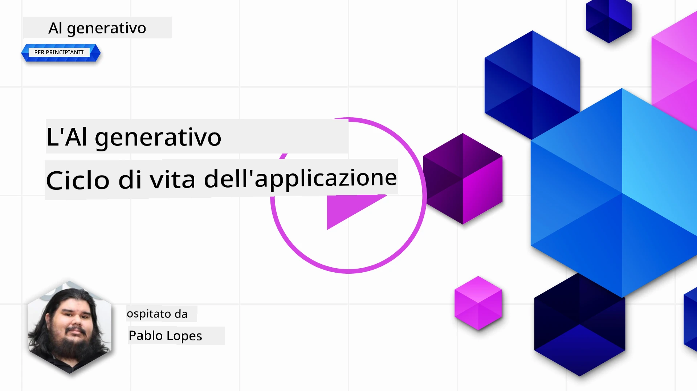
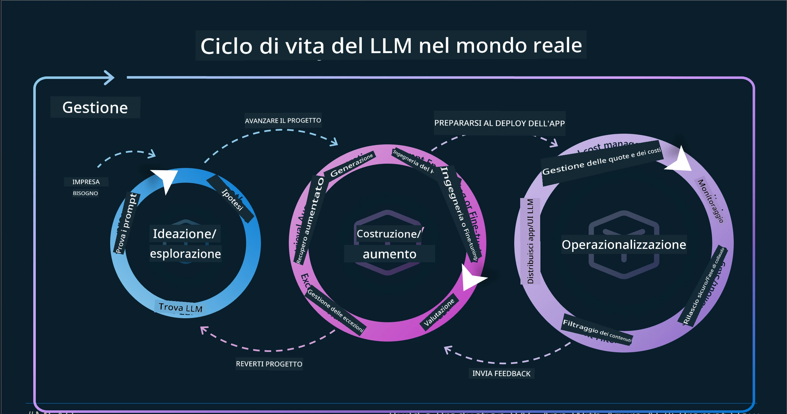
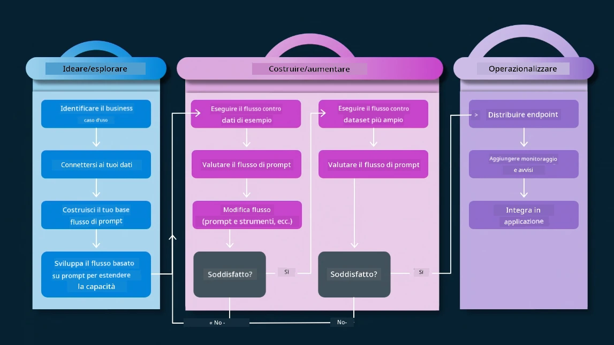
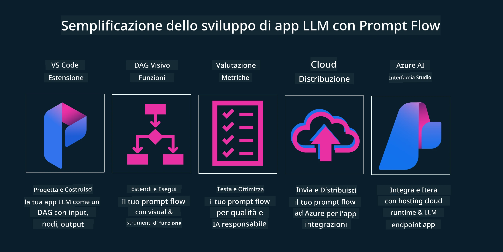

# Il Ciclo di Vita delle Applicazioni di IA Generativa

Una domanda importante per tutte le applicazioni di IA è la rilevanza delle funzionalità di IA, poiché l'IA è un campo in rapida evoluzione; per garantire che la tua applicazione rimanga rilevante, affidabile e robusta, è necessario monitorarla, valutarla e migliorarla continuamente. Qui entra in gioco il ciclo di vita dell'IA generativa.

Il ciclo di vita dell'IA generativa è un framework che ti guida attraverso le fasi di sviluppo, distribuzione e manutenzione di un'applicazione di IA generativa. Ti aiuta a definire i tuoi obiettivi, misurare le tue prestazioni, identificare le tue sfide e implementare le tue soluzioni. Ti aiuta anche ad allineare la tua applicazione agli standard etici e legali del tuo dominio e dei tuoi stakeholder. Seguendo il ciclo di vita dell'IA generativa, puoi assicurarti che la tua applicazione fornisca sempre valore e soddisfi i tuoi utenti.

## Introduzione

In questo capitolo, imparerai a:

- Comprendere il Cambiamento di Paradigma da MLOps a LLMOps
- Il Ciclo di Vita di LLM
- Strumenti per il Ciclo di Vita
- Misurazione e Valutazione del Ciclo di Vita

## Comprendere il Cambiamento di Paradigma da MLOps a LLMOps

Gli LLM sono un nuovo strumento nell'arsenale dell'Intelligenza Artificiale, sono incredibilmente potenti nelle attività di analisi e generazione per le applicazioni, tuttavia questo potere ha alcune conseguenze su come semplifichiamo le attività di AI e Machine Learning Classico.

Con ciò, abbiamo bisogno di un nuovo paradigma per adattare questo strumento in maniera dinamica, con gli incentivi corretti. Possiamo categorizzare le vecchie app di IA come "App ML" e le nuove app di IA come "App GenAI" o semplicemente "App AI", riflettendo la tecnologia e le tecniche principali usate al momento. Questo sposta la nostra narrazione in molti modi, guarda il confronto seguente.

Nota che in LLMOps, siamo più concentrati sugli Sviluppatori di App, usando integrazioni come punto chiave, usando "Modelli come Servizio" e considerando i seguenti punti per le metriche.

- Qualità: Qualità della risposta
- Danno: IA Responsabile
- Onestà: Fondamento della risposta (Ha senso? È corretto?)
- Costo: Budget della soluzione
- Latency: Tempo medio di risposta per token

## Il Ciclo di Vita di LLM

Per prima cosa, per capire il ciclo di vita e le modifiche, osserviamo la seguente infografica.

Come puoi notare, questo è diverso dai soliti cicli di vita di MLOps. Gli LLM hanno molte nuove esigenze, come il Prompting, tecniche diverse per migliorare la qualità (Fine-Tuning, RAG, Meta-Prompt), valutazione e responsabilità con l’IA responsabile, infine nuove metriche di valutazione (Qualità, Danno, Onestà, Costo e Latency).

Ad esempio, guarda come ideiamo. Usando l’ingegneria dei prompt per sperimentare con vari LLM per esplorare possibilità per testare se la loro Ipotesi potrebbe essere corretta.

Nota che questo non è lineare, ma anelli integrati, iterativi e con un ciclo sovrastante.

Come potremmo esplorare questi passaggi? Entriamo nel dettaglio di come potremmo costruire un ciclo di vita.

Questo potrebbe sembrare un po’ complicato, concentriamoci prima sui tre grandi passaggi.

1. Ideazione/Esplorazione: Esplorazione, qui possiamo esplorare in base alle nostre necessità di business. Prototipazione, creazione di un [PromptFlow](https://microsoft.github.io/promptflow/index.html?WT.mc_id=academic-105485-koreyst) e test se è abbastanza efficiente per la nostra Ipotesi.
1. Costruzione/Aumento: Implementazione, ora, iniziamo a valutare con dataset più grandi e implementare tecniche come Fine-tuning e RAG, per verificare la robustezza della nostra soluzione. Se non funziona, reimplementarla, aggiungendo nuovi passaggi al nostro flusso o ristrutturando i dati, potrebbe aiutare. Dopo aver testato il nostro flusso e la nostra scala, se funziona e controlla le metriche, è pronto per il passaggio successivo.
1. Operazionalizzazione: Integrazione, ora aggiungiamo sistemi di monitoraggio e avvisi al nostro sistema, distribuzione e integrazione dell'applicazione nella nostra App.

Poi, abbiamo il ciclo sovrastante di Gestione, concentrato su sicurezza, conformità e governance.

Congratulazioni, ora la tua App di IA è pronta all’uso e operativa. Per un’esperienza pratica, dai un’occhiata al [Demo di Contoso Chat.](https://nitya.github.io/contoso-chat/?WT.mc_id=academic-105485-koreyst)

Adesso, quali strumenti potremmo utilizzare?

## Strumenti per il Ciclo di Vita

Per gli strumenti, Microsoft offre la [Azure AI Platform](https://azure.microsoft.com/solutions/ai/?WT.mc_id=academic-105485-koreyst) e [PromptFlow](https://microsoft.github.io/promptflow/index.html?WT.mc_id=academic-105485-koreyst) che facilitano e rendono semplice implementare il tuo ciclo e pronti all’uso.

La [Azure AI Platform](https://azure.microsoft.com/solutions/ai/?WT.mc_id=academic-105485-koreyst) ti permette di usare [AI Studio](https://ai.azure.com/?WT.mc_id=academic-105485-koreyst). AI Studio è un portale web che ti permette di esplorare modelli, esempi e strumenti. Gestendo le tue risorse, flussi di sviluppo UI e opzioni SDK/CLI per uno sviluppo Code-First.

Azure AI ti permette di usare molteplici risorse, per gestire le tue operazioni, servizi, progetti, ricerca vettoriale e necessità di database.

Costruisci, dal Proof-of-Concept (POC) fino alle applicazioni su larga scala con PromptFlow:

- Progetta e costruisci app da VS Code, con strumenti visivi e funzionali
- Testa e affina le tue app per una IA di qualità, con facilità.
- Usa Azure AI Studio per integrare e iterare con il cloud, Push e Deploy per un’integrazione rapida.

## Ottimo! Continua il tuo apprendimento!

Fantastico, ora impara di più su come strutturare un’applicazione per usare i concetti con la [Contoso Chat App](https://nitya.github.io/contoso-chat/?WT.mc_id=academic-105485-koreyst), per vedere come Cloud Advocacy aggiunge quei concetti nelle dimostrazioni. Per altri contenuti, dai un’occhiata alla nostra [sessione breakout di Ignite!
](https://www.youtube.com/watch?v=DdOylyrTOWg)

Ora, guarda la Lezione 15, per capire come [Retrieval Augmented Generation e Database Vettoriali](../15-rag-and-vector-databases/README.md?WT.mc_id=academic-105485-koreyst) impattano l’IA generativa e per creare applicazioni più coinvolgenti!

---

<!-- CO-OP TRANSLATOR DISCLAIMER START -->
**Disclaimer**:  
Questo documento è stato tradotto utilizzando il servizio di traduzione automatica [Co-op Translator](https://github.com/Azure/co-op-translator). Pur impegnandoci per garantire l'accuratezza, si prega di notare che le traduzioni automatiche possono contenere errori o imprecisioni. Il documento originale nella sua lingua madre deve essere considerato la fonte autorevole. Per informazioni critiche, si raccomanda una traduzione professionale effettuata da esseri umani. Non siamo responsabili per eventuali incomprensioni o interpretazioni errate derivanti dall’uso di questa traduzione.
<!-- CO-OP TRANSLATOR DISCLAIMER END -->