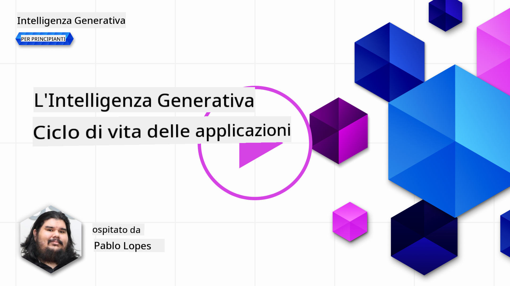
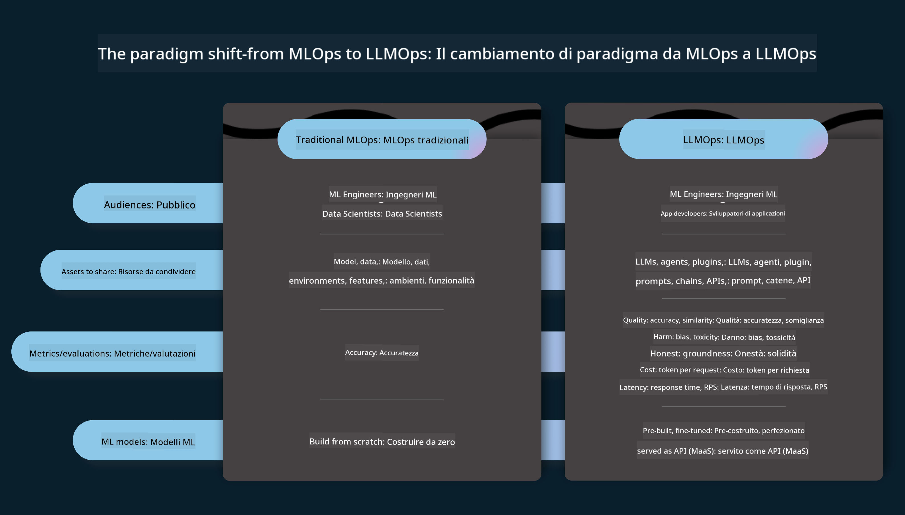
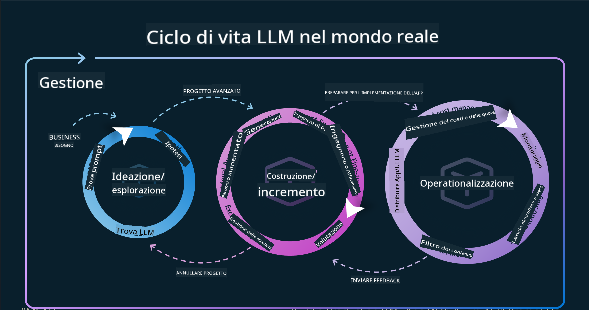
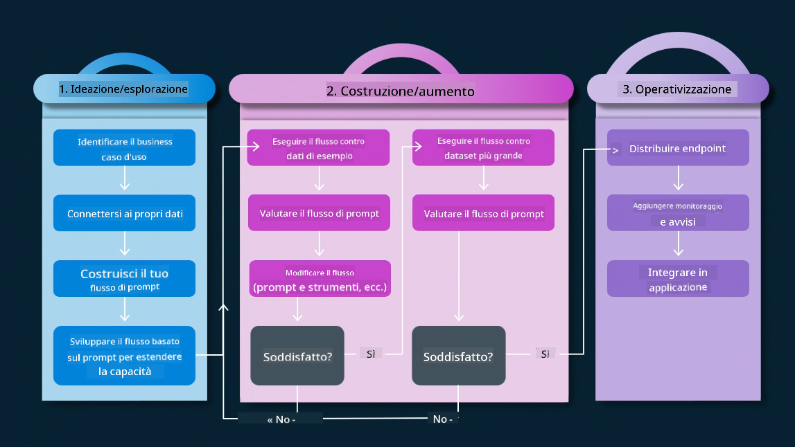
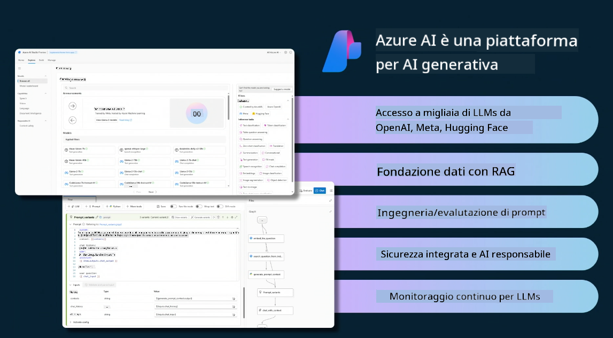
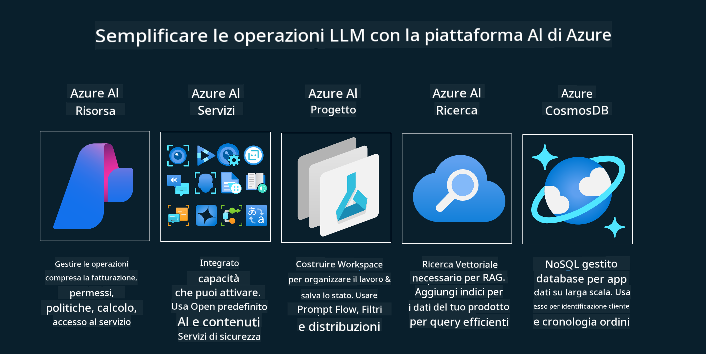
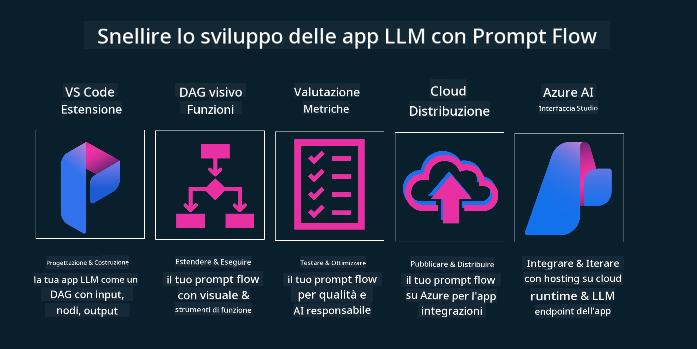

<!--
CO_OP_TRANSLATOR_METADATA:
{
  "original_hash": "27a5347a5022d5ef0a72ab029b03526a",
  "translation_date": "2025-06-25T22:02:17+00:00",
  "source_file": "14-the-generative-ai-application-lifecycle/README.md",
  "language_code": "it"
}
-->

# Il Ciclo di Vita delle Applicazioni di AI Generativa

Una domanda importante per tutte le applicazioni di AI è la rilevanza delle funzionalità AI, poiché l'AI è un campo in rapida evoluzione. Per garantire che la tua applicazione rimanga rilevante, affidabile e robusta, è necessario monitorarla, valutarla e migliorarla continuamente. È qui che entra in gioco il ciclo di vita dell'AI generativa.

Il ciclo di vita dell'AI generativa è un framework che ti guida attraverso le fasi di sviluppo, distribuzione e manutenzione di un'applicazione di AI generativa. Ti aiuta a definire i tuoi obiettivi, misurare le tue prestazioni, identificare le tue sfide e implementare le tue soluzioni. Ti aiuta anche ad allineare la tua applicazione agli standard etici e legali del tuo settore e dei tuoi stakeholder. Seguendo il ciclo di vita dell'AI generativa, puoi garantire che la tua applicazione continui a fornire valore e soddisfi i tuoi utenti.

## Introduzione

In questo capitolo, imparerai:

- Comprendere il Cambiamento di Paradigma da MLOps a LLMOps
- Il Ciclo di Vita degli LLM
- Strumenti per il Ciclo di Vita
- Misurazione e Valutazione del Ciclo di Vita

## Comprendere il Cambiamento di Paradigma da MLOps a LLMOps

Gli LLM sono un nuovo strumento nell'arsenale dell'Intelligenza Artificiale, incredibilmente potenti nei compiti di analisi e generazione per le applicazioni. Tuttavia, questo potere ha delle conseguenze su come ottimizziamo i compiti di AI e Machine Learning classico.

Con questo, abbiamo bisogno di un nuovo paradigma per adattare questo strumento in modo dinamico, con gli incentivi corretti. Possiamo categorizzare le app AI più vecchie come "App ML" e le app AI più recenti come "App GenAI" o semplicemente "App AI", riflettendo la tecnologia e le tecniche principali utilizzate al momento. Questo cambia la nostra narrativa in molti modi, guarda il seguente confronto.

Nota che in LLMOps, siamo più concentrati sugli sviluppatori di app, utilizzando le integrazioni come punto chiave, usando "Modelli-come-Servizio" e pensando ai seguenti punti per le metriche.

- Qualità: Qualità della risposta
- Danno: AI Responsabile
- Onestà: Fondamento della risposta (Ha senso? È corretto?)
- Costo: Budget della soluzione
- Latenza: Tempo medio per la risposta al token

## Il Ciclo di Vita degli LLM

Per prima cosa, per comprendere il ciclo di vita e le modifiche, prendiamo nota della seguente infografica.

Come puoi notare, questo è diverso dai soliti cicli di vita di MLOps. Gli LLM hanno molti nuovi requisiti, come il Prompting, tecniche diverse per migliorare la qualità (Fine-Tuning, RAG, Meta-Prompts), diverse valutazioni e responsabilità con l'AI responsabile, infine, nuove metriche di valutazione (Qualità, Danno, Onestà, Costo e Latenza).

Per esempio, guarda come ideiamo. Utilizzando l'ingegneria dei prompt per sperimentare con vari LLM per esplorare le possibilità di testare se la loro ipotesi potrebbe essere corretta.

Nota che questo non è lineare, ma cicli integrati, iterativi e con un ciclo complessivo.

Come possiamo esplorare questi passaggi? Entriamo nei dettagli su come potremmo costruire un ciclo di vita.

Questo potrebbe sembrare un po' complicato, concentriamoci prima sui tre grandi passaggi.

1. Ideazione/Esplorazione: Esplorazione, qui possiamo esplorare secondo le nostre esigenze aziendali. Prototipazione, creazione di un [PromptFlow](https://microsoft.github.io/promptflow/index.html?WT.mc_id=academic-105485-koreyst) e verifica se è abbastanza efficiente per la nostra ipotesi.
2. Costruzione/Aumento: Implementazione, ora, iniziamo a valutare per set di dati più grandi, implementare tecniche come il Fine-tuning e RAG, per verificare la robustezza della nostra soluzione. Se non lo è, reimplementarlo, aggiungendo nuovi passaggi nel nostro flusso o ristrutturando i dati, potrebbe aiutare. Dopo aver testato il nostro flusso e la nostra scala, se funziona e controlliamo le nostre metriche, è pronto per il passaggio successivo.
3. Operazionalizzazione: Integrazione, ora aggiungendo sistemi di monitoraggio e avvisi al nostro sistema, distribuzione e integrazione dell'applicazione alla nostra applicazione.

Poi, abbiamo il ciclo complessivo di gestione, concentrandoci sulla sicurezza, conformità e governance.

Congratulazioni, ora hai la tua App AI pronta per partire e operativa. Per un'esperienza pratica, dai un'occhiata alla [Demo Chat di Contoso.](https://nitya.github.io/contoso-chat/?WT.mc_id=academic-105485-koreys)

Ora, quali strumenti potremmo usare?

## Strumenti per il Ciclo di Vita

Per gli strumenti, Microsoft fornisce la [Piattaforma AI di Azure](https://azure.microsoft.com/solutions/ai/?WT.mc_id=academic-105485-koreys) e [PromptFlow](https://microsoft.github.io/promptflow/index.html?WT.mc_id=academic-105485-koreyst) per facilitare e rendere il tuo ciclo facile da implementare e pronto per partire.

La [Piattaforma AI di Azure](https://azure.microsoft.com/solutions/ai/?WT.mc_id=academic-105485-koreys) ti permette di usare [AI Studio](https://ai.azure.com/?WT.mc_id=academic-105485-koreys). AI Studio è un portale web che ti permette di esplorare modelli, campioni e strumenti. Gestisci le tue risorse, flussi di sviluppo UI e opzioni SDK/CLI per lo sviluppo Code-First.

Azure AI ti permette di usare risorse multiple per gestire le tue operazioni, servizi, progetti, ricerca vettoriale e necessità di database.

Costruisci, dal Proof-of-Concept (POC) fino ad applicazioni su larga scala con PromptFlow:

- Progetta e costruisci app da VS Code, con strumenti visivi e funzionali
- Testa e affina le tue app per una qualità AI, con facilità.
- Usa Azure AI Studio per integrare e iterare con il cloud, spingi e distribuisci per una rapida integrazione.

## Ottimo! Continua il tuo apprendimento!

Fantastico, ora scopri di più su come strutturiamo un'applicazione per utilizzare i concetti con l'[App Chat di Contoso](https://nitya.github.io/contoso-chat/?WT.mc_id=academic-105485-koreyst), per verificare come Cloud Advocacy aggiunge questi concetti nelle dimostrazioni. Per ulteriori contenuti, consulta la nostra [sessione di breakout di Ignite!
](https://www.youtube.com/watch?v=DdOylyrTOWg)

Ora, controlla la Lezione 15, per comprendere come [Retrieval Augmented Generation e Database Vettoriali](../15-rag-and-vector-databases/README.md?WT.mc_id=academic-105485-koreyst) impattano sull'AI Generativa e per creare applicazioni più coinvolgenti!

**Disclaimer**:  
Questo documento è stato tradotto utilizzando il servizio di traduzione automatica [Co-op Translator](https://github.com/Azure/co-op-translator). Sebbene ci impegniamo per garantire l'accuratezza, si prega di essere consapevoli che le traduzioni automatiche possono contenere errori o imprecisioni. Il documento originale nella sua lingua nativa dovrebbe essere considerato la fonte autorevole. Per informazioni critiche, si raccomanda una traduzione professionale umana. Non siamo responsabili per eventuali malintesi o interpretazioni errate derivanti dall'uso di questa traduzione.