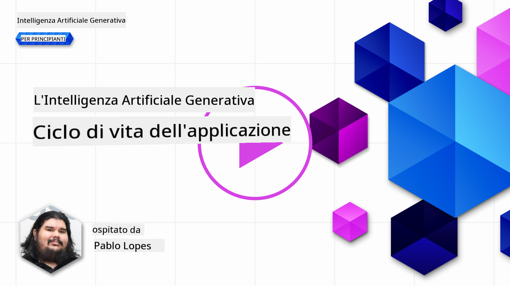
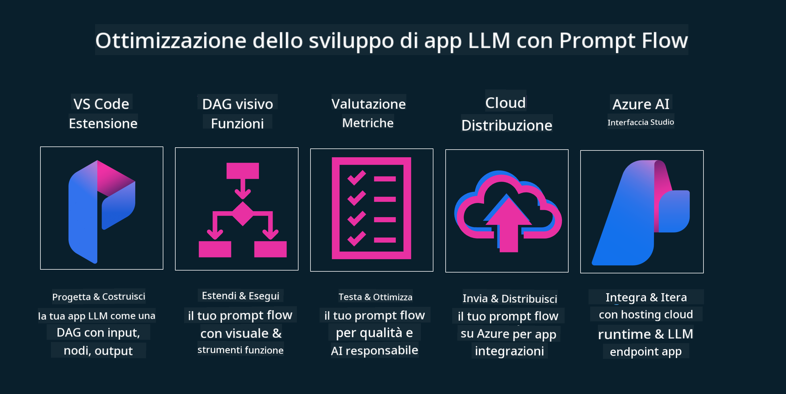

<!--
CO_OP_TRANSLATOR_METADATA:
{
  "original_hash": "27a5347a5022d5ef0a72ab029b03526a",
  "translation_date": "2025-07-09T15:52:31+00:00",
  "source_file": "14-the-generative-ai-application-lifecycle/README.md",
  "language_code": "it"
}
-->

# Il Ciclo di Vita delle Applicazioni di Intelligenza Artificiale Generativa

Una domanda importante per tutte le applicazioni di AI riguarda la rilevanza delle funzionalità AI, dato che l’AI è un campo in rapida evoluzione. Per garantire che la tua applicazione rimanga rilevante, affidabile e robusta, è necessario monitorarla, valutarla e migliorarla continuamente. È qui che entra in gioco il ciclo di vita dell’AI generativa.

Il ciclo di vita dell’AI generativa è un framework che ti guida attraverso le fasi di sviluppo, distribuzione e manutenzione di un’applicazione di AI generativa. Ti aiuta a definire i tuoi obiettivi, misurare le prestazioni, identificare le sfide e implementare le soluzioni. Inoltre, ti supporta nell’allineare la tua applicazione agli standard etici e legali del tuo settore e dei tuoi stakeholder. Seguendo il ciclo di vita dell’AI generativa, puoi assicurarti che la tua applicazione offra sempre valore e soddisfi gli utenti.

## Introduzione

In questo capitolo, imparerai a:

- Comprendere il cambiamento di paradigma da MLOps a LLMOps
- Il ciclo di vita degli LLM
- Strumenti per il ciclo di vita
- Metriche e valutazione del ciclo di vita

## Comprendere il cambiamento di paradigma da MLOps a LLMOps

Gli LLM sono un nuovo strumento nell’arsenale dell’Intelligenza Artificiale, estremamente potenti nelle attività di analisi e generazione per le applicazioni, ma questo potere comporta alcune conseguenze nel modo in cui semplifichiamo i compiti di AI e Machine Learning classico.

Per questo serve un nuovo paradigma che adatti questo strumento in modo dinamico, con gli incentivi corretti. Possiamo categorizzare le vecchie app AI come "ML Apps" e le nuove come "GenAI Apps" o semplicemente "AI Apps", riflettendo la tecnologia e le tecniche di riferimento del momento. Questo cambia la nostra narrazione in diversi modi, guarda il confronto seguente.

Nota che in LLMOps ci concentriamo maggiormente sugli sviluppatori di app, usando le integrazioni come punto chiave, adottando "Models-as-a-Service" e considerando i seguenti aspetti per le metriche.

- Qualità: qualità della risposta
- Danno: AI responsabile
- Onestà: fondatezza della risposta (Ha senso? È corretta?)
- Costo: budget della soluzione
- Latency: tempo medio di risposta per token

## Il ciclo di vita degli LLM

Per prima cosa, per comprendere il ciclo di vita e le modifiche, osserviamo l’infografica seguente.

Come puoi notare, è diverso dai soliti cicli di vita di MLOps. Gli LLM hanno molte nuove esigenze, come il Prompting, tecniche diverse per migliorare la qualità (Fine-Tuning, RAG, Meta-Prompts), valutazioni e responsabilità legate all’AI responsabile, infine nuove metriche di valutazione (Qualità, Danno, Onestà, Costo e Latency).

Ad esempio, guarda come ideiamo. Usando il prompt engineering per sperimentare con vari LLM e esplorare possibilità per testare se le loro ipotesi possono essere corrette.

Nota che non è un processo lineare, ma anelli integrati, iterativi e con un ciclo generale.

Come possiamo esplorare questi passaggi? Vediamo nel dettaglio come costruire un ciclo di vita.

Può sembrare un po’ complicato, concentriamoci prima sui tre passaggi principali.

1. Ideazione/Esplorazione: Esplorazione, qui possiamo esplorare in base alle esigenze di business. Prototipazione, creare un [PromptFlow](https://microsoft.github.io/promptflow/index.html?WT.mc_id=academic-105485-koreyst) e testare se è abbastanza efficiente per la nostra ipotesi.
1. Costruzione/Aumento: Implementazione, ora iniziamo a valutare su dataset più grandi, implementando tecniche come Fine-tuning e RAG, per verificare la robustezza della soluzione. Se non funziona, reimplementarla, aggiungere nuovi passaggi nel flusso o ristrutturare i dati può aiutare. Dopo aver testato il flusso e la scalabilità, se funziona e le metriche sono soddisfacenti, è pronta per il passo successivo.
1. Operazionalizzazione: Integrazione, ora si aggiungono sistemi di monitoraggio e allerta, distribuzione e integrazione dell’applicazione.

Infine, c’è il ciclo generale di gestione, con focus su sicurezza, conformità e governance.

Congratulazioni, ora la tua app AI è pronta e operativa. Per un’esperienza pratica, dai un’occhiata alla [Demo Contoso Chat.](https://nitya.github.io/contoso-chat/?WT.mc_id=academic-105485-koreys)

Ora, quali strumenti possiamo usare?

## Strumenti per il ciclo di vita

Per gli strumenti, Microsoft offre la [Azure AI Platform](https://azure.microsoft.com/solutions/ai/?WT.mc_id=academic-105485-koreys) e [PromptFlow](https://microsoft.github.io/promptflow/index.html?WT.mc_id=academic-105485-koreyst) che facilitano e rendono semplice implementare il ciclo di vita.

La [Azure AI Platform](https://azure.microsoft.com/solutions/ai/?WT.mc_id=academic-105485-koreys) ti permette di usare [AI Studio](https://ai.azure.com/?WT.mc_id=academic-105485-koreys). AI Studio è un portale web che consente di esplorare modelli, esempi e strumenti. Gestire le risorse, sviluppare flussi UI e opzioni SDK/CLI per uno sviluppo Code-First.

Azure AI ti consente di utilizzare molteplici risorse per gestire operazioni, servizi, progetti, ricerche vettoriali e database.

Costruisci, dal Proof-of-Concept (POC) fino ad applicazioni su larga scala con PromptFlow:

- Progetta e costruisci app da VS Code, con strumenti visivi e funzionali
- Testa e affina le tue app per un’AI di qualità, con facilità
- Usa Azure AI Studio per integrare e iterare con il cloud, push e deploy per un’integrazione rapida

## Ottimo! Continua a imparare!

Fantastico, ora approfondisci come strutturiamo un’applicazione per usare i concetti con la [Contoso Chat App](https://nitya.github.io/contoso-chat/?WT.mc_id=academic-105485-koreyst), per vedere come Cloud Advocacy integra questi concetti nelle dimostrazioni. Per altri contenuti, guarda la nostra [sessione Ignite breakout!](https://www.youtube.com/watch?v=DdOylyrTOWg)

Ora, passa alla Lezione 15, per capire come [Retrieval Augmented Generation e Vector Databases](../15-rag-and-vector-databases/README.md?WT.mc_id=academic-105485-koreyst) influenzano l’AI generativa e rendere le applicazioni più coinvolgenti!

**Disclaimer**:  
Questo documento è stato tradotto utilizzando il servizio di traduzione automatica [Co-op Translator](https://github.com/Azure/co-op-translator). Pur impegnandoci per garantire l’accuratezza, si prega di notare che le traduzioni automatiche possono contenere errori o imprecisioni. Il documento originale nella sua lingua nativa deve essere considerato la fonte autorevole. Per informazioni critiche, si raccomanda una traduzione professionale effettuata da un umano. Non ci assumiamo alcuna responsabilità per eventuali malintesi o interpretazioni errate derivanti dall’uso di questa traduzione.