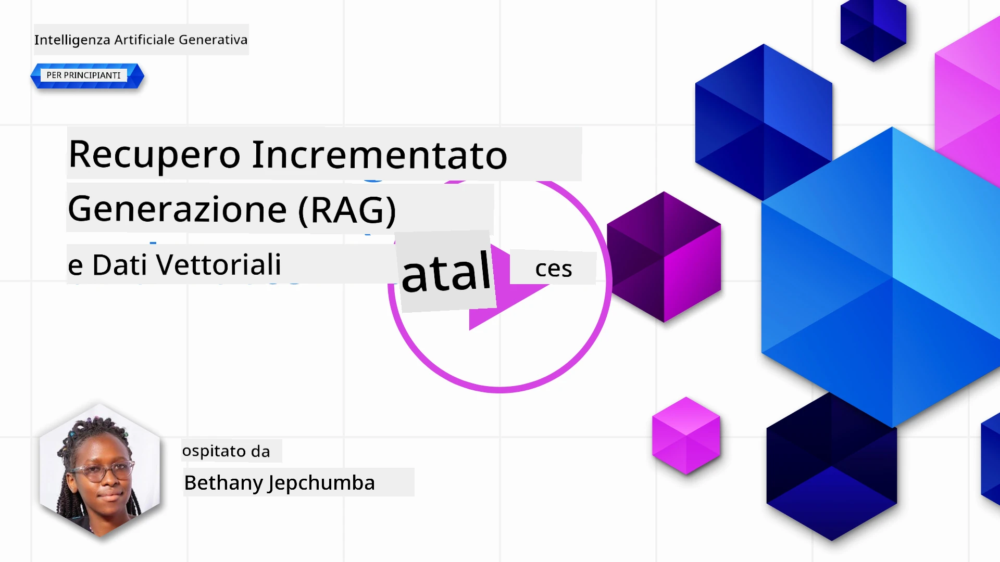
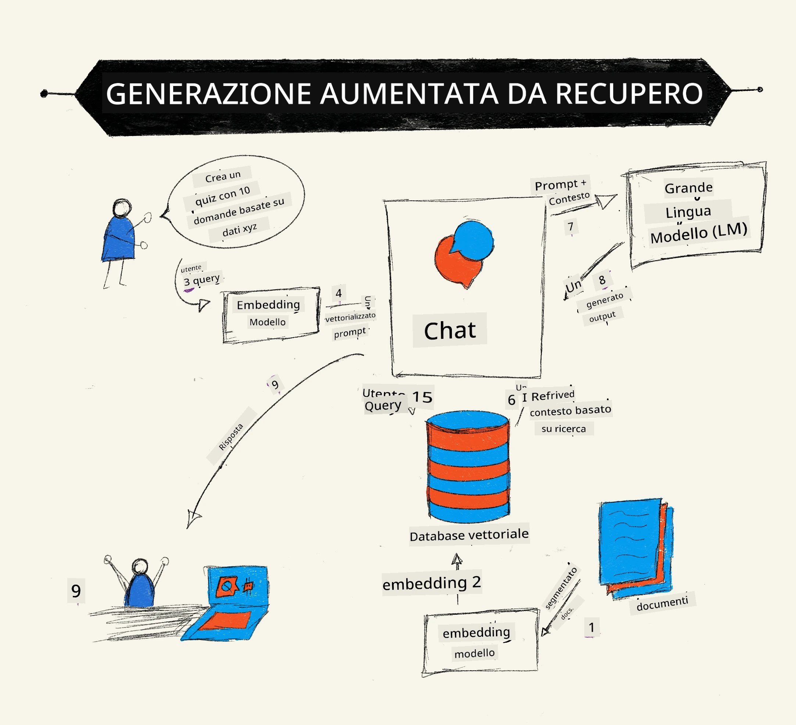
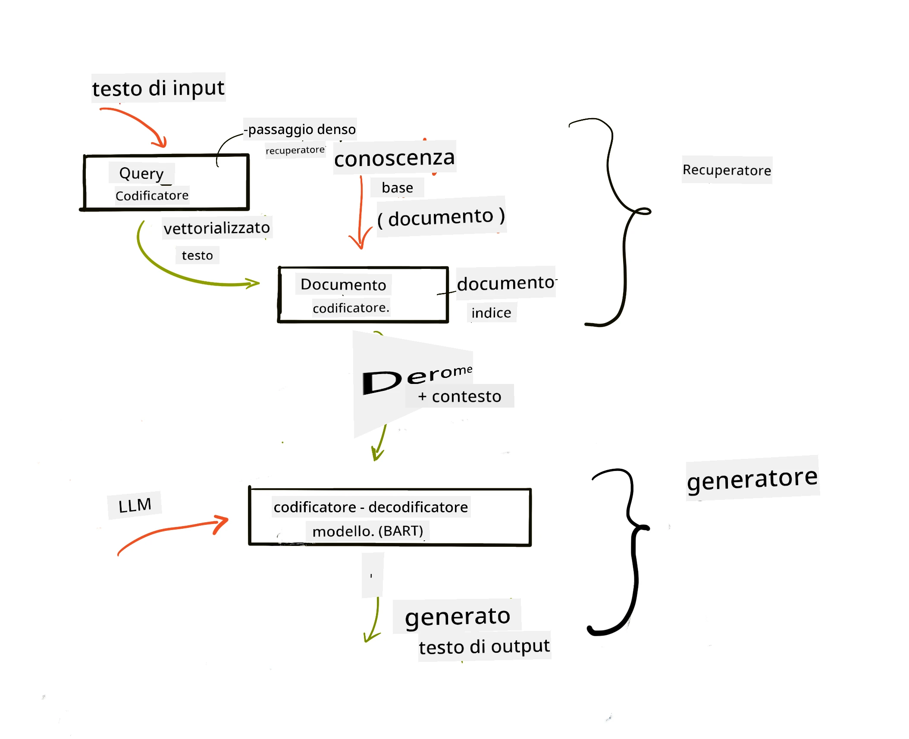
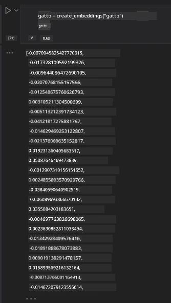

# Retrieval Augmented Generation (RAG) e Database Vettoriali

[](https://youtu.be/4l8zhHUBeyI?si=BmvDmL1fnHtgQYkL)

Nella lezione sulle applicazioni di ricerca, abbiamo brevemente imparato come integrare i propri dati nei Large Language Models (LLM). In questa lezione, approfondiremo ulteriormente i concetti di ancoraggio dei dati nella tua applicazione LLM, i meccanismi del processo e i metodi per la memorizzazione dei dati, inclusi sia gli embeddings che il testo.

> **Video in arrivo**

## Introduzione

In questa lezione tratteremo i seguenti argomenti:

- Una introduzione a RAG, cos’è e perché viene utilizzato nell'IA (intelligenza artificiale).

- Comprendere cosa sono i database vettoriali e crearne uno per la nostra applicazione.

- Un esempio pratico su come integrare RAG in un'applicazione.

## Obiettivi di Apprendimento

Dopo aver completato questa lezione, sarai in grado di:

- Spiegare l’importanza di RAG nel recupero e processamento dei dati.

- Configurare un'applicazione RAG e ancorare i tuoi dati a un LLM.

- Integrare efficacemente RAG e Database Vettoriali nelle applicazioni LLM.

## Il nostro scenario: migliorare i nostri LLM con i nostri dati

Per questa lezione, vogliamo aggiungere le nostre note nella startup educativa, che permette al chatbot di ottenere più informazioni su diversi argomenti. Utilizzando le note che abbiamo, gli studenti potranno studiare meglio e comprendere i vari temi, rendendo più facile prepararsi per gli esami. Per creare il nostro scenario, useremo:

- `Azure OpenAI:` l'LLM che useremo per creare il nostro chatbot

- `Lezione AI per principianti sulle Reti Neurali:` questi saranno i dati su cui ancoreremo il nostro LLM

- `Azure AI Search` e `Azure Cosmos DB:` database vettoriale per memorizzare i nostri dati e creare un indice di ricerca

Gli utenti potranno creare quiz di pratica dalle loro note, flashcard di revisione e riassumerle in panoramiche concise. Per cominciare, vediamo cos’è RAG e come funziona:

## Retrieval Augmented Generation (RAG)

Un chatbot basato su LLM elabora i prompt degli utenti per generare risposte. È progettato per essere interattivo e si confronta con gli utenti su un’ampia gamma di argomenti. Tuttavia, le sue risposte sono limitate al contesto fornito e ai dati di addestramento fondamentali. Ad esempio, la conoscenza di GPT-4 si ferma a settembre 2021, il che significa che non conosce eventi avvenuti dopo questa data. Inoltre, i dati usati per addestrare gli LLM escludono informazioni confidenziali come note personali o manuali dei prodotti di un’azienda.

### Come funzionano i RAG (Retrieval Augmented Generation)



Supponiamo di voler distribuire un chatbot che crea quiz dalle tue note, sarà necessario un collegamento alla base di conoscenza. Qui interviene RAG. I RAG funzionano come segue:

- **Base di conoscenza:** Prima del recupero, questi documenti devono essere ingeriti e preprocessati, tipicamente suddividendo grandi documenti in blocchi più piccoli, trasformandoli in embedding di testo e memorizzandoli in un database.

- **Query utente:** l’utente pone una domanda

- **Recupero:** Quando un utente pone una domanda, il modello di embedding recupera informazioni rilevanti dalla nostra base di conoscenza per fornire più contesto da incorporare nel prompt.

- **Generazione aumentata:** l’LLM migliora la sua risposta basandosi sui dati recuperati. Ciò consente che la risposta generata non sia basata solo sui dati pre-addestrati ma anche su informazioni rilevanti provenienti dal contesto aggiunto. I dati recuperati vengono utilizzati per aumentare le risposte dell’LLM. L’LLM quindi restituisce una risposta alla domanda dell’utente.



L’architettura per i RAG viene implementata usando transformers costituiti da due parti: un encoder e un decoder. Per esempio, quando un utente pone una domanda, il testo in input viene “codificato” in vettori che catturano il significato delle parole e i vettori vengono “decodificati” nel nostro indice documentale e generano nuovo testo basato sulla query dell’utente. L’LLM utilizza un modello encoder-decoder per generare l’output.

Due approcci per implementare RAG secondo il documento proposto: [Retrieval-Augmented Generation for Knowledge intensive NLP (natural language processing software) Tasks](https://arxiv.org/pdf/2005.11401.pdf?WT.mc_id=academic-105485-koreyst) sono:

- **_RAG-Sequence_** usa i documenti recuperati per predire la migliore risposta possibile a una query utente

- **RAG-Token** usa i documenti per generare il token successivo e poi li recupera per rispondere alla query dell’utente

### Perché usare i RAG? 

- **Ricchezza d’informazione:** assicura che le risposte testuali siano aggiornate e correnti. Migliora quindi la performance su compiti specifici di dominio accedendo alla base di conoscenza interna.

- Riduce la fabbricazione utilizzando **dati verificabili** nella base di conoscenza per fornire contesto alle query degli utenti.

- È **economico**, in quanto più conveniente rispetto al fine-tuning di un LLM

## Creare una base di conoscenza

La nostra applicazione si basa sui nostri dati personali, cioè la lezione sulla Rete Neurale del curriculum AI For Beginners.

### Database Vettoriali

Un database vettoriale, a differenza dei database tradizionali, è un database specializzato progettato per memorizzare, gestire e cercare vettori embedded. Memorizza rappresentazioni numeriche dei documenti. Suddividere i dati in rappresentazioni numeriche facilita la comprensione e l’elaborazione per il nostro sistema AI.

Conserviamo i nostri embeddings nei database vettoriali poiché gli LLM hanno un limite nel numero di token che accettano come input. Poiché non si possono passare interamente gli embeddings a un LLM, dobbiamo suddividerli in blocchi e quando un utente fa una domanda, verranno restituiti gli embeddings più simili alla domanda insieme al prompt. La suddivisione riduce anche i costi sul numero di token passati a un LLM.

Alcuni database vettoriali popolari includono Azure Cosmos DB, Clarifyai, Pinecone, Chromadb, ScaNN, Qdrant e DeepLake. Puoi creare un modello Azure Cosmos DB usando Azure CLI con il seguente comando:

```bash
az login
az group create -n <resource-group-name> -l <location>
az cosmosdb create -n <cosmos-db-name> -r <resource-group-name>
az cosmosdb list-keys -n <cosmos-db-name> -g <resource-group-name>
```

### Da testo a embeddings

Prima di memorizzare i dati, dobbiamo convertirli in vettori embedding prima che vengano salvati nel database. Se lavori con documenti grandi o testi lunghi, puoi suddividerli in blocchi basandoti sulle query che prevedi. Si può suddividere a livello di frase o paragrafo. Poiché la segmentazione deriva significati dalle parole circostanti, puoi aggiungere altro contesto a un blocco, per esempio aggiungendo il titolo del documento o includendo testo prima o dopo il blocco. Puoi suddividere i dati come segue:

```python
def split_text(text, max_length, min_length):
    words = text.split()
    chunks = []
    current_chunk = []

    for word in words:
        current_chunk.append(word)
        if len(' '.join(current_chunk)) < max_length and len(' '.join(current_chunk)) > min_length:
            chunks.append(' '.join(current_chunk))
            current_chunk = []

    # Se l'ultimo blocco non ha raggiunto la lunghezza minima, aggiungilo comunque
    if current_chunk:
        chunks.append(' '.join(current_chunk))

    return chunks
```

Una volta suddivisi, possiamo quindi incorporare il nostro testo usando diversi modelli di embedding. Alcuni modelli che puoi utilizzare includono: word2vec, ada-002 di OpenAI, Azure Computer Vision e molti altri. La scelta del modello dipende dalle lingue utilizzate, dal tipo di contenuto codificato (testo/immagini/audio), dalla dimensione dell’input che può codificare e dalla lunghezza dell’output embedding.

Un esempio di testo embedded usando il modello `text-embedding-ada-002` di OpenAI è:


## Recupero e ricerca vettoriale

Quando un utente pone una domanda, il retriever la trasforma in un vettore usando l’encoder di query, poi ricerca nel nostro indice di documenti per vettori rilevanti nel documento correlati all’input. Fatto ciò, converte sia il vettore di input che i vettori del documento in testo e li passa all’LLM.

### Recupero

Il recupero avviene quando il sistema cerca rapidamente i documenti dall’indice che soddisfano i criteri di ricerca. Lo scopo del retriever è ottenere documenti che forniranno contesto e ancoreranno l’LLM ai tuoi dati.

Ci sono vari modi per effettuare la ricerca nel nostro database come:

- **Ricerca per parola chiave** - usata per ricerche testuali

- **Ricerca vettoriale** - converte i documenti da testo a rappresentazioni vettoriali usando modelli embedding, permettendo una **ricerca semantica** usando il significato delle parole. Il recupero avverrà interrogando i documenti le cui rappresentazioni vettoriali sono più vicine alla domanda dell’utente.

- **Ibrido** - una combinazione di ricerca per parola chiave e ricerca vettoriale.

Una sfida nel recupero si presenta quando non esiste una risposta simile alla query nel database, il sistema restituirà la migliore informazione possibile, tuttavia puoi utilizzare tattiche come impostare la distanza massima per la rilevanza o usare la ricerca ibrida che combina entrambi i metodi. In questa lezione useremo la ricerca ibrida, una combinazione di ricerca vettoriale e per parola chiave. Memorizzeremo i nostri dati in un dataframe con colonne contenenti sia i blocchi che gli embeddings.

### Similarità vettoriale

Il retriever cerca nel database di conoscenza gli embeddings che sono vicini tra loro, il vicino più prossimo, poiché sono testi simili. Nello scenario in cui un utente pone una domanda, questa viene prima incorporata e poi confrontata con embeddings simili. La misura comune usata per trovare quanto sono simili diversi vettori è la similarità coseno, basata sull’angolo tra due vettori.

Possiamo misurare la similarità anche con alternative come la distanza euclidea, che è la linea retta tra le estremità dei vettori, e il prodotto scalare che misura la somma dei prodotti degli elementi corrispondenti di due vettori.

### Indice di ricerca

Nel recupero, dobbiamo costruire un indice di ricerca per la nostra base di conoscenza prima di eseguire la ricerca. Un indice memorizza i nostri embeddings e può recuperare rapidamente i blocchi più simili anche in un database grande. Possiamo creare il nostro indice localmente usando:

```python
from sklearn.neighbors import NearestNeighbors

embeddings = flattened_df['embeddings'].to_list()

# Crea l'indice di ricerca
nbrs = NearestNeighbors(n_neighbors=5, algorithm='ball_tree').fit(embeddings)

# Per interrogare l'indice, puoi usare il metodo kneighbors
distances, indices = nbrs.kneighbors(embeddings)
```

### Reranking

Una volta interrogato il database, potrebbe essere necessario ordinare i risultati dal più rilevante. Un LLM di reranking utilizza il Machine Learning per migliorare la pertinenza dei risultati di ricerca ordinandoli dal più rilevante. Usando Azure AI Search, il reranking viene fatto automaticamente per te usando un semantic reranker. Un esempio di come funziona il reranking usando i vicini più prossimi:

```python
# Trova i documenti più simili
distances, indices = nbrs.kneighbors([query_vector])

index = []
# Stampa i documenti più simili
for i in range(3):
    index = indices[0][i]
    for index in indices[0]:
        print(flattened_df['chunks'].iloc[index])
        print(flattened_df['path'].iloc[index])
        print(flattened_df['distances'].iloc[index])
    else:
        print(f"Index {index} not found in DataFrame")
```

## Mettere tutto insieme

L’ultimo passo è aggiungere il nostro LLM per ottenere risposte basate sui nostri dati. Possiamo implementarlo come segue:

```python
user_input = "what is a perceptron?"

def chatbot(user_input):
    # Converti la domanda in un vettore di query
    query_vector = create_embeddings(user_input)

    # Trova i documenti più simili
    distances, indices = nbrs.kneighbors([query_vector])

    # aggiungi documenti alla query per fornire contesto
    history = []
    for index in indices[0]:
        history.append(flattened_df['chunks'].iloc[index])

    # combina la cronologia e l'input dell'utente
    history.append(user_input)

    # crea un oggetto messaggio
    messages=[
        {"role": "system", "content": "You are an AI assistant that helps with AI questions."},
        {"role": "user", "content": "\n\n".join(history) }
    ]

    # usa il completamento chat per generare una risposta
    response = openai.chat.completions.create(
        model="gpt-4",
        temperature=0.7,
        max_tokens=800,
        messages=messages
    )

    return response.choices[0].message

chatbot(user_input)
```

## Valutazione della nostra applicazione

### Metriche di valutazione

- Qualità delle risposte fornite assicurandosi che suonino naturali, fluide e simili a quelle umane

- Ancoraggio dei dati: valutare se la risposta proviene dai documenti forniti

- Rilevanza: valutare se la risposta corrisponde ed è correlata alla domanda posta

- Fluidità - valutare se la risposta ha senso grammaticalmente

## Casi d’uso per RAG (Retrieval Augmented Generation) e database vettoriali

Ci sono molti casi d’uso diversi dove le chiamate di funzione possono migliorare la tua app, come:

- Domande e Risposte: ancorare i dati della tua azienda a una chat che i dipendenti possono usare per fare domande.

- Sistemi di raccomandazione: dove puoi creare un sistema che abbina i valori più simili, es. film, ristoranti e molto altro.

- Servizi chatbot: puoi memorizzare la cronologia della chat e personalizzare la conversazione in base ai dati dell’utente.

- Ricerca immagini basata su embeddings vettoriali, utile per il riconoscimento immagini e il rilevamento di anomalie.

## Riepilogo

Abbiamo coperto le aree fondamentali di RAG dall’aggiunta dei nostri dati all’applicazione, alla query utente e all’output. Per semplificare la creazione di RAG, puoi usare framework come Semantic Kernel, Langchain o Autogen.

## Compito

Per continuare l’apprendimento su Retrieval Augmented Generation (RAG) puoi costruire:

- Costruire un front-end per l’applicazione usando il framework di tua scelta

- Utilizzare un framework, LangChain o Semantic Kernel, e ricreare la tua applicazione.

Congratulazioni per aver completato la lezione 👏.

## L’apprendimento non finisce qui, continua il viaggio

Dopo aver completato questa lezione, dai un’occhiata alla nostra [collezione di apprendimento Generative AI](https://aka.ms/genai-collection?WT.mc_id=academic-105485-koreyst) per continuare a migliorare le tue conoscenze di Generative AI!

---

<!-- CO-OP TRANSLATOR DISCLAIMER START -->
**Disclaimer**:
Questo documento è stato tradotto utilizzando il servizio di traduzione automatica AI [Co-op Translator](https://github.com/Azure/co-op-translator). Sebbene ci impegniamo per l’accuratezza, si prega di notare che le traduzioni automatizzate possono contenere errori o inesattezze. Il documento originale nella sua lingua nativa deve essere considerato la fonte autorevole. Per informazioni critiche, si consiglia una traduzione professionale umana. Non siamo responsabili per eventuali malintesi o interpretazioni errate derivanti dall’uso di questa traduzione.
<!-- CO-OP TRANSLATOR DISCLAIMER END -->