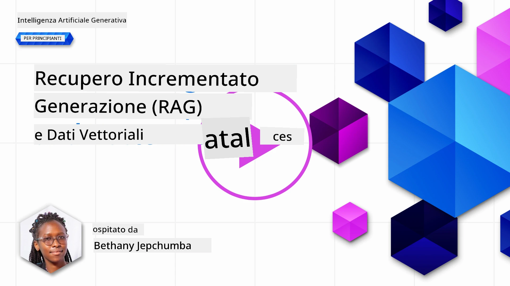
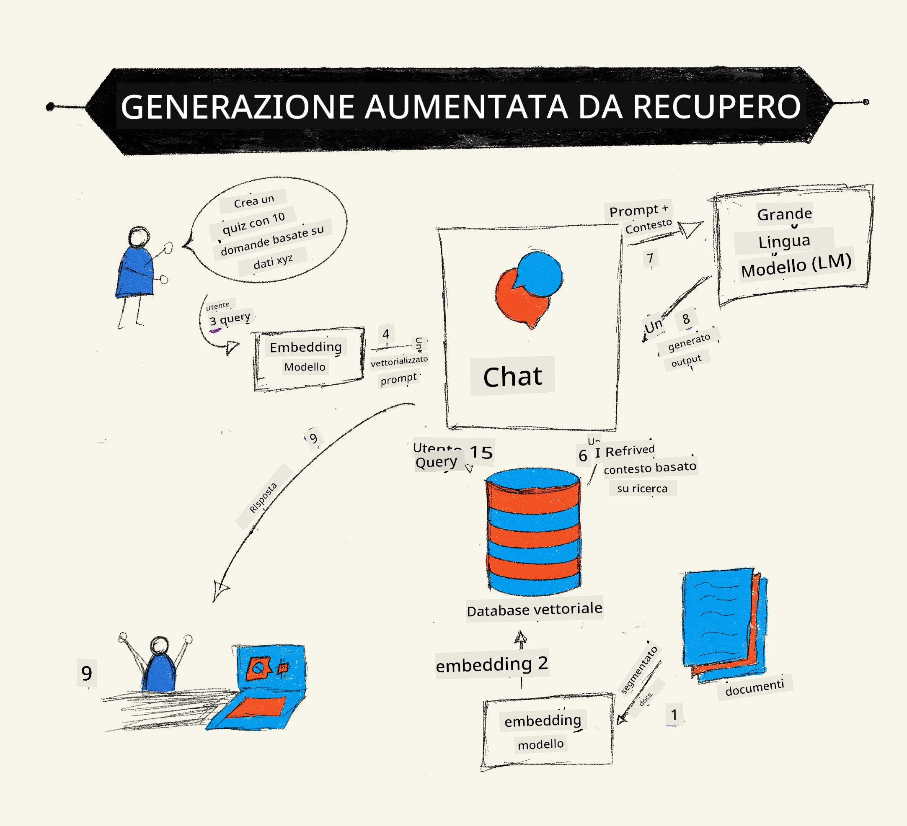
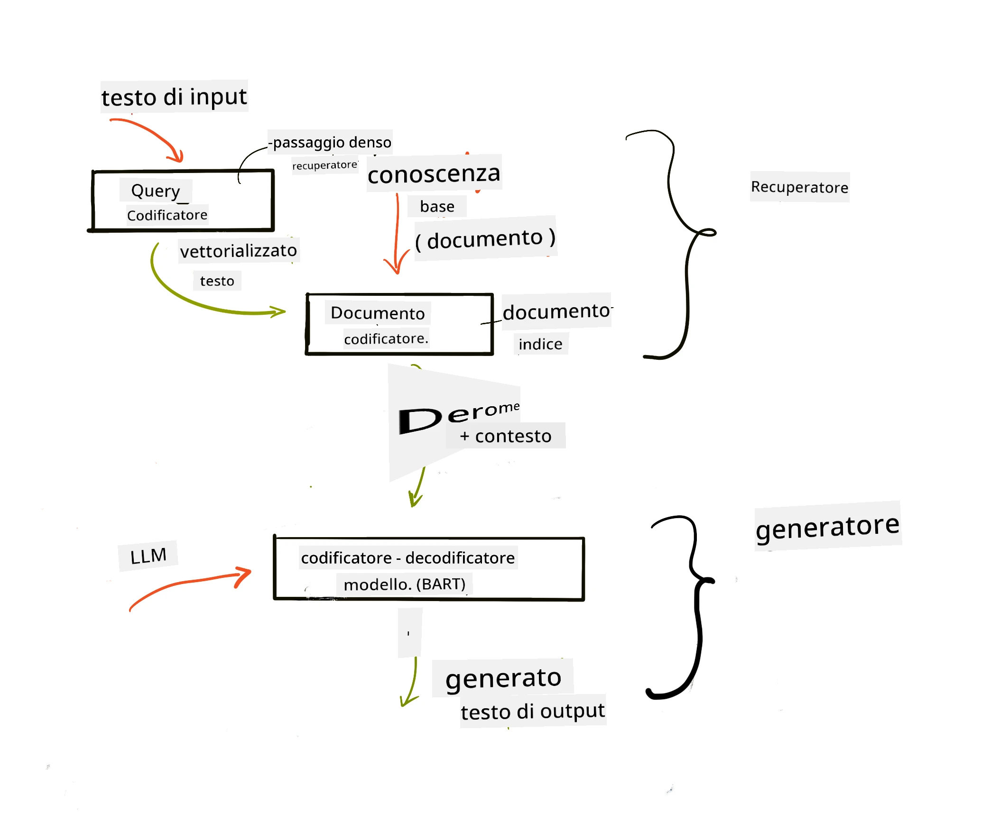
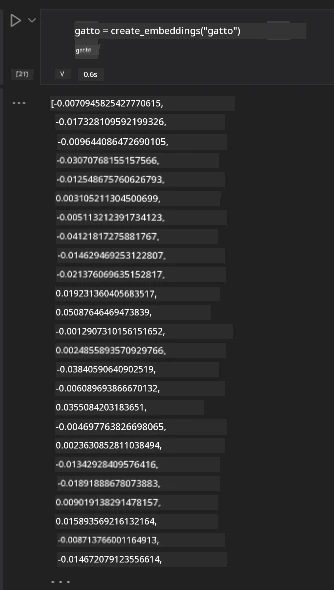

# Generazione Aumentata dal Recupero (RAG) e Database Vettoriali

[](https://youtu.be/4l8zhHUBeyI?si=BmvDmL1fnHtgQYkL)

Nella lezione sulle applicazioni di ricerca, abbiamo brevemente imparato come integrare i propri dati nei Modelli di Linguaggio Estesi (LLM). In questa lezione, approfondiremo i concetti di ancoraggio dei tuoi dati nella tua applicazione LLM, la meccanica del processo e i metodi per memorizzare i dati, includendo sia gli embedding che il testo.

> **Video in arrivo**

## Introduzione

In questa lezione copriremo i seguenti argomenti:

- Un'introduzione a RAG, cos'è e perché viene usato nell'IA (intelligenza artificiale).

- Comprendere cosa sono i database vettoriali e creare uno per la nostra applicazione.

- Un esempio pratico su come integrare RAG in un'applicazione.

## Obiettivi di Apprendimento

Dopo aver completato questa lezione, sarai in grado di:

- Spiegare l'importanza di RAG nel recupero e nella elaborazione dei dati.

- Configurare un'applicazione RAG e ancorare i tuoi dati a un LLM

- Integrazione efficace di RAG e database vettoriali nelle applicazioni LLM.

## Il Nostro Scenario: migliorare i nostri LLM con i nostri dati

Per questa lezione, vogliamo aggiungere le nostre note nella startup educativa, che permette al chatbot di ottenere più informazioni sulle diverse materie. Utilizzando le note che abbiamo, gli studenti saranno in grado di studiare meglio e comprendere meglio i vari argomenti, facilitando la revisione per gli esami. Per creare il nostro scenario, useremo:

- `Azure OpenAI:` il LLM che useremo per creare il nostro chatbot

- `Lezione AI per principianti sulle Reti Neurali`: questi saranno i dati su cui ancorare il nostro LLM

- `Azure AI Search` e `Azure Cosmos DB:` database vettoriale per memorizzare i nostri dati e creare un indice di ricerca

Gli utenti potranno creare quiz pratici dalle loro note, schede di revisione e riassumerle in panoramiche concise. Per iniziare, guardiamo cos’è RAG e come funziona:

## Generazione Aumentata dal Recupero (RAG)

Un chatbot alimentato da un LLM elabora i prompt dell’utente per generare risposte. È progettato per essere interattivo e si impegna con gli utenti su un'ampia gamma di argomenti. Tuttavia, le sue risposte sono limitate al contesto fornito e ai dati di addestramento fondamentali. Per esempio, il cutoff di conoscenza di GPT-4 è settembre 2021, il che significa che non conosce eventi successivi a questo periodo. Inoltre, i dati usati per addestrare i LLM escludono informazioni riservate come appunti personali o manuali di prodotti aziendali.

### Come funzionano i RAG (Generazione Aumentata dal Recupero)



Supponiamo tu voglia distribuire un chatbot che crea quiz dalle tue note, avrai bisogno di una connessione alla base di conoscenza. Qui entra in gioco il RAG. I RAG operano come segue:

- **Base di conoscenza:** Prima del recupero, questi documenti devono essere acquisiti e preprocessati, tipicamente suddividendo grandi documenti in parti più piccole, trasformandoli in embedding di testo e memorizzandoli in un database.

- **Query Utente:** l’utente formula una domanda

- **Recupero:** Quando un utente pone una domanda, il modello di embedding recupera informazioni rilevanti dalla nostra base di conoscenza per fornire un contesto maggiore che sarà integrato nel prompt.

- **Generazione Aumentata:** il LLM migliora la sua risposta basandosi sui dati recuperati. Questo permette che la risposta generata non si basi solo su dati pre-addestrati ma anche su informazioni rilevanti provenienti dal contesto aggiunto. I dati recuperati sono usati per arricchire le risposte del LLM. Il LLM quindi restituisce una risposta alla domanda dell’utente.



L'architettura dei RAG è implementata usando transformers composti da due parti: un encoder e un decoder. Per esempio, quando un utente fa una domanda, il testo d'ingresso viene 'codificato' in vettori che catturano il significato delle parole, e i vettori sono 'decodificati' nel nostro indice documenti generando nuovo testo basato sulla query dell’utente. Il LLM usa un modello encoder-decoder per generare l'output.

Due approcci per implementare RAG secondo il paper proposto: [Retrieval-Augmented Generation for Knowledge intensive NLP (natural language processing software) Tasks](https://arxiv.org/pdf/2005.11401.pdf?WT.mc_id=academic-105485-koreyst) sono:

- **_RAG-Sequence_** usando documenti recuperati per predire la migliore risposta possibile a una query dell’utente

- **RAG-Token** usando documenti per generare il token successivo, poi recuperarli per rispondere alla query dell’utente

### Perché usare i RAG? 

- **Ricchezza informativa:** assicura che le risposte testuali siano aggiornate e attuali. Migliora quindi le performance su compiti specifici di dominio accedendo alla base di conoscenza interna.

- Riduce la fabbricazione utilizzando **dati verificabili** nella base di conoscenza per fornire contesto alle query dell’utente.

- È **economico** poiché più conveniente rispetto al fine-tuning di un LLM

## Creazione di una base di conoscenza

La nostra applicazione si basa sui nostri dati personali, ossia la lezione sulle Reti Neurali del curriculum AI per Principianti.

### Database Vettoriali

Un database vettoriale, a differenza dei database tradizionali, è un database specializzato progettato per memorizzare, gestire e ricercare vettori embeddati. Memorizza rappresentazioni numeriche dei documenti. Suddividere i dati in embedding numerici facilita la comprensione e l'elaborazione dei dati da parte del nostro sistema AI.

Conserviamo i nostri embedding nei database vettoriali perché i LLM hanno un limite al numero di token che possono accettare in input. Poiché non puoi passare gli embedding interi a un LLM, dobbiamo suddividerli in chunk e quando un utente fa una domanda, gli embedding più simili alla domanda verranno restituiti assieme al prompt. Il chunking riduce anche i costi sul numero di token processati dall’LLM.

Alcuni database vettoriali popolari includono Azure Cosmos DB, Clarifyai, Pinecone, Chromadb, ScaNN, Qdrant e DeepLake. Puoi creare un modello Azure Cosmos DB usando Azure CLI con il seguente comando:

```bash
az login
az group create -n <resource-group-name> -l <location>
az cosmosdb create -n <cosmos-db-name> -r <resource-group-name>
az cosmosdb list-keys -n <cosmos-db-name> -g <resource-group-name>
```

### Da testo a embedding

Prima di memorizzare i nostri dati, dobbiamo convertirli in vettori embedding prima di salvarli nel database. Se lavori con documenti grandi o testi lunghi, puoi suddividerli in chunk basati sulle query che ti aspetti. Il chunking può essere fatto a livello di frase o di paragrafo. Poiché il chunking deriva il significato dalle parole circostanti, puoi aggiungere altro contesto a un chunk, per esempio includendo il titolo del documento o del testo prima o dopo il chunk. Puoi suddividere i dati come segue:

```python
def split_text(text, max_length, min_length):
    words = text.split()
    chunks = []
    current_chunk = []

    for word in words:
        current_chunk.append(word)
        if len(' '.join(current_chunk)) < max_length and len(' '.join(current_chunk)) > min_length:
            chunks.append(' '.join(current_chunk))
            current_chunk = []

    # Se l'ultimo blocco non ha raggiunto la lunghezza minima, aggiungilo comunque
    if current_chunk:
        chunks.append(' '.join(current_chunk))

    return chunks
```

Una volta suddivisi in chunk, possiamo quindi embeddare il nostro testo usando diversi modelli di embedding. Alcuni modelli che puoi usare includono: word2vec, ada-002 di OpenAI, Azure Computer Vision e molti altri. La scelta del modello dipenderà dalle lingue usate, dal tipo di contenuto codificato (testo/immagini/audio), dalla dimensione dell’input che può codificare e dalla lunghezza dell’embedding di output.

Un esempio di testo embeddato usando il modello `text-embedding-ada-002` di OpenAI è:


## Recupero e Ricerca Vettoriale

Quando un utente fa una domanda, il retriever la trasforma in un vettore usando il query encoder, quindi cerca nel nostro indice di ricerca i vettori rilevanti nei documenti correlati all’input. Terminata la ricerca, converte sia il vettore in input sia i vettori dei documenti in testo e li passa al LLM.

### Recupero

Il recupero avviene quando il sistema tenta di trovare rapidamente i documenti nell’indice che soddisfano i criteri di ricerca. Lo scopo del retriever è ottenere documenti che saranno usati per fornire contesto e ancorare il LLM sui tuoi dati.

Ci sono diversi modi per effettuare la ricerca nel nostro database come:

- **Ricerca per parola chiave** - usata per ricerche testuali

- **Ricerca vettoriale** - converte i documenti da testo a rappresentazioni vettoriali usando modelli di embedding, permettendo una **ricerca semantica** basata sul significato delle parole. Il recupero sarà fatto interrogando i documenti le cui rappresentazioni vettoriali sono le più vicine alla domanda dell’utente.

- **Ibrida** - una combinazione di ricerca per parola chiave e vettoriale.

Una sfida nel recupero si presenta quando non ci sono risposte simili alla query nel database; il sistema restituirà allora la migliore informazione disponibile, tuttavia puoi usare tattiche come impostare la distanza massima per la rilevanza o usare la ricerca ibrida che combina ricerca per parola chiave e vettoriale. In questa lezione useremo la ricerca ibrida, una combinazione di ricerca vettoriale e per parola chiave. Memorizzeremo i dati in un dataframe con colonne contenenti sia i chunk sia gli embedding.

### Similarità Vettoriale

Il retriever cercherà nella base di conoscenza embedding vicini tra loro, i vicini più prossimi, in quanto sono testi simili. Nello scenario in cui un utente fa una domanda, questa viene prima embeddato e poi confrontato con embedding simili. La misura comune usata per trovare la somiglianza tra vettori è la similarità coseno basata sull’angolo tra due vettori.

Possiamo misurare la similarità usando altre alternative come la distanza Euclidea, che è la linea retta tra le estremità dei vettori, e il prodotto scalare che misura la somma dei prodotti degli elementi corrispondenti di due vettori.

### Indice di ricerca

Per effettuare il recupero, dobbiamo costruire un indice di ricerca per la base di conoscenza prima di effettuare la ricerca. Un indice memorizza i nostri embedding e può rapidamente recuperare i chunk più simili anche in un database di grandi dimensioni. Possiamo creare il nostro indice localmente usando:

```python
from sklearn.neighbors import NearestNeighbors

embeddings = flattened_df['embeddings'].to_list()

# Crea l'indice di ricerca
nbrs = NearestNeighbors(n_neighbors=5, algorithm='ball_tree').fit(embeddings)

# Per interrogare l'indice, puoi usare il metodo kneighbors
distances, indices = nbrs.kneighbors(embeddings)
```

### Ri-classificazione

Una volta interrogato il database, potresti voler ordinare i risultati dal più rilevante in giù. Un LLM di ri-classificazione utilizza il Machine Learning per migliorare la rilevanza dei risultati di ricerca ordinandoli dal più rilevante. Usando Azure AI Search, il riordinamento è eseguito automaticamente usando un ri-classificatore semantico. Un esempio di come funziona il riordinamento usando vicini più prossimi:

```python
# Trova i documenti più simili
distances, indices = nbrs.kneighbors([query_vector])

index = []
# Stampa i documenti più simili
for i in range(3):
    index = indices[0][i]
    for index in indices[0]:
        print(flattened_df['chunks'].iloc[index])
        print(flattened_df['path'].iloc[index])
        print(flattened_df['distances'].iloc[index])
    else:
        print(f"Index {index} not found in DataFrame")
```

## Mettere tutto insieme

L’ultimo passo è aggiungere il nostro LLM al mix per poter ottenere risposte ancorate sui nostri dati. Possiamo implementarlo come segue:

```python
user_input = "what is a perceptron?"

def chatbot(user_input):
    # Convertire la domanda in un vettore di query
    query_vector = create_embeddings(user_input)

    # Trovare i documenti più simili
    distances, indices = nbrs.kneighbors([query_vector])

    # aggiungere i documenti alla query per fornire contesto
    history = []
    for index in indices[0]:
        history.append(flattened_df['chunks'].iloc[index])

    # combinare la storia e l'input dell'utente
    history.append(user_input)

    # creare un oggetto messaggio
    messages=[
        {"role": "system", "content": "You are an AI assistant that helps with AI questions."},
        {"role": "user", "content": "\n\n".join(history) }
    ]

    # utilizzare l'API Responses per generare una risposta
    response = client.responses.create(
        model="gpt-4o-mini",
        temperature=0.7,
        max_output_tokens=800,
        input=messages,
        store=False,
    )

    return response.output_text

chatbot(user_input)
```

## Valutazione della nostra applicazione

### Metriche di Valutazione

- Qualità delle risposte fornite assicurandosi che suonino naturali, fluide e simili a risposte umane

- Ancoraggio dei dati: valutare se la risposta proviene dai documenti forniti

- Rilevanza: valutare se la risposta corrisponde ed è correlata alla domanda posta

- Fluidità - se la risposta ha senso grammaticalmente

## Casi d’Uso per l’uso di RAG (Generazione Aumentata dal Recupero) e database vettoriali

Ci sono molti diversi casi d’uso in cui le chiamate a funzione possono migliorare la tua app come:

- Domande e Risposte: ancorare i dati aziendali a una chat che può essere usata dai dipendenti per fare domande.

- Sistemi di Raccomandazione: dove puoi creare un sistema che abbina i valori più simili es. film, ristoranti e molti altri.

- Servizi chatbot: puoi memorizzare la cronologia della chat e personalizzare la conversazione basata sui dati dell’utente.

- Ricerca di immagini basata su embedding vettoriale, utile per il riconoscimento di immagini e il rilevamento di anomalie.

## Riepilogo

Abbiamo coperto le aree fondamentali di RAG partendo dall’aggiunta dei nostri dati all’applicazione, alla query utente fino all’output. Per semplificare la creazione di RAG, puoi usare framework come Semantic Kernel, Langchain o Autogen.

## Compito

Per continuare il tuo apprendimento sulla Generazione Aumentata dal Recupero (RAG) puoi costruire:

- Costruisci un front-end per l’applicazione usando il framework di tua scelta

- Utilizza un framework, LangChain o Semantic Kernel, e ricrea la tua applicazione.

Congratulazioni per aver completato la lezione 👏.

## L’apprendimento non finisce qui, continua il viaggio

Dopo aver completato questa lezione, consulta la nostra [collezione di apprendimento sull’IA Generativa](https://aka.ms/genai-collection?WT.mc_id=academic-105485-koreyst) per continuare a migliorare la tua conoscenza sull’IA Generativa!

---

<!-- CO-OP TRANSLATOR DISCLAIMER START -->
**Disclaimer**:
Questo documento è stato tradotto utilizzando il servizio di traduzione AI [Co-op Translator](https://github.com/Azure/co-op-translator). Sebbene ci impegniamo per garantire la precisione, si prega di notare che le traduzioni automatizzate possono contenere errori o imprecisioni. Il documento originale nella sua lingua nativa deve essere considerato la fonte autorevole. Per informazioni critiche, si raccomanda una traduzione professionale effettuata da un essere umano. Non siamo responsabili per eventuali malintesi o interpretazioni errate derivanti dall’uso di questa traduzione.
<!-- CO-OP TRANSLATOR DISCLAIMER END -->